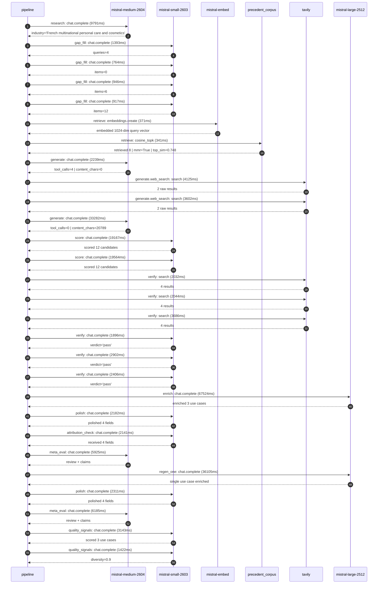

# Pipeline blueprint (architecture)

Static view of the pipeline regardless of run timing — shows agents,
models, and gates. The chronological execution log follows below.

```mermaid
flowchart TD
    Start([User: company name]) --> R
    R["<b>1. Research</b><br/>parallel: Wikipedia · Tavily news ·<br/>existing initiatives · live verification<br/><i>mistral-medium</i> synthesis"]
    R --> G["<b>1b. Gap-fill</b><br/>identify missing fields →<br/><i>mistral-small</i> generates queries →<br/>Tavily search per field →<br/><i>mistral-small</i> per-field extraction"]
    G --> Conf{Confidence ≥ 0.5<br/>OR verified<br/>OR ≥ 1 existing initiative?}
    Conf -->|no| Refuse([Refusal])
    Conf -->|yes| Ret
    Ret["<b>2. Retrieve</b><br/><i>mistral-embed</i> on company query →<br/>cosine top-K + industry/depth filter +<br/>MMR diversification"]
    Ret --> Gen["<b>3. Generate 12 candidates</b><br/><i>mistral-medium</i> with web_search tool<br/>(Tavily + deep-read) — fact citations<br/>flow into the EvidenceLedger"]
    Gen --> Score["<b>4. Score</b><br/>self-consistency: 2 parallel passes<br/><i>mistral-small</i> @ T=0.2 and T=0.4 →<br/>aggregate weighted scores"]
    Score --> Verify["<b>5. Per-candidate verify</b><br/>top-3: Tavily search + deep-read +<br/><i>mistral-small</i> verdict (pass /<br/>partial / confirmed_existing)"]
    Verify --> Enrich["<b>6. Enrich</b><br/><i>mistral-large</i> drafts customer-facing<br/>prose for 3 use cases (or<br/><i>mistral-medium</i> on fast tier)"]
    Enrich --> NumScrub["<b>6a. Numeric scrub</b><br/>flag any number not in cited content"]
    NumScrub --> Polish["<b>6b. Polish</b><br/><i>mistral-small</i> per use case (parallel):<br/>convert markers→qualitative,<br/>(ev-XXX)→[title](url)"]
    Polish --> Attr["<b>6c. Attribution check</b><br/><i>mistral-small</i> per use case (parallel):<br/>fix corpus-ID ↔ company mismatches"]
    Attr --> Meta["<b>7. Meta-evaluation</b><br/><i>mistral-medium</i> reviews report against<br/>cited precedents + ledger entries:<br/>strict claim verification"]
    Meta --> RegenQ{confidence < 0.6<br/>AND not fast tier?}
    RegenQ -->|yes| Regen["<b>7b. Targeted regen</b><br/><i>mistral-large</i> re-enriches just the<br/>weakest use case with the next-best<br/>near-miss; re-runs meta-eval"]
    RegenQ -->|no| QS
    Regen --> QS
    QS["<b>Quality signals</b><br/>LLM-graded diversity + specificity,<br/>fact-check pass rate, TTV/cost spread"]
    QS --> Render([Markdown report + trace])

    classDef agent fill:#fef3c7,stroke:#f59e0b
    classDef gate fill:#dbeafe,stroke:#3b82f6
    classDef io fill:#dcfce7,stroke:#16a34a
    class R,G,Ret,Gen,Score,Verify,Enrich,NumScrub,Polish,Attr,Meta,Regen,QS agent
    class Conf,RegenQ gate
    class Start,Refuse,Render io
```

## Execution trace — L'Oreal

Started: `2026-05-08T23:13:46.949908+00:00`. Total wall time: `230.0s` across `28` recorded actions.

### Per-step time totals

| Step | Calls | Total time | Avg time |
|---|---:|---:|---:|
| `research` | 1 | 9.79s | 9791ms |
| `gap_fill` | 4 | 4.02s | 1005ms |
| `retrieve` | 2 | 0.71s | 356ms |
| `generate` | 2 | 35.52s | 17761ms |
| `generate.web_search` | 2 | 7.73s | 3863ms |
| `score` | 2 | 38.73s | 19365ms |
| `verify` | 6 | 14.97s | 2495ms |
| `enrich` | 1 | 67.52s | 67524ms |
| `polish` | 2 | 4.49s | 2247ms |
| `attribution_check` | 1 | 2.14s | 2141ms |
| `meta_eval` | 2 | 12.11s | 6055ms |
| `regen_one` | 1 | 36.11s | 36105ms |
| `quality_signals` | 2 | 4.56s | 2282ms |

### Chronological event log

- `23:13:50.381` **[research]** `mistral-medium-2604.chat.complete` — 9791ms
   - inputs: synthesize CompanyContext for L'Oreal | depth=medium
   - outputs: industry='French multinational personal care and cosmetics' verified=True conf=0.75
- `23:14:01.974` **[gap_fill]** `mistral-small-2603.chat.complete` — 1393ms
   - inputs: generate gap queries | fields=['business_model', 'products', 'data_assets', 'priorities']
   - outputs: queries=4
- `23:14:11.082` **[gap_fill]** `mistral-small-2603.chat.complete` — 764ms
   - inputs: layer-2 extract field=data_assets
   - outputs: items=0
- `23:14:11.056` **[gap_fill]** `mistral-small-2603.chat.complete` — 946ms
   - inputs: layer-2 extract field=priorities
   - outputs: items=6
- `23:14:11.104` **[gap_fill]** `mistral-small-2603.chat.complete` — 917ms
   - inputs: layer-2 extract field=products
   - outputs: items=12
- `23:14:12.059` **[retrieve]** `mistral-embed.embeddings.create` — 371ms
   - inputs: company_query | industries='French multinational personal care and cosmetics'
   - outputs: embedded 1024-dim query vector
- `23:14:12.430` **[retrieve]** `precedent_corpus.cosine_topk` — 341ms
   - inputs: k=8 min_depth=0.4 target="L'Oreal"
   - outputs: retrieved 8 | mmr=True | top_sim=0.748
- `23:14:14.113` **[generate]** `mistral-medium-2604.chat.complete` — 2239ms
   - inputs: iteration=0 tool_calls_used=0/2 tools=on
   - outputs: tool_calls=4 | content_chars=0
- `23:14:16.370` **[generate.web_search]** `tavily.search` — 4125ms
   - inputs: query="L'Oréal proprietary datasets skin tone product formulas patents"
   - outputs: 2 raw results
- `23:14:22.405` **[generate.web_search]** `tavily.search` — 3602ms
   - inputs: query="L'Oréal sustainability 2030 goals green sciences packaging"
   - outputs: 2 raw results
- `23:14:27.513` **[generate]** `mistral-medium-2604.chat.complete` — 33282ms
   - inputs: iteration=1 tool_calls_used=2/2 tools=off
   - outputs: tool_calls=0 | content_chars=20789
- `23:15:01.113` **[score]** `mistral-small-2603.chat.complete` — 19167ms
   - inputs: self-consistency pass T=0.2
   - outputs: scored 12 candidates
- `23:15:01.116` **[score]** `mistral-small-2603.chat.complete` — 19564ms
   - inputs: self-consistency pass T=0.4
   - outputs: scored 12 candidates
- `23:15:20.740` **[verify]** `tavily.search` — 2032ms
   - inputs: candidate=loreal-sustainability-compliance-agent | query="L'Oreal Automated sustainability compliance agent for packag"
   - outputs: 4 results
- `23:15:20.740` **[verify]** `tavily.search` — 2044ms
   - inputs: candidate=loreal-ai-powered-sampling | query="L'Oreal AI-driven personalized product sampling for targeted"
   - outputs: 4 results
- `23:15:20.740` **[verify]** `tavily.search` — 3686ms
   - inputs: candidate=loreal-patent-insights-agent | query="L'Oreal AI-powered patent insights agent for competitive int"
   - outputs: 4 results
- `23:15:23.607` **[verify]** `mistral-small-2603.chat.complete` — 1896ms
   - inputs: verdict for loreal-ai-powered-sampling
   - outputs: verdict='pass'
- `23:15:23.646` **[verify]** `mistral-small-2603.chat.complete` — 2902ms
   - inputs: verdict for loreal-sustainability-compliance-agent
   - outputs: verdict='pass'
- `23:15:26.842` **[verify]** `mistral-small-2603.chat.complete` — 2406ms
   - inputs: verdict for loreal-patent-insights-agent
   - outputs: verdict='pass'
- `23:15:29.284` **[enrich]** `mistral-large-2512.chat.complete` — 67524ms
   - inputs: tier=standard top_3=['loreal-sustainability-compliance-agent', 'loreal-patent-insights-agent', 'loreal-ai-powered-sampling']
   - outputs: enriched 3 use cases
- `23:16:36.811` **[polish]** `mistral-small-2603.chat.complete` — 2182ms
   - inputs: use_case=loreal-sustainability-compliance-agent unanchored=True opaque_ev=False
   - outputs: polished 4 fields
- `23:16:38.994` **[attribution_check]** `mistral-small-2603.chat.complete` — 2141ms
   - inputs: use_case=loreal-patent-insights-agent cited_ids=['google_cloud_1302-978f0a543d']
   - outputs: received 4 fields
- `23:16:41.167` **[meta_eval]** `mistral-medium-2604.chat.complete` — 5925ms
   - inputs: reviewing 3 use cases
   - outputs: review + claims
- `23:16:47.128` **[regen_one]** `mistral-large-2512.chat.complete` — 36105ms
   - inputs: replace weakest=loreal-ai-powered-sampling with loreal-ai-supply-chain-forecasting
   - outputs: single use case enriched
- `23:17:23.234` **[polish]** `mistral-small-2603.chat.complete` — 2311ms
   - inputs: use_case=loreal-ai-supply-chain-forecasting unanchored=True opaque_ev=False
   - outputs: polished 4 fields
- `23:17:25.582` **[meta_eval]** `mistral-medium-2604.chat.complete` — 6185ms
   - inputs: reviewing 3 use cases
   - outputs: review + claims
- `23:17:32.382` **[quality_signals]** `mistral-small-2603.chat.complete` — 3143ms
   - inputs: specificity grade (3 use cases)
   - outputs: scored 3 use cases
- `23:17:35.525` **[quality_signals]** `mistral-small-2603.chat.complete` — 1422ms
   - inputs: diversity grade
   - outputs: diversity=0.9

## Mermaid sequence diagram (execution)

