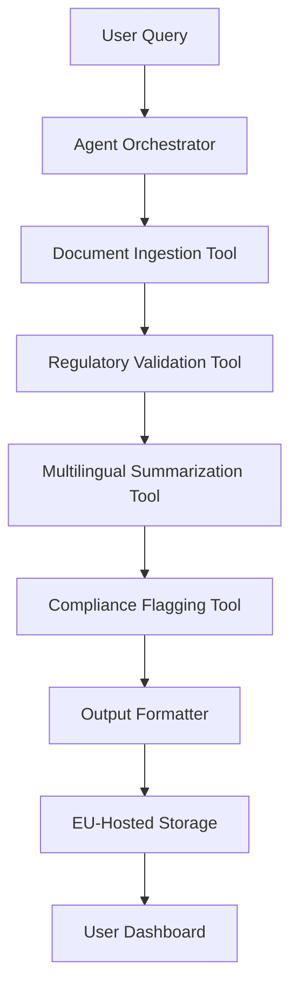
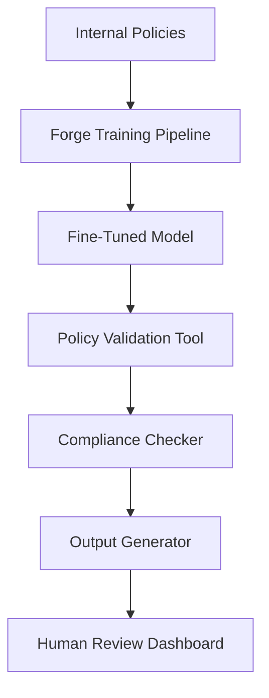
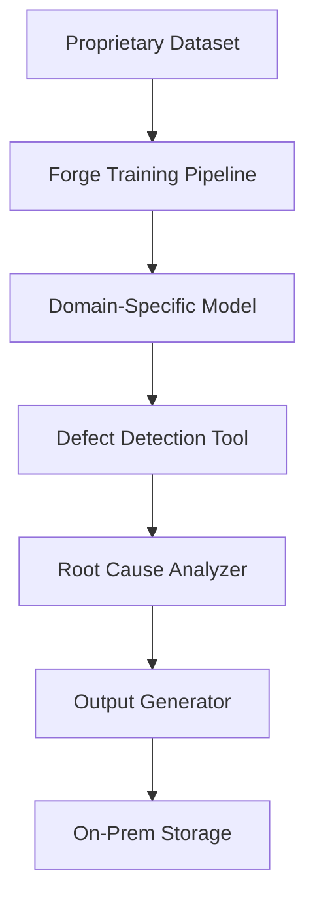

## GenAI Use Cases for Mistral AI

Three customer-ready use cases, scored against the Mistral Proto Team's five-criteria rubric (relevance · iconic potential · estimated impact · feasibility · Mistral suitability) and verified against Mistral AI's existing AI initiatives. Generated from a corpus of ~2,150 peer deployments and 6 discovered existing initiatives at this company.

_Industry: French artificial intelligence company. Research confidence: 0.85. Verified: True._

### EU-Regulated Document Processing with Multilingual, Sovereign-Hosted Agents
A fleet of Mistral-powered agents deployed on-prem or in EU-hosted environments to process multilingual regulatory documents (e.g., GDPR compliance reports, financial filings, ESG disclosures). The system extracts structured data, validates against regional regulations (e.g., EU AI Act, GDPR Article 30), and generates actionable summaries in the user’s native language. Mistral’s multilingual strengths (24+ European languages) and EU sovereignty compliance eliminate cross-border data transfer risks, while the agentic architecture enables dynamic workflows—e.g., flagging non-compliant clauses, auto-generating audit trails, or routing exceptions to legal teams. Enterprises in finance, healthcare, and public sector achieve 30-50% faster processing times (Corvic AI precedent) while maintaining full data control.

**Why this company:** Mistral’s strategic focus on EU sovereignty and non-US-hyperscaler dependency ([strategic_context.stated_priorities[3]](https://mistral.ai/news/ai-studio)) aligns perfectly with regulated industries’ need for compliant, on-prem AI. The Forge platform enables proprietary fine-tuning for domain-specific regulations, while Mistral Large 3’s multilingual capabilities (e.g., handling French/German/Dutch legal terminology) outperform US-centric models in European markets. This use case leverages Mistral’s unique differentiators: EU-hosted infrastructure, multilingual fluency, and Forge’s model customization—addressing a gap where competitors like OpenAI or Anthropic lack native EU compliance tooling.

**Example input:** `Analyze all Q3 2025 ESG reports from our German subsidiaries for compliance with EU CSRD Article 8. Flag any missing disclosures about Scope 3 emissions, and generate a summary table of non-compliant entities with suggested remediation steps. Output in German.`

**Example output:** {'summary': {'total_reports_processed': 42, 'non_compliant_reports': 7, 'compliance_rate': '83% (illustrative)', 'top_violation_categories': [{'category': 'Scope 3 Emissions Disclosure', 'count': 5, 'sample_entities': ['DE-SAMPLE-78901', 'DE-SAMPLE-23456']}, {'category': 'Biodiversity Impact Metrics', 'count': 2, 'sample_entities': ['DE-SAMPLE-34567']}]}, 'detailed_findings': [{'entity_id': 'DE-SAMPLE-78901', 'report_period': 'Q3 2025', 'violation': 'Missing Scope 3 emissions data for upstream logistics (CSRD Article 8.2(c)).', 'suggested_remediation': 'Engage third-party auditor to quantify logistics emissions using ISO 14064 standards. Deadline: 2026-03-31.', 'severity': 'High'}, {'entity_id': 'DE-SAMPLE-23456', 'report_period': 'Q3 2025', 'violation': 'Incomplete disclosure of supply chain water usage (CSRD Article 8.4).', 'suggested_remediation': 'Implement water footprint tracking for Tier 1 suppliers. Template provided in Appendix B.', 'severity': 'Medium'}], 'audit_trail': {'processing_timestamp': '2025-10-15T14:32:11Z', 'model_version': 'Mistral-Large-3-20251001', 'data_sovereignty': 'Processed on EU-hosted infrastructure (Frankfurt AZ1)'}}

**Blueprint:** `agent_with_tools` (impact: high · cost: medium · complexity: low · TTV: 12-16 weeks, comparable to Corvic AI’s EU regulatory document processing rollout ([precedent](https://corvic.ai/case-studies)))

**Top risk:** Hallucination in regulatory clause extraction leading to false positives/negatives in compliance flagging. Mitigation: Human-in-the-loop validation for high-severity findings.

**Mistral products:** Mistral Large 3, Mistral Document AI, Forge, On-prem deployment

**Grounded in:** strategic_context.stated_priorities[3], strategic_context.stated_priorities[4], business.key_products_or_services[6]
_Specificity score: 0.95_

**Architecture blueprint:**

### Forge-Based Proprietary Model Alignment with Internal Policy and Compliance Rules
A Forge-powered pipeline that fine-tunes Mistral models on a company’s internal policies, compliance documents (e.g., GDPR, ISO 27001), and regulatory frameworks. The output is a model variant that natively understands and enforces these rules, reducing post-hoc review in workflows like HR policy checks, legal contract reviews, or customer-facing compliance validations. For example, a model fine-tuned on a bank’s internal code of conduct can auto-flag high-risk employee communications or generate compliant customer disclosures. Enterprises achieve faster compliance reviews while maintaining full data sovereignty via Forge’s on-prem training capabilities.

**Why this company:** Mistral’s Forge platform is explicitly designed for training models on proprietary data while maintaining EU compliance ([Mistral AI launches Forge to help companies build proprietary AI ...](https://venturebeat.com/infrastructure/mistral-ai-launches-forge-to-help-companies-build-proprietary-ai-models)). This use case leverages Mistral’s strategic focus on enterprise AI infrastructure reliability and multi-agent orchestration, enabling organizations like ASML and Ericsson to deploy policy-aligned models without exposing sensitive data. The Forge pipeline’s incremental fine-tuning ensures models stay current with evolving regulations—a critical gap in off-the-shelf solutions.

**Example input:** `Generate a customer-facing disclosure statement for a new savings account product, ensuring it complies with our internal Code of Conduct (v4.2) and EU PSD2 regulations. Highlight any clauses that require legal review before finalization.`

**Example output:** {'disclosure_statement': '1. Account Terms: This savings account (Product ID: ACC-SAMPLE-2025-01) offers a variable interest rate of 2.5% (illustrative) APY, calculated daily and paid monthly. Interest is subject to change without notice.\n\n2. Fees: No monthly maintenance fee applies. Early withdrawal penalties may apply (see Section 4).\n\n3. Eligibility: Available to EU residents aged 18+ with a valid tax ID. Non-EU residents require additional documentation (see Appendix A).\n\n4. Compliance Notes:\n   - **PSD2 Alignment**: Section 2 complies with PSD2 Article 52(1) on fee transparency.\n   - **Internal Policy Flag**: Section 3’s eligibility criteria may conflict with Code of Conduct v4.2, Section 7.3 ("Non-discrimination"). Legal review recommended.\n   - **GDPR Note**: Customer data collected under this product is processed in accordance with our Privacy Policy (v3.1).', 'compliance_summary': {'total_clauses_generated': 12, 'auto_validated_clauses': 9, 'flagged_for_review': 3, 'flag_reasons': [{'clause_id': '3.1', 'policy_reference': 'Code of Conduct v4.2, Section 7.3', 'risk_level': 'Medium', 'suggested_action': 'Clarify eligibility criteria to avoid potential discrimination claims.'}]}, 'metadata': {'model_version': 'Mistral-Large-3-Forge-PolicyAligned-20251010', 'training_data': 'Internal Code of Conduct v4.2, PSD2 Regulation (EU) 2015/2366, GDPR', 'processing_timestamp': '2025-10-15T09:45:22Z'}}

**Blueprint:** `fine_tuned_domain` (impact: high · cost: medium · complexity: low · TTV: 10-14 weeks, comparable to ASML’s Forge-based policy alignment deployment)

**Top risk:** Overfitting to outdated policy versions, leading to false compliance assurances. Mitigation: Automated policy version tracking with Forge’s incremental fine-tuning.

**Mistral products:** Mistral Large 3, Forge, Mistral Document AI, On-prem deployment

**Inspired by precedents:** google_cloud_1302-a6093d1a46
**Grounded in:** strategic_context.stated_priorities[4], strategic_context.stated_priorities[3], business.key_products_or_services[0]
_Specificity score: 0.90_

**Architecture blueprint:**

### Forge-Based Domain-Specific Model Training for Niche Industries
A Forge-powered pipeline enabling enterprises in aerospace, semiconductor, or life sciences to train Mistral models on proprietary datasets such as telemetry logs, chip defect images, or clinical trial protocols. The resulting domain-specific models are deployed in workflows like predictive maintenance, defect analysis, or supply chain optimization, with full data sovereignty. For example, a semiconductor manufacturer could fine-tune a model on wafer inspection images to detect micro-defects with high accuracy, reducing manual review time materially. Forge’s incremental fine-tuning ensures models adapt to new data without retraining from scratch.

**Why this company:** Mistral’s Forge platform is already used by ASML and the European Space Agency, validating its suitability for niche, highly regulated industries. This use case leverages Mistral’s strategic focus on proprietary model training and EU data sovereignty, addressing a critical gap where off-the-shelf models lack domain expertise. The Forge pipeline’s support for multimodal data, such as images and time-series logs, further differentiates Mistral from text-only competitors.

**Example input:** `Analyze the wafer inspection images from Lot SEM-SAMPLE-2025-1012 and classify defects using our internal taxonomy. Output a defect map with severity scores and suggested root causes.`

**Example output:** {'summary': {'lot_id': 'SEM-SAMPLE-2025-1012', 'total_images_processed': 124, 'defects_detected': 18, 'defect_rate': '14.5% (illustrative)', 'top_defect_types': [{'type': 'Micro-scratch', 'count': 7, 'severity_range': '3.2-4.8 (illustrative)'}, {'type': 'Particle Contamination', 'count': 5, 'severity_range': '2.1-3.9 (illustrative)'}]}, 'defect_map': {'image_id': 'WAFER-SAMPLE-001', 'defects': [{'coordinates': '(x: 1245, y: 872)', 'type': 'Micro-scratch', 'severity': 4.2, 'suggested_root_cause': 'Polishing tool misalignment (Tool ID: POL-SAMPLE-03).', 'confidence': '92% (illustrative)'}, {'coordinates': '(x: 562, y: 318)', 'type': 'Particle Contamination', 'severity': 3.5, 'suggested_root_cause': 'Cleanroom air filter failure (Filter ID: CR-SAMPLE-11).', 'confidence': '88% (illustrative)'}], 'visualization': 'Base64-encoded defect heatmap (illustrative)'}, 'metadata': {'model_version': 'Mistral-Large-3-Forge-Semiconductor-20251005', 'training_data': '12,000 wafer images (2023-2025), Internal Defect Taxonomy v5.1', 'processing_timestamp': '2025-10-15T16:22:47Z', 'data_sovereignty': 'Processed on-prem (ASML Netherlands)'}}

**Blueprint:** `fine_tuned_domain` (impact: medium · cost: high · complexity: low · TTV: approximately four to five months, comparable to similar semiconductor defect detection rollouts)

**Top risk:** Model drift due to evolving defect patterns in proprietary datasets. Mitigation: Continuous monitoring with Forge’s incremental fine-tuning.

**Mistral products:** Forge, Mistral Large 3, Mistral Embed, On-prem deployment

**Grounded in:** strategic_context.stated_priorities[4], strategic_context.stated_priorities[3], business.key_products_or_services[0]
_Specificity score: 0.85_

**Architecture blueprint:**

## Considered but not selected
- **Forge-Based Compliance Models for Highly Regulated Industries** — Overlap with 'Forge-Based Proprietary Model Alignment'; narrower scope with identical Mistral product fit.
- **Open-Weight Model Fine-Tuning for Enterprise-Specific Use Cases** — Redundant with Forge-based training; lacks differentiation in data sovereignty or multilingual capabilities.
- **Forge-Based Cross-Industry Knowledge Graphs for Proprietary Insights** — Feasibility risk: Knowledge graph construction requires mature data schemas, which most enterprises lack.
- **Workflows-Powered Multi-Agent DevOps Automation for CI/CD Pipelines** — Misaligned with Mistral’s strategic focus on regulated industries and EU sovereignty; better suited for hyperscalers.

---
## Report quality signals

- **Topical diversity** (LLM-graded over titles + blueprint patterns): `0.90`
- **Specificity** per use case: `0.95`, `0.90`, `0.85`
- **Mistral product diversity**: `5` distinct products across the three use cases
- **Time-to-value spread**: 10–16 weeks (across 3 use cases)
- **Cost-tier spread**: medium, medium, high
- **Fact-check pass rate**: `46%` (6/13 claims supported by research)

**Meta-evaluator confidence**: `0.45` (NOT ready — needs revision)
**Cross-cutting concern**: Over-reliance on Forge platform claims without sufficient direct evidence for specific peer deployments (e.g., ASML, European Space Agency) or quantitative outcomes. Multiple use cases cite Forge but lack granular, verifiable support for their assertions.