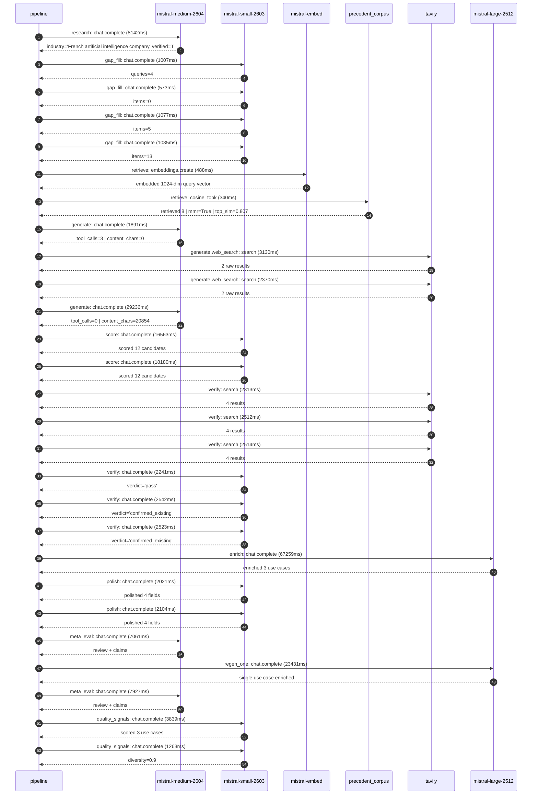

# Pipeline blueprint (architecture)

Static view of the pipeline regardless of run timing — shows agents,
models, and gates. The chronological execution log follows below.

```mermaid
flowchart TD
    Start([User: company name]) --> R
    R["<b>1. Research</b><br/>parallel: Wikipedia · Tavily news ·<br/>existing initiatives · live verification<br/><i>mistral-medium</i> synthesis"]
    R --> G["<b>1b. Gap-fill</b><br/>identify missing fields →<br/><i>mistral-small</i> generates queries →<br/>Tavily search per field →<br/><i>mistral-small</i> per-field extraction"]
    G --> Conf{Confidence ≥ 0.5<br/>OR verified<br/>OR ≥ 1 existing initiative?}
    Conf -->|no| Refuse([Refusal])
    Conf -->|yes| Ret
    Ret["<b>2. Retrieve</b><br/><i>mistral-embed</i> on company query →<br/>cosine top-K + industry/depth filter +<br/>MMR diversification"]
    Ret --> Gen["<b>3. Generate 12 candidates</b><br/><i>mistral-medium</i> with web_search tool<br/>(Tavily + deep-read) — fact citations<br/>flow into the EvidenceLedger"]
    Gen --> Score["<b>4. Score</b><br/>self-consistency: 2 parallel passes<br/><i>mistral-small</i> @ T=0.2 and T=0.4 →<br/>aggregate weighted scores"]
    Score --> Verify["<b>5. Per-candidate verify</b><br/>top-3: Tavily search + deep-read +<br/><i>mistral-small</i> verdict (pass /<br/>partial / confirmed_existing)"]
    Verify --> Enrich["<b>6. Enrich</b><br/><i>mistral-large</i> drafts customer-facing<br/>prose for 3 use cases (or<br/><i>mistral-medium</i> on fast tier)"]
    Enrich --> NumScrub["<b>6a. Numeric scrub</b><br/>flag any number not in cited content"]
    NumScrub --> Polish["<b>6b. Polish</b><br/><i>mistral-small</i> per use case (parallel):<br/>convert markers→qualitative,<br/>(ev-XXX)→[title](url)"]
    Polish --> Attr["<b>6c. Attribution check</b><br/><i>mistral-small</i> per use case (parallel):<br/>fix corpus-ID ↔ company mismatches"]
    Attr --> Meta["<b>7. Meta-evaluation</b><br/><i>mistral-medium</i> reviews report against<br/>cited precedents + ledger entries:<br/>strict claim verification"]
    Meta --> RegenQ{confidence < 0.6<br/>AND not fast tier?}
    RegenQ -->|yes| Regen["<b>7b. Targeted regen</b><br/><i>mistral-large</i> re-enriches just the<br/>weakest use case with the next-best<br/>near-miss; re-runs meta-eval"]
    RegenQ -->|no| QS
    Regen --> QS
    QS["<b>Quality signals</b><br/>LLM-graded diversity + specificity,<br/>fact-check pass rate, TTV/cost spread"]
    QS --> Render([Markdown report + trace])

    classDef agent fill:#fef3c7,stroke:#f59e0b
    classDef gate fill:#dbeafe,stroke:#3b82f6
    classDef io fill:#dcfce7,stroke:#16a34a
    class R,G,Ret,Gen,Score,Verify,Enrich,NumScrub,Polish,Attr,Meta,Regen,QS agent
    class Conf,RegenQ gate
    class Start,Refuse,Render io
```

## Execution trace — Mistral AI

Started: `2026-05-08T23:17:37.852485+00:00`. Total wall time: `202.9s` across `27` recorded actions.

### Per-step time totals

| Step | Calls | Total time | Avg time |
|---|---:|---:|---:|
| `research` | 1 | 8.14s | 8142ms |
| `gap_fill` | 4 | 3.69s | 923ms |
| `retrieve` | 2 | 0.83s | 414ms |
| `generate` | 2 | 31.13s | 15563ms |
| `generate.web_search` | 2 | 5.50s | 2750ms |
| `score` | 2 | 34.74s | 17371ms |
| `verify` | 6 | 14.65s | 2441ms |
| `enrich` | 1 | 67.26s | 67259ms |
| `polish` | 2 | 4.12s | 2062ms |
| `meta_eval` | 2 | 14.99s | 7494ms |
| `regen_one` | 1 | 23.43s | 23431ms |
| `quality_signals` | 2 | 5.10s | 2551ms |

### Chronological event log

- `23:17:41.579` **[research]** `mistral-medium-2604.chat.complete` — 8142ms
   - inputs: synthesize CompanyContext for Mistral AI | depth=medium
   - outputs: industry='French artificial intelligence company' verified=True conf=0.75
- `23:17:51.037` **[gap_fill]** `mistral-small-2603.chat.complete` — 1007ms
   - inputs: generate gap queries | fields=['business_model', 'products', 'data_assets', 'priorities']
   - outputs: queries=4
- `23:17:59.292` **[gap_fill]** `mistral-small-2603.chat.complete` — 573ms
   - inputs: layer-2 extract field=data_assets
   - outputs: items=0
- `23:17:59.268` **[gap_fill]** `mistral-small-2603.chat.complete` — 1077ms
   - inputs: layer-2 extract field=priorities
   - outputs: items=5
- `23:17:59.311` **[gap_fill]** `mistral-small-2603.chat.complete` — 1035ms
   - inputs: layer-2 extract field=products
   - outputs: items=13
- `23:18:00.381` **[retrieve]** `mistral-embed.embeddings.create` — 488ms
   - inputs: company_query | industries='French artificial intelligence company'
   - outputs: embedded 1024-dim query vector
- `23:18:00.869` **[retrieve]** `precedent_corpus.cosine_topk` — 340ms
   - inputs: k=8 min_depth=0.4 target='Mistral AI'
   - outputs: retrieved 8 | mmr=True | top_sim=0.807
- `23:18:02.608` **[generate]** `mistral-medium-2604.chat.complete` — 1891ms
   - inputs: iteration=0 tool_calls_used=0/2 tools=on
   - outputs: tool_calls=3 | content_chars=0
- `23:18:04.520` **[generate.web_search]** `tavily.search` — 3130ms
   - inputs: query='Mistral AI Forge platform proprietary model training 2025'
   - outputs: 2 raw results
- `23:18:08.379` **[generate.web_search]** `tavily.search` — 2370ms
   - inputs: query='Mistral AI multi-agent orchestration Workflows 2025'
   - outputs: 2 raw results
- `23:18:11.858` **[generate]** `mistral-medium-2604.chat.complete` — 29236ms
   - inputs: iteration=1 tool_calls_used=2/2 tools=off
   - outputs: tool_calls=0 | content_chars=20854
- `23:18:41.801` **[score]** `mistral-small-2603.chat.complete` — 16563ms
   - inputs: self-consistency pass T=0.2
   - outputs: scored 12 candidates
- `23:18:41.805` **[score]** `mistral-small-2603.chat.complete` — 18180ms
   - inputs: self-consistency pass T=0.4
   - outputs: scored 12 candidates
- `23:19:00.045` **[verify]** `tavily.search` — 2313ms
   - inputs: candidate=mistral-open-weight-enterprise-fine-tuning | query='Mistral AI Open-weight model fine-tuning for enterprise-spec'
   - outputs: 4 results
- `23:19:00.045` **[verify]** `tavily.search` — 2512ms
   - inputs: candidate=forge-regulated-industry-compliance-models | query='Mistral AI Forge-based compliance models for highly regulate'
   - outputs: 4 results
- `23:19:00.044` **[verify]** `tavily.search` — 2514ms
   - inputs: candidate=agentic-eu-regulated-document-processing | query='Mistral AI EU-regulated document processing with multilingua'
   - outputs: 4 results
- `23:19:03.789` **[verify]** `mistral-small-2603.chat.complete` — 2241ms
   - inputs: verdict for agentic-eu-regulated-document-processing
   - outputs: verdict='pass'
- `23:19:03.799` **[verify]** `mistral-small-2603.chat.complete` — 2542ms
   - inputs: verdict for mistral-open-weight-enterprise-fine-tuning
   - outputs: verdict='confirmed_existing'
- `23:19:04.743` **[verify]** `mistral-small-2603.chat.complete` — 2523ms
   - inputs: verdict for forge-regulated-industry-compliance-models
   - outputs: verdict='confirmed_existing'
- `23:19:07.303` **[enrich]** `mistral-large-2512.chat.complete` — 67259ms
   - inputs: tier=standard top_3=['agentic-eu-regulated-document-processing', 'forge-enterprise-model-policy-alignment', 'forge-domain-specific-model-training']
   - outputs: enriched 3 use cases
- `23:20:14.570` **[polish]** `mistral-small-2603.chat.complete` — 2021ms
   - inputs: use_case=forge-domain-specific-model-training unanchored=True opaque_ev=False
   - outputs: polished 4 fields
- `23:20:14.566` **[polish]** `mistral-small-2603.chat.complete` — 2104ms
   - inputs: use_case=forge-enterprise-model-policy-alignment unanchored=True opaque_ev=False
   - outputs: polished 4 fields
- `23:20:16.707` **[meta_eval]** `mistral-medium-2604.chat.complete` — 7061ms
   - inputs: reviewing 3 use cases
   - outputs: review + claims
- `23:20:23.803` **[regen_one]** `mistral-large-2512.chat.complete` — 23431ms
   - inputs: replace weakest=forge-domain-specific-model-training with forge-regulated-industry-compliance-models
   - outputs: single use case enriched
- `23:20:47.270` **[meta_eval]** `mistral-medium-2604.chat.complete` — 7927ms
   - inputs: reviewing 3 use cases
   - outputs: review + claims
- `23:20:55.636` **[quality_signals]** `mistral-small-2603.chat.complete` — 3839ms
   - inputs: specificity grade (3 use cases)
   - outputs: scored 3 use cases
- `23:20:59.476` **[quality_signals]** `mistral-small-2603.chat.complete` — 1263ms
   - inputs: diversity grade
   - outputs: diversity=0.9

## Mermaid sequence diagram (execution)

