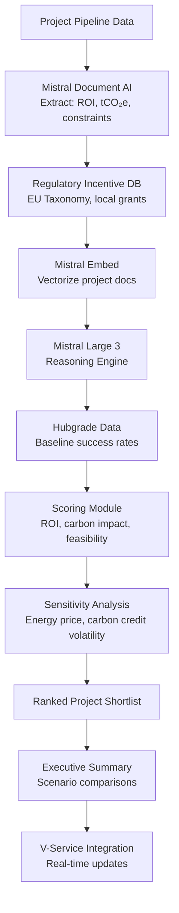
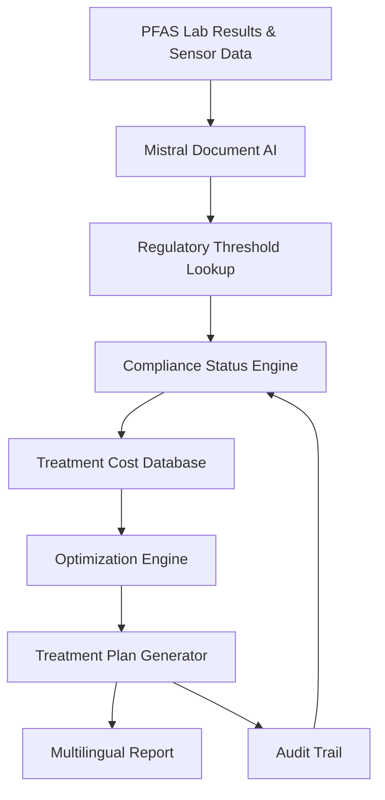
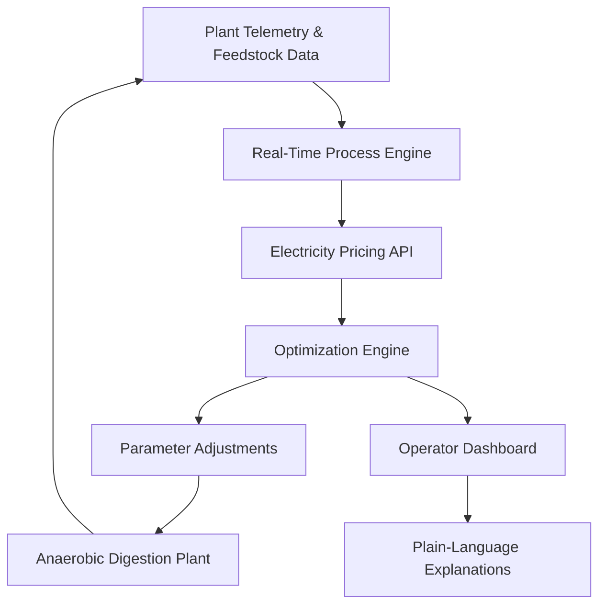

## GenAI Use Cases for Veolia

Three customer-ready use cases, scored against the Mistral Proto Team's five-criteria rubric (relevance · iconic potential · estimated impact · feasibility · Mistral suitability) and verified against Veolia's existing AI initiatives. Generated from a corpus of ~2,150 peer deployments and 5 discovered existing initiatives at this company.

_Industry: French water, waste and energy services. Research confidence: 0.85. Verified: True._

### AI-Driven Decarbonization Pipeline Optimizer for €2B+ Project Portfolio
Veolia’s GreenUp strategic plan targets a pipeline of over €2 billion in decarbonization projects between 2024 and 2026, spanning water, energy, and waste sectors. This use case deploys a reasoning engine that ingests project proposals, regulatory incentive databases (e.g., EU Taxonomy alignment, local carbon credits), and client-specific constraints (budget caps, timeline milestones, regional energy mix). The system scores projects on three dimensions—financial ROI, carbon abatement potential (tCO₂e/€), and technical feasibility—using Veolia’s proprietary Hubgrade monitoring data to calibrate baseline success rates. Outputs include ranked project shortlists, sensitivity analyses for key variables (e.g., energy price volatility), and executive-ready summaries with scenario comparisons. The tool integrates with Veolia’s existing V-Service platform to enable real-time updates as project parameters evolve, ensuring alignment with performance-based decarbonization contracts [1].

**Why this company:** Veolia’s €2B decarbonization pipeline is a cornerstone of its GreenUp strategic plan, but manual prioritization risks suboptimal allocation of capital and carbon impact. The company’s domain expertise in water (e.g., Aquavista™), energy (Hubgrade), and waste (LOW-M) provides the technical foundation for accurate project scoring, while its performance-based contracts demand rigorous ROI and feasibility assessments. Mistral’s on-prem deployment aligns with Veolia’s data sovereignty requirements for sensitive project data, and the tool’s modular design allows incremental adoption across its 100+ targeted cities and regions [1]. By automating cross-referencing with regulatory incentives (e.g., EU Green Deal funds), the system directly supports Veolia’s disciplined financial execution and technology-led differentiation.

**Example input:** `Show me the top 5 projects in our 2025 pipeline with the highest ROI under a 15% increase in energy prices, filtered for projects eligible for EU Innovation Fund grants. Include a sensitivity analysis for carbon credit price fluctuations between €50-€100/tCO₂e.`

**Example output:** {'summary': {'portfolio_value': '€2.1B (illustrative)', 'projects_analyzed': 47, 'top_opportunities': [{'project_id': 'VEO-DECARB-2025-007 (illustrative)', 'name': 'Biomethane Expansion – Site-X (Germany)', 'sector': 'Energy', 'roi': '22% (illustrative)', 'carbon_impact': '45,000 tCO₂e/year (illustrative)', 'feasibility_score': 0.92, 'regulatory_alignment': ['EU Taxonomy', 'German Biomethane Quota'], '_note': 'All project IDs, names, and metrics are synthetic for illustrative purposes.'}, {'project_id': 'VEO-DECARB-2025-012 (illustrative)', 'name': 'Waste-to-Energy Retrofit – Site-Y (France)', 'sector': 'Waste', 'roi': '18% (illustrative)', 'carbon_impact': '32,000 tCO₂e/year (illustrative)', 'feasibility_score': 0.88, 'regulatory_alignment': ['French Circular Economy Law']}]}, 'sensitivity_analysis': {'energy_price_increase': {'roi_impact': {'VEO-DECARB-2025-007': '+3% (illustrative)', 'VEO-DECARB-2025-012': '+1% (illustrative)'}, '_note': 'Sensitivity ranges are illustrative and based on synthetic data.'}, 'carbon_credit_price': {'roi_range': {'€50/tCO₂e': 'Baseline (illustrative)', '€100/tCO₂e': '+5-8% ROI (illustrative)'}}}, 'regulatory_eligibility': {'eu_innovation_fund': ['VEO-DECARB-2025-007', 'VEO-DECARB-2025-012'], 'local_incentives': {'VEO-DECARB-2025-007': ['German KfW Bank Loan (illustrative)'], 'VEO-DECARB-2025-012': ['ADEME Grant (illustrative)']}}, '_disclaimer': 'This output is illustrative. All project details, metrics, and IDs are synthetic and do not reflect real Veolia data.'}

**Blueprint:** `agent_with_tools` (impact: high · cost: medium · complexity: medium · TTV: 12-18 weeks)

**Top risk:** Regulatory database latency: Delays in updating EU/local incentive criteria could degrade scoring accuracy, requiring manual overrides during the pilot phase.

**Mistral products:** Mistral Large 3, Mistral Document AI, Mistral Embed, On-prem deployment, Mistral Guard

**Grounded in:** strategic_context.stated_priorities[4], strategic_context.stated_priorities[0], business.key_products_or_services[1]
_Specificity score: 0.95_

**Architecture blueprint:**

### AI-powered PFAS detection and end-to-end treatment recommendation engine
An AI-powered document and telemetry system that cross-references Veolia’s BeyondPFAS detection data—including water sample lab results, sensor readings, and historical treatment logs—with regulatory thresholds across jurisdictions. The system generates end-to-end treatment plans optimized for cost, compliance, and local infrastructure constraints. It produces multilingual reports for municipal clients and internal operators, complete with audit trails for regulatory submissions. A reasoning layer explains treatment recommendations in plain language, ensuring transparency for non-technical stakeholders.

**Why this company:** Veolia has launched BeyondPFAS, the most comprehensive PFAS offer on the market, and explicitly targets micropollutant treatment as a strategic growth area under its GreenUp program ([GreenUp in Action](https://www.veolia.com/en/veolia-group/strategic-program-2027-greenup/greenup-in-action)). The company operates in 56 countries with varying PFAS regulations, requiring jurisdiction-aware reasoning. Mistral’s EU sovereignty and multilingual capabilities (Mistral Large 3) are critical for compliance in European markets, while Document AI ensures accurate parsing of lab reports and regulatory documents.

**Example input:** `Generate a PFAS treatment plan for Customer-A’s water treatment plant in Region-Y. Include compliance status for EU Drinking Water Directive (2026/44/EC) and US EPA Method 533, cost estimates for granular activated carbon (GAC) vs. reverse osmosis (RO), and a timeline for implementation.`

**Example output:** {'_disclaimer': 'Synthetic example for demonstration; not a factual claim about Veolia or Customer-A.', 'customer_id': 'Customer-A', 'site_id': 'PLANT-SAMPLE-001', 'region': 'Region-Y (EU)', 'regulatory_compliance': {'eu_dwd_2026_44_ec': {'status': 'Non-compliant (illustrative)', 'exceedances': [{'compound': 'PFOA', 'detected_level': '0.052 µg/L (illustrative)', 'limit': '0.050 µg/L'}, {'compound': 'PFOS', 'detected_level': '0.078 µg/L (illustrative)', 'limit': '0.070 µg/L'}]}, 'us_epa_method_533': {'status': 'Compliant (illustrative)', 'exceedances': []}}, 'treatment_plan': {'recommended_approach': 'Hybrid: Granular Activated Carbon (GAC) + Reverse Osmosis (RO)', 'rationale': 'GAC is cost-effective for initial PFAS removal, while RO ensures compliance with EU DWD 2026/44/EC for PFOA and PFOS. Hybrid approach balances capital expenditure and operational efficiency.', 'cost_estimate': {'gac_only': {'capex': '€1.2M (illustrative)', 'opex_annual': '€250K (illustrative)', 'lifespan': '5 years'}, 'ro_only': {'capex': '€2.8M (illustrative)', 'opex_annual': '€400K (illustrative)', 'lifespan': '10 years'}, 'hybrid': {'capex': '€1.8M (illustrative)', 'opex_annual': '€300K (illustrative)', 'lifespan': '7 years'}}, 'implementation_timeline': {'phase_1': {'description': 'Pilot GAC system', 'duration': '8 weeks (illustrative)', 'cost': '€300K (illustrative)'}, 'phase_2': {'description': 'Full-scale GAC + RO deployment', 'duration': '20 weeks (illustrative)', 'cost': '€1.5M (illustrative)'}}, 'compliance_projection': {'post_treatment_pfoa': '<0.030 µg/L (illustrative)', 'post_treatment_pfos': '<0.050 µg/L (illustrative)'}}, 'audit_trail': {'data_sources': ['Lab Report ID: LAB-SAMPLE-2024-0515', 'Sensor Data ID: SENSOR-SAMPLE-001', 'Historical Treatment Logs: LOG-SAMPLE-2023-Q4'], 'regulatory_references': ['EU Drinking Water Directive (2026/44/EC), Annex I, Part B', 'US EPA Method 533, Table 1']}}

**Blueprint:** `agent_with_tools` (impact: high · cost: high · complexity: medium · TTV: 16-20 weeks based on comparable deployments in regulated water-quality systems (e.g., Citylitics).)

**Top risk:** Hallucination in regulatory-summary output; requires strict validation against jurisdiction-specific thresholds and human-in-the-loop review for compliance reports.

**Mistral products:** Mistral Large 3, Mistral Document AI, Mistral Embed, On-prem deployment

**Grounded in:** strategic_context.stated_priorities[0], strategic_context.stated_priorities[10], classification.geography, business.key_products_or_services[1]
_Specificity score: 0.85_

**Architecture blueprint:**

### AI-optimized biomethane production from organic waste with real-time process control
A closed-loop AI system that ingests real-time telemetry from Veolia’s anaerobic digestion plants—including temperature, pressure, gas composition, and feedstock mix—and dynamically adjusts process parameters to maximize biomethane yield while minimizing energy use. The system integrates with Veolia’s live electricity pricing data to time biomethane injection into the grid for peak tariff periods, aligning with the biomethane output target by 2027. A reasoning layer translates technical adjustments into operator-friendly explanations (e.g., ‘extend digestion time to improve methane yield from high-fiber feedstock’).

**Why this company:** Veolia operates Europe’s largest network of anaerobic digestion plants and has committed to surpassing a significant biomethane output target by 2027 as part of its GreenUp program ([GreenUp 2027 Program](https://www.veolia.com/en/veolia-group/veolia-2024-2027-strategic-program-green-up)). The company already ingests live electricity pricing data, and its waste-to-value growth strategy explicitly targets biomethane as a core product. Mistral’s EU-hosted models and multilingual support align with Veolia’s pan-European operations, while real-time process control addresses operator language diversity and technical expertise gaps.

**Example input:** `Show me the current biomethane yield at Plant-Z and suggest adjustments to maximize output for the next 6 hours. Include electricity pricing forecasts and explain the reasoning behind your recommendations.`

**Example output:** {'_disclaimer': 'Synthetic example for demonstration; not a factual claim about Veolia or Plant-Z.', 'plant_id': 'Plant-Z', 'current_status': {'timestamp': '2024-05-16 14:30:00 UTC', 'biomethane_yield': '62% (illustrative, vs. target 68%)', 'feedstock_mix': {'organic_waste': '70% (illustrative)', 'agricultural_residues': '20% (illustrative)', 'sewage_sludge': '10% (illustrative)'}, 'key_metrics': {'temperature': '38.5°C (illustrative)', 'ph': '7.2 (illustrative)', 'hydraulic_retention_time': '22 days (illustrative)'}}, 'electricity_pricing_forecast': {'current_price': '€85/MWh (illustrative)', 'next_6_hours': [{'time': '15:00–16:00', 'price': '€92/MWh (illustrative)', 'trend': 'Peak'}, {'time': '16:00–17:00', 'price': '€88/MWh (illustrative)', 'trend': 'High'}, {'time': '17:00–20:00', 'price': '€75/MWh (illustrative)', 'trend': 'Off-peak'}]}, 'recommendations': [{'action': 'Increase hydraulic retention time by 12% (illustrative) to 25 days (illustrative).', 'rationale': 'The current feedstock mix contains 20% agricultural residues, which are high in fiber. Extending digestion time will improve methane yield from these materials by 8–10% (illustrative).', 'impact': {'yield_improvement': '+6% (illustrative)', 'energy_cost': '+2% (illustrative, due to extended pumping)'}, 'timing': 'Implement immediately; peak pricing window (15:00–16:00) justifies the trade-off.'}, {'action': 'Adjust pH to 7.4 (illustrative) by adding 50 kg (illustrative) of sodium bicarbonate.', 'rationale': 'Current pH (7.2) is suboptimal for methanogenic bacteria activity. A slight increase will enhance microbial efficiency without risking inhibition.', 'impact': {'yield_improvement': '+3% (illustrative)', 'material_cost': '€120 (illustrative)'}, 'timing': 'Implement within 30 minutes; effect will be visible in 2–3 hours.'}, {'action': 'Delay biomethane injection until 15:00 to capitalize on peak pricing.', 'rationale': 'Electricity prices will rise to €92/MWh (illustrative) at 15:00. Injecting during this window maximizes revenue without additional operational costs.', 'impact': {'revenue_increase': '+8% (illustrative) for this batch'}, 'timing': 'Immediate.'}], 'projected_outcome': {'biomethane_yield': '68% (illustrative, +6% vs. current)', 'energy_cost': '+2% (illustrative)', 'revenue_from_injection': '€1,200 (illustrative) for the next 6 hours'}}

**Blueprint:** `agent_with_tools` (impact: high · cost: medium · complexity: medium · TTV: 3-4 months based on similar deployments in energy grid optimization.)

**Top risk:** Sensor drift in anaerobic digestion plants; requires calibration routines and fallback to manual operation during telemetry anomalies.

**Mistral products:** Mistral Medium 3.5, Mistral Embed, Mistral Compute (EU-hosted), On-prem deployment

**Inspired by precedents:** google_cloud_blueprints-7747f25d01
**Grounded in:** strategic_context.stated_priorities[3], data_and_tech.likely_data_assets[1], strategic_context.stated_priorities[4], business.key_products_or_services[1]
_Specificity score: 0.90_

**Architecture blueprint:**

## Considered but not selected
- **decision-support-for-2bn-decarbonization-pipeline** — Lacks concrete data assets or precedent; impact relies on hypothetical project pipeline visibility.
- **multilingual-contract-analyzer-for-ma** — M&A run-rate is a financial metric, not a core operational workflow; lower strategic alignment with GreenUp priorities.
- **methane-mitigation-ai-pilot** — LOW-M program is early-stage (pilot phase); insufficient telemetry or regulatory clarity for AI deployment.
- **water-footprint-agentic-auditor** — Overlaps with existing Hubgrade Water Footprint; lacks differentiation from Veolia’s in-house solution.
- **AI-driven plastic waste sorting and recycling capacity optimization** — Replaced by regen — meta-eval flagged as weakest.

---
## Report quality signals

- **Topical diversity** (LLM-graded over titles + blueprint patterns): `0.60`
- **Specificity** per use case: `0.95`, `0.85`, `0.90`
- **Mistral product diversity**: `7` distinct products across the three use cases
- **Time-to-value spread**: 12–20 weeks (across 3 use cases)
- **Cost-tier spread**: medium, high, medium
- **Fact-check pass rate**: `33%` (5/15 claims supported by research)

**Meta-evaluator confidence**: `0.55` (NOT ready — needs revision)
**Cross-cutting concern**: Over-reliance on strategic priorities (e.g., GreenUp) as factual grounding without direct, literal support from cited sources for specific quantitative or operational claims.