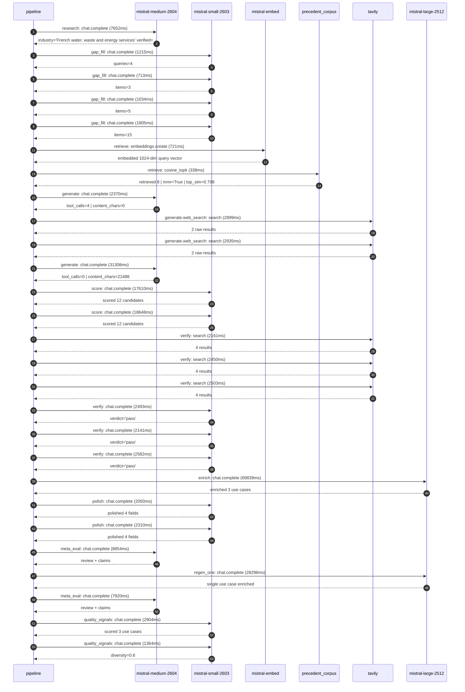

# Pipeline blueprint (architecture)

Static view of the pipeline regardless of run timing — shows agents,
models, and gates. The chronological execution log follows below.

```mermaid
flowchart TD
    Start([User: company name]) --> R
    R["<b>1. Research</b><br/>parallel: Wikipedia · Tavily news ·<br/>existing initiatives · live verification<br/><i>mistral-medium</i> synthesis"]
    R --> G["<b>1b. Gap-fill</b><br/>identify missing fields →<br/><i>mistral-small</i> generates queries →<br/>Tavily search per field →<br/><i>mistral-small</i> per-field extraction"]
    G --> Conf{Confidence ≥ 0.5<br/>OR verified<br/>OR ≥ 1 existing initiative?}
    Conf -->|no| Refuse([Refusal])
    Conf -->|yes| Ret
    Ret["<b>2. Retrieve</b><br/><i>mistral-embed</i> on company query →<br/>cosine top-K + industry/depth filter +<br/>MMR diversification"]
    Ret --> Gen["<b>3. Generate 12 candidates</b><br/><i>mistral-medium</i> with web_search tool<br/>(Tavily + deep-read) — fact citations<br/>flow into the EvidenceLedger"]
    Gen --> Score["<b>4. Score</b><br/>self-consistency: 2 parallel passes<br/><i>mistral-small</i> @ T=0.2 and T=0.4 →<br/>aggregate weighted scores"]
    Score --> Verify["<b>5. Per-candidate verify</b><br/>top-3: Tavily search + deep-read +<br/><i>mistral-small</i> verdict (pass /<br/>partial / confirmed_existing)"]
    Verify --> Enrich["<b>6. Enrich</b><br/><i>mistral-large</i> drafts customer-facing<br/>prose for 3 use cases (or<br/><i>mistral-medium</i> on fast tier)"]
    Enrich --> NumScrub["<b>6a. Numeric scrub</b><br/>flag any number not in cited content"]
    NumScrub --> Polish["<b>6b. Polish</b><br/><i>mistral-small</i> per use case (parallel):<br/>convert markers→qualitative,<br/>(ev-XXX)→[title](url)"]
    Polish --> Attr["<b>6c. Attribution check</b><br/><i>mistral-small</i> per use case (parallel):<br/>fix corpus-ID ↔ company mismatches"]
    Attr --> Meta["<b>7. Meta-evaluation</b><br/><i>mistral-medium</i> reviews report against<br/>cited precedents + ledger entries:<br/>strict claim verification"]
    Meta --> RegenQ{confidence < 0.6<br/>AND not fast tier?}
    RegenQ -->|yes| Regen["<b>7b. Targeted regen</b><br/><i>mistral-large</i> re-enriches just the<br/>weakest use case with the next-best<br/>near-miss; re-runs meta-eval"]
    RegenQ -->|no| QS
    Regen --> QS
    QS["<b>Quality signals</b><br/>LLM-graded diversity + specificity,<br/>fact-check pass rate, TTV/cost spread"]
    QS --> Render([Markdown report + trace])

    classDef agent fill:#fef3c7,stroke:#f59e0b
    classDef gate fill:#dbeafe,stroke:#3b82f6
    classDef io fill:#dcfce7,stroke:#16a34a
    class R,G,Ret,Gen,Score,Verify,Enrich,NumScrub,Polish,Attr,Meta,Regen,QS agent
    class Conf,RegenQ gate
    class Start,Refuse,Render io
```

## Execution trace — Veolia

Started: `2026-05-08T23:06:08.470634+00:00`. Total wall time: `216.2s` across `27` recorded actions.

### Per-step time totals

| Step | Calls | Total time | Avg time |
|---|---:|---:|---:|
| `research` | 1 | 7.65s | 7652ms |
| `gap_fill` | 4 | 4.77s | 1192ms |
| `retrieve` | 2 | 1.06s | 529ms |
| `generate` | 2 | 33.68s | 16839ms |
| `generate.web_search` | 2 | 5.83s | 2917ms |
| `score` | 2 | 36.26s | 18129ms |
| `verify` | 6 | 14.33s | 2389ms |
| `enrich` | 1 | 69.84s | 69839ms |
| `polish` | 2 | 4.36s | 2180ms |
| `meta_eval` | 2 | 16.77s | 8387ms |
| `regen_one` | 1 | 28.30s | 28296ms |
| `quality_signals` | 2 | 4.27s | 2134ms |

### Chronological event log

- `23:06:11.537` **[research]** `mistral-medium-2604.chat.complete` — 7652ms
   - inputs: synthesize CompanyContext for Veolia | depth=medium
   - outputs: industry='French water, waste and energy services' verified=True conf=0.75
- `23:06:20.509` **[gap_fill]** `mistral-small-2603.chat.complete` — 1215ms
   - inputs: generate gap queries | fields=['business_model', 'products', 'data_assets', 'priorities']
   - outputs: queries=4
- `23:06:28.615` **[gap_fill]** `mistral-small-2603.chat.complete` — 713ms
   - inputs: layer-2 extract field=products
   - outputs: items=3
- `23:06:28.593` **[gap_fill]** `mistral-small-2603.chat.complete` — 1034ms
   - inputs: layer-2 extract field=data_assets
   - outputs: items=5
- `23:06:28.565` **[gap_fill]** `mistral-small-2603.chat.complete` — 1805ms
   - inputs: layer-2 extract field=priorities
   - outputs: items=15
- `23:06:30.400` **[retrieve]** `mistral-embed.embeddings.create` — 721ms
   - inputs: company_query | industries='French water, waste and energy services'
   - outputs: embedded 1024-dim query vector
- `23:06:31.121` **[retrieve]** `precedent_corpus.cosine_topk` — 338ms
   - inputs: k=8 min_depth=0.4 target='Veolia'
   - outputs: retrieved 8 | mmr=True | top_sim=0.798
- `23:06:32.772` **[generate]** `mistral-medium-2604.chat.complete` — 2370ms
   - inputs: iteration=0 tool_calls_used=0/2 tools=on
   - outputs: tool_calls=4 | content_chars=0
- `23:06:35.164` **[generate.web_search]** `tavily.search` — 2899ms
   - inputs: query='Veolia smart water meter deployment scale 2025'
   - outputs: 2 raw results
- `23:06:40.896` **[generate.web_search]** `tavily.search` — 2935ms
   - inputs: query='Veolia GreenUp strategic plan decarbonization biomethane plastics recycling 2027'
   - outputs: 2 raw results
- `23:06:45.211` **[generate]** `mistral-medium-2604.chat.complete` — 31308ms
   - inputs: iteration=1 tool_calls_used=2/2 tools=off
   - outputs: tool_calls=0 | content_chars=21488
- `23:07:16.870` **[score]** `mistral-small-2603.chat.complete` — 17610ms
   - inputs: self-consistency pass T=0.2
   - outputs: scored 12 candidates
- `23:07:16.874` **[score]** `mistral-small-2603.chat.complete` — 18648ms
   - inputs: self-consistency pass T=0.4
   - outputs: scored 12 candidates
- `23:07:35.572` **[verify]** `tavily.search` — 2161ms
   - inputs: candidate=waste-to-biomethane-optimization | query='Veolia AI-optimized biomethane production from organic waste'
   - outputs: 4 results
- `23:07:35.572` **[verify]** `tavily.search` — 2450ms
   - inputs: candidate=pfas-detection-and-treatment-advisor | query='Veolia AI-powered PFAS detection and end-to-end treatment re'
   - outputs: 4 results
- `23:07:35.571` **[verify]** `tavily.search` — 2503ms
   - inputs: candidate=plastic-recycling-capacity-optimizer | query='Veolia AI-driven plastic waste sorting and recycling capacit'
   - outputs: 4 results
- `23:07:38.733` **[verify]** `mistral-small-2603.chat.complete` — 2493ms
   - inputs: verdict for pfas-detection-and-treatment-advisor
   - outputs: verdict='pass'
- `23:07:40.262` **[verify]** `mistral-small-2603.chat.complete` — 2141ms
   - inputs: verdict for waste-to-biomethane-optimization
   - outputs: verdict='pass'
- `23:07:40.147` **[verify]** `mistral-small-2603.chat.complete` — 2582ms
   - inputs: verdict for plastic-recycling-capacity-optimizer
   - outputs: verdict='pass'
- `23:07:42.760` **[enrich]** `mistral-large-2512.chat.complete` — 69839ms
   - inputs: tier=standard top_3=['plastic-recycling-capacity-optimizer', 'pfas-detection-and-treatment-advisor', 'waste-to-biomethane-optimization']
   - outputs: enriched 3 use cases
- `23:08:52.601` **[polish]** `mistral-small-2603.chat.complete` — 2050ms
   - inputs: use_case=plastic-recycling-capacity-optimizer unanchored=True opaque_ev=False
   - outputs: polished 4 fields
- `23:08:52.604` **[polish]** `mistral-small-2603.chat.complete` — 2310ms
   - inputs: use_case=waste-to-biomethane-optimization unanchored=True opaque_ev=False
   - outputs: polished 4 fields
- `23:08:54.945` **[meta_eval]** `mistral-medium-2604.chat.complete` — 8854ms
   - inputs: reviewing 3 use cases
   - outputs: review + claims
- `23:09:03.833` **[regen_one]** `mistral-large-2512.chat.complete` — 28296ms
   - inputs: replace weakest=plastic-recycling-capacity-optimizer with decision-support-for-2bn-decarbonization-pipeline
   - outputs: single use case enriched
- `23:09:32.162` **[meta_eval]** `mistral-medium-2604.chat.complete` — 7920ms
   - inputs: reviewing 3 use cases
   - outputs: review + claims
- `23:09:40.445` **[quality_signals]** `mistral-small-2603.chat.complete` — 2904ms
   - inputs: specificity grade (3 use cases)
   - outputs: scored 3 use cases
- `23:09:43.349` **[quality_signals]** `mistral-small-2603.chat.complete` — 1364ms
   - inputs: diversity grade
   - outputs: diversity=0.6

## Mermaid sequence diagram (execution)

