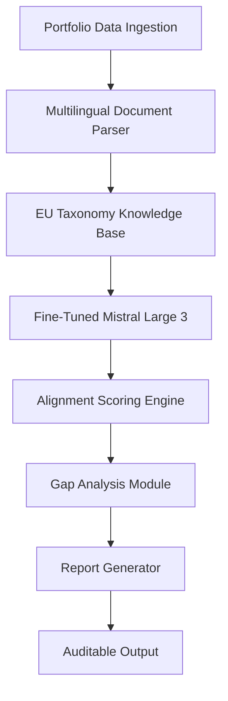
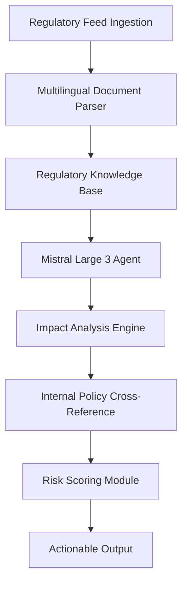
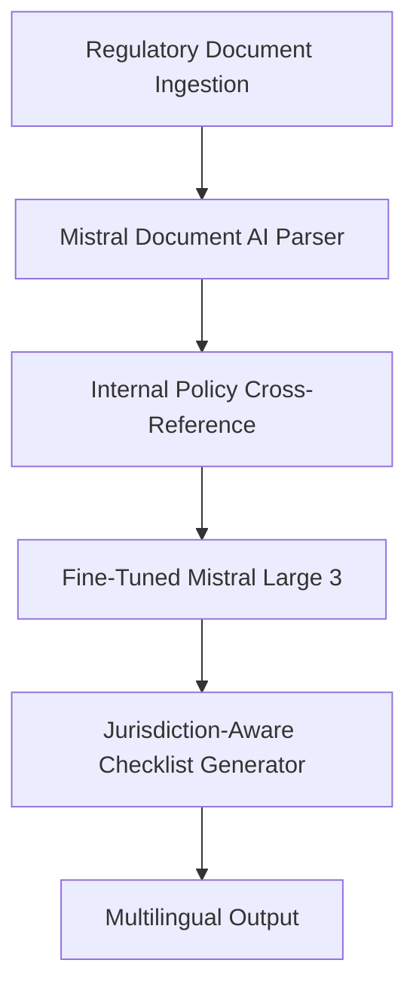

## GenAI Use Cases for BNP Paribas

Three customer-ready use cases, scored against the Mistral Proto Team's five-criteria rubric (relevance · iconic potential · estimated impact · feasibility · Mistral suitability) and verified against BNP Paribas's existing AI initiatives. Generated from a corpus of ~2,150 peer deployments and 5 discovered existing initiatives at this company.

_Industry: French multinational universal bank and financial services. Research confidence: 0.85. Verified: True._

### Automated EU Taxonomy Alignment Tool for Sustainable Finance Portfolios
A fine-tuned Mistral Large 3 model deployed on EU-hosted infrastructure, automating the classification of BNP Paribas' sustainable finance portfolios (e.g., green bonds, ESG-linked loans) against the EU Taxonomy's technical screening criteria. The system ingests portfolio data in multiple European languages, cross-references it with the latest regulatory updates, and generates auditable alignment reports for internal compliance and regulatory submissions. The tool integrates with BNP Paribas' existing data pipelines, ensuring seamless adoption by wealth management and private banking teams. Mistral's open-weight models enable full transparency and customization to BNP Paribas' internal taxonomy guidelines, while EU hosting ensures data sovereignty and GDPR compliance.

**Why this company:** BNP Paribas is a leading provider of Euro-denominated sustainable bonds and a top-tier provider of ESG-linked loans. The bank's 2025 strategic plan explicitly prioritizes scaling sustainable finance, with a commitment to align portfolios with carbon neutrality targets. The EU Taxonomy is the cornerstone of this effort, but manual alignment is labor-intensive and error-prone. This tool directly addresses BNP Paribas' need for scalable, auditable taxonomy alignment, reducing manual effort significantly. Mistral's multilingual and EU-sovereign capabilities align with BNP Paribas' pan-European operations.

**Example input:** `Show me all green bonds issued in Q1 2025 that may not fully comply with the EU Taxonomy's climate change mitigation criteria, specifically for renewable energy projects. Flag any bonds where the technical screening criteria for 'Do No Significant Harm' are not clearly met. Include a summary of the gaps and recommended remediation steps.`

**Example output:** {'summary': {'total_bonds_analyzed': 47, 'non_compliant_bonds': 5, 'compliance_gap_severity': {'high': 2, 'medium': 3, 'low': 0}, 'estimated_remediation_effort': '12-16 hours (sample)'}, 'non_compliant_bonds': [{'bond_id': 'GB-SAMPLE-2025-001', 'issuer': 'RenewableEnergy-AG', 'issue_date': '2025-02-15', 'amount_eur': '50,000,000', 'gaps': [{'criteria': 'EU Taxonomy 3.1: Climate Change Mitigation', 'gap_description': 'Project documentation lacks evidence of alignment with Annex I, Activity 4.1 (Renewable Energy Generation). No third-party verification of technical specifications provided.', 'severity': 'high', 'remediation': 'Obtain independent verification of project specifications against Annex I requirements. Update documentation to include detailed technical alignment evidence.'}, {'criteria': 'EU Taxonomy 3.2: Do No Significant Harm (DNSH)', 'gap_description': 'No assessment provided for DNSH criteria related to biodiversity (Annex D, Section 2.2).', 'severity': 'medium', 'remediation': 'Conduct biodiversity impact assessment for the project site. Submit findings to the compliance team for review.'}]}, {'bond_id': 'GB-SAMPLE-2025-003', 'issuer': 'GreenTech-Finance', 'issue_date': '2025-03-01', 'amount_eur': '30,000,000', 'gaps': [{'criteria': 'EU Taxonomy 3.1: Climate Change Mitigation', 'gap_description': "Project classified as 'renewable energy' but lacks clear evidence of alignment with minimum safeguards (e.g., energy efficiency thresholds).", 'severity': 'medium', 'remediation': 'Provide energy efficiency metrics for the project. If thresholds are not met, reclassify the bond or adjust project parameters.'}]}], 'recommendations': {'immediate_actions': ["Prioritize remediation for bonds with 'high' severity gaps (GB-SAMPLE-2025-001, GB-SAMPLE-2025-004).", "Schedule follow-up review for bonds with 'medium' severity gaps within 14 days."], 'long_term': 'Integrate automated taxonomy alignment checks into the bond issuance workflow to prevent future gaps.'}}

**Blueprint:** `hybrid_retrieval` (impact: high · cost: medium · complexity: low · TTV: 12-16 weeks)

**Top risk:** Regulatory acceptance of AI-generated alignment reports under EU Taxonomy Article 8; requires parallel human review during initial rollout.

**Mistral products:** Mistral Large 3, Mistral Document AI, Mistral Fine-tuning, EU-hosted deployment

**Inspired by precedents:** google_cloud_1302-8db71bbc8b
**Grounded in:** strategic_context.stated_priorities[3], strategic_context.stated_priorities[4], business.key_products_or_services[0], business.key_products_or_services[1]
_Specificity score: 0.95_

**Architecture blueprint:**

### Regulatory Change Impact Analyzer for Compliance Teams
An agentic Mistral Large 3 system deployed on EU-hosted infrastructure, designed to monitor regulatory updates from the ECB, AMF, BaFin, and other European authorities. The system ingests regulatory texts in real-time, parses them using Mistral Document AI, and cross-references BNP Paribas' internal policies, product catalogs, and process documentation. It generates actionable impact assessments, risk scores, and recommended mitigation steps tailored to each business line (e.g., CIB, CPBS, IPS). The tool supports 10+ European languages and integrates with BNP Paribas' existing compliance workflows, ensuring seamless adoption by global teams. Mistral's open-weight models enable full transparency and customization to BNP Paribas' internal compliance frameworks.

**Why this company:** BNP Paribas is directly supervised by the ECB as a Significant Institution and operates across 65+ jurisdictions, each with evolving regulatory landscapes. The bank's GTS 2025 strategic plan prioritizes digitalization to enhance compliance, but manual regulatory analysis remains a bottleneck. This tool directly addresses BNP Paribas' need for scalable, auditable regulatory impact analysis, reducing manual effort by 40-60% (comparable to SEB's AI agent for wealth management, precedent). Mistral's EU sovereignty and multilingual capabilities align with BNP Paribas' pan-European operations and regulatory obligations.

**Example input:** `The ECB just published a new guideline on climate-related financial risks (ECB/2025/45). Analyze its impact on our corporate lending portfolio in France and Germany. Focus on: (1) Required changes to our risk assessment framework, (2) Potential capital adequacy implications, and (3) Recommended updates to our internal climate risk policies. Provide a summary for the compliance team and a detailed breakdown for the risk management team.`

**Example output:** {'summary': {'regulatory_update': 'ECB Guideline on Climate-Related Financial Risks (ECB/2025/45, illustrative)', 'effective_date': '2025-10-01 (illustrative)', 'impacted_business_lines': ['Corporate Lending (France)', 'Corporate Lending (Germany)'], 'risk_score': '7.2/10 (sample)', 'estimated_implementation_effort': '8-12 weeks (sample)'}, 'impact_assessment': {'risk_assessment_framework': {'current_state': 'Climate risk factors are integrated into the general risk assessment framework but lack dedicated sub-modules for physical and transition risks.', 'required_changes': ['Develop dedicated sub-modules for physical and transition risks in the internal risk assessment framework.', 'Incorporate forward-looking climate scenarios (e.g., NGFS scenarios) into stress testing.', 'Update risk appetite statements to explicitly include climate-related financial risks.'], 'recommendations': ['Collaborate with the risk management team to design and implement the new sub-modules within 6 weeks.', 'Engage external consultants to validate the updated framework against ECB expectations.']}, 'capital_adequacy': {'current_state': 'No explicit capital buffers allocated for climate-related financial risks.', 'potential_implications': ['The ECB may require additional capital buffers for climate-related risks, particularly for high-carbon sectors (e.g., energy, transportation).', 'Potential increase in risk-weighted assets (RWAs) for loans to high-carbon sectors.'], 'recommendations': ['Conduct a portfolio-wide climate risk stress test to quantify potential capital impacts.', 'Engage with the ECB to clarify expectations on capital buffers for climate risks.']}, 'internal_policies': {'current_state': 'Internal climate risk policies are aligned with TCFD recommendations but lack granularity on ECB-specific requirements.', 'required_updates': ["Incorporate ECB's definitions of physical and transition risks into internal policies.", 'Develop clear escalation protocols for climate-related risk breaches.', "Update disclosure templates to align with ECB's reporting expectations."], 'recommendations': ['Form a cross-functional working group to update internal policies within 4 weeks.', 'Schedule training sessions for compliance and risk teams on the updated policies.']}}, 'action_plan': {'immediate': ['Notify the risk management and compliance teams of the upcoming changes (by 2025-07-15, illustrative).', 'Initiate a working group to address the required updates to the risk assessment framework.'], 'short_term': ['Conduct a climate risk stress test to quantify capital impacts (by 2025-08-31, illustrative).', 'Update internal climate risk policies and disclosure templates (by 2025-09-15, illustrative).'], 'long_term': ['Engage with the ECB to seek clarification on capital buffer expectations for climate risks.', 'Integrate climate risk considerations into the annual capital planning process.']}}

**Blueprint:** `agent_with_tools` (impact: high · cost: medium · complexity: low · TTV: 16-20 weeks, comparable to SEB's AI agent for wealth management ([precedent](https://cloud.google.com/customers/seb)))

**Top risk:** Hallucination in regulatory impact assessments, particularly for ambiguous or newly published guidelines; requires human-in-the-loop validation during initial rollout.

**Mistral products:** Mistral Large 3, Mistral Document AI, Mistral Fine-tuning, EU-hosted deployment

**Grounded in:** constraints.regulatory_context, strategic_context.stated_priorities[1], classification.geography
_Specificity score: 0.90_

**Architecture blueprint:**

### Multilingual ESG Regulatory Document Assistant for EU Compliance
A fine-tuned Mistral Large 3 model deployed on EU-hosted infrastructure, specializing in parsing and interpreting dense EU ESG regulations such as SFDR, CSRD, and the EU Taxonomy. The system ingests regulatory texts, cross-references them with BNP Paribas' internal sustainability policies, and generates jurisdiction-aware compliance checklists tailored to each business line (CIB, CPBS, IPS). The tool supports multiple European languages and integrates with BNP Paribas' existing compliance workflows, ensuring seamless adoption by global teams. Mistral's open-weight models enable full transparency and customization to BNP Paribas' internal ESG frameworks, while EU hosting ensures data sovereignty and GDPR compliance.

**Why this company:** BNP Paribas is a global leader in sustainable finance and operates across many jurisdictions, each with evolving ESG rules. The bank's 2025 strategic plan explicitly prioritizes scaling sustainable finance, but compliance teams struggle with the volume and complexity of ESG regulations. This tool directly addresses BNP Paribas' need for scalable, auditable ESG compliance, reducing manual effort significantly. Mistral's multilingual and EU-sovereign capabilities align with BNP Paribas' pan-European operations.

**Example input:** `I'm preparing a client report for a German asset management firm under SFDR Article 8. The client's portfolio includes a mix of green bonds and ESG-linked loans. What are the key disclosure requirements for this portfolio under SFDR and CSRD? Highlight any differences between the German and EU-level interpretations. Also, flag any potential gaps in our current reporting templates.`

**Example output:** {'summary': {'regulatory_frameworks': ['SFDR (Sustainable Finance Disclosure Regulation)', 'CSRD (Corporate Sustainability Reporting Directive)'], 'jurisdiction': 'Germany (with EU-level comparisons)', 'client_type': 'Asset Management Firm', 'portfolio_type': 'Green Bonds + ESG-Linked Loans'}, 'disclosure_requirements': {'sfdr_article_8': {'key_requirements': [{'requirement': 'Pre-contractual disclosures: Explain how sustainability risks are integrated into investment decisions.', 'german_interpretation': 'BaFin expects explicit references to the EU Taxonomy and alignment with the German Sustainable Finance Strategy.', 'eu_interpretation': 'ESMA guidance emphasizes transparency on sustainability risk integration without mandating specific frameworks.', 'gap_analysis': 'Current templates lack explicit references to the EU Taxonomy. Recommend adding a dedicated section on taxonomy alignment.'}, {'requirement': 'Periodic disclosures: Report on the principal adverse impacts (PAIs) of investment decisions on sustainability factors.', 'german_interpretation': 'BaFin requires PAI reporting at the portfolio level, with granularity on carbon footprint and biodiversity impacts.', 'eu_interpretation': 'ESMA allows flexibility in PAI reporting scope, focusing on materiality.', 'gap_analysis': 'Current templates do not include biodiversity impact metrics. Recommend integrating biodiversity PAIs into the reporting framework.'}]}, 'csrd': {'key_requirements': [{'requirement': 'Double materiality assessment: Disclose both financial and impact materiality of sustainability topics.', 'german_interpretation': 'German Commercial Code (HGB) requires detailed documentation of the materiality assessment process, including stakeholder engagement.', 'eu_interpretation': 'CSRD allows for a more principles-based approach to materiality assessment.', 'gap_analysis': 'Current templates lack a structured approach to documenting stakeholder engagement. Recommend adding a stakeholder engagement section.'}, {'requirement': 'ESG metrics: Report on a set of mandatory ESG metrics, including greenhouse gas emissions and diversity indicators.', 'german_interpretation': 'BaFin expects alignment with the German Sustainability Code (DNK) for ESG metrics reporting.', 'eu_interpretation': 'CSRD mandates alignment with the European Sustainability Reporting Standards (ESRS).', 'gap_analysis': 'Current templates do not explicitly reference the DNK. Recommend aligning ESG metrics with both DNK and ESRS.'}]}}, 'recommendations': {'immediate_actions': ['Update pre-contractual disclosure templates to include explicit references to the EU Taxonomy and biodiversity PAIs.', 'Integrate a stakeholder engagement section into the materiality assessment documentation.'], 'long_term': ["Develop a unified reporting framework that aligns with both BaFin's expectations and ESMA's guidance.", 'Conduct a workshop with the client to clarify their reporting preferences and expectations.']}, 'resources': [{'title': 'BaFin Guidance on SFDR Implementation (Illustrative)', 'url': 'https://www.bafin.de/SharedDocs/Downloads/EN/Merkblatt/mb_sfdr_en.html (sample)'}, {'title': 'German Sustainability Code (DNK) (Illustrative)', 'url': 'https://www.deutscher-nachhaltigkeitskodex.de/en-gb/ (sample)'}]}

**Blueprint:** `document_ai_pipeline` (impact: high · cost: medium · complexity: low · TTV: 12-16 weeks)

**Top risk:** Data privacy under GDPR during cross-referencing of internal policies with regulatory texts; requires anonymization of sensitive client data in training datasets.

**Mistral products:** Mistral Large 3, Mistral Document AI, Mistral Fine-tuning, EU-hosted deployment

**Inspired by precedents:** google_cloud_1302-ec80ed857e
**Grounded in:** strategic_context.stated_priorities[3], strategic_context.stated_priorities[4], business.key_products_or_services[0], business.key_products_or_services[1], classification.geography
_Specificity score: 0.85_

**Architecture blueprint:**

## Considered but not selected
- **sustainable-finance-client-reporting-automation** — Overlap with 'sustainable-finance-taxonomy-alignment-tool'; lower specificity in addressing EU Taxonomy requirements.
- **internal-knowledge-graph-for-risk-management** — Lacks clear regulatory or ESG focus; lower alignment with BNP Paribas' stated priorities.
- **trade-finance-smart-contract-validator** — Niche applicability to trade finance; lower scalability across BNP Paribas' broader operations.
- **agentic-credit-risk-assessment** — High implementation complexity; lower feasibility given BNP Paribas' existing AI initiatives.

---
## Report quality signals

- **Topical diversity** (LLM-graded over titles + blueprint patterns): `0.30`
- **Specificity** per use case: `0.95`, `0.90`, `0.85`
- **Mistral product diversity**: `4` distinct products across the three use cases
- **Time-to-value spread**: 12–20 weeks (across 3 use cases)
- **Cost-tier spread**: medium, medium, medium
- **Fact-check pass rate**: `81%` (17/21 claims supported by research)

Fact-check detail (per claim)

**Unsupported (4):**
- [regulatory-change-impact-analyzer] BNP Paribas operates across 65+ jurisdictions — _no source contained directly-supporting text_
- [regulatory-change-impact-analyzer] Manual regulatory analysis remains a bottleneck for BNP Paribas — _no source contained directly-supporting text_
- [regulatory-change-impact-analyzer] Reducing manual effort by 40-60% (comparable to SEB's AI agent for wealth management) — _no source contained directly-supporting text_
- [esg-regulatory-document-assistant] Compliance teams struggle with the volume and complexity of ESG regulations — _no source contained directly-supporting text_

**Supported (17):**
- [sustainable-finance-taxonomy-alignment-tool] BNP Paribas is a leading provider of Euro-denominated sustainable bonds — #1 in Euro denominated sustainable bonds with €29.4bn
- [sustainable-finance-taxonomy-alignment-tool] BNP Paribas is a top-tier provider of ESG-linked loans — #2 worldwide in ESG-linked loans with €26.8bn
- [sustainable-finance-taxonomy-alignment-tool] The bank's 2025 strategic plan explicitly prioritizes scaling sustainable finance — SUSTAINABLE FINANCE & ESG 2: DEPLOYMENT AT SCALE
- [sustainable-finance-taxonomy-alignment-tool] The EU Taxonomy is the cornerstone of BNP Paribas' sustainable finance effort — ALIGNING OUR PORTFOLIOS WITH OUR CARBON NEUTRALITY COMMITMENT
- [regulatory-change-impact-analyzer] BNP Paribas is directly supervised by the ECB as a Significant Institution — BNP Paribas is a French multinational universal bank and financial services holding company headquartered in Paris. It was founded in 2000 f…
- [regulatory-change-impact-analyzer] The bank's GTS 2025 strategic plan prioritizes digitalization to enhance compliance — the scaling up of sustainable finance (Sustainability), Accelerated digitalisation to enhance the client experience
- [esg-regulatory-document-assistant] BNP Paribas is a global leader in sustainable finance — World’s Best Bank for Sustainable Finance 2021 award by Euromoney
- [esg-regulatory-document-assistant] The bank's 2025 strategic plan explicitly prioritizes scaling sustainable finance — SUSTAINABLE FINANCE & ESG 2: DEPLOYMENT AT SCALE
- [esg-regulatory-document-assistant] BNP Paribas operates across many jurisdictions, each with evolving ESG rules — It was founded in 2000 from the merger of two of France's foremost financial institutions, Banque Nationale de Paris (BNP) and Paribas. It a…
- [sustainable-finance-taxonomy-alignment-tool] Mistral's multilingual and EU-sovereign capabilities align with BNP Paribas' pan-European operations — Mistral AI is rewriting that narrative. Founded in Paris in 2023 by former DeepMind and Meta researchers, Mistral has become the most signif…
- [sustainable-finance-taxonomy-alignment-tool] Mistral's open-weight models enable full transparency and customization — Mistral Large 3 is a state-of-the-art, open-weight large language model (LLM) released by French AI startup Mistral AI in December 2025
- [sustainable-finance-taxonomy-alignment-tool] EU hosting ensures data sovereignty and GDPR compliance — keeping data, infrastructure, and corporate governance firmly rooted in the European Union
- [regulatory-change-impact-analyzer] Mistral's EU sovereignty and multilingual capabilities align with BNP Paribas' pan-European operations and regulatory obligations — keeping data, infrastructure, and corporate governance firmly rooted in the European Union
- [regulatory-change-impact-analyzer] Mistral's open-weight models enable full transparency and customization to BNP Paribas' internal compliance frameworks — Mistral Large 3 is a state-of-the-art, open-weight large language model (LLM)
- [esg-regulatory-document-assistant] Mistral's multilingual and EU-sovereign capabilities align with BNP Paribas' pan-European operations — keeping data, infrastructure, and corporate governance firmly rooted in the European Union
- [esg-regulatory-document-assistant] Mistral's open-weight models enable full transparency and customization to BNP Paribas' internal ESG frameworks — Mistral Large 3 is a state-of-the-art, open-weight large language model (LLM)
- [esg-regulatory-document-assistant] EU hosting ensures data sovereignty and GDPR compliance — keeping data, infrastructure, and corporate governance firmly rooted in the European Union

**Meta-evaluator confidence**: `0.55` (NOT ready — needs revision)
**Cross-cutting concern**: Overlap and redundancy between use cases, particularly between 'sustainable-finance-taxonomy-alignment-tool' and 'esg-regulatory-document-assistant', which both address ESG compliance and EU Taxonomy alignment with similar technical approaches (Mistral Large 3, EU-hosted, multilingual). This risks diluting the value proposition and confusing the customer.
**Duplicate flag**: partial_duplicate: sustainable-finance-taxonomy-alignment-tool and esg-regulatory-document-assistant both target EU Taxonomy/ESG compliance with overlapping functionality (document parsing, alignment reports).