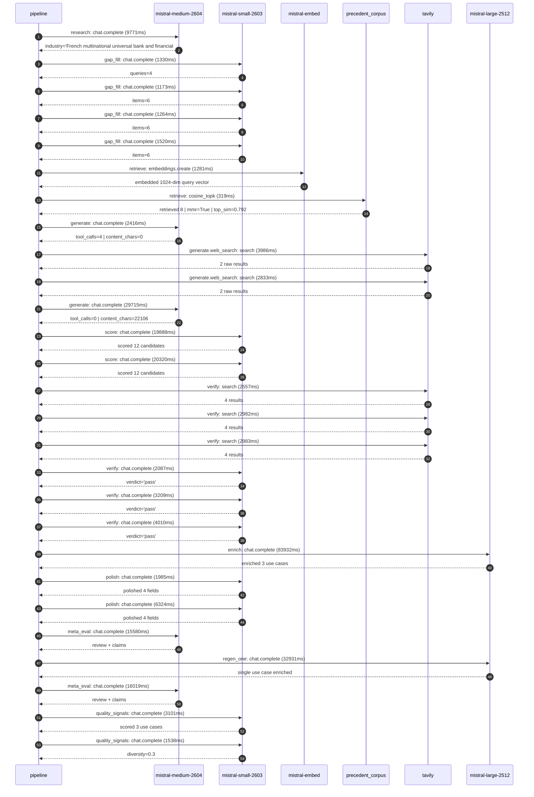

# Pipeline blueprint (architecture)

Static view of the pipeline regardless of run timing — shows agents,
models, and gates. The chronological execution log follows below.

```mermaid
flowchart TD
    Start([User: company name]) --> R
    R["<b>1. Research</b><br/>parallel: Wikipedia · Tavily news ·<br/>existing initiatives · live verification<br/><i>mistral-medium</i> synthesis"]
    R --> G["<b>1b. Gap-fill</b><br/>identify missing fields →<br/><i>mistral-small</i> generates queries →<br/>Tavily search per field →<br/><i>mistral-small</i> per-field extraction"]
    G --> Conf{Confidence ≥ 0.5<br/>OR verified<br/>OR ≥ 1 existing initiative?}
    Conf -->|no| Refuse([Refusal])
    Conf -->|yes| Ret
    Ret["<b>2. Retrieve</b><br/><i>mistral-embed</i> on company query →<br/>cosine top-K + industry/depth filter +<br/>MMR diversification"]
    Ret --> Gen["<b>3. Generate 12 candidates</b><br/><i>mistral-medium</i> with web_search tool<br/>(Tavily + deep-read) — fact citations<br/>flow into the EvidenceLedger"]
    Gen --> Score["<b>4. Score</b><br/>self-consistency: 2 parallel passes<br/><i>mistral-small</i> @ T=0.2 and T=0.4 →<br/>aggregate weighted scores"]
    Score --> Verify["<b>5. Per-candidate verify</b><br/>top-3: Tavily search + deep-read +<br/><i>mistral-small</i> verdict (pass /<br/>partial / confirmed_existing)"]
    Verify --> Enrich["<b>6. Enrich</b><br/><i>mistral-large</i> drafts customer-facing<br/>prose for 3 use cases (or<br/><i>mistral-medium</i> on fast tier)"]
    Enrich --> NumScrub["<b>6a. Numeric scrub</b><br/>flag any number not in cited content"]
    NumScrub --> Polish["<b>6b. Polish</b><br/><i>mistral-small</i> per use case (parallel):<br/>convert markers→qualitative,<br/>(ev-XXX)→[title](url)"]
    Polish --> Attr["<b>6c. Attribution check</b><br/><i>mistral-small</i> per use case (parallel):<br/>fix corpus-ID ↔ company mismatches"]
    Attr --> Meta["<b>7. Meta-evaluation</b><br/><i>mistral-medium</i> reviews report against<br/>cited precedents + ledger entries:<br/>strict claim verification"]
    Meta --> RegenQ{confidence < 0.6<br/>AND not fast tier?}
    RegenQ -->|yes| Regen["<b>7b. Targeted regen</b><br/><i>mistral-large</i> re-enriches just the<br/>weakest use case with the next-best<br/>near-miss; re-runs meta-eval"]
    RegenQ -->|no| QS
    Regen --> QS
    QS["<b>Quality signals</b><br/>LLM-graded diversity + specificity,<br/>fact-check pass rate, TTV/cost spread"]
    QS --> Render([Markdown report + trace])

    classDef agent fill:#fef3c7,stroke:#f59e0b
    classDef gate fill:#dbeafe,stroke:#3b82f6
    classDef io fill:#dcfce7,stroke:#16a34a
    class R,G,Ret,Gen,Score,Verify,Enrich,NumScrub,Polish,Attr,Meta,Regen,QS agent
    class Conf,RegenQ gate
    class Start,Refuse,Render io
```

## Execution trace — BNP Paribas

Started: `2026-05-08T23:59:43.131142+00:00`. Total wall time: `325.3s` across `27` recorded actions.

### Per-step time totals

| Step | Calls | Total time | Avg time |
|---|---:|---:|---:|
| `research` | 1 | 9.77s | 9771ms |
| `gap_fill` | 4 | 5.29s | 1322ms |
| `retrieve` | 2 | 1.60s | 800ms |
| `generate` | 2 | 32.13s | 16066ms |
| `generate.web_search` | 2 | 6.82s | 3409ms |
| `score` | 2 | 40.21s | 20104ms |
| `verify` | 6 | 17.83s | 2971ms |
| `enrich` | 1 | 83.93s | 83932ms |
| `polish` | 2 | 8.31s | 4155ms |
| `meta_eval` | 2 | 31.60s | 15799ms |
| `regen_one` | 1 | 32.93s | 32931ms |
| `quality_signals` | 2 | 4.64s | 2320ms |

### Chronological event log

- `00:00:48.653` **[research]** `mistral-medium-2604.chat.complete` — 9771ms
   - inputs: synthesize CompanyContext for BNP Paribas | depth=medium
   - outputs: industry='French multinational universal bank and financial services' verified=True conf=0.75
- `00:01:00.465` **[gap_fill]** `mistral-small-2603.chat.complete` — 1330ms
   - inputs: generate gap queries | fields=['business_model', 'products', 'data_assets', 'priorities']
   - outputs: queries=4
- `00:01:12.430` **[gap_fill]** `mistral-small-2603.chat.complete` — 1173ms
   - inputs: layer-2 extract field=products
   - outputs: items=6
- `00:01:12.384` **[gap_fill]** `mistral-small-2603.chat.complete` — 1264ms
   - inputs: layer-2 extract field=priorities
   - outputs: items=6
- `00:01:12.409` **[gap_fill]** `mistral-small-2603.chat.complete` — 1520ms
   - inputs: layer-2 extract field=data_assets
   - outputs: items=6
- `00:01:13.965` **[retrieve]** `mistral-embed.embeddings.create` — 1281ms
   - inputs: company_query | industries='French multinational universal bank and financial services'
   - outputs: embedded 1024-dim query vector
- `00:01:15.246` **[retrieve]** `precedent_corpus.cosine_topk` — 319ms
   - inputs: k=8 min_depth=0.4 target='BNP Paribas'
   - outputs: retrieved 8 | mmr=True | top_sim=0.792
- `00:01:17.278` **[generate]** `mistral-medium-2604.chat.complete` — 2416ms
   - inputs: iteration=0 tool_calls_used=0/2 tools=on
   - outputs: tool_calls=4 | content_chars=0
- `00:01:19.710` **[generate.web_search]** `tavily.search` — 3986ms
   - inputs: query='BNP Paribas sustainable finance ESG initiatives 2024 2025'
   - outputs: 2 raw results
- `00:01:24.012` **[generate.web_search]** `tavily.search` — 2833ms
   - inputs: query='BNP Paribas wealth management client onboarding process digital'
   - outputs: 2 raw results
- `00:01:27.498` **[generate]** `mistral-medium-2604.chat.complete` — 29715ms
   - inputs: iteration=1 tool_calls_used=2/2 tools=off
   - outputs: tool_calls=0 | content_chars=22106
- `00:01:57.656` **[score]** `mistral-small-2603.chat.complete` — 19888ms
   - inputs: self-consistency pass T=0.4
   - outputs: scored 12 candidates
- `00:01:57.653` **[score]** `mistral-small-2603.chat.complete` — 20320ms
   - inputs: self-consistency pass T=0.2
   - outputs: scored 12 candidates
- `00:02:18.057` **[verify]** `tavily.search` — 2557ms
   - inputs: candidate=esg-regulatory-document-assistant | query='BNP Paribas Multilingual ESG Regulatory Document Assistant f'
   - outputs: 4 results
- `00:02:18.057` **[verify]** `tavily.search` — 2982ms
   - inputs: candidate=sustainable-finance-taxonomy-alignment-tool | query='BNP Paribas Automated EU Taxonomy Alignment Tool for Sustain'
   - outputs: 4 results
- `00:02:18.057` **[verify]** `tavily.search` — 2983ms
   - inputs: candidate=regulatory-change-impact-analyzer | query='BNP Paribas Regulatory Change Impact Analyzer for Compliance'
   - outputs: 4 results
- `00:02:22.260` **[verify]** `mistral-small-2603.chat.complete` — 2087ms
   - inputs: verdict for regulatory-change-impact-analyzer
   - outputs: verdict='pass'
- `00:02:22.627` **[verify]** `mistral-small-2603.chat.complete` — 3209ms
   - inputs: verdict for esg-regulatory-document-assistant
   - outputs: verdict='pass'
- `00:02:24.214` **[verify]** `mistral-small-2603.chat.complete` — 4010ms
   - inputs: verdict for sustainable-finance-taxonomy-alignment-tool
   - outputs: verdict='pass'
- `00:02:28.255` **[enrich]** `mistral-large-2512.chat.complete` — 83932ms
   - inputs: tier=standard top_3=['sustainable-finance-taxonomy-alignment-tool', 'regulatory-change-impact-analyzer', 'esg-regulatory-document-assistant']
   - outputs: enriched 3 use cases
- `00:03:52.193` **[polish]** `mistral-small-2603.chat.complete` — 1985ms
   - inputs: use_case=esg-regulatory-document-assistant unanchored=True opaque_ev=False
   - outputs: polished 4 fields
- `00:03:52.189` **[polish]** `mistral-small-2603.chat.complete` — 6324ms
   - inputs: use_case=sustainable-finance-taxonomy-alignment-tool unanchored=True opaque_ev=False
   - outputs: polished 4 fields
- `00:03:58.538` **[meta_eval]** `mistral-medium-2604.chat.complete` — 15580ms
   - inputs: reviewing 3 use cases
   - outputs: review + claims
- `00:04:14.147` **[regen_one]** `mistral-large-2512.chat.complete` — 32931ms
   - inputs: replace weakest=regulatory-change-impact-analyzer with sustainable-finance-client-reporting-automation
   - outputs: single use case enriched
- `00:04:47.114` **[meta_eval]** `mistral-medium-2604.chat.complete` — 16019ms
   - inputs: reviewing 3 use cases
   - outputs: review + claims
- `00:05:03.822` **[quality_signals]** `mistral-small-2603.chat.complete` — 3101ms
   - inputs: specificity grade (3 use cases)
   - outputs: scored 3 use cases
- `00:05:06.923` **[quality_signals]** `mistral-small-2603.chat.complete` — 1538ms
   - inputs: diversity grade
   - outputs: diversity=0.3

## Mermaid sequence diagram (execution)

