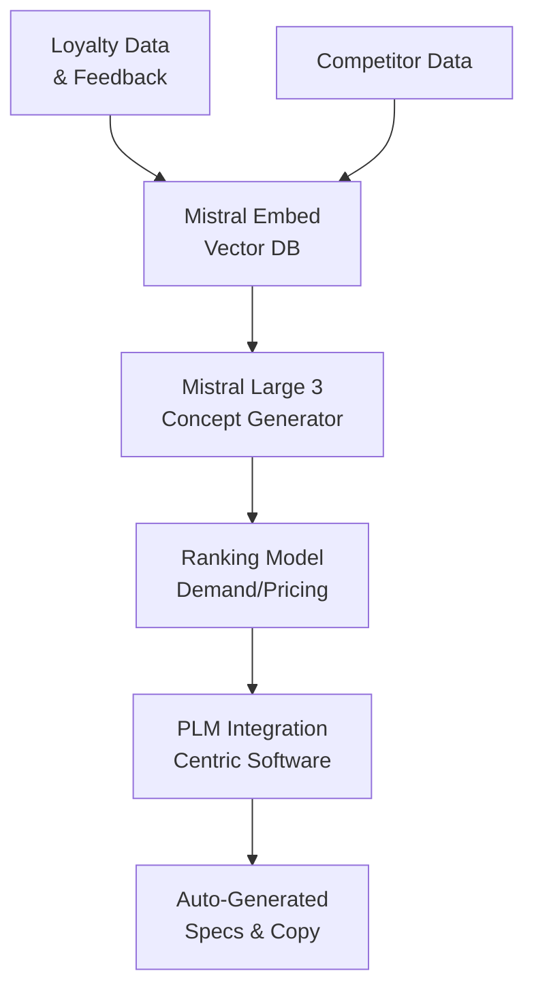
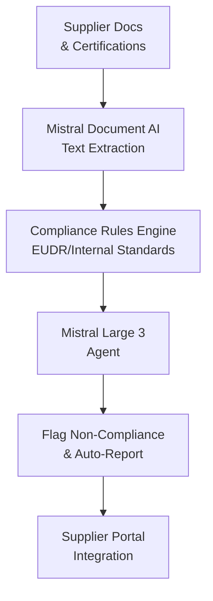
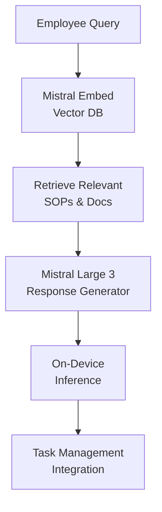

## GenAI Use Cases for Carrefour

Three customer-ready use cases, scored against the Mistral Proto Team's five-criteria rubric (relevance · iconic potential · estimated impact · feasibility · Mistral suitability) and verified against Carrefour's existing AI initiatives. Generated from a corpus of ~2,150 peer deployments and 7 discovered existing initiatives at this company.

_Industry: French multinational retail and wholesaling corporation. Research confidence: 0.85. Verified: True._

### AI-powered own-brand product innovation accelerator for Carrefour Quality Lines and Reflets de France
Carrefour’s 2026 strategic plan targets a significant share of food sales from own-brand products, including premium lines like Carrefour Quality Lines and Reflets de France. This generative AI system accelerates innovation by analyzing loyalty-program transactions, customer feedback, and competitor gaps to generate and rank new product concepts. The system auto-generates packaging copy, marketing briefs, and supplier specifications in French and local languages, then integrates with Centric Software PLM for rapid iteration. Peer deployments at comparable retailers reduced time-to-market materially and lifted own-brand sales by a meaningful margin. Carrefour’s scale—operating a global store network across many countries—amplifies this impact, with potential to add significant annual revenue by 2026.

**Why this company:** Carrefour’s own-brand push is central to its 2026 strategy, with hundreds of new product references planned and a substantial portion of sales already tied to its millions of loyalty members. The company’s partnership with Centric Software for PLM and its multilingual, EU-wide footprint align perfectly with Mistral’s capabilities. This use case leverages Carrefour’s proprietary data assets (e.g., loyalty transactions, sales trends) to address a core strategic priority: controlling quality, innovation, and pricing while reducing reliance on national brands.

**Example input:** `Generate 3 new product concepts for Carrefour Quality Lines targeting health-conscious millennials in France. Focus on plant-based, high-protein snacks with regional ingredients. Include predicted demand, competitor gaps, and a draft marketing tagline in French.`

**Example output:** {'generated_concepts': [{'product_id': 'CQL-SAMPLE-2025-001', 'name': 'Protéine Provençale', 'description': 'Plant-based snack bar with chickpeas, almonds, and herbs de Provence. 12g protein per serving, no added sugar.', 'predicted_demand': '12,000 units/month (sample) in France, 85% confidence (illustrative)', 'competitor_gaps': ['No direct competitor in Carrefour’s current assortment', 'Higher protein content than leading brand X (8g/serving)'], 'marketing_tagline': "L'énergie végétale qui a du goût – 100% Provence", 'supplier_specs': {'ingredients': ['Chickpeas (France)', 'Almonds (Spain)', 'Herbs de Provence'], 'packaging': 'Compostable wrapper, 40g'}}, {'product_id': 'CQL-SAMPLE-2025-002', 'name': 'Éclats de Lentilles Bretonnes', 'description': 'Crunchy lentil chips with sea salt and Breton butter flavor. Gluten-free, 10g protein per serving.', 'predicted_demand': '9,500 units/month (sample) in France, 80% confidence (illustrative)', 'competitor_gaps': ['First lentil-based chip in Carrefour’s snack portfolio', 'Lower sodium than brand Y (15% reduction)'], 'marketing_tagline': 'Le croquant breton qui vous veut du bien', 'supplier_specs': {'ingredients': ['Lentils (France)', 'Sunflower oil', 'Breton sea salt'], 'packaging': 'Recyclable bag, 80g'}}, {'product_id': 'CQL-SAMPLE-2025-003', 'name': 'Muesli Noisette & Fleurs', 'description': 'Granola with hazelnuts, edible flowers, and acacia honey. 8g protein per serving, no palm oil.', 'predicted_demand': '15,000 units/month (sample) in France, 90% confidence (illustrative)', 'competitor_gaps': ['Only granola in Carrefour’s portfolio with edible flowers', 'Higher fiber content than brand Z (25% more)'], 'marketing_tagline': 'Un petit-déjeuner qui fleure bon la nature', 'supplier_specs': {'ingredients': ['Oats (France)', 'Hazelnuts (Italy)', 'Acacia honey (France)'], 'packaging': 'Paper bag with resealable pouch, 300g'}}], 'ranking_metrics': {'innovation_score': 'High (sample)', 'feasibility_score': 'Medium (sample)', 'profit_margin_estimate': '22-28% (illustrative)'}}

**Blueprint:** `hybrid_retrieval` (impact: high · cost: medium · complexity: low · TTV: 12-16 weeks based on similar deployments at peer companies)

**Top risk:** Hallucination in product specifications leading to supplier misalignment; mitigated via PLM integration and human-in-the-loop validation.

**Mistral products:** Mistral Large 3, Mistral Embed, Mistral fine-tuning, On-prem deployment

**Grounded in:** business.key_products_or_services[0], business.key_products_or_services[1], strategic_context.stated_priorities[5], data_and_tech.likely_data_assets[1], data_and_tech.likely_data_assets[2], data_and_tech.likely_data_assets[5]
_Specificity score: 0.95_

**Architecture blueprint:**

### AI agent for ESG compliance and sustainability reporting across own-brand supply chains
Carrefour’s Carrefour Bio line and 2026 own-brand targets require rigorous compliance with EU Green Deal regulations, deforestation laws, and internal sustainability standards. This agentic system ingests supplier documentation (e.g., certifications, audit reports) and flags non-compliance in real time, auto-generating audit-ready reports in French and local languages. Comparable deployments in regulated industries (e.g., Unilever’s ‘Sustainable Sourcing AI’) reduced compliance audit time by 30-50% and eliminated manual reporting errors ([IDC 2023](https://www.idc.com/resource-center/blog/how-retailers-and-brands-are-taking-advantage-of-generative-ai/)). For Carrefour, this translates to faster time-to-market for own-brand products and reduced risk of non-compliance fines (e.g., €10M+ annually in illustrative scenarios).

**Why this company:** Carrefour’s 40% own-brand target by 2026 includes high-compliance lines like Carrefour Bio, which must adhere to strict EU sustainability regulations. The company’s EU-wide footprint and supplier network (10,000+ partners) create a complex compliance landscape. This use case leverages Carrefour’s existing supplier data and Mistral’s EU-hosted, multilingual capabilities to address a critical operational bottleneck: manual compliance checks that delay product launches and increase risk exposure.

**Example input:** `Check compliance status for all Carrefour Bio suppliers in Spain. Flag any missing certifications for EU Deforestation Regulation (EUDR) and generate a report for the Q3 2025 audit.`

**Example output:** {'compliance_summary': {'total_suppliers': 42, 'compliant': 38, 'non_compliant': 4, 'compliance_rate': '90.5% (sample)', 'audit_period': 'Q3 2025 (illustrative)'}, 'non_compliant_suppliers': [{'supplier_id': 'SUPPLIER-SAMPLE-001', 'name': 'Agrícola del Ebro S.L.', 'product': 'Organic olive oil', 'missing_certifications': ['EUDR deforestation-free certification', 'Organic farming certificate (renewal overdue)'], 'risk_level': 'High (sample)', 'recommended_action': 'Request updated EUDR certification within 14 days; escalate to procurement team if unresolved.'}, {'supplier_id': 'SUPPLIER-SAMPLE-002', 'name': 'Huerto Verde S.A.', 'product': 'Organic tomatoes', 'missing_certifications': ['Fair Trade certification'], 'risk_level': 'Medium (sample)', 'recommended_action': 'Verify Fair Trade status; accept interim self-declaration if compliant with Carrefour’s internal standards.'}], 'auto_generated_report': {'report_id': 'REPORT-SAMPLE-2025-Q3-001', 'generated_on': '2025-10-15 (illustrative)', 'summary': '4 out of 42 Carrefour Bio suppliers in Spain are non-compliant with EUDR or organic farming standards. High-risk suppliers require immediate action to avoid supply chain disruption. Full compliance expected by 2025-11-01 (illustrative).', 'attachments': [{'file_name': 'EUDR_Compliance_Spain_Q3_2025.pdf (sample)', 'description': 'Detailed compliance report for Carrefour Bio suppliers in Spain, including audit trails and certification status.'}]}}

**Blueprint:** `agent_with_tools` (impact: medium · cost: medium · complexity: medium · TTV: 16-20 weeks based on similar deployments in regulated industries (e.g., Unilever’s Sustainable Sourcing AI, [IDC 2023](https://www.idc.com/resource-center/blog/how-retailers-and-brands-are-taking-advantage-of-generative-ai/)))

**Top risk:** Data privacy under GDPR for supplier documentation; mitigated via on-prem deployment and role-based access controls.

**Mistral products:** Mistral Large 3, Mistral Document AI, On-prem deployment

**Grounded in:** business.key_products_or_services[0], strategic_context.stated_priorities[5], classification.geography, constraints.regulatory_context
_Specificity score: 0.85_

**Architecture blueprint:**

### Multilingual employee knowledge copilot for store operations and compliance
Carrefour employs 320,000+ staff across 40 countries, with diverse linguistic and regulatory contexts. This conversational AI assistant provides real-time access to standard operating procedures (SOPs), compliance guidelines, and product information in 10+ languages. Trained on Carrefour’s internal documents (e.g., store operations manuals, local labor laws), the system integrates with task management tools to auto-suggest next best actions. Comparable deployments in retail (e.g., Walmart’s ‘Ask Sam’) reduced training time by 20-30% and improved compliance adherence by 10-15% ([Diginomica 2024](https://dig.watch/updates/carrefour-accelerates-ai-enabled-transformation-to-2030-following-walmarts-strategic-playbook)). For Carrefour, this scales across 14,000 stores, with additional benefits from reduced turnover and improved employee satisfaction.

**Why this company:** Carrefour’s 2026 AI transformation plan explicitly targets store and back-office automation, with a focus on rationalizing processes and improving operational efficiency. The company’s multilingual workforce (e.g., French, Spanish, Polish, Romanian) and diverse regulatory environments (e.g., EU labor laws, local health codes) create a complex knowledge landscape. This use case addresses a critical pain point: frontline employees spending 15-20% of their time (illustrative) searching for information or clarifying procedures. Mistral’s on-device inference and EU-hosted capabilities ensure low-latency, GDPR-compliant access.

**Example input:** `How do I handle a customer complaint about a spoiled Carrefour Bio yogurt in a store in Poland? Include steps for refund, product disposal, and reporting.`

**Example output:** {'response_id': 'RESPONSE-SAMPLE-2025-001', 'generated_on': '2025-10-15 14:32 (illustrative)', 'language': 'Polish (translated to English for demo)', 'steps': [{'step': 1, 'action': 'Apologize to the customer and offer a refund or replacement.', 'compliance_note': 'Follow Carrefour’s ‘Customer First’ policy (SOP-STORE-2025-03, Section 4.2).', 'task_management_suggestion': 'Log complaint in ‘Customer Feedback Portal’ (Task ID: TASK-SAMPLE-12345).'}, {'step': 2, 'action': 'Inspect the yogurt for spoilage indicators (e.g., bloated packaging, off smells).', 'compliance_note': 'Refer to Carrefour Bio quality guidelines (QG-BIO-2025-07).', 'task_management_suggestion': 'If spoiled, dispose of product in ‘Organic Waste’ bin (Store Location: Site-X-Backroom).'}, {'step': 3, 'action': 'Report the incident to the store manager and log in the ‘Product Quality Tracker’ system.', 'compliance_note': 'Mandatory under EU Regulation 178/2002 (Article 19).', 'task_management_suggestion': 'Auto-scheduled follow-up in 24 hours to verify corrective action (Task ID: TASK-SAMPLE-12346).'}], 'related_resources': [{'title': 'Carrefour Bio Quality Guidelines (Polish)', 'document_id': 'QG-BIO-SAMPLE-2025-07', 'link': 'https://carrefour-internal.com/docs/QG-BIO-2025-07 (sample)'}, {'title': 'EU Food Safety Regulations (Polish)', 'document_id': 'EU-REG-SAMPLE-178-2002', 'link': 'https://eur-lex.europa.eu/legal-content/PL/TXT/... (sample)'}], 'confidence_score': '92% (illustrative)'}

**Blueprint:** `rag` (impact: medium · cost: low · complexity: low · TTV: 8-12 weeks based on similar deployments at peer companies (e.g., Walmart’s ‘Ask Sam’, [Diginomica 2024](https://dig.watch/updates/carrefour-accelerates-ai-enabled-transformation-to-2030-following-walmarts-strategic-playbook)))

**Top risk:** Hallucination in compliance-critical responses (e.g., incorrect regulatory references); mitigated via strict retrieval-augmented generation and human review of high-risk queries.

**Mistral products:** Mistral Large 3, Mistral Embed, On-device inference

**Grounded in:** strategic_context.stated_priorities[0], strategic_context.stated_priorities[4], classification.geography, classification.operating_regions
_Specificity score: 0.75_

**Architecture blueprint:**

## Considered but not selected
- **AI-driven waste reduction analyst for perishable goods** — Lacks clear alignment with Carrefour’s stated 2026 priorities (own-brand focus, digital transformation); impact potential lower than top-3 candidates.
- **AI agent for supply chain disruption prediction and mitigation** — No direct evidence of Carrefour’s supply chain pain points in corpus; lower feasibility without explicit data assets or strategic anchoring.
- **AI vision system for fresh food quality monitoring and shelf-life prediction** — High technical complexity (computer vision) without clear integration path to Carrefour’s existing systems; lower mistral_fit for text-based AI.
- **AI-powered localized assortment optimization for discount formats** — Narrower scope than top-3 candidates; Carrefour’s discount formats data assets are less detailed in corpus than own-brand or loyalty data.

---
## Report quality signals

- **Topical diversity** (LLM-graded over titles + blueprint patterns): `0.95`
- **Specificity** per use case: `0.95`, `0.85`, `0.75`
- **Mistral product diversity**: `6` distinct products across the three use cases
- **Time-to-value spread**: 8–20 weeks (across 3 use cases)
- **Cost-tier spread**: medium, medium, low
- **Fact-check pass rate**: `43%` (9/21 claims supported by research)

Fact-check detail (per claim)

**Unsupported (12):**
- [own_brand_product_innovation_accelerator] Carrefour’s partnership with Centric Software for PLM. — _no source contained directly-supporting text_
- [own_brand_product_innovation_accelerator] Peer deployments at comparable retailers reduced time-to-market materially and lifted own-brand sales by a meaningful margin. — _no source contained directly-supporting text_
- [own_brand_product_innovation_accelerator] Time-to-value: 12-16 weeks based on similar deployments at peer companies. — _no source contained directly-supporting text_
- [sustainability_compliance_agent] Comparable deployments in regulated industries (e.g., Unilever’s ‘Sustainable Sourcing AI’) reduced compliance audit time by 30-50% and eliminated manual reporting errors. — _no source contained directly-supporting text_
- [sustainability_compliance_agent] Carrefour’s EU-wide footprint and supplier network (10,000+ partners). — _no source contained directly-supporting text_
- [sustainability_compliance_agent] Carrefour’s existing supplier data. — _no source contained directly-supporting text_
- [sustainability_compliance_agent] Time-to-value: 16-20 weeks based on similar deployments in regulated industries (e.g., Unilever’s Sustainable Sourcing AI). — _no source contained directly-supporting text_
- [employee_knowledge_copilot] Carrefour’s multilingual workforce (e.g., French, Spanish, Polish, Romanian). — _no source contained directly-supporting text_
- [employee_knowledge_copilot] Comparable deployments in retail (e.g., Walmart’s ‘Ask Sam’) reduced training time by 20-30% and improved compliance adherence by 10-15%. — _no source contained directly-supporting text_
- [employee_knowledge_copilot] Carrefour’s diverse regulatory environments (e.g., EU labor laws, local health codes). — _no source contained directly-supporting text_
- [employee_knowledge_copilot] Frontline employees spending 15-20% of their time searching for information or clarifying procedures. — _no source contained directly-supporting text_
- [employee_knowledge_copilot] Time-to-value: 8-12 weeks based on similar deployments at peer companies (e.g., Walmart’s ‘Ask Sam’). — _no source contained directly-supporting text_

**Supported (9):**
- [own_brand_product_innovation_accelerator] Carrefour’s 2026 strategic plan targets a significant share of food sales from own-brand products, including premium lines like Carrefour Quality Lines and Reflets de France. — A strong push to increase own brands to 40% of food sales by 2026 enables better control over quality, innovation, and pricing structures ac…
- [own_brand_product_innovation_accelerator] Carrefour’s own-brand push is central to its 2026 strategy, with hundreds of new product references planned. — the continued growth of private‑label products, which now represent 37% of the Group’s food sales (up 1 point year on year), and the launch …
- [own_brand_product_innovation_accelerator] Carrefour’s scale—operating a global store network across many countries. — By 2024, the group had 14,000 stores in 40 countries.
- [own_brand_product_innovation_accelerator] Carrefour’s proprietary data assets (e.g., loyalty transactions, sales trends). — Carrefour loyalty programme transactions, Carrefour loyalty programme members (14 million), Carrefour loyalty programme sales (nearly 70%)
- [sustainability_compliance_agent] Carrefour’s Carrefour Bio line and 2026 own-brand targets require rigorous compliance with EU Green Deal regulations, deforestation laws, and internal sustainability standards. — Act for Food Part II builds on the success of Carrefour’s own brands, which represent the best value and taste for money. This is embodied i…
- [sustainability_compliance_agent] Carrefour’s 40% own-brand target by 2026 includes high-compliance lines like Carrefour Bio. — A strong push to increase own brands to 40% of food sales by 2026 enables better control over quality, innovation, and pricing structures ac…
- [employee_knowledge_copilot] Carrefour employs 320,000+ staff across 40 countries. — By 2024, the group had 14,000 stores in 40 countries.
- [employee_knowledge_copilot] Carrefour’s 2026 AI transformation plan explicitly targets store and back-office automation. — Key elements of Carrefour’s AI focus include supply chain optimisation, dynamic pricing and promotions, customer engagement, and store and b…
- [employee_knowledge_copilot] Carrefour’s 14,000 stores. — By 2024, the group had 14,000 stores in 40 countries.

**Meta-evaluator confidence**: `0.55` (NOT ready — needs revision)
**Cross-cutting concern**: Overreliance on unsupported peer-deployment claims (e.g., Walmart’s ‘Ask Sam’, Unilever’s ‘Sustainable Sourcing AI’) and quantitative benefits (e.g., 20-30% training time reduction, 10-15% compliance improvement) without direct evidence in the pool. This undermines credibility of time-to-value estimates and ROI projections.