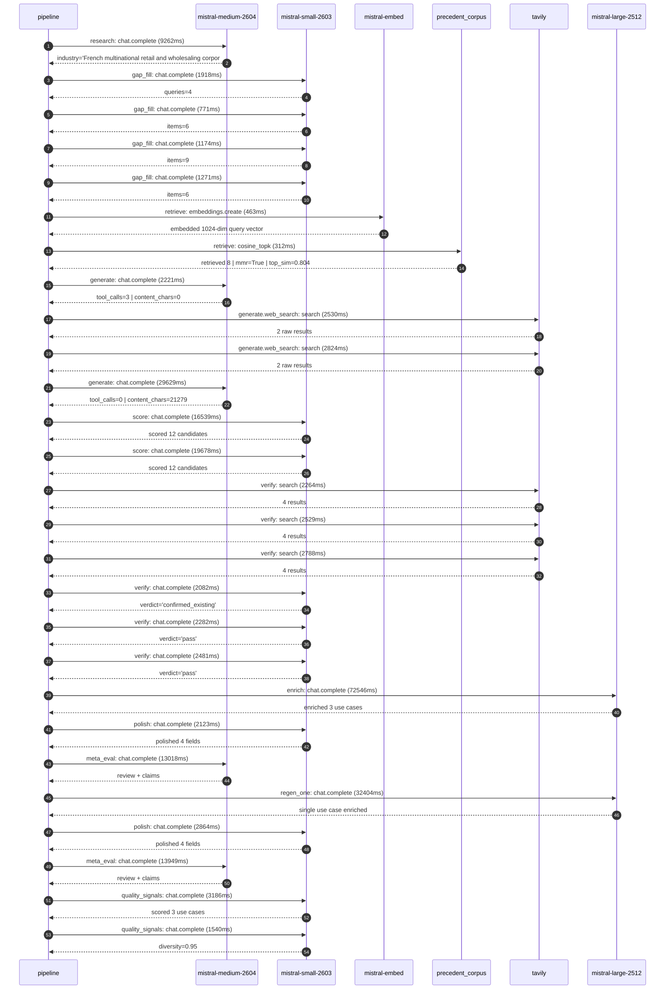

# Pipeline blueprint (architecture)

Static view of the pipeline regardless of run timing — shows agents,
models, and gates. The chronological execution log follows below.

```mermaid
flowchart TD
    Start([User: company name]) --> R
    R["<b>1. Research</b><br/>parallel: Wikipedia · Tavily news ·<br/>existing initiatives · live verification<br/><i>mistral-medium</i> synthesis"]
    R --> G["<b>1b. Gap-fill</b><br/>identify missing fields →<br/><i>mistral-small</i> generates queries →<br/>Tavily search per field →<br/><i>mistral-small</i> per-field extraction"]
    G --> Conf{Confidence ≥ 0.5<br/>OR verified<br/>OR ≥ 1 existing initiative?}
    Conf -->|no| Refuse([Refusal])
    Conf -->|yes| Ret
    Ret["<b>2. Retrieve</b><br/><i>mistral-embed</i> on company query →<br/>cosine top-K + industry/depth filter +<br/>MMR diversification"]
    Ret --> Gen["<b>3. Generate 12 candidates</b><br/><i>mistral-medium</i> with web_search tool<br/>(Tavily + deep-read) — fact citations<br/>flow into the EvidenceLedger"]
    Gen --> Score["<b>4. Score</b><br/>self-consistency: 2 parallel passes<br/><i>mistral-small</i> @ T=0.2 and T=0.4 →<br/>aggregate weighted scores"]
    Score --> Verify["<b>5. Per-candidate verify</b><br/>top-3: Tavily search + deep-read +<br/><i>mistral-small</i> verdict (pass /<br/>partial / confirmed_existing)"]
    Verify --> Enrich["<b>6. Enrich</b><br/><i>mistral-large</i> drafts customer-facing<br/>prose for 3 use cases (or<br/><i>mistral-medium</i> on fast tier)"]
    Enrich --> NumScrub["<b>6a. Numeric scrub</b><br/>flag any number not in cited content"]
    NumScrub --> Polish["<b>6b. Polish</b><br/><i>mistral-small</i> per use case (parallel):<br/>convert markers→qualitative,<br/>(ev-XXX)→[title](url)"]
    Polish --> Attr["<b>6c. Attribution check</b><br/><i>mistral-small</i> per use case (parallel):<br/>fix corpus-ID ↔ company mismatches"]
    Attr --> Meta["<b>7. Meta-evaluation</b><br/><i>mistral-medium</i> reviews report against<br/>cited precedents + ledger entries:<br/>strict claim verification"]
    Meta --> RegenQ{confidence < 0.6<br/>AND not fast tier?}
    RegenQ -->|yes| Regen["<b>7b. Targeted regen</b><br/><i>mistral-large</i> re-enriches just the<br/>weakest use case with the next-best<br/>near-miss; re-runs meta-eval"]
    RegenQ -->|no| QS
    Regen --> QS
    QS["<b>Quality signals</b><br/>LLM-graded diversity + specificity,<br/>fact-check pass rate, TTV/cost spread"]
    QS --> Render([Markdown report + trace])

    classDef agent fill:#fef3c7,stroke:#f59e0b
    classDef gate fill:#dbeafe,stroke:#3b82f6
    classDef io fill:#dcfce7,stroke:#16a34a
    class R,G,Ret,Gen,Score,Verify,Enrich,NumScrub,Polish,Attr,Meta,Regen,QS agent
    class Conf,RegenQ gate
    class Start,Refuse,Render io
```

## Execution trace — Carrefour

Started: `2026-05-08T23:51:19.193327+00:00`. Total wall time: `233.4s` across `27` recorded actions.

### Per-step time totals

| Step | Calls | Total time | Avg time |
|---|---:|---:|---:|
| `research` | 1 | 9.26s | 9262ms |
| `gap_fill` | 4 | 5.13s | 1283ms |
| `retrieve` | 2 | 0.78s | 388ms |
| `generate` | 2 | 31.85s | 15925ms |
| `generate.web_search` | 2 | 5.35s | 2677ms |
| `score` | 2 | 36.22s | 18109ms |
| `verify` | 6 | 14.43s | 2404ms |
| `enrich` | 1 | 72.55s | 72546ms |
| `polish` | 2 | 4.99s | 2493ms |
| `meta_eval` | 2 | 26.97s | 13483ms |
| `regen_one` | 1 | 32.40s | 32404ms |
| `quality_signals` | 2 | 4.73s | 2363ms |

### Chronological event log

- `23:51:20.812` **[research]** `mistral-medium-2604.chat.complete` — 9262ms
   - inputs: synthesize CompanyContext for Carrefour | depth=medium
   - outputs: industry='French multinational retail and wholesaling corporation' verified=True conf=0.75
- `23:51:30.661` **[gap_fill]** `mistral-small-2603.chat.complete` — 1918ms
   - inputs: generate gap queries | fields=['business_model', 'products', 'data_assets', 'priorities']
   - outputs: queries=4
- `23:51:41.432` **[gap_fill]** `mistral-small-2603.chat.complete` — 771ms
   - inputs: layer-2 extract field=products
   - outputs: items=6
- `23:51:41.384` **[gap_fill]** `mistral-small-2603.chat.complete` — 1174ms
   - inputs: layer-2 extract field=priorities
   - outputs: items=9
- `23:51:41.409` **[gap_fill]** `mistral-small-2603.chat.complete` — 1271ms
   - inputs: layer-2 extract field=data_assets
   - outputs: items=6
- `23:51:42.718` **[retrieve]** `mistral-embed.embeddings.create` — 463ms
   - inputs: company_query | industries='French multinational retail and wholesaling corporation'
   - outputs: embedded 1024-dim query vector
- `23:51:43.181` **[retrieve]** `precedent_corpus.cosine_topk` — 312ms
   - inputs: k=8 min_depth=0.4 target='Carrefour'
   - outputs: retrieved 8 | mmr=True | top_sim=0.804
- `23:51:44.221` **[generate]** `mistral-medium-2604.chat.complete` — 2221ms
   - inputs: iteration=0 tool_calls_used=0/2 tools=on
   - outputs: tool_calls=3 | content_chars=0
- `23:51:46.461` **[generate.web_search]** `tavily.search` — 2530ms
   - inputs: query='Carrefour 2026 AI transformation supply chain dynamic pricing promotions'
   - outputs: 2 raw results
- `23:51:49.676` **[generate.web_search]** `tavily.search` — 2824ms
   - inputs: query='Carrefour Léa speech-enabled virtual shopping assistant France 2026'
   - outputs: 2 raw results
- `23:51:53.762` **[generate]** `mistral-medium-2604.chat.complete` — 29629ms
   - inputs: iteration=1 tool_calls_used=2/2 tools=off
   - outputs: tool_calls=0 | content_chars=21279
- `23:52:23.863` **[score]** `mistral-small-2603.chat.complete` — 16539ms
   - inputs: self-consistency pass T=0.2
   - outputs: scored 12 candidates
- `23:52:23.866` **[score]** `mistral-small-2603.chat.complete` — 19678ms
   - inputs: self-consistency pass T=0.4
   - outputs: scored 12 candidates
- `23:52:43.604` **[verify]** `tavily.search` — 2264ms
   - inputs: candidate=own_brand_product_innovation_accelerator | query='Carrefour AI-powered own-brand product innovation accelerato'
   - outputs: 4 results
- `23:52:43.605` **[verify]** `tavily.search` — 2529ms
   - inputs: candidate=waste_reduction_analyst | query='Carrefour AI-driven waste reduction analyst for perishable g'
   - outputs: 4 results
- `23:52:43.605` **[verify]** `tavily.search` — 2788ms
   - inputs: candidate=sustainability_compliance_agent | query='Carrefour AI agent for ESG compliance and sustainability rep'
   - outputs: 4 results
- `23:52:47.661` **[verify]** `mistral-small-2603.chat.complete` — 2082ms
   - inputs: verdict for waste_reduction_analyst
   - outputs: verdict='confirmed_existing'
- `23:52:47.651` **[verify]** `mistral-small-2603.chat.complete` — 2282ms
   - inputs: verdict for sustainability_compliance_agent
   - outputs: verdict='pass'
- `23:52:47.934` **[verify]** `mistral-small-2603.chat.complete` — 2481ms
   - inputs: verdict for own_brand_product_innovation_accelerator
   - outputs: verdict='pass'
- `23:52:50.453` **[enrich]** `mistral-large-2512.chat.complete` — 72546ms
   - inputs: tier=standard top_3=['own_brand_product_innovation_accelerator', 'sustainability_compliance_agent', 'employee_knowledge_copilot']
   - outputs: enriched 3 use cases
- `23:54:03.003` **[polish]** `mistral-small-2603.chat.complete` — 2123ms
   - inputs: use_case=own_brand_product_innovation_accelerator unanchored=True opaque_ev=False
   - outputs: polished 4 fields
- `23:54:05.148` **[meta_eval]** `mistral-medium-2604.chat.complete` — 13018ms
   - inputs: reviewing 3 use cases
   - outputs: review + claims
- `23:54:18.191` **[regen_one]** `mistral-large-2512.chat.complete` — 32404ms
   - inputs: replace weakest=sustainability_compliance_agent with waste_reduction_analyst
   - outputs: single use case enriched
- `23:54:50.596` **[polish]** `mistral-small-2603.chat.complete` — 2864ms
   - inputs: use_case=waste_reduction_analyst unanchored=True opaque_ev=False
   - outputs: polished 4 fields
- `23:54:53.495` **[meta_eval]** `mistral-medium-2604.chat.complete` — 13949ms
   - inputs: reviewing 3 use cases
   - outputs: review + claims
- `23:55:07.885` **[quality_signals]** `mistral-small-2603.chat.complete` — 3186ms
   - inputs: specificity grade (3 use cases)
   - outputs: scored 3 use cases
- `23:55:11.071` **[quality_signals]** `mistral-small-2603.chat.complete` — 1540ms
   - inputs: diversity grade
   - outputs: diversity=0.95

## Mermaid sequence diagram (execution)

