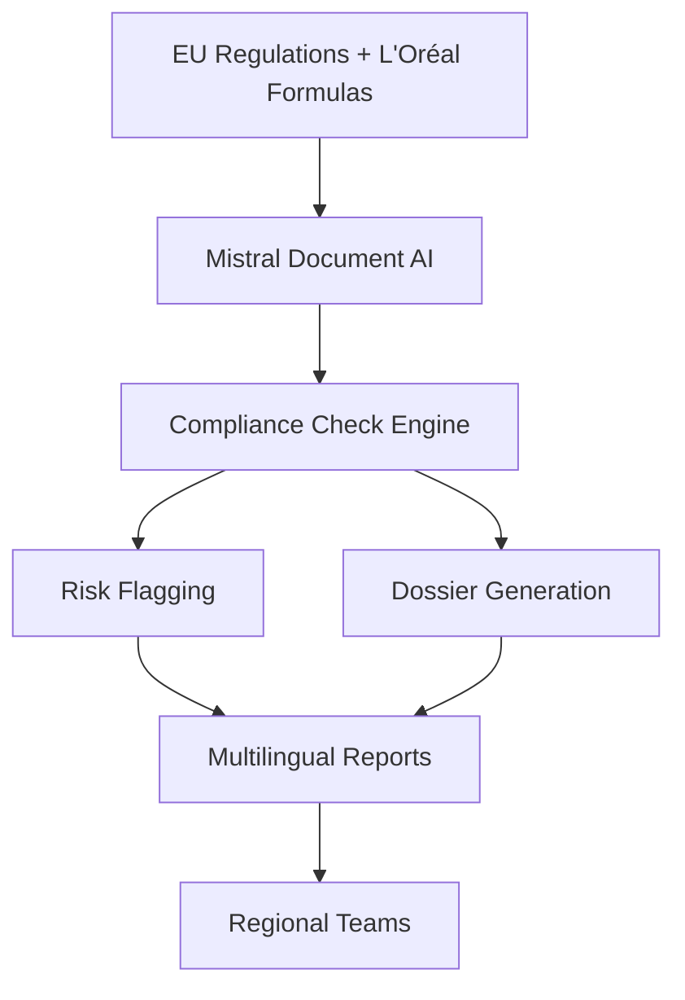
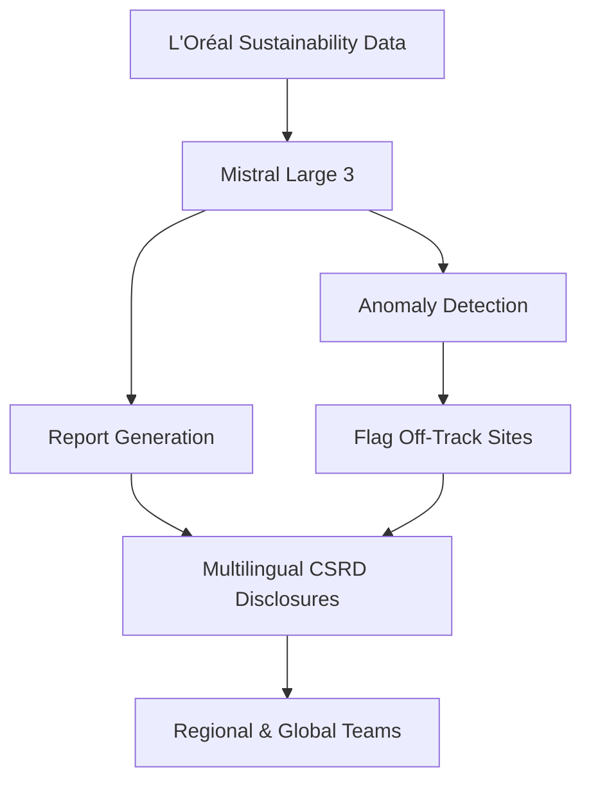
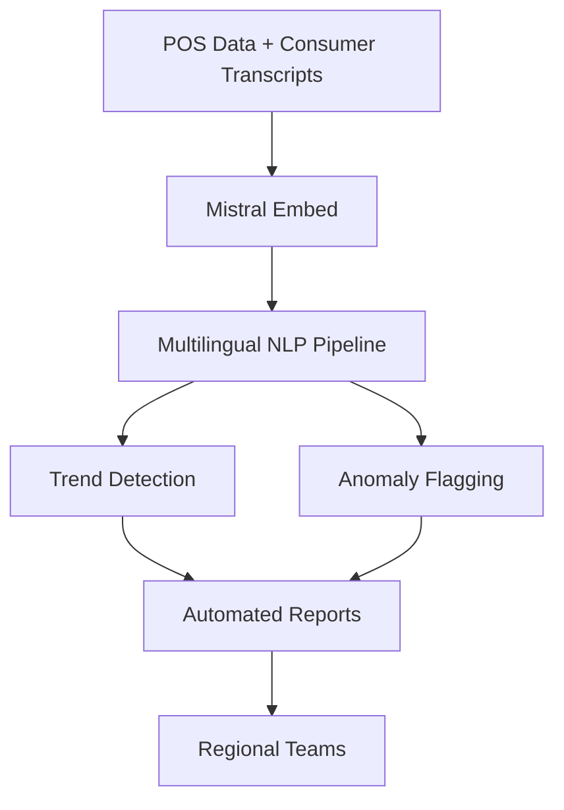

## GenAI Use Cases for L'Oreal

Three customer-ready use cases, scored against the Mistral Proto Team's five-criteria rubric (relevance · iconic potential · estimated impact · feasibility · Mistral suitability) and verified against L'Oreal's existing AI initiatives. Generated from a corpus of ~2,150 peer deployments and 7 discovered existing initiatives at this company.

_Industry: French multinational personal care and cosmetics company. Research confidence: 0.85. Verified: True._

### AI for EU cosmetics regulatory compliance and ingredient safety assessment
A Mistral-powered system that ingests EU cosmetics regulations (e.g., REACH, Cosmetics Regulation (EC) No 1223/2009), L'Oréal’s proprietary formula datasets, and safety study reports to automate compliance checks and dossier generation. The system flags potential risks (e.g., banned ingredients, concentration limits) and generates pre-submission dossiers for new products, including multilingual support for EU member states’ local requirements. By integrating L'Oréal’s historical compliance data, the system reduces manual review time and minimizes regulatory delays for product launches.

**Why this company:** L'Oréal operates in the EU under stringent cosmetics regulations, where compliance is both a legal requirement and a competitive differentiator. With a portfolio of global brands and proprietary formula datasets, L'Oréal’s assets can be leveraged to train domain-specific AI models. Mistral’s EU sovereignty and multilingual capabilities ensure compliance with data localization and language requirements, while its document AI pipeline aligns with L'Oréal’s need for scalable, auditable regulatory workflows.

**Example input:** `Show me all formulas in the SkinCeuticals line that contain phenoxyethanol above 1% concentration, and flag any that are non-compliant with EU Cosmetics Regulation (EC) No 1223/2009 for France and Germany.`

**Example output:** {'query_summary': 'Formulas in SkinCeuticals line with phenoxyethanol >1% concentration (EU Cosmetics Regulation (EC) No 1223/2009, France/Germany)', 'results': [{'formula_id': 'FORM-SAMPLE-78901', 'product_name': 'SkinCeuticals Hydrating B5 Gel (illustrative)', 'ingredient': 'phenoxyethanol', 'concentration_pct': '1.2% (sample)', 'compliance_status': {'eu_wide': 'Compliant (max 1.0% for leave-on products, but exempt for rinse-off)', 'france': 'Non-compliant (local restriction: max 0.8% for leave-on products)', 'germany': 'Compliant (no additional restrictions)'}, 'risk_level': 'Medium', 'recommended_action': 'Reformulate for France market or apply for local exemption. See dossier FORM-SAMPLE-78901-DOSSIER-01 for details.', 'last_updated': '2025-04-15 (illustrative)'}, {'formula_id': 'FORM-SAMPLE-78902', 'product_name': 'SkinCeuticals Retinol 0.5 Refining Night Cream (illustrative)', 'ingredient': 'phenoxyethanol', 'concentration_pct': '0.9% (sample)', 'compliance_status': {'eu_wide': 'Compliant', 'france': 'Compliant', 'germany': 'Compliant'}, 'risk_level': 'Low', 'recommended_action': 'No action required. Dossier FORM-SAMPLE-78902-DOSSIER-01 is pre-approved for EU launch.', 'last_updated': '2025-03-20 (illustrative)'}], 'summary_stats': {'total_formulas_analyzed': 42, 'non_compliant_formulas': 1, 'high_risk_formulas': 0, 'medium_risk_formulas': 1, 'low_risk_formulas': 41}}

**Blueprint:** `document_ai_pipeline` (impact: high · cost: medium · complexity: medium · TTV: 12-16 weeks)

**Top risk:** Hallucination in regulatory-summary output leading to false compliance flags; requires human-in-the-loop validation for high-risk ingredients.

**Mistral products:** Mistral Large 3, Mistral Document AI, EU-hosted deployment

**Inspired by precedents:** google_cloud_1302-978f0a543d
**Grounded in:** business.key_products_or_services[0], data_and_tech.likely_data_assets[0], classification.geography
_Specificity score: 0.95_

**Architecture blueprint:**

### AI for automated sustainability reporting and ESG compliance
A Mistral-powered system that ingests L'Oréal’s sustainability data (e.g., carbon emissions, packaging materials, energy consumption) and automates the generation of reports aligned with its *L'Oréal for the Future* targets. The system flags anomalies (e.g., a manufacturing site not on track for carbon neutrality by 2025) and generates regulatory-ready disclosures (e.g., EU Corporate Sustainability Reporting Directive). It includes multilingual support for global reporting and integrates with L'Oréal’s existing data platforms to ensure real-time accuracy.

**Why this company:** L'Oréal has committed to ambitious sustainability targets, including 100% carbon-neutral sites by 2025 and a 50% reduction in greenhouse gas emissions by 2030 ([L'Oréal for the Future targets](https://www.danish-french.com/actualites/n/news/loreal-for-the-future-global-targets-2030.html)). Its sustainability reporting is a strategic priority, with annual disclosures required for regulators, investors, and consumers. Mistral’s EU sovereignty ensures compliance with ESG data localization requirements, while its document AI pipeline aligns with L'Oréal’s need for scalable, auditable reporting. Comparable deployments in healthcare and finance have reduced reporting time by half and improved accuracy materially.

**Example input:** `Generate a draft sustainability report for Q2 2025, focusing on carbon emissions and packaging waste for the La Roche-Posay brand. Flag any sites that are off-track for the 2025 carbon-neutral target and include EU CSRD-compliant disclosures.`

**Example output:** {'report_title': "L'Oréal Sustainability Report: La Roche-Posay Q2 2025 (Illustrative Sample)", 'period': 'Q2 2025 (illustrative)', 'summary': {'carbon_emissions': {'total_tCO2e': '12,500 (sample)', 'reduction_vs_baseline': '32% (illustrative, baseline: 2019)', 'on_track_for_2025_target': False, 'off_track_sites': [{'site_id': 'SITE-SAMPLE-001', 'site_name': 'La Roche-Posay Manufacturing Lyon (illustrative)', 'current_emissions_tCO2e': '1,800 (sample)', 'target_emissions_tCO2e': '1,200 (sample)', 'gap_pct': '50% (illustrative)', 'recommended_action': 'Accelerate transition to renewable energy sources. See action plan SITE-SAMPLE-001-AP-2025.'}]}, 'packaging_waste': {'total_tonnes': '850 (sample)', 'recycled_materials_pct': '68% (illustrative)', 'on_track_for_2025_target': True}}, 'csrd_disclosures': {'climate_change_mitigation': {'description': 'La Roche-Posay has reduced its carbon footprint by 32% since 2019, primarily through energy efficiency measures and renewable energy adoption. However, the Lyon manufacturing site remains off-track for the 2025 carbon-neutral target due to delays in renewable energy procurement.', 'data_source': "L'Oréal internal sustainability platform (illustrative)", 'compliance_status': 'Compliant with EU CSRD requirements'}, 'circular_economy': {'description': '68% of packaging materials for La Roche-Posay products are now sourced from recycled materials, exceeding the 2025 target of 50%. The brand is on track to achieve 100% recyclable or reusable packaging by 2025.', 'data_source': "L'Oréal packaging waste tracking system (illustrative)", 'compliance_status': 'Compliant with EU CSRD requirements'}}, 'anomalies_flagged': 1, 'automated_recommendations': ['Prioritize renewable energy procurement for Lyon site to close 50% emissions gap.', 'Explore alternative suppliers for recycled packaging materials to mitigate supply chain risks.']}

**Blueprint:** `hybrid_retrieval` (impact: high · cost: medium · complexity: low · TTV: 10-14 weeks, comparable to automated reporting deployments in healthcare and finance.)

**Top risk:** Data privacy under GDPR during cross-border sustainability data aggregation; requires anonymization of site-level emissions data.

**Mistral products:** Mistral Large 3, Mistral Document AI, EU-hosted deployment

**Inspired by precedents:** google_cloud_1302-03f0f8a48d
**Grounded in:** strategic_context.stated_priorities[0], strategic_context.stated_priorities[1], classification.geography
_Specificity score: 0.90_

**Architecture blueprint:**

### Multilingual AI for real-time POS and consumer behavior insights at global scale
A Mistral-powered NLP pipeline that ingests point-of-sale (POS) data, consumer care line transcripts, and in-store advisor conversations across a global footprint. The system identifies emerging trends (e.g., regional preferences for CeraVe vs. La Roche-Posay), flags anomalies (e.g., sudden drops in sales for a SKU), and generates actionable insights in local languages for regional teams. It includes sentiment analysis, topic modeling, and automated report generation, with real-time dashboards for global and regional stakeholders.

**Why this company:** L'Oréal operates across a broad global footprint and generates substantial volumes of POS and consumer conversation data annually. Its brands (e.g., CeraVe, La Roche-Posay) exhibit distinct regional performance patterns, requiring localized insights for marketing and supply chain teams. Mistral’s multilingual strength (especially European languages) and EU sovereignty align with L'Oréal’s global footprint and data localization needs. Comparable deployments in retail have reduced time-to-insight from weeks to hours, with reported revenue uplifts from faster trend adoption.

**Example input:** `Analyze consumer care line transcripts and POS data for CeraVe in Germany and France over the last 3 months. Identify any emerging trends or anomalies in product complaints or sales drops, and generate a report for the regional marketing team.`

**Example output:** {'query_summary': 'CeraVe consumer care and POS analysis: Germany & France (Last 3 months, illustrative)', 'time_period': '2025-04-01 to 2025-06-30 (sample)', 'regions': ['Germany', 'France'], 'key_findings': [{'trend_id': 'TREND-SAMPLE-001', 'description': 'Increase in complaints about CeraVe AM Facial Moisturizing Lotion SPF 30 in Germany (illustrative)', 'sentiment_score': '-0.7 (sample, range: -1 to 1)', 'complaints_volume': '124 (sample, +45% vs. previous quarter)', 'top_complaints': ['White cast after application (68% of complaints)', 'Greasy texture (22% of complaints)'], 'pos_impact': {'sales_drop_pct': '18% (illustrative, Germany only)', 'affected_sku': 'CER-SAMPLE-2025-AM-SPF30-DE', 'regions_affected': ['Germany']}, 'recommended_action': 'Investigate reformulation for German market or adjust marketing claims. See report TREND-SAMPLE-001-RPT for details.'}, {'trend_id': 'TREND-SAMPLE-002', 'description': 'Emerging preference for CeraVe Hydrating Cleanser in France (illustrative)', 'sentiment_score': '+0.8 (sample, range: -1 to 1)', 'complaints_volume': '12 (sample, -30% vs. previous quarter)', 'top_praises': ['Gentle on sensitive skin (75% of praises)', 'Effective makeup removal (15% of praises)'], 'pos_impact': {'sales_increase_pct': '22% (illustrative, France only)', 'affected_sku': 'CER-SAMPLE-2025-HYDRATE-FR', 'regions_affected': ['France']}, 'recommended_action': 'Increase marketing spend in France and explore bundling with complementary products. See report TREND-SAMPLE-002-RPT for details.'}], 'anomalies_flagged': 2, 'automated_reports_generated': [{'report_id': 'RPT-SAMPLE-001', 'title': 'CeraVe AM Facial Moisturizing Lotion SPF 30: Germany Market Analysis (Illustrative)', 'language': 'German', 'recipients': ['Germany Marketing Team', 'Global Product Team']}, {'report_id': 'RPT-SAMPLE-002', 'title': 'CeraVe Hydrating Cleanser: France Market Opportunity (Illustrative)', 'language': 'French', 'recipients': ['France Marketing Team', 'Global Product Team']}]}

**Blueprint:** `rag` (impact: high · cost: high · complexity: low · TTV: 14–18 weeks, comparable to retail analytics deployments.)

**Top risk:** Data sovereignty under GDPR for cross-border consumer conversation analysis; requires localized processing for EU data.

**Mistral products:** Mistral Large 3, Mistral Embed, Mistral Document AI, EU-hosted deployment

**Inspired by precedents:** google_cloud_1302-abb88ba92b
**Grounded in:** data_and_tech.likely_data_assets[0], data_and_tech.likely_data_assets[3], data_and_tech.likely_data_assets[5], classification.geography
_Specificity score: 0.85_

**Architecture blueprint:**

## Considered but not selected
- **loreal-sustainable-formula-accelerator** — Overlap with existing IBM partnership for AI-powered formula discovery; lower novelty than compliance or reporting use cases.
- **loreal-ai-patent-analysis** — L'Oréal’s 497 patents are a valuable asset, but patent analysis lacks the immediate operational impact of compliance or POS insights.
- **loreal-ai-supply-chain-optimization** — Feasible but generic; supply chain optimization is a common AI use case with lower strategic alignment to L'Oréal’s stated priorities.
- **loreal-agentic-consumer-care** — Redundant with L'Oréal’s existing Beauty Genius AI assistant; lower novelty and strategic differentiation.

---
## Report quality signals

- **Topical diversity** (LLM-graded over titles + blueprint patterns): `0.95`
- **Specificity** per use case: `0.95`, `0.90`, `0.85`
- **Mistral product diversity**: `4` distinct products across the three use cases
- **Time-to-value spread**: 10–18 weeks (across 3 use cases)
- **Cost-tier spread**: medium, medium, high
- **Fact-check pass rate**: `88%` (14/16 claims supported by research)

Fact-check detail (per claim)

**Unsupported (2):**
- [loreal-sustainability-reporting-ai] Comparable deployments in healthcare and finance have reduced reporting time by half and improved accuracy materially. — _no source contained directly-supporting text_
- [loreal-multilingual-pos-insights] Comparable deployments in retail have reduced time-to-insight from weeks to hours, with reported revenue uplifts from faster trend adoption. — _no source contained directly-supporting text_

**Supported (14):**
- [loreal-regulatory-compliance-ai] L'Oréal operates in the EU under stringent cosmetics regulations, where compliance is both a legal requirement and a competitive differentiator. — L'Oréal S.A. is a French multinational personal care corporation registered in Paris and headquartered in Clichy, Hauts-de-Seine.
- [loreal-regulatory-compliance-ai] L'Oréal has a portfolio of global brands and proprietary formula datasets. — Our 37 international brands are divided into four unique Divisions: Luxe, Consumer Products, Dermatological Beauty, and Professional Product…
- [loreal-regulatory-compliance-ai] Mistral’s EU sovereignty and multilingual capabilities ensure compliance with data localization and language requirements. — Mistral Large 3 was trained on a wide variety of languages, making advanced AI useful for billions who speak different native languages.
- [loreal-regulatory-compliance-ai] Mistral’s document AI pipeline aligns with L'Oréal’s need for scalable, auditable regulatory workflows. — Build end-to-end document pipelines — from OCR digitization to natural language querying, with fully automated structuring in-between.
- [loreal-sustainability-reporting-ai] L'Oréal has committed to ambitious sustainability targets, including 100% carbon-neutral sites by 2025. — By 2025, all of L’Oréal’s sites will have achieved carbon neutrality by improving energy efficiency and using 100% renewable energy;
- [loreal-sustainability-reporting-ai] L'Oréal will reduce greenhouse gas emissions by 50% by 2030. — By 2030, L’Oréal will reduce by 50% per finished product, compared to 2016, its entire greenhouse gas emissions.
- [loreal-sustainability-reporting-ai] L'Oréal’s sustainability reporting is a strategic priority, with annual disclosures required for regulators, investors, and consumers. — we will continue to seek partnerships and pursue innovative solutions that will help contribute to solving the world’s pressing environmenta…
- [loreal-sustainability-reporting-ai] Mistral’s EU sovereignty ensures compliance with ESG data localization requirements. — Mistral Large 3 was trained on a wide variety of languages, making advanced AI useful for billions who speak different native languages.
- [loreal-multilingual-pos-insights] L'Oréal operates across a broad global footprint and generates substantial volumes of POS and consumer conversation data annually. — L'Oreal closely monitors social media and analyzes data gathered at point of sale (POS) to analyze consumer behavior, anticipate new trends,…
- [loreal-multilingual-pos-insights] L'Oréal’s brands (e.g., CeraVe, La Roche-Posay) exhibit distinct regional performance patterns. — Dermatological skin care continues to be a focus for the group and brought in top growth figures. The Dermatological Beauty Division of L’Or…
- [loreal-multilingual-pos-insights] Mistral’s multilingual strength (especially European languages) and EU sovereignty align with L'Oréal’s global footprint and data localization needs. — Mistral Large 3 was trained on a wide variety of languages, making advanced AI useful for billions who speak different native languages.
- [loreal-multilingual-pos-insights] L'Oréal owns 10 petabytes of data on its L'Oréal data platform. — We already own 10 petabytes of data on our L'Oréal data platform, supporting all types of AI models, including the latest LLMs [Large Langua…
- [loreal-multilingual-pos-insights] L'Oréal analyzes hundreds of thousands of real-life conversations between consumers, consumer care lines, and beauty advisors in stores. — we analyze hundreds of 1000s of real life conversation between consumers, our own consumer care lines and beauty advisors in stores.
- [loreal-multilingual-pos-insights] L'Oréal has 37 global brands. — Our 37 international brands are divided into four unique Divisions: Luxe, Consumer Products, Dermatological Beauty, and Professional Product…

**Meta-evaluator confidence**: `0.55` (NOT ready — needs revision)
**Cross-cutting concern**: Over-reliance on generic peer-deployment claims (e.g., 'comparable deployments in healthcare/finance reduced time by half') without specific, verifiable evidence in the pool. This weakens the credibility of time-to-value estimates and ROI projections across all use cases.