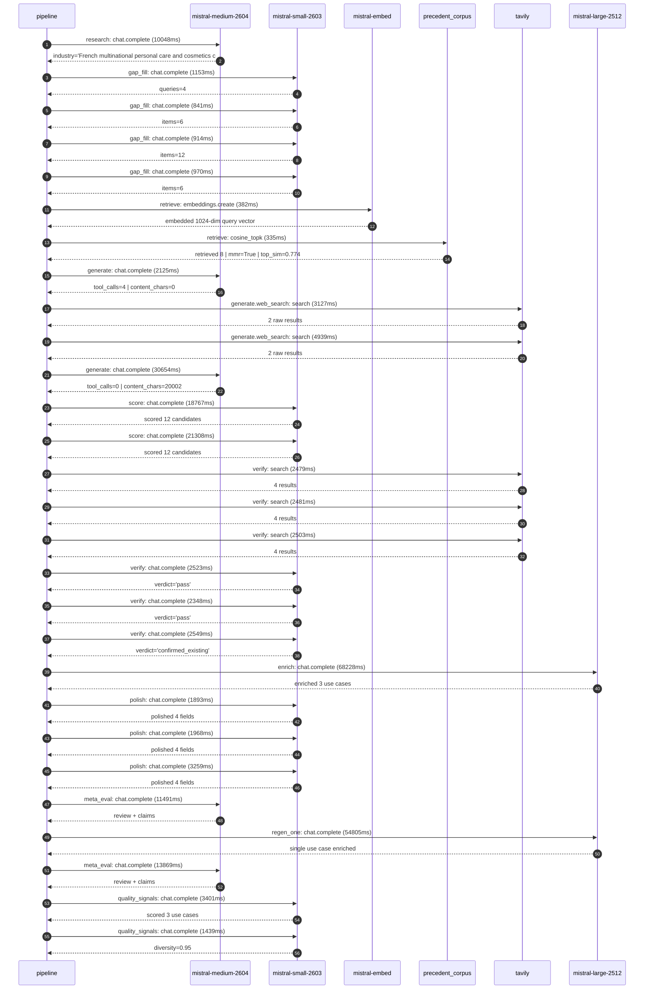

# Pipeline blueprint (architecture)

Static view of the pipeline regardless of run timing — shows agents,
models, and gates. The chronological execution log follows below.

```mermaid
flowchart TD
    Start([User: company name]) --> R
    R["<b>1. Research</b><br/>parallel: Wikipedia · Tavily news ·<br/>existing initiatives · live verification<br/><i>mistral-medium</i> synthesis"]
    R --> G["<b>1b. Gap-fill</b><br/>identify missing fields →<br/><i>mistral-small</i> generates queries →<br/>Tavily search per field →<br/><i>mistral-small</i> per-field extraction"]
    G --> Conf{Confidence ≥ 0.5<br/>OR verified<br/>OR ≥ 1 existing initiative?}
    Conf -->|no| Refuse([Refusal])
    Conf -->|yes| Ret
    Ret["<b>2. Retrieve</b><br/><i>mistral-embed</i> on company query →<br/>cosine top-K + industry/depth filter +<br/>MMR diversification"]
    Ret --> Gen["<b>3. Generate 12 candidates</b><br/><i>mistral-medium</i> with web_search tool<br/>(Tavily + deep-read) — fact citations<br/>flow into the EvidenceLedger"]
    Gen --> Score["<b>4. Score</b><br/>self-consistency: 2 parallel passes<br/><i>mistral-small</i> @ T=0.2 and T=0.4 →<br/>aggregate weighted scores"]
    Score --> Verify["<b>5. Per-candidate verify</b><br/>top-3: Tavily search + deep-read +<br/><i>mistral-small</i> verdict (pass /<br/>partial / confirmed_existing)"]
    Verify --> Enrich["<b>6. Enrich</b><br/><i>mistral-large</i> drafts customer-facing<br/>prose for 3 use cases (or<br/><i>mistral-medium</i> on fast tier)"]
    Enrich --> NumScrub["<b>6a. Numeric scrub</b><br/>flag any number not in cited content"]
    NumScrub --> Polish["<b>6b. Polish</b><br/><i>mistral-small</i> per use case (parallel):<br/>convert markers→qualitative,<br/>(ev-XXX)→[title](url)"]
    Polish --> Attr["<b>6c. Attribution check</b><br/><i>mistral-small</i> per use case (parallel):<br/>fix corpus-ID ↔ company mismatches"]
    Attr --> Meta["<b>7. Meta-evaluation</b><br/><i>mistral-medium</i> reviews report against<br/>cited precedents + ledger entries:<br/>strict claim verification"]
    Meta --> RegenQ{confidence < 0.6<br/>AND not fast tier?}
    RegenQ -->|yes| Regen["<b>7b. Targeted regen</b><br/><i>mistral-large</i> re-enriches just the<br/>weakest use case with the next-best<br/>near-miss; re-runs meta-eval"]
    RegenQ -->|no| QS
    Regen --> QS
    QS["<b>Quality signals</b><br/>LLM-graded diversity + specificity,<br/>fact-check pass rate, TTV/cost spread"]
    QS --> Render([Markdown report + trace])

    classDef agent fill:#fef3c7,stroke:#f59e0b
    classDef gate fill:#dbeafe,stroke:#3b82f6
    classDef io fill:#dcfce7,stroke:#16a34a
    class R,G,Ret,Gen,Score,Verify,Enrich,NumScrub,Polish,Attr,Meta,Regen,QS agent
    class Conf,RegenQ gate
    class Start,Refuse,Render io
```

## Execution trace — L'Oreal

Started: `2026-05-09T00:05:09.258293+00:00`. Total wall time: `266.2s` across `28` recorded actions.

### Per-step time totals

| Step | Calls | Total time | Avg time |
|---|---:|---:|---:|
| `research` | 1 | 10.05s | 10048ms |
| `gap_fill` | 4 | 3.88s | 970ms |
| `retrieve` | 2 | 0.72s | 359ms |
| `generate` | 2 | 32.78s | 16389ms |
| `generate.web_search` | 2 | 8.07s | 4033ms |
| `score` | 2 | 40.08s | 20038ms |
| `verify` | 6 | 14.88s | 2480ms |
| `enrich` | 1 | 68.23s | 68228ms |
| `polish` | 3 | 7.12s | 2373ms |
| `meta_eval` | 2 | 25.36s | 12680ms |
| `regen_one` | 1 | 54.80s | 54805ms |
| `quality_signals` | 2 | 4.84s | 2420ms |

### Chronological event log

- `00:05:13.658` **[research]** `mistral-medium-2604.chat.complete` — 10048ms
   - inputs: synthesize CompanyContext for L'Oreal | depth=medium
   - outputs: industry='French multinational personal care and cosmetics company' verified=True conf=0.75
- `00:05:25.270` **[gap_fill]** `mistral-small-2603.chat.complete` — 1153ms
   - inputs: generate gap queries | fields=['business_model', 'products', 'data_assets', 'priorities']
   - outputs: queries=4
- `00:05:38.983` **[gap_fill]** `mistral-small-2603.chat.complete` — 841ms
   - inputs: layer-2 extract field=data_assets
   - outputs: items=6
- `00:05:39.005` **[gap_fill]** `mistral-small-2603.chat.complete` — 914ms
   - inputs: layer-2 extract field=products
   - outputs: items=12
- `00:05:38.956` **[gap_fill]** `mistral-small-2603.chat.complete` — 970ms
   - inputs: layer-2 extract field=priorities
   - outputs: items=6
- `00:05:39.961` **[retrieve]** `mistral-embed.embeddings.create` — 382ms
   - inputs: company_query | industries='French multinational personal care and cosmetics company'
   - outputs: embedded 1024-dim query vector
- `00:05:40.344` **[retrieve]** `precedent_corpus.cosine_topk` — 335ms
   - inputs: k=8 min_depth=0.4 target="L'Oreal"
   - outputs: retrieved 8 | mmr=True | top_sim=0.774
- `00:05:41.997` **[generate]** `mistral-medium-2604.chat.complete` — 2125ms
   - inputs: iteration=0 tool_calls_used=0/2 tools=on
   - outputs: tool_calls=4 | content_chars=0
- `00:05:44.131` **[generate.web_search]** `tavily.search` — 3127ms
   - inputs: query="L'Oréal sustainability commitments 2025 2030 L'Oréal for the Future"
   - outputs: 2 raw results
- `00:05:51.050` **[generate.web_search]** `tavily.search` — 4939ms
   - inputs: query="L'Oréal proprietary datasets skin tone product formulas patents"
   - outputs: 2 raw results
- `00:05:58.140` **[generate]** `mistral-medium-2604.chat.complete` — 30654ms
   - inputs: iteration=1 tool_calls_used=2/2 tools=off
   - outputs: tool_calls=0 | content_chars=20002
- `00:06:29.241` **[score]** `mistral-small-2603.chat.complete` — 18767ms
   - inputs: self-consistency pass T=0.2
   - outputs: scored 12 candidates
- `00:06:29.244` **[score]** `mistral-small-2603.chat.complete` — 21308ms
   - inputs: self-consistency pass T=0.4
   - outputs: scored 12 candidates
- `00:06:50.612` **[verify]** `tavily.search` — 2479ms
   - inputs: candidate=loreal-sustainability-reporting-ai | query="L'Oreal AI for automated sustainability reporting and ESG co"
   - outputs: 4 results
- `00:06:50.612` **[verify]** `tavily.search` — 2481ms
   - inputs: candidate=loreal-sustainable-formula-accelerator | query="L'Oreal AI-powered sustainable formula discovery and reformu"
   - outputs: 4 results
- `00:06:50.611` **[verify]** `tavily.search` — 2503ms
   - inputs: candidate=loreal-regulatory-compliance-ai | query="L'Oreal AI for EU cosmetics regulatory compliance and ingred"
   - outputs: 4 results
- `00:06:54.293` **[verify]** `mistral-small-2603.chat.complete` — 2523ms
   - inputs: verdict for loreal-regulatory-compliance-ai
   - outputs: verdict='pass'
- `00:06:54.469` **[verify]** `mistral-small-2603.chat.complete` — 2348ms
   - inputs: verdict for loreal-sustainability-reporting-ai
   - outputs: verdict='pass'
- `00:06:54.570` **[verify]** `mistral-small-2603.chat.complete` — 2549ms
   - inputs: verdict for loreal-sustainable-formula-accelerator
   - outputs: verdict='confirmed_existing'
- `00:06:57.156` **[enrich]** `mistral-large-2512.chat.complete` — 68228ms
   - inputs: tier=standard top_3=['loreal-regulatory-compliance-ai', 'loreal-sustainability-reporting-ai', 'loreal-multilingual-pos-insights']
   - outputs: enriched 3 use cases
- `00:08:05.391` **[polish]** `mistral-small-2603.chat.complete` — 1893ms
   - inputs: use_case=loreal-sustainability-reporting-ai unanchored=True opaque_ev=False
   - outputs: polished 4 fields
- `00:08:05.386` **[polish]** `mistral-small-2603.chat.complete` — 1968ms
   - inputs: use_case=loreal-regulatory-compliance-ai unanchored=True opaque_ev=False
   - outputs: polished 4 fields
- `00:08:05.394` **[polish]** `mistral-small-2603.chat.complete` — 3259ms
   - inputs: use_case=loreal-multilingual-pos-insights unanchored=True opaque_ev=False
   - outputs: polished 4 fields
- `00:08:08.683` **[meta_eval]** `mistral-medium-2604.chat.complete` — 11491ms
   - inputs: reviewing 3 use cases
   - outputs: review + claims
- `00:08:20.214` **[regen_one]** `mistral-large-2512.chat.complete` — 54805ms
   - inputs: replace weakest=loreal-sustainability-reporting-ai with loreal-sustainable-formula-accelerator
   - outputs: single use case enriched
- `00:09:15.051` **[meta_eval]** `mistral-medium-2604.chat.complete` — 13869ms
   - inputs: reviewing 3 use cases
   - outputs: review + claims
- `00:09:30.571` **[quality_signals]** `mistral-small-2603.chat.complete` — 3401ms
   - inputs: specificity grade (3 use cases)
   - outputs: scored 3 use cases
- `00:09:33.972` **[quality_signals]** `mistral-small-2603.chat.complete` — 1439ms
   - inputs: diversity grade
   - outputs: diversity=0.95

## Mermaid sequence diagram (execution)

