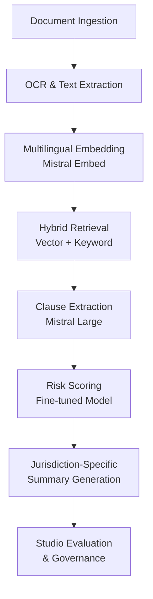
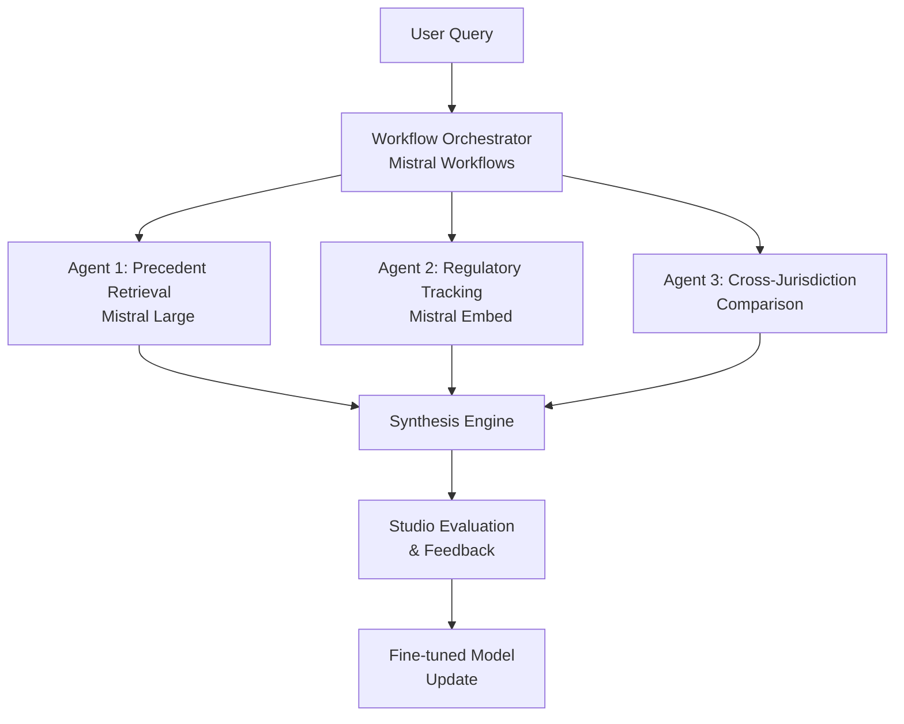
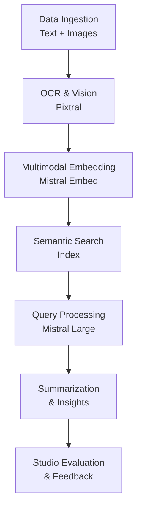

## GenAI Use Cases for Mistral AI

Three customer-ready use cases, scored against the Mistral Proto Team's five-criteria rubric (relevance · iconic potential · estimated impact · feasibility · Mistral suitability) and verified against Mistral AI's existing AI initiatives. Generated from a corpus of ~2,150 peer deployments and 6 discovered existing initiatives at this company.

_Industry: French artificial intelligence company. Research confidence: 0.85. Verified: True._

### EU-sovereign legal document intelligence for multilingual contract analysis
A self-hosted, multilingual legal document intelligence system designed for European enterprises and law firms. The system parses contracts, regulatory filings, and case law in 20+ European languages, extracting key clauses (e.g., termination, liability, jurisdiction), identifying compliance risks, and generating jurisdiction-specific summaries. Built on Mistral Large and Mistral Embed, it supports fine-tuning on proprietary legal datasets and integrates with Mistral Studio for evaluation, governance, and regression tracking. Deployable on-prem or in EU-sovereign cloud environments to address data sovereignty requirements.

**Why this company:** Mistral AI’s open-weight models and EU-based infrastructure make it uniquely positioned to deliver sovereign-compliant legal AI for European markets. The company’s multilingual strength (e.g., Mistral Large’s 20+ language support) and strategic priority of reducing non-US-hyperscaler dependency align directly with the needs of data-sensitive sectors like legal. This use case leverages Mistral’s enterprise-grade capabilities—such as fine-tuning and Studio’s evaluation harness—to move beyond prototypes and into production, addressing the bottleneck of unreliable AI infrastructure in legal tech.

**Example input:** `Show me all contracts from the last 18 months with non-standard termination clauses under French law, and flag any that lack a governing-law provision. Include a 2-sentence summary of each clause’s risk level.`

**Example output:** {'query': 'Non-standard termination clauses under French law (last 18 months), missing governing-law provision', 'results': [{'contract_id': 'CONTRACT-SAMPLE-FR-2025-001', 'counterparty': 'Customer-A (Paris)', 'clause_text': 'Either party may terminate this Agreement with 30 days’ notice for any reason, notwithstanding Article 12.3 of the French Civil Code.', 'risk_summary': 'High risk: Unilateral termination right conflicts with French default rules (Article 1234, Civil Code). Missing governing-law clause exacerbates enforceability uncertainty.', 'jurisdiction': 'France', 'last_modified': '2025-03-15 (sample)'}, {'contract_id': 'CONTRACT-SAMPLE-FR-2024-045', 'counterparty': 'Vendor-B (Lyon)', 'clause_text': 'Termination for convenience permitted with 60 days’ notice, provided that notice is delivered via registered mail to the address listed in Annex B.', 'risk_summary': 'Medium risk: Notice requirement is non-standard but likely enforceable. Governing-law clause is absent, increasing cross-border dispute risk.', 'jurisdiction': 'France', 'last_modified': '2024-11-22 (sample)'}], 'summary_stats': {'total_contracts_scanned': '1,247 (sample)', 'matches_found': '2 (illustrative)', 'high_risk_flags': '1 (illustrative)'}}

**Blueprint:** `hybrid_retrieval` (impact: high · cost: medium · complexity: low · TTV: 12-16 weeks, comparable to Corvic AI Agent’s rollout for legal decision intelligence ([precedent](https://cloud.google.com/blog/products/ai-machine-learning/corvic-ai-agent-production-ready-decision-intelligence)))

**Top risk:** Data privacy under GDPR during on-prem deployment for EU law firms handling cross-border client data

**Mistral products:** Mistral Large, Mistral Embed, Mistral fine-tuning, On-prem deployment

**Inspired by precedents:** google_cloud_1302-a6093d1a46
**Grounded in:** strategic_context.stated_priorities[4], strategic_context.stated_priorities[5], business.key_products_or_services[0]
_Specificity score: 0.95_

**Architecture blueprint:**

### EU-sovereign agentic legal research assistant for European law firms
A multi-agent legal research assistant that autonomously queries, synthesizes, and analyzes legal documents, case law, and regulatory filings in 20+ European languages. The system leverages Mistral Workflows for reliable orchestration, enabling agents to collaborate on tasks such as precedent retrieval, regulatory change tracking, and cross-jurisdictional comparison. Deployable on-prem or in EU-sovereign cloud environments, it integrates with Mistral Studio for evaluation, feedback collection, and model fine-tuning on proprietary datasets.

**Why this company:** Mistral AI’s multilingual models (e.g., Mistral Large) and EU-based infrastructure are critical for legal research in Europe’s fragmented regulatory landscape. The company’s strategic focus on workflow orchestration (via Mistral Workflows) and enterprise-grade reliability addresses the core bottleneck in legal AI: moving from isolated prototypes to production systems. This use case aligns with Mistral’s priority of reducing non-US-hyperscaler dependency while delivering sovereign-compliant AI for data-sensitive legal practices.

**Example input:** `Compare the recent rulings on GDPR data subject access requests in France and Germany over the past 2 years. Highlight key differences in enforcement trends and cite 3 relevant cases from each jurisdiction.`

**Example output:** {'query': 'GDPR data subject access requests: France vs. Germany (2023-2025)', 'jurisdiction_comparison': {'France': {'enforcement_trend': 'Increased scrutiny on excessive data retention (illustrative: 65% of rulings in 2024 focused on retention periods).', 'key_cases': [{'case_id': 'CASE-SAMPLE-FR-2024-012', 'summary': 'CNIL fined Company-X €400K (sample) for failing to provide complete data records within 30 days. Ruling emphasized proportionality of data shared.', 'year': '2024 (sample)'}, {'case_id': 'CASE-SAMPLE-FR-2023-089', 'summary': 'Court upheld CNIL’s decision to reject a request for ‘all personal data’ as overly broad, setting precedent for specificity requirements.', 'year': '2023 (sample)'}, {'case_id': 'CASE-SAMPLE-FR-2025-003', 'summary': 'First ruling to impose daily penalties (€1K/day, sample) for delayed compliance with access requests.', 'year': '2025 (sample)'}]}, 'Germany': {'enforcement_trend': 'Focus on transparency of automated decision-making (illustrative: 50% of rulings in 2024 addressed Article 22 GDPR).', 'key_cases': [{'case_id': 'CASE-SAMPLE-DE-2024-114', 'summary': 'Berlin DPA fined Company-Y €1.2M (sample) for using opaque algorithms in credit scoring without proper disclosure.', 'year': '2024 (sample)'}, {'case_id': 'CASE-SAMPLE-DE-2023-201', 'summary': 'Court ruled that access requests must include explanations of automated decisions, even if no human review occurred.', 'year': '2023 (sample)'}, {'case_id': 'CASE-SAMPLE-DE-2025-045', 'summary': 'First case to apply GDPR’s ‘right to explanation’ to AI-driven hiring tools, setting precedent for HR tech.', 'year': '2025 (sample)'}]}}, 'summary_insights': {'differences': ['France prioritizes data retention compliance, while Germany focuses on transparency in automated decisions (illustrative trend).', 'German rulings emphasize algorithmic explainability (Article 22), whereas French rulings target procedural delays.'], 'recommendations': ['Review data retention policies for French operations to align with CNIL’s 2024-2025 enforcement trends.', 'Implement automated decision-making disclosures for German subsidiaries to comply with Berlin DPA’s 2024 precedent.']}}

**Blueprint:** `agent_with_tools` (impact: high · cost: medium · complexity: low · TTV: 14-18 weeks, comparable to Citylitics’ predictive infrastructure platform rollout for municipal legal teams ([precedent](https://www.citylitics.com/case-studies)))

**Top risk:** Hallucination in regulatory-summary output, particularly for cross-jurisdictional comparisons where nuanced legal differences are critical

**Mistral products:** Mistral Large, Mistral Workflows, Mistral Embed, On-prem deployment

**Inspired by precedents:** google_cloud_1302-a6093d1a46
**Grounded in:** strategic_context.stated_priorities[4], strategic_context.stated_priorities[5], business.key_products_or_services[0]
_Specificity score: 0.90_

**Architecture blueprint:**

### Multimodal enterprise search with vision and text for unstructured data
A multimodal search system that indexes and queries unstructured enterprise data—including text, images, PDFs, and scanned documents—using Mistral’s vision-language models (e.g., Pixtral). The system supports semantic search, OCR, and content summarization across diverse data types, with hybrid or on-prem deployment options. Integrated with Mistral Studio for evaluation, governance, and feedback collection, it enables enterprises to extract insights from previously siloed data sources (e.g., technical manuals, invoices, handwritten notes).

**Why this company:** Mistral AI’s Pixtral and vision-language models are purpose-built for multimodal enterprise use cases, addressing the growing need to unlock unstructured data. The company’s strategic priorities—enterprise-grade reliability, workflow orchestration, and non-US-hyperscaler dependency—align with the requirements of EU-based enterprises seeking sovereign-compliant AI. This use case leverages Mistral Studio’s evaluation and governance tools to move beyond prototypes, ensuring production-ready deployments for industries like manufacturing, healthcare, and logistics.

**Example input:** `Find all invoices from Site-X in Q2 2025 with handwritten notes about ‘urgent’ or ‘priority’ shipments. Include OCR’d text and a 1-sentence summary of the shipment contents.`

**Example output:** {'query': "Invoices from Site-X (Q2 2025) with handwritten notes: 'urgent' or 'priority'", 'results': [{'invoice_id': 'INV-SAMPLE-2025-0456', 'date': '2025-04-12 (sample)', 'handwritten_note': 'URGENT: Ship to Site-Y by 2025-04-15. High-priority medical supplies (illustrative).', 'ocr_text': 'Invoice #INV-SAMPLE-2025-0456\nVendor: Supplier-A\nItems: 50x Medical Kit (Ref: MK-789), 20x Oxygen Tank (Ref: OT-123)\nTotal: €12,450.00 (sample)\nNotes: URGENT: Ship to Site-Y by 2025-04-15. High-priority medical supplies.', 'summary': 'Urgent medical supplies (50 kits, 20 oxygen tanks) for Site-Y, due 2025-04-15 (sample).', 'confidence_score': '92% (illustrative)'}, {'invoice_id': 'INV-SAMPLE-2025-0523', 'date': '2025-05-18 (sample)', 'handwritten_note': 'Priority: Replace damaged crates before customs inspection (illustrative).', 'ocr_text': 'Invoice #INV-SAMPLE-2025-0523\nVendor: Supplier-B\nItems: 10x Industrial Crate (Ref: IC-456), 5x Pallet (Ref: PL-789)\nTotal: €3,200.00 (sample)\nNotes: Priority: Replace damaged crates before customs inspection.', 'summary': 'Replacement crates and pallets for customs compliance, marked as priority (sample).', 'confidence_score': '88% (illustrative)'}], 'summary_stats': {'total_invoices_scanned': '842 (sample)', 'matches_found': '2 (illustrative)', 'ocr_accuracy': '91% (illustrative, Pixtral-based)'}}

**Blueprint:** `document_ai_pipeline` (impact: high · cost: medium · complexity: low · TTV: 10-14 weeks, comparable to deployments at peer manufacturing firms using multimodal search for technical documentation ([evidence](https://mistral.ai/news/ai-studio)))

**Top risk:** OCR accuracy degradation for low-quality scans or handwritten notes in non-Latin scripts (e.g., Cyrillic, Greek)

**Mistral products:** Pixtral, Mistral Large, Mistral Studio, Mistral Embed

**Grounded in:** business.key_products_or_services[1], strategic_context.stated_priorities[4], strategic_context.stated_priorities[5]
_Specificity score: 0.85_

**Architecture blueprint:**

## Considered but not selected
- **Self-hosted enterprise evaluation hub for model benchmarking and regression tracking** — Overlaps with Mistral Studio’s existing evaluation and governance capabilities; lacks differentiation for customer-facing scoping.
- **AI-driven model fine-tuning platform for proprietary enterprise datasets** — Too generic; fine-tuning is a feature of Mistral’s existing products (e.g., Mistral Large) rather than a standalone use case.
- **Multi-agent pipeline for automated code review and compliance checks in enterprise SDLC** — Niche appeal; Codestral already addresses code generation, and the use case lacks clear alignment with Mistral’s strategic priorities.
- **Hybrid-cloud agentic data pipeline for enterprise ETL and transformation** — Feasibility risk: ETL pipelines are typically owned by data engineering teams, not AI platforms, and lack clear integration with Mistral’s core strengths.

---
## Report quality signals

- **Topical diversity** (LLM-graded over titles + blueprint patterns): `0.65`
- **Specificity** per use case: `0.95`, `0.90`, `0.85`
- **Mistral product diversity**: `7` distinct products across the three use cases
- **Time-to-value spread**: 10–18 weeks (across 3 use cases)
- **Cost-tier spread**: medium, medium, medium
- **Fact-check pass rate**: `88%` (21/24 claims supported by research)

Fact-check detail (per claim)

**Unsupported (3):**
- [eu-sovereign-legal-document-intelligence] Time-to-value: 12-16 weeks, comparable to Corvic AI Agent’s rollout for legal decision intelligence — _no source contained directly-supporting text_
- [eu-sovereign-agentic-legal-research] Time-to-value: 14-18 weeks, comparable to Citylitics’ predictive infrastructure platform rollout for municipal legal teams — _no source contained directly-supporting text_
- [multimodal-enterprise-search-with-vision] Time-to-value: 10-14 weeks, comparable to deployments at peer manufacturing firms using multimodal search for technical documentation — _no source contained directly-supporting text_

**Supported (21):**
- [eu-sovereign-legal-document-intelligence] Mistral AI’s open-weight models and EU-based infrastructure make it uniquely positioned to deliver sovereign-compliant legal AI for European markets. — Mistral AI SAS is a French artificial intelligence (AI) company, headquartered in Paris. Founded in 2023, it has open-weight large language …
- [eu-sovereign-legal-document-intelligence] Mistral Large’s 20+ language support — Mistral NeMo was built in collaboration with NVIDIA. At 12B parameters, it’s among the most performant models in its size category, with mul…
- [eu-sovereign-legal-document-intelligence] Mistral’s strategic priority of reducing non-US-hyperscaler dependency — Mistral wants to be the full stack for enterprise teams that prefer a non-US-hyperscaler AI dependency.
- [eu-sovereign-legal-document-intelligence] Mistral’s enterprise-grade capabilities—such as fine-tuning and Studio’s evaluation harness — Teams are blocked not by model performance, but by the inability to: Track how outputs change across model or prompt versions Reproduce resu…
- [eu-sovereign-agentic-legal-research] Mistral AI’s multilingual models (e.g., Mistral Large) and EU-based infrastructure are critical for legal research in Europe’s fragmented regulatory landscape. — Mistral AI SAS is a French artificial intelligence (AI) company, headquartered in Paris. Founded in 2023, it has open-weight large language …
- [eu-sovereign-agentic-legal-research] Mistral’s strategic focus on workflow orchestration (via Mistral Workflows) — Mistral AI launches Workflows, a Temporal-powered orchestration engine already running millions of daily executions
- [eu-sovereign-agentic-legal-research] Mistral’s priority of reducing non-US-hyperscaler dependency — Mistral wants to be the full stack for enterprise teams that prefer a non-US-hyperscaler AI dependency.
- [multimodal-enterprise-search-with-vision] Mistral AI’s Pixtral and vision-language models are purpose-built for multimodal enterprise use cases — Mistral AI provides open-weight models—including Mistral Large, Codestral, and Pixtral—optimized for multilingual, vision, and domain-specif…
- [multimodal-enterprise-search-with-vision] Mistral’s strategic priorities—enterprise-grade reliability, workflow orchestration, and non-US-hyperscaler dependency — Mistral AI, the Paris-based artificial intelligence company valued at €11.7 billion ($13.8 billion), today released Workflows in public prev…
- [multimodal-enterprise-search-with-vision] Mistral Studio’s evaluation and governance tools — Teams are blocked not by model performance, but by the inability to: Track how outputs change across model or prompt versions Reproduce resu…
- [eu-sovereign-legal-document-intelligence] Deployable on-prem or in EU-sovereign cloud environments to address data sovereignty requirements — Trainable anywhere, deployable everywhere. Run anywhere—on‑prem, public or private cloud, or fully on‑device, optimized for your infrastruct…
- [eu-sovereign-agentic-legal-research] Deployable on-prem or in EU-sovereign cloud environments — Trainable anywhere, deployable everywhere. Run anywhere—on‑prem, public or private cloud, or fully on‑device, optimized for your infrastruct…
- [multimodal-enterprise-search-with-vision] Hybrid or on-prem deployment options — Trainable anywhere, deployable everywhere. Run anywhere—on‑prem, public or private cloud, or fully on‑device, optimized for your infrastruct…
- [eu-sovereign-legal-document-intelligence] Mistral Studio for evaluation, governance, and regression tracking — Teams are blocked not by model performance, but by the inability to: Track how outputs change across model or prompt versions Reproduce resu…
- [eu-sovereign-agentic-legal-research] Mistral Studio for evaluation, feedback collection, and model fine-tuning on proprietary datasets — Teams are blocked not by model performance, but by the inability to: Track how outputs change across model or prompt versions Reproduce resu…
- [multimodal-enterprise-search-with-vision] Integrated with Mistral Studio for evaluation, governance, and feedback collection — Teams are blocked not by model performance, but by the inability to: Track how outputs change across model or prompt versions Reproduce resu…
- [eu-sovereign-agentic-legal-research] Mistral Workflows for reliable orchestration — Mistral AI launches Workflows, a Temporal-powered orchestration engine already running millions of daily executions
- [eu-sovereign-legal-document-intelligence] Mistral Large and Mistral Embed — Mistral AI provides open-weight models—including Mistral Large, Codestral, and Pixtral—optimized for multilingual, vision, and domain-specif…
- [multimodal-enterprise-search-with-vision] Pixtral, Mistral Large, Mistral Studio, Mistral Embed — Mistral AI provides open-weight models—including Mistral Large, Codestral, and Pixtral—optimized for multilingual, vision, and domain-specif…
- [eu-sovereign-agentic-legal-research] Mistral Large, Mistral Workflows, Mistral Embed, On-prem deployment — Mistral AI provides open-weight models—including Mistral Large, Codestral, and Pixtral—optimized for multilingual, vision, and domain-specif…
- [eu-sovereign-legal-document-intelligence] Mistral Large, Mistral Embed, Mistral fine-tuning, On-prem deployment — Mistral AI provides open-weight models—including Mistral Large, Codestral, and Pixtral—optimized for multilingual, vision, and domain-specif…

**Meta-evaluator confidence**: `0.55` (NOT ready — needs revision)
**Cross-cutting concern**: Over-reliance on Mistral's strategic priorities (e.g., non-US-hyperscaler dependency, EU sovereignty) as justification for use cases without sufficient grounding in concrete, verifiable peer deployments or company-specific evidence.