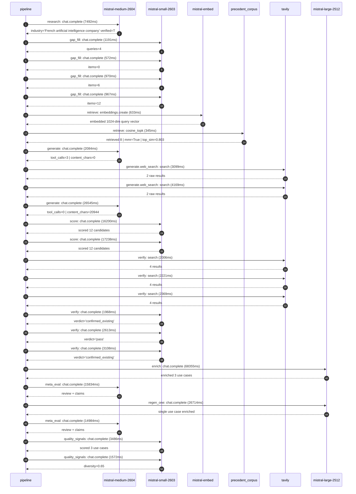

# Pipeline blueprint (architecture)

Static view of the pipeline regardless of run timing — shows agents,
models, and gates. The chronological execution log follows below.

```mermaid
flowchart TD
    Start([User: company name]) --> R
    R["<b>1. Research</b><br/>parallel: Wikipedia · Tavily news ·<br/>existing initiatives · live verification<br/><i>mistral-medium</i> synthesis"]
    R --> G["<b>1b. Gap-fill</b><br/>identify missing fields →<br/><i>mistral-small</i> generates queries →<br/>Tavily search per field →<br/><i>mistral-small</i> per-field extraction"]
    G --> Conf{Confidence ≥ 0.5<br/>OR verified<br/>OR ≥ 1 existing initiative?}
    Conf -->|no| Refuse([Refusal])
    Conf -->|yes| Ret
    Ret["<b>2. Retrieve</b><br/><i>mistral-embed</i> on company query →<br/>cosine top-K + industry/depth filter +<br/>MMR diversification"]
    Ret --> Gen["<b>3. Generate 12 candidates</b><br/><i>mistral-medium</i> with web_search tool<br/>(Tavily + deep-read) — fact citations<br/>flow into the EvidenceLedger"]
    Gen --> Score["<b>4. Score</b><br/>self-consistency: 2 parallel passes<br/><i>mistral-small</i> @ T=0.2 and T=0.4 →<br/>aggregate weighted scores"]
    Score --> Verify["<b>5. Per-candidate verify</b><br/>top-3: Tavily search + deep-read +<br/><i>mistral-small</i> verdict (pass /<br/>partial / confirmed_existing)"]
    Verify --> Enrich["<b>6. Enrich</b><br/><i>mistral-large</i> drafts customer-facing<br/>prose for 3 use cases (or<br/><i>mistral-medium</i> on fast tier)"]
    Enrich --> NumScrub["<b>6a. Numeric scrub</b><br/>flag any number not in cited content"]
    NumScrub --> Polish["<b>6b. Polish</b><br/><i>mistral-small</i> per use case (parallel):<br/>convert markers→qualitative,<br/>(ev-XXX)→[title](url)"]
    Polish --> Attr["<b>6c. Attribution check</b><br/><i>mistral-small</i> per use case (parallel):<br/>fix corpus-ID ↔ company mismatches"]
    Attr --> Meta["<b>7. Meta-evaluation</b><br/><i>mistral-medium</i> reviews report against<br/>cited precedents + ledger entries:<br/>strict claim verification"]
    Meta --> RegenQ{confidence < 0.6<br/>AND not fast tier?}
    RegenQ -->|yes| Regen["<b>7b. Targeted regen</b><br/><i>mistral-large</i> re-enriches just the<br/>weakest use case with the next-best<br/>near-miss; re-runs meta-eval"]
    RegenQ -->|no| QS
    Regen --> QS
    QS["<b>Quality signals</b><br/>LLM-graded diversity + specificity,<br/>fact-check pass rate, TTV/cost spread"]
    QS --> Render([Markdown report + trace])

    classDef agent fill:#fef3c7,stroke:#f59e0b
    classDef gate fill:#dbeafe,stroke:#3b82f6
    classDef io fill:#dcfce7,stroke:#16a34a
    class R,G,Ret,Gen,Score,Verify,Enrich,NumScrub,Polish,Attr,Meta,Regen,QS agent
    class Conf,RegenQ gate
    class Start,Refuse,Render io
```

## Execution trace — Mistral AI

Started: `2026-05-09T00:09:36.491584+00:00`. Total wall time: `219.9s` across `25` recorded actions.

### Per-step time totals

| Step | Calls | Total time | Avg time |
|---|---:|---:|---:|
| `research` | 1 | 7.49s | 7492ms |
| `gap_fill` | 4 | 3.70s | 925ms |
| `retrieve` | 2 | 0.98s | 489ms |
| `generate` | 2 | 28.63s | 14314ms |
| `generate.web_search` | 2 | 7.27s | 3634ms |
| `score` | 2 | 33.44s | 16719ms |
| `verify` | 6 | 14.28s | 2381ms |
| `enrich` | 1 | 68.36s | 68355ms |
| `meta_eval` | 2 | 30.82s | 15409ms |
| `regen_one` | 1 | 26.71s | 26714ms |
| `quality_signals` | 2 | 5.06s | 2529ms |

### Chronological event log

- `00:09:39.548` **[research]** `mistral-medium-2604.chat.complete` — 7492ms
   - inputs: synthesize CompanyContext for Mistral AI | depth=medium
   - outputs: industry='French artificial intelligence company' verified=True conf=0.75
- `00:09:49.396` **[gap_fill]** `mistral-small-2603.chat.complete` — 1191ms
   - inputs: generate gap queries | fields=['business_model', 'products', 'data_assets', 'priorities']
   - outputs: queries=4
- `00:09:57.613` **[gap_fill]** `mistral-small-2603.chat.complete` — 572ms
   - inputs: layer-2 extract field=data_assets
   - outputs: items=0
- `00:09:57.588` **[gap_fill]** `mistral-small-2603.chat.complete` — 970ms
   - inputs: layer-2 extract field=priorities
   - outputs: items=6
- `00:09:57.636` **[gap_fill]** `mistral-small-2603.chat.complete` — 967ms
   - inputs: layer-2 extract field=products
   - outputs: items=12
- `00:09:58.639` **[retrieve]** `mistral-embed.embeddings.create` — 633ms
   - inputs: company_query | industries='French artificial intelligence company'
   - outputs: embedded 1024-dim query vector
- `00:09:59.272` **[retrieve]** `precedent_corpus.cosine_topk` — 345ms
   - inputs: k=8 min_depth=0.4 target='Mistral AI'
   - outputs: retrieved 8 | mmr=True | top_sim=0.803
- `00:10:01.579` **[generate]** `mistral-medium-2604.chat.complete` — 2084ms
   - inputs: iteration=0 tool_calls_used=0/2 tools=on
   - outputs: tool_calls=3 | content_chars=0
- `00:10:03.684` **[generate.web_search]** `tavily.search` — 3099ms
   - inputs: query='Mistral AI Studio features and capabilities 2025'
   - outputs: 2 raw results
- `00:10:08.024` **[generate.web_search]** `tavily.search` — 4169ms
   - inputs: query='Mistral AI Workflows orchestration engine use cases 2025'
   - outputs: 2 raw results
- `00:10:13.215` **[generate]** `mistral-medium-2604.chat.complete` — 26545ms
   - inputs: iteration=1 tool_calls_used=2/2 tools=off
   - outputs: tool_calls=0 | content_chars=20944
- `00:10:40.725` **[score]** `mistral-small-2603.chat.complete` — 16200ms
   - inputs: self-consistency pass T=0.2
   - outputs: scored 12 candidates
- `00:10:40.729` **[score]** `mistral-small-2603.chat.complete` — 17238ms
   - inputs: self-consistency pass T=0.4
   - outputs: scored 12 candidates
- `00:10:58.027` **[verify]** `tavily.search` — 2006ms
   - inputs: candidate=self-hosted-enterprise-evaluation-hub | query='Mistral AI Self-hosted enterprise evaluation hub for model b'
   - outputs: 4 results
- `00:10:58.028` **[verify]** `tavily.search` — 2221ms
   - inputs: candidate=eu-sovereign-legal-document-intelligence | query='Mistral AI EU-sovereign legal document intelligence for mult'
   - outputs: 4 results
- `00:10:58.028` **[verify]** `tavily.search` — 2369ms
   - inputs: candidate=ai-driven-model-fine-tuning-platform | query='Mistral AI AI-driven model fine-tuning platform for propriet'
   - outputs: 4 results
- `00:11:01.261` **[verify]** `mistral-small-2603.chat.complete` — 1968ms
   - inputs: verdict for self-hosted-enterprise-evaluation-hub
   - outputs: verdict='confirmed_existing'
- `00:11:01.666` **[verify]** `mistral-small-2603.chat.complete` — 2613ms
   - inputs: verdict for eu-sovereign-legal-document-intelligence
   - outputs: verdict='pass'
- `00:11:01.495` **[verify]** `mistral-small-2603.chat.complete` — 3108ms
   - inputs: verdict for ai-driven-model-fine-tuning-platform
   - outputs: verdict='confirmed_existing'
- `00:11:04.635` **[enrich]** `mistral-large-2512.chat.complete` — 68355ms
   - inputs: tier=standard top_3=['eu-sovereign-legal-document-intelligence', 'eu-sovereign-agentic-legal-research', 'multimodal-enterprise-search-with-vision']
   - outputs: enriched 3 use cases
- `00:12:13.031` **[meta_eval]** `mistral-medium-2604.chat.complete` — 15834ms
   - inputs: reviewing 3 use cases
   - outputs: review + claims
- `00:12:28.899` **[regen_one]** `mistral-large-2512.chat.complete` — 26714ms
   - inputs: replace weakest=eu-sovereign-agentic-legal-research with self-hosted-enterprise-evaluation-hub
   - outputs: single use case enriched
- `00:12:55.648` **[meta_eval]** `mistral-medium-2604.chat.complete` — 14984ms
   - inputs: reviewing 3 use cases
   - outputs: review + claims
- `00:13:11.338` **[quality_signals]** `mistral-small-2603.chat.complete` — 3486ms
   - inputs: specificity grade (3 use cases)
   - outputs: scored 3 use cases
- `00:13:14.824` **[quality_signals]** `mistral-small-2603.chat.complete` — 1572ms
   - inputs: diversity grade
   - outputs: diversity=0.65

## Mermaid sequence diagram (execution)

