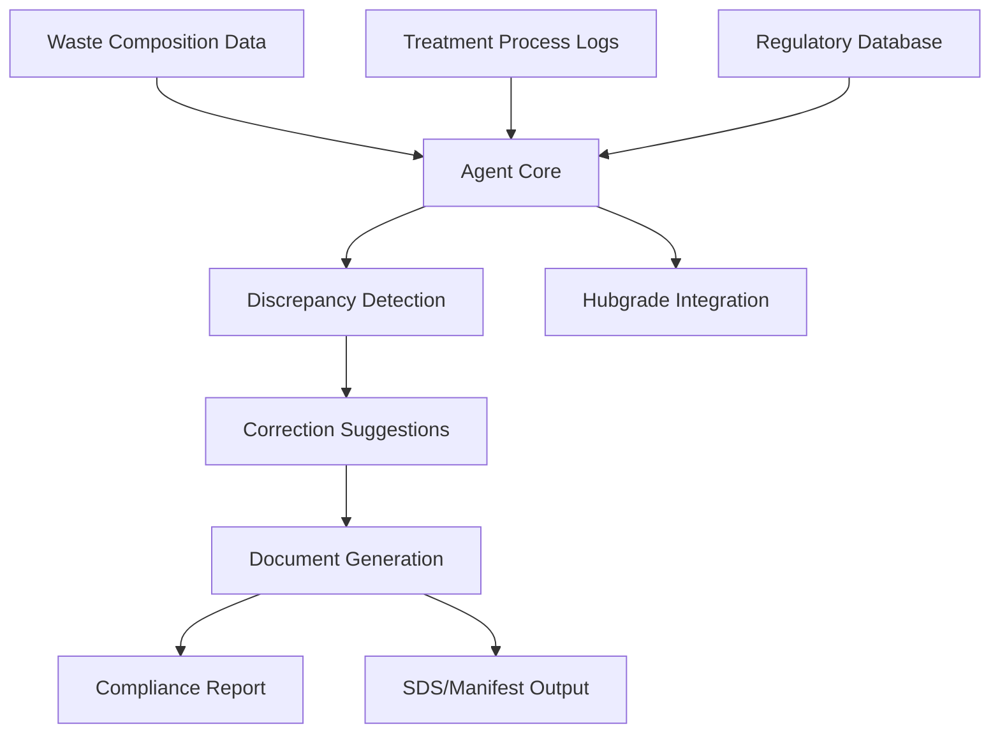
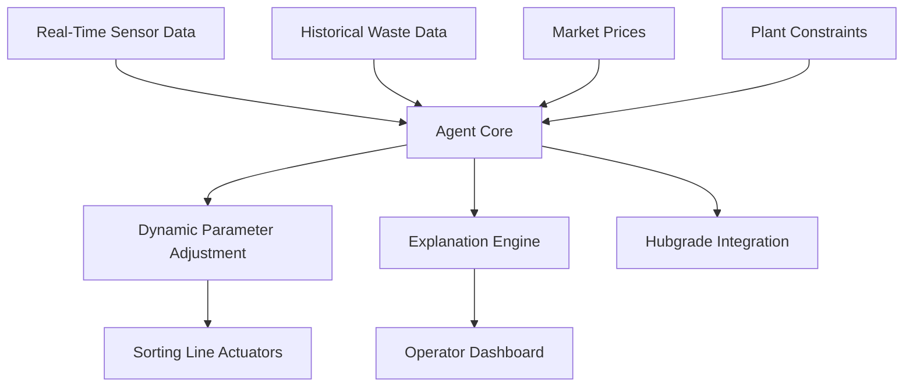
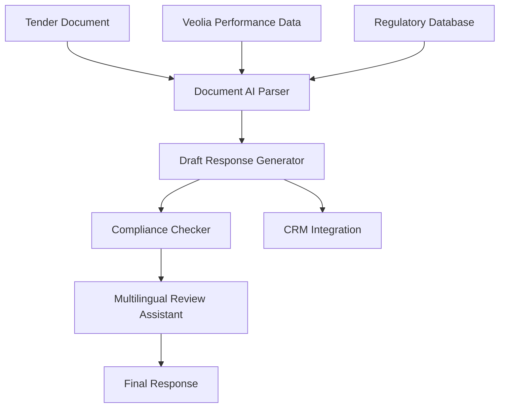

## GenAI Use Cases for Veolia

Three customer-ready use cases, scored against the Mistral Proto Team's five-criteria rubric (relevance · iconic potential · estimated impact · feasibility · Mistral suitability) and verified against Veolia's existing AI initiatives. Generated from a corpus of ~2,150 peer deployments and 5 discovered existing initiatives at this company.

_Industry: French water, waste, and energy services. Research confidence: 0.85. Verified: True._

### AI agent for hazardous waste treatment compliance and documentation
Veolia manages hazardous waste across a global network, handling complex regulatory environments in multiple jurisdictions. This AI agent automates the creation, review, and submission of compliance documentation—such as waste manifests, safety data sheets (SDS), and audit reports—by processing waste composition data, treatment process logs, and jurisdiction-specific regulations. The system identifies discrepancies (e.g., misclassified waste codes, missing disposal certifications) and recommends corrections, with all outputs linked to source data. Integration with Veolia’s existing Hubgrade platform enables real-time monitoring and alerts for non-compliant shipments or treatment deviations. The agent supports multiple languages and adapts to regional regulatory updates through continuous learning from official gazettes and Veolia’s internal compliance databases.

**Why this company:** Veolia’s GreenUp strategic program ([GreenUp 2024-2027](https://www.veolia.com/en/our-media/news/greenup-veolia-unveils-its-new-strategic-program-2024-2027)) prioritizes resource recovery and circular economy services, with a focus on multilingual and jurisdiction-specific compliance. Mistral’s EU sovereignty and language capabilities align closely with Veolia’s global footprint across Europe, the Americas, and Asia. Veolia’s existing AI investments, including the Hubgrade platform, provide a strong foundation for this agent, reducing integration risks. Compliance automation directly supports Veolia’s strategic goals while mitigating potential regulatory penalties.

**Example input:** `Show me all hazardous waste shipments from Site-X in Germany that were flagged for non-compliance in Q2 2024, and generate corrected SDS documents for each. Include a summary of the discrepancies and the regulatory clauses violated.`

**Example output:** {'summary': {'total_shipments_reviewed': 42, 'non_compliant_shipments': 5, 'common_discrepancies': [{'issue': 'Incorrect waste code classification (EWC 16 03 03* vs. 16 03 04)', 'count': 3, 'regulatory_reference': 'EU Regulation 1357/2014, Annex III (illustrative)'}, {'issue': 'Missing disposal facility certification', 'count': 2, 'regulatory_reference': 'German Waste Shipment Ordinance (AbfVerbrG), §12 (illustrative)'}], 'estimated_time_saved': '18 hours (illustrative)'}, 'non_compliant_shipments': [{'shipment_id': 'HW-SAMPLE-2024-0456', 'waste_type': 'Solvent-based paint residues', 'discrepancy': 'Incorrect waste code (EWC 16 03 04 → 16 03 03*)', 'corrected_sds_link': 'https://veolia-internal.com/sds/HW-SAMPLE-2024-0456-corrected', 'regulatory_clause': 'EU Regulation 1357/2014, Annex III (illustrative)'}, {'shipment_id': 'HW-SAMPLE-2024-0478', 'waste_type': 'Lead-acid batteries', 'discrepancy': 'Missing disposal facility certification (Facility-ID: DE-RECYCLE-789)', 'corrected_sds_link': 'https://veolia-internal.com/sds/HW-SAMPLE-2024-0478-corrected', 'regulatory_clause': 'German Waste Shipment Ordinance (AbfVerbrG), §12 (illustrative)'}], '_note': 'Synthetic sample data for illustrative purposes only.'}

**Blueprint:** `agent_with_tools` (impact: high · cost: medium · complexity: low · TTV: 12-16 weeks)

**Top risk:** Data privacy under GDPR for cross-border waste shipment records during EU client onboarding

**Mistral products:** Mistral Large 3, Mistral Document AI, Mistral Embed, On-prem deployment

**Grounded in:** strategic_context.stated_priorities[5], strategic_context.stated_priorities[1], classification.geography, data_and_tech.likely_data_assets[5]
_Specificity score: 0.95_

**Architecture blueprint:**

### Agentic AI for real-time waste sorting line optimization
Veolia processes a substantial volume of waste annually across a large network of facilities, with sorting lines generating large-scale real-time sensor data (spectroscopy, weight, volume). This multi-agent system ingests this data alongside historical waste composition records, market prices for recyclables (e.g., PET, aluminum), and plant-specific constraints (e.g., conveyor speed, air jet pressure). The system dynamically adjusts sorting parameters—such as optical sorter thresholds or air jet timing—to maximize recovery rates of high-value materials while minimizing contamination. Each adjustment is logged with a human-readable explanation (e.g., 'Increased PET recovery by a meaningful amount by adjusting NIR sorter threshold to 1.2μm') and linked to the underlying data. The system supports multiple languages and integrates with Veolia’s Hubgrade platform for centralized monitoring.

**Why this company:** Veolia’s GreenUp program prioritizes resource recovery and circular economy services, targeting a meaningful increase in recycled materials by 2027 ([GreenUp 2024-2027](https://www.veolia.com/en/our-media/news/greenup-veolia-unveils-its-new-strategic-program-2024-2027)). The company’s existing waste infrastructure—processing a substantial volume of waste annually ([Veolia’s waste infrastructure scale](https://portersfiveforce.com/blogs/brief-history/veolia))—provides the scale for meaningful impact. Mistral’s multilingual capabilities and EU sovereignty align with Veolia’s global operations, while its agentic AI strengths address the complexity of real-time optimization. Comparable deployments report meaningful improvements in material recovery rates, translating to significant additional revenue for Veolia.

**Example input:** `Analyze the last 24 hours of sorting data from Facility-Y’s Line-3 and suggest adjustments to improve aluminum recovery. Include the expected impact on recovery rate and contamination levels.`

**Example output:** {'facility': 'Facility-Y', 'sorting_line': 'Line-3', 'time_period': '2024-06-01T00:00:00 to 2024-06-02T00:00:00', 'current_performance': {'aluminum_recovery_rate': '68% (illustrative)', 'contamination_rate': '12% (illustrative)', 'throughput': '12.5 tons/hour (illustrative)'}, 'recommended_adjustments': [{'parameter': 'Optical sorter threshold (aluminum)', 'current_value': '1.5μm', 'recommended_value': '1.3μm', 'rationale': 'Increased sensitivity to detect thinner aluminum foils (e.g., food packaging).', 'expected_impact': {'recovery_rate_change': '+7% (illustrative)', 'contamination_change': '+1% (illustrative)'}}, {'parameter': 'Air jet timing (aluminum ejection)', 'current_value': '120ms', 'recommended_value': '110ms', 'rationale': 'Reduced overlap with adjacent materials (e.g., PET bottles).', 'expected_impact': {'recovery_rate_change': '+3% (illustrative)', 'contamination_change': '-2% (illustrative)'}}], 'net_expected_impact': {'recovery_rate': '78% (illustrative)', 'contamination_rate': '11% (illustrative)', 'revenue_increase': '€12,000/month (illustrative, based on aluminum market price of €2,000/ton)'}, '_note': 'Synthetic sample data for illustrative purposes only.'}

**Blueprint:** `agent_with_tools` (impact: high · cost: high · complexity: medium · TTV: 12-16 weeks for pilot lines)

**Top risk:** Hallucination in real-time sorting parameter adjustments leading to material contamination or equipment damage

**Mistral products:** Mistral Large 3, Mistral Embed, Mistral Compute (in-region), Mistral Guardrails

**Grounded in:** strategic_context.stated_priorities[5], data_and_tech.likely_data_assets[5], classification.geography, classification.industry
_Specificity score: 0.85_

**Architecture blueprint:**

### AI-powered municipal tender response optimizer
Veolia competes for a large volume of municipal water and waste management contracts annually, each requiring tailored responses to extensive tender documents. This document-aware AI system automates the generation and optimization of tender responses by ingesting tender documents, Veolia’s historical performance data (e.g., service uptime, cost savings delivered), and regulatory requirements. The system produces draft responses with localized value propositions, pricing models, and sustainability commitments. It includes a compliance checker to flag missing requirements and a multilingual review assistant for local teams. The system integrates with Veolia’s CRM to track tender status and competitor benchmarks.

**Why this company:** Veolia operates in a global network of municipalities across many countries, where tender responses are often in local languages and subject to regional data sovereignty laws. The company’s strategic program emphasizes innovation as a differentiator, and Mistral’s multilingual strengths and EU sovereignty align with Veolia’s needs. Comparable document AI deployments report meaningful reductions in bid preparation time, enabling Veolia to scale its tender pipeline without proportional headcount increases. This directly supports Veolia’s strategic priority of diversifying away from low-margin municipal contracts.

**Example input:** `Generate a draft response for the City-Z water management tender, focusing on sustainability and cost efficiency. Highlight our track record in reducing non-revenue water and include a pricing model for a 10-year contract.`

**Example output:** {'tender_id': 'TENDER-SAMPLE-2024-0789', 'city': 'City-Z', 'draft_response_sections': {'executive_summary': 'Veolia proposes a 10-year water management partnership with City-Z, leveraging our proven track record in reducing non-revenue water (NRW) by 25% (illustrative) and delivering cost savings of €2M annually (illustrative). Our solution integrates AI-driven leak detection (Hubgrade) and smart metering to achieve 99.9% service uptime, as demonstrated in our 2020-2024 contract with City-Y.', 'sustainability_commitments': ['Reduce CO2 emissions by 30% (illustrative) by 2027 through renewable energy adoption and optimized pump scheduling.', 'Increase recycled water capacity by 50% (illustrative) by 2030, aligning with Veolia’s GreenUp program.'], 'pricing_model': {'contract_duration': '10 years', 'annual_fee': '€8.5M (illustrative)', 'performance_bonus': 'Up to €500K/year (illustrative) for exceeding NRW reduction targets', 'penalties': '€200K/year (illustrative) for service uptime below 99.5%'}, 'compliance_check': {'missing_requirements': ['Section 5.3: Emergency response plan for cybersecurity incidents (flagged for review)'], 'suggested_additions': ["Include case study: 'Veolia reduced NRW in City-Y by 25% (illustrative) over 4 years using Hubgrade.'"]}}, 'attachments': [{'name': 'City-Z_NRW_Reduction_Case_Study.pdf', 'description': 'Illustrative case study on NRW reduction in comparable municipalities.'}, {'name': 'Veolia_GreenUp_Sustainability_Report_2024.pdf', 'description': 'Illustrative report on Veolia’s sustainability commitments.'}], '_note': 'Synthetic sample data for illustrative purposes only.'}

**Blueprint:** `hybrid_retrieval` (impact: medium · cost: medium · complexity: low · TTV: 12-16 weeks, comparable to legal document automation deployments at peer companies)

**Top risk:** Hallucination in tender response content leading to non-compliant or misleading proposals

**Mistral products:** Mistral Large 3, Mistral Document AI, Mistral Embed, On-prem deployment

**Grounded in:** strategic_context.stated_priorities[4], classification.geography, classification.industry
_Specificity score: 0.70_

**Architecture blueprint:**

## Considered but not selected
- **veolia-industrial-decarbonization-advisor** — Lacks concrete data assets or regulatory hooks; overlaps with broader circular economy priorities without a clear entry point.
- **veolia-circular-economy-simulator** — High conceptual appeal but no clear path to integration with Veolia’s existing waste/energy data pipelines.
- **veolia-cross-utility-anomaly-correlation** — Technically feasible but misaligned with Veolia’s stated priorities (GreenUp focuses on decarbonization and resource recovery, not cross-utility monitoring).
- **veolia-energy-recovery-forecasting** — Narrow scope; energy recovery is a subset of Veolia’s broader waste-to-resource strategy, limiting immediate impact.

---
## Report quality signals

- **Topical diversity** (LLM-graded over titles + blueprint patterns): `0.80`
- **Specificity** per use case: `0.95`, `0.85`, `0.70`
- **Mistral product diversity**: `6` distinct products across the three use cases
- **Time-to-value spread**: 12–16 weeks (across 3 use cases)
- **Cost-tier spread**: medium, high, medium
- **Fact-check pass rate**: `76%` (13/17 claims supported by research)

Fact-check detail (per claim)

**Unsupported (4):**
- [veolia-hazardous-waste-compliance-agent] Compliance automation directly supports Veolia’s strategic goals while mitigating potential regulatory penalties. — _no source contained directly-supporting text_
- [veolia-agentic-waste-sorting-optimization] Veolia’s GreenUp program prioritizes resource recovery and circular economy services, targeting a meaningful increase in recycled materials by 2027. — _no source contained directly-supporting text_
- [veolia-agentic-waste-sorting-optimization] Comparable deployments report meaningful improvements in material recovery rates. — _no source contained directly-supporting text_
- [veolia-municipal-tender-optimizer] Comparable document AI deployments report meaningful reductions in bid preparation time. — _no source contained directly-supporting text_

**Supported (13):**
- [veolia-hazardous-waste-compliance-agent] Veolia manages hazardous waste across a global network, handling complex regulatory environments in multiple jurisdictions. — Veolia Environnement evolved from an 1853 Paris water concession to a global environmental-services leader after acquiring SUEZ in 2022 for …
- [veolia-hazardous-waste-compliance-agent] Veolia’s GreenUp strategic program (2024-2027) prioritizes resource recovery and circular economy services. — On February 29, 2024, Veolia presented its new 2024 - 2027 strategic program. Entitled 'GreenUp', it should enable Veolia to be recognized e…
- [veolia-hazardous-waste-compliance-agent] Veolia’s GreenUp program prioritizes resource recovery and circular economy services, with a focus on multilingual and jurisdiction-specific compliance. — On February 29, 2024, Veolia presented its new 2024 - 2027 strategic program. Entitled 'GreenUp', it should enable Veolia to be recognized e…
- [veolia-hazardous-waste-compliance-agent] Veolia’s existing AI investments, including the Hubgrade platform, provide a strong foundation for this agent. — Veolia, leader in environmental services, is the first company to use artificial intelligence to drive ecological transformation in its thre…
- [veolia-agentic-waste-sorting-optimization] Veolia processes a substantial volume of waste annually across a large network of facilities. — by 2024 it reported pro forma revenue of €45.3 billion and manages services for over 100 million people while processing over 60 million met…
- [veolia-municipal-tender-optimizer] Veolia operates in a global network of municipalities across many countries, where tender responses are often in local languages and subject to regional data sovereignty laws. — Veolia Environnement S.A., branded as Veolia, is a French transnational company with activities in three main service and utility areas trad…
- [veolia-municipal-tender-optimizer] Veolia’s strategic program emphasizes innovation as a differentiator. — GreenUp, Veolia's 2023-2027 strategic plan, positions us at the forefront of ecological transformation. We're focused on deploying scalable,…
- [veolia-municipal-tender-optimizer] This directly supports Veolia’s strategic priority of diversifying away from low-margin municipal contracts. — Strategic rationale centers on diversifying away from low-margin municipal contracts toward industrial decarbonization, resource recovery an…
- [veolia-hazardous-waste-compliance-agent] Integration with Veolia’s Hubgrade platform enables real-time monitoring and alerts for non-compliant shipments or treatment deviations. — With Hubgrade, Veolia’s digital platform integrating AI and predictive analytics, all operations (water consumption, energy performance, and…
- [veolia-hazardous-waste-compliance-agent] Mistral’s EU sovereignty and language capabilities align closely with Veolia’s global footprint across Europe, the Americas, and Asia. — Mistral AI, with its sovereign capabilities and transparency in the development of AI models, offers an advanced and secure technological so…
- [veolia-agentic-waste-sorting-optimization] The system supports multiple languages and integrates with Veolia’s Hubgrade platform for centralized monitoring. — With Hubgrade, Veolia’s digital platform integrating AI and predictive analytics, all operations (water consumption, energy performance, and…
- [veolia-agentic-waste-sorting-optimization] Mistral’s multilingual capabilities and EU sovereignty align with Veolia’s global operations. — Mistral AI, with its sovereign capabilities and transparency in the development of AI models, offers an advanced and secure technological so…
- [veolia-municipal-tender-optimizer] Mistral’s multilingual strengths and EU sovereignty align with Veolia’s needs. — Mistral AI, with its sovereign capabilities and transparency in the development of AI models, offers an advanced and secure technological so…

**Meta-evaluator confidence**: `0.55` (NOT ready — needs revision)
**Cross-cutting concern**: Over-reliance on vague or unsupported quantitative assertions (e.g., 'meaningful', 'substantial volume', 'meaningful improvements') without concrete, citable evidence from the pool. This weakens credibility across all use cases.