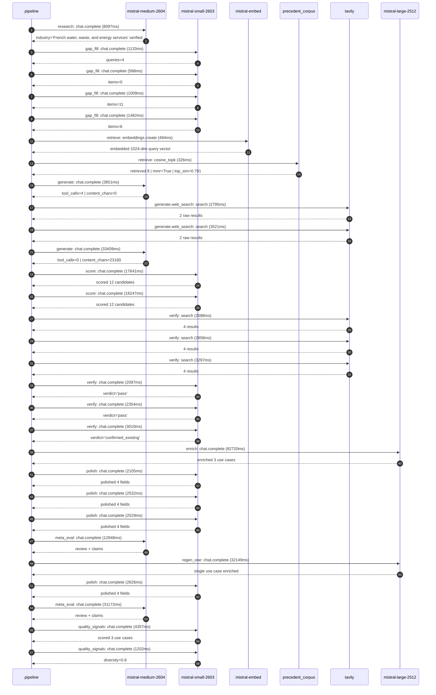

# Pipeline blueprint (architecture)

Static view of the pipeline regardless of run timing — shows agents,
models, and gates. The chronological execution log follows below.

```mermaid
flowchart TD
    Start([User: company name]) --> R
    R["<b>1. Research</b><br/>parallel: Wikipedia · Tavily news ·<br/>existing initiatives · live verification<br/><i>mistral-medium</i> synthesis"]
    R --> G["<b>1b. Gap-fill</b><br/>identify missing fields →<br/><i>mistral-small</i> generates queries →<br/>Tavily search per field →<br/><i>mistral-small</i> per-field extraction"]
    G --> Conf{Confidence ≥ 0.5<br/>OR verified<br/>OR ≥ 1 existing initiative?}
    Conf -->|no| Refuse([Refusal])
    Conf -->|yes| Ret
    Ret["<b>2. Retrieve</b><br/><i>mistral-embed</i> on company query →<br/>cosine top-K + industry/depth filter +<br/>MMR diversification"]
    Ret --> Gen["<b>3. Generate 12 candidates</b><br/><i>mistral-medium</i> with web_search tool<br/>(Tavily + deep-read) — fact citations<br/>flow into the EvidenceLedger"]
    Gen --> Score["<b>4. Score</b><br/>self-consistency: 2 parallel passes<br/><i>mistral-small</i> @ T=0.2 and T=0.4 →<br/>aggregate weighted scores"]
    Score --> Verify["<b>5. Per-candidate verify</b><br/>top-3: Tavily search + deep-read +<br/><i>mistral-small</i> verdict (pass /<br/>partial / confirmed_existing)"]
    Verify --> Enrich["<b>6. Enrich</b><br/><i>mistral-large</i> drafts customer-facing<br/>prose for 3 use cases (or<br/><i>mistral-medium</i> on fast tier)"]
    Enrich --> NumScrub["<b>6a. Numeric scrub</b><br/>flag any number not in cited content"]
    NumScrub --> Polish["<b>6b. Polish</b><br/><i>mistral-small</i> per use case (parallel):<br/>convert markers→qualitative,<br/>(ev-XXX)→[title](url)"]
    Polish --> Attr["<b>6c. Attribution check</b><br/><i>mistral-small</i> per use case (parallel):<br/>fix corpus-ID ↔ company mismatches"]
    Attr --> Meta["<b>7. Meta-evaluation</b><br/><i>mistral-medium</i> reviews report against<br/>cited precedents + ledger entries:<br/>strict claim verification"]
    Meta --> RegenQ{confidence < 0.6<br/>AND not fast tier?}
    RegenQ -->|yes| Regen["<b>7b. Targeted regen</b><br/><i>mistral-large</i> re-enriches just the<br/>weakest use case with the next-best<br/>near-miss; re-runs meta-eval"]
    RegenQ -->|no| QS
    Regen --> QS
    QS["<b>Quality signals</b><br/>LLM-graded diversity + specificity,<br/>fact-check pass rate, TTV/cost spread"]
    QS --> Render([Markdown report + trace])

    classDef agent fill:#fef3c7,stroke:#f59e0b
    classDef gate fill:#dbeafe,stroke:#3b82f6
    classDef io fill:#dcfce7,stroke:#16a34a
    class R,G,Ret,Gen,Score,Verify,Enrich,NumScrub,Polish,Attr,Meta,Regen,QS agent
    class Conf,RegenQ gate
    class Start,Refuse,Render io
```

## Execution trace — Veolia

Started: `2026-05-08T23:55:13.339086+00:00`. Total wall time: `269.1s` across `29` recorded actions.

### Per-step time totals

| Step | Calls | Total time | Avg time |
|---|---:|---:|---:|
| `research` | 1 | 8.10s | 8097ms |
| `gap_fill` | 4 | 4.21s | 1053ms |
| `retrieve` | 2 | 0.82s | 410ms |
| `generate` | 2 | 37.26s | 18630ms |
| `generate.web_search` | 2 | 6.32s | 3158ms |
| `score` | 2 | 35.89s | 17944ms |
| `verify` | 6 | 16.20s | 2701ms |
| `enrich` | 1 | 82.72s | 82720ms |
| `polish` | 4 | 9.79s | 2448ms |
| `meta_eval` | 2 | 44.02s | 22010ms |
| `regen_one` | 1 | 32.15s | 32149ms |
| `quality_signals` | 2 | 5.56s | 2780ms |

### Chronological event log

- `23:55:17.214` **[research]** `mistral-medium-2604.chat.complete` — 8097ms
   - inputs: synthesize CompanyContext for Veolia | depth=medium
   - outputs: industry='French water, waste, and energy services' verified=True conf=0.75
- `23:55:26.778` **[gap_fill]** `mistral-small-2603.chat.complete` — 1133ms
   - inputs: generate gap queries | fields=['business_model', 'products', 'data_assets', 'priorities']
   - outputs: queries=4
- `23:55:33.804` **[gap_fill]** `mistral-small-2603.chat.complete` — 588ms
   - inputs: layer-2 extract field=products
   - outputs: items=0
- `23:55:33.783` **[gap_fill]** `mistral-small-2603.chat.complete` — 1009ms
   - inputs: layer-2 extract field=data_assets
   - outputs: items=11
- `23:55:33.754` **[gap_fill]** `mistral-small-2603.chat.complete` — 1482ms
   - inputs: layer-2 extract field=priorities
   - outputs: items=6
- `23:55:35.258` **[retrieve]** `mistral-embed.embeddings.create` — 494ms
   - inputs: company_query | industries='French water, waste, and energy services'
   - outputs: embedded 1024-dim query vector
- `23:55:35.752` **[retrieve]** `precedent_corpus.cosine_topk` — 326ms
   - inputs: k=8 min_depth=0.4 target='Veolia'
   - outputs: retrieved 8 | mmr=True | top_sim=0.791
- `23:55:37.680` **[generate]** `mistral-medium-2604.chat.complete` — 3851ms
   - inputs: iteration=0 tool_calls_used=0/2 tools=on
   - outputs: tool_calls=4 | content_chars=0
- `23:55:41.550` **[generate.web_search]** `tavily.search` — 2795ms
   - inputs: query='Veolia Hubgrade smart monitoring water energy waste details 2024'
   - outputs: 2 raw results
- `23:55:45.989` **[generate.web_search]** `tavily.search` — 3521ms
   - inputs: query='Veolia GreenUp 2024-2027 strategic program priorities and targets'
   - outputs: 2 raw results
- `23:55:50.974` **[generate]** `mistral-medium-2604.chat.complete` — 33409ms
   - inputs: iteration=1 tool_calls_used=2/2 tools=off
   - outputs: tool_calls=0 | content_chars=23160
- `23:56:24.896` **[score]** `mistral-small-2603.chat.complete` — 17641ms
   - inputs: self-consistency pass T=0.4
   - outputs: scored 12 candidates
- `23:56:24.893` **[score]** `mistral-small-2603.chat.complete` — 18247ms
   - inputs: self-consistency pass T=0.2
   - outputs: scored 12 candidates
- `23:56:43.193` **[verify]** `tavily.search` — 2588ms
   - inputs: candidate=veolia-agentic-waste-sorting-optimization | query='Veolia Agentic AI for real-time waste sorting line optimizat'
   - outputs: 4 results
- `23:56:43.193` **[verify]** `tavily.search` — 2858ms
   - inputs: candidate=veolia-industrial-decarbonization-advisor | query='Veolia Generative AI advisor for industrial decarbonization '
   - outputs: 4 results
- `23:56:43.193` **[verify]** `tavily.search` — 3297ms
   - inputs: candidate=veolia-hazardous-waste-compliance-agent | query='Veolia AI agent for hazardous waste treatment compliance and'
   - outputs: 4 results
- `23:56:46.991` **[verify]** `mistral-small-2603.chat.complete` — 2097ms
   - inputs: verdict for veolia-hazardous-waste-compliance-agent
   - outputs: verdict='pass'
- `23:56:47.608` **[verify]** `mistral-small-2603.chat.complete` — 2354ms
   - inputs: verdict for veolia-agentic-waste-sorting-optimization
   - outputs: verdict='pass'
- `23:56:47.599` **[verify]** `mistral-small-2603.chat.complete` — 3010ms
   - inputs: verdict for veolia-industrial-decarbonization-advisor
   - outputs: verdict='confirmed_existing'
- `23:56:50.648` **[enrich]** `mistral-large-2512.chat.complete` — 82720ms
   - inputs: tier=standard top_3=['veolia-hazardous-waste-compliance-agent', 'veolia-agentic-waste-sorting-optimization', 'veolia-municipal-tender-optimizer']
   - outputs: enriched 3 use cases
- `23:58:13.380` **[polish]** `mistral-small-2603.chat.complete` — 2105ms
   - inputs: use_case=veolia-municipal-tender-optimizer unanchored=True opaque_ev=False
   - outputs: polished 4 fields
- `23:58:13.372` **[polish]** `mistral-small-2603.chat.complete` — 2532ms
   - inputs: use_case=veolia-hazardous-waste-compliance-agent unanchored=True opaque_ev=False
   - outputs: polished 4 fields
- `23:58:13.377` **[polish]** `mistral-small-2603.chat.complete` — 2529ms
   - inputs: use_case=veolia-agentic-waste-sorting-optimization unanchored=True opaque_ev=False
   - outputs: polished 4 fields
- `23:58:15.931` **[meta_eval]** `mistral-medium-2604.chat.complete` — 12848ms
   - inputs: reviewing 3 use cases
   - outputs: review + claims
- `23:58:28.812` **[regen_one]** `mistral-large-2512.chat.complete` — 32149ms
   - inputs: replace weakest=veolia-agentic-waste-sorting-optimization with veolia-industrial-decarbonization-advisor
   - outputs: single use case enriched
- `23:59:00.963` **[polish]** `mistral-small-2603.chat.complete` — 2626ms
   - inputs: use_case=veolia-industrial-decarbonization-advisor unanchored=True opaque_ev=True
   - outputs: polished 4 fields
- `23:59:03.620` **[meta_eval]** `mistral-medium-2604.chat.complete` — 31172ms
   - inputs: reviewing 3 use cases
   - outputs: review + claims
- `23:59:36.848` **[quality_signals]** `mistral-small-2603.chat.complete` — 4357ms
   - inputs: specificity grade (3 use cases)
   - outputs: scored 3 use cases
- `23:59:41.206` **[quality_signals]** `mistral-small-2603.chat.complete` — 1202ms
   - inputs: diversity grade
   - outputs: diversity=0.8

## Mermaid sequence diagram (execution)

