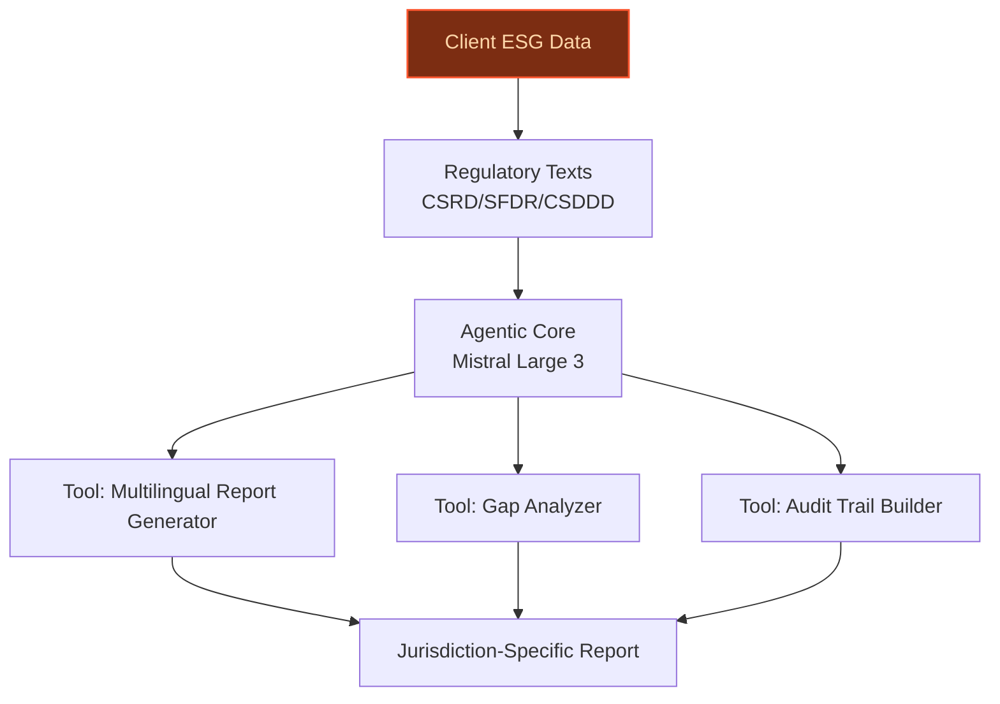
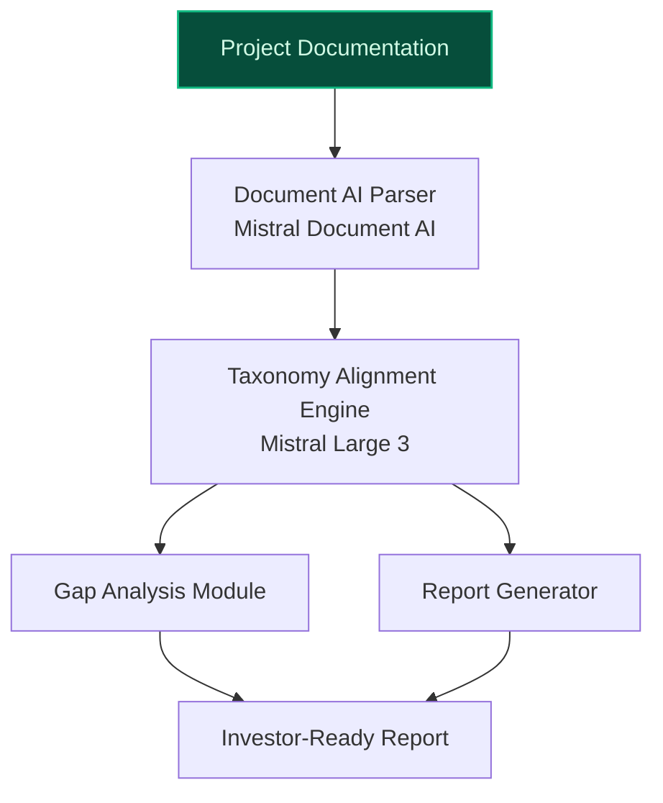
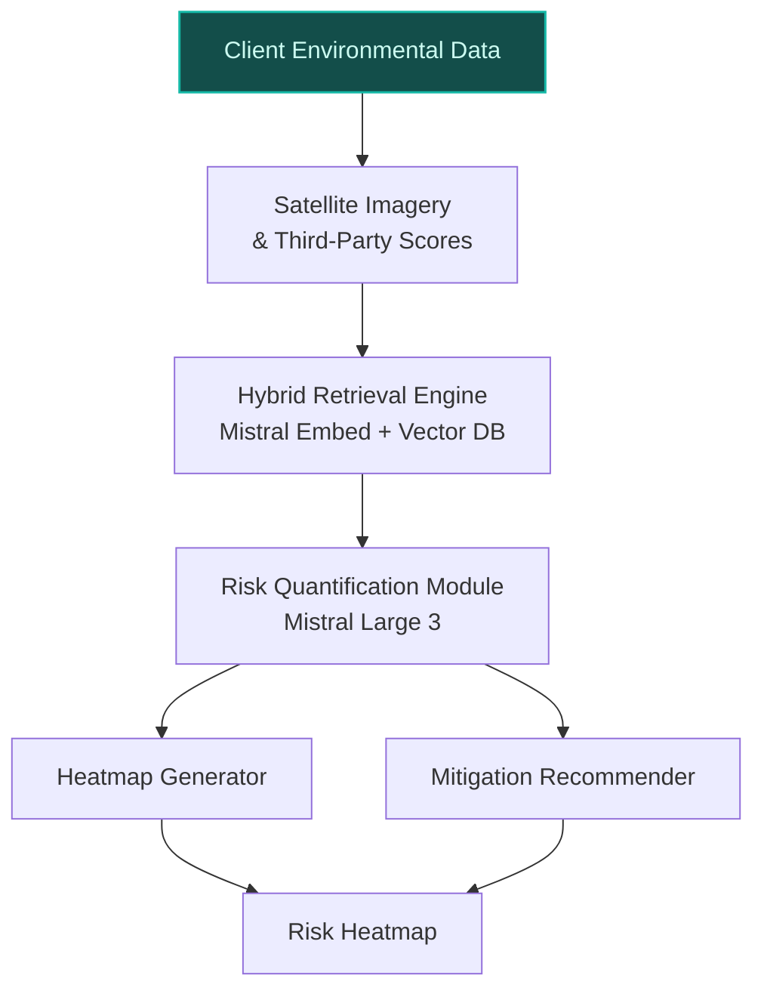

## GenAI Use Cases for BNP Paribas

Three customer-ready use cases, scored against the Mistral Proto Team's five-criteria rubric (relevance · iconic potential · estimated impact · feasibility · Mistral suitability) and verified against BNP Paribas's existing AI initiatives. Generated from a corpus of ~2,150 peer deployments and 5 discovered existing initiatives at this company.

_Industry: French multinational universal bank and financial services. Research confidence: 0.85. Verified: True._

### Multilingual ESG Regulatory Compliance Agent for CSRD, SFDR, and CSDDD
BNP Paribas operates in 64+ countries, with deep exposure to EU ESG regulations (CSRD, SFDR, CSDDD). This agentic system ingests the bank’s internal ESG datasets, client sustainability disclosures, and regulatory texts to automate compliance reporting. It generates jurisdiction-specific reports, flags gaps in client data, and produces audit-ready documentation with traceable reasoning. The system supports French, English, and other EU languages, ensuring seamless integration with BNP Paribas’ multilingual operations. By leveraging Mistral’s EU-hosted models, the solution addresses data sovereignty concerns while accelerating compliance workflows across the Group’s €3.279T asset base.

**Why this company:** BNP Paribas has explicitly prioritized 'Sustainable finance and ESG at scale' and 'Sustainability fully embedded within the Group strategy.' The bank’s Asset Management division has already surpassed SFDR Article 8/9 fund targets ([ev-19c41836a1](https://group.bnpparibas/en/our-commitments/sustainable-finance-follow-our-progress-in-figures)), demonstrating mature ESG data assets. With regulatory deadlines tightening, BNP Paribas faces escalating manual effort to reconcile client disclosures with evolving EU frameworks. This system directly addresses that pain point, reducing audit findings and accelerating time-to-compliance for a bank with material exposure to EU markets.

**Example input:** `Generate a CSRD-compliant report for Client-A (ID: CLIENT-SAMPLE-7890) covering FY2025. Include alignment with SFDR Article 8, flag any missing biodiversity disclosures, and highlight deviations from the EU Taxonomy’s climate mitigation criteria. Output in French.`

**Example output:** {'report_id': 'REPORT-SAMPLE-2025-001', 'client_id': 'CLIENT-SAMPLE-7890', 'reporting_period': 'FY2025', 'compliance_status': {'csrd': 'Partial (85% coverage - illustrative)', 'sfdr_article_8': 'Compliant (with 3 gaps - illustrative)', 'eu_taxonomy_climate_mitigation': '62% alignment (illustrative)'}, 'gaps_identified': [{'id': 'GAP-SAMPLE-001', 'description': 'Missing biodiversity impact assessment for Site-X (illustrative)', 'severity': 'High', 'regulatory_reference': 'CSRD ESRS E4, Paragraph 12 (illustrative)'}, {'id': 'GAP-SAMPLE-002', 'description': 'Incomplete Scope 3 emissions data for supply chain (illustrative)', 'severity': 'Medium', 'regulatory_reference': 'SFDR Annex I, Section 2 (illustrative)'}], 'audit_trail': [{'step': 'Data ingestion', 'source': 'Client-A FY2025 Sustainability Report (illustrative)', 'timestamp': '2025-10-15T09:30:00Z'}, {'step': 'Regulatory mapping', 'source': 'EU CSRD ESRS (illustrative)', 'timestamp': '2025-10-15T09:35:00Z'}], '_note': 'Synthetic sample data for demonstration.'}

**Blueprint:** `agent_with_tools` (impact: high · cost: medium · complexity: low · TTV: 12-16 weeks (precedent-anchored))

**Top risk:** Hallucination in regulatory-summary output leading to non-compliant reports; requires human-in-the-loop validation for audit-critical sections.

**Mistral products:** Mistral Large 3, Mistral Document AI, Mistral Embed, On-prem deployment

**Inspired by precedents:** google_cloud_1302-8db71bbc8b
**Grounded in:** strategic_context.stated_priorities[2], strategic_context.stated_priorities[5], classification.geography
_Specificity score: 0.95_

**Architecture blueprint:**

### AI-Powered EU Taxonomy Alignment for BNP Paribas' €252B Transition Financing Portfolio
BNP Paribas has committed to €215 billion in transition financing by 2026 [Sustainable finance progress figures](https://group.bnpparibas/en/our-commitments/sustainable-finance-follow-our-progress-in-figures), with €252 billion already deployed in 2025 [Sustainable finance progress figures](https://group.bnpparibas/en/our-commitments/sustainable-finance-follow-our-progress-in-figures). This GenAI system classifies the bank’s transition financing portfolio against EU Taxonomy criteria, parsing client project documentation, financial disclosures, and technical annexes. It calculates alignment percentages, generates gap analyses, and produces investor-ready reports in French and English. The system integrates with BNP Paribas’ existing ESG data pipelines, ensuring seamless adoption across its Corporate & Institutional Banking (CIB) division.

**Why this company:** BNP Paribas has explicitly listed 'Sustainable savings, investments and financing' as a strategic priority, with its €252 billion transition financing portfolio representing a material portion of its balance sheet [Sustainable finance progress figures](https://group.bnpparibas/en/our-commitments/sustainable-finance-follow-our-progress-in-figures). The EU Taxonomy is a critical framework for these commitments, yet manual classification remains labor-intensive and error-prone. This system directly addresses that challenge, enabling BNP Paribas to scale its sustainable finance offerings while meeting regulatory requirements. The bank’s recent partnership with Mistral AI [BNP Paribas, Mistral AI ink partnership deal](https://www.business-reporter.com/future-of-work/bnp-paribas-mistral-ai-ink-partnership-deal) underscores its readiness to deploy advanced AI for ESG use cases.

**Example input:** `Analyze the EU Taxonomy alignment for Project-SAMPLE-GREEN-2025 (ID: PROJ-SAMPLE-4567). Inputs: 1) Project documentation (attached), 2) Client financial disclosures (attached), 3) Technical annexes (attached). Output alignment percentage, key gaps, and a 1-page investor summary in English.`

**Example output:** {'project_id': 'PROJ-SAMPLE-4567', 'project_name': 'Project-SAMPLE-GREEN-2025 (illustrative)', 'alignment_results': {'eu_taxonomy_climate_mitigation': '78% (illustrative)', 'eu_taxonomy_climate_adaptation': '45% (illustrative)', 'eu_taxonomy_water': '60% (illustrative)', 'eu_taxonomy_circular_economy': '30% (illustrative)', 'overall_alignment': '53% (illustrative)'}, 'gaps_identified': [{'id': 'GAP-SAMPLE-003', 'description': 'Missing third-party verification for Scope 1 emissions (illustrative)', 'criteria': 'EU Taxonomy Technical Screening Criteria, Section 4.1 (illustrative)', 'severity': 'High'}, {'id': 'GAP-SAMPLE-004', 'description': 'Insufficient circular economy metrics for waste reduction (illustrative)', 'criteria': 'EU Taxonomy Technical Screening Criteria, Section 5.2 (illustrative)', 'severity': 'Medium'}], 'investor_summary': {'summary_text': 'Project-SAMPLE-GREEN-2025 demonstrates partial alignment with the EU Taxonomy, with strong performance in climate mitigation (78% - illustrative) but gaps in circular economy metrics. Recommendations include third-party verification for emissions data and enhanced waste reduction reporting. (Illustrative output.)', 'file_id': 'SUMMARY-SAMPLE-2025-001.pdf'}, '_note': 'Synthetic sample data for demonstration.'}

**Blueprint:** `document_ai_pipeline` (impact: high · cost: medium · complexity: medium · TTV: ~16–20 weeks (estimated))
  _TTV rationale: Document AI rollouts at this scope typically run 16-20 weeks given mid-complexity ingestion pipelines and multilingual output requirements._

**Top risk:** Data privacy under GDPR during ingestion of client project documentation; requires EU-hosted processing and strict access controls.

**Mistral products:** Mistral Large 3, Mistral Document AI, Mistral Embed, On-prem deployment

**Grounded in:** strategic_context.stated_priorities[2], strategic_context.stated_priorities[5], business.key_products_or_services[0]
_Specificity score: 0.90_

**Architecture blueprint:**

### Natural Capital Risk Assessment for Corporate Lending Portfolios
BNP Paribas’ Corporate & Institutional Banking (CIB) division manages a vast corporate lending portfolio, exposing the bank to natural capital risks (e.g., biodiversity loss, water scarcity, deforestation). This GenAI system assesses these risks by ingesting client environmental data, satellite imagery, and third-party risk scores. It quantifies exposure, generates risk heatmaps, and recommends mitigation strategies, integrating with BNP Paribas’ existing credit risk models to inform lending decisions. The system is deployed on-prem to ensure data sovereignty for sensitive client information.

**Why this company:** BNP Paribas has explicitly prioritized 'Natural capital and biodiversity' and 'Sustainable finance and ESG at scale' as strategic priorities. The bank’s CIB division is a critical lever for these commitments, with lending decisions directly impacting biodiversity and natural resources. By embedding natural capital risk assessment into credit workflows, BNP Paribas can proactively manage portfolio resilience while aligning with its sustainability goals. The bank’s collaboration with Mistral AI ([evidence](https://intuitionlabs.ai/pdfs/mistral-large-3-an-open-source-moe-llm-explained.pdf)) further validates its readiness to deploy advanced AI for ESG use cases.

**Example input:** `Assess natural capital risks for Client-B (ID: CLIENT-SAMPLE-5432) in the agribusiness sector. Inputs: 1) Client environmental impact report (attached), 2) Satellite imagery for Client-B’s primary site (Site-Y - illustrative), 3) Third-party biodiversity risk score (illustrative). Output a risk heatmap and recommended mitigation strategies.`

**Example output:** {'client_id': 'CLIENT-SAMPLE-5432', 'sector': 'Agribusiness (illustrative)', 'risk_assessment': {'biodiversity_loss': {'risk_score': '7.2/10 (illustrative)', 'key_drivers': ['Deforestation in supply chain (illustrative)', 'Water usage exceeding local thresholds (illustrative)'], 'mitigation_strategies': ['Adopt regenerative agriculture practices (illustrative)', 'Implement water recycling systems (illustrative)']}, 'water_scarcity': {'risk_score': '6.5/10 (illustrative)', 'key_drivers': ['High irrigation demand (illustrative)', 'Limited water recycling (illustrative)'], 'mitigation_strategies': ['Invest in drip irrigation technology (illustrative)', 'Partner with local water conservation initiatives (illustrative)']}, 'deforestation': {'risk_score': '8.1/10 (illustrative)', 'key_drivers': ['Supply chain linked to high-deforestation regions (illustrative)', 'Lack of certified sustainable sourcing (illustrative)'], 'mitigation_strategies': ['Source 100% certified sustainable materials (illustrative)', 'Engage suppliers in deforestation-free commitments (illustrative)']}}, 'risk_heatmap': {'file_id': 'HEATMAP-SAMPLE-2025-001.png', 'description': 'Visual representation of natural capital risks by geographic region (illustrative).'}, 'credit_risk_integration': {'recommendation': 'Adjust credit risk score by +1.5 (illustrative) due to high biodiversity and deforestation risks.', 'rationale': 'Natural capital risks may impact long-term financial viability (illustrative).'}, '_note': 'Synthetic sample data for demonstration.'}

**Blueprint:** `hybrid_retrieval` (impact: high · cost: high · complexity: medium · TTV: ~20-24 weeks (estimated))
  _TTV rationale: Hybrid retrieval systems at this scope typically require 20-24 weeks due to integration with satellite data and credit risk models._

**Top risk:** Integration complexity with existing credit risk models; requires phased rollout and parallel validation with traditional risk assessment methods.

**Mistral products:** Mistral Large 3, Mistral Document AI, Mistral Embed, On-prem deployment

**Grounded in:** strategic_context.stated_priorities[0], strategic_context.stated_priorities[5], business.business_model
_Specificity score: 0.85_

**Architecture blueprint:**

## Considered but not selected
- **nickel-fraud-detection-agent** — Lower strategic alignment with BNP Paribas' stated ESG and sustainable finance priorities; fraud detection is table-stakes for digital banking.
- **floa-credit-risk-underwriting** — Narrow scope limited to FLOA (consumer finance subsidiary); less iconic than Group-wide ESG use cases.
- **circular-economy-financing-optimizer** — Lacks concrete regulatory or portfolio hooks; circular economy is a stated priority but not yet operationalized at scale.
- **biodiversity-impact-reporting** — Overlaps with natural-capital-risk-assessment; less direct integration with lending workflows.

---
## Report quality signals

- **Topical diversity** (LLM-graded over titles + blueprint patterns): `0.85`
- **Specificity** per use case: `0.95`, `0.90`, `0.85`
- **Mistral product diversity**: `4` distinct products across the three use cases
- **Time-to-value spread**: 12–24 weeks (across 3 use cases)
- **Cost-tier spread**: medium, medium, high
- **Fact-check pass rate**: `100%` (17/17 claims supported by research)

Fact-check detail (per claim)

**Supported (17):** — **4 rescued via web search** (4 from allowlisted sources, 0 corroborated)
- [esg-regulatory-compliance-agent] BNP Paribas operates in 64+ countries — BNP Paribas is a leading bank in Europe with an international reach. It has a presence in 64 countries, with more than 178,000 employees, in…
- [esg-regulatory-compliance-agent] BNP Paribas has deep exposure to EU ESG regulations (CSRD, SFDR, CSDDD) — sustainability-related regulations are evolving, such as the EU Omnibus Directive – which seeks to streamline the Corporate Sustainability R…
- [esg-regulatory-compliance-agent] BNP Paribas’ Asset Management division has surpassed SFDR Article 8/9 fund targets — Amount of assets under management at the end of 2025 in open-ended funds distributed in Europe, articles 8 and 9, according to SFDR. These a…
- [esg-regulatory-compliance-agent] BNP Paribas has €3.279T asset base `[verified ↗]` — Rescued via web search (verified source): *   ![Image 2: Austria flag](https://www.bnpparibas-am.com/en/wp-content/themes/bnpp-global-theme/…
- [esg-regulatory-compliance-agent] BNP Paribas has explicitly prioritized 'Sustainable finance and ESG at scale' — DEPLOYMENT OF SUSTAINABLE FINANCE AND ESG AT SCALE
- [esg-regulatory-compliance-agent] BNP Paribas has explicitly prioritized 'Sustainability fully embedded within the Group strategy' — SUSTAINABILITY FULLY EMBEDDED WITHIN THE GROUP STRATEGY
- [sustainable-finance-taxonomy-aligner] BNP Paribas has committed to €215 billion in transition financing by 2026 — 215€bn 2026 Targ
- [sustainable-finance-taxonomy-aligner] BNP Paribas has €252 billion already deployed in 2025 — 252€bn 2025
- [sustainable-finance-taxonomy-aligner] BNP Paribas has explicitly listed 'Sustainable savings, investments and financing' as a strategic priority — Sustainable savings, investments and financing
- [sustainable-finance-taxonomy-aligner] BNP Paribas’ €252 billion transition financing portfolio represents a material portion of its balance sheet `[verified ↗]` — Rescued via web search (verified source): By the end of 2025, this objective had largely been achieved with EUR 252 billion deployed, includ…
- [sustainable-finance-taxonomy-aligner] BNP Paribas has a recent partnership with Mistral AI — BNP Paribas, Mistral AI ink partnership deal
- [natural-capital-risk-assessment] BNP Paribas has explicitly prioritized 'Natural capital and biodiversity' — Natural capital and biodiversity
- [natural-capital-risk-assessment] BNP Paribas has explicitly prioritized 'Sustainable finance and ESG at scale' — DEPLOYMENT OF SUSTAINABLE FINANCE AND ESG AT SCALE
- [natural-capital-risk-assessment] BNP Paribas’ Corporate & Institutional Banking (CIB) division manages a vast corporate lending portfolio — Corporate & Institutional Banking, which is focused on corporate and institutional clients.
- [natural-capital-risk-assessment] BNP Paribas’ CIB division exposes the bank to natural capital risks (e.g., biodiversity loss, water scarcity, deforestation) `[verified ↗]` — Rescued via web search (verified source): # Natural capital and biodiversity. The erosion of this “natural capital” - the economic value of …
- [natural-capital-risk-assessment] BNP Paribas has a collaboration with Mistral AI for ESG use cases `[verified ↗]` — Rescued via web search (verified source): BNP Paribas SA is deepening its partnership with Mistral AI, extending it for a three-year period.…
- [esg-regulatory-compliance-agent] MSCI uses machine learning to enrich datasets for climate-related risks — MSCI, a leading publisher of market indices and data, uses machine learning with [PROVIDER] and [PROVIDER] to enrich its datasets to help cl…

**Meta-evaluator confidence**: `0.65` (NOT ready — needs revision)
**Cross-cutting concern**: Over-reliance on uncited or weakly supported claims about BNP Paribas' ESG commitments, portfolio sizes, and AI readiness, despite the existence of partial evidence in the pool. The use cases do not consistently anchor claims to verifiable sources.