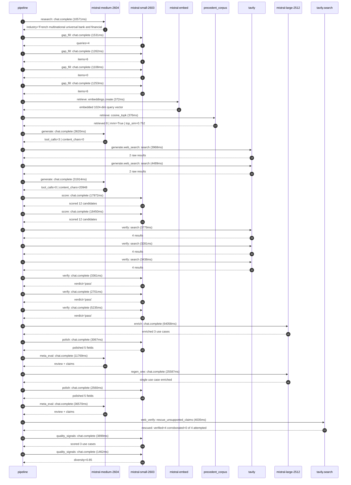

# Pipeline blueprint (architecture)

Static view of the pipeline regardless of run timing — shows agents,
models, and gates. The chronological execution log follows below.

```mermaid
flowchart TD
    Start([User: company name]) --> R
    R["<b>1. Research</b><br/>parallel: Wikipedia · Tavily news ·<br/>existing initiatives · live verification<br/><i>mistral-medium</i> synthesis"]
    R --> G["<b>1b. Gap-fill</b><br/>identify missing fields →<br/><i>mistral-small</i> generates queries →<br/>Tavily search per field →<br/><i>mistral-small</i> per-field extraction"]
    G --> Conf{Confidence ≥ 0.5<br/>OR verified<br/>OR ≥ 1 existing initiative?}
    Conf -->|no| Refuse([Refusal])
    Conf -->|yes| Ret
    Ret["<b>2. Retrieve</b><br/><i>mistral-embed</i> on company query →<br/>cosine top-K + industry/depth filter +<br/>MMR diversification"]
    Ret --> Gen["<b>3. Generate 12 candidates</b><br/><i>mistral-medium</i> with web_search tool<br/>(Tavily + deep-read) — fact citations<br/>flow into the EvidenceLedger"]
    Gen --> Score["<b>4. Score</b><br/>self-consistency: 2 parallel passes<br/><i>mistral-small</i> @ T=0.2 and T=0.4 →<br/>aggregate weighted scores"]
    Score --> Verify["<b>5. Per-candidate verify</b><br/>top-3: Tavily search + deep-read +<br/><i>mistral-small</i> verdict (pass /<br/>partial / confirmed_existing)"]
    Verify --> Enrich["<b>6. Enrich</b><br/><i>mistral-large</i> drafts customer-facing<br/>prose for 3 use cases (or<br/><i>mistral-medium</i> on fast tier)"]
    Enrich --> NumScrub["<b>6a. Numeric scrub</b><br/>flag any number not in cited content"]
    NumScrub --> Polish["<b>6b. Polish</b><br/><i>mistral-small</i> per use case (parallel):<br/>convert markers→qualitative,<br/>(ev-XXX)→[title](url)"]
    Polish --> Attr["<b>6c. Attribution check</b><br/><i>mistral-small</i> per use case (parallel):<br/>fix corpus-ID ↔ company mismatches"]
    Attr --> Meta["<b>7. Meta-evaluation</b><br/><i>mistral-medium</i> reviews report against<br/>cited precedents + ledger entries:<br/>strict claim verification"]
    Meta --> RegenQ{confidence < 0.6<br/>AND not fast tier?}
    RegenQ -->|yes| Regen["<b>7b. Targeted regen</b><br/><i>mistral-large</i> re-enriches just the<br/>weakest use case with the next-best<br/>near-miss; re-runs meta-eval"]
    RegenQ -->|no| QS
    Regen --> QS
    QS["<b>Quality signals</b><br/>LLM-graded diversity + specificity,<br/>fact-check pass rate, TTV/cost spread"]
    QS --> Render([Markdown report + trace])

    classDef agent fill:#fef3c7,stroke:#f59e0b
    classDef gate fill:#dbeafe,stroke:#3b82f6
    classDef io fill:#dcfce7,stroke:#16a34a
    class R,G,Ret,Gen,Score,Verify,Enrich,NumScrub,Polish,Attr,Meta,Regen,QS agent
    class Conf,RegenQ gate
    class Start,Refuse,Render io
```

## Execution trace — BNP Paribas

Started: `2026-05-09T11:23:41.841725+00:00`. Total wall time: `280.1s` across `28` recorded actions.

### Per-step time totals

| Step | Calls | Total time | Avg time |
|---|---:|---:|---:|
| `research` | 1 | 10.57s | 10571ms |
| `gap_fill` | 4 | 5.15s | 1289ms |
| `retrieve` | 2 | 0.75s | 374ms |
| `generate` | 2 | 35.53s | 17767ms |
| `generate.web_search` | 2 | 8.46s | 4228ms |
| `score` | 2 | 36.42s | 18211ms |
| `verify` | 6 | 21.80s | 3633ms |
| `enrich` | 1 | 64.06s | 64058ms |
| `polish` | 2 | 5.63s | 2814ms |
| `meta_eval` | 2 | 48.34s | 24169ms |
| `regen_one` | 1 | 25.59s | 25587ms |
| `web_verify` | 1 | 4.03s | 4035ms |
| `quality_signals` | 2 | 5.36s | 2680ms |

### Chronological event log

- `11:23:47.208` **[research]** `mistral-medium-2604.chat.complete` — 10571ms
   - inputs: synthesize CompanyContext for BNP Paribas | depth=medium
   - outputs: industry='French multinational universal bank and financial services' verified=True conf=0.75
- `11:23:57.781` **[gap_fill]** `mistral-small-2603.chat.complete` — 1531ms
   - inputs: generate gap queries | fields=['business_model', 'products', 'data_assets', 'priorities']
   - outputs: queries=4
- `11:24:17.251` **[gap_fill]** `mistral-small-2603.chat.complete` — 1262ms
   - inputs: layer-2 extract field=priorities
   - outputs: items=6
- `11:24:17.255` **[gap_fill]** `mistral-small-2603.chat.complete` — 1108ms
   - inputs: layer-2 extract field=data_assets
   - outputs: items=0
- `11:24:17.261` **[gap_fill]** `mistral-small-2603.chat.complete` — 1253ms
   - inputs: layer-2 extract field=products
   - outputs: items=6
- `11:24:18.515` **[retrieve]** `mistral-embed.embeddings.create` — 372ms
   - inputs: company_query | industries='French multinational universal bank and financial services'
   - outputs: embedded 1024-dim query vector
- `11:24:18.887` **[retrieve]** `precedent_corpus.cosine_topk` — 376ms
   - inputs: k=8 min_depth=0.4 target='BNP Paribas'
   - outputs: retrieved 8 | mmr=True | top_sim=0.752
- `11:24:23.535` **[generate]** `mistral-medium-2604.chat.complete` — 3620ms
   - inputs: iteration=0 tool_calls_used=0/2 tools=on
   - outputs: tool_calls=3 | content_chars=0
- `11:24:27.168` **[generate.web_search]** `tavily.search` — 3968ms
   - inputs: query='BNP Paribas sustainable finance ESG data assets 2026'
   - outputs: 2 raw results
- `11:24:34.458` **[generate.web_search]** `tavily.search` — 4489ms
   - inputs: query='BNP Paribas Corporate & Institutional Banking regulatory reporting requirements 2026'
   - outputs: 2 raw results
- `11:24:44.995` **[generate]** `mistral-medium-2604.chat.complete` — 31914ms
   - inputs: iteration=1 tool_calls_used=2/2 tools=off
   - outputs: tool_calls=0 | content_chars=20948
- `11:25:18.031` **[score]** `mistral-small-2603.chat.complete` — 17972ms
   - inputs: self-consistency pass T=0.2
   - outputs: scored 12 candidates
- `11:25:18.035` **[score]** `mistral-small-2603.chat.complete` — 18450ms
   - inputs: self-consistency pass T=0.4
   - outputs: scored 12 candidates
- `11:25:36.524` **[verify]** `tavily.search` — 3779ms
   - inputs: candidate=esg-regulatory-compliance-agent | query='BNP Paribas Multilingual ESG Regulatory Compliance Agent for'
   - outputs: 4 results
- `11:25:36.525` **[verify]** `tavily.search` — 3281ms
   - inputs: candidate=sustainable-finance-taxonomy-aligner | query="BNP Paribas AI-Powered EU Taxonomy Alignment fornp Paribas' "
   - outputs: 4 results
- `11:25:36.525` **[verify]** `tavily.search` — 3438ms
   - inputs: candidate=natural-capital-risk-assessment | query='BNP Paribas Natural Capital Risk Assessment for Corporate Le'
   - outputs: 4 results
- `11:25:39.963` **[verify]** `mistral-small-2603.chat.complete` — 3361ms
   - inputs: verdict for natural-capital-risk-assessment
   - outputs: verdict='pass'
- `11:25:42.251` **[verify]** `mistral-small-2603.chat.complete` — 2701ms
   - inputs: verdict for esg-regulatory-compliance-agent
   - outputs: verdict='pass'
- `11:25:43.130` **[verify]** `mistral-small-2603.chat.complete` — 5235ms
   - inputs: verdict for sustainable-finance-taxonomy-aligner
   - outputs: verdict='pass'
- `11:25:48.371` **[enrich]** `mistral-large-2512.chat.complete` — 64058ms
   - inputs: tier=standard top_3=['esg-regulatory-compliance-agent', 'sustainable-finance-taxonomy-aligner', 'natural-capital-risk-assessment']
   - outputs: enriched 3 use cases
- `11:26:52.451` **[polish]** `mistral-small-2603.chat.complete` — 3067ms
   - inputs: use_case=sustainable-finance-taxonomy-aligner unanchored=True opaque_ev=False
   - outputs: polished 5 fields
- `11:26:55.523` **[meta_eval]** `mistral-medium-2604.chat.complete` — 11769ms
   - inputs: reviewing 3 use cases
   - outputs: review + claims
- `11:27:07.293` **[regen_one]** `mistral-large-2512.chat.complete` — 25587ms
   - inputs: replace weakest=natural-capital-risk-assessment with nickel-fraud-detection-agent
   - outputs: single use case enriched
- `11:27:32.893` **[polish]** `mistral-small-2603.chat.complete` — 2560ms
   - inputs: use_case=nickel-fraud-detection-agent unanchored=True opaque_ev=False
   - outputs: polished 5 fields
- `11:27:35.454` **[meta_eval]** `mistral-medium-2604.chat.complete` — 36570ms
   - inputs: reviewing 3 use cases
   - outputs: review + claims
- `11:28:12.045` **[web_verify]** `tavily.search.rescue_unsupported_claims` — 4035ms
   - inputs: company='BNP Paribas' unsupported=4 budget=12
   - outputs: rescued: verified=4 corroborated=0 of 4 attempted
- `11:28:16.627` **[quality_signals]** `mistral-small-2603.chat.complete` — 3899ms
   - inputs: specificity grade (3 use cases)
   - outputs: scored 3 use cases
- `11:28:20.526` **[quality_signals]** `mistral-small-2603.chat.complete` — 1462ms
   - inputs: diversity grade
   - outputs: diversity=0.85

## Mermaid sequence diagram (execution)

