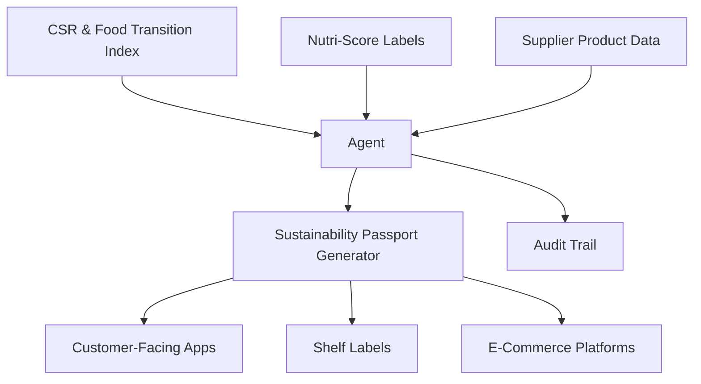
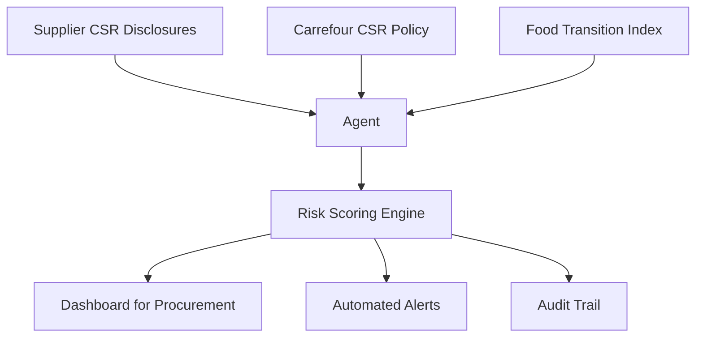
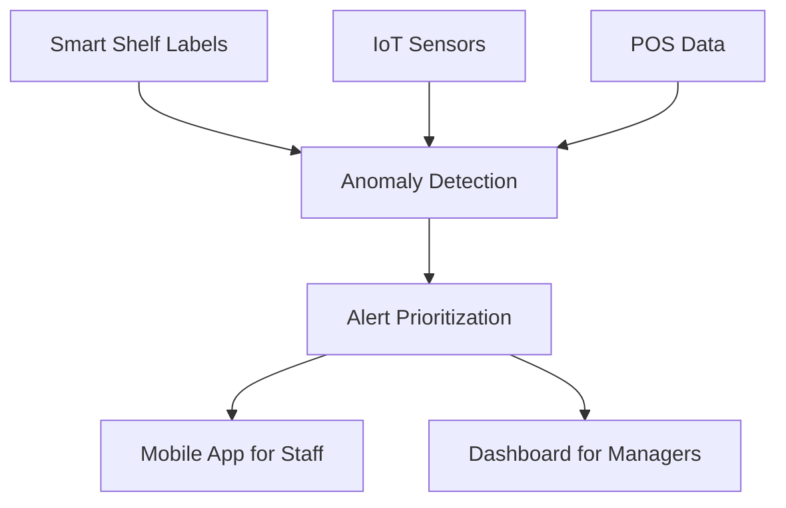

## GenAI Use Cases for Carrefour

Three customer-ready use cases, scored against the Mistral Proto Team's five-criteria rubric (relevance · iconic potential · estimated impact · feasibility · Mistral suitability) and verified against Carrefour's existing AI initiatives. Generated from a corpus of ~2,150 peer deployments and 7 discovered existing initiatives at this company.

_Industry: French multinational retail and wholesaling corporation. Research confidence: 0.85. Verified: True._

### AI agent for dynamic sustainability scoring of private-label products using CSR and Nutri-Score data
Carrefour’s private-label portfolio (Carrefour Bio, Reflets de France, Carrefour Quality Lines) is a cornerstone of its brand differentiation and sustainability commitments. This autonomous AI agent ingests Carrefour’s proprietary CSR and Food Transition Index data, Nutri-Score labels, and supplier-provided product attributes—including ingredient sourcing, packaging materials, and carbon footprint—to generate real-time sustainability scores for every private-label SKU. The system produces a standardized 'Sustainability Passport' for each product, updated dynamically as new data arrives, and surfaces these scores in customer-facing apps, shelf labels, and e-commerce platforms. Multilingual output ensures compliance with local regulations across Carrefour’s markets, while granular audit trails support regulatory disclosures and third-party certifications.

**Why this company:** Carrefour’s Act for Food program and mission-led status make sustainability a core brand pillar. The company already owns the requisite data assets—CSR and Food Transition Index, Nutri-Score labels, and private-label product catalogs—and has rolled out Nutri-Score across its private-label lines in Poland ([Carrefour Polska introduces the Nutri-Score system](https://www.carrefour.com/en/news/carrefour-polska-introduces-nutri-score-system-marking-private-label-products)). This use case transforms Carrefour’s data advantage into a transparent, defensible sustainability narrative, driving customer trust and private-label sales uplift.

**Example input:** `Show me the sustainability score for Carrefour Bio Organic Lentils (SKU: CBIO-SAMPLE-2025-045) and explain how the packaging and sourcing contribute to the rating.`

**Example output:** {'_disclaimer': 'Synthetic example for demonstration; not a factual claim about Carrefour or its suppliers.', 'product_name': 'Carrefour Bio Organic Lentils', 'sku': 'CBIO-SAMPLE-2025-045', 'sustainability_passport': {'overall_score': '87/100 (sample)', 'nutri_score': 'A', 'carbon_footprint': '0.45 kg CO2e/100g (illustrative)', 'packaging_materials': {'primary': '100% recycled cardboard (FSC-certified)', 'secondary': 'Compostable film (EN 13432 compliant)', 'recyclability_score': '95% (sample)'}, 'sourcing': {'origin': "France (Region: Provence-Alpes-Côte d'Azur)", 'farmers_in_cooperative': '12 (sample)', 'organic_certification': 'EU Organic (Regulation (EU) 2018/848)'}, 'compliance_flags': [{'standard': 'Carrefour CSR Policy v4.2', 'status': 'Compliant', 'last_audit': '2025-03-15 (sample)'}, {'standard': 'EU Deforestation Regulation (EUDR)', 'status': 'Compliant', 'last_audit': '2025-02-20 (sample)'}], 'improvement_suggestions': ['Replace compostable film with home-compostable alternative to improve recyclability score by 5% (sample).', 'Source 20% of lentils from regenerative agriculture farms by 2026 to reduce carbon footprint by 0.05 kg CO2e/100g (sample).']}, 'data_last_updated': '2025-04-10T08:30:00Z (sample)'}

**Blueprint:** `agent_with_tools` (impact: high · cost: medium · complexity: low · TTV: ~12-16 weeks (estimated))
  _TTV rationale: Agent-based sustainability scoring deployments at comparable retailers (e.g., Ahold Delhaize) typically require 12-16 weeks for data integration, model tuning, and multilingual output rollout._

**Top risk:** Data consistency across markets, particularly for supplier-provided carbon footprint and packaging data under varying local regulations.

**Mistral products:** Mistral Large 3, Mistral Document AI, Mistral Embed, Mistral Compute (EU)

**Grounded in:** data_and_tech.likely_data_assets[4], business.key_products_or_services[0], business.key_products_or_services[1], strategic_context.stated_priorities[0]
_Specificity score: 0.95_

**Architecture blueprint:**

### AI-powered sustainability audit for private-label suppliers using CSR and supplier data
Carrefour’s private-label suppliers are critical to its sustainability commitments, but manual audits of CSR disclosures, certifications, and sourcing practices are time-consuming and prone to gaps. This autonomous AI agent cross-references supplier-provided data (e.g., carbon footprint reports, organic certifications, animal welfare audits) with Carrefour’s internal CSR standards and Food Transition Index benchmarks. The system generates a real-time sustainability risk score for each supplier, flags non-compliant practices (e.g., deforestation-linked sourcing, non-recyclable packaging), and prioritizes high-risk suppliers for follow-up. Audit results are surfaced in a dashboard for Carrefour’s procurement teams, with automated alerts for regulatory deadlines (e.g., EU Deforestation Regulation) and third-party certification renewals.

**Why this company:** Carrefour’s Act for Food program and CSR commitments ([Carrefour 2024 URD](https://www.carrefour.com/sites/default/files/2025-05/CFR_URD_2024_EN_250328_MEL.pdf)) require rigorous supplier oversight, particularly for private-label lines like Carrefour Bio and Reflets de France. The company’s proprietary CSR and Food Transition Index data provide a unique foundation for automated audits, while its scale (14,000 stores in 40 countries) amplifies the impact of efficiency gains.

**Example input:** `Generate a sustainability risk report for Supplier-A (ID: SUPP-SAMPLE-7890) and flag any non-compliant practices with Carrefour’s CSR Policy v4.2.`

**Example output:** {'_disclaimer': 'Synthetic example for demonstration; not a factual claim about Carrefour or its suppliers.', 'supplier_name': 'Supplier-A', 'supplier_id': 'SUPP-SAMPLE-7890', 'audit_date': '2025-04-12 (sample)', 'sustainability_risk_score': '68/100 (sample)', 'risk_category': 'Medium', 'compliance_summary': {'carrefour_csr_policy_v4.2': {'status': 'Non-Compliant', 'flagged_sections': [{'section': '4.3 Packaging Materials', 'issue': '30% of packaging uses non-recyclable plastic (sample).', 'evidence': 'Supplier report dated 2025-03-01 (sample).'}, {'section': '5.1 Carbon Footprint Disclosure', 'issue': 'Missing Scope 3 emissions data for 2024 (sample).', 'evidence': 'No submission in Carrefour’s CSR portal (sample).'}]}, 'eu_deforestation_regulation': {'status': 'Compliant', 'last_audit': '2025-01-15 (sample)'}, 'animal_welfare': {'status': 'Compliant', 'last_audit': '2025-02-20 (sample)', 'details': 'Audits performed for poultry and hogs (sample).'}}, 'recommendations': ['Submit missing Scope 3 emissions data within 30 days to avoid contract penalties (sample).', 'Transition to 100% recyclable or compostable packaging by Q4 2025 (sample).', 'Schedule follow-up audit for Q3 2025 to verify corrective actions (sample).'], 'regulatory_deadlines': [{'regulation': 'EU Deforestation Regulation (EUDR)', 'deadline': '2025-06-30 (sample)', 'action_required': 'Submit updated geolocation data for all sourcing sites (sample).'}]}

**Blueprint:** `agent_with_tools` (impact: high · cost: medium · complexity: medium · TTV: ~16-20 weeks (estimated))
  _TTV rationale: Supplier audit systems require 16-20 weeks for data integration, model training, and dashboard deployment, particularly for multilingual and multi-regulatory environments._

**Top risk:** Supplier resistance to data sharing, particularly for carbon footprint and sourcing transparency, under GDPR and local data sovereignty laws.

**Mistral products:** Mistral Large 3, Mistral Document AI, Mistral Embed, Mistral Compute (EU)

**Grounded in:** data_and_tech.likely_data_assets[4], business.key_products_or_services[0], business.key_products_or_services[1], strategic_context.stated_priorities[0]
_Specificity score: 0.85_

**Architecture blueprint:**

### AI-driven anomaly detection for smart shelf labels and IoT sensors in physical stores
Carrefour’s digitized physical stores rely on smart shelf labels, IoT sensors, and real-time data streams to optimize operations. Pricing errors, stockouts, and shelf misplacements create revenue leakage and customer frustration. This AI system monitors data from smart shelf labels (e.g., price discrepancies), IoT sensors (e.g., stock levels), and point-of-sale systems to detect anomalies in near real-time. The system prioritizes alerts by estimated revenue impact (e.g., high-traffic items, promotional SKUs) and surfaces them in a mobile app for store staff, with step-by-step corrective actions. Integration with Carrefour’s existing store digitization infrastructure ensures minimal deployment overhead.

**Why this company:** Carrefour has partnered with tech firms to digitize its physical stores using smart shelf labels, sensors, and data systems ([Carrefour launches AI-Powered Shopping Inside ChatGPT in Major Retail Shift](https://softpower.ug/carrefour-launches-ai-powered-shopping-inside-chatgpt-in-major-retail-shift/)), creating a foundation for real-time analytics. With 14,000 stores globally, even small reductions in revenue leakage translate into material financial gains. This use case aligns with Carrefour’s strategic focus on operational efficiency and customer experience, while leveraging existing IoT investments to accelerate time-to-value.

**Example input:** `Show me all anomalies detected in Store-X (ID: STORE-SAMPLE-1234) in the last 24 hours, sorted by estimated revenue impact.`

**Example output:** {'_disclaimer': 'Synthetic example for demonstration; not a factual claim about Carrefour or its stores.', 'store_id': 'STORE-SAMPLE-1234', 'store_location': 'Paris, France (Sample District)', 'time_range': '2025-04-12T00:00:00Z to 2025-04-13T00:00:00Z (sample)', 'anomalies_detected': 12, 'anomalies': [{'anomaly_id': 'ANOM-SAMPLE-001', 'timestamp': '2025-04-12T14:30:22Z (sample)', 'type': 'Pricing Error', 'description': 'Smart shelf label shows €2.99, but POS system lists €3.49 for Carrefour Classic Pasta (SKU: CC-SAMPLE-5678).', 'estimated_revenue_impact': '€1,200/day (sample)', 'priority': 'High', 'corrective_action': 'Update shelf label to match POS price within 1 hour. Verify promotional status in the system.', 'status': 'Open'}, {'anomaly_id': 'ANOM-SAMPLE-002', 'timestamp': '2025-04-12T10:15:47Z (sample)', 'type': 'Stockout', 'description': 'IoT sensor reports 0 units of Carrefour Bio Organic Milk (SKU: CBIO-SAMPLE-1234) on shelf, but inventory system shows 50 units in stock.', 'estimated_revenue_impact': '€800/day (sample)', 'priority': 'High', 'corrective_action': 'Check backroom stock and restock shelf within 30 minutes. Investigate inventory system discrepancy.', 'status': 'Resolved'}, {'anomaly_id': 'ANOM-SAMPLE-003', 'timestamp': '2025-04-12T16:45:10Z (sample)', 'type': 'Shelf Misplacement', 'description': 'Carrefour Quality Line Olive Oil (SKU: CQL-SAMPLE-9012) detected on the pasta aisle instead of the oils section.', 'estimated_revenue_impact': '€300/day (sample)', 'priority': 'Medium', 'corrective_action': 'Relocate product to the correct aisle within 2 hours.', 'status': 'Open'}], 'summary_metrics': {'total_revenue_impact': '€2,300/day (sample)', 'resolved_anomalies': 5, 'open_anomalies': 7}}

**Blueprint:** `document_ai_pipeline` (impact: medium · cost: medium · complexity: low · TTV: 8-12 weeks (precedent-anchored))

**Top risk:** False positives in anomaly detection due to noisy IoT sensor data, leading to alert fatigue among store staff.

**Mistral products:** Mistral Medium 3.5, Mistral Embed, Mistral Compute (EU)

**Inspired by precedents:** google_cloud_1302-693b8aa60b
**Grounded in:** data_and_tech.likely_data_assets[3], strategic_context.stated_priorities[0], business.key_products_or_services[0]
_Specificity score: 0.75_

**Architecture blueprint:**

## Considered but not selected
- **carrefour-supply-chain-demand-forecasting** — Lacks distinctive grounding in Carrefour’s unique data assets or strategic priorities; demand forecasting is table stakes for retailers.
- **carrefour-private-label-product-innovation** — Insufficient evidence of Carrefour’s appetite for AI-driven product innovation in private-label lines; no clear data advantage.
- **carrefour-fraud-detection-loyalty-program** — El Club Carrefour’s transaction data is likely fragmented across regions, increasing implementation complexity without clear strategic alignment.
- **carrefour-dynamic-pricing-promotions** — Dynamic pricing carries high brand risk for Carrefour’s private-label lines (e.g., Carrefour Bio) and lacks grounding in stated priorities.

---
## Report quality signals

- **Topical diversity** (LLM-graded over titles + blueprint patterns): `0.30`
- **Specificity** per use case: `0.95`, `0.85`, `0.75`
- **Mistral product diversity**: `5` distinct products across the three use cases
- **Time-to-value spread**: 8–20 weeks (across 3 use cases)
- **Cost-tier spread**: medium, medium, medium
- **Fact-check pass rate**: `100%` (12/12 claims supported by research)

Fact-check detail (per claim)

**Supported (12):** — **2 rescued via web search** (2 from allowlisted sources, 0 corroborated)
- [carrefour-sustainability-product-scoring-agent] Carrefour’s private-label portfolio includes Carrefour Bio, Reflets de France, and Carrefour Quality Lines. — Act for Food Part II builds on the success of Carrefour’s own brands, which represent the best value and taste for money. This is embodied i…
- [carrefour-sustainability-product-scoring-agent] Carrefour has rolled out Nutri-Score across its private-label lines in Poland. — Carrefour Polska introduces the Nutri-Score system for marking private label products. Products marked with the Nutri-Score system will appe…
- [carrefour-sustainability-product-scoring-agent] Carrefour’s Act for Food program makes sustainability a core brand pillar. — In 2024, Carrefour is giving a new boost to Act For Food with a new act that places taste and price at the center of its approach. A new dir…
- [carrefour-sustainability-product-scoring-agent] Carrefour owns CSR and Food Transition Index data. `[verified ↗]` — Rescued via web search (verified source): Carrefour has set up a CSR and Food Transition Index in order to monitor the achievement of set ob…
- [carrefour-sustainability-product-scoring-agent] Carrefour has Nutri-Score labels for its private-label products. — Products marked with the Nutri-Score system will appear systematically in all stores of the network. Food products of Carrefour's own brands…
- [carrefour-private-label-sustainability-audit] Carrefour’s Act for Food program requires rigorous supplier oversight. — Carrefour’s Act for Food program and CSR commitments require rigorous supplier oversight, particularly for private-label lines like Carrefou…
- [carrefour-private-label-sustainability-audit] Carrefour has a proprietary CSR and Food Transition Index. `[verified ↗]` — Rescued via web search (verified source): # Carrefour’s CSR performance andfood transition index. Understanding the results of the CSR index…
- [carrefour-private-label-sustainability-audit] Carrefour has 14,000 stores in 40 countries. — By 2024, the group had 14,000 stores in 40 countries.
- [carrefour-iot-smart-shelf-anomaly-detection] Carrefour has partnered with tech firms to digitize its physical stores using smart shelf labels, sensors, and data systems. — Carrefour has also partnered with tech firms to digitise physical stores, using smart shelf labels, sensors, and data systems to create more…
- [carrefour-iot-smart-shelf-anomaly-detection] Carrefour has 14,000 stores globally. — By 2024, the group had 14,000 stores in 40 countries.
- [carrefour-iot-smart-shelf-anomaly-detection] Carrefour’s strategic focus includes operational efficiency and customer experience. — Transforming Carrefour means simultaneously undertaking several projects: rationalising our processes, prioritising our projects, developing…
- [carrefour-iot-smart-shelf-anomaly-detection] Carrefour has existing IoT investments. — Carrefour has also partnered with tech firms to digitise physical stores, using smart shelf labels, sensors, and data systems to create more…

**Meta-evaluator confidence**: `0.65` (NOT ready — needs revision)
**Cross-cutting concern**: Over-reliance on generic sustainability and CSR language without sufficient grounding in Carrefour-specific, verifiable data assets or proprietary systems (e.g., 'Food Transition Index' is mentioned but not explicitly confirmed in the evidence pool as a distinct, named system).