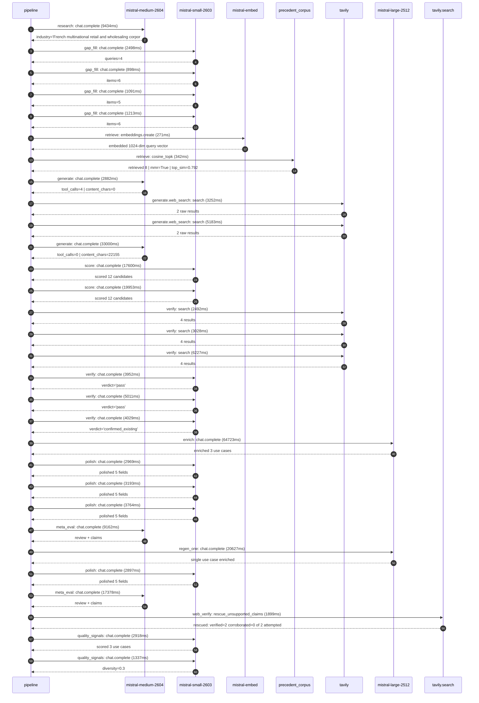

# Pipeline blueprint (architecture)

Static view of the pipeline regardless of run timing — shows agents,
models, and gates. The chronological execution log follows below.

```mermaid
flowchart TD
    Start([User: company name]) --> R
    R["<b>1. Research</b><br/>parallel: Wikipedia · Tavily news ·<br/>existing initiatives · live verification<br/><i>mistral-medium</i> synthesis"]
    R --> G["<b>1b. Gap-fill</b><br/>identify missing fields →<br/><i>mistral-small</i> generates queries →<br/>Tavily search per field →<br/><i>mistral-small</i> per-field extraction"]
    G --> Conf{Confidence ≥ 0.5<br/>OR verified<br/>OR ≥ 1 existing initiative?}
    Conf -->|no| Refuse([Refusal])
    Conf -->|yes| Ret
    Ret["<b>2. Retrieve</b><br/><i>mistral-embed</i> on company query →<br/>cosine top-K + industry/depth filter +<br/>MMR diversification"]
    Ret --> Gen["<b>3. Generate 12 candidates</b><br/><i>mistral-medium</i> with web_search tool<br/>(Tavily + deep-read) — fact citations<br/>flow into the EvidenceLedger"]
    Gen --> Score["<b>4. Score</b><br/>self-consistency: 2 parallel passes<br/><i>mistral-small</i> @ T=0.2 and T=0.4 →<br/>aggregate weighted scores"]
    Score --> Verify["<b>5. Per-candidate verify</b><br/>top-3: Tavily search + deep-read +<br/><i>mistral-small</i> verdict (pass /<br/>partial / confirmed_existing)"]
    Verify --> Enrich["<b>6. Enrich</b><br/><i>mistral-large</i> drafts customer-facing<br/>prose for 3 use cases (or<br/><i>mistral-medium</i> on fast tier)"]
    Enrich --> NumScrub["<b>6a. Numeric scrub</b><br/>flag any number not in cited content"]
    NumScrub --> Polish["<b>6b. Polish</b><br/><i>mistral-small</i> per use case (parallel):<br/>convert markers→qualitative,<br/>(ev-XXX)→[title](url)"]
    Polish --> Attr["<b>6c. Attribution check</b><br/><i>mistral-small</i> per use case (parallel):<br/>fix corpus-ID ↔ company mismatches"]
    Attr --> Meta["<b>7. Meta-evaluation</b><br/><i>mistral-medium</i> reviews report against<br/>cited precedents + ledger entries:<br/>strict claim verification"]
    Meta --> RegenQ{confidence < 0.6<br/>AND not fast tier?}
    RegenQ -->|yes| Regen["<b>7b. Targeted regen</b><br/><i>mistral-large</i> re-enriches just the<br/>weakest use case with the next-best<br/>near-miss; re-runs meta-eval"]
    RegenQ -->|no| QS
    Regen --> QS
    QS["<b>Quality signals</b><br/>LLM-graded diversity + specificity,<br/>fact-check pass rate, TTV/cost spread"]
    QS --> Render([Markdown report + trace])

    classDef agent fill:#fef3c7,stroke:#f59e0b
    classDef gate fill:#dbeafe,stroke:#3b82f6
    classDef io fill:#dcfce7,stroke:#16a34a
    class R,G,Ret,Gen,Score,Verify,Enrich,NumScrub,Polish,Attr,Meta,Regen,QS agent
    class Conf,RegenQ gate
    class Start,Refuse,Render io
```

## Execution trace — Carrefour

Started: `2026-05-09T11:06:00.004550+00:00`. Total wall time: `262.2s` across `30` recorded actions.

### Per-step time totals

| Step | Calls | Total time | Avg time |
|---|---:|---:|---:|
| `research` | 1 | 9.43s | 9434ms |
| `gap_fill` | 4 | 5.70s | 1425ms |
| `retrieve` | 2 | 0.61s | 307ms |
| `generate` | 2 | 35.88s | 17941ms |
| `generate.web_search` | 2 | 8.43s | 4217ms |
| `score` | 2 | 37.55s | 18776ms |
| `verify` | 6 | 24.74s | 4123ms |
| `enrich` | 1 | 64.72s | 64723ms |
| `polish` | 4 | 12.82s | 3206ms |
| `meta_eval` | 2 | 26.54s | 13270ms |
| `regen_one` | 1 | 20.63s | 20627ms |
| `web_verify` | 1 | 1.90s | 1899ms |
| `quality_signals` | 2 | 4.25s | 2127ms |

### Chronological event log

- `11:06:03.135` **[research]** `mistral-medium-2604.chat.complete` — 9434ms
   - inputs: synthesize CompanyContext for Carrefour | depth=medium
   - outputs: industry='French multinational retail and wholesaling corporation' verified=True conf=0.75
- `11:06:12.571` **[gap_fill]** `mistral-small-2603.chat.complete` — 2498ms
   - inputs: generate gap queries | fields=['business_model', 'products', 'data_assets', 'priorities']
   - outputs: queries=4
- `11:06:30.507` **[gap_fill]** `mistral-small-2603.chat.complete` — 898ms
   - inputs: layer-2 extract field=products
   - outputs: items=6
- `11:06:30.504` **[gap_fill]** `mistral-small-2603.chat.complete` — 1091ms
   - inputs: layer-2 extract field=data_assets
   - outputs: items=5
- `11:06:30.499` **[gap_fill]** `mistral-small-2603.chat.complete` — 1213ms
   - inputs: layer-2 extract field=priorities
   - outputs: items=6
- `11:06:31.712` **[retrieve]** `mistral-embed.embeddings.create` — 271ms
   - inputs: company_query | industries='French multinational retail and wholesaling corporation'
   - outputs: embedded 1024-dim query vector
- `11:06:31.984` **[retrieve]** `precedent_corpus.cosine_topk` — 342ms
   - inputs: k=8 min_depth=0.4 target='Carrefour'
   - outputs: retrieved 8 | mmr=True | top_sim=0.792
- `11:06:32.823` **[generate]** `mistral-medium-2604.chat.complete` — 2882ms
   - inputs: iteration=0 tool_calls_used=0/2 tools=on
   - outputs: tool_calls=4 | content_chars=0
- `11:06:35.717` **[generate.web_search]** `tavily.search` — 3252ms
   - inputs: query='Carrefour 2024 sustainability and food transition initiatives'
   - outputs: 2 raw results
- `11:06:51.092` **[generate.web_search]** `tavily.search` — 5183ms
   - inputs: query='Carrefour Concordis buying alliance details and scope'
   - outputs: 2 raw results
- `11:07:04.207` **[generate]** `mistral-medium-2604.chat.complete` — 33000ms
   - inputs: iteration=1 tool_calls_used=2/2 tools=off
   - outputs: tool_calls=0 | content_chars=22155
- `11:07:37.702` **[score]** `mistral-small-2603.chat.complete` — 17600ms
   - inputs: self-consistency pass T=0.2
   - outputs: scored 12 candidates
- `11:07:37.706` **[score]** `mistral-small-2603.chat.complete` — 19953ms
   - inputs: self-consistency pass T=0.4
   - outputs: scored 12 candidates
- `11:07:57.684` **[verify]** `tavily.search` — 2492ms
   - inputs: candidate=carrefour-supply-chain-demand-forecasting | query='Carrefour AI-enhanced demand forecasting for perishable good'
   - outputs: 4 results
- `11:07:57.684` **[verify]** `tavily.search` — 3028ms
   - inputs: candidate=carrefour-private-label-sustainability-audit | query='Carrefour AI-powered sustainability audit for private-label '
   - outputs: 4 results
- `11:07:57.683` **[verify]** `tavily.search` — 6227ms
   - inputs: candidate=carrefour-sustainability-product-scoring-agent | query='Carrefour AI agent for dynamic sustainability scoring of pri'
   - outputs: 4 results
- `11:08:01.903` **[verify]** `mistral-small-2603.chat.complete` — 3952ms
   - inputs: verdict for carrefour-private-label-sustainability-audit
   - outputs: verdict='pass'
- `11:08:05.472` **[verify]** `mistral-small-2603.chat.complete` — 5011ms
   - inputs: verdict for carrefour-sustainability-product-scoring-agent
   - outputs: verdict='pass'
- `11:08:13.103` **[verify]** `mistral-small-2603.chat.complete` — 4029ms
   - inputs: verdict for carrefour-supply-chain-demand-forecasting
   - outputs: verdict='confirmed_existing'
- `11:08:17.135` **[enrich]** `mistral-large-2512.chat.complete` — 64723ms
   - inputs: tier=standard top_3=['carrefour-sustainability-product-scoring-agent', 'carrefour-private-label-sustainability-audit', 'carrefour-iot-smart-shelf-anomaly-detection']
   - outputs: enriched 3 use cases
- `11:09:21.881` **[polish]** `mistral-small-2603.chat.complete` — 2969ms
   - inputs: use_case=carrefour-sustainability-product-scoring-agent unanchored=True opaque_ev=False
   - outputs: polished 5 fields
- `11:09:21.895` **[polish]** `mistral-small-2603.chat.complete` — 3193ms
   - inputs: use_case=carrefour-iot-smart-shelf-anomaly-detection unanchored=True opaque_ev=False
   - outputs: polished 5 fields
- `11:09:21.891` **[polish]** `mistral-small-2603.chat.complete` — 3764ms
   - inputs: use_case=carrefour-private-label-sustainability-audit unanchored=True opaque_ev=False
   - outputs: polished 5 fields
- `11:09:25.658` **[meta_eval]** `mistral-medium-2604.chat.complete` — 9162ms
   - inputs: reviewing 3 use cases
   - outputs: review + claims
- `11:09:34.821` **[regen_one]** `mistral-large-2512.chat.complete` — 20627ms
   - inputs: replace weakest=carrefour-private-label-sustainability-audit with carrefour-supply-chain-demand-forecasting
   - outputs: single use case enriched
- `11:09:55.456` **[polish]** `mistral-small-2603.chat.complete` — 2897ms
   - inputs: use_case=carrefour-supply-chain-demand-forecasting unanchored=False opaque_ev=True
   - outputs: polished 5 fields
- `11:09:58.355` **[meta_eval]** `mistral-medium-2604.chat.complete` — 17378ms
   - inputs: reviewing 3 use cases
   - outputs: review + claims
- `11:10:15.755` **[web_verify]** `tavily.search.rescue_unsupported_claims` — 1899ms
   - inputs: company='Carrefour' unsupported=2 budget=12
   - outputs: rescued: verified=2 corroborated=0 of 2 attempted
- `11:10:17.996` **[quality_signals]** `mistral-small-2603.chat.complete` — 2918ms
   - inputs: specificity grade (3 use cases)
   - outputs: scored 3 use cases
- `11:10:20.914` **[quality_signals]** `mistral-small-2603.chat.complete` — 1337ms
   - inputs: diversity grade
   - outputs: diversity=0.3

## Mermaid sequence diagram (execution)

