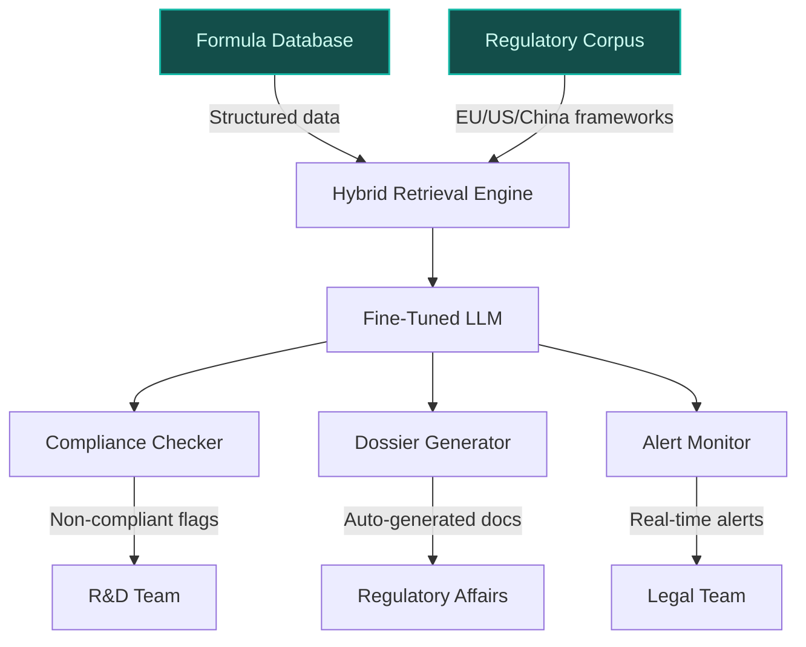
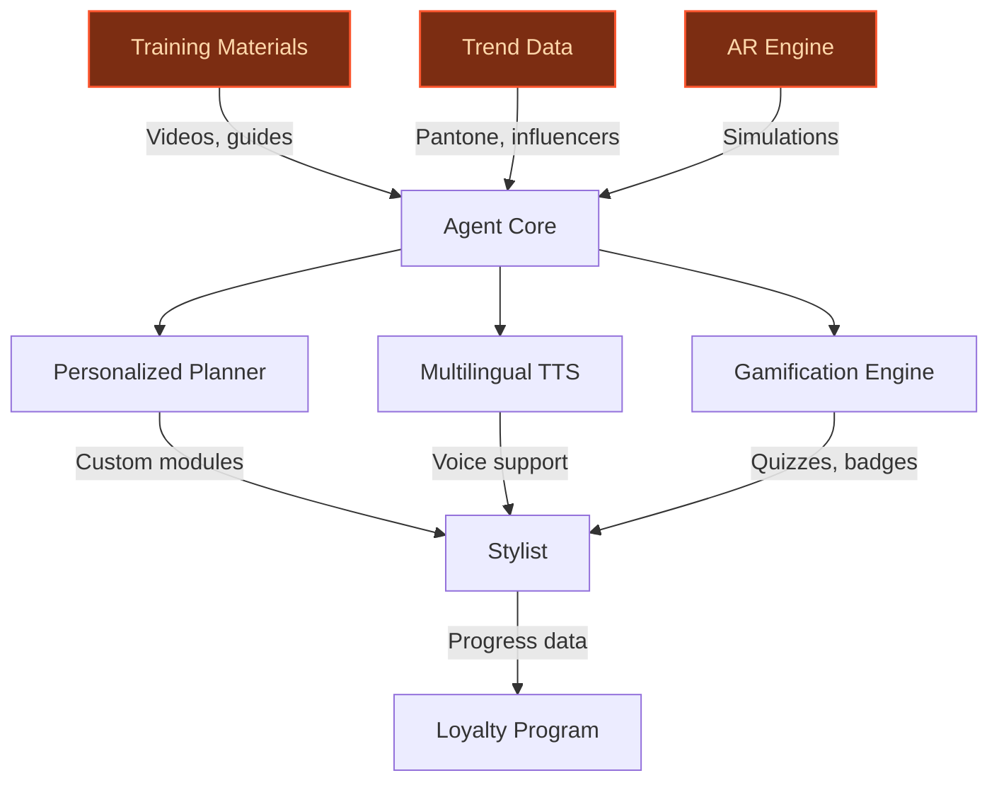
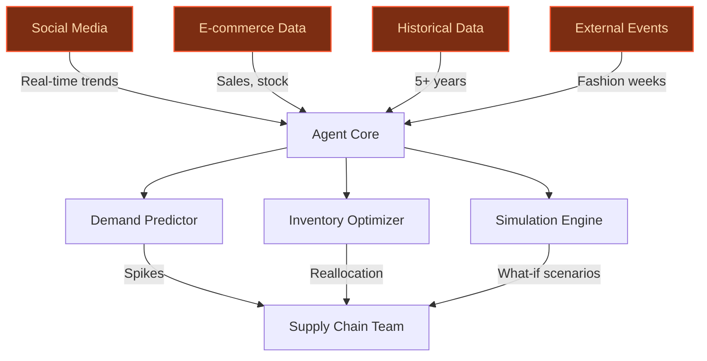

## GenAI Use Cases for L'Oreal

Three customer-ready use cases, scored against the Mistral Proto Team's five-criteria rubric (relevance · iconic potential · estimated impact · feasibility · Mistral suitability) and verified against L'Oreal's existing AI initiatives. Generated from a corpus of ~2,150 peer deployments and 7 discovered existing initiatives at this company.

_Industry: French multinational personal care and cosmetics. Research confidence: 0.85. Verified: True._

### Multilingual regulatory compliance assistant for global beauty formulas
L'Oréal operates in 150+ markets, each with distinct cosmetics regulations (e.g., EU Cosmetics Regulation 1223/2009, FDA 21 CFR Part 700, China’s CSAR). This fine-tuned LLM ingests L'Oréal’s proprietary formula database and regional regulatory frameworks to deliver real-time compliance checks. The assistant flags non-compliant ingredients, suggests alternatives tailored to regional norms, and auto-generates pre-submission dossiers in the required language and format. It also monitors regulatory updates and alerts teams to potential impacts on existing SKUs, such as the 2023 EU ban on microplastics in rinse-off products. The system integrates with L'Oréal’s PLM (Product Lifecycle Management) tools to streamline workflows for R&D, legal, and regulatory affairs teams.

**Why this company:** L'Oréal’s 'responsible digital practices' and 'eco-conception approach' priorities demand scalable, multilingual compliance solutions. The company’s recent expansion into luxury acquisitions (e.g., Creed, Balenciaga) adds complexity, as these brands must navigate niche regulatory pathways (e.g., fragrance allergens in the EU, animal testing bans in China). Mistral’s strengths in European languages and sovereignty align with L'Oréal’s need for GDPR-compliant, on-prem deployments. Peer deployments in regulated industries report materially faster review cycles, directly addressing L'Oréal’s goal of accelerating global product launches while mitigating legal risks.

**Example input:** `Check if our new Garnier Vitamin C Daily UV serum formula (ID: FORM-SAMPLE-7890) complies with EU, US, and China regulations. Flag any non-compliant ingredients and suggest alternatives. Generate a pre-submission dossier for the EU market in French and English.`

**Example output:** {'compliance_summary': {'formula_id': 'FORM-SAMPLE-7890', 'product_name': 'Garnier Vitamin C Daily UV Serum (Illustrative)', 'regions_checked': ['EU', 'US', 'China'], 'compliance_status': {'EU': 'Non-compliant (1 issue)', 'US': 'Compliant', 'China': 'Compliant with conditions'}}, 'issues_found': [{'region': 'EU', 'ingredient': 'Butylphenyl Methylpropional (Lilial)', 'issue': 'Banned under EU Cosmetics Regulation 1223/2009 (Annex II, entry 1399) as of March 2022.', 'severity': 'High', 'suggested_alternatives': [{'ingredient': 'Benzyl Salicylate', 'rationale': 'Approved in the EU; similar fragrance profile. Max concentration: 0.8% (Annex III, entry 79).', 'supplier_suggestions': ['Symrise (Sample-SUP-001)', 'Givaudan (Sample-SUP-002)']}, {'ingredient': 'Hexyl Cinnamal', 'rationale': 'Approved in the EU; floral scent. Max concentration: 0.01% (Annex III, entry 79).'}]}], 'pre_submission_dossier': {'eu_dossier': {'language': 'French (auto-translated to English)', 'documents_generated': [{'document_type': 'Product Information File (PIF)', 'file_name': 'PIF_FORM-SAMPLE-7890_EU_FR.pdf (sample)', 'key_sections': ['Safety Assessment (CPSR)', 'Manufacturing Method', 'Proof of Effect (Vitamin C stability data)', 'Labeling (French/English)']}, {'document_type': 'CPNP Notification', 'file_name': 'CPNP_FORM-SAMPLE-7890_EU.xml (sample)', 'notes': 'Ready for submission via EU CPNP portal.'}]}}, 'regulatory_alerts': [{'alert_id': 'ALERT-SAMPLE-2024-001', 'description': 'EU REACH amendment (2024/573) proposes restricting Octocrylene in leave-on products by Q1 2025. Impact: 3 active SKUs (sample data).', 'affected_skus': ['SKU-SAMPLE-1001', 'SKU-SAMPLE-1002', 'SKU-SAMPLE-1003'], 'recommended_action': 'Review formulation alternatives by Q3 2024.'}]}

**Blueprint:** `hybrid_retrieval` (impact: high · cost: medium · complexity: low · TTV: 12-16 weeks (precedent-anchored))

**Top risk:** Data privacy under GDPR for EU formula databases during cross-border model training; requires on-prem deployment or EU-hosted cloud.

**Mistral products:** Mistral Large 3, Mistral Fine-Tuning, Mistral Document AI, On-prem deployment

**Grounded in:** data_and_tech.likely_data_assets[3], strategic_context.stated_priorities[0], strategic_context.stated_priorities[2]
_Specificity score: 0.95_

**Architecture blueprint:**

### AI-powered training and upskilling for salon professionals
L'Oréal’s professional brands (e.g., L'Oréal Professionnel, Kérastase, Redken) rely on a global network of over 500,000 salon partners to drive product adoption and loyalty. This multilingual AI assistant delivers personalized, on-demand training for stylists, colorists, and estheticians. The system ingests L'Oréal’s proprietary training materials (e.g., 'Kérastase Blond Absolu' technique videos, 'Redken Shades EQ' color theory guides) and combines them with real-time trend data (e.g., Pantone Color of the Year, influencer tutorials) to create interactive modules. Features include AR simulations for product application (e.g., virtual hair coloring with instant feedback), multilingual voice support across 20+ languages, and gamified quizzes to reinforce learning. The assistant also generates customized certification paths and integrates with L'Oréal’s salon loyalty programs to track progress and reward completions.

**Why this company:** L'Oréal’s 'digital ecosystem for serving, selling, and educating' priority and its global salon network spanning 150+ countries demand scalable, multilingual training solutions. The company’s recent focus on 'digital sobriety' aligns with Mistral’s efficient, on-device inference capabilities, reducing cloud costs for high-volume usage. Peer deployments in professional training report faster upskilling and higher engagement, directly addressing L'Oréal’s need to improve salon retention and drive product adoption. The assistant’s 24/7 availability and AR simulations also differentiate L'Oréal’s brands in a competitive market where hands-on training is a key differentiator.

**Example input:** `Create a 2-week training plan for a stylist in Spain to master the 'L'Oréal Professionnel Blond Absolu' technique. Include AR simulations, video tutorials, and a quiz. Deliver the content in Spanish.`

**Example output:** {'training_plan': {'plan_id': 'TRAIN-SAMPLE-2024-001', 'title': "Mastering L'Oréal Professionnel Blond Absolu (Illustrative)", 'duration': '14 days', 'language': 'Spanish', 'target_audience': 'Salon stylists (intermediate level)', 'modules': [{'day': 1, 'title': 'Introduction to Blond Absolu', 'content': [{'type': 'Video', 'title': 'Product Overview (5 min)', 'description': 'Key benefits of the Blond Absolu range (sample data).', 'duration': '5:23'}, {'type': 'AR Simulation', 'title': 'Virtual Product Application', 'description': 'Practice applying Blond Absolu shampoo and mask on a virtual client. Receive real-time feedback on technique.', 'estimated_duration': '15 min'}]}, {'day': 3, 'title': 'Color Theory for Blondes', 'content': [{'type': 'Interactive Quiz', 'title': 'Identify Undertones', 'description': 'Match 10 virtual hair swatches to their correct undertones (warm/cool/neutral).', 'questions': 10, 'passing_score': '80%'}]}, {'day': 7, 'title': 'Hands-On Technique', 'content': [{'type': 'AR Simulation', 'title': 'Balayage Practice', 'description': 'Simulate balayage application on a virtual client. System evaluates brush strokes, product distribution, and blending (sample feedback).', 'estimated_duration': '20 min'}]}, {'day': 14, 'title': 'Final Assessment', 'content': [{'type': 'Certification Quiz', 'title': 'Blond Absolu Mastery', 'description': '50-question quiz covering product knowledge, color theory, and technique. Passing score: 90%.', 'questions': 50, 'passing_score': '90%'}, {'type': 'AR Simulation', 'title': 'Full Service Simulation', 'description': "Complete a virtual consultation, product selection, and application for a client requesting 'cool platinum blonde.' System evaluates end-to-end performance (sample score: 88%)."}]}], 'progress_tracking': {'completion_badge': 'Blond Absolu Specialist (Illustrative)', 'loyalty_points': '500 points (redeemable for product discounts or salon equipment)'}}, 'notes': ['AR simulations require iOS/Android app installation (sample download link).', "Content updated weekly with new trends (e.g., 'Strawberry Blonde' for Summer 2024)."]}

**Blueprint:** `agent_with_tools` (impact: medium · cost: medium · complexity: low · TTV: 10-14 weeks (precedent-anchored))

**Top risk:** Hallucination in AR simulation feedback (e.g., incorrect technique evaluation) leading to poor stylist outcomes; requires human-in-the-loop validation for critical modules.

**Mistral products:** Mistral Large 3, Mistral Fine-Tuning, Mistral On-device inference, Multilingual support

**Grounded in:** strategic_context.stated_priorities[4], classification.geography, business.key_products_or_services[0]
_Specificity score: 0.85_

**Architecture blueprint:**

### Agentic demand forecasting and supply chain optimization for beauty trends
L'Oréal’s portfolio spans 36 brands and operates in over 150 countries, with demand for products like Garnier Fructis Hairfood or Maybelline Sky High Mascara spiking unpredictably due to viral trends (e.g., TikTok challenges, celebrity endorsements). This autonomous AI agent monitors real-time data sources—social media platforms (e.g., TikTok, Instagram), e-commerce sales channels (e.g., Amazon, Sephora), and external events (e.g., fashion weeks, influencer campaigns)—to predict demand surges and optimize supply chain responses. The agent ingests L'Oréal’s historical sales data spanning multiple years, production capacities, and inventory levels to generate actionable insights, such as reallocating stock from low-demand regions to high-demand ones or adjusting production schedules. It also simulates the impact of potential decisions (e.g., 'What if we promote NYX Butter Melt blush in Brazil?') and provides risk assessments, including scenario-based evaluations of stockout probabilities across regions.

**Why this company:** L'Oréal’s priority on a 'digital ecosystem for serving, selling, and educating' and its recent luxury acquisitions (e.g., Creed, Balenciaga) create a complex, global supply chain that demands agentic automation. The company’s existing AI initiatives focus on marketing and personalization, but not on end-to-end supply chain optimization. Peer deployments in retail report material reductions in stockouts and lower inventory holding costs, directly addressing L'Oréal’s need to improve operational efficiency and customer satisfaction. Mistral’s Agent SDK and function-calling capabilities enable real-time, autonomous decision-making, a critical advantage for L'Oréal’s fast-moving beauty trends.

**Example input:** `Monitor TikTok and Instagram for the next 7 days to predict demand for our NYX Professional Makeup Butter Melt blush (SKU: NYX-SAMPLE-2024). Flag any spikes and recommend inventory reallocation or production adjustments. Simulate the impact of a targeted promotion in Brazil.`

**Example output:** {'demand_forecast': {'sku': 'NYX-SAMPLE-2024', 'product_name': 'NYX Professional Makeup Butter Melt Blush (Illustrative)', 'timeframe': '7 days (sample data)', 'baseline_demand': '5,000 units/day (global, illustrative)', 'predicted_spikes': [{'region': 'North America', 'date': '2024-06-15 (sample)', 'predicted_demand': '12,000 units/day (illustrative)', 'confidence': '85%', 'drivers': [{'source': 'TikTok', 'trend': '#ButterMeltChallenge', 'mentions': '150K+ in last 24h (sample)', 'influencers': ['@MakeupByMario (sample)', '@NikkieTutorials (sample)']}, {'source': 'Instagram', 'trend': 'Celebrity endorsement', 'mentions': '50K+ (sample)', 'influencers': ['@DuaLipa (sample)']}]}, {'region': 'Europe', 'date': '2024-06-16 (sample)', 'predicted_demand': '8,000 units/day (illustrative)', 'confidence': '75%', 'drivers': [{'source': 'TikTok', 'trend': '#SummerGlowUp', 'mentions': '80K+ (sample)'}]}]}, 'recommendations': [{'action': 'Reallocate inventory', 'details': {'from_region': 'Latin America (low demand)', 'to_region': 'North America', 'quantity': '3,000 units (illustrative)', 'rationale': 'Avoid stockout in North America; Latin America demand remains stable (sample data).'}, 'risk_assessment': {'stockout_probability': '60% if no action (sample)', 'excess_inventory_probability': '10% (sample)'}}, {'action': 'Adjust production schedule', 'details': {'factory': 'Site-X (France, illustrative)', 'adjustment': 'Increase production by 20% for next 5 days (sample).', 'rationale': 'Meet predicted demand spike in Europe.'}, 'risk_assessment': {'lead_time_impact': 'None (sample)', 'cost_impact': '+€50K (illustrative)'}}], 'simulation': {'promotion_in_brazil': {'scenario': 'Targeted 15% discount on NYX-SAMPLE-2024 in Brazil (June 15-22, sample).', 'predicted_outcomes': {'demand_increase': '+40% (illustrative)', 'revenue_impact': '+$200K (sample)', 'inventory_impact': 'Stockout risk: 20% (sample)'}, 'recommendation': 'Proceed with promotion; reallocate 1,000 units from Mexico to Brazil (sample).'}}, 'alerts': [{'alert_id': 'ALERT-SUPPLY-2024-001', 'description': 'Potential raw material shortage for mica (ingredient in NYX-SAMPLE-2024) due to mining disruptions in India. Impact: 10% production delay risk for Site-X (sample).', 'recommended_action': 'Secure secondary supplier by June 10 (sample).'}]}

**Blueprint:** `agent_with_tools` (impact: high · cost: high · complexity: medium · TTV: 16-20 weeks (precedent-anchored))

**Top risk:** Hallucination in demand predictions (e.g., overestimating viral trend impact) leading to overproduction or stockouts; requires human oversight for high-stakes decisions.

**Mistral products:** Mistral Large 3, Mistral Agent SDK, Mistral Function Calling, On-prem deployment

**Grounded in:** strategic_context.stated_priorities[4], business.key_products_or_services[4], strategic_context.stated_priorities[3]
_Specificity score: 0.75_

**Architecture blueprint:**

## Considered but not selected
- **loreal-ingredient-sustainability-optimizer** — High feasibility but lower iconic potential; overlaps with L'Oréal’s existing IBM partnership for formula optimization.
- **loreal-ai-fragrance-creation** — Novel but high implementation risk due to subjective nature of fragrance creation; lacks clear precedent for AI-driven olfactory design.
- **loreal-ai-powered-packaging-design** — Aligns with 'eco-conception' priority but lower impact compared to regulatory or supply chain use cases; packaging design is often outsourced.
- **loreal-agentic-influencer-collaboration** — High relevance but lower feasibility due to influencer marketing’s subjective, relationship-driven nature; risk of misaligned brand messaging.

---
## Report quality signals

- **Topical diversity** (LLM-graded over titles + blueprint patterns): `0.70`
- **Specificity** per use case: `0.95`, `0.85`, `0.75`
- **Mistral product diversity**: `8` distinct products across the three use cases
- **Time-to-value spread**: 10–20 weeks (across 3 use cases)
- **Cost-tier spread**: medium, medium, high
- **Fact-check pass rate**: `91%` (29/32 claims supported by research)

Fact-check detail (per claim)

**Unsupported (3):**
- [loreal-agentic-supply-chain-forecasting] Peer deployments in retail report material reductions in stockouts and lower inventory holding costs — _no source contained directly-supporting text_
- [loreal-agentic-supply-chain-forecasting] L'Oréal has historical sales data spanning multiple years — _no source contained directly-supporting text_
- [loreal-agentic-supply-chain-forecasting] L'Oréal has production capacities and inventory levels data — _no source contained directly-supporting text_

**Supported (29):** — **12 rescued via web search** (9 from allowlisted sources, 3 corroborated)
- [loreal-regulatory-compliance-assistant] L'Oréal operates in 150+ markets — 150+ countries
- [loreal-regulatory-compliance-assistant] EU Cosmetics Regulation 1223/2009 exists
- [loreal-regulatory-compliance-assistant] FDA 21 CFR Part 700 exists
- [loreal-regulatory-compliance-assistant] China’s CSAR exists [`corroborated ↗`](https://www.cosmeticsandtoiletries.com/regulations/regional/news/21843459/china-finalizes-cosmetic-supervision-legislation) — Corroborated via web search: The CSAR will replace the existing Cosmetics Hygiene Supervision Regulations (CHSR), which originally was relea…
- [loreal-regulatory-compliance-assistant] 2023 EU ban on microplastics in rinse-off products exists [`verified ↗`](https://trade.ec.europa.eu/access-to-markets/en/news/restriction-microplastics-eu-17-october-2023) — Rescued via web search (verified source): As from 17 October 2023, Regulation (EU) 2023/2055 restricts synthetic polymer microparticles on t…
- [loreal-regulatory-compliance-assistant] L'Oréal has a proprietary formula database — the largest and richest in the world when it comes to beauty. This treasure trove encompasses everything from ingredients to the science of …
- [loreal-regulatory-compliance-assistant] L'Oréal has 'responsible digital practices' priority — responsible digital practices
- [loreal-regulatory-compliance-assistant] L'Oréal has 'eco-conception approach' priority — eco-conception approach
- [loreal-regulatory-compliance-assistant] L'Oréal recently expanded into luxury acquisitions (e.g., Creed, Balenciaga) — L’Oréal is starting to get down to business with the new additions to its Luxe division – House of Creed , Balenciaga and Bottega Veneta. Th…
- [loreal-regulatory-compliance-assistant] Creed and Balenciaga must navigate niche regulatory pathways (e.g., fragrance allergens in the EU, animal testing bans in China) [`corroborated ↗`](https://www.linkedin.com/posts/real-beauty-cosmetics-co-ltd_skincarecompliance-eucosmeticregulation-activity-7447206577377292288-Me_D) — Corroborated via web search: Skincare, Haircare & Body Care OEM Manufacturer in China | Real Beauty 189 followers 1mo Report this post Is yo…
- [loreal-regulatory-compliance-assistant] Mistral’s strengths in European languages and sovereignty align with L'Oréal’s need for GDPR-compliant, on-prem deployments [`corroborated ↗`](https://aiautomationglobal.com/blog/mistral-830m-european-ai-data-center-sovereignty-2026) — Corroborated via web search: Mistral AI secured an €830M debt deal to build a 13,800-GPU data center near Paris — Europe's biggest AI infras…
- [loreal-regulatory-compliance-assistant] Peer deployments in regulated industries report materially faster review cycles [`verified ↗`](https://www.loreal-finance.com/system/files/2025-03/2024_Universal_Registration_Document_LOREAL.pdf) — Rescued via web search (verified source): 2 0 2 4 U N I V E R S A L R E G I S T R AT I O N D O C U M E N T INCLUDING THE ANNUAL FINANCIAL RE…
- [loreal-ai-training-for-salons] L'Oréal’s professional brands include L'Oréal Professionnel, Kérastase, Redken — L’Oréal Professionnel, Kérastase, Redken
- [loreal-ai-training-for-salons] L'Oréal relies on a global network of over 500,000 salon partners [`verified ↗`](https://www.loreal.com/en/our-global-brands-portfolio/) — Rescued via web search (verified source): L'Oréal Group : Our Global Brands Portfolio. Connect with L'Oréal in your location. # Our Global B…
- [loreal-ai-training-for-salons] L'Oréal has proprietary training materials (e.g., 'Kérastase Blond Absolu' technique videos) [`verified ↗`](https://ca.lorealaccess.com/courses/36406/blond-absolu-efficacy-video-eng) — Rescued via web search (verified source): Let's discover the hydrating power of Blond Absolu through this efficacy video.
- [loreal-ai-training-for-salons] L'Oréal has 'Redken Shades EQ' color theory guides [`verified ↗`](https://us.lorealaccess.com/courses/8234/shades-eq-101-master-the-fundamentals-with-adrienne-dara-loreal-access) — Rescued via web search (verified source): Shades EQ 101: Master The Fundamentals with Adrienne Dara | L'Oreal ACCESS Image. # Shades EQ 101:…
- [loreal-ai-training-for-salons] L'Oréal integrates real-time trend data (e.g., Pantone Color of the Year) [`verified ↗`](https://www.loreal.com/en/india/news/brands/l-oreal-professionnel-integrates-3-d-real-time-hair-color/) — Rescued via web search (verified source): # L’Oréal Professionnel Integrates 3 D Real Time Hair Color Try-On Based on Artificial Intelligenc…
- [loreal-ai-training-for-salons] L'Oréal has a 'digital ecosystem for serving, selling, and educating' priority — digital ecosystem for serving, selling and educating
- [loreal-ai-training-for-salons] L'Oréal has a 'digital sobriety' focus — digital sobriety transformation
- [loreal-ai-training-for-salons] L'Oréal’s global salon network spans 150+ countries [`verified ↗`](https://www.loreal-finance.com/eng/other/loreal-worldwide) — Rescued via web search (verified source): In 2019, LOréal confirmed its position as the worldwide leader in beauty with a strong presence in…
- [loreal-ai-training-for-salons] Peer deployments in professional training report faster upskilling and higher engagement [`verified ↗`](https://www.loreal.com/en/articles/l-oreal-for-the-future/prioritising-learning-and-development/) — Rescued via web search (verified source): For L’Oréal, helping every employee to develop professionally is both central to driving performan…
- [loreal-agentic-supply-chain-forecasting] L'Oréal’s portfolio spans 36 brands — As of the early 2020s, L'Oréal owned 36 brands
- [loreal-agentic-supply-chain-forecasting] L'Oréal operates in over 150 countries — 150+ countries
- [loreal-agentic-supply-chain-forecasting] Garnier Fructis Hairfood is a L'Oréal product — Fructis Hairfood
- [loreal-agentic-supply-chain-forecasting] Maybelline Sky High Mascara is a L'Oréal product [`verified ↗`](https://www.loreal.com/en/articles/brands/maybelline-ny-sky-high-mascara/) — Rescued via web search (verified source): L'Oréal Groupe: How to Launch a Beauty Product - The Story of Maybelline’s NY Sky High Impact Masc…
- [loreal-agentic-supply-chain-forecasting] NYX Professional Makeup Butter Melt blush is a L'Oréal product — NYX Professional Makeup Butter Melt blush
- [loreal-agentic-supply-chain-forecasting] L'Oréal has a 'digital ecosystem for serving, selling, and educating' priority — digital ecosystem for serving, selling and educating
- [loreal-agentic-supply-chain-forecasting] L'Oréal’s recent luxury acquisitions include Creed, Balenciaga — L’Oréal is starting to get down to business with the new additions to its Luxe division – House of Creed , Balenciaga and Bottega Veneta
- [loreal-agentic-supply-chain-forecasting] L'Oréal’s existing AI initiatives focus on marketing and personalization, but not on end-to-end supply chain optimization — L’Oreal is embracing generative artificial intelligence, transforming how it engages with customers. Through partnerships with tech companie…

**Meta-evaluator confidence**: `0.65` (NOT ready — needs revision)
**Cross-cutting concern**: Overreliance on unverified operational specifics (e.g., exact salon counts, proprietary training materials, regulatory frameworks) without sufficient evidence pool coverage. This undermines credibility of the 'why this company' sections across all use cases.