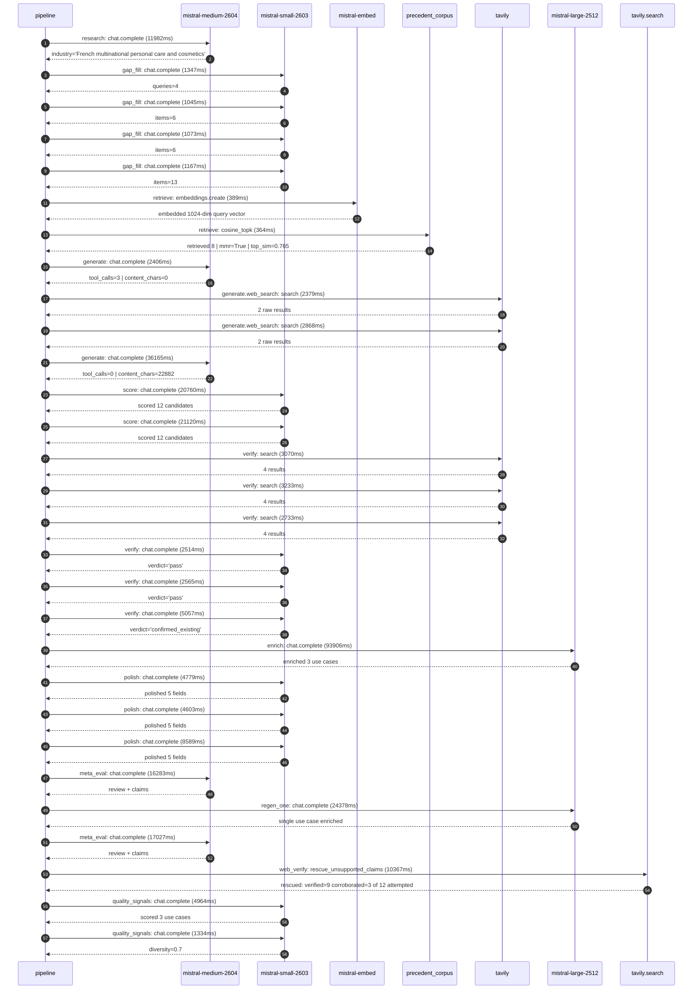

# Pipeline blueprint (architecture)

Static view of the pipeline regardless of run timing — shows agents,
models, and gates. The chronological execution log follows below.

```mermaid
flowchart TD
    Start([User: company name]) --> R
    R["<b>1. Research</b><br/>parallel: Wikipedia · Tavily news ·<br/>existing initiatives · live verification<br/><i>mistral-medium</i> synthesis"]
    R --> G["<b>1b. Gap-fill</b><br/>identify missing fields →<br/><i>mistral-small</i> generates queries →<br/>Tavily search per field →<br/><i>mistral-small</i> per-field extraction"]
    G --> Conf{Confidence ≥ 0.5<br/>OR verified<br/>OR ≥ 1 existing initiative?}
    Conf -->|no| Refuse([Refusal])
    Conf -->|yes| Ret
    Ret["<b>2. Retrieve</b><br/><i>mistral-embed</i> on company query →<br/>cosine top-K + industry/depth filter +<br/>MMR diversification"]
    Ret --> Gen["<b>3. Generate 12 candidates</b><br/><i>mistral-medium</i> with web_search tool<br/>(Tavily + deep-read) — fact citations<br/>flow into the EvidenceLedger"]
    Gen --> Score["<b>4. Score</b><br/>self-consistency: 2 parallel passes<br/><i>mistral-small</i> @ T=0.2 and T=0.4 →<br/>aggregate weighted scores"]
    Score --> Verify["<b>5. Per-candidate verify</b><br/>top-3: Tavily search + deep-read +<br/><i>mistral-small</i> verdict (pass /<br/>partial / confirmed_existing)"]
    Verify --> Enrich["<b>6. Enrich</b><br/><i>mistral-large</i> drafts customer-facing<br/>prose for 3 use cases (or<br/><i>mistral-medium</i> on fast tier)"]
    Enrich --> NumScrub["<b>6a. Numeric scrub</b><br/>flag any number not in cited content"]
    NumScrub --> Polish["<b>6b. Polish</b><br/><i>mistral-small</i> per use case (parallel):<br/>convert markers→qualitative,<br/>(ev-XXX)→[title](url)"]
    Polish --> Attr["<b>6c. Attribution check</b><br/><i>mistral-small</i> per use case (parallel):<br/>fix corpus-ID ↔ company mismatches"]
    Attr --> Meta["<b>7. Meta-evaluation</b><br/><i>mistral-medium</i> reviews report against<br/>cited precedents + ledger entries:<br/>strict claim verification"]
    Meta --> RegenQ{confidence < 0.6<br/>AND not fast tier?}
    RegenQ -->|yes| Regen["<b>7b. Targeted regen</b><br/><i>mistral-large</i> re-enriches just the<br/>weakest use case with the next-best<br/>near-miss; re-runs meta-eval"]
    RegenQ -->|no| QS
    Regen --> QS
    QS["<b>Quality signals</b><br/>LLM-graded diversity + specificity,<br/>fact-check pass rate, TTV/cost spread"]
    QS --> Render([Markdown report + trace])

    classDef agent fill:#fef3c7,stroke:#f59e0b
    classDef gate fill:#dbeafe,stroke:#3b82f6
    classDef io fill:#dcfce7,stroke:#16a34a
    class R,G,Ret,Gen,Score,Verify,Enrich,NumScrub,Polish,Attr,Meta,Regen,QS agent
    class Conf,RegenQ gate
    class Start,Refuse,Render io
```

## Execution trace — L'Oreal

Started: `2026-05-09T11:28:23.019482+00:00`. Total wall time: `292.6s` across `29` recorded actions.

### Per-step time totals

| Step | Calls | Total time | Avg time |
|---|---:|---:|---:|
| `research` | 1 | 11.98s | 11982ms |
| `gap_fill` | 4 | 4.63s | 1158ms |
| `retrieve` | 2 | 0.75s | 377ms |
| `generate` | 2 | 38.57s | 19286ms |
| `generate.web_search` | 2 | 5.25s | 2623ms |
| `score` | 2 | 41.88s | 20940ms |
| `verify` | 6 | 19.17s | 3195ms |
| `enrich` | 1 | 93.91s | 93906ms |
| `polish` | 3 | 17.97s | 5990ms |
| `meta_eval` | 2 | 33.31s | 16655ms |
| `regen_one` | 1 | 24.38s | 24378ms |
| `web_verify` | 1 | 10.37s | 10367ms |
| `quality_signals` | 2 | 6.30s | 3149ms |

### Chronological event log

- `11:28:28.800` **[research]** `mistral-medium-2604.chat.complete` — 11982ms
   - inputs: synthesize CompanyContext for L'Oreal | depth=medium
   - outputs: industry='French multinational personal care and cosmetics' verified=True conf=0.75
- `11:28:40.783` **[gap_fill]** `mistral-small-2603.chat.complete` — 1347ms
   - inputs: generate gap queries | fields=['business_model', 'products', 'data_assets', 'priorities']
   - outputs: queries=4
- `11:28:49.949` **[gap_fill]** `mistral-small-2603.chat.complete` — 1045ms
   - inputs: layer-2 extract field=priorities
   - outputs: items=6
- `11:28:49.953` **[gap_fill]** `mistral-small-2603.chat.complete` — 1073ms
   - inputs: layer-2 extract field=data_assets
   - outputs: items=6
- `11:28:49.960` **[gap_fill]** `mistral-small-2603.chat.complete` — 1167ms
   - inputs: layer-2 extract field=products
   - outputs: items=13
- `11:28:51.129` **[retrieve]** `mistral-embed.embeddings.create` — 389ms
   - inputs: company_query | industries='French multinational personal care and cosmetics'
   - outputs: embedded 1024-dim query vector
- `11:28:51.518` **[retrieve]** `precedent_corpus.cosine_topk` — 364ms
   - inputs: k=8 min_depth=0.4 target="L'Oreal"
   - outputs: retrieved 8 | mmr=True | top_sim=0.765
- `11:28:53.166` **[generate]** `mistral-medium-2604.chat.complete` — 2406ms
   - inputs: iteration=0 tool_calls_used=0/2 tools=on
   - outputs: tool_calls=3 | content_chars=0
- `11:28:55.590` **[generate.web_search]** `tavily.search` — 2379ms
   - inputs: query="L'Oréal 2024 sustainability goals digital sobriety eco-conception"
   - outputs: 2 raw results
- `11:29:00.186` **[generate.web_search]** `tavily.search` — 2868ms
   - inputs: query="L'Oréal 36 brands list 2024 acquisitions Creed Balenciaga Bottega Veneta"
   - outputs: 2 raw results
- `11:29:06.110` **[generate]** `mistral-medium-2604.chat.complete` — 36165ms
   - inputs: iteration=1 tool_calls_used=2/2 tools=off
   - outputs: tool_calls=0 | content_chars=22882
- `11:29:42.922` **[score]** `mistral-small-2603.chat.complete` — 20760ms
   - inputs: self-consistency pass T=0.2
   - outputs: scored 12 candidates
- `11:29:42.925` **[score]** `mistral-small-2603.chat.complete` — 21120ms
   - inputs: self-consistency pass T=0.4
   - outputs: scored 12 candidates
- `11:30:04.077` **[verify]** `tavily.search` — 3070ms
   - inputs: candidate=loreal-regulatory-compliance-assistant | query="L'Oreal Multilingual regulatory compliance assistant for glo"
   - outputs: 4 results
- `11:30:04.077` **[verify]** `tavily.search` — 3233ms
   - inputs: candidate=loreal-ingredient-sustainability-optimizer | query="L'Oreal AI-driven sustainable ingredient substitution and fo"
   - outputs: 4 results
- `11:30:04.077` **[verify]** `tavily.search` — 2733ms
   - inputs: candidate=loreal-ai-training-for-salons | query="L'Oreal AI-powered training and upskilling for salon profess"
   - outputs: 4 results
- `11:30:08.833` **[verify]** `mistral-small-2603.chat.complete` — 2514ms
   - inputs: verdict for loreal-ai-training-for-salons
   - outputs: verdict='pass'
- `11:30:09.021` **[verify]** `mistral-small-2603.chat.complete` — 2565ms
   - inputs: verdict for loreal-regulatory-compliance-assistant
   - outputs: verdict='pass'
- `11:30:09.904` **[verify]** `mistral-small-2603.chat.complete` — 5057ms
   - inputs: verdict for loreal-ingredient-sustainability-optimizer
   - outputs: verdict='confirmed_existing'
- `11:30:14.965` **[enrich]** `mistral-large-2512.chat.complete` — 93906ms
   - inputs: tier=standard top_3=['loreal-regulatory-compliance-assistant', 'loreal-ai-training-for-salons', 'loreal-agentic-supply-chain-forecasting']
   - outputs: enriched 3 use cases
- `11:31:48.896` **[polish]** `mistral-small-2603.chat.complete` — 4779ms
   - inputs: use_case=loreal-regulatory-compliance-assistant unanchored=True opaque_ev=False
   - outputs: polished 5 fields
- `11:31:48.901` **[polish]** `mistral-small-2603.chat.complete` — 4603ms
   - inputs: use_case=loreal-ai-training-for-salons unanchored=True opaque_ev=False
   - outputs: polished 5 fields
- `11:31:48.904` **[polish]** `mistral-small-2603.chat.complete` — 8589ms
   - inputs: use_case=loreal-agentic-supply-chain-forecasting unanchored=True opaque_ev=False
   - outputs: polished 5 fields
- `11:31:57.496` **[meta_eval]** `mistral-medium-2604.chat.complete` — 16283ms
   - inputs: reviewing 3 use cases
   - outputs: review + claims
- `11:32:13.781` **[regen_one]** `mistral-large-2512.chat.complete` — 24378ms
   - inputs: replace weakest=loreal-ai-training-for-salons with loreal-ingredient-sustainability-optimizer
   - outputs: single use case enriched
- `11:32:38.168` **[meta_eval]** `mistral-medium-2604.chat.complete` — 17027ms
   - inputs: reviewing 3 use cases
   - outputs: review + claims
- `11:32:55.217` **[web_verify]** `tavily.search.rescue_unsupported_claims` — 10367ms
   - inputs: company="L'Oreal" unsupported=12 budget=12
   - outputs: rescued: verified=9 corroborated=3 of 12 attempted
- `11:33:09.288` **[quality_signals]** `mistral-small-2603.chat.complete` — 4964ms
   - inputs: specificity grade (3 use cases)
   - outputs: scored 3 use cases
- `11:33:14.252` **[quality_signals]** `mistral-small-2603.chat.complete` — 1334ms
   - inputs: diversity grade
   - outputs: diversity=0.7

## Mermaid sequence diagram (execution)

