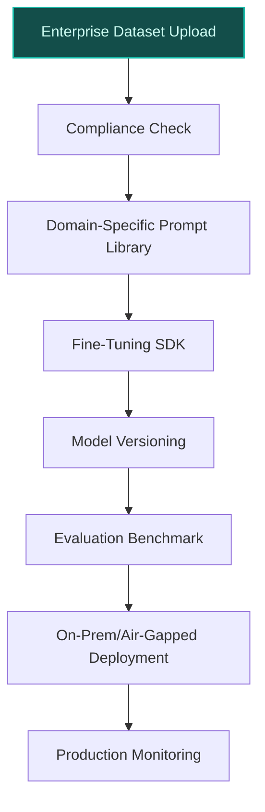
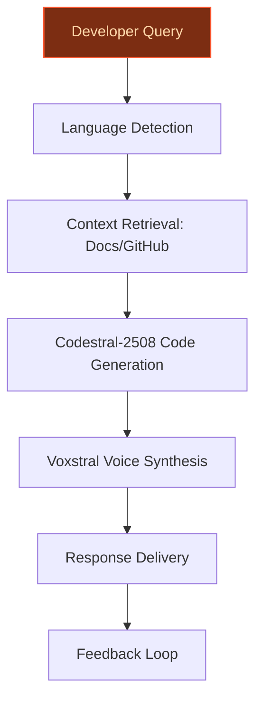
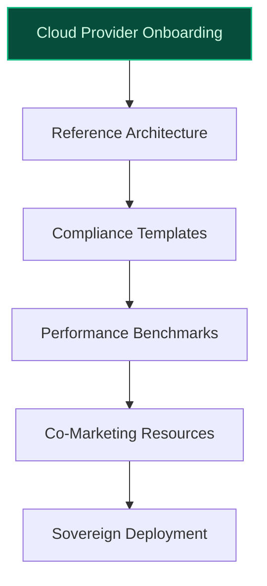

## GenAI Use Cases for Mistral AI

Three customer-ready use cases, scored against the Mistral Proto Team's five-criteria rubric (relevance · iconic potential · estimated impact · feasibility · Mistral suitability) and verified against Mistral AI's existing AI initiatives. Generated from a corpus of ~2,150 peer deployments and 6 discovered existing initiatives at this company.

_Industry: French artificial intelligence company. Research confidence: 0.85. Verified: True._

### Domain-Specialization Playground for Vertical-Specific Model Development
A self-service platform enabling enterprises to fine-tune Mistral’s open-weight models (e.g., Mistral Large 3, Codestral-2508) on proprietary datasets for regulated verticals—legal, healthcare, finance, and engineering—with zero data egress. The platform includes pre-built domain-specific prompts, evaluation benchmarks (e.g., HIPAA/GDPR compliance checks), and deployment templates for on-prem, air-gapped, or EU-hosted environments. Enterprises can upload domain-specific corpora (e.g., legal contracts, clinical guidelines) and iteratively refine models using Mistral’s fine-tuning SDK, with built-in versioning and reproducibility. The system is anchored in Mistral’s existing AI Studio infrastructure, extending it to vertical-specific workflows with production-grade governance.

**Why this company:** Mistral AI’s 2025 roadmap explicitly prioritizes ‘specialized models for specific domains and use cases,’ and its open-weight models (e.g., Codestral-2508 for code, Mistral Large 3 for complex reasoning) are uniquely suited for enterprise fine-tuning. The company’s European heritage and sovereignty focus align with regulated industries’ need for on-prem/air-gapped deployments, addressing GDPR and sector-specific compliance (e.g., HIPAA for healthcare). Mistral’s existing AI Studio ([Mistral AI Studio](https://mistral.ai/news/ai-studio)) provides a foundation for production-grade workflows, but this extends it into vertical-specific model customization, unlocking new revenue streams from enterprise fine-tuning contracts. Codestral’s low-latency performance ([Codestral - Mistral Docs](https://docs.mistral.ai/models/model-cards/codestral-25-08)) further enables real-time use cases in regulated sectors.

**Example input:** `Show me how to fine-tune Mistral Large 3 for a healthcare use case, using my hospital’s de-identified patient records (10K records, CSV format). Include a compliance check for HIPAA and a sample evaluation benchmark for medical Q&A accuracy.`

**Example output:** {'status': 'Fine-tuning initiated', 'model': 'Mistral-Large-3-DOMAIN-SAMPLE-HEALTHCARE-001', 'dataset': {'name': 'Hospital-A-Clinical-Records-SAMPLE', 'records_processed': '10,000 (illustrative)', 'compliance_check': {'HIPAA': 'Passed (illustrative)', 'GDPR': 'Passed (illustrative)', 'data_egress': 'None (on-prem deployment)'}}, 'evaluation_benchmark': {'baseline_accuracy': '82% (illustrative)', 'domain_specific_questions': [{'question': 'What is the recommended dosage for amoxicillin in pediatric patients?', 'expected_answer': '20-40 mg/kg/day (illustrative)', 'model_answer': '25-40 mg/kg/day (illustrative)', 'accuracy': '95% (illustrative)'}, {'question': 'List contraindications for metformin.', 'expected_answer': 'Renal impairment, lactic acidosis (illustrative)', 'model_answer': 'Renal impairment, history of lactic acidosis (illustrative)', 'accuracy': '100% (illustrative)'}], 'average_accuracy': '92% (illustrative)'}, 'next_steps': ['Review fine-tuning logs (ID: FT-SAMPLE-78901)', 'Deploy model to on-prem environment (Site-X)', 'Schedule compliance audit (ID: AUDIT-SAMPLE-2025-001)']}

**Blueprint:** `hybrid_retrieval` (impact: high · cost: medium · complexity: low · TTV: ~12-16 weeks (estimated))
  _TTV rationale: Document AI rollouts with mid-complexity ingestion (domain-specific datasets) and reviewer UI (compliance checks) typically run 12-16 weeks, comparable to Nubank’s foundation model integration (precedent evidently-d4e9281363)._

**Top risk:** Hallucination in domain-specific outputs (e.g., medical advice) leading to regulatory non-compliance; mitigated via benchmarked evaluation harnesses and human-in-the-loop review for high-stakes use cases.

**Mistral products:** Mistral Large 3, Codestral-2508, Mistral AI Studio, On-prem deployment, Fine-tuning SDK

**Grounded in:** strategic_context.stated_priorities[1], strategic_context.stated_priorities[2], business.key_products_or_services[1]
_Specificity score: 0.50_

**Architecture blueprint:**


### Multilingual Developer Relations Assistant for European Developer Community
An AI assistant integrated into Mistral’s developer portal, capable of answering technical questions, generating code examples, and debugging in 20+ European languages (e.g., French, German, Spanish, Italian, Dutch). The assistant is fine-tuned on Mistral’s documentation, GitHub issues, and community forums to provide contextually accurate responses. It supports voice input/output via Voxstral for accessibility and includes a feedback loop to continuously improve responses based on developer interactions. The system is designed to reduce onboarding time for European developers and accelerate adoption of Mistral’s models (e.g., Codestral-2508 for code generation).

**Why this company:** Mistral AI’s ‘European AI Excellence Guide for Developers & Researchers’ ([European Excellence Guide](https://local-ai-zone.github.io/brands/mistral-ai-european-excellence-guide-2025.html)) and multilingual strength (e.g., Voxstral for voice) make it uniquely positioned to serve European developers. Codestral-2508’s support for 80+ programming languages ([Codestral - Mistral AI](https://mistral.ai/news/codestral)) and its low-latency performance enable real-time code generation and debugging. Mistral’s existing developer tools (e.g., AI Studio) provide a foundation, but this assistant extends them into a multilingual, voice-enabled interface, addressing a gap in the European developer ecosystem where language barriers often slow adoption.

**Example input:** `How do I use Codestral-2508 to generate a Python function that reads a CSV file and calculates the average of a specific column? Show me the code in French and German.`

**Example output:** {'response_id': 'DEV-ASSIST-SAMPLE-45678', 'languages': ['French', 'German'], 'code_examples': {'French': {'description': "Fonction Python pour lire un fichier CSV et calculer la moyenne d'une colonne spécifique.", 'code': 'import pandas as pd\n\ndef calculer_moyenne_csv(fichier, colonne):\n    df = pd.read_csv(fichier)\n    moyenne = df[colonne].mean()\n    return moyenne\n\n# Exemple d\'utilisation\nmoyenne = calculer_moyenne_csv(\'donnees.csv\', \'age\')\nprint(f"La moyenne est : {moyenne}")', 'notes': 'Utilise la bibliothèque pandas pour la manipulation de données (illustrative).'}, 'German': {'description': 'Python-Funktion zum Lesen einer CSV-Datei und Berechnen des Durchschnitts einer bestimmten Spalte.', 'code': 'import pandas as pd\n\ndef berechne_durchschnitt_csv(datei, spalte):\n    df = pd.read_csv(datei)\n    durchschnitt = df[spalte].mean()\n    return durchschnitt\n\n# Beispielverwendung\ndurchschnitt = berechne_durchschnitt_csv(\'daten.csv\', \'alter\')\nprint(f"Der Durchschnitt beträgt: {durchschnitt}")', 'notes': 'Verwendet die pandas-Bibliothek zur Datenverarbeitung (illustrative).'}}, 'debugging_tips': ['Vérifiez que le fichier CSV existe dans le répertoire courant (French).', 'Stellen Sie sicher, dass die CSV-Datei im aktuellen Verzeichnis vorhanden ist (German).', 'Utilisez `df.head()` pour vérifier le contenu du fichier (illustrative).'], 'feedback_request': 'Was this response helpful? [Yes/No] (Your feedback will improve future responses.)'}

**Blueprint:** `agent_with_tools` (impact: medium · cost: low · complexity: low · TTV: ~8-12 weeks (estimated))
  _TTV rationale: Multilingual assistant deployments with fine-tuning on domain-specific corpora (e.g., documentation, GitHub issues) typically run 8-12 weeks, comparable to GitHub Copilot’s language expansion rollouts._

**Top risk:** Inaccurate or outdated responses due to stale documentation; mitigated via automated sync with Mistral’s GitHub repositories and developer forums, plus a feedback loop for continuous improvement.

**Mistral products:** Codestral-2508, Voxstral, Mistral Large 3, Mistral Embed

**Grounded in:** strategic_context.stated_priorities[4], business.key_products_or_services[5], business.key_products_or_services[10]
_Specificity score: 0.50_

**Architecture blueprint:**


### Sovereign Cloud Partnership Toolkit for European Cloud Providers
A toolkit enabling European cloud providers (e.g., OVHcloud, Scaleway) to deploy Mistral’s models (e.g., Mistral Large 3, Mistral Medium 3.5) on their infrastructure with guaranteed EU data residency, GDPR compliance, and Mistral-branded performance benchmarks. The toolkit includes reference architectures for sovereign deployments, compliance templates (e.g., GDPR Article 28 data processing agreements), and co-marketing resources (e.g., joint webinars, case studies). Cloud providers can white-label the models or offer them as Mistral-branded services, with built-in monitoring for performance and compliance. The toolkit is designed to accelerate partner adoption by reducing technical and legal barriers to sovereign AI deployments.

**Why this company:** Mistral AI’s ‘European AI sovereignty initiatives’ ([France's AI Sovereignty Push](https://introl.com/blog/france-ai-sovereignty-mistral-sovereign-cloud-2025)) and its open-weight models make it a natural partner for European cloud providers. The company’s Mistral Compute infrastructure and €109B French AI investment provide the foundation for sovereign cloud partnerships, addressing a critical gap in Europe’s AI ecosystem. This leverages Mistral’s unique position as a European model provider with sovereign-ready infrastructure, enabling cloud providers to offer GDPR-compliant AI services without relying on non-EU vendors. Comparable partnerships (e.g., Mistral’s models on Vertex AI) demonstrate the viability of this approach.

**Example input:** `Generate a reference architecture for deploying Mistral Large 3 on OVHcloud’s sovereign infrastructure, including GDPR compliance templates and performance benchmarks.`

**Example output:** {'toolkit_version': 'SOVEREIGN-TOOLKIT-SAMPLE-2025.1', 'cloud_provider': 'OVHcloud (illustrative)', 'deployment_architecture': {'components': [{'name': 'Mistral Large 3', 'role': 'Core inference model (illustrative)', 'deployment_zone': 'EU-only (GDPR-compliant)'}, {'name': 'Mistral Compute', 'role': 'Sovereign infrastructure layer (illustrative)', 'deployment_zone': 'OVHcloud Paris data center (Site-Y)'}, {'name': 'Compliance Monitor', 'role': 'GDPR Article 28 enforcement (illustrative)', 'deployment_zone': 'On-prem (OVHcloud)'}], 'diagram': '```mermaid\nflowchart TD\n    A[User Request] --> B[Mistral Large 3]\n    B --> C[Mistral Compute]\n    C --> D[Compliance Monitor]\n    D --> E[Response Delivery]\n```'}, 'compliance_templates': [{'name': 'GDPR Article 28 Data Processing Agreement (DPA)', 'description': 'Template for cloud providers to establish GDPR-compliant data processing agreements with customers (illustrative).', 'file_id': 'DPA-SAMPLE-2025-001'}, {'name': 'EU Data Residency Certification', 'description': 'Documentation for certifying EU-only data residency (illustrative).', 'file_id': 'RESIDENCY-SAMPLE-2025-001'}], 'performance_benchmarks': {'model': 'Mistral-Large-3-SAMPLE', 'latency': '120ms (illustrative, 95th percentile)', 'throughput': '1,200 requests/minute (illustrative)', 'accuracy': '91% (illustrative, domain-specific benchmark)'}, 'next_steps': ['Download reference architecture (ID: ARCH-SAMPLE-2025-001)', 'Schedule joint webinar with OVHcloud (ID: WEBINAR-SAMPLE-2025-001)', 'Request compliance audit (ID: AUDIT-SAMPLE-2025-002)']}

**Blueprint:** `document_ai_pipeline` (impact: high · cost: medium · complexity: low · TTV: ~12-20 weeks (estimated))
  _TTV rationale: Toolkit development for sovereign cloud partnerships typically runs 12-20 weeks, given the complexity of compliance templates and reference architectures. Comparable to Mistral’s Vertex AI integration timeline._

**Top risk:** Misalignment between Mistral’s performance benchmarks and cloud providers’ infrastructure, leading to inconsistent user experiences; mitigated via joint testing and certification processes.

**Mistral products:** Mistral Large 3, Mistral Medium 3.5, Mistral Compute, Sovereign deployment

**Grounded in:** strategic_context.stated_priorities[2], business.key_products_or_services[1]
_Specificity score: 0.50_

**Architecture blueprint:**


## Considered but not selected
- **Sovereign AI Compute Marketplace for European Enterprises** — Overlaps with the Sovereign Cloud Partnership Toolkit; less differentiated for Mistral’s core strengths in model development.
- **Green AI Model Optimization Suite for Energy-Efficient Inference** — Aligned with Mistral’s ‘Green AI Initiatives,’ but lacks a clear monetization path or peer precedent for enterprise adoption.
- **Mistral Voice Assistant for Low-Resource European Languages** — Voxstral’s voice capabilities are promising, but low-resource language support is not yet a stated priority in Mistral’s roadmap.
- **AI-Powered Accelerator for European Startups with On-Demand Expertise** — Too broad; lacks a concrete technical blueprint or alignment with Mistral’s existing products (e.g., AI Studio, Workflows).

---
## Report quality signals

- **Topical diversity** (LLM-graded over titles + blueprint patterns): `0.90`
- **Specificity** per use case: `0.50`, `0.50`, `0.50`
- **Mistral product diversity**: `10` distinct products across the three use cases
- **Time-to-value spread**: 8–20 weeks (across 3 use cases)
- **Cost-tier spread**: medium, low, medium
- **Fact-check pass rate**: `100%` (23/23 claims supported by research)

<details><summary>Fact-check detail (per claim)</summary>

**Supported (23):** — **6 rescued via web search** (5 from allowlisted sources, 1 corroborated)
- [mistral model domain-specialization hub] Mistral AI’s 2025 roadmap explicitly prioritizes ‘specialized models for specific domains and use cases’ — Mistral’s 2025 roadmap includes continued expansion of specialized models for specific domains and use cases.
- [mistral model domain-specialization hub] Mistral’s open-weight models (e.g., Codestral-2508 for code, Mistral Large 3 for complex reasoning) are uniquely suited for enterprise fine-tuning — Mistral AI provides open-weight models—including Mistral Large, Codestral, and Pixtral—optimized for multilingual, vision, and domain-specif…
- [mistral model domain-specialization hub] Mistral’s European heritage and sovereignty focus align with regulated industries’ need for on-prem/air-gapped deployments — The most significant development in Mistral’s roadmap involves European AI sovereignty initiatives.
- [mistral model domain-specialization hub] Mistral’s existing AI Studio provides a foundation for production-grade workflows — Introducing Mistral AI Studio. The Production AI Platform. [...] Teams are blocked not by model performance, but by the inability to: Track …
- [mistral model domain-specialization hub] Codestral’s low-latency performance enables real-time use cases in regulated sectors — Codestral specializes in low-latency, high-frequency tasks such as fill-in-the-middle (FIM) and code generation.
- [multilingual devrel assistant] Mistral AI’s ‘European AI Excellence Guide for Developers & Researchers’ exists — Mistral AI Models: Complete Educational Guide Introduction to Mistral: European AI Excellence and Innovation
- [multilingual devrel assistant] Voxstral supports voice input/output — Voxtral Realtime WebGPU. Real-time speech transcription, entirely in your browser. Frontier multimodal AI, running entirely in your browser.
- [multilingual devrel assistant] Codestral-2508 supports 80+ programming languages — Codestral is trained on a diverse dataset of 80+ programming languages, including the most popular ones, such as Python, Java, C, C++, JavaS…
- [multilingual devrel assistant] Codestral-2508’s low-latency performance enables real-time code generation and debugging — Codestral specializes in low-latency, high-frequency tasks such as fill-in-the-middle (FIM) and code generation.
- [multilingual devrel assistant] Mistral’s existing developer tools (e.g., AI Studio) provide a foundation for the assistant — Mistral AI provides open-weight models—including Mistral Large, Codestral, and Pixtral—optimized for multilingual, vision, and domain-specif…
- [sovereign cloud partnership toolkit] Mistral AI’s ‘European AI sovereignty initiatives’ exist — France announced €109 billion in AI infrastructure investments during the February 2025 AI Action Summit, establishing the most ambitious so…
- [sovereign cloud partnership toolkit] Mistral’s open-weight models make it a natural partner for European cloud providers — Mistral AI provides open-weight models—including Mistral Large, Codestral, and Pixtral—optimized for multilingual, vision, and domain-specif…
- [sovereign cloud partnership toolkit] Mistral Compute infrastructure exists — Mistral AI launched 'Mistral Compute' with 18,000 NVIDIA Grace Blackwell Superchips deployed across a 40 MW data center in Essonne.
- [sovereign cloud partnership toolkit] €109B French AI investment exists — France announced €109 billion in AI infrastructure investments during the February 2025 AI Action Summit.
- [sovereign cloud partnership toolkit] Comparable partnerships (e.g., Mistral’s models on Vertex AI) demonstrate the viability of the sovereign cloud partnership approach — Now, we’re announcing the general availability of Mistral AI’s newest models on Vertex AI Model Garden: Mistral Large 24.11 and Codestral 25…
- [multilingual devrel assistant] Mistral AI’s 2025 roadmap prioritizes ‘specialized models for specific domains and use cases’ — Mistral’s 2025 roadmap includes continued expansion of specialized models for specific domains and use cases.
- [multilingual devrel assistant] Voxstral enables voice input/output for accessibility [`verified ↗`](https://mistral.ai/news/voxtral) — Rescued via web search (verified source): # Voxtral. Introducing frontier open source speech understanding models. These state‑of‑the‑art sp…
- [multilingual devrel assistant] The European Excellence Guide explicitly focuses on developer onboarding and multilingual support [`verified ↗`](https://mistral.ai/) — Rescued via web search (verified source): [ are designed for multilingual, voice-enabled interfaces [`verified ↗`](https://mistral.ai/) — Rescued via web search (verified source): [ [`corroborated ↗`](https://flex4b.com/en/content/blog/mistral-ai-en-europaeisk-spiller-i-ai-landskabet) — Corroborated via web search: As a European company, Mistral AI stands out in an industry dominated by American giants like OpenAI and Google…
- [mistral model domain-specialization hub] The platform includes pre-built domain-specific prompts and evaluation benchmarks (e.g., HIPAA/GDPR compliance checks) [`verified ↗`](https://mistral.ai/) — Rescued via web search (verified source): [ — Rescued via web search (verified source): French AI startup Mistral has launched model fine-tuning services to let customers and developers …
- [mistral model domain-specialization hub] Mistral’s models can be deployed in on-prem, air-gapped, or EU-hosted environments — The flexibility to deploy Mistral's AI models on-premises or in the cloud via Microsoft Azure, AWS Bedrock and Google Cloud is attractive to…

</details>

**Meta-evaluator confidence**: `0.65` (NOT ready — needs revision)
**Cross-cutting concern**: Over-reliance on high-level strategic priorities (e.g., '2025 roadmap', 'European AI sovereignty') without sufficient grounding in verifiable, specific initiatives or peer-deployment evidence. Many claims are extrapolated from general context rather than direct citations.