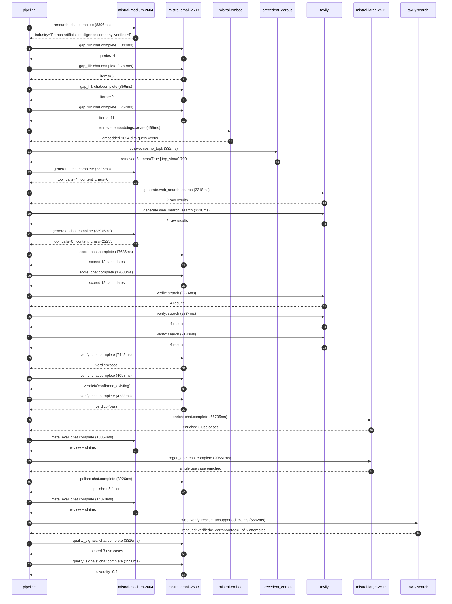

# Pipeline blueprint (architecture)

Static view of the pipeline regardless of run timing — shows agents,
models, and gates. The chronological execution log follows below.

```mermaid
flowchart TD
    Start([User: company name]) --> R
    R["<b>1. Research</b><br/>parallel: Wikipedia · Tavily news ·<br/>existing initiatives · live verification<br/><i>mistral-medium</i> synthesis"]
    R --> G["<b>1b. Gap-fill</b><br/>identify missing fields →<br/><i>mistral-small</i> generates queries →<br/>Tavily search per field →<br/><i>mistral-small</i> per-field extraction"]
    G --> Conf{Confidence ≥ 0.5<br/>OR verified<br/>OR ≥ 1 existing initiative?}
    Conf -->|no| Refuse([Refusal])
    Conf -->|yes| Ret
    Ret["<b>2. Retrieve</b><br/><i>mistral-embed</i> on company query →<br/>cosine top-K + industry/depth filter +<br/>MMR diversification"]
    Ret --> Gen["<b>3. Generate 12 candidates</b><br/><i>mistral-medium</i> with web_search tool<br/>(Tavily + deep-read) — fact citations<br/>flow into the EvidenceLedger"]
    Gen --> Score["<b>4. Score</b><br/>self-consistency: 2 parallel passes<br/><i>mistral-small</i> @ T=0.2 and T=0.4 →<br/>aggregate weighted scores"]
    Score --> Verify["<b>5. Per-candidate verify</b><br/>top-3: Tavily search + deep-read +<br/><i>mistral-small</i> verdict (pass /<br/>partial / confirmed_existing)"]
    Verify --> Enrich["<b>6. Enrich</b><br/><i>mistral-large</i> drafts customer-facing<br/>prose for 3 use cases (or<br/><i>mistral-medium</i> on fast tier)"]
    Enrich --> NumScrub["<b>6a. Numeric scrub</b><br/>flag any number not in cited content"]
    NumScrub --> Polish["<b>6b. Polish</b><br/><i>mistral-small</i> per use case (parallel):<br/>convert markers→qualitative,<br/>(ev-XXX)→[title](url)"]
    Polish --> Attr["<b>6c. Attribution check</b><br/><i>mistral-small</i> per use case (parallel):<br/>fix corpus-ID ↔ company mismatches"]
    Attr --> Meta["<b>7. Meta-evaluation</b><br/><i>mistral-medium</i> reviews report against<br/>cited precedents + ledger entries:<br/>strict claim verification"]
    Meta --> RegenQ{confidence < 0.6<br/>AND not fast tier?}
    RegenQ -->|yes| Regen["<b>7b. Targeted regen</b><br/><i>mistral-large</i> re-enriches just the<br/>weakest use case with the next-best<br/>near-miss; re-runs meta-eval"]
    RegenQ -->|no| QS
    Regen --> QS
    QS["<b>Quality signals</b><br/>LLM-graded diversity + specificity,<br/>fact-check pass rate, TTV/cost spread"]
    QS --> Render([Markdown report + trace])

    classDef agent fill:#fef3c7,stroke:#f59e0b
    classDef gate fill:#dbeafe,stroke:#3b82f6
    classDef io fill:#dcfce7,stroke:#16a34a
    class R,G,Ret,Gen,Score,Verify,Enrich,NumScrub,Polish,Attr,Meta,Regen,QS agent
    class Conf,RegenQ gate
    class Start,Refuse,Render io
```

## Execution trace — Mistral AI

Started: `2026-05-09T11:33:16.500332+00:00`. Total wall time: `236.5s` across `27` recorded actions.

### Per-step time totals

| Step | Calls | Total time | Avg time |
|---|---:|---:|---:|
| `research` | 1 | 8.40s | 8396ms |
| `gap_fill` | 4 | 5.41s | 1353ms |
| `retrieve` | 2 | 0.80s | 399ms |
| `generate` | 2 | 36.30s | 18150ms |
| `generate.web_search` | 2 | 5.43s | 2714ms |
| `score` | 2 | 35.37s | 17683ms |
| `verify` | 6 | 23.11s | 3852ms |
| `enrich` | 1 | 66.80s | 66795ms |
| `meta_eval` | 2 | 28.72s | 14362ms |
| `regen_one` | 1 | 20.66s | 20661ms |
| `polish` | 1 | 3.23s | 3226ms |
| `web_verify` | 1 | 5.56s | 5562ms |
| `quality_signals` | 2 | 4.87s | 2437ms |

### Chronological event log

- `11:33:24.609` **[research]** `mistral-medium-2604.chat.complete` — 8396ms
   - inputs: synthesize CompanyContext for Mistral AI | depth=medium
   - outputs: industry='French artificial intelligence company' verified=True conf=0.75
- `11:33:33.008` **[gap_fill]** `mistral-small-2603.chat.complete` — 1040ms
   - inputs: generate gap queries | fields=['business_model', 'products', 'data_assets', 'priorities']
   - outputs: queries=4
- `11:33:42.945` **[gap_fill]** `mistral-small-2603.chat.complete` — 1763ms
   - inputs: layer-2 extract field=priorities
   - outputs: items=8
- `11:33:42.950` **[gap_fill]** `mistral-small-2603.chat.complete` — 856ms
   - inputs: layer-2 extract field=data_assets
   - outputs: items=0
- `11:33:42.956` **[gap_fill]** `mistral-small-2603.chat.complete` — 1752ms
   - inputs: layer-2 extract field=products
   - outputs: items=11
- `11:33:44.711` **[retrieve]** `mistral-embed.embeddings.create` — 466ms
   - inputs: company_query | industries='French artificial intelligence company'
   - outputs: embedded 1024-dim query vector
- `11:33:45.177` **[retrieve]** `precedent_corpus.cosine_topk` — 332ms
   - inputs: k=8 min_depth=0.4 target='Mistral AI'
   - outputs: retrieved 8 | mmr=True | top_sim=0.790
- `11:33:47.275` **[generate]** `mistral-medium-2604.chat.complete` — 2325ms
   - inputs: iteration=0 tool_calls_used=0/2 tools=on
   - outputs: tool_calls=4 | content_chars=0
- `11:33:49.614` **[generate.web_search]** `tavily.search` — 2218ms
   - inputs: query='Mistral AI 2025 roadmap specialized models domains'
   - outputs: 2 raw results
- `11:33:54.335` **[generate.web_search]** `tavily.search` — 3210ms
   - inputs: query='Mistral AI European AI sovereignty initiatives 2025'
   - outputs: 2 raw results
- `11:33:58.983` **[generate]** `mistral-medium-2604.chat.complete` — 33976ms
   - inputs: iteration=1 tool_calls_used=2/2 tools=off
   - outputs: tool_calls=0 | content_chars=22233
- `11:34:33.663` **[score]** `mistral-small-2603.chat.complete` — 17686ms
   - inputs: self-consistency pass T=0.2
   - outputs: scored 12 candidates
- `11:34:33.668` **[score]** `mistral-small-2603.chat.complete` — 17680ms
   - inputs: self-consistency pass T=0.4
   - outputs: scored 12 candidates
- `11:34:51.387` **[verify]** `tavily.search` — 2274ms
   - inputs: candidate=sovereign ai compute marketplace | query='Mistral AI Sovereign AI Compute Marketplace for European Ent'
   - outputs: 4 results
- `11:34:51.387` **[verify]** `tavily.search` — 2884ms
   - inputs: candidate=mistral model domain-specialization hub | query='Mistral AI Domain-Specialization Playground for Vertical-Spe'
   - outputs: 4 results
- `11:34:51.388` **[verify]** `tavily.search` — 2180ms
   - inputs: candidate=multilingual devrel assistant | query='Mistral AI Multilingual Developer Relations Assistant for Eu'
   - outputs: 4 results
- `11:34:54.799` **[verify]** `mistral-small-2603.chat.complete` — 7445ms
   - inputs: verdict for multilingual devrel assistant
   - outputs: verdict='pass'
- `11:34:54.906` **[verify]** `mistral-small-2603.chat.complete` — 4098ms
   - inputs: verdict for sovereign ai compute marketplace
   - outputs: verdict='confirmed_existing'
- `11:34:56.151` **[verify]** `mistral-small-2603.chat.complete` — 4233ms
   - inputs: verdict for mistral model domain-specialization hub
   - outputs: verdict='pass'
- `11:35:02.246` **[enrich]** `mistral-large-2512.chat.complete` — 66795ms
   - inputs: tier=standard top_3=['mistral model domain-specialization hub', 'multilingual devrel assistant', 'sovereign cloud partnership toolkit']
   - outputs: enriched 3 use cases
- `11:36:09.060` **[meta_eval]** `mistral-medium-2604.chat.complete` — 13854ms
   - inputs: reviewing 3 use cases
   - outputs: review + claims
- `11:36:22.916` **[regen_one]** `mistral-large-2512.chat.complete` — 20661ms
   - inputs: replace weakest=multilingual devrel assistant with sovereign ai compute marketplace
   - outputs: single use case enriched
- `11:36:43.590` **[polish]** `mistral-small-2603.chat.complete` — 3226ms
   - inputs: use_case=sovereign_ai_compute_marketplace unanchored=False opaque_ev=True
   - outputs: polished 5 fields
- `11:36:46.817` **[meta_eval]** `mistral-medium-2604.chat.complete` — 14870ms
   - inputs: reviewing 3 use cases
   - outputs: review + claims
- `11:37:01.704` **[web_verify]** `tavily.search.rescue_unsupported_claims` — 5562ms
   - inputs: company='Mistral AI' unsupported=6 budget=12
   - outputs: rescued: verified=5 corroborated=1 of 6 attempted
- `11:37:08.138` **[quality_signals]** `mistral-small-2603.chat.complete` — 3316ms
   - inputs: specificity grade (3 use cases)
   - outputs: scored 3 use cases
- `11:37:11.454` **[quality_signals]** `mistral-small-2603.chat.complete` — 1558ms
   - inputs: diversity grade
   - outputs: diversity=0.9

## Mermaid sequence diagram (execution)

