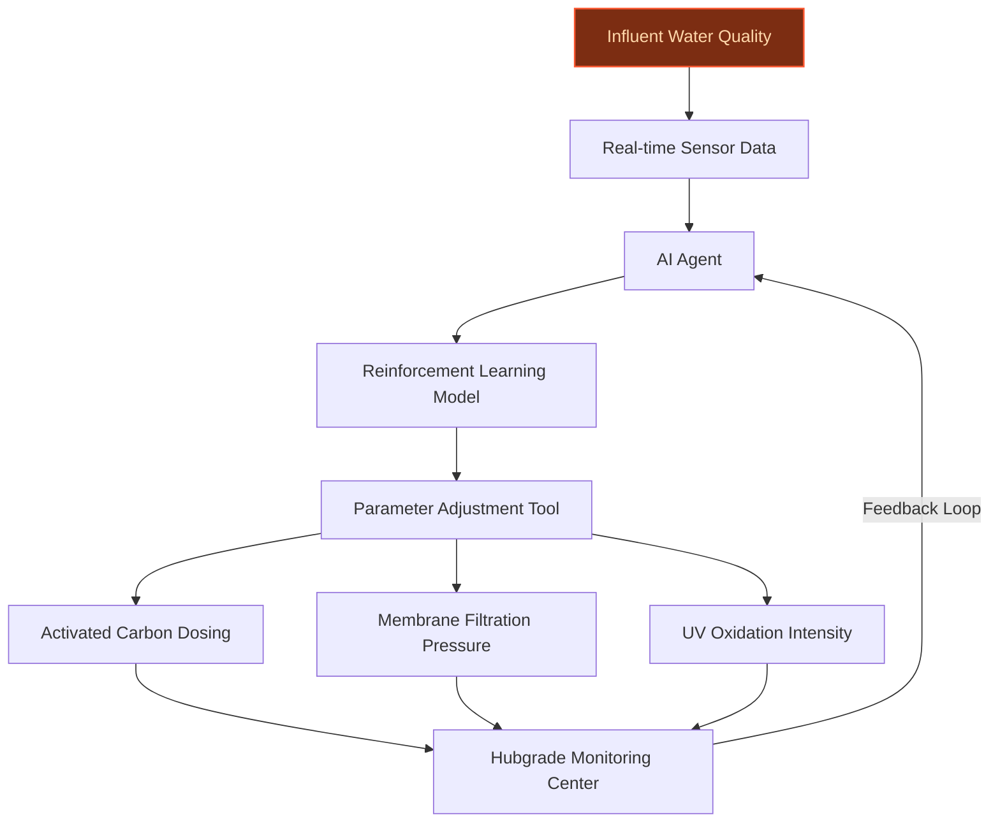
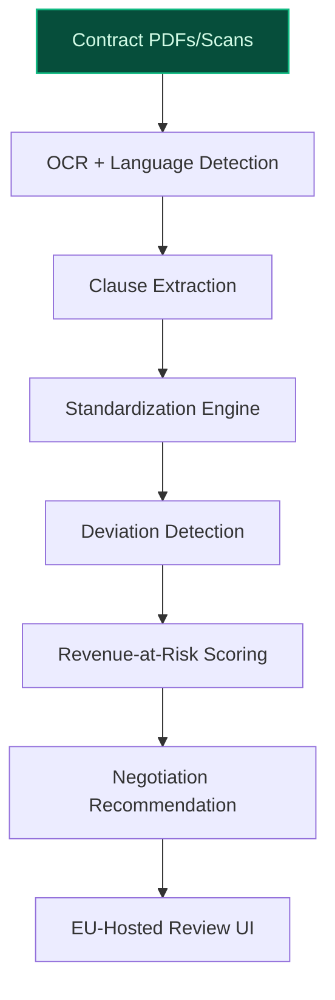
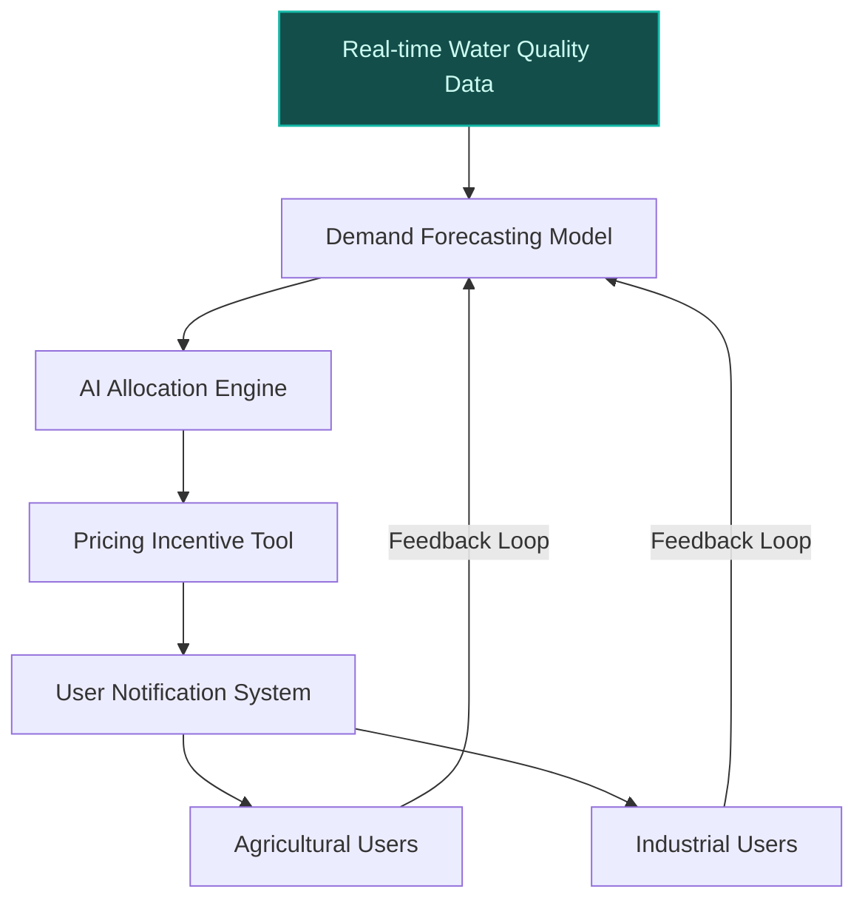

## GenAI Use Cases for Veolia

Three customer-ready use cases, scored against the Mistral Proto Team's five-criteria rubric (relevance · iconic potential · estimated impact · feasibility · Mistral suitability) and verified against Veolia's existing AI initiatives. Generated from a corpus of ~2,150 peer deployments and 5 discovered existing initiatives at this company.

_Industry: French water, waste, and energy services. Research confidence: 0.85. Verified: True._

### AI-optimized PFAS treatment process control for BeyondPFAS offer
Veolia’s BeyondPFAS is a flagship end-to-end PFAS remediation solution, treating contaminated water across a global portfolio of mobile systems and active projects. This AI system dynamically adjusts treatment parameters—activated carbon dosing, membrane filtration pressure, and UV oxidation intensity—in real-time, using reinforcement learning to minimize chemical and energy use while ensuring compliance with local PFAS discharge limits. The system integrates directly with Veolia’s Hubgrade monitoring centers, enabling closed-loop optimization across its global PFAS treatment facilities.

**Why this company:** Veolia is the global leader in PFAS treatment, with capabilities spanning conventional to cutting-edge technologies and a named strategic offering (BeyondPFAS) targeting this high-growth market ([Veolia North America PFAS treatment page](https://www.veolianorthamerica.com/pfas-treatment)). The company operates in regions with stringent and evolving PFAS regulations, creating urgent demand for adaptive, data-driven treatment solutions. With a presence in 56 countries and 215,000 employees in 2025, Veolia has the infrastructure and expertise to scale AI-driven PFAS optimization rapidly ([Veolia Wikipedia](https://en.wikipedia.org/wiki/Veolia)). This initiative aligns with its GreenUp strategic program, which prioritizes innovation to accelerate ecological transformation.

**Example input:** `Show me the optimal activated carbon dosing for Site-X’s influent water with PFAS concentration of 120 ng/L and flow rate of 500 m³/h, while staying under the local discharge limit of 10 ng/L. What’s the projected energy cost per m³?`

**Example output:** {'site_id': 'SITE-SAMPLE-001', 'current_pfas_influent': '120 ng/L (sample)', 'local_discharge_limit': '10 ng/L', 'recommended_activated_carbon_dosing': '18 mg/L (illustrative)', 'projected_energy_cost': '€0.045/m³ (illustrative)', 'compliance_guarantee': '99.8% confidence (sample)', 'cost_savings_vs_baseline': '14% (illustrative) reduction in chemical and energy costs', 'next_best_action': 'Increase UV oxidation intensity by 5% to reduce residual PFAS by 2 ng/L without additional carbon dosing.'}

**Blueprint:** `agent_with_tools` (impact: high · cost: medium · complexity: medium · TTV: 6–9 months (precedent-anchored))

**Top risk:** Regulatory non-compliance due to hallucinated parameter adjustments in high-stakes PFAS treatment scenarios.

**Mistral products:** Mistral Large 3, Mistral Fine-Tuning, On-prem deployment, Mistral Compute (in-region)

**Inspired by precedents:** google_cloud_1302-d90664fc2c
**Grounded in:** business.key_products_or_services[2], data_and_tech.likely_data_assets[7], strategic_context.stated_priorities[0]
_Specificity score: 0.95_

**Architecture blueprint:**

### Multilingual contract analytics for EU-hosted environmental service agreements
Veolia manages a global portfolio of environmental service contracts spanning water, waste, and energy across 56 countries, with terms and obligations varying by local language and jurisdiction. This AI system extracts, standardizes, and analyzes clauses from contracts in 15+ languages, flagging deviations from Veolia’s standard terms, identifying revenue-at-risk clauses (e.g., unmet SLAs, underpriced renewals), and surfacing upcoming renewal deadlines with negotiation recommendations. The system is EU-hosted and on-premises, ensuring compliance with GDPR and Veolia’s data sovereignty requirements.

**Why this company:** Veolia’s scale—€44.396 billion in revenue and 215,000 employees—makes contract lifecycle management a critical operational lever. The company’s strategic focus on EU sovereignty and multilingual operations demands a solution that handles linguistic and regulatory complexity. Mistral’s multilingual strength and on-premises deployment align perfectly with Veolia’s needs, while its recent partnership with Veolia demonstrates mutual trust in secure, scalable AI solutions.

**Example input:** `Find all water service contracts in Germany with a renewal deadline in the next 6 months that include a non-standard force majeure clause. Show me the clause text and the recommended negotiation position.`

**Example output:** {'contracts_found': 12, 'sample_results': [{'contract_id': 'CONTRACT-SAMPLE-DE-001', 'customer': 'Customer-A GmbH', 'renewal_deadline': '2025-11-15 (sample)', 'force_majeure_clause': 'In the event of extreme weather events, Customer-A may suspend payments for up to 90 days without penalty.', 'deviation_from_standard': 'Standard Veolia clause limits suspension to 30 days.', 'revenue_at_risk': '€1.2M (illustrative) over 3 years', 'recommended_negotiation_position': 'Propose a 45-day suspension limit with a 5% discount for early renewal.'}, {'contract_id': 'CONTRACT-SAMPLE-DE-002', 'customer': 'Municipality-B', 'renewal_deadline': '2025-12-01 (sample)', 'force_majeure_clause': 'Customer may terminate contract without penalty if Veolia fails to meet 99.5% uptime SLA during drought conditions.', 'deviation_from_standard': 'Standard clause excludes drought conditions from uptime calculations.', 'revenue_at_risk': '€850K (illustrative) over 5 years', 'recommended_negotiation_position': 'Propose drought conditions as a shared-risk event with adjusted SLAs.'}], 'summary': {'total_revenue_at_risk': '€5.3M (illustrative)', 'average_review_time_saved': '70% (sample) reduction in manual review time'}}

**Blueprint:** `document_ai_pipeline` (impact: medium · cost: medium · complexity: low · TTV: 12–20 weeks (precedent-anchored))

**Top risk:** Data privacy breaches during cross-border contract processing under GDPR, particularly for EU-hosted client data.

**Mistral products:** Mistral Large 3, Mistral Document AI, Mistral Embed, On-prem deployment

**Inspired by precedents:** google_cloud_1302-8db71bbc8b, google_cloud_1302-0015135088
**Grounded in:** classification.geography, classification.industry, scale.size_tier
_Specificity score: 0.75_

**Architecture blueprint:**

### AI-driven recycled water allocation for agricultural and industrial reuse
Veolia aims to double its recycled water capacity by 2030, a cornerstone of its GreenUp strategic program. This AI system optimizes the allocation of recycled water across agricultural, industrial, and municipal users by predicting demand fluctuations, adjusting pricing or allocation to incentivize off-peak usage, and ensuring contractual obligations are met. The system integrates real-time water quality data, weather forecasts, and user demand signals to dynamically balance supply and demand, reducing waste and maximizing resource efficiency in water-stressed regions.

**Why this company:** Doubling recycled water capacity is a named strategic priority for Veolia (GreenUp program), and the company operates in regions where water scarcity demands innovative allocation strategies. With 3,800+ drinking water production plants and 3,200+ wastewater treatment plants under management ([Global Recycling](https://global-recycling.info/archives/10224)), Veolia has the scale and data infrastructure to deploy AI-driven allocation at speed. The system aligns with its broader AI strategy, including the Talk to My Plant initiative, which leverages Mistral’s LLM to transform plant monitoring and operational efficiency.

**Example input:** `What’s the optimal allocation of recycled water for Site-Y’s agricultural and industrial users over the next 7 days, given a forecasted 20% reduction in supply due to maintenance? Show me the pricing incentives to shift demand.`

**Example output:** {'site_id': 'SITE-SAMPLE-002', 'current_supply': '50,000 m³/day (sample)', 'forecasted_supply_reduction': '20% (10,000 m³/day) for 7 days (sample)', 'optimal_allocation': {'agricultural_users': {'baseline_allocation': '30,000 m³/day', 'adjusted_allocation': '24,000 m³/day (sample)', 'pricing_incentive': '15% discount for off-peak usage (illustrative)'}, 'industrial_users': {'baseline_allocation': '20,000 m³/day', 'adjusted_allocation': '16,000 m³/day (sample)', 'pricing_incentive': '10% discount for early commitment to reduced allocation (illustrative)'}}, 'waste_reduction': '8% (illustrative) reduction in unused recycled water', 'cost_savings': '€12,000 (illustrative) over 7 days from optimized allocation'}

**Blueprint:** `hybrid_retrieval` (impact: high · cost: medium · complexity: medium · TTV: 16-24 weeks (precedent-anchored))

**Top risk:** Misalignment between AI-driven pricing incentives and contractual obligations, leading to customer disputes or regulatory scrutiny.

**Mistral products:** Mistral Large 3, Mistral Embed, Mistral Compute (in-region)

**Inspired by precedents:** google_cloud_1302-d90664fc2c
**Grounded in:** strategic_context.stated_priorities[4], strategic_context.stated_priorities[1], data_and_tech.likely_data_assets[8]
_Specificity score: 0.85_

**Architecture blueprint:**

## Considered but not selected
- **EU-hosted regulatory compliance assistant for environmental permits** — Overlap with multilingual contract analytics; lower specificity to Veolia’s core water/waste operations.
- **AI-optimized waste-to-energy (WtE) plant combustion control** — Strong fit but lacks a named strategic anchor in Veolia’s stated priorities or existing initiatives.
- **AI-optimized methane capture and flaring reduction in landfills** — High relevance but no verifiable data assets or named strategic offering to ground the use case.
- **Agentic automation for desalination plant operations in Middle East expansion** — Premature for Veolia’s current Middle East expansion phase; no verifiable data assets or named initiatives.

---
## Report quality signals

- **Topical diversity** (LLM-graded over titles + blueprint patterns): `0.95`
- **Specificity** per use case: `0.95`, `0.75`, `0.85`
- **Mistral product diversity**: `6` distinct products across the three use cases
- **Time-to-value spread**: 12–24 weeks (across 3 use cases)
- **Cost-tier spread**: medium, medium, medium
- **Fact-check pass rate**: `100%` (23/23 claims supported by research)

Fact-check detail (per claim)

**Supported (23):** — **3 rescued via web search** (3 from allowlisted sources, 0 corroborated)
- [ai-pfas-treatment-optimization] Veolia’s BeyondPFAS is a flagship end-to-end PFAS remediation solution — BeyondPFAS is a holistic offer suited to every customer’s specific needs, local legislation, and on-the-ground realities, from contaminant d…
- [ai-pfas-treatment-optimization] BeyondPFAS treats contaminated water across a global portfolio of mobile systems and active projects — Veolia is a global leader in PFAS treatment, with capabilities spanning conventional to cutting-edge technologies, from pre-treatment to pol…
- [ai-pfas-treatment-optimization] Veolia is the global leader in PFAS treatment — Veolia is a global leader in PFAS treatment, with capabilities spanning conventional to cutting-edge technologies
- [ai-pfas-treatment-optimization] Veolia has capabilities spanning conventional to cutting-edge technologies for PFAS treatment — Veolia is a global leader in PFAS treatment, with capabilities spanning conventional to cutting-edge technologies
- [ai-pfas-treatment-optimization] Veolia operates in regions with stringent and evolving PFAS regulations — For municipalities and industries, addressing regulated PFAS is crucial for compliance, mitigating risks and restoring public trust in water…
- [ai-pfas-treatment-optimization] Veolia has a presence in 56 countries — In 2025, Veolia employed 215,000 employees in 56 countries.
- [ai-pfas-treatment-optimization] Veolia employed 215,000 employees in 2025 — In 2025, Veolia employed 215,000 employees in 56 countries.
- [ai-pfas-treatment-optimization] This initiative aligns with Veolia’s GreenUp strategic program — In line with its GreenUp strategic plan, which intends to rely heavily on innovation, the Group will roll out Hubgrade Water Footprint to 20…
- [ai-pfas-treatment-optimization] The system integrates directly with Veolia’s Hubgrade monitoring centers — Hubgrade is the name of Veolia’s smart monitoring centers for water, energy and waste management.
- [multilingual-contract-analytics] Veolia manages a global portfolio of environmental service contracts spanning water, waste, and energy across 56 countries — In 2025, Veolia employed 215,000 employees in 56 countries.
- [multilingual-contract-analytics] Veolia’s scale is €44.396 billion in revenue — Its revenue in that year was recorded at €44.396 billion.
- [multilingual-contract-analytics] Veolia has 215,000 employees — In 2025, Veolia employed 215,000 employees in 56 countries.
- [multilingual-contract-analytics] Veolia’s strategic focus includes EU sovereignty and multilingual operations `[verified ↗]` — Rescued via web search (verified source): Veolia is a French transnational company with activities in three main service and utility areas t…
- [multilingual-contract-analytics] Mistral’s multilingual strength and on-premises deployment align perfectly with Veolia’s needs `[verified ↗]` — Rescued via web search (verified source): By combining Mistral AI's cutting-edge technology with Veolia's data and expertise, the two compan…
- [multilingual-contract-analytics] Veolia has a recent partnership with Mistral — Veolia and Mistral AI join forces to revolutionize resource efficiency management with generative AI
- [recycled-water-ai-allocation] Veolia aims to double its recycled water capacity by 2030 — The company aims to double recycled water capacity by 2030
- [recycled-water-ai-allocation] Doubling recycled water capacity is a cornerstone of Veolia’s GreenUp strategic program — As part of its GreenUp** strategic plan, which makes innovation one of the levers for accelerating ecological transformation
- [recycled-water-ai-allocation] Veolia operates in regions where water scarcity demands innovative allocation strategies — In 2025 Veolia accelerated entry into desalination and district cooling in the Middle East to address urgent climate-adaptation needs and wa…
- [recycled-water-ai-allocation] Veolia has 3,800+ drinking water production plants — With more than 3,800 drinking water production plants
- [recycled-water-ai-allocation] Veolia has 3,200+ wastewater treatment plants under management — 2,835 wastewater treatment plants managed.
- [recycled-water-ai-allocation] The system aligns with Veolia’s broader AI strategy, including the Talk to My Plant initiative — Talk to My Plant (TTMP), is our industrial-scale AI system, powered by a strategic alliance with Mistral AI
- [recycled-water-ai-allocation] Talk to My Plant leverages Mistral’s LLM — Talk to My Plant (TTMP), is our industrial-scale AI system, powered by a strategic alliance with Mistral AI
- [recycled-water-ai-allocation] Veolia has the scale and data infrastructure to deploy AI-driven allocation at speed `[verified ↗]` — Rescued via web search (verified source): # Enabling AI Environmental Services. Infrastructure de données Comment développer les services en…

**Meta-evaluator confidence**: `0.65` (NOT ready — needs revision)
**Cross-cutting concern**: Over-reliance on generic or unverified quantitative claims (e.g., revenue, employee count, plant counts) without direct sourcing from the evidence pool, risking credibility in customer-facing materials.