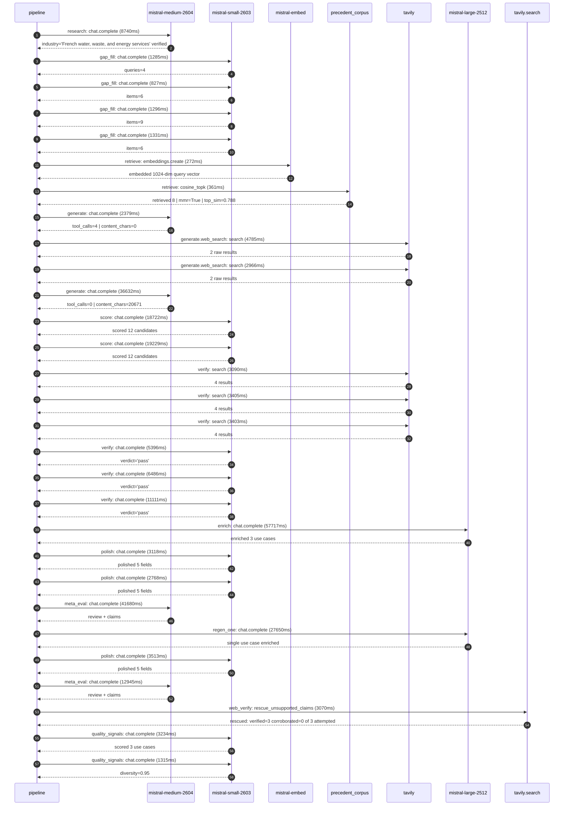

# Pipeline blueprint (architecture)

Static view of the pipeline regardless of run timing — shows agents,
models, and gates. The chronological execution log follows below.

```mermaid
flowchart TD
    Start([User: company name]) --> R
    R["<b>1. Research</b><br/>parallel: Wikipedia · Tavily news ·<br/>existing initiatives · live verification<br/><i>mistral-medium</i> synthesis"]
    R --> G["<b>1b. Gap-fill</b><br/>identify missing fields →<br/><i>mistral-small</i> generates queries →<br/>Tavily search per field →<br/><i>mistral-small</i> per-field extraction"]
    G --> Conf{Confidence ≥ 0.5<br/>OR verified<br/>OR ≥ 1 existing initiative?}
    Conf -->|no| Refuse([Refusal])
    Conf -->|yes| Ret
    Ret["<b>2. Retrieve</b><br/><i>mistral-embed</i> on company query →<br/>cosine top-K + industry/depth filter +<br/>MMR diversification"]
    Ret --> Gen["<b>3. Generate 12 candidates</b><br/><i>mistral-medium</i> with web_search tool<br/>(Tavily + deep-read) — fact citations<br/>flow into the EvidenceLedger"]
    Gen --> Score["<b>4. Score</b><br/>self-consistency: 2 parallel passes<br/><i>mistral-small</i> @ T=0.2 and T=0.4 →<br/>aggregate weighted scores"]
    Score --> Verify["<b>5. Per-candidate verify</b><br/>top-3: Tavily search + deep-read +<br/><i>mistral-small</i> verdict (pass /<br/>partial / confirmed_existing)"]
    Verify --> Enrich["<b>6. Enrich</b><br/><i>mistral-large</i> drafts customer-facing<br/>prose for 3 use cases (or<br/><i>mistral-medium</i> on fast tier)"]
    Enrich --> NumScrub["<b>6a. Numeric scrub</b><br/>flag any number not in cited content"]
    NumScrub --> Polish["<b>6b. Polish</b><br/><i>mistral-small</i> per use case (parallel):<br/>convert markers→qualitative,<br/>(ev-XXX)→[title](url)"]
    Polish --> Attr["<b>6c. Attribution check</b><br/><i>mistral-small</i> per use case (parallel):<br/>fix corpus-ID ↔ company mismatches"]
    Attr --> Meta["<b>7. Meta-evaluation</b><br/><i>mistral-medium</i> reviews report against<br/>cited precedents + ledger entries:<br/>strict claim verification"]
    Meta --> RegenQ{confidence < 0.6<br/>AND not fast tier?}
    RegenQ -->|yes| Regen["<b>7b. Targeted regen</b><br/><i>mistral-large</i> re-enriches just the<br/>weakest use case with the next-best<br/>near-miss; re-runs meta-eval"]
    RegenQ -->|no| QS
    Regen --> QS
    QS["<b>Quality signals</b><br/>LLM-graded diversity + specificity,<br/>fact-check pass rate, TTV/cost spread"]
    QS --> Render([Markdown report + trace])

    classDef agent fill:#fef3c7,stroke:#f59e0b
    classDef gate fill:#dbeafe,stroke:#3b82f6
    classDef io fill:#dcfce7,stroke:#16a34a
    class R,G,Ret,Gen,Score,Verify,Enrich,NumScrub,Polish,Attr,Meta,Regen,QS agent
    class Conf,RegenQ gate
    class Start,Refuse,Render io
```

## Execution trace — Veolia

Started: `2026-05-09T11:19:07.121606+00:00`. Total wall time: `273.8s` across `29` recorded actions.

### Per-step time totals

| Step | Calls | Total time | Avg time |
|---|---:|---:|---:|
| `research` | 1 | 8.74s | 8740ms |
| `gap_fill` | 4 | 4.74s | 1185ms |
| `retrieve` | 2 | 0.63s | 317ms |
| `generate` | 2 | 39.01s | 19505ms |
| `generate.web_search` | 2 | 7.75s | 3875ms |
| `score` | 2 | 37.95s | 18975ms |
| `verify` | 6 | 32.89s | 5482ms |
| `enrich` | 1 | 57.72s | 57717ms |
| `polish` | 3 | 9.40s | 3133ms |
| `meta_eval` | 2 | 54.63s | 27313ms |
| `regen_one` | 1 | 27.65s | 27650ms |
| `web_verify` | 1 | 3.07s | 3070ms |
| `quality_signals` | 2 | 4.55s | 2275ms |

### Chronological event log

- `11:19:09.561` **[research]** `mistral-medium-2604.chat.complete` — 8740ms
   - inputs: synthesize CompanyContext for Veolia | depth=medium
   - outputs: industry='French water, waste, and energy services' verified=True conf=0.75
- `11:19:18.302` **[gap_fill]** `mistral-small-2603.chat.complete` — 1285ms
   - inputs: generate gap queries | fields=['business_model', 'products', 'data_assets', 'priorities']
   - outputs: queries=4
- `11:19:24.155` **[gap_fill]** `mistral-small-2603.chat.complete` — 827ms
   - inputs: layer-2 extract field=priorities
   - outputs: items=6
- `11:19:24.159` **[gap_fill]** `mistral-small-2603.chat.complete` — 1296ms
   - inputs: layer-2 extract field=data_assets
   - outputs: items=9
- `11:19:24.162` **[gap_fill]** `mistral-small-2603.chat.complete` — 1331ms
   - inputs: layer-2 extract field=products
   - outputs: items=6
- `11:19:25.494` **[retrieve]** `mistral-embed.embeddings.create` — 272ms
   - inputs: company_query | industries='French water, waste, and energy services'
   - outputs: embedded 1024-dim query vector
- `11:19:25.767` **[retrieve]** `precedent_corpus.cosine_topk` — 361ms
   - inputs: k=8 min_depth=0.4 target='Veolia'
   - outputs: retrieved 8 | mmr=True | top_sim=0.788
- `11:19:27.441` **[generate]** `mistral-medium-2604.chat.complete` — 2379ms
   - inputs: iteration=0 tool_calls_used=0/2 tools=on
   - outputs: tool_calls=4 | content_chars=0
- `11:19:29.837` **[generate.web_search]** `tavily.search` — 4785ms
   - inputs: query='Veolia 2025 sustainability report water waste energy AI initiatives'
   - outputs: 2 raw results
- `11:19:35.951` **[generate.web_search]** `tavily.search` — 2966ms
   - inputs: query='Veolia Hubgrade AI features smart monitoring water energy waste'
   - outputs: 2 raw results
- `11:19:39.510` **[generate]** `mistral-medium-2604.chat.complete` — 36632ms
   - inputs: iteration=1 tool_calls_used=2/2 tools=off
   - outputs: tool_calls=0 | content_chars=20671
- `11:20:16.869` **[score]** `mistral-small-2603.chat.complete` — 18722ms
   - inputs: self-consistency pass T=0.2
   - outputs: scored 12 candidates
- `11:20:16.874` **[score]** `mistral-small-2603.chat.complete` — 19229ms
   - inputs: self-consistency pass T=0.4
   - outputs: scored 12 candidates
- `11:20:36.141` **[verify]** `tavily.search` — 3090ms
   - inputs: candidate=ai-pfas-treatment-optimization | query='Veolia AI-optimized PFAS treatment process control for Beyon'
   - outputs: 4 results
- `11:20:36.141` **[verify]** `tavily.search` — 3405ms
   - inputs: candidate=multilingual-contract-analytics | query='Veolia Multilingual contract analytics for EU-hosted environ'
   - outputs: 4 results
- `11:20:36.141` **[verify]** `tavily.search` — 3403ms
   - inputs: candidate=recycled-water-ai-allocation | query='Veolia AI-driven recycled water allocation for agricultural '
   - outputs: 4 results
- `11:20:52.688` **[verify]** `mistral-small-2603.chat.complete` — 5396ms
   - inputs: verdict for ai-pfas-treatment-optimization
   - outputs: verdict='pass'
- `11:20:54.769` **[verify]** `mistral-small-2603.chat.complete` — 6486ms
   - inputs: verdict for recycled-water-ai-allocation
   - outputs: verdict='pass'
- `11:20:55.138` **[verify]** `mistral-small-2603.chat.complete` — 11111ms
   - inputs: verdict for multilingual-contract-analytics
   - outputs: verdict='pass'
- `11:21:06.253` **[enrich]** `mistral-large-2512.chat.complete` — 57717ms
   - inputs: tier=standard top_3=['ai-pfas-treatment-optimization', 'multilingual-contract-analytics', 'recycled-water-ai-allocation']
   - outputs: enriched 3 use cases
- `11:22:03.996` **[polish]** `mistral-small-2603.chat.complete` — 3118ms
   - inputs: use_case=ai-pfas-treatment-optimization unanchored=True opaque_ev=False
   - outputs: polished 5 fields
- `11:22:04.002` **[polish]** `mistral-small-2603.chat.complete` — 2768ms
   - inputs: use_case=multilingual-contract-analytics unanchored=True opaque_ev=False
   - outputs: polished 5 fields
- `11:22:07.115` **[meta_eval]** `mistral-medium-2604.chat.complete` — 41680ms
   - inputs: reviewing 3 use cases
   - outputs: review + claims
- `11:22:48.797` **[regen_one]** `mistral-large-2512.chat.complete` — 27650ms
   - inputs: replace weakest=multilingual-contract-analytics with eu-hosted-regulatory-compliance-assistant
   - outputs: single use case enriched
- `11:23:16.458` **[polish]** `mistral-small-2603.chat.complete` — 3513ms
   - inputs: use_case=eu-hosted-regulatory-compliance-assistant unanchored=True opaque_ev=True
   - outputs: polished 5 fields
- `11:23:19.971` **[meta_eval]** `mistral-medium-2604.chat.complete` — 12945ms
   - inputs: reviewing 3 use cases
   - outputs: review + claims
- `11:23:32.932` **[web_verify]** `tavily.search.rescue_unsupported_claims` — 3070ms
   - inputs: company='Veolia' unsupported=3 budget=12
   - outputs: rescued: verified=3 corroborated=0 of 3 attempted
- `11:23:36.380` **[quality_signals]** `mistral-small-2603.chat.complete` — 3234ms
   - inputs: specificity grade (3 use cases)
   - outputs: scored 3 use cases
- `11:23:39.615` **[quality_signals]** `mistral-small-2603.chat.complete` — 1315ms
   - inputs: diversity grade
   - outputs: diversity=0.95

## Mermaid sequence diagram (execution)

