# Pipeline blueprint (architecture)

Static view of the pipeline regardless of run timing — shows agents,
models, and gates. The chronological execution log follows below.

```mermaid
flowchart TD
    Start([User: company name]) --> R
    R["<b>1. Research</b><br/>parallel: Wikipedia · Tavily news ·<br/>existing initiatives · live verification<br/><i>mistral-medium</i> synthesis"]
    R --> G["<b>1b. Gap-fill</b><br/>identify missing fields →<br/><i>mistral-small</i> generates queries →<br/>Tavily search per field →<br/><i>mistral-small</i> per-field extraction"]
    G --> Conf{Confidence ≥ 0.5<br/>OR verified<br/>OR ≥ 1 existing initiative?}
    Conf -->|no| Refuse([Refusal])
    Conf -->|yes| Ret
    Ret["<b>2. Retrieve</b><br/><i>mistral-embed</i> on company query →<br/>cosine top-K + industry/depth filter +<br/>MMR diversification"]
    Ret --> Gen["<b>3. Generate 12 candidates</b><br/><i>mistral-medium</i> with web_search tool<br/>(Tavily + deep-read) — fact citations<br/>flow into the EvidenceLedger"]
    Gen --> Score["<b>4. Score</b><br/>self-consistency: 2 parallel passes<br/><i>mistral-small</i> @ T=0.2 and T=0.4 →<br/>aggregate weighted scores"]
    Score --> Verify["<b>5. Per-candidate verify</b><br/>top-3: Tavily search + deep-read +<br/><i>mistral-small</i> verdict (pass /<br/>partial / confirmed_existing)"]
    Verify --> Enrich["<b>6. Enrich</b><br/><i>mistral-large</i> drafts customer-facing<br/>prose for 3 use cases (or<br/><i>mistral-medium</i> on fast tier)"]
    Enrich --> NumScrub["<b>6a. Numeric scrub</b><br/>flag any number not in cited content"]
    NumScrub --> Polish["<b>6b. Polish</b><br/><i>mistral-small</i> per use case (parallel):<br/>convert markers→qualitative,<br/>(ev-XXX)→[title](url)"]
    Polish --> Attr["<b>6c. Attribution check</b><br/><i>mistral-small</i> per use case (parallel):<br/>fix corpus-ID ↔ company mismatches"]
    Attr --> Meta["<b>7. Meta-evaluation</b><br/><i>mistral-medium</i> reviews report against<br/>cited precedents + ledger entries:<br/>strict claim verification"]
    Meta --> RegenQ{confidence < 0.6<br/>AND not fast tier?}
    RegenQ -->|yes| Regen["<b>7b. Targeted regen</b><br/><i>mistral-large</i> re-enriches just the<br/>weakest use case with the next-best<br/>near-miss; re-runs meta-eval"]
    RegenQ -->|no| QS
    Regen --> QS
    QS["<b>Quality signals</b><br/>LLM-graded diversity + specificity,<br/>fact-check pass rate, TTV/cost spread"]
    QS --> Render([Markdown report + trace])

    classDef agent fill:#fef3c7,stroke:#f59e0b
    classDef gate fill:#dbeafe,stroke:#3b82f6
    classDef io fill:#dcfce7,stroke:#16a34a
    class R,G,Ret,Gen,Score,Verify,Enrich,NumScrub,Polish,Attr,Meta,Regen,QS agent
    class Conf,RegenQ gate
    class Start,Refuse,Render io
```

## Execution trace — BNP Paribas

Started: `2026-05-09T14:02:03.764873+00:00`. Total wall time: `255.0s` across `53` recorded actions.

### Per-step time totals

| Step | Calls | Total time | Avg time |
|---|---:|---:|---:|
| `research` | 1 | 7.63s | 7635ms |
| `gap_fill` | 4 | 4.27s | 1067ms |
| `retrieve` | 2 | 0.53s | 266ms |
| `generate` | 2 | 34.89s | 17445ms |
| `generate.web_search` | 2 | 7.68s | 3841ms |
| `score` | 2 | 36.26s | 18131ms |
| `verify` | 6 | 21.23s | 3539ms |
| `enrich` | 1 | 74.51s | 74514ms |
| `polish` | 3 | 9.00s | 2999ms |
| `meta_eval` | 2 | 28.10s | 14051ms |
| `regen_one` | 1 | 24.74s | 24739ms |
| `web_verify` | 1 | 4.62s | 4623ms |
| `source_judge` | 22 | 20.63s | 938ms |
| `final_qualify` | 2 | 4.47s | 2237ms |
| `quality_signals` | 2 | 5.36s | 2681ms |

### Chronological event log

- `14:02:06.897` **[research]** `mistral-medium-2604.chat.complete` — 7635ms
   - inputs: synthesize CompanyContext for BNP Paribas | depth=medium
   - outputs: industry='French multinational universal bank and financial services' verified=True conf=0.75
- `14:02:14.534` **[gap_fill]** `mistral-small-2603.chat.complete` — 1205ms
   - inputs: generate gap queries | fields=['business_model', 'products', 'data_assets', 'priorities']
   - outputs: queries=4
- `14:02:24.158` **[gap_fill]** `mistral-small-2603.chat.complete` — 1097ms
   - inputs: layer-2 extract field=priorities
   - outputs: items=6
- `14:02:24.163` **[gap_fill]** `mistral-small-2603.chat.complete` — 856ms
   - inputs: layer-2 extract field=data_assets
   - outputs: items=6
- `14:02:24.167` **[gap_fill]** `mistral-small-2603.chat.complete` — 1111ms
   - inputs: layer-2 extract field=products
   - outputs: items=17
- `14:02:25.280` **[retrieve]** `mistral-embed.embeddings.create` — 195ms
   - inputs: company_query | industries='French multinational universal bank and financial services'
   - outputs: embedded 1024-dim query vector
- `14:02:25.474` **[retrieve]** `precedent_corpus.cosine_topk` — 337ms
   - inputs: k=8 min_depth=0.4 target='BNP Paribas'
   - outputs: retrieved 8 | mmr=True | top_sim=0.792
- `14:02:26.804` **[generate]** `mistral-medium-2604.chat.complete` — 2046ms
   - inputs: iteration=0 tool_calls_used=0/2 tools=on
   - outputs: tool_calls=4 | content_chars=0
- `14:02:28.871` **[generate.web_search]** `tavily.search` — 3901ms
   - inputs: query='BNP Paribas recent AI initiatives 2025 2026'
   - outputs: 2 raw results
- `14:02:34.204` **[generate.web_search]** `tavily.search` — 3780ms
   - inputs: query='BNP Paribas regulatory compliance AI 2025'
   - outputs: 2 raw results
- `14:02:38.242` **[generate]** `mistral-medium-2604.chat.complete` — 32844ms
   - inputs: iteration=1 tool_calls_used=2/2 tools=off
   - outputs: tool_calls=0 | content_chars=22893
- `14:03:11.363` **[score]** `mistral-small-2603.chat.complete` — 18077ms
   - inputs: self-consistency pass T=0.2
   - outputs: scored 12 candidates
- `14:03:11.367` **[score]** `mistral-small-2603.chat.complete` — 18185ms
   - inputs: self-consistency pass T=0.4
   - outputs: scored 12 candidates
- `14:03:29.589` **[verify]** `tavily.search` — 2215ms
   - inputs: candidate=regulatory-compliance-agent | query='BNP Paribas Multi-jurisdictional regulatory compliance agent'
   - outputs: 4 results
- `14:03:29.589` **[verify]** `tavily.search` — 3339ms
   - inputs: candidate=esg-assessment-automation | query='BNP Paribas AI-driven ESG assessment automation for Corporat'
   - outputs: 4 results
- `14:03:29.589` **[verify]** `tavily.search` — 2338ms
   - inputs: candidate=multi-currency-fx-optimization | query='BNP Paribas AI-driven multi-currency FX hedging optimization'
   - outputs: 4 results
- `14:03:32.800` **[verify]** `mistral-small-2603.chat.complete` — 3851ms
   - inputs: verdict for regulatory-compliance-agent
   - outputs: verdict='pass'
- `14:03:33.399` **[verify]** `mistral-small-2603.chat.complete` — 4496ms
   - inputs: verdict for multi-currency-fx-optimization
   - outputs: verdict='pass'
- `14:03:46.294` **[verify]** `mistral-small-2603.chat.complete` — 4992ms
   - inputs: verdict for esg-assessment-automation
   - outputs: verdict='confirmed_existing'
- `14:03:51.324` **[enrich]** `mistral-large-2512.chat.complete` — 74514ms
   - inputs: tier=standard top_3=['regulatory-compliance-agent', 'multi-currency-fx-optimization', 'wealth-management-advisor-agent']
   - outputs: enriched 3 use cases
- `14:05:05.865` **[polish]** `mistral-small-2603.chat.complete` — 2728ms
   - inputs: use_case=regulatory-compliance-agent unanchored=True opaque_ev=False
   - outputs: polished 5 fields
- `14:05:05.871` **[polish]** `mistral-small-2603.chat.complete` — 3117ms
   - inputs: use_case=multi-currency-fx-optimization unanchored=True opaque_ev=False
   - outputs: polished 5 fields
- `14:05:05.876` **[polish]** `mistral-small-2603.chat.complete` — 3151ms
   - inputs: use_case=wealth-management-advisor-agent unanchored=True opaque_ev=False
   - outputs: polished 5 fields
- `14:05:09.030` **[meta_eval]** `mistral-medium-2604.chat.complete` — 14174ms
   - inputs: reviewing 3 use cases
   - outputs: review + claims
- `14:05:23.206` **[regen_one]** `mistral-large-2512.chat.complete` — 24739ms
   - inputs: replace weakest=multi-currency-fx-optimization with esg-assessment-automation
   - outputs: single use case enriched
- `14:05:47.958` **[meta_eval]** `mistral-medium-2604.chat.complete` — 13927ms
   - inputs: reviewing 3 use cases
   - outputs: review + claims
- `14:06:01.908` **[web_verify]** `tavily.search.rescue_unsupported_claims` — 4623ms
   - inputs: company='BNP Paribas' unsupported=7 budget=12
   - outputs: rescued: verified=6 corroborated=1 of 7 attempted
- `14:06:06.535` **[source_judge]** `mistral-small-2603.judge_claim_sources` — 4222ms
   - inputs: pairs=21
   - outputs: judged 21 pairs
- `14:06:06.535` **[source_judge]** `mistral-small-2603.chat.complete` — 529ms
   - inputs: claim='BNP Paribas operates in 64 countries'
   - outputs: supports=False
- `14:06:06.540` **[source_judge]** `mistral-small-2603.chat.complete` — 1837ms
   - inputs: claim="BNP Paribas' Corporate & Institutional Banking (CIB) divisio"
   - outputs: supports=False
- `14:06:06.542` **[source_judge]** `mistral-small-2603.chat.complete` — 1863ms
   - inputs: claim='BNP Paribas has deployed an internal LLM-as-a-Service platfo'
   - outputs: supports=True
- `14:06:06.546` **[source_judge]** `mistral-small-2603.chat.complete` — 1826ms
   - inputs: claim="BNP Paribas' internal LLM platform ensures secure, EU-hosted"
   - outputs: supports=False
- `14:06:07.065` **[source_judge]** `mistral-small-2603.chat.complete` — 1311ms
   - inputs: claim='Regulatory compliance agents at this scope reduce manual rev'
   - outputs: supports=False
- `14:06:08.372` **[source_judge]** `mistral-small-2603.chat.complete` — 450ms
   - inputs: claim="Mistral's multilingual models support 100+ languages"
   - outputs: supports=False
- `14:06:08.377` **[source_judge]** `mistral-small-2603.chat.complete` — 500ms
   - inputs: claim='No equivalent regulatory compliance system currently exists '
   - outputs: supports=False
- `14:06:08.381` **[source_judge]** `mistral-small-2603.chat.complete` — 615ms
   - inputs: claim='BNP Paribas manages €3.279T in assets'
   - outputs: supports=False
- `14:06:08.406` **[source_judge]** `mistral-small-2603.chat.complete` — 562ms
   - inputs: claim='BNP Paribas manages assets across 65+ countries'
   - outputs: supports=False
- `14:06:08.822` **[source_judge]** `mistral-small-2603.chat.complete` — 723ms
   - inputs: claim="BNP Paribas' treasury operations face material FX risk from "
   - outputs: supports=False
- `14:06:08.876` **[source_judge]** `mistral-small-2603.chat.complete` — 545ms
   - inputs: claim="BNP Paribas' US$830M investment in Mistral AI's NVIDIA infra"
   - outputs: supports=True
- `14:06:08.968` **[source_judge]** `mistral-small-2603.chat.complete` — 726ms
   - inputs: claim='FX optimization systems reduce FX-related losses by 10-20% i'
   - outputs: supports=False
- `14:06:08.997` **[source_judge]** `mistral-small-2603.chat.complete` — 571ms
   - inputs: claim="BNP Paribas is Europe's largest bank by assets"
   - outputs: supports=False
- `14:06:09.421` **[source_judge]** `mistral-small-2603.chat.complete` — 579ms
   - inputs: claim="BNP Paribas' existing LLM-as-a-Service platform provides a f"
   - outputs: supports=True
- `14:06:09.545` **[source_judge]** `mistral-small-2603.chat.complete` — 586ms
   - inputs: claim='BNP Paribas Wealth Management serves 3.4M clients across Eur'
   - outputs: supports=True
- `14:06:09.568` **[source_judge]** `mistral-small-2603.chat.complete` — 537ms
   - inputs: claim='BNP Paribas Wealth Management is a core business line'
   - outputs: supports=False
- `14:06:09.694` **[source_judge]** `mistral-small-2603.chat.complete` — 488ms
   - inputs: claim='BNP Paribas emphasizes AI-driven personalization in its stra'
   - outputs: supports=False
- `14:06:10.000` **[source_judge]** `mistral-small-2603.chat.complete` — 527ms
   - inputs: claim="BNP Paribas' existing LLM-as-a-Service platform provides a s"
   - outputs: supports=False
- `14:06:10.105` **[source_judge]** `mistral-small-2603.chat.complete` — 519ms
   - inputs: claim="Mistral's multilingual models support BNP Paribas' global cl"
   - outputs: supports=True
- `14:06:10.132` **[source_judge]** `mistral-small-2603.chat.complete` — 538ms
   - inputs: claim='No equivalent advisor assistant currently exists in BNP Pari'
   - outputs: supports=False
- `14:06:10.181` **[source_judge]** `mistral-small-2603.chat.complete` — 576ms
   - inputs: claim='Wealth management advisor assistant reduces portfolio analys'
   - outputs: supports=False
- `14:06:10.759` **[final_qualify]** `mistral-small-2603.chat.complete` — 2438ms
   - inputs: use_case=regulatory-compliance-agent unsupported=2
   - outputs: qualified 4 fields
- `14:06:10.764` **[final_qualify]** `mistral-small-2603.chat.complete` — 2036ms
   - inputs: use_case=wealth-management-advisor-agent unsupported=1
   - outputs: qualified 4 fields
- `14:06:13.416` **[quality_signals]** `mistral-small-2603.chat.complete` — 3508ms
   - inputs: specificity grade (3 use cases)
   - outputs: scored 3 use cases
- `14:06:16.923` **[quality_signals]** `mistral-small-2603.chat.complete` — 1854ms
   - inputs: diversity grade
   - outputs: diversity=0.85

## Mermaid sequence diagram (execution)

```mermaid
sequenceDiagram
    autonumber
    participant pipeline as pipeline
    participant mistral_medium_2604 as mistral-medium-2604
    participant mistral_small_2603 as mistral-small-2603
    participant mistral_embed as mistral-embed
    participant precedent_corpus as precedent_corpus
    participant tavily as tavily
    participant mistral_large_2512 as mistral-large-2512
    participant tavily_search as tavily.search
    pipeline->>mistral_medium_2604: research: chat.complete (7635ms)
    mistral_medium_2604-->>pipeline: industry='French multinational universal bank and financial 
    pipeline->>mistral_small_2603: gap_fill: chat.complete (1205ms)
    mistral_small_2603-->>pipeline: queries=4
    pipeline->>mistral_small_2603: gap_fill: chat.complete (1097ms)
    mistral_small_2603-->>pipeline: items=6
    pipeline->>mistral_small_2603: gap_fill: chat.complete (856ms)
    mistral_small_2603-->>pipeline: items=6
    pipeline->>mistral_small_2603: gap_fill: chat.complete (1111ms)
    mistral_small_2603-->>pipeline: items=17
    pipeline->>mistral_embed: retrieve: embeddings.create (195ms)
    mistral_embed-->>pipeline: embedded 1024-dim query vector
    pipeline->>precedent_corpus: retrieve: cosine_topk (337ms)
    precedent_corpus-->>pipeline: retrieved 8 | mmr=True | top_sim=0.792
    pipeline->>mistral_medium_2604: generate: chat.complete (2046ms)
    mistral_medium_2604-->>pipeline: tool_calls=4 | content_chars=0
    pipeline->>tavily: generate.web_search: search (3901ms)
    tavily-->>pipeline: 2 raw results
    pipeline->>tavily: generate.web_search: search (3780ms)
    tavily-->>pipeline: 2 raw results
    pipeline->>mistral_medium_2604: generate: chat.complete (32844ms)
    mistral_medium_2604-->>pipeline: tool_calls=0 | content_chars=22893
    pipeline->>mistral_small_2603: score: chat.complete (18077ms)
    mistral_small_2603-->>pipeline: scored 12 candidates
    pipeline->>mistral_small_2603: score: chat.complete (18185ms)
    mistral_small_2603-->>pipeline: scored 12 candidates
    pipeline->>tavily: verify: search (2215ms)
    tavily-->>pipeline: 4 results
    pipeline->>tavily: verify: search (3339ms)
    tavily-->>pipeline: 4 results
    pipeline->>tavily: verify: search (2338ms)
    tavily-->>pipeline: 4 results
    pipeline->>mistral_small_2603: verify: chat.complete (3851ms)
    mistral_small_2603-->>pipeline: verdict='pass'
    pipeline->>mistral_small_2603: verify: chat.complete (4496ms)
    mistral_small_2603-->>pipeline: verdict='pass'
    pipeline->>mistral_small_2603: verify: chat.complete (4992ms)
    mistral_small_2603-->>pipeline: verdict='confirmed_existing'
    pipeline->>mistral_large_2512: enrich: chat.complete (74514ms)
    mistral_large_2512-->>pipeline: enriched 3 use cases
    pipeline->>mistral_small_2603: polish: chat.complete (2728ms)
    mistral_small_2603-->>pipeline: polished 5 fields
    pipeline->>mistral_small_2603: polish: chat.complete (3117ms)
    mistral_small_2603-->>pipeline: polished 5 fields
    pipeline->>mistral_small_2603: polish: chat.complete (3151ms)
    mistral_small_2603-->>pipeline: polished 5 fields
    pipeline->>mistral_medium_2604: meta_eval: chat.complete (14174ms)
    mistral_medium_2604-->>pipeline: review + claims
    pipeline->>mistral_large_2512: regen_one: chat.complete (24739ms)
    mistral_large_2512-->>pipeline: single use case enriched
    pipeline->>mistral_medium_2604: meta_eval: chat.complete (13927ms)
    mistral_medium_2604-->>pipeline: review + claims
    pipeline->>tavily_search: web_verify: rescue_unsupported_claims (4623ms)
    tavily_search-->>pipeline: rescued: verified=6 corroborated=1 of 7 attempted
    pipeline->>mistral_small_2603: source_judge: judge_claim_sources (4222ms)
    mistral_small_2603-->>pipeline: judged 21 pairs
    pipeline->>mistral_small_2603: source_judge: chat.complete (529ms)
    mistral_small_2603-->>pipeline: supports=False
    pipeline->>mistral_small_2603: source_judge: chat.complete (1837ms)
    mistral_small_2603-->>pipeline: supports=False
    pipeline->>mistral_small_2603: source_judge: chat.complete (1863ms)
    mistral_small_2603-->>pipeline: supports=True
    pipeline->>mistral_small_2603: source_judge: chat.complete (1826ms)
    mistral_small_2603-->>pipeline: supports=False
    pipeline->>mistral_small_2603: source_judge: chat.complete (1311ms)
    mistral_small_2603-->>pipeline: supports=False
    pipeline->>mistral_small_2603: source_judge: chat.complete (450ms)
    mistral_small_2603-->>pipeline: supports=False
    pipeline->>mistral_small_2603: source_judge: chat.complete (500ms)
    mistral_small_2603-->>pipeline: supports=False
    pipeline->>mistral_small_2603: source_judge: chat.complete (615ms)
    mistral_small_2603-->>pipeline: supports=False
    pipeline->>mistral_small_2603: source_judge: chat.complete (562ms)
    mistral_small_2603-->>pipeline: supports=False
    pipeline->>mistral_small_2603: source_judge: chat.complete (723ms)
    mistral_small_2603-->>pipeline: supports=False
    pipeline->>mistral_small_2603: source_judge: chat.complete (545ms)
    mistral_small_2603-->>pipeline: supports=True
    pipeline->>mistral_small_2603: source_judge: chat.complete (726ms)
    mistral_small_2603-->>pipeline: supports=False
    pipeline->>mistral_small_2603: source_judge: chat.complete (571ms)
    mistral_small_2603-->>pipeline: supports=False
    pipeline->>mistral_small_2603: source_judge: chat.complete (579ms)
    mistral_small_2603-->>pipeline: supports=True
    pipeline->>mistral_small_2603: source_judge: chat.complete (586ms)
    mistral_small_2603-->>pipeline: supports=True
    pipeline->>mistral_small_2603: source_judge: chat.complete (537ms)
    mistral_small_2603-->>pipeline: supports=False
    pipeline->>mistral_small_2603: source_judge: chat.complete (488ms)
    mistral_small_2603-->>pipeline: supports=False
    pipeline->>mistral_small_2603: source_judge: chat.complete (527ms)
    mistral_small_2603-->>pipeline: supports=False
    pipeline->>mistral_small_2603: source_judge: chat.complete (519ms)
    mistral_small_2603-->>pipeline: supports=True
    pipeline->>mistral_small_2603: source_judge: chat.complete (538ms)
    mistral_small_2603-->>pipeline: supports=False
    pipeline->>mistral_small_2603: source_judge: chat.complete (576ms)
    mistral_small_2603-->>pipeline: supports=False
    pipeline->>mistral_small_2603: final_qualify: chat.complete (2438ms)
    mistral_small_2603-->>pipeline: qualified 4 fields
    pipeline->>mistral_small_2603: final_qualify: chat.complete (2036ms)
    mistral_small_2603-->>pipeline: qualified 4 fields
    pipeline->>mistral_small_2603: quality_signals: chat.complete (3508ms)
    mistral_small_2603-->>pipeline: scored 3 use cases
    pipeline->>mistral_small_2603: quality_signals: chat.complete (1854ms)
    mistral_small_2603-->>pipeline: diversity=0.85
```

