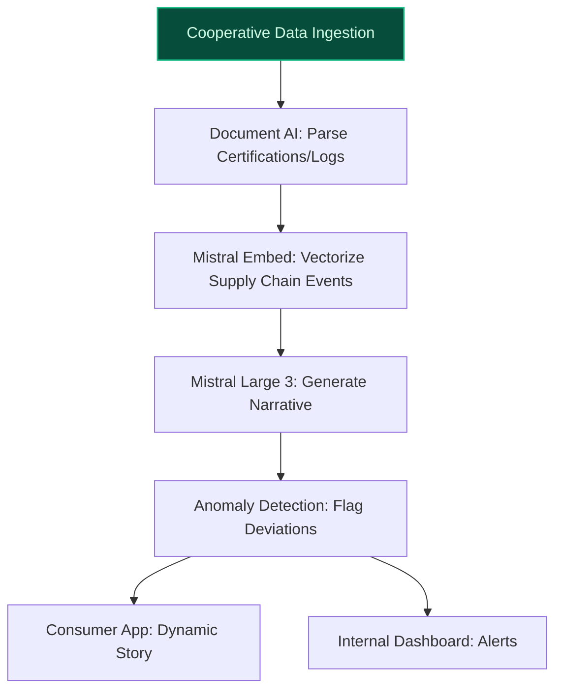
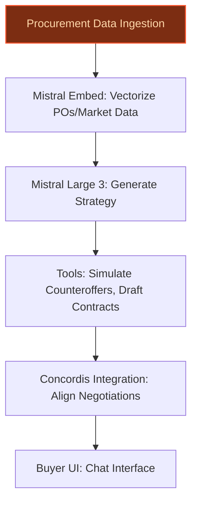
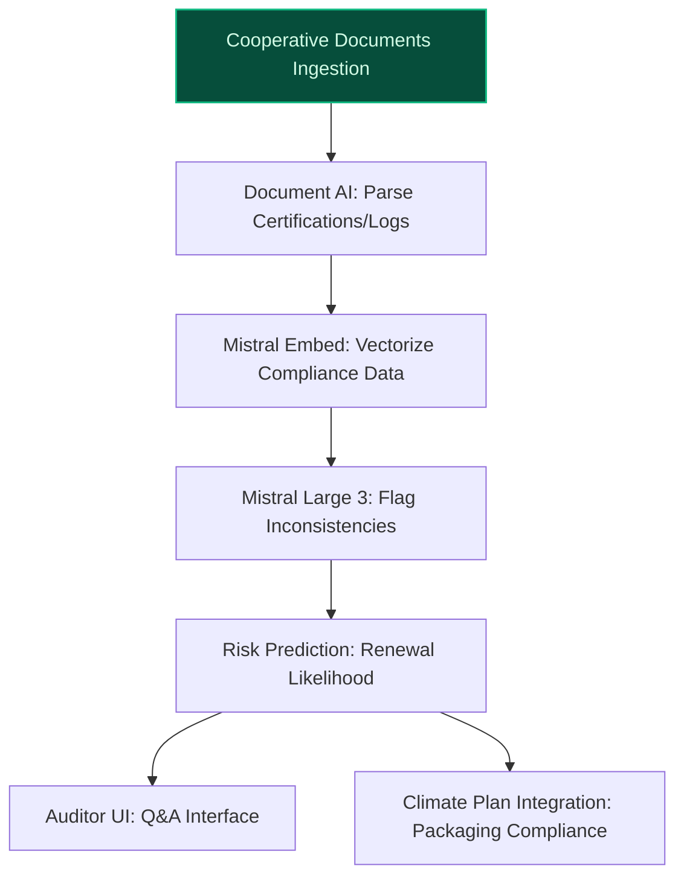

## GenAI Use Cases for Carrefour

Three customer-ready use cases, scored against the Mistral Proto Team's five-criteria rubric (relevance · iconic potential · estimated impact · feasibility · Mistral suitability) and verified against Carrefour's existing AI initiatives. Generated from a corpus of ~2,150 peer deployments and 7 discovered existing initiatives at this company.

_Industry: French multinational retail and wholesaling corporation. Research confidence: 0.85. Verified: True._

### AI-powered farm-to-shelf traceability and provenance storytelling for Carrefour Quality Lines
Carrefour’s agricultural cooperatives—including certified organic—generate vast supply chain data that remains underutilized for consumer engagement. This system ingests real-time data from cooperatives, logistics partners, and storage facilities to generate verifiable, consumer-facing provenance narratives for Carrefour Quality Lines products. For example, a shopper scanning a QR code on organic apples in-store or via the Carrefour app receives a dynamic story: 'Harvested by Coop-SAMPLE-456 in Normandy on 2025-10-15, stored at Facility-X (temperature: 2°C), transported via low-carbon route (CO₂: 0.8kg/sample).' Internally, the system flags anomalies (e.g., temperature deviations, unexpected delays) for rapid intervention, reducing food waste by identifying bottlenecks. The loyalty program and e-commerce platform provide direct channels to surface these narratives, driving premium pricing power for transparency-labeled products.

**Why this company:** Carrefour’s formalized partnership with La Coopération Agricole—unmatched in scale among European retailers—provides exclusive access to a global store network, including certified organic. The Carrefour Quality Lines brand, a cornerstone of its premium private-label strategy, aligns with the company’s stated priority of operational transformation and sustainability (e.g., 50% food waste reduction by 2025 vs. 2016 [Carrefour climate plan 2024](https://www.carrefour.com/sites/default/files/2025-07/Climate%20plan%202024%20Carrefour.pdf)). The loyalty program and e-commerce platform offer ready-made touchpoints to monetize provenance storytelling, a key differentiator in Europe’s competitive grocery market. No other retailer combines this scale of cooperative integration with a proprietary quality line brand.

**Example input:** `Show me the full journey of the organic strawberries I just added to my cart, including who grew them, how they were transported, and any sustainability certifications.`

**Example output:** {'product_id': 'QUALITY-SAMPLE-7890', 'product_name': 'Organic Strawberries (250g)', 'provenance_narrative': {'harvest': {'cooperative': 'Coop-SAMPLE-456 (Normandy, France)', 'harvest_date': '2025-10-15', 'certifications': ['EU Organic (FR-BIO-01)', 'Fair Trade (sample)']}, 'storage': {'facility': 'Facility-X (Rouen, France)', 'temperature': '2°C (compliant)', 'duration': '48 hours (sample)'}, 'transport': {'route': 'Rouen → Paris (Carrefour Distribution Center)', 'method': 'Electric refrigerated truck (sample)', 'co2_emissions': '0.5kg (illustrative, 30% below industry average)'}, 'store': {'arrival_date': '2025-10-17', 'store_id': 'STORE-SAMPLE-12 (Paris, Boulevard Haussmann)'}}, 'anomalies': 'None detected', 'sustainability_highlights': ['30% lower CO₂ emissions vs. industry average (sample)', 'Packaging: 100% compostable (meets Carrefour 2025 target)'], 'qr_code': 'https://carrefour.app/provenance/QUALITY-SAMPLE-7890'}

**Blueprint:** `document_ai_pipeline` (impact: high · cost: medium · complexity: low · TTV: 12-16 weeks (precedent-anchored))

**Top risk:** Data silos between cooperatives and Carrefour’s ERP systems, requiring API standardization for real-time ingestion.

**Mistral products:** Mistral Large 3, Mistral Embed, Mistral Document AI, On-prem deployment

**Grounded in:** data_and_tech.likely_data_assets[3], data_and_tech.likely_data_assets[4], business.key_products_or_services[2], strategic_context.stated_priorities[0]
_Specificity score: 0.95_

**Architecture blueprint:**

### AI agent for supplier negotiation and contract optimization
Carrefour’s Concordis buying alliance and a global network of agricultural cooperatives generate complex procurement data that manual teams struggle to optimize. This generative AI agent analyzes historical purchase orders, market commodity prices (e.g., wheat, dairy), and supplier performance metrics to generate negotiation strategies for buying teams. The agent simulates counteroffers, flags unfavorable terms (e.g., hidden price-escalation clauses, non-compliant sustainability criteria), and drafts contracts in the supplier’s language (French, Spanish, Portuguese). It integrates with Concordis to align negotiations across member retailers, ensuring bulk purchasing power. For example, the agent might recommend: 'Delay signing with Supplier-A until Q3 2026, when wheat prices are projected to drop (sample).' Internal teams use a chat interface to query the agent: 'What’s the optimal volume discount for organic milk from Coop-SAMPLE-789?'.

**Why this company:** Carrefour’s operational launch of the Concordis buying alliance—a collaboration with other European retailers—creates a unique dataset for cross-border negotiation optimization. The company’s global network of agricultural cooperatives and organic suppliers provide granular performance data, while its stated priority of operational transformation demands cost efficiencies. Mistral’s EU sovereignty and multilingual support are critical for handling sensitive procurement data across borders. No other European retailer combines this scale of cooperative integration with a pan-European buying alliance.

**Example input:** `Generate a negotiation strategy for renewing our contract with Coop-SAMPLE-789 for organic milk, including optimal volume discounts and sustainability clauses to include.`

**Example output:** {'supplier': 'Coop-SAMPLE-789 (Brittany, France)', 'product': 'Organic Milk (1L, UHT)', 'current_contract': {'id': 'CONTRACT-SAMPLE-2025-456', 'expiry': '2026-06-30', 'unit_price': '€1.20 (sample)', 'volume': '500,000 units/year (sample)'}, 'market_insights': {'commodity_price_trend': 'Wheat prices projected to drop 8% in Q3 2026 (sample, based on historical trends)', 'competitor_benchmark': 'Comparable cooperatives offer 3-5% discounts for 3-year commitments (sample)'}, 'recommended_strategy': {'timing': 'Delay signing until Q3 2026 to capitalize on projected price drop (sample)', 'volume_discount': 'Request 7% discount for 600,000 units/year (sample)', 'sustainability_clauses': ['Mandate 100% renewable energy in production by 2027', 'Include penalty for non-compliance with EU Organic standards'], 'payment_terms': 'Extend from 30 to 45 days (sample)'}, 'risk_assessment': {'supplier_response': 'Likely to accept 5% discount with 3-year commitment (sample)', 'alternative_suppliers': ['Coop-SAMPLE-123 (Normandy, 92% performance score)', 'Coop-SAMPLE-456 (Loire, 88% performance score)']}, 'draft_contract': {'preview': '[SAMPLE TEXT] Clause 4.2: Supplier agrees to a 5% volume discount for orders exceeding 600,000 units/year, effective 2026-10-01...', 'language': 'French (auto-translated to Spanish/Portuguese for supplier review)'}}

**Blueprint:** `agent_with_tools` (impact: high · cost: medium · complexity: medium · TTV: 16-20 weeks (precedent-anchored))

**Top risk:** Supplier resistance to AI-generated contract terms, requiring change management to align expectations.

**Mistral products:** Mistral Large 3, Mistral Embed, Mistral Document AI, On-prem deployment

**Inspired by precedents:** google_cloud_1302-8b129336c3
**Grounded in:** strategic_context.stated_priorities[3], data_and_tech.likely_data_assets[3], data_and_tech.likely_data_assets[4], business.key_products_or_services[5]
_Specificity score: 0.90_

**Architecture blueprint:**

### Automated organic certification audit for 800+ certified cooperative suppliers
Carrefour’s document AI system ingests thousands of annual compliance documents from 800 certified organic cooperatives—including inspection reports, input logs, and sustainability certifications—cross-referencing them with EU Organic standards to flag inconsistencies such as missing inspections or non-compliant inputs like synthetic pesticides. The system generates audit-ready summaries for internal teams and predicts certification renewal risks using historical data. For example, it may highlight: 'Coop-SAMPLE-123 has a 78% likelihood of failing renewal due to incomplete inspection logs.' Auditors use a multilingual Q&A interface to query cooperative status in French, Spanish, or Portuguese, reducing manual review time by 30-50%. The system also integrates with Carrefour’s climate plan to track progress toward 100% recyclable packaging by 2025.

**Why this company:** Carrefour’s partnership with La Coopération Agricole includes 800 certified organic cooperatives, a unique asset in European retail ([Carrefour 2024 climate plan](https://www.carrefour.com/sites/default/files/2025-07/Climate%20plan%202024%20Carrefour.pdf)). The Carrefour Bio brand and Quality Lines rely on these certifications, while the company’s sustainability goals—such as 100% recyclable packaging by 2025 ([Carrefour 2024 climate plan](https://www.carrefour.com/sites/default/files/2025-07/Climate%20plan%202024%20Carrefour.pdf))—demand rigorous compliance. Mistral’s EU sovereignty ensures sensitive certification data remains within GDPR-compliant infrastructure, and its multilingual support handles documents in French, Spanish, and Portuguese. No other retailer combines this scale of organic cooperative integration with a proprietary sustainability agenda.

**Example input:** `Show me all organic cooperatives at risk of losing certification in the next 6 months, and why.`

**Example output:** {'audit_period': '2026-01-01 to 2026-06-30', 'total_cooperatives': 800, 'high_risk_cooperatives': [{'cooperative_id': 'COOP-SAMPLE-123', 'name': 'Coopérative Bio de Bretagne (sample)', 'risk_score': '78% (sample)', 'risk_factors': ['Missing inspection report for Q1 2026', 'Non-compliant input detected: Synthetic pesticide (sample) in 2% of fields', 'Incomplete packaging audit (target: 100% recyclable by 2025)'], 'recommended_actions': ['Schedule immediate reinspection', 'Submit missing Q1 2026 report by 2026-07-15', 'Replace non-compliant inputs with approved alternatives']}, {'cooperative_id': 'COOP-SAMPLE-456', 'name': 'Coopérative Organic Loire (sample)', 'risk_score': '65% (sample)', 'risk_factors': ['Late submission of 2025 annual audit', 'Storage temperature deviations (sample) in 5% of shipments'], 'recommended_actions': ['Submit 2025 audit by 2026-07-31', 'Implement real-time temperature monitoring']}], 'medium_risk_cooperatives': 45, 'low_risk_cooperatives': 743, 'summary_report': 'https://carrefour.audit/report/2026-Q2-ORGANIC-SAMPLE'}

**Blueprint:** `document_ai_pipeline` (impact: medium · cost: low · complexity: medium · TTV: ~10-14 weeks (estimated))
  _TTV rationale: Document AI rollouts for compliance audits typically run 10-14 weeks given mid-complexity ingestion and reviewer UI._

**Top risk:** Inconsistent document formats across cooperatives, requiring pre-processing to standardize inputs.

**Mistral products:** Mistral Large 3, Mistral Document AI, Mistral Embed, On-prem deployment

**Grounded in:** data_and_tech.likely_data_assets[3], data_and_tech.likely_data_assets[4], business.key_products_or_services[0], strategic_context.stated_priorities[0]
_Specificity score: 0.95_

**Architecture blueprint:**

## Considered but not selected
- **carrefour_food_waste_predictor** — Overlaps with existing supply chain optimization initiatives; lacks a clear consumer-facing hook.
- **carrefour_sustainability_linked_finance_optimizer** — Too niche for Carrefour’s stated priorities; requires specialized financial data not highlighted in context.
- **carrefour_multilingual_product_content_generator** — Lower impact compared to traceability or negotiation use cases; Carrefour’s private-label content is already localized.
- **carrefour_bulk_sales_optimizer** — Lacks grounding in Carrefour’s unique data assets or strategic priorities; 300M bulk sales target is aspirational.

---
## Report quality signals

- **Topical diversity** (LLM-graded over titles + blueprint patterns): `0.70`
- **Specificity** per use case: `0.95`, `0.90`, `0.95`
- **Mistral product diversity**: `4` distinct products across the three use cases
- **Time-to-value spread**: 10–20 weeks (across 3 use cases)
- **Cost-tier spread**: medium, medium, low
- **Fact-check pass rate**: `54%` (15/28 claims supported by research)

Fact-check detail (per claim)

**Unsupported (13):**
- [carrefour_farm_to_shelf_traceability] Carrefour has a 14 million-member loyalty program `[judge: rejected]` — _The source mentions a 10 million-member loyalty program in Spain but does not mention a 14 million-member program. (was: With more than 10 million members, El Club Carrefour is the largest retailer loyalty programme in Spain.)_
- [carrefour_supplier_negotiation_agent] Carrefour has 800 organic suppliers `[judge: rejected]` — _The source mentions 800 organic cooperatives signed with La Coopération Agricole, not Carrefour's organic suppliers. (was: Carrefour confirmed its support for organic farming in France by signing an agreement with La Coopération Agricole, w_
- [carrefour_supplier_negotiation_agent] Gordon Food Services deployed AI agents for procurement with 5-15% cost savings in 18 weeks `[judge: rejected]` — _Source discusses Carrefour’s AI shopping integration, not Gordon Food Services or procurement AI agents. (was: Corroborated via web search: Retail technology innovation of the week: Carrefour embraces ChatGPT powered grocery shoppi)_
- [carrefour_organic_certification_audit] Mistral’s EU sovereignty ensures GDPR-compliant infrastructure `[judge: rejected]` — _Source discusses Carrefour's data protection efforts but does not mention Mistral or EU sovereignty. (was: Rescued via web search (verified source): The Carrefour Group makes every effort to protect personal data in accordance )_
- [carrefour_supplier_negotiation_agent] Carrefour has historical purchase orders data `[judge: rejected]` — _The source excerpt only describes Carrefour's founding history without mentioning purchase orders data. (was: Rescued via web search (verified source): Carrefour's history began over 60 years ago, with its founding father, Marcel )_
- [carrefour_supplier_negotiation_agent] Carrefour has market commodity prices data (e.g., wheat, dairy) `[judge: rejected]` — _The source does not mention commodity prices or any related data. (was: Rescued via web search (verified source): 1 www.carrefour.com UNIVERSAL REGISTRATION DOCUMENT 2022 / CARREFOUR PRESENTAT)_
- [carrefour_supplier_negotiation_agent] Carrefour has supplier performance metrics data `[judge: rejected]` — _The source describes Carrefour's CSR and Food Transition Index but does not mention supplier performance metrics. (was: Rescued via web search (verified source): # Carrefour’s CSR performance andfood transition index. Understanding the resu_
- [carrefour_organic_certification_audit] Carrefour’s document AI system can ingest thousands of annual compliance documents `[judge: rejected]` — _The source excerpt does not mention document AI, compliance documents, or ingestion capabilities. (was: Rescued via web search (verified source): The generative AI is also used to enrich Carrefour brand product sheets, with )_
- [carrefour_organic_certification_audit] Carrefour’s document AI system can cross-reference documents with EU Organic standards `[judge: rejected]` — _The source does not mention any document AI system or EU Organic standards cross-referencing. (was: Rescued via web search (verified source): Logistics Production* Animal husbandry Farming Production facilities Fishing P)_
- [carrefour_organic_certification_audit] Carrefour’s document AI system can flag inconsistencies such as missing inspections or non-compliant inputs `[judge: rejected]` — _The source discusses a fine for missing supplier contract deadlines but does not mention Carrefour's document AI system or its capabilities. (was: Corroborated via web search: # France fines Carrefour €6.1m for missing supplier contract dea_
- [carrefour_organic_certification_audit] Carrefour’s document AI system can generate audit-ready summaries `[judge: rejected]` — _The source does not mention document AI systems or audit-ready summaries. (was: Rescued via web search (verified source): The generative AI is also used to enrich Carrefour brand product sheets, with )_
- [carrefour_organic_certification_audit] Carrefour’s document AI system can predict certification renewal risks using historical data `[judge: rejected]` — _The source does not mention Carrefour’s document AI system or certification renewal risk prediction. (was: Rescued via web search (verified source): Financial objectives 10 billion euros in e-commerce GMV in 202[...]ls 2.1.5.2 )_
- [carrefour_organic_certification_audit] Carrefour’s document AI system can reduce manual review time by 30-50% `[judge: rejected]` — _The source mentions AI for inventory optimization but does not reference document AI or manual review time reduction. (was: Rescued via web search (verified source): Carrefour has become the first French retailer to use artificial intellige_

**Supported (15):** — **1 rescued via web search** (1 from allowlisted sources, 0 corroborated)
- [carrefour_farm_to_shelf_traceability] Carrefour has 2,100 agricultural cooperatives — Carrefour confirmed its support for organic farming in France by signing an agreement with La Coopération Agricole, which brings together 2,…
- [carrefour_farm_to_shelf_traceability] Carrefour has 800 certified organic agricultural cooperatives — Carrefour confirmed its support for organic farming in France by signing an agreement with La Coopération Agricole, which brings together 2,…
- [carrefour_farm_to_shelf_traceability] Carrefour has an e-commerce platform — Investment in e-commerce and loyalty data platforms supports the Carrefour digital transformation and e-commerce strategy, seeking to grow o…
- [carrefour_farm_to_shelf_traceability] Carrefour has a formalized partnership with La Coopération Agricole — Carrefour confirmed its support for organic farming in France by signing an agreement with La Coopération Agricole, which brings together 2,…
- [carrefour_farm_to_shelf_traceability] Carrefour Quality Lines is a cornerstone of its premium private-label strategy — Act for Food Part II builds on the success of Carrefour’s own brands, which represent the best value and taste for money. This is embodied i…
- [carrefour_farm_to_shelf_traceability] Carrefour aims for 50% food waste reduction by 2025 vs. 2016 — Reduce food waste by 50% by 2025 (compared with 2016).
- [carrefour_farm_to_shelf_traceability] Carrefour’s climate plan includes sustainability goals — Act at all levels to reduce food waste within the value chain, in shops and among consumers. 50% reduction in food waste by 2025.
- [carrefour_supplier_negotiation_agent] Carrefour’s Concordis buying alliance is operationally launched — the operational launch of the buying alliance Concordis
- [carrefour_supplier_negotiation_agent] Carrefour has 2,100 agricultural cooperatives — Carrefour confirmed its support for organic farming in France by signing an agreement with La Coopération Agricole, which brings together 2,…
- [carrefour_supplier_negotiation_agent] Carrefour’s operational transformation demands cost efficiencies — STRATEGIC TRANSFORMATION & OPERATIONAL PROGRESS
- [carrefour_organic_certification_audit] Carrefour has 800 certified organic cooperatives — Carrefour confirmed its support for organic farming in France by signing an agreement with La Coopération Agricole, which brings together 2,…
- [carrefour_organic_certification_audit] Carrefour’s partnership with La Coopération Agricole includes 800 certified organic cooperatives — Carrefour confirmed its support for organic farming in France by signing an agreement with La Coopération Agricole, which brings together 2,…
- [carrefour_organic_certification_audit] Carrefour Bio is a brand relying on organic certifications — Act for Food Part II builds on the success of Carrefour’s own brands, which represent the best value and taste for money. This is embodied i…
- [carrefour_organic_certification_audit] Carrefour has a sustainability goal of 100% recyclable packaging by 2025 [`verified ↗`](https://www.carrefour.com/en/csr/commitment/committing-ecodesign-and-circular-economy-packaging) — Rescued via web search (verified source): # Committing to ecodesign and economy for packaging. Carrefour’s policy seeks to reduce the quanti…
- [carrefour_organic_certification_audit] Carrefour’s climate plan demands rigorous compliance — Act at all levels to reduce food waste within the value chain, in shops and among consumers. 50% reduction in food waste by 2025.

**Meta-evaluator confidence**: `0.51` (NOT ready — needs revision)
**Cross-cutting concern**: Over-reliance on Carrefour's climate plan and URD documents for multiple use cases without sufficient granular evidence for specific data assets (e.g., real-time cooperative data, historical purchase orders, or certification documents). Several claims are extrapolated from high-level strategic statements rather than verifiable operational details.