# Pipeline blueprint (architecture)

Static view of the pipeline regardless of run timing — shows agents,
models, and gates. The chronological execution log follows below.

```mermaid
flowchart TD
    Start([User: company name]) --> R
    R["<b>1. Research</b><br/>parallel: Wikipedia · Tavily news ·<br/>existing initiatives · live verification<br/><i>mistral-medium</i> synthesis"]
    R --> G["<b>1b. Gap-fill</b><br/>identify missing fields →<br/><i>mistral-small</i> generates queries →<br/>Tavily search per field →<br/><i>mistral-small</i> per-field extraction"]
    G --> Conf{Confidence ≥ 0.5<br/>OR verified<br/>OR ≥ 1 existing initiative?}
    Conf -->|no| Refuse([Refusal])
    Conf -->|yes| Ret
    Ret["<b>2. Retrieve</b><br/><i>mistral-embed</i> on company query →<br/>cosine top-K + industry/depth filter +<br/>MMR diversification"]
    Ret --> Gen["<b>3. Generate 12 candidates</b><br/><i>mistral-medium</i> with web_search tool<br/>(Tavily + deep-read) — fact citations<br/>flow into the EvidenceLedger"]
    Gen --> Score["<b>4. Score</b><br/>self-consistency: 2 parallel passes<br/><i>mistral-small</i> @ T=0.2 and T=0.4 →<br/>aggregate weighted scores"]
    Score --> Verify["<b>5. Per-candidate verify</b><br/>top-3: Tavily search + deep-read +<br/><i>mistral-small</i> verdict (pass /<br/>partial / confirmed_existing)"]
    Verify --> Enrich["<b>6. Enrich</b><br/><i>mistral-large</i> drafts customer-facing<br/>prose for 3 use cases (or<br/><i>mistral-medium</i> on fast tier)"]
    Enrich --> NumScrub["<b>6a. Numeric scrub</b><br/>flag any number not in cited content"]
    NumScrub --> Polish["<b>6b. Polish</b><br/><i>mistral-small</i> per use case (parallel):<br/>convert markers→qualitative,<br/>(ev-XXX)→[title](url)"]
    Polish --> Attr["<b>6c. Attribution check</b><br/><i>mistral-small</i> per use case (parallel):<br/>fix corpus-ID ↔ company mismatches"]
    Attr --> Meta["<b>7. Meta-evaluation</b><br/><i>mistral-medium</i> reviews report against<br/>cited precedents + ledger entries:<br/>strict claim verification"]
    Meta --> RegenQ{confidence < 0.6<br/>AND not fast tier?}
    RegenQ -->|yes| Regen["<b>7b. Targeted regen</b><br/><i>mistral-large</i> re-enriches just the<br/>weakest use case with the next-best<br/>near-miss; re-runs meta-eval"]
    RegenQ -->|no| QS
    Regen --> QS
    QS["<b>Quality signals</b><br/>LLM-graded diversity + specificity,<br/>fact-check pass rate, TTV/cost spread"]
    QS --> Render([Markdown report + trace])

    classDef agent fill:#fef3c7,stroke:#f59e0b
    classDef gate fill:#dbeafe,stroke:#3b82f6
    classDef io fill:#dcfce7,stroke:#16a34a
    class R,G,Ret,Gen,Score,Verify,Enrich,NumScrub,Polish,Attr,Meta,Regen,QS agent
    class Conf,RegenQ gate
    class Start,Refuse,Render io
```

## Execution trace — Carrefour

Started: `2026-05-09T13:53:45.801155+00:00`. Total wall time: `236.4s` across `59` recorded actions.

### Per-step time totals

| Step | Calls | Total time | Avg time |
|---|---:|---:|---:|
| `research` | 1 | 11.84s | 11840ms |
| `gap_fill` | 4 | 3.72s | 929ms |
| `retrieve` | 2 | 0.53s | 266ms |
| `generate` | 2 | 35.89s | 17943ms |
| `generate.web_search` | 2 | 7.51s | 3757ms |
| `score` | 2 | 34.21s | 17107ms |
| `verify` | 6 | 21.85s | 3642ms |
| `enrich` | 1 | 64.23s | 64229ms |
| `polish` | 3 | 8.89s | 2963ms |
| `meta_eval` | 2 | 30.69s | 15347ms |
| `regen_one` | 1 | 20.22s | 20223ms |
| `web_verify` | 1 | 8.86s | 8856ms |
| `source_judge` | 28 | 23.35s | 834ms |
| `final_qualify` | 2 | 4.27s | 2133ms |
| `quality_signals` | 2 | 4.38s | 2192ms |

### Chronological event log

- `13:53:46.641` **[research]** `mistral-medium-2604.chat.complete` — 11840ms
   - inputs: synthesize CompanyContext for Carrefour | depth=medium
   - outputs: industry='French multinational retail and wholesaling corporation' verified=True conf=0.75
- `13:53:58.483` **[gap_fill]** `mistral-small-2603.chat.complete` — 1265ms
   - inputs: generate gap queries | fields=['business_model', 'products', 'data_assets', 'priorities']
   - outputs: queries=4
- `13:54:06.878` **[gap_fill]** `mistral-small-2603.chat.complete` — 783ms
   - inputs: layer-2 extract field=priorities
   - outputs: items=6
- `13:54:06.885` **[gap_fill]** `mistral-small-2603.chat.complete` — 1030ms
   - inputs: layer-2 extract field=data_assets
   - outputs: items=10
- `13:54:06.890` **[gap_fill]** `mistral-small-2603.chat.complete` — 638ms
   - inputs: layer-2 extract field=products
   - outputs: items=6
- `13:54:07.916` **[retrieve]** `mistral-embed.embeddings.create` — 190ms
   - inputs: company_query | industries='French multinational retail and wholesaling corporation'
   - outputs: embedded 1024-dim query vector
- `13:54:08.106` **[retrieve]** `precedent_corpus.cosine_topk` — 341ms
   - inputs: k=8 min_depth=0.4 target='Carrefour'
   - outputs: retrieved 8 | mmr=True | top_sim=0.794
- `13:54:08.824` **[generate]** `mistral-medium-2604.chat.complete` — 1916ms
   - inputs: iteration=0 tool_calls_used=0/2 tools=on
   - outputs: tool_calls=4 | content_chars=0
- `13:54:10.756` **[generate.web_search]** `tavily.search` — 3884ms
   - inputs: query='Carrefour 2024 sustainability goals non-revenue food waste'
   - outputs: 2 raw results
- `13:54:14.675` **[generate.web_search]** `tavily.search` — 3631ms
   - inputs: query='Carrefour partnership with agricultural cooperatives 2024'
   - outputs: 2 raw results
- `13:54:18.328` **[generate]** `mistral-medium-2604.chat.complete` — 33969ms
   - inputs: iteration=1 tool_calls_used=2/2 tools=off
   - outputs: tool_calls=0 | content_chars=22683
- `13:54:52.727` **[score]** `mistral-small-2603.chat.complete` — 17056ms
   - inputs: self-consistency pass T=0.2
   - outputs: scored 12 candidates
- `13:54:52.733` **[score]** `mistral-small-2603.chat.complete` — 17158ms
   - inputs: self-consistency pass T=0.4
   - outputs: scored 12 candidates
- `13:55:09.929` **[verify]** `tavily.search` — 2999ms
   - inputs: candidate=carrefour_farm_to_shelf_traceability | query='Carrefour AI-powered farm-to-shelf traceability and provenan'
   - outputs: 4 results
- `13:55:09.929` **[verify]** `tavily.search` — 3000ms
   - inputs: candidate=carrefour_supplier_negotiation_agent | query='Carrefour AI agent for supplier negotiation and contract opt'
   - outputs: 4 results
- `13:55:09.930` **[verify]** `tavily.search` — 1672ms
   - inputs: candidate=carrefour_food_waste_predictor | query='Carrefour AI-driven perishable food waste prediction and mit'
   - outputs: 4 results
- `13:55:13.599` **[verify]** `mistral-small-2603.chat.complete` — 4776ms
   - inputs: verdict for carrefour_food_waste_predictor
   - outputs: verdict='confirmed_existing'
- `13:55:14.330` **[verify]** `mistral-small-2603.chat.complete` — 4222ms
   - inputs: verdict for carrefour_supplier_negotiation_agent
   - outputs: verdict='pass'
- `13:55:15.178` **[verify]** `mistral-small-2603.chat.complete` — 5183ms
   - inputs: verdict for carrefour_farm_to_shelf_traceability
   - outputs: verdict='pass'
- `13:55:20.366` **[enrich]** `mistral-large-2512.chat.complete` — 64229ms
   - inputs: tier=standard top_3=['carrefour_farm_to_shelf_traceability', 'carrefour_supplier_negotiation_agent', 'carrefour_organic_certification_audit']
   - outputs: enriched 3 use cases
- `13:56:24.622` **[polish]** `mistral-small-2603.chat.complete` — 2923ms
   - inputs: use_case=carrefour_farm_to_shelf_traceability unanchored=True opaque_ev=False
   - outputs: polished 5 fields
- `13:56:24.628` **[polish]** `mistral-small-2603.chat.complete` — 2824ms
   - inputs: use_case=carrefour_organic_certification_audit unanchored=True opaque_ev=False
   - outputs: polished 5 fields
- `13:56:27.549` **[meta_eval]** `mistral-medium-2604.chat.complete` — 14519ms
   - inputs: reviewing 3 use cases
   - outputs: review + claims
- `13:56:42.073` **[regen_one]** `mistral-large-2512.chat.complete` — 20223ms
   - inputs: replace weakest=carrefour_supplier_negotiation_agent with carrefour_food_waste_predictor
   - outputs: single use case enriched
- `13:57:02.307` **[polish]** `mistral-small-2603.chat.complete` — 3142ms
   - inputs: use_case=carrefour_food_waste_predictor unanchored=True opaque_ev=True
   - outputs: polished 5 fields
- `13:57:05.450` **[meta_eval]** `mistral-medium-2604.chat.complete` — 16175ms
   - inputs: reviewing 3 use cases
   - outputs: review + claims
- `13:57:21.651` **[web_verify]** `tavily.search.rescue_unsupported_claims` — 8856ms
   - inputs: company='Carrefour' unsupported=12 budget=12
   - outputs: rescued: verified=10 corroborated=2 of 12 attempted
- `13:57:30.511` **[source_judge]** `mistral-small-2603.judge_claim_sources` — 4768ms
   - inputs: pairs=27
   - outputs: judged 27 pairs
- `13:57:30.511` **[source_judge]** `mistral-small-2603.chat.complete` — 567ms
   - inputs: claim='Carrefour has 2,100 agricultural cooperatives'
   - outputs: supports=True
- `13:57:30.519` **[source_judge]** `mistral-small-2603.chat.complete` — 632ms
   - inputs: claim='Carrefour has 800 certified organic agricultural cooperative'
   - outputs: supports=True
- `13:57:30.523` **[source_judge]** `mistral-small-2603.chat.complete` — 660ms
   - inputs: claim='Carrefour has a 14 million-member loyalty program'
   - outputs: supports=False
- `13:57:30.530` **[source_judge]** `mistral-small-2603.chat.complete` — 676ms
   - inputs: claim='Carrefour has an e-commerce platform'
   - outputs: supports=True
- `13:57:31.078` **[source_judge]** `mistral-small-2603.chat.complete` — 507ms
   - inputs: claim='Carrefour has a formalized partnership with La Coopération A'
   - outputs: supports=True
- `13:57:31.152` **[source_judge]** `mistral-small-2603.chat.complete` — 666ms
   - inputs: claim='Carrefour Quality Lines is a cornerstone of its premium priv'
   - outputs: supports=True
- `13:57:31.184` **[source_judge]** `mistral-small-2603.chat.complete` — 533ms
   - inputs: claim='Carrefour aims for 50% food waste reduction by 2025 vs. 2016'
   - outputs: supports=True
- `13:57:31.207` **[source_judge]** `mistral-small-2603.chat.complete` — 576ms
   - inputs: claim='Carrefour’s climate plan includes sustainability goals'
   - outputs: supports=True
- `13:57:31.585` **[source_judge]** `mistral-small-2603.chat.complete` — 434ms
   - inputs: claim='Carrefour’s Concordis buying alliance is operationally launc'
   - outputs: supports=True
- `13:57:31.717` **[source_judge]** `mistral-small-2603.chat.complete` — 683ms
   - inputs: claim='Carrefour has 2,100 agricultural cooperatives'
   - outputs: supports=True
- `13:57:31.783` **[source_judge]** `mistral-small-2603.chat.complete` — 623ms
   - inputs: claim='Carrefour has 800 organic suppliers'
   - outputs: supports=False
- `13:57:31.818` **[source_judge]** `mistral-small-2603.chat.complete` — 588ms
   - inputs: claim='Gordon Food Services deployed AI agents for procurement with'
   - outputs: supports=False
- `13:57:32.019` **[source_judge]** `mistral-small-2603.chat.complete` — 525ms
   - inputs: claim='Carrefour has 800 certified organic cooperatives'
   - outputs: supports=True
- `13:57:32.400` **[source_judge]** `mistral-small-2603.chat.complete` — 618ms
   - inputs: claim='Carrefour’s partnership with La Coopération Agricole include'
   - outputs: supports=True
- `13:57:32.406` **[source_judge]** `mistral-small-2603.chat.complete` — 607ms
   - inputs: claim='Carrefour Bio is a brand relying on organic certifications'
   - outputs: supports=True
- `13:57:32.412` **[source_judge]** `mistral-small-2603.chat.complete` — 2111ms
   - inputs: claim='Carrefour has a sustainability goal of 100% recyclable packa'
   - outputs: supports=True
- `13:57:32.544` **[source_judge]** `mistral-small-2603.chat.complete` — 517ms
   - inputs: claim='Carrefour’s climate plan demands rigorous compliance'
   - outputs: supports=True
- `13:57:33.013` **[source_judge]** `mistral-small-2603.chat.complete` — 1167ms
   - inputs: claim='Mistral’s EU sovereignty ensures GDPR-compliant infrastructu'
   - outputs: supports=False
- `13:57:33.018` **[source_judge]** `mistral-small-2603.chat.complete` — 1158ms
   - inputs: claim='Carrefour has historical purchase orders data'
   - outputs: supports=False
- `13:57:33.062` **[source_judge]** `mistral-small-2603.chat.complete` — 1119ms
   - inputs: claim='Carrefour has market commodity prices data (e.g., wheat, dai'
   - outputs: supports=False
- `13:57:34.176` **[source_judge]** `mistral-small-2603.chat.complete` — 535ms
   - inputs: claim='Carrefour has supplier performance metrics data'
   - outputs: supports=False
- `13:57:34.181` **[source_judge]** `mistral-small-2603.chat.complete` — 516ms
   - inputs: claim='Carrefour’s document AI system can ingest thousands of annua'
   - outputs: supports=False
- `13:57:34.185` **[source_judge]** `mistral-small-2603.chat.complete` — 544ms
   - inputs: claim='Carrefour’s document AI system can cross-reference documents'
   - outputs: supports=False
- `13:57:34.523` **[source_judge]** `mistral-small-2603.chat.complete` — 611ms
   - inputs: claim='Carrefour’s document AI system can flag inconsistencies such'
   - outputs: supports=False
- `13:57:34.697` **[source_judge]** `mistral-small-2603.chat.complete` — 397ms
   - inputs: claim='Carrefour’s document AI system can generate audit-ready summ'
   - outputs: supports=False
- `13:57:34.711` **[source_judge]** `mistral-small-2603.chat.complete` — 460ms
   - inputs: claim='Carrefour’s document AI system can predict certification ren'
   - outputs: supports=False
- `13:57:34.728` **[source_judge]** `mistral-small-2603.chat.complete` — 550ms
   - inputs: claim='Carrefour’s document AI system can reduce manual review time'
   - outputs: supports=False
- `13:57:35.281` **[final_qualify]** `mistral-small-2603.chat.complete` — 2355ms
   - inputs: use_case=carrefour_farm_to_shelf_traceability unsupported=1
   - outputs: qualified 4 fields
- `13:57:35.285` **[final_qualify]** `mistral-small-2603.chat.complete` — 1912ms
   - inputs: use_case=carrefour_supplier_negotiation_agent unsupported=1
   - outputs: qualified 4 fields
- `13:57:37.809` **[quality_signals]** `mistral-small-2603.chat.complete` — 3059ms
   - inputs: specificity grade (3 use cases)
   - outputs: scored 3 use cases
- `13:57:40.868` **[quality_signals]** `mistral-small-2603.chat.complete` — 1326ms
   - inputs: diversity grade
   - outputs: diversity=0.7

## Mermaid sequence diagram (execution)

```mermaid
sequenceDiagram
    autonumber
    participant pipeline as pipeline
    participant mistral_medium_2604 as mistral-medium-2604
    participant mistral_small_2603 as mistral-small-2603
    participant mistral_embed as mistral-embed
    participant precedent_corpus as precedent_corpus
    participant tavily as tavily
    participant mistral_large_2512 as mistral-large-2512
    participant tavily_search as tavily.search
    pipeline->>mistral_medium_2604: research: chat.complete (11840ms)
    mistral_medium_2604-->>pipeline: industry='French multinational retail and wholesaling corpor
    pipeline->>mistral_small_2603: gap_fill: chat.complete (1265ms)
    mistral_small_2603-->>pipeline: queries=4
    pipeline->>mistral_small_2603: gap_fill: chat.complete (783ms)
    mistral_small_2603-->>pipeline: items=6
    pipeline->>mistral_small_2603: gap_fill: chat.complete (1030ms)
    mistral_small_2603-->>pipeline: items=10
    pipeline->>mistral_small_2603: gap_fill: chat.complete (638ms)
    mistral_small_2603-->>pipeline: items=6
    pipeline->>mistral_embed: retrieve: embeddings.create (190ms)
    mistral_embed-->>pipeline: embedded 1024-dim query vector
    pipeline->>precedent_corpus: retrieve: cosine_topk (341ms)
    precedent_corpus-->>pipeline: retrieved 8 | mmr=True | top_sim=0.794
    pipeline->>mistral_medium_2604: generate: chat.complete (1916ms)
    mistral_medium_2604-->>pipeline: tool_calls=4 | content_chars=0
    pipeline->>tavily: generate.web_search: search (3884ms)
    tavily-->>pipeline: 2 raw results
    pipeline->>tavily: generate.web_search: search (3631ms)
    tavily-->>pipeline: 2 raw results
    pipeline->>mistral_medium_2604: generate: chat.complete (33969ms)
    mistral_medium_2604-->>pipeline: tool_calls=0 | content_chars=22683
    pipeline->>mistral_small_2603: score: chat.complete (17056ms)
    mistral_small_2603-->>pipeline: scored 12 candidates
    pipeline->>mistral_small_2603: score: chat.complete (17158ms)
    mistral_small_2603-->>pipeline: scored 12 candidates
    pipeline->>tavily: verify: search (2999ms)
    tavily-->>pipeline: 4 results
    pipeline->>tavily: verify: search (3000ms)
    tavily-->>pipeline: 4 results
    pipeline->>tavily: verify: search (1672ms)
    tavily-->>pipeline: 4 results
    pipeline->>mistral_small_2603: verify: chat.complete (4776ms)
    mistral_small_2603-->>pipeline: verdict='confirmed_existing'
    pipeline->>mistral_small_2603: verify: chat.complete (4222ms)
    mistral_small_2603-->>pipeline: verdict='pass'
    pipeline->>mistral_small_2603: verify: chat.complete (5183ms)
    mistral_small_2603-->>pipeline: verdict='pass'
    pipeline->>mistral_large_2512: enrich: chat.complete (64229ms)
    mistral_large_2512-->>pipeline: enriched 3 use cases
    pipeline->>mistral_small_2603: polish: chat.complete (2923ms)
    mistral_small_2603-->>pipeline: polished 5 fields
    pipeline->>mistral_small_2603: polish: chat.complete (2824ms)
    mistral_small_2603-->>pipeline: polished 5 fields
    pipeline->>mistral_medium_2604: meta_eval: chat.complete (14519ms)
    mistral_medium_2604-->>pipeline: review + claims
    pipeline->>mistral_large_2512: regen_one: chat.complete (20223ms)
    mistral_large_2512-->>pipeline: single use case enriched
    pipeline->>mistral_small_2603: polish: chat.complete (3142ms)
    mistral_small_2603-->>pipeline: polished 5 fields
    pipeline->>mistral_medium_2604: meta_eval: chat.complete (16175ms)
    mistral_medium_2604-->>pipeline: review + claims
    pipeline->>tavily_search: web_verify: rescue_unsupported_claims (8856ms)
    tavily_search-->>pipeline: rescued: verified=10 corroborated=2 of 12 attempted
    pipeline->>mistral_small_2603: source_judge: judge_claim_sources (4768ms)
    mistral_small_2603-->>pipeline: judged 27 pairs
    pipeline->>mistral_small_2603: source_judge: chat.complete (567ms)
    mistral_small_2603-->>pipeline: supports=True
    pipeline->>mistral_small_2603: source_judge: chat.complete (632ms)
    mistral_small_2603-->>pipeline: supports=True
    pipeline->>mistral_small_2603: source_judge: chat.complete (660ms)
    mistral_small_2603-->>pipeline: supports=False
    pipeline->>mistral_small_2603: source_judge: chat.complete (676ms)
    mistral_small_2603-->>pipeline: supports=True
    pipeline->>mistral_small_2603: source_judge: chat.complete (507ms)
    mistral_small_2603-->>pipeline: supports=True
    pipeline->>mistral_small_2603: source_judge: chat.complete (666ms)
    mistral_small_2603-->>pipeline: supports=True
    pipeline->>mistral_small_2603: source_judge: chat.complete (533ms)
    mistral_small_2603-->>pipeline: supports=True
    pipeline->>mistral_small_2603: source_judge: chat.complete (576ms)
    mistral_small_2603-->>pipeline: supports=True
    pipeline->>mistral_small_2603: source_judge: chat.complete (434ms)
    mistral_small_2603-->>pipeline: supports=True
    pipeline->>mistral_small_2603: source_judge: chat.complete (683ms)
    mistral_small_2603-->>pipeline: supports=True
    pipeline->>mistral_small_2603: source_judge: chat.complete (623ms)
    mistral_small_2603-->>pipeline: supports=False
    pipeline->>mistral_small_2603: source_judge: chat.complete (588ms)
    mistral_small_2603-->>pipeline: supports=False
    pipeline->>mistral_small_2603: source_judge: chat.complete (525ms)
    mistral_small_2603-->>pipeline: supports=True
    pipeline->>mistral_small_2603: source_judge: chat.complete (618ms)
    mistral_small_2603-->>pipeline: supports=True
    pipeline->>mistral_small_2603: source_judge: chat.complete (607ms)
    mistral_small_2603-->>pipeline: supports=True
    pipeline->>mistral_small_2603: source_judge: chat.complete (2111ms)
    mistral_small_2603-->>pipeline: supports=True
    pipeline->>mistral_small_2603: source_judge: chat.complete (517ms)
    mistral_small_2603-->>pipeline: supports=True
    pipeline->>mistral_small_2603: source_judge: chat.complete (1167ms)
    mistral_small_2603-->>pipeline: supports=False
    pipeline->>mistral_small_2603: source_judge: chat.complete (1158ms)
    mistral_small_2603-->>pipeline: supports=False
    pipeline->>mistral_small_2603: source_judge: chat.complete (1119ms)
    mistral_small_2603-->>pipeline: supports=False
    pipeline->>mistral_small_2603: source_judge: chat.complete (535ms)
    mistral_small_2603-->>pipeline: supports=False
    pipeline->>mistral_small_2603: source_judge: chat.complete (516ms)
    mistral_small_2603-->>pipeline: supports=False
    pipeline->>mistral_small_2603: source_judge: chat.complete (544ms)
    mistral_small_2603-->>pipeline: supports=False
    pipeline->>mistral_small_2603: source_judge: chat.complete (611ms)
    mistral_small_2603-->>pipeline: supports=False
    pipeline->>mistral_small_2603: source_judge: chat.complete (397ms)
    mistral_small_2603-->>pipeline: supports=False
    pipeline->>mistral_small_2603: source_judge: chat.complete (460ms)
    mistral_small_2603-->>pipeline: supports=False
    pipeline->>mistral_small_2603: source_judge: chat.complete (550ms)
    mistral_small_2603-->>pipeline: supports=False
    pipeline->>mistral_small_2603: final_qualify: chat.complete (2355ms)
    mistral_small_2603-->>pipeline: qualified 4 fields
    pipeline->>mistral_small_2603: final_qualify: chat.complete (1912ms)
    mistral_small_2603-->>pipeline: qualified 4 fields
    pipeline->>mistral_small_2603: quality_signals: chat.complete (3059ms)
    mistral_small_2603-->>pipeline: scored 3 use cases
    pipeline->>mistral_small_2603: quality_signals: chat.complete (1326ms)
    mistral_small_2603-->>pipeline: diversity=0.7
```

