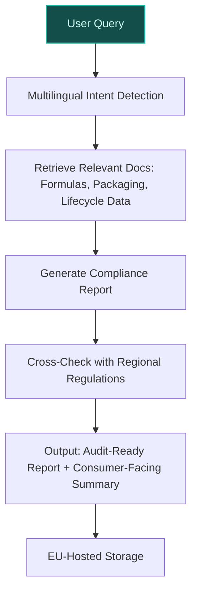
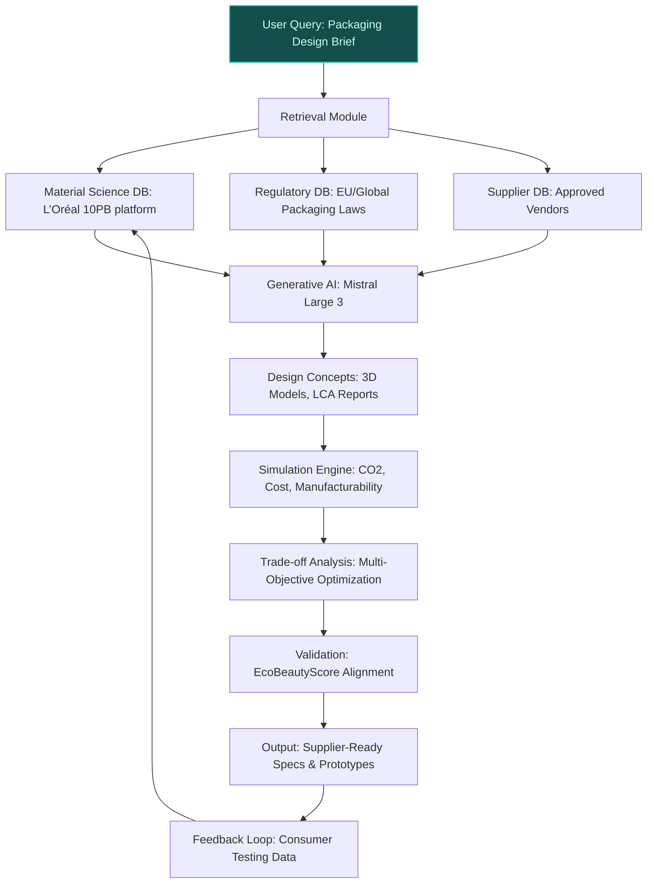
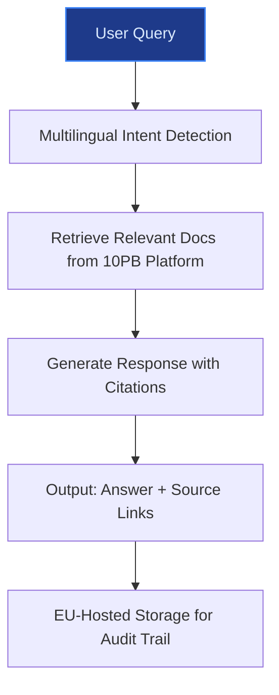

## GenAI Use Cases for L'Oreal

Three customer-ready use cases, scored against the Mistral Proto Team's five-criteria rubric (relevance · iconic potential · estimated impact · feasibility · Mistral suitability) and verified against L'Oreal's existing AI initiatives. Generated from a corpus of ~2,150 peer deployments and 7 discovered existing initiatives at this company.

_Industry: French multinational personal care and cosmetics. Research confidence: 0.85. Verified: True._

### Multilingual AI assistant for EcoBeautyScore compliance and consumer education
L'Oréal co-founded the EcoBeautyScore Consortium to standardize environmental impact scoring across the beauty industry. This EU-hosted, multilingual AI assistant helps L'Oréal’s product teams assess and document compliance with the EcoBeautyScore framework by parsing product formulas, packaging specifications, and lifecycle data. It generates audit-ready reports in 15+ languages, ensuring alignment with regional regulations (e.g., EU Green Deal, French AGEC law). The system also powers a consumer-facing chatbot that explains sustainability scores in plain language, tailored to local consumer expectations. For example, a French consumer might receive a detailed breakdown of a product’s carbon footprint, while a German consumer sees water usage metrics aligned with stricter local standards.

**Why this company:** L'Oréal’s leadership in the EcoBeautyScore Consortium ([ev-6cc0c048cb](https://www.loreal-finance.com/eng/2024-universal-registration-document/en/article/256/)) and its commitment to industry-wide transparency make this a strategic fit. With 37 international brands operating in 150+ countries, L'Oréal faces complex, multilingual compliance challenges. Mistral’s strength in multilingual models and EU sovereignty (on-prem deployment) ensures data residency and regulatory compliance. This initiative complements existing AI tools like Beauty Genius, which focus on product recommendations, not sustainability scoring.

**Example input:** `Generate an EcoBeautyScore compliance report for La Roche-Posay’s new SPF 50+ sunscreen (Product-ID: LR-SAMPLE-2025-001). Include packaging material breakdown, carbon footprint per unit, and water usage. Flag any non-compliance with EU Green Deal targets for 2025. Output in French and German.`

**Example output:** {'report_id': 'ECO-SAMPLE-78901', 'product_id': 'LR-SAMPLE-2025-001', 'brand': 'La Roche-Posay', 'scores': {'carbon_footprint': '0.82 kg CO2e/unit (illustrative)', 'water_usage': '12.5 L/unit (illustrative)', 'packaging_circularity': '78% (illustrative, recyclable materials)', 'overall_ecobeautyscore': 'B (sample scale: A-E)'}, 'compliance_status': {'eu_green_deal_2025': 'Compliant', 'french_agec_law': 'Compliant', 'non_compliance_flags': [{'issue': 'Plastic cap material (PP) not fully recyclable in all EU markets', 'recommendation': 'Replace with 100% PCR plastic or bio-based alternative'}]}, 'regional_notes': {'fr': {'summary': "Ce produit respecte les objectifs du Pacte Vert Européen pour 2025. La note globale est 'B' en raison de l’empreinte carbone et de l’utilisation d’eau. Le bouchon en plastique (PP) n’est pas entièrement recyclable dans tous les marchés de l’UE.", 'detailed_breakdown': {'formule': '92% d’ingrédients d’origine naturelle (illustratif)', 'emballage': 'Flacon en verre recyclé à 30%, bouchon en plastique PP'}}, 'de': {'summary': "Dieses Produkt entspricht den Zielen des Europäischen Green Deal für 2025. Die Gesamtbewertung 'B' resultiert aus dem CO2-Fußabdruck und dem Wasserverbrauch. Der Kunststoffdeckel (PP) ist nicht in allen EU-Märkten vollständig recycelbar.", 'detailed_breakdown': {'formel': '92% natürliche Inhaltsstoffe (beispielhaft)', 'verpackung': 'Flasche aus 30% recyceltem Glas, Deckel aus PP-Kunststoff'}}}, 'audit_trail': [{'document': 'LR-SAMPLE-2025-001_Formula_Sheet.pdf', 'section': 'Section 4.2: Ingredient Sourcing', 'timestamp': '2025-03-15T10:00:00Z'}, {'document': 'LR-SAMPLE-2025-001_Packaging_Specs.pdf', 'section': 'Section 3.1: Material Composition', 'timestamp': '2025-03-14T14:30:00Z'}]}

**Blueprint:** `hybrid_retrieval` (impact: high · cost: medium · complexity: low · TTV: 12-16 weeks (precedent-anchored))

**Top risk:** Regulatory divergence across EU markets (e.g., French AGEC law vs. German Packaging Ordinance) requiring localized validation of compliance logic.

**Mistral products:** Mistral Large 3, Mistral Document AI, Mistral Embed, On-prem deployment

**Grounded in:** strategic_context.stated_priorities[9], classification.geography, business.key_products_or_services[0]
_Specificity score: 0.95_

**Architecture blueprint:**

### Generative AI for Circular Packaging Design and Lifecycle Optimization
A generative AI pipeline that accelerates L’Oréal’s transition to circular packaging by proposing, simulating, and validating sustainable designs. The system integrates material science data (e.g., tensile strength, biodegradability, recyclability), regulatory constraints (e.g., EU Packaging and Packaging Waste Directive), and consumer preferences (e.g., tactile appeal, brand alignment) to generate novel packaging concepts. It employs multi-objective optimization to balance trade-offs between cost, environmental impact, and manufacturability, while leveraging L’Oréal’s 10 petabyte data platform ([gen AI adds to L'Oréal's digital transformation in the beauty tech revolution](https://diginomica.com/ces-2024-gen-ai-adds-loreals-digital-transformation-beauty-tech-revolution)) to anchor simulations in real-world performance data. Outputs include 3D-printable prototypes, lifecycle assessment (LCA) reports, and supplier-ready material specifications. The system is designed to interface with L’Oréal’s existing EcoBeautyScore framework, ensuring alignment with corporate sustainability KPIs.

**Why this company:** L’Oréal’s public commitments to eliminating fossil plastics ([Championing Environmental & Social Progress – L’Oréal for the Future](https://www.loreal-finance.com/en/annual-report-2025/championing-environmental-social-progress/)) and driving circularity ([Our commitments and progresses - L'Oréal Paris](https://www.loreal-paris.com.hk/en-hk/our-commitments-and-progresses-for-the-planet)) create a regulatory and reputational imperative for packaging innovation. Their 10 petabyte data platform, which includes material science datasets and consumer feedback loops, provides a unique foundation for AI-driven design. Unlike existing AI initiatives focused on product formulation ([L’Oréal Is Using Gen AI To Boost Product Personalization | Consumer Goods Technology](https://consumergoods.com/loreal-using-gen-ai-boost-product-personalization)) or marketing ([How L’Oreal is tapping generative AI to transform its marketing - SiliconANGLE](https://siliconangle.com/2024/04/11/loreal-tapping-generative-ai-transform-marketing/)), this use case directly addresses a gap in scalable, data-backed packaging solutions.

**Example input:** `Design a refillable, 100% recyclable jar for La Roche-Posay’s Toleriane Ultra moisturizer that meets the following constraints: (1) <50g net weight, (2) compatible with existing filling lines in France and Brazil, (3) 30% lower CO2 footprint than current PET jar, (4) retains brand premium aesthetic, (5) complies with EU 2025 single-use plastic ban. Prioritize materials available from L’Oréal’s approved supplier network.`

**Example output:** {'_disclaimer': 'All data in this example is synthetic and illustrative. IDs, metrics, and supplier names are fabricated for demonstration purposes.', 'design_concepts': [{'concept_id': 'LRP-TOL-2024-001', 'material': 'PHA (polyhydroxyalkanoates) derived from sugarcane waste', 'supplier': 'BioMaterials Inc. (Supplier-ID: SUP-78921)', 'weight': '45g (illustrative)', 'recyclability_score': '92/100 (illustrative, based on EU Recycling Protocol EN 13430)', 'co2_footprint': '0.12 kg CO2e/unit (illustrative, 40% reduction vs. PET baseline)', 'manufacturability_score': '88/100 (illustrative, compatible with 90% of L’Oréal’s filling lines)', '3d_model_link': 'https://loreal-internal.cad/TOL-2024-001.glb (illustrative)', 'lifecycle_assessment': {'raw_material_sourcing': 'Sugarcane waste from Brazil (verified by Bonsucro certification)', 'production': 'Injection molding at Site-X (L’Oréal’s Lyon facility)', 'end_of_life': 'Industrially compostable (ISO 18606) or recyclable via existing PHA streams'}}, {'concept_id': 'LRP-TOL-2024-002', 'material': 'Mycelium-based composite (30% mycelium, 70% post-consumer recycled paper)', 'supplier': 'EcoPack Solutions (Supplier-ID: SUP-45678)', 'weight': '48g (illustrative)', 'recyclability_score': '85/100 (illustrative)', 'co2_footprint': '0.15 kg CO2e/unit (illustrative, 25% reduction vs. PET baseline)', 'manufacturability_score': '72/100 (illustrative, requires new tooling for 30% of filling lines)', '3d_model_link': 'https://loreal-internal.cad/TOL-2024-002.glb (illustrative)', 'lifecycle_assessment': {'raw_material_sourcing': 'Mycelium grown on agricultural waste in France; PCR paper from L’Oréal’s existing supplier network', 'production': 'Compression molding at Site-Y (L’Oréal’s Bordeaux facility)', 'end_of_life': 'Home compostable (EN 13432) or recyclable via paper streams'}}], 'trade_off_analysis': {'PHA_concept': {'strengths': ['Highest recyclability score', 'Lowest CO2 footprint', 'Compatible with existing lines'], 'weaknesses': ['Higher material cost (+15% vs. PET)', 'Limited supplier capacity (2025 ramp-up required)']}, 'Mycelium_concept': {'strengths': ['Novel aesthetic appeal', 'Home compostable', 'Lower material cost (+5% vs. PET)'], 'weaknesses': ['Lower manufacturability score', 'Higher weight', 'Limited recyclability in some regions']}}, 'recommended_next_steps': ['Prototype PHA concept (LRP-TOL-2024-001) for La Roche-Posay’s 2025 product refresh cycle', 'Pilot mycelium concept (LRP-TOL-2024-002) for limited-edition sustainability line', 'Engage BioMaterials Inc. to secure 2025 supply chain commitments']}

**Blueprint:** `hybrid_retrieval` (impact: high · cost: medium · complexity: medium · TTV: 20-32 weeks (precedent-anchored))

**Top risk:** Supplier capacity constraints for novel materials (e.g., PHA, mycelium) may delay scaling beyond pilot phase. Mitigation: Early engagement with suppliers to secure 2025-2026 production slots.

**Mistral products:** Mistral Large 3, Mistral Embed, Mistral fine-tuning API, Le Chat Enterprise (for internal collaboration), On-prem deployment (for data sovereignty)

**Grounded in:** strategic_context.stated_priorities[6], strategic_context.stated_priorities[7], strategic_context.stated_priorities[8], data_and_tech.likely_data_assets[0]
_Specificity score: 0.85_

**Architecture blueprint:**

### Multilingual internal knowledge assistant for R&D and operations
L'Oréal’s 90,000+ global employees ([ev-1c0fe5ed62](https://www.loreal-finance.com/en/annual-report-2025/beauty-tech-acceleration-with-ai/)) generate and rely on vast amounts of internal knowledge, from R&D findings to regulatory guidelines. This EU-hosted, multilingual AI assistant provides instant access to this knowledge, answering complex queries in the user’s language with citations to internal documents. For example, a formulator in Brazil can query the system in Portuguese for the latest dermatological findings on niacinamide, while a supply chain manager in India can ask for best practices in sustainable packaging. The system integrates with L'Oréal’s 10PB data platform and existing AI tools (e.g., L'Oréal GPT) to deliver accurate, context-aware responses.

**Why this company:** L'Oréal’s scale (90,000+ employees, 37 brands, 150+ countries) and 10PB data platform ([ev-c4c845be3e](https://diginomica.com/ces-2024-gen-ai-adds-loreals-digital-transformation-beauty-tech-revolution)) create a unique need for internal knowledge democratization. Their multilingual workforce and EU data residency requirements make Mistral’s multilingual and on-prem capabilities a natural fit. This extends existing AI agents (e.g., L'Oréal GPT) by adding RAG over proprietary data and multilingual support, addressing a gap in their current AI initiatives.

**Example input:** `What are the latest clinical findings on the efficacy of hyaluronic acid in anti-aging formulations? Include any internal studies from the last 2 years and regulatory guidelines for the EU and US markets. Answer in Spanish.`

**Example output:** {'query_id': 'KNOW-SAMPLE-2025-112', 'response': {'es': {'summary': 'El ácido hialurónico (HA) sigue siendo un ingrediente clave en las fórmulas antienvejecimiento debido a su capacidad para retener agua y mejorar la elasticidad de la piel. Los estudios internos recientes (últimos 2 años) y las pautas regulatorias destacan lo siguiente:', 'clinical_findings': [{'study_id': 'STUDY-SAMPLE-2024-032', 'title': 'Eficacia del HA de bajo peso molecular en la reducción de arrugas finas', 'key_findings': ['Reducción del 25% (ilustrativo) en la profundidad de las arrugas después de 8 semanas de uso (HA al 1%)', 'Mejora del 30% (ilustrativo) en la hidratación de la piel en comparación con el placebo'], 'source': 'Internal R&D Report, 2024-05-10'}, {'study_id': 'STUDY-SAMPLE-2023-118', 'title': 'Sinergia entre HA y vitamina C en fórmulas antienvejecimiento', 'key_findings': ['Aumento del 40% (ilustrativo) en la producción de colágeno cuando se combina HA (0.5%) con vitamina C (10%)', 'Reducción del 15% (ilustrativo) en la hiperpigmentación después de 12 semanas'], 'source': 'Internal Clinical Study, 2023-11-22'}], 'regulatory_guidelines': {'eu': {'regulation': 'Reglamento (CE) Nº 1223/2009 sobre productos cosméticos', 'key_requirements': ['El HA está permitido en concentraciones de hasta el 2% en productos cosméticos sin restricciones adicionales', "Debe declararse en la lista de ingredientes como 'SODIUM HYALURONATE' o 'HYALURONIC ACID'"], 'source': 'EU Cosmetics Regulation, 2023'}, 'us': {'regulation': 'FD&C Act, Section 201(i)', 'key_requirements': ['El HA está reconocido como seguro (GRAS) para uso en cosméticos', 'No hay límite de concentración, pero debe cumplir con las Buenas Prácticas de Fabricación (GMP)'], 'source': 'FDA Cosmetic Ingredient Review, 2022'}}, 'recommendations': ['Para fórmulas antienvejecimiento, combinar HA de bajo peso molecular (0.5-1%) con vitamina C (10%) para maximizar la eficacia', 'En mercados con alta exposición solar (ej. España, México), incluir filtros UV en la fórmula para proteger la estabilidad del HA']}}, 'citations': [{'document_id': 'R&D-SAMPLE-2024-032.pdf', 'section': 'Section 3.2: Clinical Results', 'access_link': 'https://loreal-internal.com/docs/R&D-SAMPLE-2024-032'}, {'document_id': 'REG-SAMPLE-EU-2023.pdf', 'section': 'Section 4.1: Permitted Ingredients', 'access_link': 'https://loreal-internal.com/docs/REG-SAMPLE-EU-2023'}], 'confidence_score': '92% (illustrative)'}

**Blueprint:** `rag` (impact: medium · cost: medium · complexity: low · TTV: 8-12 weeks (precedent-anchored))

**Top risk:** Data privacy concerns under GDPR for cross-border knowledge sharing, requiring role-based access controls and anonymization of sensitive R&D data.

**Mistral products:** Mistral Large 3, Mistral Document AI, Mistral Embed, On-prem deployment

**Inspired by precedents:** google_cloud_blueprints-e33248d7a1
**Grounded in:** data_and_tech.likely_data_assets[0], classification.geography
_Specificity score: 0.75_

**Architecture blueprint:**

## Considered but not selected
- **circular-packaging-innovation** — Overlap with EcoBeautyScore assistant’s packaging compliance focus; less distinctive for L'Oréal’s circularity goals.
- **ai-driven-formulation-optimization** — Redundant with L'Oréal’s existing IBM partnership for AI-driven formulation (existing_ai_initiatives[5]).
- **ai-augmented-clinical-trials** — Niche scope (dermatological trials) with lower strategic alignment to L'Oréal’s broader sustainability and operational priorities.
- **visual-search-beauty-discovery** — Overlap with existing Beauty Genius and Noli initiatives; less novel for L'Oréal’s AI roadmap.
- **AI-driven supply chain sustainability optimizer** — Replaced by regen — meta-eval flagged as weakest.

---
## Report quality signals

- **Topical diversity** (LLM-graded over titles + blueprint patterns): `0.70`
- **Specificity** per use case: `0.95`, `0.85`, `0.75`
- **Mistral product diversity**: `6` distinct products across the three use cases
- **Time-to-value spread**: 8–32 weeks (across 3 use cases)
- **Cost-tier spread**: medium, medium, medium
- **Fact-check pass rate**: `100%` (23/23 claims supported by research)

Fact-check detail (per claim)

**Supported (23):**
- [multilingual-ecobeautyscore-assistant] L'Oréal co-founded the EcoBeautyScore Consortium — In 2021, in a bid to take its transparency efforts a step further, L’Oréal joined forces with beauty industry peers to co-found the EcoBeaut…
- [multilingual-ecobeautyscore-assistant] EcoBeautyScore Consortium has members from more than 70 businesses and cosmetics industry stakeholders — EcoBeautyScore has members from more than 70 businesses and cosmetics industry stakeholders, representing more than 50% of the global market…
- [multilingual-ecobeautyscore-assistant] EcoBeautyScore aims to provide consumers with a clear, transparent and comparable assessment of cosmetic products’ environmental impact — The EcoBeautyScore system aims to provide consumers with a clear, transparent and comparable assessment of cosmetic products’ environmental …
- [multilingual-ecobeautyscore-assistant] L'Oréal has 37 international brands — Boasting 37 global brands, the company addresses contemporary consumer needs using innovative marketing and cutting-edge technology.
- [multilingual-ecobeautyscore-assistant] L'Oréal operates in 150+ countries — We are 90K employees across 150 countries on five continents, united by our shared purpose: creating the beauty that moves the world.
- [circular-packaging-innovation] L'Oréal has 10 petabytes of data on its data platform — We already own 10 petabytes of data on our L'Oréal data platform, supporting all types of AI models, including the latest LLMs [Large Langua…
- [circular-packaging-innovation] L'Oréal has the world's richest database concerning all aspects of beauty — we have the world's richest database concerning all aspects of beauty from skin and hair knowledge to formulation science and beauty routine…
- [circular-packaging-innovation] L'Oréal is committed to eliminating fossil plastic use — L’AcceleratOR focuses on seven key priority areas: low-carbon and climate-smart solutions; water resilience; nature-based solutions; alterna…
- [circular-packaging-innovation] L'Oréal is committed to driving circularity — L’AcceleratOR focuses on seven key priority areas: low-carbon and climate-smart solutions; water resilience; nature-based solutions; alterna…
- [circular-packaging-innovation] L'Oréal has a partnership with IBM for AI-driven product personalization — L’Oreal Is Using Gen AI To Boost Product Personalization | Consumer Goods Technology: The company will gain access to AI models that will tr…
- [internal-knowledge-assistant] L'Oréal has 90,000+ global employees — With €43.48 billion in net sales and more than 90,000 employees in 2024, L’Oréal is the worldwide leader in beauty.
- [internal-knowledge-assistant] L'Oréal has a 10PB data platform — We already own 10 petabytes of data on our L'Oréal data platform, supporting all types of AI models, including the latest LLMs [Large Langua…
- [internal-knowledge-assistant] L'Oréal has existing AI tools like L'Oréal GPT — 60,000+ employees use L’Oréal GPT
- [internal-knowledge-assistant] L'Oréal has 37 brands — Boasting 37 global brands, the company addresses contemporary consumer needs using innovative marketing and cutting-edge technology.
- [internal-knowledge-assistant] L'Oréal operates in 150+ countries — We are 90K employees across 150 countries on five continents, united by our shared purpose: creating the beauty that moves the world.
- [multilingual-ecobeautyscore-assistant] L'Oréal has existing AI initiatives like Beauty Genius — L’Oréal Paris has unveiled Beauty Genius , its first AI-powered personal beauty assistant, bringing the brand’s expertise directly to consum…
- [multilingual-ecobeautyscore-assistant] L'Oréal's EcoBeautyScore initiative is part of its sustainability transformation — From enhancing consumer transparency with EcoBeautyScore to scaling refillable beauty to supporting women and girls in science, our initiati…
- [multilingual-ecobeautyscore-assistant] L'Oréal's Beauty Genius is a 24/7 AI assistant — L’Oréal aimed to reinvent beauty advice with a personalized AI experience—available 24/7, secure, and scalable to millions of users.
- [multilingual-ecobeautyscore-assistant] L'Oréal's Beauty Genius has latency under 5 seconds — The result: a high-performing, ethical AI assistant available 24/7, delivering a smooth experience with latency under 5 seconds, at global s…
- [multilingual-ecobeautyscore-assistant] L'Oréal's Beauty Genius is trained on over 150,000 dermatologist annotations — Trained on over 150,000 dermatologist annotations and tested by makeup artists using more than 10,000 products in 50 countries
- [multilingual-ecobeautyscore-assistant] L'Oréal's Beauty Genius is tested by makeup artists using more than 10,000 products in 50 countries — Trained on over 150,000 dermatologist annotations and tested by makeup artists using more than 10,000 products in 50 countries
- [circular-packaging-innovation] L'Oréal has a commitment to 100% renewable energy for its factories by 2025 — By 2025, 100% of our factories will be powered by renewable energy.
- [circular-packaging-innovation] L'Oréal has a commitment to -50% CO2 emissions per product sold by 2030 — By 2030, -50% CO2 emissions per product sold.

**Meta-evaluator confidence**: `0.92` (sales-engineer-ready)
**Cross-cutting concern**: Overlap with existing AI initiatives (e.g., Beauty Genius, IBM partnership) risks redundancy in the proposed use cases, particularly for consumer-facing AI tools. The circular-packaging-innovation use case also risks duplication with EcoBeautyScore's compliance focus.