# Pipeline blueprint (architecture)

Static view of the pipeline regardless of run timing — shows agents,
models, and gates. The chronological execution log follows below.

```mermaid
flowchart TD
    Start([User: company name]) --> R
    R["<b>1. Research</b><br/>parallel: Wikipedia · Tavily news ·<br/>existing initiatives · live verification<br/><i>mistral-medium</i> synthesis"]
    R --> G["<b>1b. Gap-fill</b><br/>identify missing fields →<br/><i>mistral-small</i> generates queries →<br/>Tavily search per field →<br/><i>mistral-small</i> per-field extraction"]
    G --> Conf{Confidence ≥ 0.5<br/>OR verified<br/>OR ≥ 1 existing initiative?}
    Conf -->|no| Refuse([Refusal])
    Conf -->|yes| Ret
    Ret["<b>2. Retrieve</b><br/><i>mistral-embed</i> on company query →<br/>cosine top-K + industry/depth filter +<br/>MMR diversification"]
    Ret --> Gen["<b>3. Generate 12 candidates</b><br/><i>mistral-medium</i> with web_search tool<br/>(Tavily + deep-read) — fact citations<br/>flow into the EvidenceLedger"]
    Gen --> Score["<b>4. Score</b><br/>self-consistency: 2 parallel passes<br/><i>mistral-small</i> @ T=0.2 and T=0.4 →<br/>aggregate weighted scores"]
    Score --> Verify["<b>5. Per-candidate verify</b><br/>top-3: Tavily search + deep-read +<br/><i>mistral-small</i> verdict (pass /<br/>partial / confirmed_existing)"]
    Verify --> Enrich["<b>6. Enrich</b><br/><i>mistral-large</i> drafts customer-facing<br/>prose for 3 use cases (or<br/><i>mistral-medium</i> on fast tier)"]
    Enrich --> NumScrub["<b>6a. Numeric scrub</b><br/>flag any number not in cited content"]
    NumScrub --> Polish["<b>6b. Polish</b><br/><i>mistral-small</i> per use case (parallel):<br/>convert markers→qualitative,<br/>(ev-XXX)→[title](url)"]
    Polish --> Attr["<b>6c. Attribution check</b><br/><i>mistral-small</i> per use case (parallel):<br/>fix corpus-ID ↔ company mismatches"]
    Attr --> Meta["<b>7. Meta-evaluation</b><br/><i>mistral-medium</i> reviews report against<br/>cited precedents + ledger entries:<br/>strict claim verification"]
    Meta --> RegenQ{confidence < 0.6<br/>AND not fast tier?}
    RegenQ -->|yes| Regen["<b>7b. Targeted regen</b><br/><i>mistral-large</i> re-enriches just the<br/>weakest use case with the next-best<br/>near-miss; re-runs meta-eval"]
    RegenQ -->|no| QS
    Regen --> QS
    QS["<b>Quality signals</b><br/>LLM-graded diversity + specificity,<br/>fact-check pass rate, TTV/cost spread"]
    QS --> Render([Markdown report + trace])

    classDef agent fill:#fef3c7,stroke:#f59e0b
    classDef gate fill:#dbeafe,stroke:#3b82f6
    classDef io fill:#dcfce7,stroke:#16a34a
    class R,G,Ret,Gen,Score,Verify,Enrich,NumScrub,Polish,Attr,Meta,Regen,QS agent
    class Conf,RegenQ gate
    class Start,Refuse,Render io
```

## Execution trace — L'Oreal

Started: `2026-05-09T14:06:19.749662+00:00`. Total wall time: `252.9s` across `50` recorded actions.

### Per-step time totals

| Step | Calls | Total time | Avg time |
|---|---:|---:|---:|
| `research` | 1 | 9.71s | 9707ms |
| `gap_fill` | 4 | 4.10s | 1026ms |
| `retrieve` | 2 | 0.56s | 278ms |
| `generate` | 2 | 38.82s | 19408ms |
| `generate.web_search` | 2 | 5.34s | 2668ms |
| `score` | 2 | 33.59s | 16796ms |
| `verify` | 6 | 14.79s | 2466ms |
| `enrich` | 1 | 79.25s | 79254ms |
| `meta_eval` | 2 | 28.68s | 14339ms |
| `regen_one` | 1 | 40.81s | 40808ms |
| `polish` | 1 | 4.06s | 4057ms |
| `source_judge` | 24 | 16.83s | 701ms |
| `quality_signals` | 2 | 3.69s | 1846ms |

### Chronological event log

- `14:06:22.702` **[research]** `mistral-medium-2604.chat.complete` — 9707ms
   - inputs: synthesize CompanyContext for L'Oreal | depth=medium
   - outputs: industry='French multinational personal care and cosmetics' verified=True conf=0.75
- `14:06:32.411` **[gap_fill]** `mistral-small-2603.chat.complete` — 946ms
   - inputs: generate gap queries | fields=['business_model', 'products', 'data_assets', 'priorities']
   - outputs: queries=4
- `14:06:38.335` **[gap_fill]** `mistral-small-2603.chat.complete` — 1278ms
   - inputs: layer-2 extract field=priorities
   - outputs: items=19
- `14:06:38.339` **[gap_fill]** `mistral-small-2603.chat.complete` — 1144ms
   - inputs: layer-2 extract field=data_assets
   - outputs: items=6
- `14:06:38.342` **[gap_fill]** `mistral-small-2603.chat.complete` — 736ms
   - inputs: layer-2 extract field=products
   - outputs: items=12
- `14:06:39.614` **[retrieve]** `mistral-embed.embeddings.create` — 221ms
   - inputs: company_query | industries='French multinational personal care and cosmetics'
   - outputs: embedded 1024-dim query vector
- `14:06:39.836` **[retrieve]** `precedent_corpus.cosine_topk` — 336ms
   - inputs: k=8 min_depth=0.4 target="L'Oreal"
   - outputs: retrieved 8 | mmr=True | top_sim=0.772
- `14:06:42.438` **[generate]** `mistral-medium-2604.chat.complete` — 2060ms
   - inputs: iteration=0 tool_calls_used=0/2 tools=on
   - outputs: tool_calls=4 | content_chars=0
- `14:06:44.515` **[generate.web_search]** `tavily.search` — 2902ms
   - inputs: query="L'Oréal EcoBeautyScore 2024 details and scope"
   - outputs: 2 raw results
- `14:06:48.180` **[generate.web_search]** `tavily.search` — 2434ms
   - inputs: query="L'Oréal 10 petabytes data platform beauty routines formulation science"
   - outputs: 2 raw results
- `14:06:50.930` **[generate]** `mistral-medium-2604.chat.complete` — 36757ms
   - inputs: iteration=1 tool_calls_used=2/2 tools=off
   - outputs: tool_calls=0 | content_chars=23889
- `14:07:27.994` **[score]** `mistral-small-2603.chat.complete` — 16511ms
   - inputs: self-consistency pass T=0.2
   - outputs: scored 12 candidates
- `14:07:28.000` **[score]** `mistral-small-2603.chat.complete` — 17081ms
   - inputs: self-consistency pass T=0.4
   - outputs: scored 12 candidates
- `14:07:45.110` **[verify]** `tavily.search` — 2597ms
   - inputs: candidate=multilingual-ecobeautyscore-assistant | query="L'Oreal Multilingual AI assistant for EcoBeautyScore complia"
   - outputs: 4 results
- `14:07:45.111` **[verify]** `tavily.search` — 2109ms
   - inputs: candidate=supply-chain-sustainability-optimizer | query="L'Oreal AI-driven supply chain sustainability optimizer Mist"
   - outputs: 4 results
- `14:07:45.111` **[verify]** `tavily.search` — 2530ms
   - inputs: candidate=circular-packaging-innovation | query="L'Oreal Generative AI for circular packaging design and mate"
   - outputs: 4 results
- `14:07:48.045` **[verify]** `mistral-small-2603.chat.complete` — 1812ms
   - inputs: verdict for supply-chain-sustainability-optimizer
   - outputs: verdict='pass'
- `14:07:48.522` **[verify]** `mistral-small-2603.chat.complete` — 3846ms
   - inputs: verdict for circular-packaging-innovation
   - outputs: verdict='confirmed_existing'
- `14:07:48.796` **[verify]** `mistral-small-2603.chat.complete` — 1901ms
   - inputs: verdict for multilingual-ecobeautyscore-assistant
   - outputs: verdict='pass'
- `14:07:52.371` **[enrich]** `mistral-large-2512.chat.complete` — 79254ms
   - inputs: tier=standard top_3=['multilingual-ecobeautyscore-assistant', 'supply-chain-sustainability-optimizer', 'internal-knowledge-assistant']
   - outputs: enriched 3 use cases
- `14:09:11.650` **[meta_eval]** `mistral-medium-2604.chat.complete` — 12493ms
   - inputs: reviewing 3 use cases
   - outputs: review + claims
- `14:09:24.145` **[regen_one]** `mistral-large-2512.chat.complete` — 40808ms
   - inputs: replace weakest=supply-chain-sustainability-optimizer with circular-packaging-innovation
   - outputs: single use case enriched
- `14:10:04.962` **[polish]** `mistral-small-2603.chat.complete` — 4057ms
   - inputs: use_case=circular-packaging-innovation unanchored=True opaque_ev=False
   - outputs: polished 5 fields
- `14:10:09.021` **[meta_eval]** `mistral-medium-2604.chat.complete` — 16185ms
   - inputs: reviewing 3 use cases
   - outputs: review + claims
- `14:10:25.208` **[source_judge]** `mistral-small-2603.judge_claim_sources` — 3492ms
   - inputs: pairs=23
   - outputs: judged 23 pairs
- `14:10:25.209` **[source_judge]** `mistral-small-2603.chat.complete` — 525ms
   - inputs: claim="L'Oréal co-founded the EcoBeautyScore Consortium"
   - outputs: supports=True
- `14:10:25.211` **[source_judge]** `mistral-small-2603.chat.complete` — 669ms
   - inputs: claim='EcoBeautyScore Consortium has members from more than 70 busi'
   - outputs: supports=True
- `14:10:25.213` **[source_judge]** `mistral-small-2603.chat.complete` — 635ms
   - inputs: claim='EcoBeautyScore aims to provide consumers with a clear, trans'
   - outputs: supports=True
- `14:10:25.217` **[source_judge]** `mistral-small-2603.chat.complete` — 704ms
   - inputs: claim="L'Oréal has 37 international brands"
   - outputs: supports=True
- `14:10:25.734` **[source_judge]** `mistral-small-2603.chat.complete` — 510ms
   - inputs: claim="L'Oréal operates in 150+ countries"
   - outputs: supports=True
- `14:10:25.848` **[source_judge]** `mistral-small-2603.chat.complete` — 796ms
   - inputs: claim="L'Oréal has 10 petabytes of data on its data platform"
   - outputs: supports=True
- `14:10:25.880` **[source_judge]** `mistral-small-2603.chat.complete` — 486ms
   - inputs: claim="L'Oréal has the world's richest database concerning all aspe"
   - outputs: supports=True
- `14:10:25.921` **[source_judge]** `mistral-small-2603.chat.complete` — 589ms
   - inputs: claim="L'Oréal is committed to eliminating fossil plastic use"
   - outputs: supports=True
- `14:10:26.244` **[source_judge]** `mistral-small-2603.chat.complete` — 569ms
   - inputs: claim="L'Oréal is committed to driving circularity"
   - outputs: supports=True
- `14:10:26.366` **[source_judge]** `mistral-small-2603.chat.complete` — 464ms
   - inputs: claim="L'Oréal has a partnership with IBM for AI-driven product per"
   - outputs: supports=True
- `14:10:26.510` **[source_judge]** `mistral-small-2603.chat.complete` — 485ms
   - inputs: claim="L'Oréal has 90,000+ global employees"
   - outputs: supports=True
- `14:10:26.644` **[source_judge]** `mistral-small-2603.chat.complete` — 474ms
   - inputs: claim="L'Oréal has a 10PB data platform"
   - outputs: supports=True
- `14:10:26.813` **[source_judge]** `mistral-small-2603.chat.complete` — 516ms
   - inputs: claim="L'Oréal has existing AI tools like L'Oréal GPT"
   - outputs: supports=True
- `14:10:26.831` **[source_judge]** `mistral-small-2603.chat.complete` — 564ms
   - inputs: claim="L'Oréal has 37 brands"
   - outputs: supports=True
- `14:10:26.996` **[source_judge]** `mistral-small-2603.chat.complete` — 968ms
   - inputs: claim="L'Oréal operates in 150+ countries"
   - outputs: supports=True
- `14:10:27.119` **[source_judge]** `mistral-small-2603.chat.complete` — 662ms
   - inputs: claim="L'Oréal has existing AI initiatives like Beauty Genius"
   - outputs: supports=True
- `14:10:27.329` **[source_judge]** `mistral-small-2603.chat.complete` — 642ms
   - inputs: claim="L'Oréal's EcoBeautyScore initiative is part of its sustainab"
   - outputs: supports=True
- `14:10:27.394` **[source_judge]** `mistral-small-2603.chat.complete` — 568ms
   - inputs: claim="L'Oréal's Beauty Genius is a 24/7 AI assistant"
   - outputs: supports=True
- `14:10:27.781` **[source_judge]** `mistral-small-2603.chat.complete` — 404ms
   - inputs: claim="L'Oréal's Beauty Genius has latency under 5 seconds"
   - outputs: supports=True
- `14:10:27.964` **[source_judge]** `mistral-small-2603.chat.complete` — 474ms
   - inputs: claim="L'Oréal's Beauty Genius is trained on over 150,000 dermatolo"
   - outputs: supports=True
- `14:10:27.968` **[source_judge]** `mistral-small-2603.chat.complete` — 512ms
   - inputs: claim="L'Oréal's Beauty Genius is tested by makeup artists using mo"
   - outputs: supports=True
- `14:10:27.971` **[source_judge]** `mistral-small-2603.chat.complete` — 606ms
   - inputs: claim="L'Oréal has a commitment to 100% renewable energy for its fa"
   - outputs: supports=True
- `14:10:28.185` **[source_judge]** `mistral-small-2603.chat.complete` — 515ms
   - inputs: claim="L'Oréal has a commitment to -50% CO2 emissions per product s"
   - outputs: supports=True
- `14:10:28.913` **[quality_signals]** `mistral-small-2603.chat.complete` — 2571ms
   - inputs: specificity grade (3 use cases)
   - outputs: scored 3 use cases
- `14:10:31.484` **[quality_signals]** `mistral-small-2603.chat.complete` — 1121ms
   - inputs: diversity grade
   - outputs: diversity=0.7

## Mermaid sequence diagram (execution)

```mermaid
sequenceDiagram
    autonumber
    participant pipeline as pipeline
    participant mistral_medium_2604 as mistral-medium-2604
    participant mistral_small_2603 as mistral-small-2603
    participant mistral_embed as mistral-embed
    participant precedent_corpus as precedent_corpus
    participant tavily as tavily
    participant mistral_large_2512 as mistral-large-2512
    pipeline->>mistral_medium_2604: research: chat.complete (9707ms)
    mistral_medium_2604-->>pipeline: industry='French multinational personal care and cosmetics' 
    pipeline->>mistral_small_2603: gap_fill: chat.complete (946ms)
    mistral_small_2603-->>pipeline: queries=4
    pipeline->>mistral_small_2603: gap_fill: chat.complete (1278ms)
    mistral_small_2603-->>pipeline: items=19
    pipeline->>mistral_small_2603: gap_fill: chat.complete (1144ms)
    mistral_small_2603-->>pipeline: items=6
    pipeline->>mistral_small_2603: gap_fill: chat.complete (736ms)
    mistral_small_2603-->>pipeline: items=12
    pipeline->>mistral_embed: retrieve: embeddings.create (221ms)
    mistral_embed-->>pipeline: embedded 1024-dim query vector
    pipeline->>precedent_corpus: retrieve: cosine_topk (336ms)
    precedent_corpus-->>pipeline: retrieved 8 | mmr=True | top_sim=0.772
    pipeline->>mistral_medium_2604: generate: chat.complete (2060ms)
    mistral_medium_2604-->>pipeline: tool_calls=4 | content_chars=0
    pipeline->>tavily: generate.web_search: search (2902ms)
    tavily-->>pipeline: 2 raw results
    pipeline->>tavily: generate.web_search: search (2434ms)
    tavily-->>pipeline: 2 raw results
    pipeline->>mistral_medium_2604: generate: chat.complete (36757ms)
    mistral_medium_2604-->>pipeline: tool_calls=0 | content_chars=23889
    pipeline->>mistral_small_2603: score: chat.complete (16511ms)
    mistral_small_2603-->>pipeline: scored 12 candidates
    pipeline->>mistral_small_2603: score: chat.complete (17081ms)
    mistral_small_2603-->>pipeline: scored 12 candidates
    pipeline->>tavily: verify: search (2597ms)
    tavily-->>pipeline: 4 results
    pipeline->>tavily: verify: search (2109ms)
    tavily-->>pipeline: 4 results
    pipeline->>tavily: verify: search (2530ms)
    tavily-->>pipeline: 4 results
    pipeline->>mistral_small_2603: verify: chat.complete (1812ms)
    mistral_small_2603-->>pipeline: verdict='pass'
    pipeline->>mistral_small_2603: verify: chat.complete (3846ms)
    mistral_small_2603-->>pipeline: verdict='confirmed_existing'
    pipeline->>mistral_small_2603: verify: chat.complete (1901ms)
    mistral_small_2603-->>pipeline: verdict='pass'
    pipeline->>mistral_large_2512: enrich: chat.complete (79254ms)
    mistral_large_2512-->>pipeline: enriched 3 use cases
    pipeline->>mistral_medium_2604: meta_eval: chat.complete (12493ms)
    mistral_medium_2604-->>pipeline: review + claims
    pipeline->>mistral_large_2512: regen_one: chat.complete (40808ms)
    mistral_large_2512-->>pipeline: single use case enriched
    pipeline->>mistral_small_2603: polish: chat.complete (4057ms)
    mistral_small_2603-->>pipeline: polished 5 fields
    pipeline->>mistral_medium_2604: meta_eval: chat.complete (16185ms)
    mistral_medium_2604-->>pipeline: review + claims
    pipeline->>mistral_small_2603: source_judge: judge_claim_sources (3492ms)
    mistral_small_2603-->>pipeline: judged 23 pairs
    pipeline->>mistral_small_2603: source_judge: chat.complete (525ms)
    mistral_small_2603-->>pipeline: supports=True
    pipeline->>mistral_small_2603: source_judge: chat.complete (669ms)
    mistral_small_2603-->>pipeline: supports=True
    pipeline->>mistral_small_2603: source_judge: chat.complete (635ms)
    mistral_small_2603-->>pipeline: supports=True
    pipeline->>mistral_small_2603: source_judge: chat.complete (704ms)
    mistral_small_2603-->>pipeline: supports=True
    pipeline->>mistral_small_2603: source_judge: chat.complete (510ms)
    mistral_small_2603-->>pipeline: supports=True
    pipeline->>mistral_small_2603: source_judge: chat.complete (796ms)
    mistral_small_2603-->>pipeline: supports=True
    pipeline->>mistral_small_2603: source_judge: chat.complete (486ms)
    mistral_small_2603-->>pipeline: supports=True
    pipeline->>mistral_small_2603: source_judge: chat.complete (589ms)
    mistral_small_2603-->>pipeline: supports=True
    pipeline->>mistral_small_2603: source_judge: chat.complete (569ms)
    mistral_small_2603-->>pipeline: supports=True
    pipeline->>mistral_small_2603: source_judge: chat.complete (464ms)
    mistral_small_2603-->>pipeline: supports=True
    pipeline->>mistral_small_2603: source_judge: chat.complete (485ms)
    mistral_small_2603-->>pipeline: supports=True
    pipeline->>mistral_small_2603: source_judge: chat.complete (474ms)
    mistral_small_2603-->>pipeline: supports=True
    pipeline->>mistral_small_2603: source_judge: chat.complete (516ms)
    mistral_small_2603-->>pipeline: supports=True
    pipeline->>mistral_small_2603: source_judge: chat.complete (564ms)
    mistral_small_2603-->>pipeline: supports=True
    pipeline->>mistral_small_2603: source_judge: chat.complete (968ms)
    mistral_small_2603-->>pipeline: supports=True
    pipeline->>mistral_small_2603: source_judge: chat.complete (662ms)
    mistral_small_2603-->>pipeline: supports=True
    pipeline->>mistral_small_2603: source_judge: chat.complete (642ms)
    mistral_small_2603-->>pipeline: supports=True
    pipeline->>mistral_small_2603: source_judge: chat.complete (568ms)
    mistral_small_2603-->>pipeline: supports=True
    pipeline->>mistral_small_2603: source_judge: chat.complete (404ms)
    mistral_small_2603-->>pipeline: supports=True
    pipeline->>mistral_small_2603: source_judge: chat.complete (474ms)
    mistral_small_2603-->>pipeline: supports=True
    pipeline->>mistral_small_2603: source_judge: chat.complete (512ms)
    mistral_small_2603-->>pipeline: supports=True
    pipeline->>mistral_small_2603: source_judge: chat.complete (606ms)
    mistral_small_2603-->>pipeline: supports=True
    pipeline->>mistral_small_2603: source_judge: chat.complete (515ms)
    mistral_small_2603-->>pipeline: supports=True
    pipeline->>mistral_small_2603: quality_signals: chat.complete (2571ms)
    mistral_small_2603-->>pipeline: scored 3 use cases
    pipeline->>mistral_small_2603: quality_signals: chat.complete (1121ms)
    mistral_small_2603-->>pipeline: diversity=0.7
```

