# Pipeline blueprint (architecture)

Static view of the pipeline regardless of run timing — shows agents,
models, and gates. The chronological execution log follows below.

```mermaid
flowchart TD
    Start([User: company name]) --> R
    R["<b>1. Research</b><br/>parallel: Wikipedia · Tavily news ·<br/>existing initiatives · live verification<br/><i>mistral-medium</i> synthesis"]
    R --> G["<b>1b. Gap-fill</b><br/>identify missing fields →<br/><i>mistral-small</i> generates queries →<br/>Tavily search per field →<br/><i>mistral-small</i> per-field extraction"]
    G --> Conf{Confidence ≥ 0.5<br/>OR verified<br/>OR ≥ 1 existing initiative?}
    Conf -->|no| Refuse([Refusal])
    Conf -->|yes| Ret
    Ret["<b>2. Retrieve</b><br/><i>mistral-embed</i> on company query →<br/>cosine top-K + industry/depth filter +<br/>MMR diversification"]
    Ret --> Gen["<b>3. Generate 12 candidates</b><br/><i>mistral-medium</i> with web_search tool<br/>(Tavily + deep-read) — fact citations<br/>flow into the EvidenceLedger"]
    Gen --> Score["<b>4. Score</b><br/>self-consistency: 2 parallel passes<br/><i>mistral-small</i> @ T=0.2 and T=0.4 →<br/>aggregate weighted scores"]
    Score --> Verify["<b>5. Per-candidate verify</b><br/>top-3: Tavily search + deep-read +<br/><i>mistral-small</i> verdict (pass /<br/>partial / confirmed_existing)"]
    Verify --> Enrich["<b>6. Enrich</b><br/><i>mistral-large</i> drafts customer-facing<br/>prose for 3 use cases (or<br/><i>mistral-medium</i> on fast tier)"]
    Enrich --> NumScrub["<b>6a. Numeric scrub</b><br/>flag any number not in cited content"]
    NumScrub --> Polish["<b>6b. Polish</b><br/><i>mistral-small</i> per use case (parallel):<br/>convert markers→qualitative,<br/>(ev-XXX)→[title](url)"]
    Polish --> Attr["<b>6c. Attribution check</b><br/><i>mistral-small</i> per use case (parallel):<br/>fix corpus-ID ↔ company mismatches"]
    Attr --> Meta["<b>7. Meta-evaluation</b><br/><i>mistral-medium</i> reviews report against<br/>cited precedents + ledger entries:<br/>strict claim verification"]
    Meta --> RegenQ{confidence < 0.6<br/>AND not fast tier?}
    RegenQ -->|yes| Regen["<b>7b. Targeted regen</b><br/><i>mistral-large</i> re-enriches just the<br/>weakest use case with the next-best<br/>near-miss; re-runs meta-eval"]
    RegenQ -->|no| QS
    Regen --> QS
    QS["<b>Quality signals</b><br/>LLM-graded diversity + specificity,<br/>fact-check pass rate, TTV/cost spread"]
    QS --> Render([Markdown report + trace])

    classDef agent fill:#fef3c7,stroke:#f59e0b
    classDef gate fill:#dbeafe,stroke:#3b82f6
    classDef io fill:#dcfce7,stroke:#16a34a
    class R,G,Ret,Gen,Score,Verify,Enrich,NumScrub,Polish,Attr,Meta,Regen,QS agent
    class Conf,RegenQ gate
    class Start,Refuse,Render io
```

## Execution trace — Mistral AI

Started: `2026-05-09T14:10:33.567447+00:00`. Total wall time: `271.2s` across `51` recorded actions.

### Per-step time totals

| Step | Calls | Total time | Avg time |
|---|---:|---:|---:|
| `research` | 1 | 8.20s | 8196ms |
| `gap_fill` | 4 | 2.58s | 644ms |
| `retrieve` | 2 | 0.56s | 280ms |
| `generate` | 2 | 32.93s | 16466ms |
| `generate.web_search` | 2 | 5.78s | 2889ms |
| `score` | 2 | 35.80s | 17902ms |
| `verify` | 6 | 20.48s | 3413ms |
| `enrich` | 1 | 53.26s | 53259ms |
| `polish` | 4 | 84.63s | 21158ms |
| `meta_eval` | 2 | 28.18s | 14091ms |
| `regen_one` | 1 | 27.98s | 27978ms |
| `web_verify` | 1 | 9.07s | 9073ms |
| `source_judge` | 20 | 31.23s | 1561ms |
| `final_qualify` | 1 | 2.45s | 2455ms |
| `quality_signals` | 2 | 4.94s | 2469ms |

### Chronological event log

- `14:10:36.210` **[research]** `mistral-medium-2604.chat.complete` — 8196ms
   - inputs: synthesize CompanyContext for Mistral AI | depth=medium
   - outputs: industry='French artificial intelligence company' verified=True conf=0.75
- `14:10:44.408` **[gap_fill]** `mistral-small-2603.chat.complete` — 984ms
   - inputs: generate gap queries | fields=['business_model', 'products', 'data_assets', 'priorities']
   - outputs: queries=4
- `14:10:50.153` **[gap_fill]** `mistral-small-2603.chat.complete` — 492ms
   - inputs: layer-2 extract field=priorities
   - outputs: items=0
- `14:10:50.157` **[gap_fill]** `mistral-small-2603.chat.complete` — 434ms
   - inputs: layer-2 extract field=data_assets
   - outputs: items=0
- `14:10:50.160` **[gap_fill]** `mistral-small-2603.chat.complete` — 668ms
   - inputs: layer-2 extract field=products
   - outputs: items=6
- `14:10:50.830` **[retrieve]** `mistral-embed.embeddings.create` — 211ms
   - inputs: company_query | industries='French artificial intelligence company'
   - outputs: embedded 1024-dim query vector
- `14:10:51.041` **[retrieve]** `precedent_corpus.cosine_topk` — 349ms
   - inputs: k=8 min_depth=0.4 target='Mistral AI'
   - outputs: retrieved 8 | mmr=True | top_sim=0.764
- `14:10:54.811` **[generate]** `mistral-medium-2604.chat.complete` — 1842ms
   - inputs: iteration=0 tool_calls_used=0/2 tools=on
   - outputs: tool_calls=3 | content_chars=0
- `14:10:56.671` **[generate.web_search]** `tavily.search` — 2241ms
   - inputs: query='Mistral AI 2025 open-weight models list and capabilities'
   - outputs: 2 raw results
- `14:11:00.506` **[generate.web_search]** `tavily.search` — 3537ms
   - inputs: query='Mistral AI 2025 partnerships and integrations latest news'
   - outputs: 2 raw results
- `14:11:04.721` **[generate]** `mistral-medium-2604.chat.complete` — 31090ms
   - inputs: iteration=1 tool_calls_used=2/2 tools=off
   - outputs: tool_calls=0 | content_chars=20109
- `14:11:36.386` **[score]** `mistral-small-2603.chat.complete` — 18157ms
   - inputs: self-consistency pass T=0.2
   - outputs: scored 12 candidates
- `14:11:36.390` **[score]** `mistral-small-2603.chat.complete` — 17647ms
   - inputs: self-consistency pass T=0.4
   - outputs: scored 12 candidates
- `14:11:54.571` **[verify]** `tavily.search` — 1968ms
   - inputs: candidate=mistral-multilingual-compliance-rules-engine | query='Mistral AI Multilingual Compliance Rules Engine for EU-Regul'
   - outputs: 4 results
- `14:11:54.572` **[verify]** `tavily.search` — 2091ms
   - inputs: candidate=mistral-legal-ai-for-eu-contracts | query='Mistral AI EU-Specific Legal AI for Contract Analysis and Co'
   - outputs: 4 results
- `14:11:54.572` **[verify]** `tavily.search` — 1928ms
   - inputs: candidate=mistral-ocv-for-document-intelligence | query='Mistral AI OCR + Vision-Language Model for Document Intellig'
   - outputs: 4 results
- `14:11:57.466` **[verify]** `mistral-small-2603.chat.complete` — 4754ms
   - inputs: verdict for mistral-multilingual-compliance-rules-engine
   - outputs: verdict='pass'
- `14:11:57.701` **[verify]** `mistral-small-2603.chat.complete` — 5006ms
   - inputs: verdict for mistral-legal-ai-for-eu-contracts
   - outputs: verdict='pass'
- `14:11:57.753` **[verify]** `mistral-small-2603.chat.complete` — 4731ms
   - inputs: verdict for mistral-ocv-for-document-intelligence
   - outputs: verdict='confirmed_existing'
- `14:12:02.711` **[enrich]** `mistral-large-2512.chat.complete` — 53259ms
   - inputs: tier=standard top_3=['mistral-voice-cloning-for-enterprise-tts', 'mistral-legal-ai-for-eu-contracts', 'mistral-model-distillation-as-a-service']
   - outputs: enriched 3 use cases
- `14:12:55.990` **[polish]** `mistral-small-2603.chat.complete` ❌ — 24311ms
   - inputs: use_case=mistral-voice-cloning-for-enterprise-tts unanchored=True opaque_ev=False
   - error: `SDKError`
- `14:12:55.994` **[polish]** `mistral-small-2603.chat.complete` — 17382ms
   - inputs: use_case=mistral-legal-ai-for-eu-contracts unanchored=True opaque_ev=False
   - outputs: polished 5 fields
- `14:12:55.998` **[polish]** `mistral-small-2603.chat.complete` ❌ — 18265ms
   - inputs: use_case=mistral-model-distillation-as-a-service unanchored=True opaque_ev=False
   - error: `SDKError`
- `14:13:20.305` **[meta_eval]** `mistral-medium-2604.chat.complete` — 14806ms
   - inputs: reviewing 3 use cases
   - outputs: review + claims
- `14:13:35.112` **[regen_one]** `mistral-large-2512.chat.complete` — 27978ms
   - inputs: replace weakest=mistral-voice-cloning-for-enterprise-tts with mistral-multilingual-compliance-rules-engine
   - outputs: single use case enriched
- `14:14:03.101` **[polish]** `mistral-small-2603.chat.complete` ❌ — 24676ms
   - inputs: use_case=mistral-multilingual-compliance-rules-engine unanchored=False opaque_ev=True
   - error: `SDKError`
- `14:14:27.779` **[meta_eval]** `mistral-medium-2604.chat.complete` — 13377ms
   - inputs: reviewing 3 use cases
   - outputs: review + claims
- `14:14:41.176` **[web_verify]** `tavily.search.rescue_unsupported_claims` — 9073ms
   - inputs: company='Mistral AI' unsupported=12 budget=12
   - outputs: rescued: verified=9 corroborated=3 of 12 attempted
- `14:14:50.252` **[source_judge]** `mistral-small-2603.judge_claim_sources` — 6843ms
   - inputs: pairs=19
   - outputs: judged 19 pairs
- `14:14:50.252` **[source_judge]** `mistral-small-2603.chat.complete` — 1327ms
   - inputs: claim='Voxtral TTS exists as a Mistral product'
   - outputs: supports=True
- `14:14:50.258` **[source_judge]** `mistral-small-2603.chat.complete` — 1118ms
   - inputs: claim='Voxtral Mini Transcribe exists as a Mistral product'
   - outputs: supports=True
- `14:14:50.263` **[source_judge]** `mistral-small-2603.chat.complete` — 1818ms
   - inputs: claim='Voxtral TTS supports zero-shot voice cloning'
   - outputs: supports=True
- `14:14:50.267` **[source_judge]** `mistral-small-2603.chat.complete` — 1262ms
   - inputs: claim='Voxtral TTS supports real-time text-to-speech in 12 European'
   - outputs: supports=False
- `14:14:51.376` **[source_judge]** `mistral-small-2603.chat.complete` — 1213ms
   - inputs: claim='Voxtral TTS supports French, German, and Spanish'
   - outputs: supports=True
- `14:14:51.529` **[source_judge]** `mistral-small-2603.chat.complete` — 921ms
   - inputs: claim='Comparable deployments at media companies have reported 60-8'
   - outputs: supports=False
- `14:14:51.580` **[source_judge]** `mistral-small-2603.chat.complete` — 3570ms
   - inputs: claim='Magistral Medium 1.2 exists as a Mistral product'
   - outputs: supports=True
- `14:14:52.081` **[source_judge]** `mistral-small-2603.chat.complete` — 624ms
   - inputs: claim='Magistral Medium 1.2 is optimized for legal reasoning and mu'
   - outputs: supports=False
- `14:14:52.450` **[source_judge]** `mistral-small-2603.chat.complete` — 1572ms
   - inputs: claim='Magistral Medium 1.2 achieves top-tier benchmarks in domain-'
   - outputs: supports=False
- `14:14:52.589` **[source_judge]** `mistral-small-2603.chat.complete` — 735ms
   - inputs: claim='OCR 3 exists as a Mistral product'
   - outputs: supports=True
- `14:14:52.705` **[source_judge]** `mistral-small-2603.chat.complete` — 1214ms
   - inputs: claim='The EU AI Act’s transparency obligations (Article 53) exist'
   - outputs: supports=True
- `14:14:53.325` **[source_judge]** `mistral-small-2603.chat.complete` — 849ms
   - inputs: claim='The EU AI Act’s systemic risk evaluations (Article 55) exist'
   - outputs: supports=False
- `14:14:53.919` **[source_judge]** `mistral-small-2603.chat.complete` — 1469ms
   - inputs: claim='Comparable deployments at financial institutions have reduce'
   - outputs: supports=False
- `14:14:54.022` **[source_judge]** `mistral-small-2603.chat.complete` — 1212ms
   - inputs: claim='Mistral Large 3 exists as a Mistral product'
   - outputs: supports=True
- `14:14:54.174` **[source_judge]** `mistral-small-2603.chat.complete` — 1550ms
   - inputs: claim='Ministral 3 8B exists as a Mistral product'
   - outputs: supports=True
- `14:14:55.150` **[source_judge]** `mistral-small-2603.chat.complete` — 764ms
   - inputs: claim='Mistral AI’s core value proposition revolves around open-wei'
   - outputs: supports=True
- `14:14:55.234` **[source_judge]** `mistral-small-2603.chat.complete` — 709ms
   - inputs: claim='Mistral AI has a family of smaller models (Ministral 3 8B/3B'
   - outputs: supports=True
- `14:14:55.387` **[source_judge]** `mistral-small-2603.chat.complete` — 1088ms
   - inputs: claim='Mistral’s co-founder has explicitly stated that most enterpr'
   - outputs: supports=False
- `14:14:55.724` **[source_judge]** `mistral-small-2603.chat.complete` — 1371ms
   - inputs: claim='Enterprises report 30-50% cost and latency reductions when m'
   - outputs: supports=False
- `14:14:57.097` **[final_qualify]** `mistral-small-2603.chat.complete` — 2455ms
   - inputs: use_case=mistral-legal-ai-for-eu-contracts unsupported=2
   - outputs: qualified 4 fields
- `14:14:59.804` **[quality_signals]** `mistral-small-2603.chat.complete` — 2820ms
   - inputs: specificity grade (3 use cases)
   - outputs: scored 3 use cases
- `14:15:02.625` **[quality_signals]** `mistral-small-2603.chat.complete` — 2119ms
   - inputs: diversity grade
   - outputs: diversity=0.95

## Mermaid sequence diagram (execution)

```mermaid
sequenceDiagram
    autonumber
    participant pipeline as pipeline
    participant mistral_medium_2604 as mistral-medium-2604
    participant mistral_small_2603 as mistral-small-2603
    participant mistral_embed as mistral-embed
    participant precedent_corpus as precedent_corpus
    participant tavily as tavily
    participant mistral_large_2512 as mistral-large-2512
    participant tavily_search as tavily.search
    pipeline->>mistral_medium_2604: research: chat.complete (8196ms)
    mistral_medium_2604-->>pipeline: industry='French artificial intelligence company' verified=T
    pipeline->>mistral_small_2603: gap_fill: chat.complete (984ms)
    mistral_small_2603-->>pipeline: queries=4
    pipeline->>mistral_small_2603: gap_fill: chat.complete (492ms)
    mistral_small_2603-->>pipeline: items=0
    pipeline->>mistral_small_2603: gap_fill: chat.complete (434ms)
    mistral_small_2603-->>pipeline: items=0
    pipeline->>mistral_small_2603: gap_fill: chat.complete (668ms)
    mistral_small_2603-->>pipeline: items=6
    pipeline->>mistral_embed: retrieve: embeddings.create (211ms)
    mistral_embed-->>pipeline: embedded 1024-dim query vector
    pipeline->>precedent_corpus: retrieve: cosine_topk (349ms)
    precedent_corpus-->>pipeline: retrieved 8 | mmr=True | top_sim=0.764
    pipeline->>mistral_medium_2604: generate: chat.complete (1842ms)
    mistral_medium_2604-->>pipeline: tool_calls=3 | content_chars=0
    pipeline->>tavily: generate.web_search: search (2241ms)
    tavily-->>pipeline: 2 raw results
    pipeline->>tavily: generate.web_search: search (3537ms)
    tavily-->>pipeline: 2 raw results
    pipeline->>mistral_medium_2604: generate: chat.complete (31090ms)
    mistral_medium_2604-->>pipeline: tool_calls=0 | content_chars=20109
    pipeline->>mistral_small_2603: score: chat.complete (18157ms)
    mistral_small_2603-->>pipeline: scored 12 candidates
    pipeline->>mistral_small_2603: score: chat.complete (17647ms)
    mistral_small_2603-->>pipeline: scored 12 candidates
    pipeline->>tavily: verify: search (1968ms)
    tavily-->>pipeline: 4 results
    pipeline->>tavily: verify: search (2091ms)
    tavily-->>pipeline: 4 results
    pipeline->>tavily: verify: search (1928ms)
    tavily-->>pipeline: 4 results
    pipeline->>mistral_small_2603: verify: chat.complete (4754ms)
    mistral_small_2603-->>pipeline: verdict='pass'
    pipeline->>mistral_small_2603: verify: chat.complete (5006ms)
    mistral_small_2603-->>pipeline: verdict='pass'
    pipeline->>mistral_small_2603: verify: chat.complete (4731ms)
    mistral_small_2603-->>pipeline: verdict='confirmed_existing'
    pipeline->>mistral_large_2512: enrich: chat.complete (53259ms)
    mistral_large_2512-->>pipeline: enriched 3 use cases
    pipeline->>mistral_small_2603: polish: chat.complete (24311ms) ERR
    pipeline->>mistral_small_2603: polish: chat.complete (17382ms)
    mistral_small_2603-->>pipeline: polished 5 fields
    pipeline->>mistral_small_2603: polish: chat.complete (18265ms) ERR
    pipeline->>mistral_medium_2604: meta_eval: chat.complete (14806ms)
    mistral_medium_2604-->>pipeline: review + claims
    pipeline->>mistral_large_2512: regen_one: chat.complete (27978ms)
    mistral_large_2512-->>pipeline: single use case enriched
    pipeline->>mistral_small_2603: polish: chat.complete (24676ms) ERR
    pipeline->>mistral_medium_2604: meta_eval: chat.complete (13377ms)
    mistral_medium_2604-->>pipeline: review + claims
    pipeline->>tavily_search: web_verify: rescue_unsupported_claims (9073ms)
    tavily_search-->>pipeline: rescued: verified=9 corroborated=3 of 12 attempted
    pipeline->>mistral_small_2603: source_judge: judge_claim_sources (6843ms)
    mistral_small_2603-->>pipeline: judged 19 pairs
    pipeline->>mistral_small_2603: source_judge: chat.complete (1327ms)
    mistral_small_2603-->>pipeline: supports=True
    pipeline->>mistral_small_2603: source_judge: chat.complete (1118ms)
    mistral_small_2603-->>pipeline: supports=True
    pipeline->>mistral_small_2603: source_judge: chat.complete (1818ms)
    mistral_small_2603-->>pipeline: supports=True
    pipeline->>mistral_small_2603: source_judge: chat.complete (1262ms)
    mistral_small_2603-->>pipeline: supports=False
    pipeline->>mistral_small_2603: source_judge: chat.complete (1213ms)
    mistral_small_2603-->>pipeline: supports=True
    pipeline->>mistral_small_2603: source_judge: chat.complete (921ms)
    mistral_small_2603-->>pipeline: supports=False
    pipeline->>mistral_small_2603: source_judge: chat.complete (3570ms)
    mistral_small_2603-->>pipeline: supports=True
    pipeline->>mistral_small_2603: source_judge: chat.complete (624ms)
    mistral_small_2603-->>pipeline: supports=False
    pipeline->>mistral_small_2603: source_judge: chat.complete (1572ms)
    mistral_small_2603-->>pipeline: supports=False
    pipeline->>mistral_small_2603: source_judge: chat.complete (735ms)
    mistral_small_2603-->>pipeline: supports=True
    pipeline->>mistral_small_2603: source_judge: chat.complete (1214ms)
    mistral_small_2603-->>pipeline: supports=True
    pipeline->>mistral_small_2603: source_judge: chat.complete (849ms)
    mistral_small_2603-->>pipeline: supports=False
    pipeline->>mistral_small_2603: source_judge: chat.complete (1469ms)
    mistral_small_2603-->>pipeline: supports=False
    pipeline->>mistral_small_2603: source_judge: chat.complete (1212ms)
    mistral_small_2603-->>pipeline: supports=True
    pipeline->>mistral_small_2603: source_judge: chat.complete (1550ms)
    mistral_small_2603-->>pipeline: supports=True
    pipeline->>mistral_small_2603: source_judge: chat.complete (764ms)
    mistral_small_2603-->>pipeline: supports=True
    pipeline->>mistral_small_2603: source_judge: chat.complete (709ms)
    mistral_small_2603-->>pipeline: supports=True
    pipeline->>mistral_small_2603: source_judge: chat.complete (1088ms)
    mistral_small_2603-->>pipeline: supports=False
    pipeline->>mistral_small_2603: source_judge: chat.complete (1371ms)
    mistral_small_2603-->>pipeline: supports=False
    pipeline->>mistral_small_2603: final_qualify: chat.complete (2455ms)
    mistral_small_2603-->>pipeline: qualified 4 fields
    pipeline->>mistral_small_2603: quality_signals: chat.complete (2820ms)
    mistral_small_2603-->>pipeline: scored 3 use cases
    pipeline->>mistral_small_2603: quality_signals: chat.complete (2119ms)
    mistral_small_2603-->>pipeline: diversity=0.95
```

