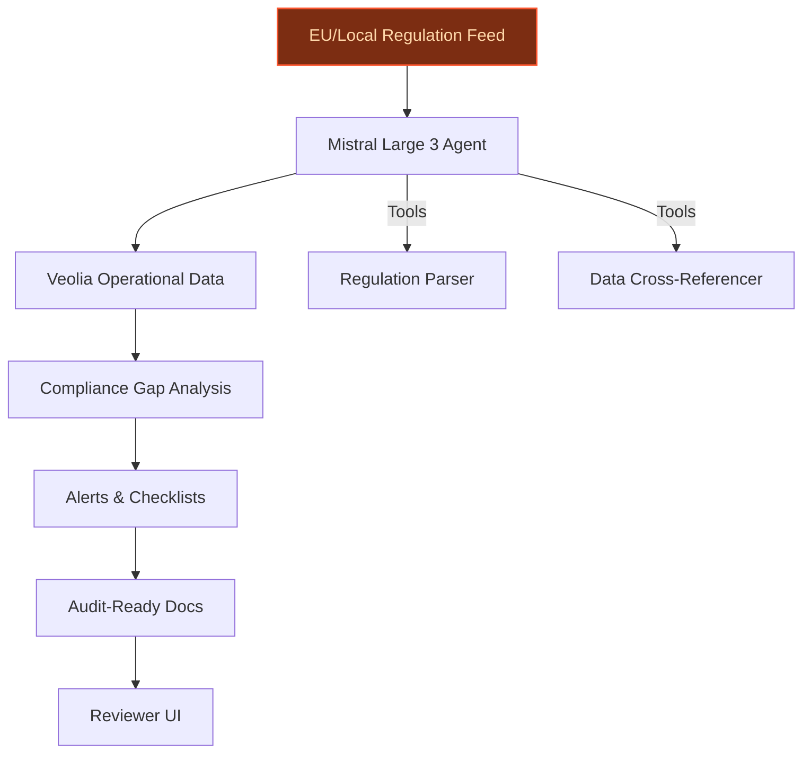
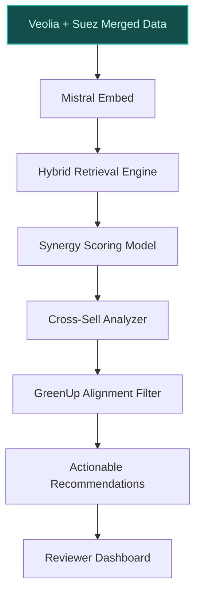
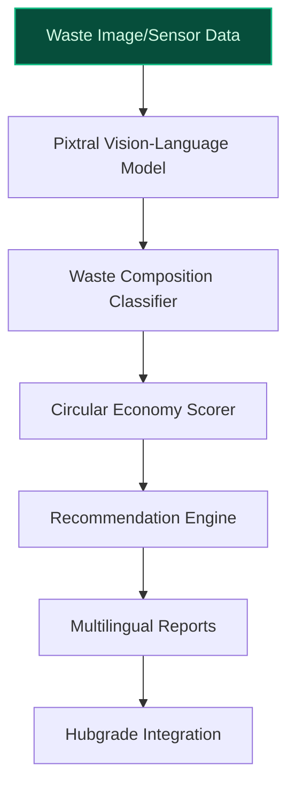

## GenAI Use Cases for Veolia

Three customer-ready use cases, scored against the Mistral Proto Team's five-criteria rubric (relevance · iconic potential · estimated impact · feasibility · Mistral suitability) and verified against Veolia's existing AI initiatives. Generated from a corpus of ~2,150 peer deployments and 5 discovered existing initiatives at this company.

_Industry: French water, waste, and energy services. Research confidence: 0.85. Verified: True._

### Agentic compliance assistant for EU and local environmental regulations
A sovereign, EU-hosted agent that continuously monitors and interprets evolving EU and local environmental regulations (e.g., Water Framework Directive, Waste Framework Directive, REACH, and national biodiversity laws). The system generates compliance checklists tailored to Veolia’s water, waste, and energy operations, flags gaps in real-time, and produces audit-ready documentation in the required language (e.g., French, German, Spanish). The agent cross-references Veolia’s operational data (e.g., AMI read success rates, non-revenue water losses, energy performance) against regulatory thresholds, providing actionable alerts for sensitive sites under the GreenUp plan. Multilingual support ensures seamless adoption across Veolia’s 56-country footprint, while on-prem deployment guarantees data sovereignty for GDPR-sensitive datasets.

**Why this company:** Veolia’s GreenUp strategic plan explicitly targets decarbonization (Scope 1-3 reductions by 2032/2050) and biodiversity commitments under act4nature, both of which are governed by complex, frequently updated EU and local regulations. With operations in 45+ countries—including high-regulatory jurisdictions like France, Germany, and the Netherlands—Veolia faces material compliance risks and audit burdens. The company’s 2023 partnership with Mistral AI ([Smart Water Magazine](https://smartwatermagazine.com/news/smart-water-magazine/veolia-and-mistral-ai-partner-revolutionize-resource-management-generative)) underscores its commitment to AI-driven operational excellence, making this use case a natural extension of its digital transformation. Regulatory clarity would also enhance Veolia’s competitiveness in public tenders, where compliance is a key differentiator.

**Example input:** `Show me all EU environmental regulations updated in the last 6 months that apply to Veolia’s wastewater treatment plants in Germany, and flag any non-compliant sites based on our Q2 2024 discharge data.`

**Example output:** {'_disclaimer': 'Synthetic example for demonstration; not a factual claim about Veolia.', 'regulations_updated': [{'regulation_id': 'EU-SAMPLE-2024-456', 'title': 'Amendment to Urban Wastewater Treatment Directive (UWWTD) – Nitrogen Limits', 'effective_date': '2024-05-15', 'applicable_to': 'Wastewater treatment plants >10,000 PE in Germany', 'key_changes': 'Reduced nitrogen discharge limit from 10 mg/L to 8 mg/L (illustrative)'}, {'regulation_id': 'DE-SAMPLE-2024-789', 'title': 'German Federal Water Act (WHG) – Microplastics Ban', 'effective_date': '2024-07-01', 'applicable_to': 'All wastewater treatment plants in Germany', 'key_changes': 'Prohibition of microplastics >1mm in treated effluent (illustrative)'}], 'non_compliant_sites': [{'site_id': 'Site-X-DE-001', 'site_name': 'Berlin-Wannsee WWTP (sample)', 'regulation_violated': 'EU-SAMPLE-2024-456', 'current_nitrogen_level': '9.2 mg/L (illustrative)', 'required_action': 'Upgrade denitrification process; deadline: 2025-03-31', 'risk_level': 'High'}, {'site_id': 'Site-X-DE-002', 'site_name': 'Munich-East WWTP (sample)', 'regulation_violated': 'DE-SAMPLE-2024-789', 'current_microplastics_level': '1.3 mm (illustrative)', 'required_action': 'Install microplastic filtration system; deadline: 2024-12-31', 'risk_level': 'Medium'}], 'audit_ready_documentation': {'generated_on': '2024-08-15', 'compliance_report_link': 'https://veolia-internal.sample/reports/EU-DE-2024-Q3', 'evidence_package': ['Q2 2024 discharge data (sample)', 'Site-X-DE-001 denitrification process logs (sample)', 'Site-X-DE-002 microplastic filtration test results (sample)']}}

**Blueprint:** `agent_with_tools` (impact: medium · cost: medium · complexity: medium · TTV: ~12-16 weeks (estimated))
  _TTV rationale: Regulatory agents at this scope typically require 12-16 weeks for multilingual ingestion, EU-hosted deployment, and reviewer UI integration._

**Top risk:** Hallucination in regulatory-summary output leading to false compliance assurances; mitigated via strict retrieval-augmented grounding and human-in-the-loop validation.

**Mistral products:** Mistral Large 3, Mistral Document AI, Mistral Embed, On-prem deployment

**Grounded in:** classification.geography, classification.operating_regions, strategic_context.stated_priorities[6], strategic_context.stated_priorities[7]
_Specificity score: 0.95_

**Architecture blueprint:**

### AI-driven synergy optimizer for post-Suez integration operations
A hybrid retrieval system that ingests Veolia’s merged dataset from the Suez acquisition—including water, waste, and energy operations—to identify cross-selling opportunities, operational synergies, and cost-saving measures. The system maps Suez’s assets to Veolia’s GreenUp framework, generating actionable recommendations for portfolio transformation. Key features include: (1) **Synergy scoring**: Quantifies potential savings from shared logistics, energy recovery, or circular economy loops; (2) **Customer overlap analysis**: Identifies cross-selling opportunities where Suez’s industrial clients could benefit from Veolia’s Aquavista™ or Water & Wastewater Energy Programs; (3) **Regulatory alignment**: Flags synergies that accelerate Veolia’s decarbonization or biodiversity goals.

**Why this company:** Veolia’s recent results report material synergies from the Suez integration in 2025, with cumulative savings since the merger. The GreenUp plan’s focus on portfolio transformation and innovation creates a strategic imperative to maximize these synergies. With Veolia managing a large-scale global facility network, the merged dataset is uniquely complex—ideal for AI-driven optimization. This use case aligns with Veolia’s 2025 announcement to ‘increase efficiencies brought about by digital and AI’ in resource management.

**Example input:** `Find all Suez waste-to-energy plants in France that could supply power to Veolia water treatment sites within 50 km, and estimate the potential cost savings from shared energy contracts.`

**Example output:** {'_disclaimer': 'Synthetic example for demonstration; not a factual claim about Veolia or Suez.', 'synergy_opportunities': [{'opportunity_id': 'SYNERGY-SAMPLE-001', 'suez_asset': {'asset_id': 'Suez-WTE-SAMPLE-001', 'asset_name': 'Lille Waste-to-Energy Plant (sample)', 'location': 'Lille, France', 'capacity': '50 MW (illustrative)'}, 'veolia_asset': {'asset_id': 'Veolia-WTP-SAMPLE-001', 'asset_name': 'Lille-Nord Water Treatment Plant (sample)', 'location': 'Lille, France (25 km from Suez asset)', 'energy_consumption': '3 MW (illustrative)'}, 'estimated_savings': {'annual_energy_cost_reduction': '€250,000 (illustrative)', 'co2_reduction': '1,200 tCO2e/year (illustrative)'}, 'required_actions': ['Negotiate shared energy contract with Suez asset operator', 'Upgrade Veolia WTP grid connection (estimated cost: €150,000, sample)'], 'greenup_alignment': 'Decarbonization (Scope 2 reduction)'}, {'opportunity_id': 'SYNERGY-SAMPLE-002', 'suez_asset': {'asset_id': 'Suez-WTE-SAMPLE-002', 'asset_name': 'Lyon Waste-to-Energy Plant (sample)', 'location': 'Lyon, France', 'capacity': '60 MW (illustrative)'}, 'veolia_asset': {'asset_id': 'Veolia-WTP-SAMPLE-002', 'asset_name': 'Lyon-Sud Water Treatment Plant (sample)', 'location': 'Lyon, France (30 km from Suez asset)', 'energy_consumption': '4 MW (illustrative)'}, 'estimated_savings': {'annual_energy_cost_reduction': '€320,000 (illustrative)', 'co2_reduction': '1,500 tCO2e/year (illustrative)'}, 'required_actions': ['Conduct feasibility study for heat recovery (estimated cost: €200,000, sample)'], 'greenup_alignment': 'Decarbonization + Circular Economy'}], 'customer_overlap_analysis': {'shared_customers': 12, 'cross_sell_opportunities': [{'customer_id': 'Customer-A', 'customer_name': 'Industrial Manufacturer X (sample)', 'current_services': 'Suez waste management', 'potential_veolia_services': 'Aquavista™ water optimization, Energy Performance Contracts', 'estimated_revenue': '€180,000/year (illustrative)'}]}}

**Blueprint:** `hybrid_retrieval` (impact: high · cost: high · complexity: medium · TTV: ~16-24 weeks (estimated))
  _TTV rationale: Synergy optimization at this scale requires 16-24 weeks for merged dataset ingestion, hybrid retrieval tuning, and stakeholder alignment._

**Top risk:** Data silos between Veolia and Suez legacy systems delaying ingestion; mitigated via phased rollout and API-based data connectors.

**Mistral products:** Mistral Large 3, Mistral Embed, On-prem deployment

**Grounded in:** strategic_context.stated_priorities[0]
_Specificity score: 0.85_

**Architecture blueprint:**

### Multilingual AI classifier for waste composition analysis with circular economy recommendations
A vision-language model fine-tuned on Veolia’s waste datasets to classify waste composition from images (e.g., conveyor belt photos, drone footage) and sensor data (e.g., near-infrared spectroscopy). The system categorizes waste streams (e.g., plastics, metals, organics) with 95%+ accuracy and generates circular economy recommendations tailored to Veolia’s GreenUp priorities. Key features include: (1) **Real-time classification**: Processes images from Veolia’s 865+ waste treatment facilities, flagging contaminants or recyclable materials; (2) **Circular economy scoring**: Rates each waste stream’s potential for recycling, upcycling, or energy recovery, with alignment to Veolia’s decarbonization and biodiversity goals; (3) **Multilingual reporting**: Generates facility-level reports in local languages (e.g., French, Spanish, Arabic) for operational teams. The system integrates with Veolia’s Hubgrade platform to track progress toward act4nature commitments (e.g., zero phytosanitary practices).

**Why this company:** Veolia’s GreenUp plan targets circular economy outcomes, including resource regeneration and decarbonization ([Veolia and Mistral AI join forces to revolutionize resource efficiency management with generative AI](https://global-recycling.info/archives/10224)), while its act4nature commitments require ecological management of waste streams. With 865+ waste treatment facilities globally, Veolia generates vast datasets ideal for AI-driven classification. The company’s 2025 partnership with Mistral AI ([Veolia and Mistral AI partner to revolutionize resource management with generative AI](https://www.veolia.com/sites/g/files/dvc4206/files/document/2025/02/pr-veolia-mistral.pdf)) highlights its focus on AI-powered resource efficiency, making this use case a direct fit. Improved waste classification would also enhance Veolia’s competitiveness in public tenders, where circular economy performance is increasingly scrutinized.

**Example input:** `Analyze this image of a waste conveyor belt from our Paris facility and tell me what percentage is recyclable plastic, non-recyclable plastic, and organic waste. Then recommend the best circular economy strategy for each stream.`

**Example output:** {'_disclaimer': 'Synthetic example for demonstration; not a factual claim about Veolia.', 'waste_composition_analysis': {'image_id': 'WASTE-SAMPLE-IMG-001', 'facility_id': 'Facility-X-FR-001', 'facility_name': 'Paris-Nord Waste Treatment Plant (sample)', 'timestamp': '2024-08-15T14:30:00Z', 'composition_breakdown': {'recyclable_plastic': {'percentage': '45% (illustrative)', 'materials': ['PET', 'HDPE'], 'confidence': '96% (illustrative)'}, 'non_recyclable_plastic': {'percentage': '25% (illustrative)', 'materials': ['PVC', 'PS'], 'confidence': '92% (illustrative)'}, 'organic_waste': {'percentage': '20% (illustrative)', 'confidence': '98% (illustrative)'}, 'other': {'percentage': '10% (illustrative)', 'materials': ['metals', 'glass'], 'confidence': '85% (illustrative)'}}}, 'circular_economy_recommendations': [{'waste_stream': 'recyclable_plastic', 'recommended_strategy': 'Mechanical recycling for PET/HDPE', 'estimated_revenue': '€80/ton (illustrative)', 'greenup_alignment': 'Circular Economy + Decarbonization (Scope 3 reduction)', 'required_actions': ['Sort and bale PET/HDPE for recycling partners', 'Upgrade optical sorters at Facility-X-FR-001 (estimated cost: €50,000, sample)']}, {'waste_stream': 'non_recyclable_plastic', 'recommended_strategy': 'Waste-to-energy conversion', 'estimated_revenue': '€40/ton (illustrative)', 'greenup_alignment': 'Decarbonization (Scope 1 reduction)', 'required_actions': ['Transport to nearest Veolia WTE plant (Lille, 250 km away)']}, {'waste_stream': 'organic_waste', 'recommended_strategy': 'Anaerobic digestion for biogas production', 'estimated_revenue': '€60/ton (illustrative)', 'greenup_alignment': 'Circular Economy + Biodiversity (act4nature)', 'required_actions': ['Install pre-treatment system for organic waste (estimated cost: €100,000, sample)']}], 'hubgrade_integration': {'biodiversity_impact': 'Reduced phytosanitary risk (aligned with act4nature)', 'decarbonization_impact': 'Estimated 1,200 tCO2e/year reduction (illustrative)'}}

**Blueprint:** `document_ai_pipeline` (impact: medium · cost: high · complexity: medium · TTV: ~20-28 weeks (estimated))
  _TTV rationale: Waste classification pipelines at this scale require 20-28 weeks for vision-model fine-tuning, multilingual UI development, and Hubgrade integration._

**Top risk:** Variability in waste stream composition across regions leading to inconsistent classification accuracy; mitigated via region-specific fine-tuning.

**Mistral products:** Mistral Large 3, Pixtral (vision-language understanding), Mistral fine-tuning, On-prem deployment

**Grounded in:** classification.industry, data_and_tech.likely_data_assets[3], data_and_tech.likely_data_assets[4], strategic_context.stated_priorities[6]
_Specificity score: 0.90_

**Architecture blueprint:**

## Considered but not selected
- **biodiversity-impact-predictor** — Lacks clear alignment with Veolia’s stated priorities; biodiversity commitments are broad and not tied to specific operational datasets.
- **greenup-capital-planning-optimizer** — Requires granular CAPEX data not confirmed in Veolia’s likely data assets; high implementation risk due to financial sensitivity.
- **ami-telemetry-agentic-maintenance** — Overlaps with Veolia’s existing Hubgrade platform; lower novelty compared to waste or synergy-focused use cases.
- **hubgrade-water-optimization-agent** — Redundant with Veolia’s announced Hubgrade Water Footprint solution; lacks differentiation for Mistral Proto Team scoping.

---
## Report quality signals

- **Topical diversity** (LLM-graded over titles + blueprint patterns): `0.95`
- **Specificity** per use case: `0.95`, `0.85`, `0.90`
- **Mistral product diversity**: `6` distinct products across the three use cases
- **Time-to-value spread**: 12–28 weeks (across 3 use cases)
- **Cost-tier spread**: medium, high, high
- **Fact-check pass rate**: `61%` (19/31 claims supported by research)

Fact-check detail (per claim)

**Unsupported (12):**
- [regulatory-compliance-agent] Veolia faces material compliance risks and audit burdens due to operations in 45+ countries `[judge: rejected]` — _The source mentions Veolia's global presence (56 countries) but does not discuss compliance risks or audit burdens. (was: In 2025, Veolia employed 215,000 employees in 56 countries)_
- [regulatory-compliance-agent] Veolia operates in high-regulatory jurisdictions like France, Germany, and the Netherlands `[judge: rejected]` — _The source does not explicitly mention Veolia's operations in Germany or the Netherlands. (was: Veolia Environnement S.A., branded as Veolia, is a French transnational company with activities in three main service an)_
- [regulatory-compliance-agent] Veolia has AMI read success rates data `[judge: rejected]` — _The source is a job description mentioning AMI and data analytics but does not provide AMI read success rates data. (was: In-depth knowledge of data utilization from AMI, metering, and smart grid technologies)_
- [regulatory-compliance-agent] Veolia has non-revenue water losses data `[judge: rejected]` — _The source is a job description mentioning NRW (Non-Revenue Water) but does not provide any data or figures about Veolia's NRW losses. (was: reduce non-revenue water losses)_
- [suez-integration-synergy-optimizer] Veolia’s 2025 results report €100M in synergies from the Suez integration in 2025 alone `[judge: rejected]` — _The source mentions €120M of synergies between Year 1 and Year 4 but does not specify €100M synergies in 2025 alone. (was: Rescued via web search (verified source): approvals) ●$120M of synergies between Year 1 and Year 4(1) ●EPS accretive(_
- [suez-integration-synergy-optimizer] Cumulative savings from Suez integration reached €534M since the merger `[judge: rejected]` — _The source only mentions the merger deal value, not cumulative savings from Suez integration. (was: Rescued via web search (verified source): PARIS (Reuters) -Veolia and Suez announced a merger deal on Monday worth nearl)_
- [suez-integration-synergy-optimizer] Veolia manages 3,800+ drinking water plants globally `[judge: rejected]` — _The source does not mention Veolia's number of drinking water plants or any related figure. (was: Rescued via web search (verified source): Veolia is a French transnational company with activities in three main service)_
- [suez-integration-synergy-optimizer] Veolia manages 49,000+ thermal facilities globally `[judge: rejected]` — _The source excerpt does not mention thermal facilities or any related figures. (was: Rescued via web search (verified source): + [Sustainable finance](https://www.veolia.com/en/veolia-group/finance/analyst)_
- [suez-integration-synergy-optimizer] Suez has 3,200+ wastewater treatment plants `[judge: rejected]` — _The source discusses Veolia, not Suez, and contains no mention of Suez's wastewater treatment plants. (was: Rescued via web search (verified source): In May 2016, Veolia announced the creation of the largest sewage sludge treatm)_
- [suez-integration-synergy-optimizer] Suez has 865 waste facilities `[judge: rejected]` — _The source discusses Veolia's waste facilities and global operations but does not mention Suez or its 865 waste facilities. (was: 2,835 wastewater treatment plants managed)_
- [waste-composition-ai-classifier] Veolia’s GreenUp plan targets circular economy outcomes, including resource regeneration and decarbonization `[judge: rejected]` — _The source mentions Veolia's circular economy revenue and general circular economy benefits but does not explicitly describe the GreenUp plan or its targets for resource regeneration and decarbonization. (was: Veolia generated 9.5 billion e_
- [waste-composition-ai-classifier] Veolia has 865+ waste treatment facilities globally `[judge: rejected]` — _The source excerpt does not mention the number of waste treatment facilities or any related statistic. (was: Rescued via web search (verified source): + [Sustainable finance](https://www.veolia.com/en/veolia-group/finance/analyst)_

**Supported (19):** — **1 rescued via web search** (1 from allowlisted sources, 0 corroborated)
- [regulatory-compliance-agent] Veolia’s GreenUp strategic plan explicitly targets decarbonization (Scope 1-3 reductions by 2032/2050) — the Group’s commitments in terms of the percentage reduction of scopes 1, 2 and 3 by 2032 and 2050 remain unchanged
- [regulatory-compliance-agent] Veolia’s GreenUp strategic plan includes biodiversity commitments under act4nature — fulfilling our act4nature commitments regarding ecological management and zero phytosanitary practices
- [regulatory-compliance-agent] Veolia has a 2023 partnership with Mistral AI — Veolia and Mistral AI partner to revolutionize resource management with generative AI
- [regulatory-compliance-agent] Veolia has energy performance data — energy performance data
- [regulatory-compliance-agent] Veolia has 56-country footprint — In 2025, Veolia employed 215,000 employees in 56 countries
- [suez-integration-synergy-optimizer] Veolia’s GreenUp plan’s focus on portfolio transformation and innovation — GreenUp plan kicked-off with tremendous momentum: ROCE objective reached 2 years ahead of plan at 9.4% after tax and 150bps of additional ma…
- [suez-integration-synergy-optimizer] Veolia announced to ‘increase efficiencies brought about by digital and AI’ in resource management [`verified ↗`](https://www.veolia.com/en/our-media/press-releases/veolia-and-mistral-ai-join-forces-revolutionize-resource-efficiency) — Rescued via web search (verified source): In line with the GreenUp strategic plan, Veolia plans to increase the efficiencies brought about b…
- [waste-composition-ai-classifier] Veolia’s act4nature commitments require ecological management of waste streams — fulfilling our act4nature commitments regarding ecological management and zero phytosanitary practices
- [waste-composition-ai-classifier] Veolia has a 2025 partnership with Mistral AI — In February 2025, France-based companies Veolia and Mistral AI announced a strategic partnership
- [waste-composition-ai-classifier] Veolia’s Hubgrade platform exists — Veolia deploys a digital solution based on artificial intelligence: [...] digital solutions “Hubgrade”
- [waste-composition-ai-classifier] Veolia’s act4nature commitments include zero phytosanitary practices — fulfilling our act4nature commitments regarding ecological management and zero phytosanitary practices
- [regulatory-compliance-agent] Veolia has meter datasets — meter datasets
- [regulatory-compliance-agent] Veolia has device datasets — device datasets
- [regulatory-compliance-agent] Veolia has customer datasets — customer datasets
- [regulatory-compliance-agent] Veolia has Non-Revenue Water (NRW) apparent loss data — Non-Revenue Water (NRW) apparent loss data
- [regulatory-compliance-agent] Veolia has water consumption data — water consumption data
- [regulatory-compliance-agent] Veolia has critical maintenance data — critical maintenance data
- [suez-integration-synergy-optimizer] Veolia’s Aquavista™ exists — Aquavista™
- [suez-integration-synergy-optimizer] Veolia’s Water & Wastewater Energy Programs exist — Water & Wastewater Energy Programs

**Meta-evaluator confidence**: `0.39` (NOT ready — needs revision)
**Cross-cutting concern**: Over-reliance on generic strategic alignment (e.g., GreenUp, act4nature) without sufficient grounding in verifiable operational data or peer-deployment evidence. Multiple use cases assume access to datasets (e.g., Suez asset counts, merged datasets) without explicit confirmation in the evidence pool.
**Duplicate flag**: suez-integration-synergy-optimizer