# Pipeline blueprint (architecture)

Static view of the pipeline regardless of run timing — shows agents,
models, and gates. The chronological execution log follows below.

```mermaid
flowchart TD
    Start([User: company name]) --> R
    R["<b>1. Research</b><br/>parallel: Wikipedia · Tavily news ·<br/>existing initiatives · live verification<br/><i>mistral-medium</i> synthesis"]
    R --> G["<b>1b. Gap-fill</b><br/>identify missing fields →<br/><i>mistral-small</i> generates queries →<br/>Tavily search per field →<br/><i>mistral-small</i> per-field extraction"]
    G --> Conf{Confidence ≥ 0.5<br/>OR verified<br/>OR ≥ 1 existing initiative?}
    Conf -->|no| Refuse([Refusal])
    Conf -->|yes| Ret
    Ret["<b>2. Retrieve</b><br/><i>mistral-embed</i> on company query →<br/>cosine top-K + industry/depth filter +<br/>MMR diversification"]
    Ret --> Gen["<b>3. Generate 12 candidates</b><br/><i>mistral-medium</i> with web_search tool<br/>(Tavily + deep-read) — fact citations<br/>flow into the EvidenceLedger"]
    Gen --> Score["<b>4. Score</b><br/>self-consistency: 2 parallel passes<br/><i>mistral-small</i> @ T=0.2 and T=0.4 →<br/>aggregate weighted scores"]
    Score --> Verify["<b>5. Per-candidate verify</b><br/>top-3: Tavily search + deep-read +<br/><i>mistral-small</i> verdict (pass /<br/>partial / confirmed_existing)"]
    Verify --> Enrich["<b>6. Enrich</b><br/><i>mistral-large</i> drafts customer-facing<br/>prose for 3 use cases (or<br/><i>mistral-medium</i> on fast tier)"]
    Enrich --> NumScrub["<b>6a. Numeric scrub</b><br/>flag any number not in cited content"]
    NumScrub --> Polish["<b>6b. Polish</b><br/><i>mistral-small</i> per use case (parallel):<br/>convert markers→qualitative,<br/>(ev-XXX)→[title](url)"]
    Polish --> Attr["<b>6c. Attribution check</b><br/><i>mistral-small</i> per use case (parallel):<br/>fix corpus-ID ↔ company mismatches"]
    Attr --> Meta["<b>7. Meta-evaluation</b><br/><i>mistral-medium</i> reviews report against<br/>cited precedents + ledger entries:<br/>strict claim verification"]
    Meta --> RegenQ{confidence < 0.6<br/>AND not fast tier?}
    RegenQ -->|yes| Regen["<b>7b. Targeted regen</b><br/><i>mistral-large</i> re-enriches just the<br/>weakest use case with the next-best<br/>near-miss; re-runs meta-eval"]
    RegenQ -->|no| QS
    Regen --> QS
    QS["<b>Quality signals</b><br/>LLM-graded diversity + specificity,<br/>fact-check pass rate, TTV/cost spread"]
    QS --> Render([Markdown report + trace])

    classDef agent fill:#fef3c7,stroke:#f59e0b
    classDef gate fill:#dbeafe,stroke:#3b82f6
    classDef io fill:#dcfce7,stroke:#16a34a
    class R,G,Ret,Gen,Score,Verify,Enrich,NumScrub,Polish,Attr,Meta,Regen,QS agent
    class Conf,RegenQ gate
    class Start,Refuse,Render io
```

## Execution trace — Veolia

Started: `2026-05-09T13:57:43.035315+00:00`. Total wall time: `259.9s` across `52` recorded actions.

### Per-step time totals

| Step | Calls | Total time | Avg time |
|---|---:|---:|---:|
| `research` | 1 | 8.74s | 8737ms |
| `gap_fill` | 4 | 3.43s | 858ms |
| `retrieve` | 2 | 0.53s | 263ms |
| `generate` | 2 | 35.98s | 17991ms |
| `generate.web_search` | 2 | 4.80s | 2398ms |
| `score` | 2 | 34.20s | 17098ms |
| `verify` | 6 | 19.96s | 3326ms |
| `enrich` | 1 | 76.82s | 76823ms |
| `polish` | 2 | 6.83s | 3417ms |
| `meta_eval` | 2 | 30.30s | 15152ms |
| `regen_one` | 1 | 33.53s | 33530ms |
| `web_verify` | 1 | 3.20s | 3203ms |
| `source_judge` | 23 | 26.36s | 1146ms |
| `final_qualify` | 1 | 1.85s | 1849ms |
| `quality_signals` | 2 | 4.07s | 2035ms |

### Chronological event log

- `13:57:45.573` **[research]** `mistral-medium-2604.chat.complete` — 8737ms
   - inputs: synthesize CompanyContext for Veolia | depth=medium
   - outputs: industry='French water, waste, and energy services' verified=True conf=0.75
- `13:57:54.312` **[gap_fill]** `mistral-small-2603.chat.complete` — 1034ms
   - inputs: generate gap queries | fields=['business_model', 'products', 'data_assets', 'priorities']
   - outputs: queries=4
- `13:58:03.594` **[gap_fill]** `mistral-small-2603.chat.complete` — 1162ms
   - inputs: layer-2 extract field=priorities
   - outputs: items=10
- `13:58:03.601` **[gap_fill]** `mistral-small-2603.chat.complete` — 740ms
   - inputs: layer-2 extract field=data_assets
   - outputs: items=10
- `13:58:03.606` **[gap_fill]** `mistral-small-2603.chat.complete` — 495ms
   - inputs: layer-2 extract field=products
   - outputs: items=2
- `13:58:04.758` **[retrieve]** `mistral-embed.embeddings.create` — 189ms
   - inputs: company_query | industries='French water, waste, and energy services'
   - outputs: embedded 1024-dim query vector
- `13:58:04.946` **[retrieve]** `precedent_corpus.cosine_topk` — 338ms
   - inputs: k=8 min_depth=0.4 target='Veolia'
   - outputs: retrieved 8 | mmr=True | top_sim=0.788
- `13:58:06.203` **[generate]** `mistral-medium-2604.chat.complete` — 2099ms
   - inputs: iteration=0 tool_calls_used=0/2 tools=on
   - outputs: tool_calls=4 | content_chars=0
- `13:58:08.321` **[generate.web_search]** `tavily.search` — 2532ms
   - inputs: query='Veolia Aquavista smart water management features and deployment scale 2025'
   - outputs: 2 raw results
- `13:58:12.625` **[generate.web_search]** `tavily.search` — 2264ms
   - inputs: query='Veolia GreenUp strategic plan decarbonization and biodiversity commitments 2025'
   - outputs: 2 raw results
- `13:58:18.296` **[generate]** `mistral-medium-2604.chat.complete` — 33883ms
   - inputs: iteration=1 tool_calls_used=2/2 tools=off
   - outputs: tool_calls=0 | content_chars=22326
- `13:58:52.566` **[score]** `mistral-small-2603.chat.complete` — 16860ms
   - inputs: self-consistency pass T=0.2
   - outputs: scored 12 candidates
- `13:58:52.569` **[score]** `mistral-small-2603.chat.complete` — 17337ms
   - inputs: self-consistency pass T=0.4
   - outputs: scored 12 candidates
- `13:59:09.941` **[verify]** `tavily.search` — 2192ms
   - inputs: candidate=regulatory-compliance-agent | query='Veolia Agentic compliance assistant for EU and local environ'
   - outputs: 4 results
- `13:59:09.942` **[verify]** `tavily.search` — 2194ms
   - inputs: candidate=suez-integration-synergy-optimizer | query='Veolia AI-driven synergy optimizer for post-Suez integration'
   - outputs: 4 results
- `13:59:09.942` **[verify]** `tavily.search` — 2312ms
   - inputs: candidate=waste-composition-ai-classifier | query='Veolia Multilingual AI classifier for waste composition anal'
   - outputs: 4 results
- `13:59:12.351` **[verify]** `mistral-small-2603.chat.complete` — 4909ms
   - inputs: verdict for suez-integration-synergy-optimizer
   - outputs: verdict='pass'
- `13:59:12.513` **[verify]** `mistral-small-2603.chat.complete` — 4539ms
   - inputs: verdict for regulatory-compliance-agent
   - outputs: verdict='pass'
- `13:59:14.859` **[verify]** `mistral-small-2603.chat.complete` — 3810ms
   - inputs: verdict for waste-composition-ai-classifier
   - outputs: verdict='pass'
- `13:59:18.671` **[enrich]** `mistral-large-2512.chat.complete` — 76823ms
   - inputs: tier=standard top_3=['regulatory-compliance-agent', 'suez-integration-synergy-optimizer', 'waste-composition-ai-classifier']
   - outputs: enriched 3 use cases
- `14:00:35.516` **[polish]** `mistral-small-2603.chat.complete` — 3358ms
   - inputs: use_case=waste-composition-ai-classifier unanchored=True opaque_ev=False
   - outputs: polished 5 fields
- `14:00:38.877` **[meta_eval]** `mistral-medium-2604.chat.complete` — 16103ms
   - inputs: reviewing 3 use cases
   - outputs: review + claims
- `14:00:54.981` **[regen_one]** `mistral-large-2512.chat.complete` — 33530ms
   - inputs: replace weakest=regulatory-compliance-agent with biodiversity-impact-predictor
   - outputs: single use case enriched
- `14:01:28.524` **[polish]** `mistral-small-2603.chat.complete` — 3475ms
   - inputs: use_case=biodiversity-impact-predictor unanchored=True opaque_ev=False
   - outputs: polished 5 fields
- `14:01:32.001` **[meta_eval]** `mistral-medium-2604.chat.complete` — 14202ms
   - inputs: reviewing 3 use cases
   - outputs: review + claims
- `14:01:46.220` **[web_verify]** `tavily.search.rescue_unsupported_claims` — 3203ms
   - inputs: company='Veolia' unsupported=7 budget=12
   - outputs: rescued: verified=7 corroborated=0 of 7 attempted
- `14:01:49.427` **[source_judge]** `mistral-small-2603.judge_claim_sources` — 7334ms
   - inputs: pairs=22
   - outputs: judged 22 pairs
- `14:01:49.427` **[source_judge]** `mistral-small-2603.chat.complete` — 672ms
   - inputs: claim='Veolia’s GreenUp strategic plan explicitly targets decarboni'
   - outputs: supports=True
- `14:01:49.433` **[source_judge]** `mistral-small-2603.chat.complete` — 692ms
   - inputs: claim='Veolia’s GreenUp strategic plan includes biodiversity commit'
   - outputs: supports=True
- `14:01:49.436` **[source_judge]** `mistral-small-2603.chat.complete` — 638ms
   - inputs: claim='Veolia faces material compliance risks and audit burdens due'
   - outputs: supports=False
- `14:01:49.439` **[source_judge]** `mistral-small-2603.chat.complete` — 584ms
   - inputs: claim='Veolia has a 2023 partnership with Mistral AI'
   - outputs: supports=True
- `14:01:50.023` **[source_judge]** `mistral-small-2603.chat.complete` — 475ms
   - inputs: claim='Veolia operates in high-regulatory jurisdictions like France'
   - outputs: supports=False
- `14:01:50.074` **[source_judge]** `mistral-small-2603.chat.complete` — 520ms
   - inputs: claim='Veolia has AMI read success rates data'
   - outputs: supports=False
- `14:01:50.099` **[source_judge]** `mistral-small-2603.chat.complete` — 589ms
   - inputs: claim='Veolia has non-revenue water losses data'
   - outputs: supports=False
- `14:01:50.125` **[source_judge]** `mistral-small-2603.chat.complete` — 526ms
   - inputs: claim='Veolia has 56-country footprint'
   - outputs: supports=True
- `14:01:50.498` **[source_judge]** `mistral-small-2603.chat.complete` — 799ms
   - inputs: claim='Veolia’s 2025 results report €100M in synergies from the Sue'
   - outputs: supports=False
- `14:01:50.594` **[source_judge]** `mistral-small-2603.chat.complete` — 6167ms
   - inputs: claim='Cumulative savings from Suez integration reached €534M since'
   - outputs: supports=False
- `14:01:50.651` **[source_judge]** `mistral-small-2603.chat.complete` — 618ms
   - inputs: claim='Veolia manages 3,800+ drinking water plants globally'
   - outputs: supports=False
- `14:01:50.688` **[source_judge]** `mistral-small-2603.chat.complete` — 590ms
   - inputs: claim='Veolia manages 49,000+ thermal facilities globally'
   - outputs: supports=False
- `14:01:51.269` **[source_judge]** `mistral-small-2603.chat.complete` — 986ms
   - inputs: claim='Suez has 3,200+ wastewater treatment plants'
   - outputs: supports=False
- `14:01:51.278` **[source_judge]** `mistral-small-2603.chat.complete` — 675ms
   - inputs: claim='Suez has 865 waste facilities'
   - outputs: supports=False
- `14:01:51.297` **[source_judge]** `mistral-small-2603.chat.complete` — 621ms
   - inputs: claim='Veolia’s GreenUp plan’s focus on portfolio transformation an'
   - outputs: supports=True
- `14:01:51.917` **[source_judge]** `mistral-small-2603.chat.complete` — 528ms
   - inputs: claim='Veolia announced to ‘increase efficiencies brought about by '
   - outputs: supports=True
- `14:01:51.952` **[source_judge]** `mistral-small-2603.chat.complete` — 621ms
   - inputs: claim='Veolia’s GreenUp plan targets circular economy outcomes, inc'
   - outputs: supports=False
- `14:01:52.255` **[source_judge]** `mistral-small-2603.chat.complete` — 587ms
   - inputs: claim='Veolia’s act4nature commitments require ecological managemen'
   - outputs: supports=True
- `14:01:52.445` **[source_judge]** `mistral-small-2603.chat.complete` — 525ms
   - inputs: claim='Veolia has 865+ waste treatment facilities globally'
   - outputs: supports=False
- `14:01:52.573` **[source_judge]** `mistral-small-2603.chat.complete` — 560ms
   - inputs: claim='Veolia has a 2025 partnership with Mistral AI'
   - outputs: supports=True
- `14:01:52.842` **[source_judge]** `mistral-small-2603.chat.complete` — 537ms
   - inputs: claim='Veolia’s Hubgrade platform exists'
   - outputs: supports=True
- `14:01:52.970` **[source_judge]** `mistral-small-2603.chat.complete` — 517ms
   - inputs: claim='Veolia’s act4nature commitments include zero phytosanitary p'
   - outputs: supports=True
- `14:01:56.763` **[final_qualify]** `mistral-small-2603.chat.complete` — 1849ms
   - inputs: use_case=suez-integration-synergy-optimizer unsupported=2
   - outputs: qualified 4 fields
- `14:01:58.856` **[quality_signals]** `mistral-small-2603.chat.complete` — 2610ms
   - inputs: specificity grade (3 use cases)
   - outputs: scored 3 use cases
- `14:02:01.467` **[quality_signals]** `mistral-small-2603.chat.complete` — 1461ms
   - inputs: diversity grade
   - outputs: diversity=0.95

## Mermaid sequence diagram (execution)

```mermaid
sequenceDiagram
    autonumber
    participant pipeline as pipeline
    participant mistral_medium_2604 as mistral-medium-2604
    participant mistral_small_2603 as mistral-small-2603
    participant mistral_embed as mistral-embed
    participant precedent_corpus as precedent_corpus
    participant tavily as tavily
    participant mistral_large_2512 as mistral-large-2512
    participant tavily_search as tavily.search
    pipeline->>mistral_medium_2604: research: chat.complete (8737ms)
    mistral_medium_2604-->>pipeline: industry='French water, waste, and energy services' verified
    pipeline->>mistral_small_2603: gap_fill: chat.complete (1034ms)
    mistral_small_2603-->>pipeline: queries=4
    pipeline->>mistral_small_2603: gap_fill: chat.complete (1162ms)
    mistral_small_2603-->>pipeline: items=10
    pipeline->>mistral_small_2603: gap_fill: chat.complete (740ms)
    mistral_small_2603-->>pipeline: items=10
    pipeline->>mistral_small_2603: gap_fill: chat.complete (495ms)
    mistral_small_2603-->>pipeline: items=2
    pipeline->>mistral_embed: retrieve: embeddings.create (189ms)
    mistral_embed-->>pipeline: embedded 1024-dim query vector
    pipeline->>precedent_corpus: retrieve: cosine_topk (338ms)
    precedent_corpus-->>pipeline: retrieved 8 | mmr=True | top_sim=0.788
    pipeline->>mistral_medium_2604: generate: chat.complete (2099ms)
    mistral_medium_2604-->>pipeline: tool_calls=4 | content_chars=0
    pipeline->>tavily: generate.web_search: search (2532ms)
    tavily-->>pipeline: 2 raw results
    pipeline->>tavily: generate.web_search: search (2264ms)
    tavily-->>pipeline: 2 raw results
    pipeline->>mistral_medium_2604: generate: chat.complete (33883ms)
    mistral_medium_2604-->>pipeline: tool_calls=0 | content_chars=22326
    pipeline->>mistral_small_2603: score: chat.complete (16860ms)
    mistral_small_2603-->>pipeline: scored 12 candidates
    pipeline->>mistral_small_2603: score: chat.complete (17337ms)
    mistral_small_2603-->>pipeline: scored 12 candidates
    pipeline->>tavily: verify: search (2192ms)
    tavily-->>pipeline: 4 results
    pipeline->>tavily: verify: search (2194ms)
    tavily-->>pipeline: 4 results
    pipeline->>tavily: verify: search (2312ms)
    tavily-->>pipeline: 4 results
    pipeline->>mistral_small_2603: verify: chat.complete (4909ms)
    mistral_small_2603-->>pipeline: verdict='pass'
    pipeline->>mistral_small_2603: verify: chat.complete (4539ms)
    mistral_small_2603-->>pipeline: verdict='pass'
    pipeline->>mistral_small_2603: verify: chat.complete (3810ms)
    mistral_small_2603-->>pipeline: verdict='pass'
    pipeline->>mistral_large_2512: enrich: chat.complete (76823ms)
    mistral_large_2512-->>pipeline: enriched 3 use cases
    pipeline->>mistral_small_2603: polish: chat.complete (3358ms)
    mistral_small_2603-->>pipeline: polished 5 fields
    pipeline->>mistral_medium_2604: meta_eval: chat.complete (16103ms)
    mistral_medium_2604-->>pipeline: review + claims
    pipeline->>mistral_large_2512: regen_one: chat.complete (33530ms)
    mistral_large_2512-->>pipeline: single use case enriched
    pipeline->>mistral_small_2603: polish: chat.complete (3475ms)
    mistral_small_2603-->>pipeline: polished 5 fields
    pipeline->>mistral_medium_2604: meta_eval: chat.complete (14202ms)
    mistral_medium_2604-->>pipeline: review + claims
    pipeline->>tavily_search: web_verify: rescue_unsupported_claims (3203ms)
    tavily_search-->>pipeline: rescued: verified=7 corroborated=0 of 7 attempted
    pipeline->>mistral_small_2603: source_judge: judge_claim_sources (7334ms)
    mistral_small_2603-->>pipeline: judged 22 pairs
    pipeline->>mistral_small_2603: source_judge: chat.complete (672ms)
    mistral_small_2603-->>pipeline: supports=True
    pipeline->>mistral_small_2603: source_judge: chat.complete (692ms)
    mistral_small_2603-->>pipeline: supports=True
    pipeline->>mistral_small_2603: source_judge: chat.complete (638ms)
    mistral_small_2603-->>pipeline: supports=False
    pipeline->>mistral_small_2603: source_judge: chat.complete (584ms)
    mistral_small_2603-->>pipeline: supports=True
    pipeline->>mistral_small_2603: source_judge: chat.complete (475ms)
    mistral_small_2603-->>pipeline: supports=False
    pipeline->>mistral_small_2603: source_judge: chat.complete (520ms)
    mistral_small_2603-->>pipeline: supports=False
    pipeline->>mistral_small_2603: source_judge: chat.complete (589ms)
    mistral_small_2603-->>pipeline: supports=False
    pipeline->>mistral_small_2603: source_judge: chat.complete (526ms)
    mistral_small_2603-->>pipeline: supports=True
    pipeline->>mistral_small_2603: source_judge: chat.complete (799ms)
    mistral_small_2603-->>pipeline: supports=False
    pipeline->>mistral_small_2603: source_judge: chat.complete (6167ms)
    mistral_small_2603-->>pipeline: supports=False
    pipeline->>mistral_small_2603: source_judge: chat.complete (618ms)
    mistral_small_2603-->>pipeline: supports=False
    pipeline->>mistral_small_2603: source_judge: chat.complete (590ms)
    mistral_small_2603-->>pipeline: supports=False
    pipeline->>mistral_small_2603: source_judge: chat.complete (986ms)
    mistral_small_2603-->>pipeline: supports=False
    pipeline->>mistral_small_2603: source_judge: chat.complete (675ms)
    mistral_small_2603-->>pipeline: supports=False
    pipeline->>mistral_small_2603: source_judge: chat.complete (621ms)
    mistral_small_2603-->>pipeline: supports=True
    pipeline->>mistral_small_2603: source_judge: chat.complete (528ms)
    mistral_small_2603-->>pipeline: supports=True
    pipeline->>mistral_small_2603: source_judge: chat.complete (621ms)
    mistral_small_2603-->>pipeline: supports=False
    pipeline->>mistral_small_2603: source_judge: chat.complete (587ms)
    mistral_small_2603-->>pipeline: supports=True
    pipeline->>mistral_small_2603: source_judge: chat.complete (525ms)
    mistral_small_2603-->>pipeline: supports=False
    pipeline->>mistral_small_2603: source_judge: chat.complete (560ms)
    mistral_small_2603-->>pipeline: supports=True
    pipeline->>mistral_small_2603: source_judge: chat.complete (537ms)
    mistral_small_2603-->>pipeline: supports=True
    pipeline->>mistral_small_2603: source_judge: chat.complete (517ms)
    mistral_small_2603-->>pipeline: supports=True
    pipeline->>mistral_small_2603: final_qualify: chat.complete (1849ms)
    mistral_small_2603-->>pipeline: qualified 4 fields
    pipeline->>mistral_small_2603: quality_signals: chat.complete (2610ms)
    mistral_small_2603-->>pipeline: scored 3 use cases
    pipeline->>mistral_small_2603: quality_signals: chat.complete (1461ms)
    mistral_small_2603-->>pipeline: diversity=0.95
```

