# Pipeline blueprint (architecture)

Static view of the pipeline regardless of run timing — shows agents,
models, and gates. The chronological execution log follows below.

```mermaid
flowchart TD
    Start([User: company name]) --> R
    R["<b>1. Research</b><br/>parallel: Wikipedia · Tavily news ·<br/>existing initiatives · live verification<br/><i>mistral-medium</i> synthesis"]
    R --> G["<b>1b. Gap-fill</b><br/>identify missing fields →<br/><i>mistral-small</i> generates queries →<br/>Tavily search per field →<br/><i>mistral-small</i> per-field extraction"]
    G --> Conf{Confidence ≥ 0.5<br/>OR verified<br/>OR ≥ 1 existing initiative?}
    Conf -->|no| Refuse([Refusal])
    Conf -->|yes| Ret
    Ret["<b>2. Retrieve</b><br/><i>mistral-embed</i> on company query →<br/>cosine top-K + industry/depth filter +<br/>MMR diversification"]
    Ret --> Gen["<b>3. Generate 12 candidates</b><br/><i>mistral-medium</i> with web_search tool<br/>(Tavily + deep-read) — fact citations<br/>flow into the EvidenceLedger"]
    Gen --> Score["<b>4. Score</b><br/>self-consistency: 2 parallel passes<br/><i>mistral-small</i> @ T=0.2 and T=0.4 →<br/>aggregate weighted scores"]
    Score --> Verify["<b>5. Per-candidate verify</b><br/>top-3: Tavily search + deep-read +<br/><i>mistral-small</i> verdict (pass /<br/>partial / confirmed_existing)"]
    Verify --> Enrich["<b>6. Enrich</b><br/><i>mistral-large</i> drafts customer-facing<br/>prose for 3 use cases (or<br/><i>mistral-medium</i> on fast tier)"]
    Enrich --> NumScrub["<b>6a. Numeric scrub</b><br/>flag any number not in cited content"]
    NumScrub --> Polish["<b>6b. Polish</b><br/><i>mistral-small</i> per use case (parallel):<br/>convert markers→qualitative,<br/>(ev-XXX)→[title](url)"]
    Polish --> Attr["<b>6c. Attribution check</b><br/><i>mistral-small</i> per use case (parallel):<br/>fix corpus-ID ↔ company mismatches"]
    Attr --> Meta["<b>7. Meta-evaluation</b><br/><i>mistral-medium</i> reviews report against<br/>cited precedents + ledger entries:<br/>strict claim verification"]
    Meta --> RegenQ{confidence < 0.6<br/>AND not fast tier?}
    RegenQ -->|yes| Regen["<b>7b. Targeted regen</b><br/><i>mistral-large</i> re-enriches just the<br/>weakest use case with the next-best<br/>near-miss; re-runs meta-eval"]
    RegenQ -->|no| QS
    Regen --> QS
    QS["<b>Quality signals</b><br/>LLM-graded diversity + specificity,<br/>fact-check pass rate, TTV/cost spread"]
    QS --> Render([Markdown report + trace])

    classDef agent fill:#fef3c7,stroke:#f59e0b
    classDef gate fill:#dbeafe,stroke:#3b82f6
    classDef io fill:#dcfce7,stroke:#16a34a
    class R,G,Ret,Gen,Score,Verify,Enrich,NumScrub,Polish,Attr,Meta,Regen,QS agent
    class Conf,RegenQ gate
    class Start,Refuse,Render io
```

## Execution trace — BNP Paribas

Started: `2026-05-09T16:36:43.635564+00:00`. Total wall time: `251.7s` across `48` recorded actions.

### Per-step time totals

| Step | Calls | Total time | Avg time |
|---|---:|---:|---:|
| `research` | 1 | 7.68s | 7681ms |
| `gap_fill` | 4 | 3.68s | 921ms |
| `retrieve` | 2 | 0.53s | 266ms |
| `generate` | 2 | 35.32s | 17658ms |
| `generate.web_search` | 2 | 7.80s | 3901ms |
| `score` | 2 | 37.79s | 18893ms |
| `verify` | 6 | 20.84s | 3473ms |
| `enrich` | 1 | 69.38s | 69380ms |
| `polish` | 4 | 11.43s | 2857ms |
| `meta_eval` | 2 | 31.13s | 15567ms |
| `regen_one` | 1 | 25.21s | 25207ms |
| `web_verify` | 1 | 5.12s | 5117ms |
| `source_judge` | 17 | 21.74s | 1279ms |
| `final_qualify` | 1 | 2.19s | 2186ms |
| `quality_signals` | 2 | 4.80s | 2399ms |

### Chronological event log

- `16:36:46.320` **[research]** `mistral-medium-2604.chat.complete` — 7681ms
   - inputs: synthesize CompanyContext for BNP Paribas | depth=medium
   - outputs: industry='French multinational universal bank and financial services' verified=True conf=0.75
- `16:36:54.003` **[gap_fill]** `mistral-small-2603.chat.complete` — 1020ms
   - inputs: generate gap queries | fields=['business_model', 'products', 'data_assets', 'priorities']
   - outputs: queries=4
- `16:37:03.095` **[gap_fill]** `mistral-small-2603.chat.complete` — 854ms
   - inputs: layer-2 extract field=priorities
   - outputs: items=6
- `16:37:03.100` **[gap_fill]** `mistral-small-2603.chat.complete` — 464ms
   - inputs: layer-2 extract field=data_assets
   - outputs: items=0
- `16:37:03.103` **[gap_fill]** `mistral-small-2603.chat.complete` — 1346ms
   - inputs: layer-2 extract field=products
   - outputs: items=7
- `16:37:04.451` **[retrieve]** `mistral-embed.embeddings.create` — 198ms
   - inputs: company_query | industries='French multinational universal bank and financial services'
   - outputs: embedded 1024-dim query vector
- `16:37:04.648` **[retrieve]** `precedent_corpus.cosine_topk` — 334ms
   - inputs: k=8 min_depth=0.4 target='BNP Paribas'
   - outputs: retrieved 8 | mmr=True | top_sim=0.787
- `16:37:05.901` **[generate]** `mistral-medium-2604.chat.complete` — 1716ms
   - inputs: iteration=0 tool_calls_used=0/2 tools=on
   - outputs: tool_calls=3 | content_chars=0
- `16:37:07.635` **[generate.web_search]** `tavily.search` — 3845ms
   - inputs: query='BNP Paribas recent AI partnerships 2025 2026'
   - outputs: 2 raw results
- `16:37:13.467` **[generate.web_search]** `tavily.search` — 3957ms
   - inputs: query='BNP Paribas regulatory compliance priorities 2025'
   - outputs: 2 raw results
- `16:37:20.114` **[generate]** `mistral-medium-2604.chat.complete` — 33599ms
   - inputs: iteration=1 tool_calls_used=2/2 tools=off
   - outputs: tool_calls=0 | content_chars=22996
- `16:37:54.140` **[score]** `mistral-small-2603.chat.complete` — 19242ms
   - inputs: self-consistency pass T=0.2
   - outputs: scored 12 candidates
- `16:37:54.145` **[score]** `mistral-small-2603.chat.complete` — 18543ms
   - inputs: self-consistency pass T=0.4
   - outputs: scored 12 candidates
- `16:38:13.421` **[verify]** `tavily.search` — 2131ms
   - inputs: candidate=multilingual_regulatory_resolution_reporting | query='BNP Paribas Multilingual AI assistant for regulatory resolut'
   - outputs: 4 results
- `16:38:13.421` **[verify]** `tavily.search` — 4197ms
   - inputs: candidate=cardif_claims_automation | query='BNP Paribas AI-powered claims processing automation for BNP '
   - outputs: 4 results
- `16:38:13.422` **[verify]** `tavily.search` — 2334ms
   - inputs: candidate=fortis_cross_border_compliance | query='BNP Paribas Cross-border compliance monitoring for BNP Parib'
   - outputs: 4 results
- `16:38:16.040` **[verify]** `mistral-small-2603.chat.complete` — 4461ms
   - inputs: verdict for fortis_cross_border_compliance
   - outputs: verdict='pass'
- `16:38:17.285` **[verify]** `mistral-small-2603.chat.complete` — 2933ms
   - inputs: verdict for multilingual_regulatory_resolution_reporting
   - outputs: verdict='pass'
- `16:38:18.998` **[verify]** `mistral-small-2603.chat.complete` — 4781ms
   - inputs: verdict for cardif_claims_automation
   - outputs: verdict='confirmed_existing'
- `16:38:23.782` **[enrich]** `mistral-large-2512.chat.complete` — 69380ms
   - inputs: tier=standard top_3=['multilingual_regulatory_resolution_reporting', 'real_estate_financing_esg_scoring', 'esg_kyc_integration']
   - outputs: enriched 3 use cases
- `16:39:33.189` **[polish]** `mistral-small-2603.chat.complete` — 2677ms
   - inputs: use_case=multilingual_regulatory_resolution_reporting unanchored=True opaque_ev=False
   - outputs: polished 5 fields
- `16:39:33.194` **[polish]** `mistral-small-2603.chat.complete` — 2303ms
   - inputs: use_case=real_estate_financing_esg_scoring unanchored=True opaque_ev=False
   - outputs: polished 5 fields
- `16:39:33.199` **[polish]** `mistral-small-2603.chat.complete` — 3185ms
   - inputs: use_case=esg_kyc_integration unanchored=True opaque_ev=False
   - outputs: polished 5 fields
- `16:39:36.387` **[meta_eval]** `mistral-medium-2604.chat.complete` — 12424ms
   - inputs: reviewing 3 use cases
   - outputs: review + claims
- `16:39:48.812` **[regen_one]** `mistral-large-2512.chat.complete` — 25207ms
   - inputs: replace weakest=real_estate_financing_esg_scoring with cardif_claims_automation
   - outputs: single use case enriched
- `16:40:14.033` **[polish]** `mistral-small-2603.chat.complete` — 3262ms
   - inputs: use_case=cardif_claims_automation unanchored=True opaque_ev=False
   - outputs: polished 5 fields
- `16:40:17.298` **[meta_eval]** `mistral-medium-2604.chat.complete` — 18710ms
   - inputs: reviewing 3 use cases
   - outputs: review + claims
- `16:40:36.031` **[web_verify]** `tavily.search.rescue_unsupported_claims` — 5117ms
   - inputs: company='BNP Paribas' unsupported=6 budget=12
   - outputs: rescued: verified=5 corroborated=1 of 6 attempted
- `16:40:41.149` **[source_judge]** `mistral-small-2603.judge_claim_sources` — 6952ms
   - inputs: pairs=16
   - outputs: judged 16 pairs
- `16:40:41.149` **[source_judge]** `mistral-small-2603.chat.complete` — 763ms
   - inputs: claim='BNP Paribas is a systemically important bank under direct EC'
   - outputs: supports=True
- `16:40:41.153` **[source_judge]** `mistral-small-2603.chat.complete` — 758ms
   - inputs: claim='BNP Paribas faces stringent regulatory requirements for reso'
   - outputs: supports=True
- `16:40:41.156` **[source_judge]** `mistral-small-2603.chat.complete` — 749ms
   - inputs: claim='BNP Paribas faces stringent regulatory requirements for Mana'
   - outputs: supports=True
- `16:40:41.162` **[source_judge]** `mistral-small-2603.chat.complete` — 750ms
   - inputs: claim="BNP Paribas' 2025 resolution plan explicitly prioritizes cen"
   - outputs: supports=True
- `16:40:41.906` **[source_judge]** `mistral-small-2603.chat.complete` — 541ms
   - inputs: claim='BNP Paribas operates across multiple jurisdictions (France, '
   - outputs: supports=True
- `16:40:41.913` **[source_judge]** `mistral-small-2603.chat.complete` — 648ms
   - inputs: claim='BNP Paribas Real Estate is deploying an AI system that score'
   - outputs: supports=False
- `16:40:41.916` **[source_judge]** `mistral-small-2603.chat.complete` — 567ms
   - inputs: claim='BNP Paribas Real Estate has property-level data (e.g., energ'
   - outputs: supports=False
- `16:40:41.921` **[source_judge]** `mistral-small-2603.chat.complete` — 518ms
   - inputs: claim='BNP Paribas has proprietary ESG lending policies'
   - outputs: supports=True
- `16:40:42.439` **[source_judge]** `mistral-small-2603.chat.complete` — 563ms
   - inputs: claim="BNP Paribas' European operations are subject to SFDR regulat"
   - outputs: supports=True
- `16:40:42.447` **[source_judge]** `mistral-small-2603.chat.complete` — 5654ms
   - inputs: claim='BNP Paribas has explicitly committed to integrating ESG crit'
   - outputs: supports=True
- `16:40:42.484` **[source_judge]** `mistral-small-2603.chat.complete` — 608ms
   - inputs: claim='BNP Paribas has a Sustainable Sourcing Charter'
   - outputs: supports=True
- `16:40:42.561` **[source_judge]** `mistral-small-2603.chat.complete` — 481ms
   - inputs: claim='BNP Paribas enforces a Sustainable Sourcing Charter for supp'
   - outputs: supports=True
- `16:40:43.002` **[source_judge]** `mistral-small-2603.chat.complete` — 478ms
   - inputs: claim='BNP Paribas integrates ESG criteria into its KYC, lending, a'
   - outputs: supports=True
- `16:40:43.042` **[source_judge]** `mistral-small-2603.chat.complete` — 666ms
   - inputs: claim="BNP Paribas' 2025 public statements highlight ESG as a core "
   - outputs: supports=True
- `16:40:43.092` **[source_judge]** `mistral-small-2603.chat.complete` — 407ms
   - inputs: claim='BNP Paribas has proprietary ESG frameworks'
   - outputs: supports=True
- `16:40:43.480` **[source_judge]** `mistral-small-2603.chat.complete` — 635ms
   - inputs: claim='Comparable compliance automation deployments, such as NatWes'
   - outputs: supports=False
- `16:40:48.102` **[final_qualify]** `mistral-small-2603.chat.complete` — 2186ms
   - inputs: use_case=real_estate_financing_esg_scoring unsupported=2
   - outputs: qualified 4 fields
- `16:40:50.524` **[quality_signals]** `mistral-small-2603.chat.complete` — 2976ms
   - inputs: specificity grade (3 use cases)
   - outputs: scored 3 use cases
- `16:40:53.500` **[quality_signals]** `mistral-small-2603.chat.complete` — 1822ms
   - inputs: diversity grade
   - outputs: diversity=0.9

## Mermaid sequence diagram (execution)

```mermaid
sequenceDiagram
    autonumber
    participant pipeline as pipeline
    participant mistral_medium_2604 as mistral-medium-2604
    participant mistral_small_2603 as mistral-small-2603
    participant mistral_embed as mistral-embed
    participant precedent_corpus as precedent_corpus
    participant tavily as tavily
    participant mistral_large_2512 as mistral-large-2512
    participant tavily_search as tavily.search
    pipeline->>mistral_medium_2604: research: chat.complete (7681ms)
    mistral_medium_2604-->>pipeline: industry='French multinational universal bank and financial 
    pipeline->>mistral_small_2603: gap_fill: chat.complete (1020ms)
    mistral_small_2603-->>pipeline: queries=4
    pipeline->>mistral_small_2603: gap_fill: chat.complete (854ms)
    mistral_small_2603-->>pipeline: items=6
    pipeline->>mistral_small_2603: gap_fill: chat.complete (464ms)
    mistral_small_2603-->>pipeline: items=0
    pipeline->>mistral_small_2603: gap_fill: chat.complete (1346ms)
    mistral_small_2603-->>pipeline: items=7
    pipeline->>mistral_embed: retrieve: embeddings.create (198ms)
    mistral_embed-->>pipeline: embedded 1024-dim query vector
    pipeline->>precedent_corpus: retrieve: cosine_topk (334ms)
    precedent_corpus-->>pipeline: retrieved 8 | mmr=True | top_sim=0.787
    pipeline->>mistral_medium_2604: generate: chat.complete (1716ms)
    mistral_medium_2604-->>pipeline: tool_calls=3 | content_chars=0
    pipeline->>tavily: generate.web_search: search (3845ms)
    tavily-->>pipeline: 2 raw results
    pipeline->>tavily: generate.web_search: search (3957ms)
    tavily-->>pipeline: 2 raw results
    pipeline->>mistral_medium_2604: generate: chat.complete (33599ms)
    mistral_medium_2604-->>pipeline: tool_calls=0 | content_chars=22996
    pipeline->>mistral_small_2603: score: chat.complete (19242ms)
    mistral_small_2603-->>pipeline: scored 12 candidates
    pipeline->>mistral_small_2603: score: chat.complete (18543ms)
    mistral_small_2603-->>pipeline: scored 12 candidates
    pipeline->>tavily: verify: search (2131ms)
    tavily-->>pipeline: 4 results
    pipeline->>tavily: verify: search (4197ms)
    tavily-->>pipeline: 4 results
    pipeline->>tavily: verify: search (2334ms)
    tavily-->>pipeline: 4 results
    pipeline->>mistral_small_2603: verify: chat.complete (4461ms)
    mistral_small_2603-->>pipeline: verdict='pass'
    pipeline->>mistral_small_2603: verify: chat.complete (2933ms)
    mistral_small_2603-->>pipeline: verdict='pass'
    pipeline->>mistral_small_2603: verify: chat.complete (4781ms)
    mistral_small_2603-->>pipeline: verdict='confirmed_existing'
    pipeline->>mistral_large_2512: enrich: chat.complete (69380ms)
    mistral_large_2512-->>pipeline: enriched 3 use cases
    pipeline->>mistral_small_2603: polish: chat.complete (2677ms)
    mistral_small_2603-->>pipeline: polished 5 fields
    pipeline->>mistral_small_2603: polish: chat.complete (2303ms)
    mistral_small_2603-->>pipeline: polished 5 fields
    pipeline->>mistral_small_2603: polish: chat.complete (3185ms)
    mistral_small_2603-->>pipeline: polished 5 fields
    pipeline->>mistral_medium_2604: meta_eval: chat.complete (12424ms)
    mistral_medium_2604-->>pipeline: review + claims
    pipeline->>mistral_large_2512: regen_one: chat.complete (25207ms)
    mistral_large_2512-->>pipeline: single use case enriched
    pipeline->>mistral_small_2603: polish: chat.complete (3262ms)
    mistral_small_2603-->>pipeline: polished 5 fields
    pipeline->>mistral_medium_2604: meta_eval: chat.complete (18710ms)
    mistral_medium_2604-->>pipeline: review + claims
    pipeline->>tavily_search: web_verify: rescue_unsupported_claims (5117ms)
    tavily_search-->>pipeline: rescued: verified=5 corroborated=1 of 6 attempted
    pipeline->>mistral_small_2603: source_judge: judge_claim_sources (6952ms)
    mistral_small_2603-->>pipeline: judged 16 pairs
    pipeline->>mistral_small_2603: source_judge: chat.complete (763ms)
    mistral_small_2603-->>pipeline: supports=True
    pipeline->>mistral_small_2603: source_judge: chat.complete (758ms)
    mistral_small_2603-->>pipeline: supports=True
    pipeline->>mistral_small_2603: source_judge: chat.complete (749ms)
    mistral_small_2603-->>pipeline: supports=True
    pipeline->>mistral_small_2603: source_judge: chat.complete (750ms)
    mistral_small_2603-->>pipeline: supports=True
    pipeline->>mistral_small_2603: source_judge: chat.complete (541ms)
    mistral_small_2603-->>pipeline: supports=True
    pipeline->>mistral_small_2603: source_judge: chat.complete (648ms)
    mistral_small_2603-->>pipeline: supports=False
    pipeline->>mistral_small_2603: source_judge: chat.complete (567ms)
    mistral_small_2603-->>pipeline: supports=False
    pipeline->>mistral_small_2603: source_judge: chat.complete (518ms)
    mistral_small_2603-->>pipeline: supports=True
    pipeline->>mistral_small_2603: source_judge: chat.complete (563ms)
    mistral_small_2603-->>pipeline: supports=True
    pipeline->>mistral_small_2603: source_judge: chat.complete (5654ms)
    mistral_small_2603-->>pipeline: supports=True
    pipeline->>mistral_small_2603: source_judge: chat.complete (608ms)
    mistral_small_2603-->>pipeline: supports=True
    pipeline->>mistral_small_2603: source_judge: chat.complete (481ms)
    mistral_small_2603-->>pipeline: supports=True
    pipeline->>mistral_small_2603: source_judge: chat.complete (478ms)
    mistral_small_2603-->>pipeline: supports=True
    pipeline->>mistral_small_2603: source_judge: chat.complete (666ms)
    mistral_small_2603-->>pipeline: supports=True
    pipeline->>mistral_small_2603: source_judge: chat.complete (407ms)
    mistral_small_2603-->>pipeline: supports=True
    pipeline->>mistral_small_2603: source_judge: chat.complete (635ms)
    mistral_small_2603-->>pipeline: supports=False
    pipeline->>mistral_small_2603: final_qualify: chat.complete (2186ms)
    mistral_small_2603-->>pipeline: qualified 4 fields
    pipeline->>mistral_small_2603: quality_signals: chat.complete (2976ms)
    mistral_small_2603-->>pipeline: scored 3 use cases
    pipeline->>mistral_small_2603: quality_signals: chat.complete (1822ms)
    mistral_small_2603-->>pipeline: diversity=0.9
```

