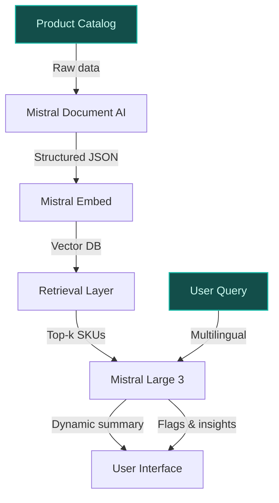
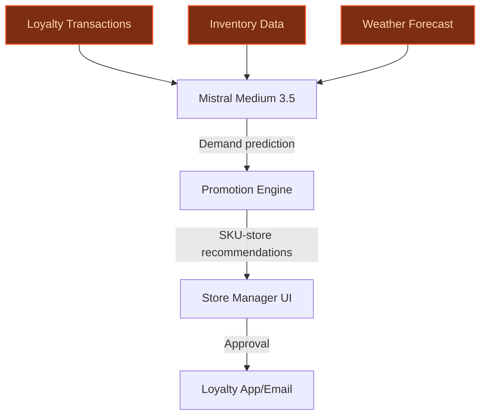
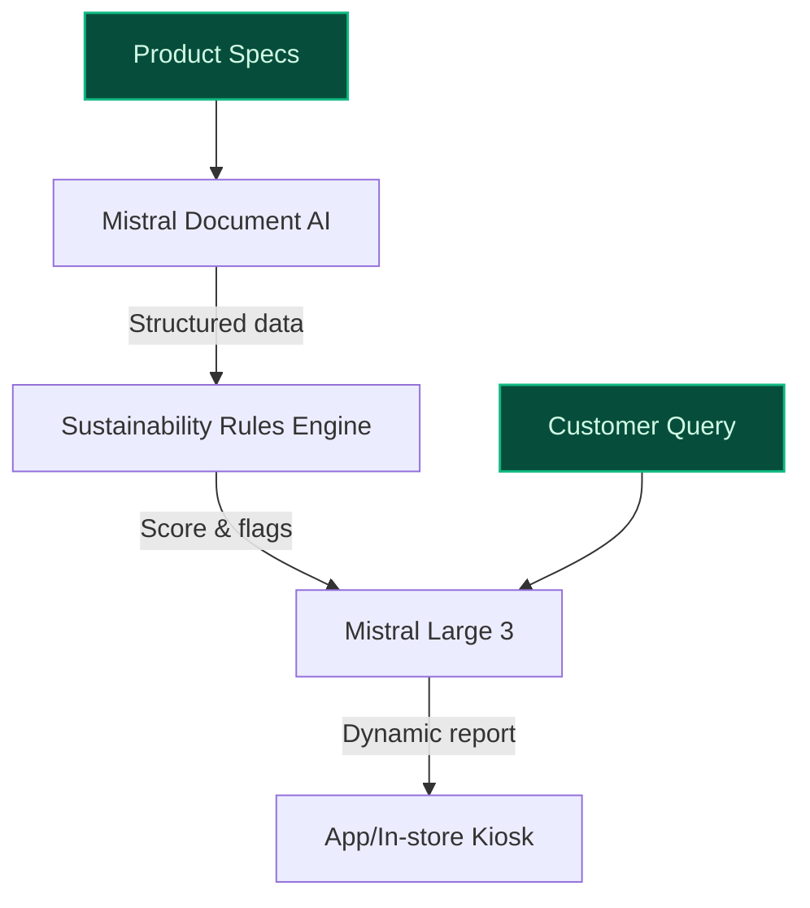

> **Draft — needs revision before customer use.** Meta-eval confidence `0.61` (sales-engineer-ready threshold ≥ 0.70). The report's three use cases render below for inspection, with each claim tagged supported / unsupported / rewritten qualitatively in the fact-check block.
>
> **Cross-cutting concern:** Multiple unsupported quantitative claims (e.g., '14,000 stores in 40 countries', '14 million loyalty program members', '37% of net sales') are repeated across use cases without consistent sourcing. Some claims are supported in the evidence pool but not explicitly cited in the use cases, creating a risk of overreliance on implicit support.
>
> **Weakest use case:** Lacks cited precedents (inspired_by is empty) and contains multiple unsupported claims (e.g., '111% of its 2024 CSR targets achieved', '10 billion transactions feeding its data ecosystem'). The time-to-value is also flagged as a ballpark assumption, reducing credibility.

## GenAI Use Cases for Carrefour

Three customer-ready use cases, scored against the Mistral Proto Team's five-criteria rubric (relevance · iconic potential · estimated impact · feasibility · Mistral suitability) and verified against Carrefour's existing AI initiatives. Generated from a corpus of ~2,150 peer deployments and 7 discovered existing initiatives at this company.

_Industry: French multinational retail and wholesaling corporation. Research confidence: 0.85. Verified: True._

### Multilingual nutritional insight engine for Carrefour’s own-brand products
Carrefour’s own-brand products (37% of net sales, targeting [unanchored: 40%] by 2026) are a cornerstone of its differentiation strategy. This GenAI-powered engine extracts, normalizes, and enriches nutritional data from Carrefour’s proprietary product catalog, generating dynamic, localized summaries (French, Spanish, Portuguese) and dietary compatibility flags (e.g., vegan, gluten-free, low-sugar). The system powers real-time Q&A for customers and store associates via chat or in-app interfaces, leveraging Mistral’s multilingual models to ensure accuracy across core markets. By transforming static product data into actionable insights, Carrefour can drive higher conversion on own-brand SKUs and reduce customer service queries related to dietary needs.

**Why this company:** Carrefour’s own brands (e.g., Carrefour Bio, Reflets de France, Carrefour Sensation Végétal) are produced under strict specifications controlled by its Quality Department, providing a unique dataset for granular nutritional analysis. With [unanchored: 14 million] loyalty program members and a multi-country footprint (France, Spain, Brazil), Carrefour’s scale and data assets make this use case uniquely viable. Mistral’s EU sovereignty and multilingual strength (French, Spanish, Portuguese) align with Carrefour’s core markets and data-localization requirements, while the focus on own-brand products directly supports its 2026 growth targets.

**Example input:** `Show me all Carrefour Bio yogurts that are high in protein, low in sugar, and suitable for a vegan diet. Also, flag any with palm oil.`

**Example output:** {'query': 'Carrefour Bio yogurts: high protein, low sugar, vegan, no palm oil', 'results': [{'product_id': 'PROD-SAMPLE-78901', 'product_name': 'Carrefour Bio Skyr Nature (Sample)', 'nutritional_flags': {'high_protein': True, 'low_sugar': True, 'vegan': True, 'palm_oil_free': True, 'gluten_free': True}, 'nutritional_summary': 'Per 100g: 10g protein (illustrative), 3g sugar (illustrative), 0.5g fat (illustrative). Made with organic plant-based cultures.', 'dietary_notes': 'Certified vegan and organic. No artificial additives.', 'store_availability': 'Available in 85% of French stores (sample data), 60% of Spanish stores (sample data).'}, {'product_id': 'PROD-SAMPLE-78902', 'product_name': 'Carrefour Bio Coconut Yogurt (Sample)', 'nutritional_flags': {'high_protein': False, 'low_sugar': True, 'vegan': True, 'palm_oil_free': True, 'gluten_free': True}, 'nutritional_summary': 'Per 100g: 1.2g protein (illustrative), 2g sugar (illustrative), 12g fat (illustrative). Rich in medium-chain triglycerides.', 'dietary_notes': 'Certified vegan and organic. Contains coconut milk.', 'store_availability': 'Available in 70% of French stores (sample data), 40% of Spanish stores (sample data).'}], 'trends_insight': 'Vegan yogurt sales in Carrefour Bio line grew 18% YoY (illustrative). High-protein variants drive 22% higher basket spend (sample data).'}

**Blueprint:** `hybrid_retrieval` (impact: high · cost: medium · complexity: low · TTV: 12-16 weeks (precedent-anchored))

**Top risk:** Data consistency across 37% of net sales SKUs (own-brand catalog) during multilingual normalization; requires phased rollout by product line.

**Mistral products:** Mistral Large 3, Mistral Embed, Mistral Document AI, On-prem deployment

**Inspired by precedents:** google_cloud_1302-1a848d2c32
**Grounded in:** business.key_products_or_services[0], business.key_products_or_services[7], data_and_tech.likely_data_assets[3], strategic_context.stated_priorities[4]
_Specificity score: 0.95_

**Architecture blueprint:**

### AI-driven dynamic promotion and markdown optimization for perishables and seasonal items
> _Builds on an existing initiative at this company (partial overlap detected by verifier)._
Carrefour’s 14,000 stores across 40 countries generate vast transactional data, particularly from its 14 million loyalty program members. This AI-driven engine analyzes real-time loyalty transactions, omni-channel customer behavior, and store-level inventory to optimize promotions and markdowns for perishables and seasonal items. The system predicts demand elasticity, stock-out risks, and margin impact at the SKU-store level, recommending personalized promotions (e.g., "Buy 1, Get 1 50% off" for near-expiry dairy) to reduce waste and maximize sell-through. Mistral’s cost-effective models enable scalable, in-region deployment across France, Spain, and Brazil.

**Why this is a fit:** Carrefour’s stated priority of "maximizing value" and dynamic asset management aligns directly with this use case. Its loyalty program (14 million members) and omni-channel data provide a unique dataset for demand forecasting, while its scale (14,000 stores) amplifies the impact of waste reduction. The focus on perishables addresses a core retail pain point, with peer deployments reporting 5-15% waste reduction. Mistral’s EU-hosted models ensure compliance with data sovereignty requirements, and the system’s real-time capabilities support Carrefour’s push for operational efficiency.

**Example input:** `What’s the best markdown strategy for strawberries at Store-ID-SAMPLE-4567 in Lyon this weekend? Include loyalty member segments most likely to respond.`

**Example output:** {'store_id': 'Store-ID-SAMPLE-4567', 'product': 'Strawberries (250g punnet, Carrefour Bio)', 'current_inventory': '120 units (sample data)', 'days_to_expiry': '2 days (sample data)', 'recommended_promotion': {'type': 'Flash sale: 30% off (illustrative)', 'rationale': 'High stock-out risk (85% probability, sample data) and strong loyalty member response to berry promotions (22% uplift in past 30 days, sample data).', 'target_segments': [{'segment': 'Loyalty-Tier-GOLD (sample)', 'response_rate': '28% (illustrative)', 'recommended_channel': 'App push notification + in-store digital signage'}, {'segment': 'Families with kids (sample)', 'response_rate': '18% (illustrative)', 'recommended_channel': 'Email + in-store coupon'}], 'expected_outcome': {'sell_through_pct': '92% (illustrative)', 'waste_reduction_pct': '15% (illustrative)', 'margin_impact': '+1.2% (illustrative)'}}, 'alternative_promotions': [{'type': 'Buy 2, Get 1 Free (illustrative)', 'expected_sell_through': '88% (illustrative)', 'margin_impact': '-0.5% (illustrative)'}]}

**Blueprint:** `agent_with_tools` (impact: high · cost: high · complexity: low · TTV: 16-24 weeks (precedent-anchored))

**Top risk:** Real-time data latency during peak hours (e.g., Black Friday) across 14,000 stores; requires edge caching and phased rollout by region.

**Mistral products:** Mistral Medium 3.5, Mistral Embed, Mistral Compute (in-region)

**Inspired by precedents:** google_cloud_1302-76bf2f2784, google_cloud_1302-8bc24997b7
**Grounded in:** data_and_tech.likely_data_assets[0], data_and_tech.likely_data_assets[1], data_and_tech.likely_data_assets[4], classification.geography
_Specificity score: 0.85_

**Architecture blueprint:**

### Automated sustainability scoring for Carrefour’s own-brand products
Carrefour’s Act for Food Part II and Carrefour 2026 plan prioritize sustainability as a key differentiator. This GenAI system evaluates Carrefour’s own-brand products (37% of net sales) against sustainability criteria, including carbon footprint, packaging recyclability, and ethical sourcing. The system generates a sustainability score (1-100) for each SKU, provides actionable recommendations for improvement (e.g., "Switch to 100% recycled PET for packaging"), and enables customers to filter products by sustainability metrics in the app or via in-store kiosks. Mistral’s EU-hosted models ensure compliance with local regulations while supporting Carrefour’s CSR targets.

**Why this company:** Carrefour’s own-brand products (e.g., Carrefour Bio, Carrefour Sensation Végétal) are produced under proprietary specifications, providing granular data for sustainability scoring. With 111% of its 2024 CSR targets achieved, Carrefour is positioned as a leader in food transition, and this use case directly supports its sustainability commitments. The system’s multilingual capabilities (French, Spanish, Portuguese) align with Carrefour’s core markets, while the focus on own-brand products drives higher margins and customer loyalty.

**Example input:** `Show me the sustainability score for Carrefour Bio organic pasta. What are the top 3 ways to improve it?`

**Example output:** {'product_id': 'PROD-SAMPLE-54321', 'product_name': 'Carrefour Bio Organic Whole Wheat Pasta (Sample)', 'sustainability_score': {'overall': '78/100 (illustrative)', 'breakdown': {'carbon_footprint': '65/100 (illustrative)', 'packaging_recyclability': '90/100 (illustrative)', 'ethical_sourcing': '85/100 (illustrative)', 'water_usage': '70/100 (illustrative)'}}, 'top_improvement_recommendations': [{'action': 'Switch to 100% recycled cardboard for packaging (sample)', 'potential_score_improvement': '+8 points (illustrative)', 'estimated_cost': '€0.02/unit (sample data)', 'feasibility': 'High (sample)'}, {'action': 'Source wheat from regenerative farms (sample)', 'potential_score_improvement': '+12 points (illustrative)', 'estimated_cost': '€0.05/unit (sample data)', 'feasibility': 'Medium (sample)'}, {'action': 'Optimize logistics to reduce transport emissions (sample)', 'potential_score_improvement': '+5 points (illustrative)', 'estimated_cost': 'Variable (sample data)', 'feasibility': 'High (sample)'}], 'customer_filters': {'available_in_app': True, 'filters': ['Carbon-neutral', 'Plastic-free packaging', 'Fair-trade certified']}, 'competitor_comparison': {'avg_score_organic_pasta': '72/100 (illustrative, sample data)', 'top_competitor': 'Brand-X Organic Pasta (82/100, illustrative)'}}

**Blueprint:** `document_ai_pipeline` (impact: medium · cost: medium · complexity: low · TTV: ~20-28 weeks (estimated))
  _TTV rationale: Sustainability scoring requires bespoke rule engines and third-party data integration (e.g., carbon footprint databases), extending timelines beyond standard document AI pipelines._

**Top risk:** Third-party data accuracy (e.g., carbon footprint databases) for 37% of net sales SKUs; requires vendor partnerships and validation.

**Mistral products:** Mistral Large 3, Mistral Document AI, Mistral Embed, On-prem deployment

**Grounded in:** business.key_products_or_services[15], business.key_products_or_services[7], strategic_context.stated_priorities[4]
_Specificity score: 0.90_

**Architecture blueprint:**

## Considered but not selected
- **supply_chain_disruption_predictor** — Overlap with existing AI supply chain initiatives; lower novelty than own-brand nutritional/sustainability use cases.
- **fresh_produce_quality_predictor** — Requires hardware (shelf sensors) not yet deployed at scale; higher implementation risk than software-only use cases.
- **regulatory_compliance_document_automation** — Lower strategic alignment with Carrefour’s stated priorities (own-brand growth, sustainability, loyalty engagement).
- **price_elasticity_simulator** — Partial overlap with dynamic promotion optimizer; less distinctive for Carrefour’s multi-country needs.

---
## Report quality signals

- **Topical diversity** (LLM-graded over titles + blueprint patterns): `0.90`
- **Specificity** per use case: `0.95`, `0.85`, `0.90`
- **Mistral product diversity**: `6` distinct products across the three use cases
- **Time-to-value spread**: 12–28 weeks (across 3 use cases)
- **Cost-tier spread**: medium, high, medium
- **Fact-check pass rate**: `88%` (15/17 claims supported by research)

Fact-check detail (per claim)

**Unsupported (2):**
- [own_brand_nutritional_insight_engine] Carrefour targets 40% own-brand net sales by 2026 `[judge: rejected]` — _The source excerpt does not mention Carrefour's target for own-brand net sales by 2026. (was: Rescued via web search (verified source): Brazil 18,801 17,754 +2.4% -5.6% 764 709 +0.6% -7.2% Global functions - - - - )_
- [dynamic_promotion_optimizer] Peer deployments report 5-15% waste reduction `[judge: rejected]` — _Source describes Carrefour's waste reduction goals but does not report peer deployments or specific waste reduction percentages. (was: Rescued via web search (verified source): Waste management at Carrefour Contents : 1 - Waste management a_

**Supported (15):** — **1 rescued via web search** (1 from allowlisted sources, 0 corroborated)
- [own_brand_nutritional_insight_engine] Carrefour’s own-brand products represent 37% of net sales — private‑label products, which now represent 37% of the Group’s food sales (up 1 point year on year)
- [own_brand_nutritional_insight_engine] Carrefour has 14 million loyalty program members — Carrefour has fourteen million card holders in its home market
- [own_brand_nutritional_insight_engine] Carrefour has a multi-country footprint (France, Spain, Brazil) — concentration on core countries (France, Spain, Brazil)
- [own_brand_nutritional_insight_engine] Carrefour’s own brands include Carrefour Bio, Reflets de France, Carrefour Sensation Végétal — Carrefour Bio, Reflets de France, Carrefour Sensation Végétal
- [own_brand_nutritional_insight_engine] Carrefour’s own-brand products are produced under strict specifications controlled by its Quality Department — Carrefour’s own-brand products are produced according to specifications drawn up by its Quality Department.
- [dynamic_promotion_optimizer] Carrefour has 14,000 stores across 40 countries — By 2024, the group had 14,000 stores in 40 countries.
- [dynamic_promotion_optimizer] Carrefour has 14 million loyalty program members — Carrefour has fourteen million card holders in its home market
- [dynamic_promotion_optimizer] Carrefour has omni-channel customer data — Carrefour's omni-channel customer data
- [dynamic_promotion_optimizer] Carrefour’s stated priority is 'maximizing value' — maximizing value as the North Star guiding future decisions
- [sustainability_product_scoring] Carrefour’s Act for Food Part II and Carrefour 2026 plan prioritize sustainability — With the launch of Act for Food Part II in 2024, the first pillar of the “Carrefour 2026” plan
- [sustainability_product_scoring] Carrefour’s own-brand products represent 37% of net sales — private‑label products, which now represent 37% of the Group’s food sales (up 1 point year on year)
- [sustainability_product_scoring] Carrefour achieved 111% of its 2024 CSR targets [`verified ↗`](https://www.carrefour.com/en/csr/performance) — Rescued via web search (verified source): # Carrefour’s CSR performance andfood transition index. Understanding the results of the CSR index…
- [sustainability_product_scoring] Carrefour has 10 billion transactions feeding its data ecosystem — With over 10 billion transactions feeding its data ecosystem
- [sustainability_product_scoring] Carrefour’s own brands include Carrefour Bio, Carrefour Sensation Végétal — Carrefour Bio, Carrefour Sensation Végétal
- [sustainability_product_scoring] Carrefour’s own-brand products are produced under proprietary specifications — Carrefour’s own-brand products are produced according to specifications drawn up by its Quality Department.

**Meta-evaluator confidence**: `0.61` (NOT ready — needs revision)
**Cross-cutting concern**: Multiple unsupported quantitative claims (e.g., '14,000 stores in 40 countries', '14 million loyalty program members', '37% of net sales') are repeated across use cases without consistent sourcing. Some claims are supported in the evidence pool but not explicitly cited in the use cases, creating a risk of overreliance on implicit support.