# Pipeline blueprint (architecture)

Static view of the pipeline regardless of run timing — shows agents,
models, and gates. The chronological execution log follows below.

```mermaid
flowchart TD
    Start([User: company name]) --> R
    R["<b>1. Research</b><br/>parallel: Wikipedia · Tavily news ·<br/>existing initiatives · live verification<br/><i>mistral-medium</i> synthesis"]
    R --> G["<b>1b. Gap-fill</b><br/>identify missing fields →<br/><i>mistral-small</i> generates queries →<br/>Tavily search per field →<br/><i>mistral-small</i> per-field extraction"]
    G --> Conf{Confidence ≥ 0.5<br/>OR verified<br/>OR ≥ 1 existing initiative?}
    Conf -->|no| Refuse([Refusal])
    Conf -->|yes| Ret
    Ret["<b>2. Retrieve</b><br/><i>mistral-embed</i> on company query →<br/>cosine top-K + industry/depth filter +<br/>MMR diversification"]
    Ret --> Gen["<b>3. Generate 12 candidates</b><br/><i>mistral-medium</i> with web_search tool<br/>(Tavily + deep-read) — fact citations<br/>flow into the EvidenceLedger"]
    Gen --> Score["<b>4. Score</b><br/>self-consistency: 2 parallel passes<br/><i>mistral-small</i> @ T=0.2 and T=0.4 →<br/>aggregate weighted scores"]
    Score --> Verify["<b>5. Per-candidate verify</b><br/>top-3: Tavily search + deep-read +<br/><i>mistral-small</i> verdict (pass /<br/>partial / confirmed_existing)"]
    Verify --> Enrich["<b>6. Enrich</b><br/><i>mistral-large</i> drafts customer-facing<br/>prose for 3 use cases (or<br/><i>mistral-medium</i> on fast tier)"]
    Enrich --> NumScrub["<b>6a. Numeric scrub</b><br/>flag any number not in cited content"]
    NumScrub --> Polish["<b>6b. Polish</b><br/><i>mistral-small</i> per use case (parallel):<br/>convert markers→qualitative,<br/>(ev-XXX)→[title](url)"]
    Polish --> Attr["<b>6c. Attribution check</b><br/><i>mistral-small</i> per use case (parallel):<br/>fix corpus-ID ↔ company mismatches"]
    Attr --> Meta["<b>7. Meta-evaluation</b><br/><i>mistral-medium</i> reviews report against<br/>cited precedents + ledger entries:<br/>strict claim verification"]
    Meta --> RegenQ{confidence < 0.6<br/>AND not fast tier?}
    RegenQ -->|yes| Regen["<b>7b. Targeted regen</b><br/><i>mistral-large</i> re-enriches just the<br/>weakest use case with the next-best<br/>near-miss; re-runs meta-eval"]
    RegenQ -->|no| QS
    Regen --> QS
    QS["<b>Quality signals</b><br/>LLM-graded diversity + specificity,<br/>fact-check pass rate, TTV/cost spread"]
    QS --> Render([Markdown report + trace])

    classDef agent fill:#fef3c7,stroke:#f59e0b
    classDef gate fill:#dbeafe,stroke:#3b82f6
    classDef io fill:#dcfce7,stroke:#16a34a
    class R,G,Ret,Gen,Score,Verify,Enrich,NumScrub,Polish,Attr,Meta,Regen,QS agent
    class Conf,RegenQ gate
    class Start,Refuse,Render io
```

## Execution trace — Carrefour

Started: `2026-05-09T16:27:58.782382+00:00`. Total wall time: `241.1s` across `42` recorded actions.

### Per-step time totals

| Step | Calls | Total time | Avg time |
|---|---:|---:|---:|
| `research` | 1 | 8.24s | 8244ms |
| `gap_fill` | 4 | 4.66s | 1166ms |
| `retrieve` | 2 | 0.66s | 332ms |
| `generate` | 2 | 35.89s | 17944ms |
| `generate.web_search` | 2 | 6.51s | 3255ms |
| `score` | 2 | 36.87s | 18434ms |
| `verify` | 6 | 25.07s | 4179ms |
| `enrich` | 1 | 58.84s | 58839ms |
| `polish` | 3 | 18.81s | 6270ms |
| `meta_eval` | 2 | 23.41s | 11705ms |
| `regen_one` | 1 | 23.62s | 23624ms |
| `web_verify` | 1 | 1.44s | 1443ms |
| `source_judge` | 13 | 20.39s | 1568ms |
| `quality_signals` | 2 | 5.12s | 2560ms |

### Chronological event log

- `16:28:00.667` **[research]** `mistral-medium-2604.chat.complete` — 8244ms
   - inputs: synthesize CompanyContext for Carrefour | depth=medium
   - outputs: industry='French multinational retail and wholesaling corporation' verified=True conf=0.75
- `16:28:08.913` **[gap_fill]** `mistral-small-2603.chat.complete` — 1209ms
   - inputs: generate gap queries | fields=['business_model', 'products', 'data_assets', 'priorities']
   - outputs: queries=4
- `16:28:18.991` **[gap_fill]** `mistral-small-2603.chat.complete` — 959ms
   - inputs: layer-2 extract field=priorities
   - outputs: items=7
- `16:28:18.997` **[gap_fill]** `mistral-small-2603.chat.complete` — 1177ms
   - inputs: layer-2 extract field=data_assets
   - outputs: items=6
- `16:28:19.000` **[gap_fill]** `mistral-small-2603.chat.complete` — 1318ms
   - inputs: layer-2 extract field=products
   - outputs: items=23
- `16:28:20.321` **[retrieve]** `mistral-embed.embeddings.create` — 321ms
   - inputs: company_query | industries='French multinational retail and wholesaling corporation'
   - outputs: embedded 1024-dim query vector
- `16:28:20.642` **[retrieve]** `precedent_corpus.cosine_topk` — 343ms
   - inputs: k=8 min_depth=0.4 target='Carrefour'
   - outputs: retrieved 8 | mmr=True | top_sim=0.798
- `16:28:21.643` **[generate]** `mistral-medium-2604.chat.complete` — 1918ms
   - inputs: iteration=0 tool_calls_used=0/2 tools=on
   - outputs: tool_calls=4 | content_chars=0
- `16:28:23.576` **[generate.web_search]** `tavily.search` — 4080ms
   - inputs: query='Carrefour loyalty programme 14 million members details 2024'
   - outputs: 2 raw results
- `16:28:29.833` **[generate.web_search]** `tavily.search` — 2430ms
   - inputs: query='Carrefour own brands product data 2024'
   - outputs: 2 raw results
- `16:28:37.515` **[generate]** `mistral-medium-2604.chat.complete` — 33970ms
   - inputs: iteration=1 tool_calls_used=2/2 tools=off
   - outputs: tool_calls=0 | content_chars=22844
- `16:29:11.941` **[score]** `mistral-small-2603.chat.complete` — 18000ms
   - inputs: self-consistency pass T=0.2
   - outputs: scored 12 candidates
- `16:29:11.947` **[score]** `mistral-small-2603.chat.complete` — 18868ms
   - inputs: self-consistency pass T=0.4
   - outputs: scored 12 candidates
- `16:29:30.851` **[verify]** `tavily.search` — 2056ms
   - inputs: candidate=own_brand_nutritional_insight_engine | query='Carrefour Multilingual nutritional insight engine for Carref'
   - outputs: 4 results
- `16:29:30.852` **[verify]** `tavily.search` — 3254ms
   - inputs: candidate=dynamic_promotion_optimizer | query='Carrefour AI-driven dynamic promotion and markdown optimizat'
   - outputs: 4 results
- `16:29:30.852` **[verify]** `tavily.search` — 2764ms
   - inputs: candidate=supply_chain_disruption_predictor | query='Carrefour AI-powered supply chain disruption predictor for f'
   - outputs: 4 results
- `16:29:33.516` **[verify]** `mistral-small-2603.chat.complete` — 5690ms
   - inputs: verdict for own_brand_nutritional_insight_engine
   - outputs: verdict='pass'
- `16:29:34.425` **[verify]** `mistral-small-2603.chat.complete` — 3478ms
   - inputs: verdict for supply_chain_disruption_predictor
   - outputs: verdict='confirmed_existing'
- `16:29:38.029` **[verify]** `mistral-small-2603.chat.complete` — 7833ms
   - inputs: verdict for dynamic_promotion_optimizer
   - outputs: verdict='partial_overlap'
- `16:29:45.864` **[enrich]** `mistral-large-2512.chat.complete` — 58839ms
   - inputs: tier=standard top_3=['own_brand_nutritional_insight_engine', 'dynamic_promotion_optimizer', 'sustainability_product_scoring']
   - outputs: enriched 3 use cases
- `16:30:44.732` **[polish]** `mistral-small-2603.chat.complete` ❌ — 12691ms
   - inputs: use_case=own_brand_nutritional_insight_engine unanchored=True opaque_ev=False
   - error: `SDKError`
- `16:30:44.738` **[polish]** `mistral-small-2603.chat.complete` — 2668ms
   - inputs: use_case=dynamic_promotion_optimizer unanchored=True opaque_ev=False
   - outputs: polished 5 fields
- `16:30:57.426` **[meta_eval]** `mistral-medium-2604.chat.complete` — 11078ms
   - inputs: reviewing 3 use cases
   - outputs: review + claims
- `16:31:08.505` **[regen_one]** `mistral-large-2512.chat.complete` — 23624ms
   - inputs: replace weakest=sustainability_product_scoring with supply_chain_disruption_predictor
   - outputs: single use case enriched
- `16:31:32.142` **[polish]** `mistral-small-2603.chat.complete` — 3450ms
   - inputs: use_case=supply_chain_disruption_predictor unanchored=True opaque_ev=False
   - outputs: polished 5 fields
- `16:31:35.593` **[meta_eval]** `mistral-medium-2604.chat.complete` — 12332ms
   - inputs: reviewing 3 use cases
   - outputs: review + claims
- `16:31:47.951` **[web_verify]** `tavily.search.rescue_unsupported_claims` — 1443ms
   - inputs: company='Carrefour' unsupported=3 budget=12
   - outputs: rescued: verified=3 corroborated=0 of 3 attempted
- `16:31:49.396` **[source_judge]** `mistral-small-2603.judge_claim_sources` — 5079ms
   - inputs: pairs=12
   - outputs: judged 12 pairs
- `16:31:49.397` **[source_judge]** `mistral-small-2603.chat.complete` — 1679ms
   - inputs: claim='Carrefour’s own-brand products represent 37% of net sales'
   - outputs: supports=True
- `16:31:49.402` **[source_judge]** `mistral-small-2603.chat.complete` — 990ms
   - inputs: claim='Carrefour targets 40% own-brand net sales by 2026'
   - outputs: supports=False
- `16:31:49.407` **[source_judge]** `mistral-small-2603.chat.complete` — 618ms
   - inputs: claim='Carrefour has 14 million loyalty program members'
   - outputs: supports=True
- `16:31:49.411` **[source_judge]** `mistral-small-2603.chat.complete` — 1669ms
   - inputs: claim='Carrefour’s own-brand products are produced under strict spe'
   - outputs: supports=True
- `16:31:50.025` **[source_judge]** `mistral-small-2603.chat.complete` — 2056ms
   - inputs: claim='Carrefour has 14,000 stores across 40 countries'
   - outputs: supports=True
- `16:31:50.392` **[source_judge]** `mistral-small-2603.chat.complete` — 927ms
   - inputs: claim='Carrefour has 14 million loyalty program members'
   - outputs: supports=True
- `16:31:51.075` **[source_judge]** `mistral-small-2603.chat.complete` — 1010ms
   - inputs: claim='Peer deployments report 5-15% waste reduction'
   - outputs: supports=False
- `16:31:51.081` **[source_judge]** `mistral-small-2603.chat.complete` — 1005ms
   - inputs: claim='Carrefour’s Act for Food Part II and Carrefour 2026 plan pri'
   - outputs: supports=True
- `16:31:51.319` **[source_judge]** `mistral-small-2603.chat.complete` — 767ms
   - inputs: claim='Carrefour’s own-brand products represent 37% of net sales'
   - outputs: supports=True
- `16:31:52.081` **[source_judge]** `mistral-small-2603.chat.complete` — 1343ms
   - inputs: claim='Carrefour achieved 111% of its 2024 CSR targets'
   - outputs: supports=True
- `16:31:52.086` **[source_judge]** `mistral-small-2603.chat.complete` — 856ms
   - inputs: claim='Carrefour has 10 billion transactions feeding its data ecosy'
   - outputs: supports=True
- `16:31:52.089` **[source_judge]** `mistral-small-2603.chat.complete` — 2387ms
   - inputs: claim='Carrefour’s own-brand products are produced under proprietar'
   - outputs: supports=True
- `16:31:54.752` **[quality_signals]** `mistral-small-2603.chat.complete` — 3205ms
   - inputs: specificity grade (3 use cases)
   - outputs: scored 3 use cases
- `16:31:57.957` **[quality_signals]** `mistral-small-2603.chat.complete` — 1915ms
   - inputs: diversity grade
   - outputs: diversity=0.9

## Mermaid sequence diagram (execution)

```mermaid
sequenceDiagram
    autonumber
    participant pipeline as pipeline
    participant mistral_medium_2604 as mistral-medium-2604
    participant mistral_small_2603 as mistral-small-2603
    participant mistral_embed as mistral-embed
    participant precedent_corpus as precedent_corpus
    participant tavily as tavily
    participant mistral_large_2512 as mistral-large-2512
    participant tavily_search as tavily.search
    pipeline->>mistral_medium_2604: research: chat.complete (8244ms)
    mistral_medium_2604-->>pipeline: industry='French multinational retail and wholesaling corpor
    pipeline->>mistral_small_2603: gap_fill: chat.complete (1209ms)
    mistral_small_2603-->>pipeline: queries=4
    pipeline->>mistral_small_2603: gap_fill: chat.complete (959ms)
    mistral_small_2603-->>pipeline: items=7
    pipeline->>mistral_small_2603: gap_fill: chat.complete (1177ms)
    mistral_small_2603-->>pipeline: items=6
    pipeline->>mistral_small_2603: gap_fill: chat.complete (1318ms)
    mistral_small_2603-->>pipeline: items=23
    pipeline->>mistral_embed: retrieve: embeddings.create (321ms)
    mistral_embed-->>pipeline: embedded 1024-dim query vector
    pipeline->>precedent_corpus: retrieve: cosine_topk (343ms)
    precedent_corpus-->>pipeline: retrieved 8 | mmr=True | top_sim=0.798
    pipeline->>mistral_medium_2604: generate: chat.complete (1918ms)
    mistral_medium_2604-->>pipeline: tool_calls=4 | content_chars=0
    pipeline->>tavily: generate.web_search: search (4080ms)
    tavily-->>pipeline: 2 raw results
    pipeline->>tavily: generate.web_search: search (2430ms)
    tavily-->>pipeline: 2 raw results
    pipeline->>mistral_medium_2604: generate: chat.complete (33970ms)
    mistral_medium_2604-->>pipeline: tool_calls=0 | content_chars=22844
    pipeline->>mistral_small_2603: score: chat.complete (18000ms)
    mistral_small_2603-->>pipeline: scored 12 candidates
    pipeline->>mistral_small_2603: score: chat.complete (18868ms)
    mistral_small_2603-->>pipeline: scored 12 candidates
    pipeline->>tavily: verify: search (2056ms)
    tavily-->>pipeline: 4 results
    pipeline->>tavily: verify: search (3254ms)
    tavily-->>pipeline: 4 results
    pipeline->>tavily: verify: search (2764ms)
    tavily-->>pipeline: 4 results
    pipeline->>mistral_small_2603: verify: chat.complete (5690ms)
    mistral_small_2603-->>pipeline: verdict='pass'
    pipeline->>mistral_small_2603: verify: chat.complete (3478ms)
    mistral_small_2603-->>pipeline: verdict='confirmed_existing'
    pipeline->>mistral_small_2603: verify: chat.complete (7833ms)
    mistral_small_2603-->>pipeline: verdict='partial_overlap'
    pipeline->>mistral_large_2512: enrich: chat.complete (58839ms)
    mistral_large_2512-->>pipeline: enriched 3 use cases
    pipeline->>mistral_small_2603: polish: chat.complete (12691ms) ERR
    pipeline->>mistral_small_2603: polish: chat.complete (2668ms)
    mistral_small_2603-->>pipeline: polished 5 fields
    pipeline->>mistral_medium_2604: meta_eval: chat.complete (11078ms)
    mistral_medium_2604-->>pipeline: review + claims
    pipeline->>mistral_large_2512: regen_one: chat.complete (23624ms)
    mistral_large_2512-->>pipeline: single use case enriched
    pipeline->>mistral_small_2603: polish: chat.complete (3450ms)
    mistral_small_2603-->>pipeline: polished 5 fields
    pipeline->>mistral_medium_2604: meta_eval: chat.complete (12332ms)
    mistral_medium_2604-->>pipeline: review + claims
    pipeline->>tavily_search: web_verify: rescue_unsupported_claims (1443ms)
    tavily_search-->>pipeline: rescued: verified=3 corroborated=0 of 3 attempted
    pipeline->>mistral_small_2603: source_judge: judge_claim_sources (5079ms)
    mistral_small_2603-->>pipeline: judged 12 pairs
    pipeline->>mistral_small_2603: source_judge: chat.complete (1679ms)
    mistral_small_2603-->>pipeline: supports=True
    pipeline->>mistral_small_2603: source_judge: chat.complete (990ms)
    mistral_small_2603-->>pipeline: supports=False
    pipeline->>mistral_small_2603: source_judge: chat.complete (618ms)
    mistral_small_2603-->>pipeline: supports=True
    pipeline->>mistral_small_2603: source_judge: chat.complete (1669ms)
    mistral_small_2603-->>pipeline: supports=True
    pipeline->>mistral_small_2603: source_judge: chat.complete (2056ms)
    mistral_small_2603-->>pipeline: supports=True
    pipeline->>mistral_small_2603: source_judge: chat.complete (927ms)
    mistral_small_2603-->>pipeline: supports=True
    pipeline->>mistral_small_2603: source_judge: chat.complete (1010ms)
    mistral_small_2603-->>pipeline: supports=False
    pipeline->>mistral_small_2603: source_judge: chat.complete (1005ms)
    mistral_small_2603-->>pipeline: supports=True
    pipeline->>mistral_small_2603: source_judge: chat.complete (767ms)
    mistral_small_2603-->>pipeline: supports=True
    pipeline->>mistral_small_2603: source_judge: chat.complete (1343ms)
    mistral_small_2603-->>pipeline: supports=True
    pipeline->>mistral_small_2603: source_judge: chat.complete (856ms)
    mistral_small_2603-->>pipeline: supports=True
    pipeline->>mistral_small_2603: source_judge: chat.complete (2387ms)
    mistral_small_2603-->>pipeline: supports=True
    pipeline->>mistral_small_2603: quality_signals: chat.complete (3205ms)
    mistral_small_2603-->>pipeline: scored 3 use cases
    pipeline->>mistral_small_2603: quality_signals: chat.complete (1915ms)
    mistral_small_2603-->>pipeline: diversity=0.9
```

