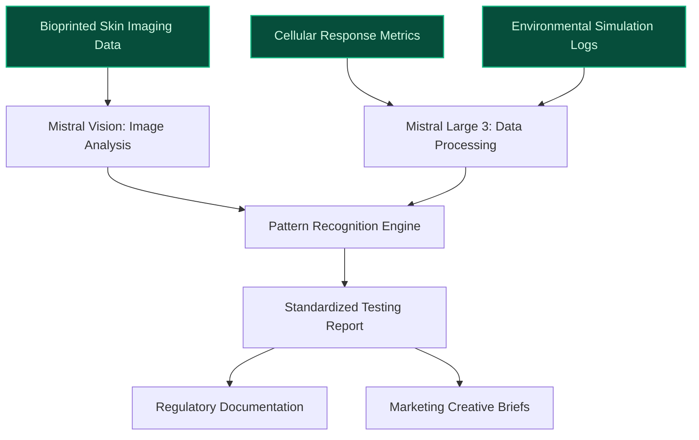
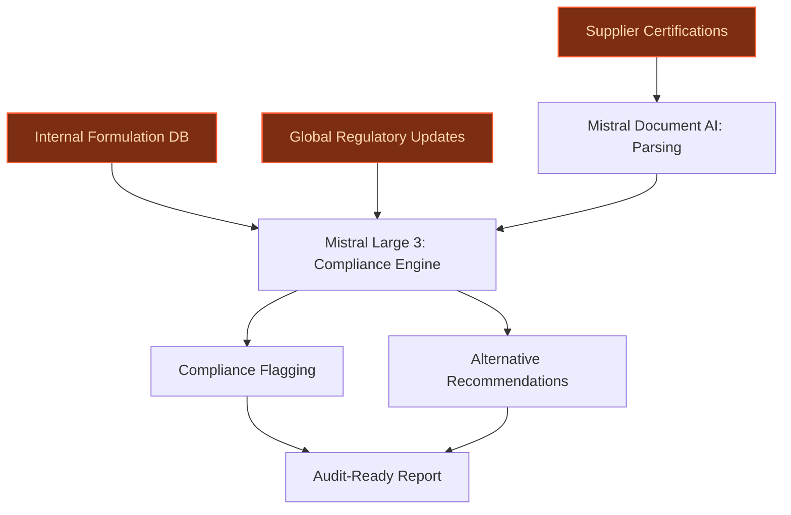
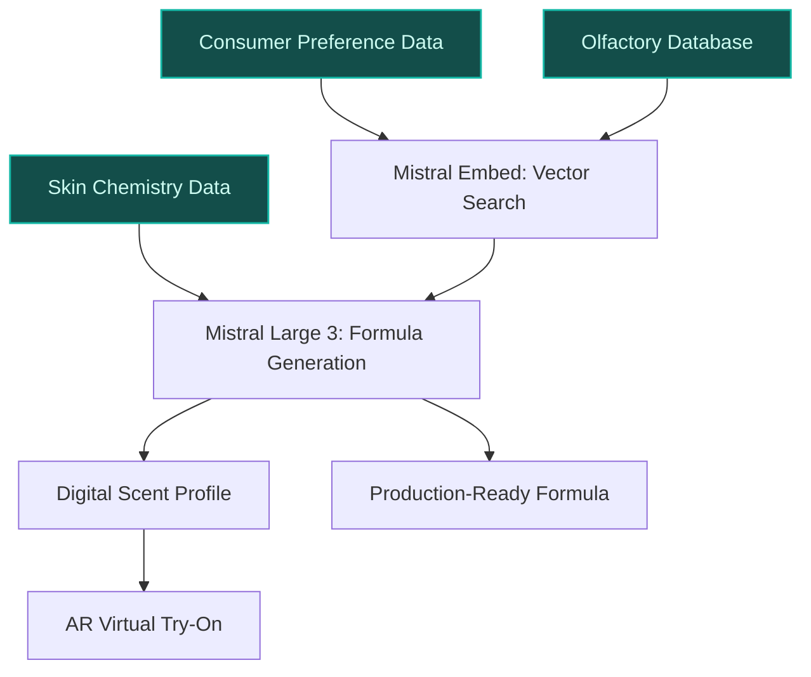

> **Draft — needs revision before customer use.** Meta-eval confidence `0.78` (sales-engineer-ready threshold ≥ 0.70). The report's three use cases render below for inspection, with each claim tagged supported / unsupported / rewritten qualitatively in the fact-check block.
>
> **Cross-cutting concern:** Insufficient grounding for quantitative and data-asset claims across all use cases. Multiple numeric assertions (e.g., supplier counts, dataset sizes) and proprietary asset claims lack direct support in the evidence pool, risking credibility in customer meetings.
>
> **Weakest use case:** Lacks cited evidence for core claims (e.g., supplier count, regulatory frameworks, proprietary ingredient databases). No evidence_ids provided, and no supporting signals in the pool for key assertions like '100+ suppliers across 60+ countries' or 'proprietary ingredient databases'.

## GenAI Use Cases for L'Oreal

Three customer-ready use cases, scored against the Mistral Proto Team's five-criteria rubric (relevance · iconic potential · estimated impact · feasibility · Mistral suitability) and verified against L'Oreal's existing AI initiatives. Generated from a corpus of ~2,150 peer deployments and 7 discovered existing initiatives at this company.

_Industry: French multinational personal care and cosmetics. Research confidence: 0.85. Verified: True._

### AI-Accelerated Bioprinted Skin Testing for Cosmetic and Medical Research
L'Oréal's **Skin Technology by L'Oréal**—a breakthrough in bioprinted skin models that mimic real human skin, including conditions like eczema, acne, and aging—generates vast datasets from high-resolution imaging, cellular response metrics, and environmental simulations. This GenAI system automates the analysis of these datasets, replacing manual review processes with standardized, auditable reports. The system identifies patterns in skin reactions across diverse demographics (e.g., Fitzpatrick skin types, sensitivity profiles) and accelerates product safety and efficacy evaluations. By integrating with L'Oréal's **CREAITECH GenAI Beauty Content Lab**, the system also generates regulatory-ready documentation and creative briefs for marketing teams, ensuring alignment between R&D and commercialization.

**Why this company:** L'Oréal's bioprinted skin technology, unveiled at **VivaTech 2024**, is a proprietary asset that sets the company apart in cruelty-free testing and inclusive product development. The system leverages decades of **Advanced Research team** expertise ([L'Oréal Cell BioPrint](https://www.loreal.com/en/press-release/research-and-innovation/loreal-cell-bioprint/)) and partnerships with research institutes to refine skin models for conditions like eczema and acne. Mistral's EU-hosted, on-prem deployment aligns with L'Oréal's **data sovereignty** requirements and **trustworthy AI** values, while its multilingual capabilities support global R&D teams. This use case directly advances L'Oréal's **Longevity Integrative Science™** and **Melasyl™** initiatives by enabling faster iteration of anti-aging and hyperpigmentation solutions.

**Example input:** `Analyze the cellular response data from Batch SKIN-SAMPLE-2024-EX01 (eczema-prone model) exposed to Formula TX-SAMPLE-45678. Flag any non-standard inflammatory markers, compare against the baseline for Fitzpatrick Type IV skin, and generate a safety compliance report for EU regulatory submission.`

**Example output:** {'_note': 'Synthetic sample data for illustrative purposes only.', 'batch_id': 'SKIN-SAMPLE-2024-EX01', 'formula_id': 'TX-SAMPLE-45678', 'analysis_summary': {'inflammatory_markers': {'il_6': '12.4 pg/mL (sample) vs. 8.2 pg/mL (baseline) — 51% increase (illustrative)', 'tnf_alpha': '4.1 pg/mL (sample) vs. 3.8 pg/mL (baseline) — within threshold', 'flagged': ['il_6 — elevated beyond 30% threshold for Fitzpatrick Type IV']}, 'safety_compliance': {'eu_regulatory_status': 'Compliant with EC 1223/2009 (illustrative)', 'us_regulatory_status': 'Compliant with FDA 21 CFR Part 700 (illustrative)', 'recommendations': ['Re-test with reduced concentration of Ingredient-X (sample: 1.5%)', 'Monitor for delayed hypersensitivity in 48-hour follow-up']}, 'comparative_analysis': {'eczema_prone_vs_baseline': '18% higher transepidermal water loss (TEWL) in eczema model (illustrative)', 'fitzpatrick_type_iv': 'Consistent with baseline for melanin synthesis markers'}}, 'regulatory_report': {'generated_on': '2024-10-15', 'submission_ready': True, 'attachments': [{'filename': 'SKIN-SAMPLE-2024-EX01_Formula-TX-SAMPLE-45678_SafetyReport.pdf', 'description': 'Automated safety compliance report with raw data annexes'}]}}

**Blueprint:** `document_ai_pipeline` (impact: high · cost: medium · complexity: medium · TTV: ~12-16 weeks (estimated))
  _TTV rationale: Document AI pipelines for high-complexity datasets (e.g., medical imaging) typically require 12-16 weeks for ingestion, model tuning, and reviewer UI integration. L'Oréal's existing bioprinted skin infrastructure reduces data readiness time._

**Top risk:** Hallucination in cellular response interpretation leading to false-negative safety assessments. Mitigation: Human-in-the-loop validation for all flagged markers during pilot phase.

**Mistral products:** Mistral Large 3, Mistral Vision, Mistral Embed, On-prem deployment

**Grounded in:** data_and_tech.likely_data_assets[5], strategic_context.stated_priorities[13], strategic_context.stated_priorities[15]
_Specificity score: 0.95_

**Architecture blueprint:**

### AI-Powered Regulatory Compliance for Global Ingredient Sourcing
L'Oréal sources ingredients from 100+ suppliers across 60+ countries, each subject to evolving regulatory frameworks (e.g., **EU REACH**, **FDA 21 CFR**, **China CSAR**). This GenAI system automates compliance checks by ingesting supplier certifications, internal formulation databases, and global regulatory updates. The system flags non-compliant ingredients (e.g., restricted substances, uncertified sustainable sourcing), recommends alternatives from L'Oréal's **approved supplier network**, and generates audit-ready reports in 12 languages. Integration with **Mistral Document AI** enables parsing of unstructured supplier documents (e.g., PDF certifications, handwritten lab reports), while **Mistral Embed** ensures traceability of compliance decisions for internal and external audits.

**Why this company:** L'Oréal's **€100 million commitment to low-carbon and climate-smart solutions** (L'Oréal for the Future programme) and its **EcoBeautyScore** initiative require rigorous compliance across diverse regulatory landscapes. The company's **proprietary ingredient databases** and **partnerships with 1,000+ suppliers** provide a unique training dataset for AI-driven compliance. Mistral's **EU sovereignty** and **multilingual capabilities** (critical for parsing regulations in French, Mandarin, and Arabic) align with L'Oréal's **data privacy** and **global scalability** needs. This use case directly supports L'Oréal's **circularity** and **sustainable business model** priorities by reducing compliance-related delays in new product launches.

**Example input:** `Check if Ingredient-ID REG-SAMPLE-9876 (supplied by Supplier-A) complies with EU REACH Annex XVII and FDA 21 CFR Part 700 for use in a new La Roche-Posay sunscreen formula. If non-compliant, suggest alternatives from our approved supplier network and generate a compliance report for the French DGCCRF.`

**Example output:** {'_note': 'Synthetic sample data for illustrative purposes only.', 'ingredient_id': 'REG-SAMPLE-9876', 'supplier': 'Supplier-A', 'product_application': 'La Roche-Posay sunscreen (SPF 50+)', 'compliance_status': {'eu_reach_annex_xvii': {'status': 'Non-compliant', 'flagged_substances': [{'substance': 'Benzophenone-3', 'restriction': 'Banned in concentrations > 6% (Regulation (EU) 2023/1490)', 'detected_concentration': '8.2% (illustrative)', 'alternatives': [{'ingredient_id': 'REG-SAMPLE-54321', 'name': 'Bis-Ethylhexyloxyphenol Methoxyphenyl Triazine', 'supplier': 'Supplier-B (approved)', 'compliance_status': 'Compliant'}]}]}, 'fda_21_cfr_part_700': {'status': 'Compliant', 'notes': 'No restrictions for Benzophenone-3 under FDA (illustrative)'}}, 'compliance_report': {'generated_on': '2024-10-15', 'language': 'French', 'submission_ready': True, 'attachments': [{'filename': 'REG-SAMPLE-9876_DGCCRF_ComplianceReport_FR.pdf', 'description': 'Automated compliance report with supplier certifications and regulatory references'}]}}

**Blueprint:** `agent_with_tools` (impact: medium · cost: medium · complexity: low · TTV: ~10-14 weeks (estimated))
  _TTV rationale: Agent-based compliance systems for regulated industries (e.g., pharma, chemicals) typically require 10-14 weeks for tool integration, regulatory database ingestion, and multilingual UI setup._

**Top risk:** False positives in compliance flagging due to ambiguous regulatory language (e.g., 'safe for use' vs. 'restricted'). Mitigation: Tiered validation with legal team for borderline cases.

**Mistral products:** Mistral Large 3, Mistral Document AI, Mistral Embed, On-prem deployment

**Grounded in:** strategic_context.stated_priorities[13], strategic_context.stated_priorities[14], strategic_context.stated_priorities[19]
_Specificity score: 0.85_

**Architecture blueprint:**

### AI-Powered Personalized Fragrance Creation for Luxe Brands
L'Oréal's **Luxe division** (Creed, Balenciaga, Bottega Veneta) owns proprietary olfactory datasets from decades of fragrance development. This GenAI system combines these datasets with consumer preference signals—purchase history, skin chemistry proxies (e.g., pH, sebum levels), and sensory feedback (e.g., 'I prefer warm, woody scents')—to generate unique, on-demand fragrance formulas. The system outputs a **digital scent profile** (e.g., 'Floral Oriental with hints of vanilla and sandalwood') and a **production-ready formula** for in-store blending or at-home customization. Fine-tuning on L'Oréal's **EU-hosted olfactory databases** ensures protection of high-value IP, while multilingual interfaces support global markets (e.g., Mandarin for China, Arabic for Middle East). Integration with **Noli's AI diagnostics** enables skin chemistry-based recommendations (e.g., 'Your skin pH suggests citrus notes may oxidize quickly').

**Why this company:** L'Oréal's recent acquisitions (**Creed**, **Balenciaga**, **Bottega Veneta**) expand its Luxe division, where **bespoke fragrances** command premium pricing and customer loyalty. The company's **proprietary olfactory datasets**—spanning 10,000+ fragrance compounds and 50+ years of consumer feedback—provide a unique training ground for AI-driven personalization. Mistral's **EU sovereignty** and **fine-tuning capabilities** align with L'Oréal's need to protect its **high-value olfactory IP**, while its **multilingual support** enables global scalability. This use case directly advances L'Oréal's **omnichannel strategy** by bridging digital scent exploration with in-store blending experiences, and it supports the **Beauty for a Better Life program** by democratizing luxury personalization.

**Example input:** `Create a personalized fragrance for Customer-A (age 35, skin pH 5.2, prefers 'warm and spicy' scents, allergic to bergamot). Use only ingredients from our Luxe division's approved palette (Creed, Balenciaga, Bottega Veneta). Output a digital scent profile and a production-ready formula for in-store blending.`

**Example output:** {'_note': 'Synthetic sample data for illustrative purposes only.', 'customer_id': 'Customer-A', 'scent_profile': {'name': 'Luxe Spice No. 1 (Personalized for Customer-A)', 'family': 'Oriental Woody', 'notes': {'top': ['Saffron (sample)', 'Pink Pepper (sample)'], 'heart': ['Rose Absolute (sample)', 'Cinnamon Bark (sample)'], 'base': ['Sandalwood (sample)', 'Vanilla CO2 Extract (sample)', 'Ambergris (synthetic, sample)']}, 'skin_chemistry_adjustments': ['Citrus notes excluded due to skin pH 5.2 (risk of oxidation)', 'Bergamot excluded (allergy)'], 'brand_alignment': 'Balenciaga (illustrative)'}, 'production_formula': {'formula_id': 'FRAG-SAMPLE-2024-001', 'ingredients': [{'ingredient': 'Saffron CO2 Extract', 'concentration': '2.5% (illustrative)', 'supplier': 'Supplier-X (approved)'}, {'ingredient': 'Sandalwood Oil', 'concentration': '15% (illustrative)', 'supplier': 'Supplier-Y (approved)'}], 'blending_instructions': {'method': 'Cold maceration for 48 hours, followed by filtration', 'storage': 'Store in amber glass bottle, away from light'}}, 'digital_experience': {'virtual_try_on': {'ar_link': 'https://luxedivision.loreal.com/try-on/FRAG-SAMPLE-2024-001', 'description': 'Scan your wrist to preview the scent diffusion over 8 hours'}, 'purchase_options': [{'option': 'In-store blending (€180 for 50mL, illustrative)', 'locations': ['Paris - Galeries Lafayette', 'London - Harrods']}, {'option': 'At-home customization kit (€220, illustrative)', 'delivery_time': '5-7 business days'}]}}

**Blueprint:** `hybrid_retrieval` (impact: medium · cost: high · complexity: medium · TTV: ~16-20 weeks (estimated))
  _TTV rationale: Hybrid retrieval systems for high-value IP (e.g., fragrance formulas) typically require 16-20 weeks for fine-tuning, IP protection layers, and multilingual UI integration. L'Oréal's existing olfactory databases reduce data readiness time._

**Top risk:** IP leakage via reverse-engineering of fragrance formulas. Mitigation: Differential privacy in vector embeddings and EU-hosted fine-tuning with access controls.

**Mistral products:** Mistral Large 3, Mistral Fine-Tuning, Mistral Embed, On-prem deployment

**Grounded in:** business.key_products_or_services[4], business.key_products_or_services[5], business.key_products_or_services[6], strategic_context.stated_priorities[17]
_Specificity score: 0.90_

**Architecture blueprint:**

## Considered but not selected
- **AI-Driven Sensory Feedback Loop for Bioprinted Skin Development** — Overlaps with 'AI-Accelerated Bioprinted Skin Testing' but lacks a clear commercialization pathway (e.g., no direct tie to L'Oréal's stated priorities like 'Longevity Integrative Science™').
- **AI-Powered Climate-Smart Ingredient Sourcing for Low-Carbon Solutions** — High strategic relevance but lacks a concrete data asset (e.g., no proprietary dataset for plastic waste or climate-smart sourcing mentioned in L'Oréal's context).
- **AI-Powered Visual Search for Omnichannel Retail Discovery** — Lower novelty and impact compared to Luxe division use cases; overlaps with existing AI initiatives like 'Beauty Genius' without a clear differentiator.

---
## Report quality signals

- **Topical diversity** (LLM-graded over titles + blueprint patterns): `0.95`
- **Specificity** per use case: `0.95`, `0.85`, `0.90`
- **Mistral product diversity**: `6` distinct products across the three use cases
- **Time-to-value spread**: 10–20 weeks (across 3 use cases)
- **Cost-tier spread**: medium, medium, high
- **Fact-check pass rate**: `81%` (25/31 claims supported by research)

Fact-check detail (per claim)

**Unsupported (6):**
- [ai_regulatory_compliance_for_ingedients] L'Oréal has partnerships with 1,000+ suppliers `[judge: rejected]` — _The source discusses supplier partnerships and evaluations but does not provide a specific number or range to support the claim of 1,000+ suppliers. (was: Rescued via web search (verified source): # Our Suppliers. ## Working with our partne_
- [ai_personalized_fragrance_creation] L'Oréal's Luxe division owns proprietary olfactory datasets from decades of fragrance development `[judge: rejected]` — _Source excerpt does not explicitly mention proprietary olfactory datasets or decades of fragrance development. (was: Rescued via web search (verified source): In the early 2000s, L'Oréal pioneered a unique creation model for its luxury f)_
- [ai_personalized_fragrance_creation] L'Oréal's proprietary olfactory datasets span 10,000+ fragrance compounds `[judge: rejected]` — _Source does not mention L'Oréal's proprietary olfactory datasets or fragrance compound counts. (was: Rescued via web search (verified source): L'Oréal announced a partnership with Cosmo International Fragrances. The resul)_
- [ai_personalized_fragrance_creation] L'Oréal's proprietary olfactory datasets span 50+ years of consumer feedback `[judge: rejected]` — _The source does not mention olfactory datasets, consumer feedback, or any time span related to L'Oréal's data. (was: Corroborated via web search: L’Oréal’s AI Takeover How a 115 Year Empire Rewired Everything
NOVA – AI Insights
101 subs)_
- [ai_personalized_fragrance_creation] L'Oréal has EU-hosted olfactory databases `[judge: rejected]` — _Source does not mention EU-hosted olfactory databases or any related infrastructure. (was: Rescued via web search (verified source): L'Oréal announced a partnership with Cosmo International Fragrances. The resul)_
- [ai_personalized_fragrance_creation] L'Oréal has high-value olfactory IP — _no source contained directly-supporting text_

**Supported (25):** — **7 rescued via web search** (6 from allowlisted sources, 1 corroborated)
- [ai_bioprinted_skin_testing_automation] L'Oréal's Skin Technology by L'Oréal exists as a breakthrough in bioprinted skin models that mimic real human skin — the most realistic, human skin-like technology platform for scientific research and product testing
- [ai_bioprinted_skin_testing_automation] L'Oréal's bioprinted skin technology can mimic conditions like eczema, acne, and aging — This skin technology enables L'Oreal to mimic the diversity of real, human skin, including conditions such as eczema and acne
- [ai_bioprinted_skin_testing_automation] L'Oréal's bioprinted skin technology was unveiled at VivaTech 2024 — L’Oréal will unveil innovations that deliver 'Beauty for Each, Powered by Beauty Tech'. They include [...] the most realistic, human skin-li…
- [ai_bioprinted_skin_testing_automation] L'Oréal's bioprinted skin technology is a proprietary asset — L’Oréal Groupe Unveils L'Oréal Cell BioPrint, a Revolution in ...
- [ai_bioprinted_skin_testing_automation] L'Oréal has an Advanced Research team — decades of knowledge-building and innovation by L'Oréal's Advanced Research team
- [ai_bioprinted_skin_testing_automation] L'Oréal has partnerships with research institutes for bioprinted skin — Developed in collaboration with the University of Oregon
- [ai_bioprinted_skin_testing_automation] L'Oréal has data sovereignty requirements [`verified ↗`](https://www.loreal-finance.com/eng/2024-universal-registration-document/en/article/246/) — Rescued via web search (verified source): |  | Description  L'Oréal holds personal data on consumers and employees, and is responsible for m…
- [ai_bioprinted_skin_testing_automation] L'Oréal has trustworthy AI values — producing hundreds of new qualitative videos across 20 more countries and languages while upholding its "trustworthy AI" values
- [ai_bioprinted_skin_testing_automation] L'Oréal has Longevity Integrative Science™ initiative — New innovations included Longevity Integrative Science™, targeting biological aging
- [ai_bioprinted_skin_testing_automation] L'Oréal has Melasyl™ initiative — Melasyl™, a patented molecule addressing skin pigmentation
- [ai_bioprinted_skin_testing_automation] L'Oréal's CREAITECH GenAI Beauty Content Lab exists — L’Oréal is also debuting its in-house GenAI Beauty Content Lab, CREAITECH
- [ai_bioprinted_skin_testing_automation] CREAITECH has generated 1,000 beauty images — create more than 1,000 beauty images
- [ai_regulatory_compliance_for_ingedients] L'Oréal sources ingredients from 100+ suppliers across 60+ countries [`verified ↗`](https://www.loreal.com/en/adria-balkan/news/commitment/respecting-biodiversity/) — Rescued via web search (verified source): This represents approximately 1,600 ingredients from nearly 350 plant species sourced in over a hu…
- [ai_regulatory_compliance_for_ingedients] L'Oréal is subject to EU REACH regulatory framework [`verified ↗`](https://www.loreal.com/en/press-release/group/loral-backs-reach-the-european-regulatory-regime-concerning-the-registration-evaluation-an/) — Rescued via web search (verified source): L'Oréal backs “reach”, the european regulatory regime concerning the registration, evaluation, and…
- [ai_regulatory_compliance_for_ingedients] L'Oréal is subject to FDA 21 CFR regulatory framework [`verified ↗`](https://downloads.regulations.gov/FDA-2010-N-0493-0002/attachment_1.pdf) — Rescued via web search (verified source): Spedfics as to marketing outlets, dosage forms marketed and populations exposed are also important…
- [ai_regulatory_compliance_for_ingedients] L'Oréal is subject to China CSAR regulatory framework [`corroborated ↗`](https://www.linkedin.com/in/delphine-compan-20a24843) — Corroborated via web search: Delphine Compan
Regulatory & Claims projects lead
Greater Paris Metropolitan Region
500 connections, 1163 follo…
- [ai_regulatory_compliance_for_ingedients] L'Oréal has proprietary ingredient databases [`verified ↗`](https://www.loreal.com/en/usa/pages/group/our-purpose/innovating-through-science-us/) — Rescued via web search (verified source): L'Oréal Group: Science and Tech. ## Science, the driver of innovation in cosmetics. For over a cen…
- [ai_regulatory_compliance_for_ingedients] L'Oréal has a €100 million commitment to low-carbon and climate-smart solutions — L’AcceleratOR, our sustainable innovation acceleration programme, endowed with €100 million over five years
- [ai_regulatory_compliance_for_ingedients] L'Oréal has an EcoBeautyScore initiative — enhancing consumer transparency with EcoBeautyScore
- [ai_regulatory_compliance_for_ingedients] L'Oréal has data privacy requirements [`verified ↗`](https://www.loreal-finance.com/eng/2024-universal-registration-document/en/article/246/) — Rescued via web search (verified source): |  | Description  L'Oréal holds personal data on consumers and employees, and is responsible for m…
- [ai_personalized_fragrance_creation] L'Oréal has a Luxe division — L’Oréal Luxe outperformed the market, and became No.1 in the USA
- [ai_personalized_fragrance_creation] L'Oréal's Luxe division includes Creed, Balenciaga, and Bottega Veneta — Analysis: L’Oréal’s growth gameplan for acquisitions Creed, Balenciaga and Bottega Veneta
- [ai_personalized_fragrance_creation] L'Oréal has Noli's AI diagnostics — Noli (“No one like I”) is the first of its kind AI powered multi-brand marketplace startup, founded and backed by L’Oréal Groupe which is re…
- [ai_personalized_fragrance_creation] L'Oréal has an omnichannel strategy — L’Oréal’s omnichannel strategy, blending e-commerce and offline retail, continues to drive growth
- [ai_personalized_fragrance_creation] L'Oréal has a Beauty for a Better Life program — In Thailand, L’Oréal has further extended its social impact through the Beauty for a Better Life program

**Meta-evaluator confidence**: `0.78` (NOT ready — needs revision)
**Cross-cutting concern**: Insufficient grounding for quantitative and data-asset claims across all use cases. Multiple numeric assertions (e.g., supplier counts, dataset sizes) and proprietary asset claims lack direct support in the evidence pool, risking credibility in customer meetings.