# Pipeline blueprint (architecture)

Static view of the pipeline regardless of run timing — shows agents,
models, and gates. The chronological execution log follows below.

```mermaid
flowchart TD
    Start([User: company name]) --> R
    R["<b>1. Research</b><br/>parallel: Wikipedia · Tavily news ·<br/>existing initiatives · live verification<br/><i>mistral-medium</i> synthesis"]
    R --> G["<b>1b. Gap-fill</b><br/>identify missing fields →<br/><i>mistral-small</i> generates queries →<br/>Tavily search per field →<br/><i>mistral-small</i> per-field extraction"]
    G --> Conf{Confidence ≥ 0.5<br/>OR verified<br/>OR ≥ 1 existing initiative?}
    Conf -->|no| Refuse([Refusal])
    Conf -->|yes| Ret
    Ret["<b>2. Retrieve</b><br/><i>mistral-embed</i> on company query →<br/>cosine top-K + industry/depth filter +<br/>MMR diversification"]
    Ret --> Gen["<b>3. Generate 12 candidates</b><br/><i>mistral-medium</i> with web_search tool<br/>(Tavily + deep-read) — fact citations<br/>flow into the EvidenceLedger"]
    Gen --> Score["<b>4. Score</b><br/>self-consistency: 2 parallel passes<br/><i>mistral-small</i> @ T=0.2 and T=0.4 →<br/>aggregate weighted scores"]
    Score --> Verify["<b>5. Per-candidate verify</b><br/>top-3: Tavily search + deep-read +<br/><i>mistral-small</i> verdict (pass /<br/>partial / confirmed_existing)"]
    Verify --> Enrich["<b>6. Enrich</b><br/><i>mistral-large</i> drafts customer-facing<br/>prose for 3 use cases (or<br/><i>mistral-medium</i> on fast tier)"]
    Enrich --> NumScrub["<b>6a. Numeric scrub</b><br/>flag any number not in cited content"]
    NumScrub --> Polish["<b>6b. Polish</b><br/><i>mistral-small</i> per use case (parallel):<br/>convert markers→qualitative,<br/>(ev-XXX)→[title](url)"]
    Polish --> Attr["<b>6c. Attribution check</b><br/><i>mistral-small</i> per use case (parallel):<br/>fix corpus-ID ↔ company mismatches"]
    Attr --> Meta["<b>7. Meta-evaluation</b><br/><i>mistral-medium</i> reviews report against<br/>cited precedents + ledger entries:<br/>strict claim verification"]
    Meta --> RegenQ{confidence < 0.6<br/>AND not fast tier?}
    RegenQ -->|yes| Regen["<b>7b. Targeted regen</b><br/><i>mistral-large</i> re-enriches just the<br/>weakest use case with the next-best<br/>near-miss; re-runs meta-eval"]
    RegenQ -->|no| QS
    Regen --> QS
    QS["<b>Quality signals</b><br/>LLM-graded diversity + specificity,<br/>fact-check pass rate, TTV/cost spread"]
    QS --> Render([Markdown report + trace])

    classDef agent fill:#fef3c7,stroke:#f59e0b
    classDef gate fill:#dbeafe,stroke:#3b82f6
    classDef io fill:#dcfce7,stroke:#16a34a
    class R,G,Ret,Gen,Score,Verify,Enrich,NumScrub,Polish,Attr,Meta,Regen,QS agent
    class Conf,RegenQ gate
    class Start,Refuse,Render io
```

## Execution trace — L'Oreal

Started: `2026-05-09T16:40:56.379301+00:00`. Total wall time: `281.6s` across `56` recorded actions.

### Per-step time totals

| Step | Calls | Total time | Avg time |
|---|---:|---:|---:|
| `research` | 1 | 20.29s | 20295ms |
| `gap_fill` | 4 | 4.39s | 1098ms |
| `retrieve` | 2 | 0.93s | 463ms |
| `generate` | 2 | 35.24s | 17619ms |
| `generate.web_search` | 2 | 7.03s | 3514ms |
| `score` | 2 | 37.78s | 18888ms |
| `verify` | 6 | 18.53s | 3089ms |
| `enrich` | 1 | 75.51s | 75510ms |
| `meta_eval` | 2 | 34.46s | 17230ms |
| `regen_one` | 1 | 23.66s | 23656ms |
| `web_verify` | 1 | 6.33s | 6335ms |
| `source_judge` | 30 | 36.90s | 1230ms |
| `quality_signals` | 2 | 4.98s | 2489ms |

### Chronological event log

- `16:40:59.062` **[research]** `mistral-medium-2604.chat.complete` — 20295ms
   - inputs: synthesize CompanyContext for L'Oreal | depth=medium
   - outputs: industry='French multinational personal care and cosmetics' verified=True conf=0.75
- `16:41:19.358` **[gap_fill]** `mistral-small-2603.chat.complete` — 971ms
   - inputs: generate gap queries | fields=['business_model', 'products', 'data_assets', 'priorities']
   - outputs: queries=4
- `16:41:27.132` **[gap_fill]** `mistral-small-2603.chat.complete` — 1364ms
   - inputs: layer-2 extract field=priorities
   - outputs: items=21
- `16:41:27.136` **[gap_fill]** `mistral-small-2603.chat.complete` — 903ms
   - inputs: layer-2 extract field=data_assets
   - outputs: items=6
- `16:41:27.139` **[gap_fill]** `mistral-small-2603.chat.complete` — 1153ms
   - inputs: layer-2 extract field=products
   - outputs: items=21
- `16:41:28.498` **[retrieve]** `mistral-embed.embeddings.create` — 591ms
   - inputs: company_query | industries='French multinational personal care and cosmetics'
   - outputs: embedded 1024-dim query vector
- `16:41:29.089` **[retrieve]** `precedent_corpus.cosine_topk` — 336ms
   - inputs: k=8 min_depth=0.4 target="L'Oreal"
   - outputs: retrieved 8 | mmr=True | top_sim=0.786
- `16:41:30.369` **[generate]** `mistral-medium-2604.chat.complete` — 1957ms
   - inputs: iteration=0 tool_calls_used=0/2 tools=on
   - outputs: tool_calls=4 | content_chars=0
- `16:41:32.342` **[generate.web_search]** `tavily.search` — 2903ms
   - inputs: query="L'Oréal CREAITECH GenAI Beauty Content Lab details 2024"
   - outputs: 2 raw results
- `16:41:45.357` **[generate.web_search]** `tavily.search` — 4125ms
   - inputs: query="L'Oréal bioprinted skin technology 2024 partnerships"
   - outputs: 2 raw results
- `16:41:51.172` **[generate]** `mistral-medium-2604.chat.complete` — 33280ms
   - inputs: iteration=1 tool_calls_used=2/2 tools=off
   - outputs: tool_calls=0 | content_chars=22281
- `16:42:24.776` **[score]** `mistral-small-2603.chat.complete` — 18444ms
   - inputs: self-consistency pass T=0.2
   - outputs: scored 12 candidates
- `16:42:24.779` **[score]** `mistral-small-2603.chat.complete` — 19331ms
   - inputs: self-consistency pass T=0.4
   - outputs: scored 12 candidates
- `16:42:44.146` **[verify]** `tavily.search` — 2072ms
   - inputs: candidate=ai_bioprinted_skin_testing_automation | query="L'Oreal AI-Accelerated Bioprinted Skin Testing for Cosmetic "
   - outputs: 4 results
- `16:42:44.146` **[verify]** `tavily.search` — 2064ms
   - inputs: candidate=ai_regulatory_compliance_for_ingedients | query="L'Oreal AI-Powered Regulatory Compliance for Global Ingredie"
   - outputs: 4 results
- `16:42:44.147` **[verify]** `tavily.search` — 2016ms
   - inputs: candidate=ai_sensory_skin_feedback_loop | query="L'Oreal AI-Driven Sensory Feedback Loop for Bioprinted Skin "
   - outputs: 4 results
- `16:42:46.535` **[verify]** `mistral-small-2603.chat.complete` — 1482ms
   - inputs: verdict for ai_regulatory_compliance_for_ingedients
   - outputs: verdict='pass'
- `16:42:47.523` **[verify]** `mistral-small-2603.chat.complete` — 5266ms
   - inputs: verdict for ai_sensory_skin_feedback_loop
   - outputs: verdict='confirmed_existing'
- `16:42:58.876` **[verify]** `mistral-small-2603.chat.complete` — 5633ms
   - inputs: verdict for ai_bioprinted_skin_testing_automation
   - outputs: verdict='pass'
- `16:43:04.512` **[enrich]** `mistral-large-2512.chat.complete` — 75510ms
   - inputs: tier=standard top_3=['ai_bioprinted_skin_testing_automation', 'ai_regulatory_compliance_for_ingedients', 'ai_personalized_fragrance_creation']
   - outputs: enriched 3 use cases
- `16:44:20.047` **[meta_eval]** `mistral-medium-2604.chat.complete` — 15098ms
   - inputs: reviewing 3 use cases
   - outputs: review + claims
- `16:44:35.146` **[regen_one]** `mistral-large-2512.chat.complete` — 23656ms
   - inputs: replace weakest=ai_regulatory_compliance_for_ingedients with ai_sensory_skin_feedback_loop
   - outputs: single use case enriched
- `16:44:58.809` **[meta_eval]** `mistral-medium-2604.chat.complete` — 19361ms
   - inputs: reviewing 3 use cases
   - outputs: review + claims
- `16:45:18.191` **[web_verify]** `tavily.search.rescue_unsupported_claims` — 6335ms
   - inputs: company="L'Oreal" unsupported=12 budget=12
   - outputs: rescued: verified=10 corroborated=2 of 12 attempted
- `16:45:24.530` **[source_judge]** `mistral-small-2603.judge_claim_sources` — 8309ms
   - inputs: pairs=29
   - outputs: judged 29 pairs
- `16:45:24.530` **[source_judge]** `mistral-small-2603.chat.complete` — 629ms
   - inputs: claim="L'Oréal's Skin Technology by L'Oréal exists as a breakthroug"
   - outputs: supports=True
- `16:45:24.538` **[source_judge]** `mistral-small-2603.chat.complete` — 942ms
   - inputs: claim="L'Oréal's bioprinted skin technology can mimic conditions li"
   - outputs: supports=True
- `16:45:24.546` **[source_judge]** `mistral-small-2603.chat.complete` — 718ms
   - inputs: claim="L'Oréal's bioprinted skin technology was unveiled at VivaTec"
   - outputs: supports=True
- `16:45:24.550` **[source_judge]** `mistral-small-2603.chat.complete` — 812ms
   - inputs: claim="L'Oréal's bioprinted skin technology is a proprietary asset"
   - outputs: supports=True
- `16:45:25.159` **[source_judge]** `mistral-small-2603.chat.complete` — 610ms
   - inputs: claim="L'Oréal has an Advanced Research team"
   - outputs: supports=True
- `16:45:25.265` **[source_judge]** `mistral-small-2603.chat.complete` — 799ms
   - inputs: claim="L'Oréal has partnerships with research institutes for biopri"
   - outputs: supports=True
- `16:45:25.362` **[source_judge]** `mistral-small-2603.chat.complete` — 1175ms
   - inputs: claim="L'Oréal has data sovereignty requirements"
   - outputs: supports=True
- `16:45:25.480` **[source_judge]** `mistral-small-2603.chat.complete` — 863ms
   - inputs: claim="L'Oréal has Longevity Integrative Science™ initiative"
   - outputs: supports=True
- `16:45:25.769` **[source_judge]** `mistral-small-2603.chat.complete` — 780ms
   - inputs: claim="L'Oréal has Melasyl™ initiative"
   - outputs: supports=True
- `16:45:26.064` **[source_judge]** `mistral-small-2603.chat.complete` — 584ms
   - inputs: claim="L'Oréal's CREAITECH GenAI Beauty Content Lab exists"
   - outputs: supports=True
- `16:45:26.343` **[source_judge]** `mistral-small-2603.chat.complete` — 769ms
   - inputs: claim='CREAITECH has generated 1,000 beauty images'
   - outputs: supports=True
- `16:45:26.537` **[source_judge]** `mistral-small-2603.chat.complete` — 705ms
   - inputs: claim="L'Oréal sources ingredients from 100+ suppliers across 60+ c"
   - outputs: supports=True
- `16:45:26.549` **[source_judge]** `mistral-small-2603.chat.complete` — 5598ms
   - inputs: claim="L'Oréal is subject to EU REACH regulatory framework"
   - outputs: supports=True
- `16:45:26.648` **[source_judge]** `mistral-small-2603.chat.complete` — 641ms
   - inputs: claim="L'Oréal is subject to FDA 21 CFR regulatory framework"
   - outputs: supports=True
- `16:45:27.112` **[source_judge]** `mistral-small-2603.chat.complete` — 645ms
   - inputs: claim="L'Oréal is subject to China CSAR regulatory framework"
   - outputs: supports=True
- `16:45:27.242` **[source_judge]** `mistral-small-2603.chat.complete` — 690ms
   - inputs: claim="L'Oréal has proprietary ingredient databases"
   - outputs: supports=True
- `16:45:27.289` **[source_judge]** `mistral-small-2603.chat.complete` — 732ms
   - inputs: claim="L'Oréal has partnerships with 1,000+ suppliers"
   - outputs: supports=False
- `16:45:27.757` **[source_judge]** `mistral-small-2603.chat.complete` — 649ms
   - inputs: claim="L'Oréal has a €100 million commitment to low-carbon and clim"
   - outputs: supports=True
- `16:45:27.932` **[source_judge]** `mistral-small-2603.chat.complete` — 550ms
   - inputs: claim="L'Oréal has an EcoBeautyScore initiative"
   - outputs: supports=True
- `16:45:28.021` **[source_judge]** `mistral-small-2603.chat.complete` — 1185ms
   - inputs: claim="L'Oréal has data privacy requirements"
   - outputs: supports=True
- `16:45:28.406` **[source_judge]** `mistral-small-2603.chat.complete` — 612ms
   - inputs: claim="L'Oréal has a Luxe division"
   - outputs: supports=True
- `16:45:28.483` **[source_judge]** `mistral-small-2603.chat.complete` — 821ms
   - inputs: claim="L'Oréal's Luxe division includes Creed, Balenciaga, and Bott"
   - outputs: supports=True
- `16:45:29.018` **[source_judge]** `mistral-small-2603.chat.complete` — 625ms
   - inputs: claim="L'Oréal's Luxe division owns proprietary olfactory datasets "
   - outputs: supports=False
- `16:45:29.206` **[source_judge]** `mistral-small-2603.chat.complete` — 644ms
   - inputs: claim="L'Oréal's proprietary olfactory datasets span 10,000+ fragra"
   - outputs: supports=False
- `16:45:29.304` **[source_judge]** `mistral-small-2603.chat.complete` — 584ms
   - inputs: claim="L'Oréal's proprietary olfactory datasets span 50+ years of c"
   - outputs: supports=False
- `16:45:29.644` **[source_judge]** `mistral-small-2603.chat.complete` — 734ms
   - inputs: claim="L'Oréal has EU-hosted olfactory databases"
   - outputs: supports=False
- `16:45:29.850` **[source_judge]** `mistral-small-2603.chat.complete` — 802ms
   - inputs: claim="L'Oréal has Noli's AI diagnostics"
   - outputs: supports=True
- `16:45:29.888` **[source_judge]** `mistral-small-2603.chat.complete` — 2951ms
   - inputs: claim="L'Oréal has an omnichannel strategy"
   - outputs: supports=True
- `16:45:30.378` **[source_judge]** `mistral-small-2603.chat.complete` — 743ms
   - inputs: claim="L'Oréal has a Beauty for a Better Life program"
   - outputs: supports=True
- `16:45:33.032` **[quality_signals]** `mistral-small-2603.chat.complete` — 3589ms
   - inputs: specificity grade (3 use cases)
   - outputs: scored 3 use cases
- `16:45:36.621` **[quality_signals]** `mistral-small-2603.chat.complete` — 1388ms
   - inputs: diversity grade
   - outputs: diversity=0.95

## Mermaid sequence diagram (execution)

```mermaid
sequenceDiagram
    autonumber
    participant pipeline as pipeline
    participant mistral_medium_2604 as mistral-medium-2604
    participant mistral_small_2603 as mistral-small-2603
    participant mistral_embed as mistral-embed
    participant precedent_corpus as precedent_corpus
    participant tavily as tavily
    participant mistral_large_2512 as mistral-large-2512
    participant tavily_search as tavily.search
    pipeline->>mistral_medium_2604: research: chat.complete (20295ms)
    mistral_medium_2604-->>pipeline: industry='French multinational personal care and cosmetics' 
    pipeline->>mistral_small_2603: gap_fill: chat.complete (971ms)
    mistral_small_2603-->>pipeline: queries=4
    pipeline->>mistral_small_2603: gap_fill: chat.complete (1364ms)
    mistral_small_2603-->>pipeline: items=21
    pipeline->>mistral_small_2603: gap_fill: chat.complete (903ms)
    mistral_small_2603-->>pipeline: items=6
    pipeline->>mistral_small_2603: gap_fill: chat.complete (1153ms)
    mistral_small_2603-->>pipeline: items=21
    pipeline->>mistral_embed: retrieve: embeddings.create (591ms)
    mistral_embed-->>pipeline: embedded 1024-dim query vector
    pipeline->>precedent_corpus: retrieve: cosine_topk (336ms)
    precedent_corpus-->>pipeline: retrieved 8 | mmr=True | top_sim=0.786
    pipeline->>mistral_medium_2604: generate: chat.complete (1957ms)
    mistral_medium_2604-->>pipeline: tool_calls=4 | content_chars=0
    pipeline->>tavily: generate.web_search: search (2903ms)
    tavily-->>pipeline: 2 raw results
    pipeline->>tavily: generate.web_search: search (4125ms)
    tavily-->>pipeline: 2 raw results
    pipeline->>mistral_medium_2604: generate: chat.complete (33280ms)
    mistral_medium_2604-->>pipeline: tool_calls=0 | content_chars=22281
    pipeline->>mistral_small_2603: score: chat.complete (18444ms)
    mistral_small_2603-->>pipeline: scored 12 candidates
    pipeline->>mistral_small_2603: score: chat.complete (19331ms)
    mistral_small_2603-->>pipeline: scored 12 candidates
    pipeline->>tavily: verify: search (2072ms)
    tavily-->>pipeline: 4 results
    pipeline->>tavily: verify: search (2064ms)
    tavily-->>pipeline: 4 results
    pipeline->>tavily: verify: search (2016ms)
    tavily-->>pipeline: 4 results
    pipeline->>mistral_small_2603: verify: chat.complete (1482ms)
    mistral_small_2603-->>pipeline: verdict='pass'
    pipeline->>mistral_small_2603: verify: chat.complete (5266ms)
    mistral_small_2603-->>pipeline: verdict='confirmed_existing'
    pipeline->>mistral_small_2603: verify: chat.complete (5633ms)
    mistral_small_2603-->>pipeline: verdict='pass'
    pipeline->>mistral_large_2512: enrich: chat.complete (75510ms)
    mistral_large_2512-->>pipeline: enriched 3 use cases
    pipeline->>mistral_medium_2604: meta_eval: chat.complete (15098ms)
    mistral_medium_2604-->>pipeline: review + claims
    pipeline->>mistral_large_2512: regen_one: chat.complete (23656ms)
    mistral_large_2512-->>pipeline: single use case enriched
    pipeline->>mistral_medium_2604: meta_eval: chat.complete (19361ms)
    mistral_medium_2604-->>pipeline: review + claims
    pipeline->>tavily_search: web_verify: rescue_unsupported_claims (6335ms)
    tavily_search-->>pipeline: rescued: verified=10 corroborated=2 of 12 attempted
    pipeline->>mistral_small_2603: source_judge: judge_claim_sources (8309ms)
    mistral_small_2603-->>pipeline: judged 29 pairs
    pipeline->>mistral_small_2603: source_judge: chat.complete (629ms)
    mistral_small_2603-->>pipeline: supports=True
    pipeline->>mistral_small_2603: source_judge: chat.complete (942ms)
    mistral_small_2603-->>pipeline: supports=True
    pipeline->>mistral_small_2603: source_judge: chat.complete (718ms)
    mistral_small_2603-->>pipeline: supports=True
    pipeline->>mistral_small_2603: source_judge: chat.complete (812ms)
    mistral_small_2603-->>pipeline: supports=True
    pipeline->>mistral_small_2603: source_judge: chat.complete (610ms)
    mistral_small_2603-->>pipeline: supports=True
    pipeline->>mistral_small_2603: source_judge: chat.complete (799ms)
    mistral_small_2603-->>pipeline: supports=True
    pipeline->>mistral_small_2603: source_judge: chat.complete (1175ms)
    mistral_small_2603-->>pipeline: supports=True
    pipeline->>mistral_small_2603: source_judge: chat.complete (863ms)
    mistral_small_2603-->>pipeline: supports=True
    pipeline->>mistral_small_2603: source_judge: chat.complete (780ms)
    mistral_small_2603-->>pipeline: supports=True
    pipeline->>mistral_small_2603: source_judge: chat.complete (584ms)
    mistral_small_2603-->>pipeline: supports=True
    pipeline->>mistral_small_2603: source_judge: chat.complete (769ms)
    mistral_small_2603-->>pipeline: supports=True
    pipeline->>mistral_small_2603: source_judge: chat.complete (705ms)
    mistral_small_2603-->>pipeline: supports=True
    pipeline->>mistral_small_2603: source_judge: chat.complete (5598ms)
    mistral_small_2603-->>pipeline: supports=True
    pipeline->>mistral_small_2603: source_judge: chat.complete (641ms)
    mistral_small_2603-->>pipeline: supports=True
    pipeline->>mistral_small_2603: source_judge: chat.complete (645ms)
    mistral_small_2603-->>pipeline: supports=True
    pipeline->>mistral_small_2603: source_judge: chat.complete (690ms)
    mistral_small_2603-->>pipeline: supports=True
    pipeline->>mistral_small_2603: source_judge: chat.complete (732ms)
    mistral_small_2603-->>pipeline: supports=False
    pipeline->>mistral_small_2603: source_judge: chat.complete (649ms)
    mistral_small_2603-->>pipeline: supports=True
    pipeline->>mistral_small_2603: source_judge: chat.complete (550ms)
    mistral_small_2603-->>pipeline: supports=True
    pipeline->>mistral_small_2603: source_judge: chat.complete (1185ms)
    mistral_small_2603-->>pipeline: supports=True
    pipeline->>mistral_small_2603: source_judge: chat.complete (612ms)
    mistral_small_2603-->>pipeline: supports=True
    pipeline->>mistral_small_2603: source_judge: chat.complete (821ms)
    mistral_small_2603-->>pipeline: supports=True
    pipeline->>mistral_small_2603: source_judge: chat.complete (625ms)
    mistral_small_2603-->>pipeline: supports=False
    pipeline->>mistral_small_2603: source_judge: chat.complete (644ms)
    mistral_small_2603-->>pipeline: supports=False
    pipeline->>mistral_small_2603: source_judge: chat.complete (584ms)
    mistral_small_2603-->>pipeline: supports=False
    pipeline->>mistral_small_2603: source_judge: chat.complete (734ms)
    mistral_small_2603-->>pipeline: supports=False
    pipeline->>mistral_small_2603: source_judge: chat.complete (802ms)
    mistral_small_2603-->>pipeline: supports=True
    pipeline->>mistral_small_2603: source_judge: chat.complete (2951ms)
    mistral_small_2603-->>pipeline: supports=True
    pipeline->>mistral_small_2603: source_judge: chat.complete (743ms)
    mistral_small_2603-->>pipeline: supports=True
    pipeline->>mistral_small_2603: quality_signals: chat.complete (3589ms)
    mistral_small_2603-->>pipeline: scored 3 use cases
    pipeline->>mistral_small_2603: quality_signals: chat.complete (1388ms)
    mistral_small_2603-->>pipeline: diversity=0.95
```

