# Pipeline blueprint (architecture)

Static view of the pipeline regardless of run timing — shows agents,
models, and gates. The chronological execution log follows below.

```mermaid
flowchart TD
    Start([User: company name]) --> R
    R["<b>1. Research</b><br/>parallel: Wikipedia · Tavily news ·<br/>existing initiatives · live verification<br/><i>mistral-medium</i> synthesis"]
    R --> G["<b>1b. Gap-fill</b><br/>identify missing fields →<br/><i>mistral-small</i> generates queries →<br/>Tavily search per field →<br/><i>mistral-small</i> per-field extraction"]
    G --> Conf{Confidence ≥ 0.5<br/>OR verified<br/>OR ≥ 1 existing initiative?}
    Conf -->|no| Refuse([Refusal])
    Conf -->|yes| Ret
    Ret["<b>2. Retrieve</b><br/><i>mistral-embed</i> on company query →<br/>cosine top-K + industry/depth filter +<br/>MMR diversification"]
    Ret --> Gen["<b>3. Generate 12 candidates</b><br/><i>mistral-medium</i> with web_search tool<br/>(Tavily + deep-read) — fact citations<br/>flow into the EvidenceLedger"]
    Gen --> Score["<b>4. Score</b><br/>self-consistency: 2 parallel passes<br/><i>mistral-small</i> @ T=0.2 and T=0.4 →<br/>aggregate weighted scores"]
    Score --> Verify["<b>5. Per-candidate verify</b><br/>top-3: Tavily search + deep-read +<br/><i>mistral-small</i> verdict (pass /<br/>partial / confirmed_existing)"]
    Verify --> Enrich["<b>6. Enrich</b><br/><i>mistral-large</i> drafts customer-facing<br/>prose for 3 use cases (or<br/><i>mistral-medium</i> on fast tier)"]
    Enrich --> NumScrub["<b>6a. Numeric scrub</b><br/>flag any number not in cited content"]
    NumScrub --> Polish["<b>6b. Polish</b><br/><i>mistral-small</i> per use case (parallel):<br/>convert markers→qualitative,<br/>(ev-XXX)→[title](url)"]
    Polish --> Attr["<b>6c. Attribution check</b><br/><i>mistral-small</i> per use case (parallel):<br/>fix corpus-ID ↔ company mismatches"]
    Attr --> Meta["<b>7. Meta-evaluation</b><br/><i>mistral-medium</i> reviews report against<br/>cited precedents + ledger entries:<br/>strict claim verification"]
    Meta --> RegenQ{confidence < 0.6<br/>AND not fast tier?}
    RegenQ -->|yes| Regen["<b>7b. Targeted regen</b><br/><i>mistral-large</i> re-enriches just the<br/>weakest use case with the next-best<br/>near-miss; re-runs meta-eval"]
    RegenQ -->|no| QS
    Regen --> QS
    QS["<b>Quality signals</b><br/>LLM-graded diversity + specificity,<br/>fact-check pass rate, TTV/cost spread"]
    QS --> Render([Markdown report + trace])

    classDef agent fill:#fef3c7,stroke:#f59e0b
    classDef gate fill:#dbeafe,stroke:#3b82f6
    classDef io fill:#dcfce7,stroke:#16a34a
    class R,G,Ret,Gen,Score,Verify,Enrich,NumScrub,Polish,Attr,Meta,Regen,QS agent
    class Conf,RegenQ gate
    class Start,Refuse,Render io
```

## Execution trace — Mistral AI

Started: `2026-05-09T16:45:39.025083+00:00`. Total wall time: `226.7s` across `46` recorded actions.

### Per-step time totals

| Step | Calls | Total time | Avg time |
|---|---:|---:|---:|
| `research` | 1 | 7.88s | 7880ms |
| `gap_fill` | 4 | 3.98s | 996ms |
| `retrieve` | 2 | 0.56s | 279ms |
| `generate` | 2 | 30.71s | 15356ms |
| `generate.web_search` | 2 | 6.37s | 3184ms |
| `score` | 2 | 35.71s | 17854ms |
| `verify` | 6 | 24.92s | 4153ms |
| `enrich` | 1 | 59.94s | 59942ms |
| `polish` | 1 | 11.70s | 11700ms |
| `meta_eval` | 2 | 26.98s | 13490ms |
| `regen_one` | 1 | 27.42s | 27418ms |
| `web_verify` | 1 | 1.64s | 1637ms |
| `source_judge` | 19 | 22.98s | 1210ms |
| `quality_signals` | 2 | 4.74s | 2370ms |

### Chronological event log

- `16:45:42.004` **[research]** `mistral-medium-2604.chat.complete` — 7880ms
   - inputs: synthesize CompanyContext for Mistral AI | depth=medium
   - outputs: industry='French artificial intelligence company' verified=True conf=0.75
- `16:45:49.886` **[gap_fill]** `mistral-small-2603.chat.complete` — 1219ms
   - inputs: generate gap queries | fields=['business_model', 'products', 'data_assets', 'priorities']
   - outputs: queries=4
- `16:45:57.260` **[gap_fill]** `mistral-small-2603.chat.complete` — 954ms
   - inputs: layer-2 extract field=priorities
   - outputs: items=6
- `16:45:57.265` **[gap_fill]** `mistral-small-2603.chat.complete` — 489ms
   - inputs: layer-2 extract field=data_assets
   - outputs: items=0
- `16:45:57.268` **[gap_fill]** `mistral-small-2603.chat.complete` — 1321ms
   - inputs: layer-2 extract field=products
   - outputs: items=13
- `16:45:58.590` **[retrieve]** `mistral-embed.embeddings.create` — 203ms
   - inputs: company_query | industries='French artificial intelligence company'
   - outputs: embedded 1024-dim query vector
- `16:45:58.793` **[retrieve]** `precedent_corpus.cosine_topk` — 355ms
   - inputs: k=8 min_depth=0.4 target='Mistral AI'
   - outputs: retrieved 8 | mmr=True | top_sim=0.785
- `16:46:00.419` **[generate]** `mistral-medium-2604.chat.complete` — 2001ms
   - inputs: iteration=0 tool_calls_used=0/2 tools=on
   - outputs: tool_calls=4 | content_chars=0
- `16:46:02.441` **[generate.web_search]** `tavily.search` — 3666ms
   - inputs: query='Mistral AI 2025 product roadmap specialized models domains'
   - outputs: 2 raw results
- `16:46:06.686` **[generate.web_search]** `tavily.search` — 2701ms
   - inputs: query='Mistral AI European sovereignty partnerships 2025'
   - outputs: 2 raw results
- `16:46:09.716` **[generate]** `mistral-medium-2604.chat.complete` — 28711ms
   - inputs: iteration=1 tool_calls_used=2/2 tools=off
   - outputs: tool_calls=0 | content_chars=19520
- `16:46:38.731` **[score]** `mistral-small-2603.chat.complete` — 16925ms
   - inputs: self-consistency pass T=0.2
   - outputs: scored 12 candidates
- `16:46:38.737` **[score]** `mistral-small-2603.chat.complete` — 18782ms
   - inputs: self-consistency pass T=0.4
   - outputs: scored 12 candidates
- `16:46:57.557` **[verify]** `tavily.search` — 3290ms
   - inputs: candidate=sovereign-eu-model-fine-tuning-platform | query='Mistral AI Self-hosted fine-tuning platform for EU-regulated'
   - outputs: 4 results
- `16:46:57.557` **[verify]** `tavily.search` — 2975ms
   - inputs: candidate=green-ai-model-optimization-suite | query='Mistral AI Green AI model optimization suite for sustainable'
   - outputs: 4 results
- `16:46:57.558` **[verify]** `tavily.search` — 2155ms
   - inputs: candidate=multilingual-legal-document-automation | query='Mistral AI EU-compliant multilingual legal document automati'
   - outputs: 4 results
- `16:47:00.095` **[verify]** `mistral-small-2603.chat.complete` — 7082ms
   - inputs: verdict for multilingual-legal-document-automation
   - outputs: verdict='pass'
- `16:47:00.997` **[verify]** `mistral-small-2603.chat.complete` — 4134ms
   - inputs: verdict for green-ai-model-optimization-suite
   - outputs: verdict='pass'
- `16:47:02.684` **[verify]** `mistral-small-2603.chat.complete` — 5283ms
   - inputs: verdict for sovereign-eu-model-fine-tuning-platform
   - outputs: verdict='confirmed_existing'
- `16:47:07.970` **[enrich]** `mistral-large-2512.chat.complete` — 59942ms
   - inputs: tier=standard top_3=['green-ai-model-optimization-suite', 'multilingual-legal-document-automation', 'domain-specific-model-factory']
   - outputs: enriched 3 use cases
- `16:48:07.935` **[polish]** `mistral-small-2603.chat.complete` ❌ — 11700ms
   - inputs: use_case=domain-specific-model-factory unanchored=True opaque_ev=False
   - error: `SDKError`
- `16:48:19.640` **[meta_eval]** `mistral-medium-2604.chat.complete` — 12736ms
   - inputs: reviewing 3 use cases
   - outputs: review + claims
- `16:48:32.378` **[regen_one]** `mistral-large-2512.chat.complete` — 27418ms
   - inputs: replace weakest=domain-specific-model-factory with sovereign-eu-model-fine-tuning-platform
   - outputs: single use case enriched
- `16:48:59.807` **[meta_eval]** `mistral-medium-2604.chat.complete` — 14243ms
   - inputs: reviewing 3 use cases
   - outputs: review + claims
- `16:49:14.070` **[web_verify]** `tavily.search.rescue_unsupported_claims` — 1637ms
   - inputs: company='Mistral AI' unsupported=2 budget=12
   - outputs: rescued: verified=2 corroborated=0 of 2 attempted
- `16:49:15.709` **[source_judge]** `mistral-small-2603.judge_claim_sources` — 4765ms
   - inputs: pairs=18
   - outputs: judged 18 pairs
- `16:49:15.709` **[source_judge]** `mistral-small-2603.chat.complete` — 680ms
   - inputs: claim="Mistral AI has prioritized 'Green AI Initiatives' as a strat"
   - outputs: supports=True
- `16:49:15.717` **[source_judge]** `mistral-small-2603.chat.complete` — 1520ms
   - inputs: claim='Mistral Compute infrastructure includes 18,000 GPUs in Esson'
   - outputs: supports=True
- `16:49:15.728` **[source_judge]** `mistral-small-2603.chat.complete` — 1027ms
   - inputs: claim='Mistral’s collaboration with Carbone 4 and ADEME demonstrate'
   - outputs: supports=True
- `16:49:15.731` **[source_judge]** `mistral-small-2603.chat.complete` — 1777ms
   - inputs: claim='The toolkit integrates with Mistral AI Studio for version tr'
   - outputs: supports=False
- `16:49:16.389` **[source_judge]** `mistral-small-2603.chat.complete` — 623ms
   - inputs: claim='The suite aligns with France’s Frugal AI methodology and ISO'
   - outputs: supports=True
- `16:49:16.755` **[source_judge]** `mistral-small-2603.chat.complete` — 713ms
   - inputs: claim='Mistral AI’s partnership with SAP and European governments e'
   - outputs: supports=True
- `16:49:17.012` **[source_judge]** `mistral-small-2603.chat.complete` — 671ms
   - inputs: claim='Mistral Large 3’s open-source Apache 2.0 license'
   - outputs: supports=True
- `16:49:17.238` **[source_judge]** `mistral-small-2603.chat.complete` — 817ms
   - inputs: claim='Mistral Large 3 supports 80+ languages'
   - outputs: supports=True
- `16:49:17.468` **[source_judge]** `mistral-small-2603.chat.complete` — 789ms
   - inputs: claim='Mistral’s focus on EU sovereignty aligns with public sector '
   - outputs: supports=True
- `16:49:17.508` **[source_judge]** `mistral-small-2603.chat.complete` — 1999ms
   - inputs: claim='Mistral Workflows is a Mistral product for orchestration'
   - outputs: supports=True
- `16:49:17.683` **[source_judge]** `mistral-small-2603.chat.complete` — 733ms
   - inputs: claim="Mistral AI’s 2025 roadmap prioritizes 'continued expansion o"
   - outputs: supports=True
- `16:49:18.055` **[source_judge]** `mistral-small-2603.chat.complete` — 1029ms
   - inputs: claim='Magistral is a specialized model for legal use cases'
   - outputs: supports=True
- `16:49:18.257` **[source_judge]** `mistral-small-2603.chat.complete` — 1258ms
   - inputs: claim='Codestral is a specialized model for code use cases'
   - outputs: supports=True
- `16:49:18.416` **[source_judge]** `mistral-small-2603.chat.complete` — 704ms
   - inputs: claim='Mistral AI acquired Koyeb'
   - outputs: supports=True
- `16:49:19.084` **[source_judge]** `mistral-small-2603.chat.complete` — 1014ms
   - inputs: claim='Mistral AI Studio offers reproducibility tools'
   - outputs: supports=True
- `16:49:19.120` **[source_judge]** `mistral-small-2603.chat.complete` — 1197ms
   - inputs: claim='Vertical-specific models can outperform general-purpose mode'
   - outputs: supports=False
- `16:49:19.508` **[source_judge]** `mistral-small-2603.chat.complete` — 965ms
   - inputs: claim='Mistral Compute is a sovereign cloud environment'
   - outputs: supports=True
- `16:49:19.515` **[source_judge]** `mistral-small-2603.chat.complete` — 701ms
   - inputs: claim='NVIDIA Grace Blackwell GPUs are part of Mistral Compute'
   - outputs: supports=True
- `16:49:21.019` **[quality_signals]** `mistral-small-2603.chat.complete` — 2911ms
   - inputs: specificity grade (3 use cases)
   - outputs: scored 3 use cases
- `16:49:23.930` **[quality_signals]** `mistral-small-2603.chat.complete` — 1828ms
   - inputs: diversity grade
   - outputs: diversity=0.9

## Mermaid sequence diagram (execution)

```mermaid
sequenceDiagram
    autonumber
    participant pipeline as pipeline
    participant mistral_medium_2604 as mistral-medium-2604
    participant mistral_small_2603 as mistral-small-2603
    participant mistral_embed as mistral-embed
    participant precedent_corpus as precedent_corpus
    participant tavily as tavily
    participant mistral_large_2512 as mistral-large-2512
    participant tavily_search as tavily.search
    pipeline->>mistral_medium_2604: research: chat.complete (7880ms)
    mistral_medium_2604-->>pipeline: industry='French artificial intelligence company' verified=T
    pipeline->>mistral_small_2603: gap_fill: chat.complete (1219ms)
    mistral_small_2603-->>pipeline: queries=4
    pipeline->>mistral_small_2603: gap_fill: chat.complete (954ms)
    mistral_small_2603-->>pipeline: items=6
    pipeline->>mistral_small_2603: gap_fill: chat.complete (489ms)
    mistral_small_2603-->>pipeline: items=0
    pipeline->>mistral_small_2603: gap_fill: chat.complete (1321ms)
    mistral_small_2603-->>pipeline: items=13
    pipeline->>mistral_embed: retrieve: embeddings.create (203ms)
    mistral_embed-->>pipeline: embedded 1024-dim query vector
    pipeline->>precedent_corpus: retrieve: cosine_topk (355ms)
    precedent_corpus-->>pipeline: retrieved 8 | mmr=True | top_sim=0.785
    pipeline->>mistral_medium_2604: generate: chat.complete (2001ms)
    mistral_medium_2604-->>pipeline: tool_calls=4 | content_chars=0
    pipeline->>tavily: generate.web_search: search (3666ms)
    tavily-->>pipeline: 2 raw results
    pipeline->>tavily: generate.web_search: search (2701ms)
    tavily-->>pipeline: 2 raw results
    pipeline->>mistral_medium_2604: generate: chat.complete (28711ms)
    mistral_medium_2604-->>pipeline: tool_calls=0 | content_chars=19520
    pipeline->>mistral_small_2603: score: chat.complete (16925ms)
    mistral_small_2603-->>pipeline: scored 12 candidates
    pipeline->>mistral_small_2603: score: chat.complete (18782ms)
    mistral_small_2603-->>pipeline: scored 12 candidates
    pipeline->>tavily: verify: search (3290ms)
    tavily-->>pipeline: 4 results
    pipeline->>tavily: verify: search (2975ms)
    tavily-->>pipeline: 4 results
    pipeline->>tavily: verify: search (2155ms)
    tavily-->>pipeline: 4 results
    pipeline->>mistral_small_2603: verify: chat.complete (7082ms)
    mistral_small_2603-->>pipeline: verdict='pass'
    pipeline->>mistral_small_2603: verify: chat.complete (4134ms)
    mistral_small_2603-->>pipeline: verdict='pass'
    pipeline->>mistral_small_2603: verify: chat.complete (5283ms)
    mistral_small_2603-->>pipeline: verdict='confirmed_existing'
    pipeline->>mistral_large_2512: enrich: chat.complete (59942ms)
    mistral_large_2512-->>pipeline: enriched 3 use cases
    pipeline->>mistral_small_2603: polish: chat.complete (11700ms) ERR
    pipeline->>mistral_medium_2604: meta_eval: chat.complete (12736ms)
    mistral_medium_2604-->>pipeline: review + claims
    pipeline->>mistral_large_2512: regen_one: chat.complete (27418ms)
    mistral_large_2512-->>pipeline: single use case enriched
    pipeline->>mistral_medium_2604: meta_eval: chat.complete (14243ms)
    mistral_medium_2604-->>pipeline: review + claims
    pipeline->>tavily_search: web_verify: rescue_unsupported_claims (1637ms)
    tavily_search-->>pipeline: rescued: verified=2 corroborated=0 of 2 attempted
    pipeline->>mistral_small_2603: source_judge: judge_claim_sources (4765ms)
    mistral_small_2603-->>pipeline: judged 18 pairs
    pipeline->>mistral_small_2603: source_judge: chat.complete (680ms)
    mistral_small_2603-->>pipeline: supports=True
    pipeline->>mistral_small_2603: source_judge: chat.complete (1520ms)
    mistral_small_2603-->>pipeline: supports=True
    pipeline->>mistral_small_2603: source_judge: chat.complete (1027ms)
    mistral_small_2603-->>pipeline: supports=True
    pipeline->>mistral_small_2603: source_judge: chat.complete (1777ms)
    mistral_small_2603-->>pipeline: supports=False
    pipeline->>mistral_small_2603: source_judge: chat.complete (623ms)
    mistral_small_2603-->>pipeline: supports=True
    pipeline->>mistral_small_2603: source_judge: chat.complete (713ms)
    mistral_small_2603-->>pipeline: supports=True
    pipeline->>mistral_small_2603: source_judge: chat.complete (671ms)
    mistral_small_2603-->>pipeline: supports=True
    pipeline->>mistral_small_2603: source_judge: chat.complete (817ms)
    mistral_small_2603-->>pipeline: supports=True
    pipeline->>mistral_small_2603: source_judge: chat.complete (789ms)
    mistral_small_2603-->>pipeline: supports=True
    pipeline->>mistral_small_2603: source_judge: chat.complete (1999ms)
    mistral_small_2603-->>pipeline: supports=True
    pipeline->>mistral_small_2603: source_judge: chat.complete (733ms)
    mistral_small_2603-->>pipeline: supports=True
    pipeline->>mistral_small_2603: source_judge: chat.complete (1029ms)
    mistral_small_2603-->>pipeline: supports=True
    pipeline->>mistral_small_2603: source_judge: chat.complete (1258ms)
    mistral_small_2603-->>pipeline: supports=True
    pipeline->>mistral_small_2603: source_judge: chat.complete (704ms)
    mistral_small_2603-->>pipeline: supports=True
    pipeline->>mistral_small_2603: source_judge: chat.complete (1014ms)
    mistral_small_2603-->>pipeline: supports=True
    pipeline->>mistral_small_2603: source_judge: chat.complete (1197ms)
    mistral_small_2603-->>pipeline: supports=False
    pipeline->>mistral_small_2603: source_judge: chat.complete (965ms)
    mistral_small_2603-->>pipeline: supports=True
    pipeline->>mistral_small_2603: source_judge: chat.complete (701ms)
    mistral_small_2603-->>pipeline: supports=True
    pipeline->>mistral_small_2603: quality_signals: chat.complete (2911ms)
    mistral_small_2603-->>pipeline: scored 3 use cases
    pipeline->>mistral_small_2603: quality_signals: chat.complete (1828ms)
    mistral_small_2603-->>pipeline: diversity=0.9
```

