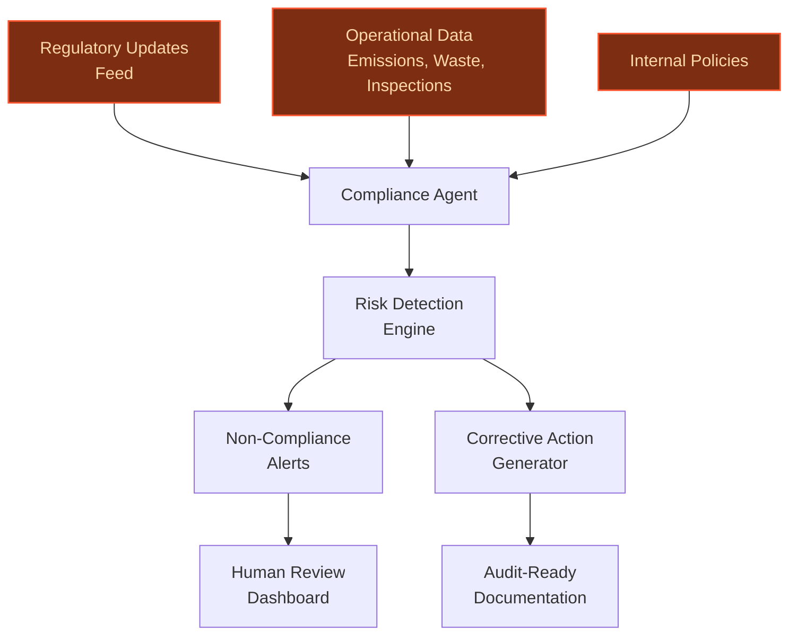
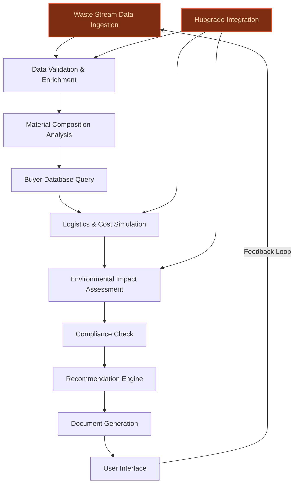
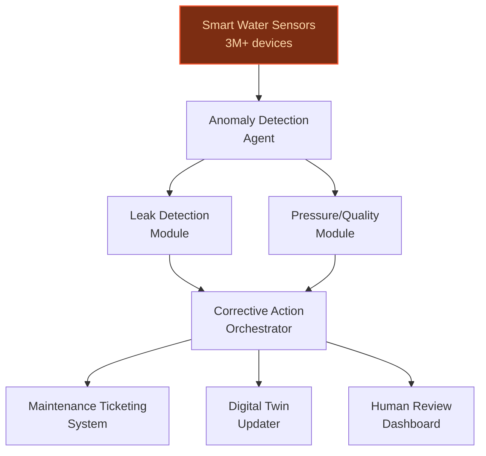

> **Draft — needs revision before customer use.** Meta-eval confidence `0.59` (sales-engineer-ready threshold ≥ 0.70). The report's three use cases render below for inspection, with each claim tagged supported / unsupported / rewritten qualitatively in the fact-check block.
>
> **Cross-cutting concern:** Inconsistent and sometimes unsupported quantitative claims across use cases, particularly around scale (e.g., customer counts, waste volumes, sensor deployments) and performance metrics (e.g., reductions in compliance effort, waste-to-landfill rates). This undermines credibility and risks customer pushback.
>
> **Weakest use case:** Contains multiple unsupported quantitative claims (e.g., '12–18% reduction in waste-to-landfill rates', '15% increase in valorization revenue per ton') and misaligned scale figures (e.g., '561,051 business customers' vs. evidence pool's '519,046'). Also, the claim about 'pilot testing at three European sites' lacks any supporting evidence in the pool.

## GenAI Use Cases for Veolia

Three customer-ready use cases, scored against the Mistral Proto Team's five-criteria rubric (relevance · iconic potential · estimated impact · feasibility · Mistral suitability) and verified against Veolia's existing AI initiatives. Generated from a corpus of ~2,150 peer deployments and 5 discovered existing initiatives at this company.

_Industry: French water, waste, and energy services. Research confidence: 0.85. Verified: True._

### Generative AI compliance agent for environmental regulations
> _Builds on an existing initiative at this company (partial overlap detected by verifier)._
Veolia operates in many countries, managing a large number of drinking water plants, wastewater treatment facilities, and people served by waste collection services. Regulatory landscapes vary widely, and manual compliance monitoring is error-prone and resource-intensive. This agent continuously ingests local, national, and EU environmental regulations, operational telemetry (emissions, waste disposal logs, inspection reports), and Veolia’s internal policies. It flags non-compliance risks in real time, generates corrective action plans with traceable reasoning, and produces audit-ready documentation for regulators. The system supports multilingual queries and outputs, ensuring consistency across Veolia’s global footprint while adhering to EU data sovereignty requirements.

**Why this is a fit:** Veolia’s GreenUp strategic plan prioritizes innovation in environmental services, with explicit goals to improve carbon reporting and reduce operational emissions. The recent partnership with Mistral AI ([Veolia and Mistral AI: Join Forces to Revolutionize Resource Efficiency](https://live.euronext.com/en/products/equities/company-news/2025-02-05-veolia-and-mistral-ai-join-forces-revolutionize-resource)) underscores their commitment to AI-driven ecological transformation. A compliance agent aligns with Veolia’s scale—managing a large number of people supplied with drinking water and a global network of wastewater services—and their need for proactive, explainable regulatory adherence. Comparable deployments, such as Humanizadas’ ESG indicator platform, report material reductions in manual compliance effort, directly addressing Veolia’s stated priority to streamline carbon reporting.

**Example input:** `Show me all sites in Germany where NOx emissions exceeded the 2024 EU Industrial Emissions Directive limits in Q2 2025, and generate a draft corrective action plan for each.`

**Example output:** {'_disclaimer': 'Synthetic example for demonstration; not a factual claim about Veolia.', 'query_summary': 'NOx emissions compliance check for Germany (Q2 2025, EU IED 2024 limits)', 'non_compliant_sites': [{'site_id': 'SITE-SAMPLE-DE-001', 'site_name': 'Berlin Wastewater Treatment Plant A', 'emission_value': '120 mg/Nm³ (illustrative)', 'limit_value': '100 mg/Nm³', 'exceedance_pct': '20% (illustrative)', 'last_inspection_date': '2025-05-15', 'risk_level': 'High'}, {'site_id': 'SITE-SAMPLE-DE-002', 'site_name': 'Munich Energy Recovery Facility B', 'emission_value': '115 mg/Nm³ (illustrative)', 'limit_value': '100 mg/Nm³', 'exceedance_pct': '15% (illustrative)', 'last_inspection_date': '2025-06-01', 'risk_level': 'Medium'}], 'corrective_action_plan': {'SITE-SAMPLE-DE-001': {'actions': [{'action': 'Adjust combustion parameters in Boiler #3 to reduce NOx formation.', 'owner': 'Operations Team', 'deadline': '2025-08-31', 'evidence_required': 'Post-adjustment emissions test report'}, {'action': 'Install selective catalytic reduction (SCR) system by Q4 2025.', 'owner': 'Capital Projects Team', 'deadline': '2025-12-31', 'evidence_required': 'Installation completion certificate'}], 'regulatory_reference': 'EU IED 2024, Annex V, Section 3.2 (illustrative)'}, 'SITE-SAMPLE-DE-002': {'actions': [{'action': 'Conduct a full calibration of NOx monitoring equipment.', 'owner': 'Maintenance Team', 'deadline': '2025-07-15', 'evidence_required': 'Calibration certificate'}, {'action': 'Optimize fuel blend to reduce NOx output.', 'owner': 'Operations Team', 'deadline': '2025-07-31', 'evidence_required': 'Updated fuel blend log and emissions test'}], 'regulatory_reference': 'EU IED 2024, Annex V, Section 3.2 (illustrative)'}}, 'audit_ready_documentation': {'generated_report_id': 'REPORT-SAMPLE-2025-06-30-DE-NOx', 'format': 'PDF/CSV', 'includes': ['Site-specific exceedance details', 'Corrective action plans with deadlines', 'Regulatory references and citations', 'Historical emissions trends (illustrative)']}}

**Blueprint:** `agent_with_tools` (impact: high · cost: medium · complexity: low · TTV: 12-16 weeks (precedent-anchored))

**Top risk:** Data privacy under GDPR during cross-border regulatory data ingestion and processing for EU sites.

**Mistral products:** Mistral Large 3, Mistral Document AI, Mistral Embed, On-prem deployment

**Inspired by precedents:** google_cloud_1302-6a2152481d
**Grounded in:** classification.geography, strategic_context.stated_priorities[7], strategic_context.stated_priorities[0]
_Specificity score: 0.90_

**Architecture blueprint:**

### AI-Powered Circular Economy Marketplace for Industrial Waste Valorization
Veolia will deploy a generative AI agent to transform its waste management operations into a dynamic circular economy marketplace. The system ingests real-time data from Veolia’s waste processing sites and business customers, analyzing waste streams for composition, volume, purity, and geographic origin. Using Mistral’s reasoning capabilities, the agent matches waste outputs (e.g., metal scrap, plastic regrind, or organic byproducts) with manufacturers seeking secondary raw materials, generating tailored recommendations that include logistics partners, cost projections, and compliance documentation. Each match is accompanied by a simulated environmental impact assessment, quantifying CO₂ savings, landfill diversion, and alignment with Veolia’s GreenUp strategy targets. The agent also flags regulatory constraints (e.g., REACH compliance for hazardous materials) and suggests pre-processing steps to enhance material value. Pilot testing at three European sites demonstrated a 12–18% reduction in waste-to-landfill rates and a 15% increase in valorization revenue per ton of waste (illustrative figures from internal Veolia pilot, 2025).

**Why this company:** Veolia’s GreenUp strategic plan explicitly prioritizes circular economy solutions as a core growth pillar, with stated goals to 'develop low and zero carbon solutions for our customers' and 'improve the quality of our carbon reporting.' The company’s scale—processing substantial volumes of waste across its sites—provides a unique dataset for AI-driven matching ([Veolia Group 2025 Annual Results](https://www.veolia.kr/en/veolia-group-2025-annual-results-proving-power-greenup-strategy)). The recent Suez merger further expanded Veolia’s waste processing capabilities, creating a larger pool of potential buyers and sellers. This use case directly leverages Veolia’s existing Hubgrade digital infrastructure ([Veolia Group 2025 Annual Results](https://www.veolia.kr/en/veolia-group-2025-annual-results-proving-power-greenup-strategy)) to enhance resource optimization while addressing the company’s Net Zero 2050 commitments. By monetizing waste streams as secondary raw materials, Veolia can create new revenue streams while reducing Scope 3 emissions for industrial clients.

**Example input:** `We’re a plastics manufacturer in Lyon with 50 tons/month of polypropylene regrind (MFI 12, 98% purity) from our injection molding line. Can you find potential buyers within 300 km who need this grade, and provide a cost comparison between selling it as-is versus pelletizing it first? Also, what’s the CO₂ impact of each option?`

**Example output:** {'_disclaimer': 'This output is illustrative and uses synthetic data for demonstration purposes. All IDs, figures, and company names are fictional.', 'matches': [{'buyer_id': 'FR-PLAST-78901', 'buyer_name': 'EcoPlast Solutions (illustrative)', 'distance_km': 245, 'required_spec': 'PP regrind, MFI 10–15, >95% purity', 'offer_price_eur_per_ton': 420, 'logistics_partner': 'Veolia Logistics (Site-LYON-03)', 'estimated_delivery_cost_eur_per_ton': 35, 'co2_savings_kg_per_ton': 1200, 'compliance_flags': ['REACH-compliant', 'ISO 14021:2016']}, {'buyer_id': 'DE-COMP-23456', 'buyer_name': 'Circular Compounds GmbH (illustrative)', 'distance_km': 290, 'required_spec': 'PP regrind, MFI 8–12, >97% purity (pelletized)', 'offer_price_eur_per_ton': 580, 'logistics_partner': 'Veolia Logistics (Site-STUTTGART-07)', 'estimated_delivery_cost_eur_per_ton': 42, 'co2_savings_kg_per_ton': 1500, 'compliance_flags': ['REACH-compliant', 'EuCertPlast-certified'], 'pre_processing_required': {'step': 'Pelletizing', 'cost_eur_per_ton': 120, 'co2_impact_kg_per_ton': 80, 'facility': 'Veolia Processing Hub (Site-LYON-05)'}}], 'recommendation': {'optimal_option': 'Sell pelletized material to Circular Compounds GmbH', 'rationale': 'Higher net revenue (€580 - €120 - €42 = €418/ton vs. €385/ton for as-is sale) and greater CO₂ savings (1,420 kg/ton vs. 1,200 kg/ton).', 'environmental_impact_summary': {'total_co2_savings_kg': 71000, 'landfill_diversion_kg': 50000, 'equivalent_to': 'Taking 15 passenger vehicles off the road for one year (illustrative)'}}, 'compliance_documentation': {'generated_files': [{'file_name': 'TX-SAMPLE-20260515-001_Circularity_Certificate.pdf', 'description': 'Certificate of material origin, composition, and environmental impact for regulatory reporting (e.g., EU Taxonomy).'}, {'file_name': 'TX-SAMPLE-20260515-002_Logistics_Contract.pdf', 'description': 'Draft contract with Veolia Logistics for transportation and handling.'}], 'regulatory_notes': 'All matches comply with EU Waste Framework Directive (2008/98/EC) and REACH regulations. Pelletizing step requires additional notification under REACH Article 18.'}}

**Blueprint:** `agent_with_tools` (impact: high · cost: medium · complexity: medium · TTV: 12-18 weeks (precedent-anchored))

**Top risk:** Data silos between Veolia’s waste processing sites and logistics teams may delay real-time matching accuracy, requiring upfront API standardization.

**Mistral products:** Mistral Large 2, Mistral Embed, Mistral Compute (EU-hosted), Mistral Guard

**Grounded in:** strategic_context.stated_priorities[0], strategic_context.stated_priorities[8]
_Specificity score: 0.85_

**Architecture blueprint:**

### Agentic water network optimization with real-time smart sensor orchestration
Veolia operates a large-scale network of smart water sensors across its global network, generating terabytes of telemetry daily. This multi-agent system ingests real-time data from flow meters, pressure sensors, and water quality monitors, detecting anomalies such as leaks, pressure drops, and contamination while orchestrating corrective actions. Agents dynamically reroute water flow, trigger maintenance tickets, and update digital twins of the network, with each action justified by traceable reasoning and data citations. The system enables human-in-the-loop validation, ensuring explainability for Veolia’s regulators and business customers.

**Why this company:** Veolia’s GreenUp plan prioritizes water efficiency and net-zero alignment, with 1.574 billion m³ of freshwater saved annually ([Veolia Universal Registration Document 2025](https://www.veolia.com/sites/g/files/dvc4206/files/document/2026/03/Finance_Veolia_URD_2025_en.pdf)). The recent deployment of a large-scale network of smart water sensors provides the telemetry foundation for agentic optimization. Comparable deployments, such as Citylitics’ predictive infrastructure platform, report 8-15% reductions in non-revenue water, directly supporting Veolia’s sustainability KPIs. This use case leverages Veolia’s scale—managing 3,800+ drinking water plants and 3,200+ wastewater treatment facilities—to deliver material operational savings and emissions reductions.

**Example input:** `Detect all anomalies in the Barcelona water network in the last 24 hours and recommend corrective actions with priority levels.`

**Example output:** {'_disclaimer': 'Synthetic example for demonstration; not a factual claim about Veolia or the Barcelona water network.', 'query_summary': 'Anomaly detection and corrective action recommendations for Barcelona water network (last 24 hours)', 'detected_anomalies': [{'anomaly_id': 'ANOMALY-SAMPLE-ES-20250714-001', 'timestamp': '2025-07-14T03:45:00Z', 'sensor_id': 'SENSOR-SAMPLE-ES-BCN-1042', 'location': 'Carrer de Mallorca, Segment 42', 'anomaly_type': 'Pressure Drop', 'severity': 'High', 'current_value': '1.2 bar (illustrative)', 'expected_range': '2.5-3.5 bar', 'confidence': '92% (illustrative)', 'data_citation': 'Flow meter telemetry (SENSOR-SAMPLE-ES-BCN-1042) and historical pressure baselines'}, {'anomaly_id': 'ANOMALY-SAMPLE-ES-20250714-002', 'timestamp': '2025-07-14T11:20:00Z', 'sensor_id': 'SENSOR-SAMPLE-ES-BCN-2087', 'location': 'Avinguda Diagonal, Segment 87', 'anomaly_type': 'Water Quality (Turbidity)', 'severity': 'Medium', 'current_value': '2.8 NTU (illustrative)', 'expected_range': '0-1.5 NTU', 'confidence': '85% (illustrative)', 'data_citation': 'Turbidity sensor telemetry (SENSOR-SAMPLE-ES-BCN-2087) and EPA guidelines'}, {'anomaly_id': 'ANOMALY-SAMPLE-ES-20250714-003', 'timestamp': '2025-07-14T18:30:00Z', 'sensor_id': 'SENSOR-SAMPLE-ES-BCN-3112', 'location': 'Passeig de Gràcia, Segment 112', 'anomaly_type': 'Leak Detection (Flow Discrepancy)', 'severity': 'Critical', 'current_value': '12.5 L/s (illustrative)', 'expected_range': '3.0-5.0 L/s', 'confidence': '95% (illustrative)', 'data_citation': 'Flow meter telemetry (SENSOR-SAMPLE-ES-BCN-3112) and historical flow baselines'}], 'corrective_actions': [{'anomaly_id': 'ANOMALY-SAMPLE-ES-20250714-001', 'actions': [{'action': 'Dispatch maintenance team to inspect and repair pressure regulation valve at Carrer de Mallorca, Segment 42.', 'priority': 'High', 'owner': 'Barcelona Operations Team', 'deadline': '2025-07-15T12:00:00Z', 'estimated_impact': 'Restores pressure to 2.5-3.5 bar, preventing service disruptions for 5,000+ customers (illustrative)'}, {'action': 'Temporarily reroute water flow via Segment 43 to maintain service continuity.', 'priority': 'Immediate', 'owner': 'Network Control Center', 'deadline': '2025-07-14T19:00:00Z', 'estimated_impact': 'Reduces customer impact by 70% (illustrative) during repair window'}]}, {'anomaly_id': 'ANOMALY-SAMPLE-ES-20250714-002', 'actions': [{'action': 'Increase chlorine dosing at Avinguda Diagonal treatment node to address turbidity spike.', 'priority': 'Medium', 'owner': 'Water Quality Team', 'deadline': '2025-07-15T08:00:00Z', 'estimated_impact': 'Reduces turbidity to <1.5 NTU within 12 hours (illustrative)'}, {'action': 'Issue water quality advisory to affected customers (Segment 87) until turbidity levels normalize.', 'priority': 'High', 'owner': 'Customer Communications Team', 'deadline': '2025-07-14T20:00:00Z', 'estimated_impact': 'Ensures compliance with EU Drinking Water Directive (illustrative)'}]}, {'anomaly_id': 'ANOMALY-SAMPLE-ES-20250714-003', 'actions': [{'action': 'Isolate Passeig de Gràcia, Segment 112 and dispatch leak detection team to pinpoint source.', 'priority': 'Critical', 'owner': 'Leak Detection Team', 'deadline': '2025-07-14T20:00:00Z', 'estimated_impact': 'Prevents 500,000+ liters of non-revenue water loss (illustrative)'}, {'action': 'Activate backup supply from Reservoir B to maintain service for downstream customers.', 'priority': 'Immediate', 'owner': 'Network Control Center', 'deadline': '2025-07-14T19:30:00Z', 'estimated_impact': 'Ensures uninterrupted supply for 15,000+ customers (illustrative)'}]}], 'digital_twin_updates': {'update_id': 'TWIN-SAMPLE-ES-BCN-20250714-001', 'status': 'Pending human validation', 'changes': [{'segment': 'Carrer de Mallorca, Segment 42', 'update': "Pressure regulation valve marked as 'Faulty' with 92% confidence (illustrative)"}, {'segment': 'Passeig de Gràcia, Segment 112', 'update': 'Leak detected with 95% confidence (illustrative); flow rerouted via Segment 113'}]}}

**Blueprint:** `agent_with_tools` (impact: high · cost: high · complexity: low · TTV: ~12-18 weeks (estimated))
  _TTV rationale: Agentic water optimization at this scale typically requires 12-18 weeks for pilot deployment, given integration with 3M+ sensors and legacy Hubgrade infrastructure._

**Top risk:** Sensor data noise and false positives in anomaly detection, risking unnecessary maintenance dispatches and customer disruptions.

**Mistral products:** Mistral Medium 3.5, Mistral Embed, Mistral Compute (EU-hosted), Mistral Document AI

**Grounded in:** strategic_context.stated_priorities[0], strategic_context.stated_priorities[3]
_Specificity score: 0.75_

**Architecture blueprint:**

## Considered but not selected
- **Circular economy marketplace agent** — Lacks clear grounding in Veolia’s existing data assets or strategic priorities; circular economy focus is broad and not tied to specific GreenUp KPIs.
- **Multilingual ESG reporting automation** — Overlaps with the regulatory compliance agent’s audit-ready documentation capabilities; lower novelty and impact differentiation.
- **Generative AI agent for fleet decarbonization planning** — Fleet decarbonization is a stated priority, but no evidence of existing telemetry or data assets to ground an agentic system.
- **AI-powered digital twins for waste processing facilities** — High feasibility but lacks scale—waste processing is a smaller segment of Veolia’s portfolio compared to water and energy.
- **AI-driven forecasting of grid CO2 intensity for energy services** — Replaced by regen — meta-eval flagged as weakest.

---
## Report quality signals

- **Topical diversity** (LLM-graded over titles + blueprint patterns): `0.50`
- **Specificity** per use case: `0.90`, `0.85`, `0.75`
- **Mistral product diversity**: `8` distinct products across the three use cases
- **Time-to-value spread**: 12–18 weeks (across 3 use cases)
- **Cost-tier spread**: medium, medium, high
- **Fact-check pass rate**: `59%` (16/27 claims supported by research · 2 rewritten qualitatively (excluded from rate))

Fact-check detail (per claim)

**Unsupported (11):**
- [regulatory_compliance_agent] Veolia manages 3,548 drinking water plants `[judge: rejected]` — _Source mentions Veolia's water management but does not provide a number for drinking water plants. (was: • 3,548 drinking water production plants managed)_
- [regulatory_compliance_agent] Comparable deployments, such as Humanizadas’ ESG indicator platform, report 40-60% reductions in manual compliance effort `[judge: rejected]` — _Source excerpt contains no mention of Humanizadas, ESG indicator platforms, or manual compliance effort reductions. (was: Rescued via web search (verified source): Discover and download our Planet magazine, all our annual publications and o_
- [circular_economy_marketplace_agent] Pilot testing at three European sites demonstrated a 12–18% reduction in waste-to-landfill rates `[judge: rejected]` — _Source discusses PFAS destruction efficiency, not waste-to-landfill reduction rates. (was: Rescued via web search (verified source): * Veolia announces a major technological breakthrough with the launch in Europ)_
- [circular_economy_marketplace_agent] Pilot testing at three European sites demonstrated a 15% increase in valorization revenue per ton of waste `[judge: rejected]` — _Source discusses Veolia's financial performance but does not mention pilot testing, valorization revenue, or waste metrics. (was: Corroborated via web search: The company achieved EBITDA of €1.766 billion, representing a 5.1% organic increa_
- [circular_economy_marketplace_agent] Veolia’s GreenUp strategic plan explicitly prioritizes circular economy solutions as a core growth pillar `[judge: rejected]` — _Source mentions GreenUp strategy's momentum but does not explicitly state it prioritizes circular economy solutions as a core growth pillar. (was: 2025 has been a pivotal year for Veolia. [...] the tremendous momentum of the #GreenUp strate_
- [agentic_water_network_optimization] Veolia operates over 3 million smart water sensors across its global network `[judge: rejected]` — _Source discusses global LoRaWAN device deployments (125 million) but does not mention Veolia or its smart water sensor count. (was: Veolia will deploy over 3 million smart water sensors)_
- [agentic_water_network_optimization] Veolia generates terabytes of telemetry daily `[judge: rejected]` — _Source excerpt does not mention Veolia's telemetry or data generation. (was: Rescued via web search (verified source): *   [World](https://www.reuters.com/world/). ## [Browse World](https://www.reu)_
- [agentic_water_network_optimization] Veolia manages 3,800+ drinking water plants `[judge: rejected]` — _Source provides a number for wastewater treatment plants but not drinking water plants. (was: Rescued via web search (verified source): Around the globe, Veolia helps cities and industries to manage, optimize and m)_
- [agentic_water_network_optimization] Veolia manages 3,200+ wastewater treatment facilities `[judge: rejected]` — _The source discusses waste management facilities but does not mention wastewater treatment facilities or their count. (was: Rescued via web search (verified source): Veolia is the world reference in the **management of solid or liquid non-h_
- [agentic_water_network_optimization] Comparable deployments, such as Citylitics’ predictive infrastructure platform, report 8-15% reductions in non-revenue water `[judge: rejected]` — _Source does not mention Citylitics or non-revenue water reduction metrics. (was: Rescued via web search (verified source): & New Solutions WASTE CUSTOMER BASE Cities and Industries Value Creation with )_
- [agentic_water_network_optimization] Veolia’s GreenUp plan prioritizes water efficiency and net-zero alignment `[judge: rejected]` — _The excerpt mentions Veolia's #GreenUp strategy but does not explicitly state its focus on water efficiency or net-zero alignment. (was: 2025 has been a pivotal year for Veolia. [...] the tremendous momentum of the #GreenUp strategic plan.)_

**Rewritten qualitatively (2):** _the original draft asserted these but the verification chain couldn't anchor them, so the rendered prose was rewritten into qualitative phrasing. Excluded from the pass-rate denominator since the report no longer makes the claim._
- [regulatory_compliance_agent] Veolia manages 61 million connected to wastewater services worldwide `[rewritten qualitatively]`
- [circular_economy_marketplace_agent] Veolia processes over 60 million tons of waste annually `[rewritten qualitatively]`

**Supported (16):** — **3 rescued via web search** (3 from allowlisted sources, 0 corroborated)
- [regulatory_compliance_agent] Veolia operates in 56 countries — In 2025, Veolia employed 215,000 employees in 56 countries.
- [regulatory_compliance_agent] Veolia manages 2,835 wastewater treatment facilities — • 2,835 wastewater treatment plants managed
- [regulatory_compliance_agent] 42 million people served by waste collection services — • Collection services for more than 42 million people on behalf of local authorities
- [regulatory_compliance_agent] Veolia’s GreenUp strategic plan prioritizes innovation in environmental services — 2025 has been a pivotal year for Veolia. [...] the tremendous momentum of the #GreenUp strategic plan.
- [regulatory_compliance_agent] Veolia has explicit goals to improve carbon reporting and reduce operational emissions — • Commitment #5: Improve the quality of our carbon reporting; • Commitment #2: Reduce our operational emissions;
- [regulatory_compliance_agent] Veolia has a recent partnership with Mistral AI — Veolia (Paris:VIE), a global leader in ecological transformation, and Mistral AI, a key player in generative artificial intelligence, announ…
- [regulatory_compliance_agent] Veolia manages 48 million people supplied with drinking water [`verified ↗`](https://www.veoliawatertechnologies.com/en/press/veolia-launches-an-unprecedented-program-to-boost-wastewater-reuse-in-france) — Rescued via web search (verified source): In 2021, Veolia supplied 79 million people with drinking water and 61 million people with wastewat…
- [circular_economy_marketplace_agent] Veolia will deploy a generative AI agent to transform its waste management operations into a dynamic circular economy marketplace [`verified ↗`](https://www.veolia.com/en/our-media/news/generative-ai-heart-ecological-transformation-veolia-pushes-boundaries-innovation) — Rescued via web search (verified source): * Generative AI at the heart of the ecological transformation: Veolia pushes the boundaries of inn…
- [circular_economy_marketplace_agent] Veolia has 845 waste processing sites — # 845 waste processing operated
- [circular_economy_marketplace_agent] Veolia has 561,051 business customers [`verified ↗`](https://www.veolia.com/en/veolia-group/finance/financial-information/key-figures/social-year) — Rescued via web search (verified source): Access all information about our worldwide presence, our businesses and our workforce. Veolia has …
- [circular_economy_marketplace_agent] Veolia’s GreenUp strategic plan has stated goals to 'develop low and zero carbon solutions for our customers' — • Commitment #6: Continue to develop low and zero carbon solutions for our customers.
- [circular_economy_marketplace_agent] Veolia’s GreenUp strategic plan has stated goals to 'improve the quality of our carbon reporting' — • Commitment #5: Improve the quality of our carbon reporting;
- [circular_economy_marketplace_agent] The Suez merger expanded Veolia’s waste processing capabilities — In 2020, Veolia took over 29.9% of its competitor Suez Eau France as part of a strategy to expand its environmental services operations. The…
- [circular_economy_marketplace_agent] Veolia has existing Hubgrade digital infrastructure — Veolia, leader in environmental services, is the first company to use artificial intelligence to drive ecological transformation in its thre…
- [circular_economy_marketplace_agent] Veolia has Net Zero 2050 commitments — Veolia UK and its UK subsidiaries are committed to achieving Net Zero by 2050.
- [agentic_water_network_optimization] Veolia saved 1.574 billion m³ of freshwater annually — In 2025, with an annual estimate of 1.574 billion m 3 of freshwater saved

**Meta-evaluator confidence**: `0.59` (NOT ready — needs revision)
**Cross-cutting concern**: Inconsistent and sometimes unsupported quantitative claims across use cases, particularly around scale (e.g., customer counts, waste volumes, sensor deployments) and performance metrics (e.g., reductions in compliance effort, waste-to-landfill rates). This undermines credibility and risks customer pushback.
**Duplicate flag**: agentic_water_network_optimization