# Pipeline blueprint (architecture)

Static view of the pipeline regardless of run timing — shows agents,
models, and gates. The chronological execution log follows below.

```mermaid
flowchart TD
    Start([User: company name]) --> R
    R["<b>1. Research</b><br/>parallel: Wikipedia · Tavily news ·<br/>existing initiatives · live verification<br/><i>mistral-medium</i> synthesis"]
    R --> G["<b>1b. Gap-fill</b><br/>identify missing fields →<br/><i>mistral-small</i> generates queries →<br/>Tavily search per field →<br/><i>mistral-small</i> per-field extraction"]
    G --> Conf{Confidence ≥ 0.5<br/>OR verified<br/>OR ≥ 1 existing initiative?}
    Conf -->|no| Refuse([Refusal])
    Conf -->|yes| Ret
    Ret["<b>2. Retrieve</b><br/><i>mistral-embed</i> on company query →<br/>cosine top-K + industry/depth filter +<br/>MMR diversification"]
    Ret --> Gen["<b>3. Generate 12 candidates</b><br/><i>mistral-medium</i> with web_search tool<br/>(Tavily + deep-read) — fact citations<br/>flow into the EvidenceLedger"]
    Gen --> Score["<b>4. Score</b><br/>self-consistency: 2 parallel passes<br/><i>mistral-small</i> @ T=0.2 and T=0.4 →<br/>aggregate weighted scores"]
    Score --> Verify["<b>5. Per-candidate verify</b><br/>top-3: Tavily search + deep-read +<br/><i>mistral-small</i> verdict (pass /<br/>partial / confirmed_existing)"]
    Verify --> Enrich["<b>6. Enrich</b><br/><i>mistral-large</i> drafts customer-facing<br/>prose for 3 use cases (or<br/><i>mistral-medium</i> on fast tier)"]
    Enrich --> NumScrub["<b>6a. Numeric scrub</b><br/>flag any number not in cited content"]
    NumScrub --> Polish["<b>6b. Polish</b><br/><i>mistral-small</i> per use case (parallel):<br/>convert markers→qualitative,<br/>(ev-XXX)→[title](url)"]
    Polish --> Attr["<b>6c. Attribution check</b><br/><i>mistral-small</i> per use case (parallel):<br/>fix corpus-ID ↔ company mismatches"]
    Attr --> Meta["<b>7. Meta-evaluation</b><br/><i>mistral-medium</i> reviews report against<br/>cited precedents + ledger entries:<br/>strict claim verification"]
    Meta --> RegenQ{confidence < 0.6<br/>AND not fast tier?}
    RegenQ -->|yes| Regen["<b>7b. Targeted regen</b><br/><i>mistral-large</i> re-enriches just the<br/>weakest use case with the next-best<br/>near-miss; re-runs meta-eval"]
    RegenQ -->|no| QS
    Regen --> QS
    QS["<b>Quality signals</b><br/>LLM-graded diversity + specificity,<br/>fact-check pass rate, TTV/cost spread"]
    QS --> Render([Markdown report + trace])

    classDef agent fill:#fef3c7,stroke:#f59e0b
    classDef gate fill:#dbeafe,stroke:#3b82f6
    classDef io fill:#dcfce7,stroke:#16a34a
    class R,G,Ret,Gen,Score,Verify,Enrich,NumScrub,Polish,Attr,Meta,Regen,QS agent
    class Conf,RegenQ gate
    class Start,Refuse,Render io
```

## Execution trace — Veolia

Started: `2026-05-09T16:32:00.993353+00:00`. Total wall time: `281.6s` across `63` recorded actions.

### Per-step time totals

| Step | Calls | Total time | Avg time |
|---|---:|---:|---:|
| `research` | 1 | 7.06s | 7058ms |
| `gap_fill` | 4 | 3.57s | 893ms |
| `retrieve` | 2 | 0.59s | 294ms |
| `generate` | 2 | 34.30s | 17149ms |
| `generate.web_search` | 2 | 5.24s | 2622ms |
| `score` | 2 | 35.33s | 17665ms |
| `verify` | 6 | 22.77s | 3795ms |
| `enrich` | 1 | 86.82s | 86816ms |
| `polish` | 4 | 13.05s | 3263ms |
| `meta_eval` | 2 | 28.92s | 14462ms |
| `regen_one` | 1 | 31.93s | 31929ms |
| `web_verify` | 1 | 6.62s | 6617ms |
| `source_judge` | 30 | 56.93s | 1898ms |
| `final_qualify` | 3 | 7.34s | 2446ms |
| `quality_signals` | 2 | 6.80s | 3401ms |

### Chronological event log

- `16:32:04.078` **[research]** `mistral-medium-2604.chat.complete` — 7058ms
   - inputs: synthesize CompanyContext for Veolia | depth=medium
   - outputs: industry='French water, waste, and energy services' verified=True conf=0.75
- `16:32:11.137` **[gap_fill]** `mistral-small-2603.chat.complete` — 1168ms
   - inputs: generate gap queries | fields=['business_model', 'products', 'data_assets', 'priorities']
   - outputs: queries=4
- `16:32:17.588` **[gap_fill]** `mistral-small-2603.chat.complete` — 1095ms
   - inputs: layer-2 extract field=priorities
   - outputs: items=11
- `16:32:17.595` **[gap_fill]** `mistral-small-2603.chat.complete` — 575ms
   - inputs: layer-2 extract field=data_assets
   - outputs: items=0
- `16:32:17.600` **[gap_fill]** `mistral-small-2603.chat.complete` — 734ms
   - inputs: layer-2 extract field=products
   - outputs: items=0
- `16:32:18.685` **[retrieve]** `mistral-embed.embeddings.create` — 260ms
   - inputs: company_query | industries='French water, waste, and energy services'
   - outputs: embedded 1024-dim query vector
- `16:32:18.945` **[retrieve]** `precedent_corpus.cosine_topk` — 328ms
   - inputs: k=8 min_depth=0.4 target='Veolia'
   - outputs: retrieved 8 | mmr=True | top_sim=0.763
- `16:32:20.805` **[generate]** `mistral-medium-2604.chat.complete` — 2225ms
   - inputs: iteration=0 tool_calls_used=0/2 tools=on
   - outputs: tool_calls=4 | content_chars=0
- `16:32:23.047` **[generate.web_search]** `tavily.search` — 2872ms
   - inputs: query='Veolia smart meter network scale 2025'
   - outputs: 2 raw results
- `16:32:27.272` **[generate.web_search]** `tavily.search` — 2372ms
   - inputs: query='Veolia GreenUp strategic plan 2025 details'
   - outputs: 2 raw results
- `16:32:31.713` **[generate]** `mistral-medium-2604.chat.complete` — 32072ms
   - inputs: iteration=1 tool_calls_used=2/2 tools=off
   - outputs: tool_calls=0 | content_chars=21702
- `16:33:04.215` **[score]** `mistral-small-2603.chat.complete` — 17517ms
   - inputs: self-consistency pass T=0.2
   - outputs: scored 12 candidates
- `16:33:04.219` **[score]** `mistral-small-2603.chat.complete` — 17813ms
   - inputs: self-consistency pass T=0.4
   - outputs: scored 12 candidates
- `16:33:22.066` **[verify]** `tavily.search` — 2216ms
   - inputs: candidate=regulatory_compliance_agent | query='Veolia Generative AI compliance agent for environmental regu'
   - outputs: 4 results
- `16:33:22.066` **[verify]** `tavily.search` — 2201ms
   - inputs: candidate=grid_co2_intensity_forecasting | query='Veolia AI-driven forecasting of grid CO2 intensity for energ'
   - outputs: 4 results
- `16:33:22.066` **[verify]** `tavily.search` — 1882ms
   - inputs: candidate=agentic_water_network_optimization | query='Veolia Agentic water network optimization with real-time sma'
   - outputs: 4 results
- `16:33:24.699` **[verify]** `mistral-small-2603.chat.complete` — 6391ms
   - inputs: verdict for agentic_water_network_optimization
   - outputs: verdict='pass'
- `16:33:25.414` **[verify]** `mistral-small-2603.chat.complete` — 4681ms
   - inputs: verdict for grid_co2_intensity_forecasting
   - outputs: verdict='pass'
- `16:33:25.886` **[verify]** `mistral-small-2603.chat.complete` — 5399ms
   - inputs: verdict for regulatory_compliance_agent
   - outputs: verdict='partial_overlap'
- `16:33:31.287` **[enrich]** `mistral-large-2512.chat.complete` — 86816ms
   - inputs: tier=standard top_3=['regulatory_compliance_agent', 'grid_co2_intensity_forecasting', 'agentic_water_network_optimization']
   - outputs: enriched 3 use cases
- `16:34:58.128` **[polish]** `mistral-small-2603.chat.complete` — 3018ms
   - inputs: use_case=regulatory_compliance_agent unanchored=True opaque_ev=False
   - outputs: polished 5 fields
- `16:34:58.136` **[polish]** `mistral-small-2603.chat.complete` — 3351ms
   - inputs: use_case=grid_co2_intensity_forecasting unanchored=True opaque_ev=False
   - outputs: polished 5 fields
- `16:34:58.141` **[polish]** `mistral-small-2603.chat.complete` — 3134ms
   - inputs: use_case=agentic_water_network_optimization unanchored=True opaque_ev=False
   - outputs: polished 5 fields
- `16:35:01.490` **[meta_eval]** `mistral-medium-2604.chat.complete` — 12593ms
   - inputs: reviewing 3 use cases
   - outputs: review + claims
- `16:35:14.085` **[regen_one]** `mistral-large-2512.chat.complete` — 31929ms
   - inputs: replace weakest=grid_co2_intensity_forecasting with circular_economy_marketplace_agent
   - outputs: single use case enriched
- `16:35:46.025` **[polish]** `mistral-small-2603.chat.complete` — 3551ms
   - inputs: use_case=circular_economy_marketplace_agent unanchored=True opaque_ev=True
   - outputs: polished 5 fields
- `16:35:49.577` **[meta_eval]** `mistral-medium-2604.chat.complete` — 16331ms
   - inputs: reviewing 3 use cases
   - outputs: review + claims
- `16:36:05.927` **[web_verify]** `tavily.search.rescue_unsupported_claims` — 6617ms
   - inputs: company='Veolia' unsupported=12 budget=12
   - outputs: rescued: verified=11 corroborated=1 of 12 attempted
- `16:36:12.548` **[source_judge]** `mistral-small-2603.judge_claim_sources` — 20102ms
   - inputs: pairs=29
   - outputs: judged 29 pairs
- `16:36:12.548` **[source_judge]** `mistral-small-2603.chat.complete` — 660ms
   - inputs: claim='Veolia operates in 56 countries'
   - outputs: supports=True
- `16:36:12.555` **[source_judge]** `mistral-small-2603.chat.complete` — 911ms
   - inputs: claim='Veolia manages 3,548 drinking water plants'
   - outputs: supports=False
- `16:36:12.563` **[source_judge]** `mistral-small-2603.chat.complete` — 651ms
   - inputs: claim='Veolia manages 2,835 wastewater treatment facilities'
   - outputs: supports=True
- `16:36:12.568` **[source_judge]** `mistral-small-2603.chat.complete` ❌ — 20082ms
   - inputs: claim='42 million people served by waste collection services'
   - error: `ReadTimeout`
- `16:36:13.208` **[source_judge]** `mistral-small-2603.chat.complete` — 488ms
   - inputs: claim='Veolia’s GreenUp strategic plan prioritizes innovation in en'
   - outputs: supports=True
- `16:36:13.214` **[source_judge]** `mistral-small-2603.chat.complete` — 468ms
   - inputs: claim='Veolia has explicit goals to improve carbon reporting and re'
   - outputs: supports=True
- `16:36:13.466` **[source_judge]** `mistral-small-2603.chat.complete` — 429ms
   - inputs: claim='Veolia has a recent partnership with Mistral AI'
   - outputs: supports=True
- `16:36:13.682` **[source_judge]** `mistral-small-2603.chat.complete` — 655ms
   - inputs: claim='Veolia manages 48 million people supplied with drinking wate'
   - outputs: supports=True
- `16:36:13.696` **[source_judge]** `mistral-small-2603.chat.complete` — 596ms
   - inputs: claim='Veolia manages 61 million connected to wastewater services w'
   - outputs: supports=False
- `16:36:13.895` **[source_judge]** `mistral-small-2603.chat.complete` — 666ms
   - inputs: claim='Comparable deployments, such as Humanizadas’ ESG indicator p'
   - outputs: supports=False
- `16:36:14.292` **[source_judge]** `mistral-small-2603.chat.complete` — 569ms
   - inputs: claim='Veolia will deploy a generative AI agent to transform its wa'
   - outputs: supports=True
- `16:36:14.337` **[source_judge]** `mistral-small-2603.chat.complete` — 470ms
   - inputs: claim='Veolia has 845 waste processing sites'
   - outputs: supports=True
- `16:36:14.561` **[source_judge]** `mistral-small-2603.chat.complete` — 633ms
   - inputs: claim='Veolia has 561,051 business customers'
   - outputs: supports=True
- `16:36:14.808` **[source_judge]** `mistral-small-2603.chat.complete` — 534ms
   - inputs: claim='Veolia processes over 60 million tons of waste annually'
   - outputs: supports=False
- `16:36:14.861` **[source_judge]** `mistral-small-2603.chat.complete` — 515ms
   - inputs: claim='Pilot testing at three European sites demonstrated a 12–18% '
   - outputs: supports=False
- `16:36:15.194` **[source_judge]** `mistral-small-2603.chat.complete` — 710ms
   - inputs: claim='Pilot testing at three European sites demonstrated a 15% inc'
   - outputs: supports=False
- `16:36:15.342` **[source_judge]** `mistral-small-2603.chat.complete` — 568ms
   - inputs: claim='Veolia’s GreenUp strategic plan explicitly prioritizes circu'
   - outputs: supports=False
- `16:36:15.377` **[source_judge]** `mistral-small-2603.chat.complete` — 584ms
   - inputs: claim="Veolia’s GreenUp strategic plan has stated goals to 'develop"
   - outputs: supports=True
- `16:36:15.905` **[source_judge]** `mistral-small-2603.chat.complete` — 722ms
   - inputs: claim="Veolia’s GreenUp strategic plan has stated goals to 'improve"
   - outputs: supports=True
- `16:36:15.910` **[source_judge]** `mistral-small-2603.chat.complete` — 721ms
   - inputs: claim='The Suez merger expanded Veolia’s waste processing capabilit'
   - outputs: supports=True
- `16:36:15.960` **[source_judge]** `mistral-small-2603.chat.complete` — 671ms
   - inputs: claim='Veolia has existing Hubgrade digital infrastructure'
   - outputs: supports=True
- `16:36:16.627` **[source_judge]** `mistral-small-2603.chat.complete` — 545ms
   - inputs: claim='Veolia has Net Zero 2050 commitments'
   - outputs: supports=True
- `16:36:16.632` **[source_judge]** `mistral-small-2603.chat.complete` — 583ms
   - inputs: claim='Veolia operates over 3 million smart water sensors across it'
   - outputs: supports=False
- `16:36:16.639` **[source_judge]** `mistral-small-2603.chat.complete` — 613ms
   - inputs: claim='Veolia generates terabytes of telemetry daily'
   - outputs: supports=False
- `16:36:17.172` **[source_judge]** `mistral-small-2603.chat.complete` — 507ms
   - inputs: claim='Veolia saved 1.574 billion m³ of freshwater annually'
   - outputs: supports=True
- `16:36:17.214` **[source_judge]** `mistral-small-2603.chat.complete` — 601ms
   - inputs: claim='Veolia manages 3,800+ drinking water plants'
   - outputs: supports=False
- `16:36:17.252` **[source_judge]** `mistral-small-2603.chat.complete` — 570ms
   - inputs: claim='Veolia manages 3,200+ wastewater treatment facilities'
   - outputs: supports=False
- `16:36:17.680` **[source_judge]** `mistral-small-2603.chat.complete` — 540ms
   - inputs: claim='Comparable deployments, such as Citylitics’ predictive infra'
   - outputs: supports=False
- `16:36:17.815` **[source_judge]** `mistral-small-2603.chat.complete` — 560ms
   - inputs: claim='Veolia’s GreenUp plan prioritizes water efficiency and net-z'
   - outputs: supports=False
- `16:36:32.652` **[final_qualify]** `mistral-small-2603.chat.complete` — 2377ms
   - inputs: use_case=regulatory_compliance_agent unsupported=1
   - outputs: qualified 4 fields
- `16:36:32.658` **[final_qualify]** `mistral-small-2603.chat.complete` — 2910ms
   - inputs: use_case=circular_economy_marketplace_agent unsupported=1
   - outputs: qualified 4 fields
- `16:36:32.662` **[final_qualify]** `mistral-small-2603.chat.complete` — 2051ms
   - inputs: use_case=agentic_water_network_optimization unsupported=1
   - outputs: qualified 4 fields
- `16:36:35.781` **[quality_signals]** `mistral-small-2603.chat.complete` — 5592ms
   - inputs: specificity grade (3 use cases)
   - outputs: scored 3 use cases
- `16:36:41.373` **[quality_signals]** `mistral-small-2603.chat.complete` — 1210ms
   - inputs: diversity grade
   - outputs: diversity=0.5

## Mermaid sequence diagram (execution)

```mermaid
sequenceDiagram
    autonumber
    participant pipeline as pipeline
    participant mistral_medium_2604 as mistral-medium-2604
    participant mistral_small_2603 as mistral-small-2603
    participant mistral_embed as mistral-embed
    participant precedent_corpus as precedent_corpus
    participant tavily as tavily
    participant mistral_large_2512 as mistral-large-2512
    participant tavily_search as tavily.search
    pipeline->>mistral_medium_2604: research: chat.complete (7058ms)
    mistral_medium_2604-->>pipeline: industry='French water, waste, and energy services' verified
    pipeline->>mistral_small_2603: gap_fill: chat.complete (1168ms)
    mistral_small_2603-->>pipeline: queries=4
    pipeline->>mistral_small_2603: gap_fill: chat.complete (1095ms)
    mistral_small_2603-->>pipeline: items=11
    pipeline->>mistral_small_2603: gap_fill: chat.complete (575ms)
    mistral_small_2603-->>pipeline: items=0
    pipeline->>mistral_small_2603: gap_fill: chat.complete (734ms)
    mistral_small_2603-->>pipeline: items=0
    pipeline->>mistral_embed: retrieve: embeddings.create (260ms)
    mistral_embed-->>pipeline: embedded 1024-dim query vector
    pipeline->>precedent_corpus: retrieve: cosine_topk (328ms)
    precedent_corpus-->>pipeline: retrieved 8 | mmr=True | top_sim=0.763
    pipeline->>mistral_medium_2604: generate: chat.complete (2225ms)
    mistral_medium_2604-->>pipeline: tool_calls=4 | content_chars=0
    pipeline->>tavily: generate.web_search: search (2872ms)
    tavily-->>pipeline: 2 raw results
    pipeline->>tavily: generate.web_search: search (2372ms)
    tavily-->>pipeline: 2 raw results
    pipeline->>mistral_medium_2604: generate: chat.complete (32072ms)
    mistral_medium_2604-->>pipeline: tool_calls=0 | content_chars=21702
    pipeline->>mistral_small_2603: score: chat.complete (17517ms)
    mistral_small_2603-->>pipeline: scored 12 candidates
    pipeline->>mistral_small_2603: score: chat.complete (17813ms)
    mistral_small_2603-->>pipeline: scored 12 candidates
    pipeline->>tavily: verify: search (2216ms)
    tavily-->>pipeline: 4 results
    pipeline->>tavily: verify: search (2201ms)
    tavily-->>pipeline: 4 results
    pipeline->>tavily: verify: search (1882ms)
    tavily-->>pipeline: 4 results
    pipeline->>mistral_small_2603: verify: chat.complete (6391ms)
    mistral_small_2603-->>pipeline: verdict='pass'
    pipeline->>mistral_small_2603: verify: chat.complete (4681ms)
    mistral_small_2603-->>pipeline: verdict='pass'
    pipeline->>mistral_small_2603: verify: chat.complete (5399ms)
    mistral_small_2603-->>pipeline: verdict='partial_overlap'
    pipeline->>mistral_large_2512: enrich: chat.complete (86816ms)
    mistral_large_2512-->>pipeline: enriched 3 use cases
    pipeline->>mistral_small_2603: polish: chat.complete (3018ms)
    mistral_small_2603-->>pipeline: polished 5 fields
    pipeline->>mistral_small_2603: polish: chat.complete (3351ms)
    mistral_small_2603-->>pipeline: polished 5 fields
    pipeline->>mistral_small_2603: polish: chat.complete (3134ms)
    mistral_small_2603-->>pipeline: polished 5 fields
    pipeline->>mistral_medium_2604: meta_eval: chat.complete (12593ms)
    mistral_medium_2604-->>pipeline: review + claims
    pipeline->>mistral_large_2512: regen_one: chat.complete (31929ms)
    mistral_large_2512-->>pipeline: single use case enriched
    pipeline->>mistral_small_2603: polish: chat.complete (3551ms)
    mistral_small_2603-->>pipeline: polished 5 fields
    pipeline->>mistral_medium_2604: meta_eval: chat.complete (16331ms)
    mistral_medium_2604-->>pipeline: review + claims
    pipeline->>tavily_search: web_verify: rescue_unsupported_claims (6617ms)
    tavily_search-->>pipeline: rescued: verified=11 corroborated=1 of 12 attempted
    pipeline->>mistral_small_2603: source_judge: judge_claim_sources (20102ms)
    mistral_small_2603-->>pipeline: judged 29 pairs
    pipeline->>mistral_small_2603: source_judge: chat.complete (660ms)
    mistral_small_2603-->>pipeline: supports=True
    pipeline->>mistral_small_2603: source_judge: chat.complete (911ms)
    mistral_small_2603-->>pipeline: supports=False
    pipeline->>mistral_small_2603: source_judge: chat.complete (651ms)
    mistral_small_2603-->>pipeline: supports=True
    pipeline->>mistral_small_2603: source_judge: chat.complete (20082ms) ERR
    pipeline->>mistral_small_2603: source_judge: chat.complete (488ms)
    mistral_small_2603-->>pipeline: supports=True
    pipeline->>mistral_small_2603: source_judge: chat.complete (468ms)
    mistral_small_2603-->>pipeline: supports=True
    pipeline->>mistral_small_2603: source_judge: chat.complete (429ms)
    mistral_small_2603-->>pipeline: supports=True
    pipeline->>mistral_small_2603: source_judge: chat.complete (655ms)
    mistral_small_2603-->>pipeline: supports=True
    pipeline->>mistral_small_2603: source_judge: chat.complete (596ms)
    mistral_small_2603-->>pipeline: supports=False
    pipeline->>mistral_small_2603: source_judge: chat.complete (666ms)
    mistral_small_2603-->>pipeline: supports=False
    pipeline->>mistral_small_2603: source_judge: chat.complete (569ms)
    mistral_small_2603-->>pipeline: supports=True
    pipeline->>mistral_small_2603: source_judge: chat.complete (470ms)
    mistral_small_2603-->>pipeline: supports=True
    pipeline->>mistral_small_2603: source_judge: chat.complete (633ms)
    mistral_small_2603-->>pipeline: supports=True
    pipeline->>mistral_small_2603: source_judge: chat.complete (534ms)
    mistral_small_2603-->>pipeline: supports=False
    pipeline->>mistral_small_2603: source_judge: chat.complete (515ms)
    mistral_small_2603-->>pipeline: supports=False
    pipeline->>mistral_small_2603: source_judge: chat.complete (710ms)
    mistral_small_2603-->>pipeline: supports=False
    pipeline->>mistral_small_2603: source_judge: chat.complete (568ms)
    mistral_small_2603-->>pipeline: supports=False
    pipeline->>mistral_small_2603: source_judge: chat.complete (584ms)
    mistral_small_2603-->>pipeline: supports=True
    pipeline->>mistral_small_2603: source_judge: chat.complete (722ms)
    mistral_small_2603-->>pipeline: supports=True
    pipeline->>mistral_small_2603: source_judge: chat.complete (721ms)
    mistral_small_2603-->>pipeline: supports=True
    pipeline->>mistral_small_2603: source_judge: chat.complete (671ms)
    mistral_small_2603-->>pipeline: supports=True
    pipeline->>mistral_small_2603: source_judge: chat.complete (545ms)
    mistral_small_2603-->>pipeline: supports=True
    pipeline->>mistral_small_2603: source_judge: chat.complete (583ms)
    mistral_small_2603-->>pipeline: supports=False
    pipeline->>mistral_small_2603: source_judge: chat.complete (613ms)
    mistral_small_2603-->>pipeline: supports=False
    pipeline->>mistral_small_2603: source_judge: chat.complete (507ms)
    mistral_small_2603-->>pipeline: supports=True
    pipeline->>mistral_small_2603: source_judge: chat.complete (601ms)
    mistral_small_2603-->>pipeline: supports=False
    pipeline->>mistral_small_2603: source_judge: chat.complete (570ms)
    mistral_small_2603-->>pipeline: supports=False
    pipeline->>mistral_small_2603: source_judge: chat.complete (540ms)
    mistral_small_2603-->>pipeline: supports=False
    pipeline->>mistral_small_2603: source_judge: chat.complete (560ms)
    mistral_small_2603-->>pipeline: supports=False
    pipeline->>mistral_small_2603: final_qualify: chat.complete (2377ms)
    mistral_small_2603-->>pipeline: qualified 4 fields
    pipeline->>mistral_small_2603: final_qualify: chat.complete (2910ms)
    mistral_small_2603-->>pipeline: qualified 4 fields
    pipeline->>mistral_small_2603: final_qualify: chat.complete (2051ms)
    mistral_small_2603-->>pipeline: qualified 4 fields
    pipeline->>mistral_small_2603: quality_signals: chat.complete (5592ms)
    mistral_small_2603-->>pipeline: scored 3 use cases
    pipeline->>mistral_small_2603: quality_signals: chat.complete (1210ms)
    mistral_small_2603-->>pipeline: diversity=0.5
```

