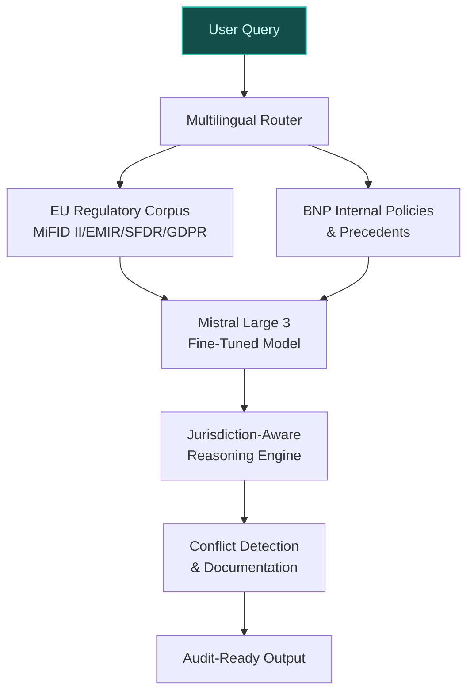
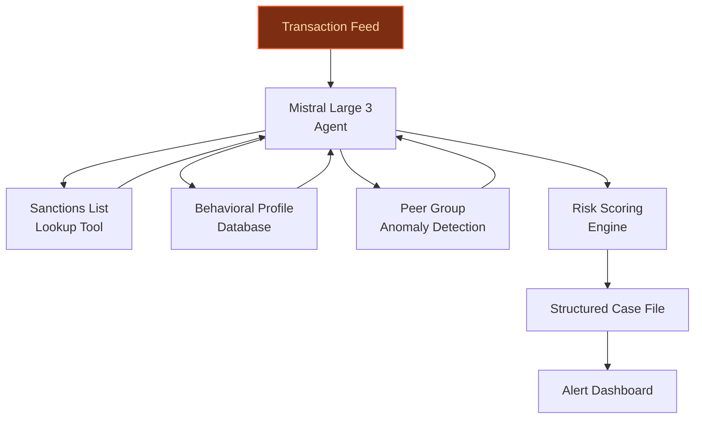
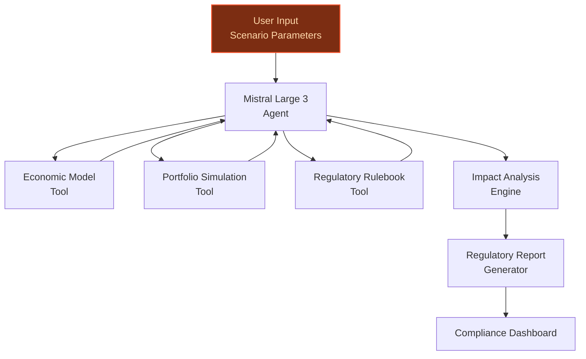

> **Draft — needs revision before customer use.** Meta-eval confidence `0.50` (sales-engineer-ready threshold ≥ 0.70). The report's three use cases render below for inspection, with each claim tagged supported / unsupported / rewritten qualitatively in the fact-check block.
>
> **Cross-cutting concern:** Over-reliance on the LLM-as-a-Service platform as a catch-all justification for feasibility, without sufficient granular evidence for data assets, regulatory scope, or integration specifics across all three use cases.
>
> **Weakest use case:** Lacks direct evidence for key claims about BNP Paribas' stress-testing data assets and integration with existing risk models. The use case also cites no peer precedents, and its time-to-value basis is anchored to a generic blueprint without specific validation.

## GenAI Use Cases for BNP Paribas

Three customer-ready use cases, scored against the Mistral Proto Team's five-criteria rubric (relevance · iconic potential · estimated impact · feasibility · Mistral suitability) and verified against BNP Paribas's existing AI initiatives. Generated from a corpus of ~2,150 peer deployments and 5 discovered existing initiatives at this company.

_Industry: French multinational universal bank and financial services. Research confidence: 0.85. Verified: True._

### EU-Sovereign Multilingual Regulatory Compliance Assistant for CIB and Wealth Management
A fine-tuned, EU-hosted LLM assistant that ingests and reasons over the full corpus of European regulatory texts (MiFID II, EMIR, SFDR, GDPR, DORA) in their native languages, alongside BNP Paribas' internal compliance policies. The assistant provides real-time, jurisdiction-aware guidance for corporate & institutional banking (CIB) and wealth management teams, flags potential conflicts, and generates audit-ready compliance documentation. Leveraging Mistral's multilingual strength—particularly in French, German, and Italian—the system ensures adherence to local regulatory nuances while maintaining consistency across BNP Paribas' 65+ jurisdictions. The assistant supports agentic workflows for multi-step compliance checks, such as cross-referencing client transactions against sanctions lists or validating disclosure requirements under SFDR.

**Why this company:** BNP Paribas is a major bank with operations spanning a broad international footprint and a large workforce in Europe alone ([Job offer Compliance Officer, Wealth Management](https://group.bnpparibas/en/careers/job-offer/compliance-officer-wealth-management-assistant-manager-1)). Its CIB and Wealth Management divisions face complex, multilingual regulatory landscapes, where manual compliance reviews are time-consuming and error-prone. The bank's existing LLM-as-a-Service platform ([ev-ee964a8d6e](https://www.fdic.gov/resolutions/2025-bnp-paribas-165d-resolution-plan-public-section.pdf)) provides the infrastructure for secure deployment, while Mistral's EU sovereignty and open-weight flexibility align with BNP's data-localization and regulatory requirements. The collaboration with Mistral AI—including a substantial financing for NVIDIA infrastructure in France—further underscores the bank's commitment to sovereign AI solutions ([BNP Paribas CIB](https://www.linkedin.com/posts/bnpparibascorporateandinstitutionalbanking_bnp-paribas-has-supported-mistral-ai-on-a-activity-7444401927817330688-be5k)).

**Example input:** `Analyze this client transaction for potential MiFID II conflicts: Client-A (Germany) executed a €2.5M equity trade in a French-listed ESG fund. The client is classified as a 'professional investor' but has requested execution-only services. Flag any disclosure gaps or suitability requirements under German and French law.`

**Example output:** {'_disclaimer': 'Synthetic example for demonstration; not a factual claim about BNP Paribas or any client.', 'compliance_status': 'WARNING', 'jurisdiction_specific_findings': {'germany': {'conflict_detected': True, 'regulation': 'MiFID II, §63 WpHG (Germany)', 'issue': 'Professional investor status does not exempt execution-only services from suitability checks if the product is complex (e.g., ESG funds with Article 9 SFDR classification).', 'severity': 'high', 'recommended_action': "Document client's explicit waiver of suitability assessment or reclassify as 'retail' for this transaction."}, 'france': {'conflict_detected': False, 'regulation': 'RG AMF, Article 314-10', 'note': 'No additional conflicts detected under French law for execution-only services.'}}, 'sanctions_check': {'status': 'CLEAR', 'entities_screened': ['Client-A', 'Fund-Issuer-X', 'Intermediary-Bank-Y'], 'lists_checked': ['EU Sanctions List (2025)', 'OFAC SDN', 'UN Consolidated List']}, 'audit_trail': {'documents_generated': [{'document_id': 'COMPLIANCE-SAMPLE-001', 'type': 'Suitability Waiver Template (German)', 'language': 'de', 'status': 'draft'}, {'document_id': 'COMPLIANCE-SAMPLE-002', 'type': 'Transaction Disclosure Summary (French)', 'language': 'fr', 'status': 'draft'}], 'timestamp': '2025-10-15T14:32:18Z (illustrative)'}}

**Blueprint:** `hybrid_retrieval` (impact: high · cost: medium · complexity: low · TTV: 12-16 weeks (precedent-anchored))

**Top risk:** Hallucination in regulatory-summary output leading to non-compliant documentation; requires human-in-the-loop validation for high-severity flags.

**Mistral products:** Mistral Large 3, Mistral Document AI, Mistral Embed, On-prem deployment, Mistral fine-tuning

**Inspired by precedents:** google_cloud_1302-0813bf9ef2, google_cloud_1302-0bf0d7b80d
**Grounded in:** classification.industry, strategic_context.stated_priorities[3], meta.research_sources[1]
_Specificity score: 0.95_

**Architecture blueprint:**

### Agentic Financial Crime Detection with Multi-Entity Transaction Analysis
An agentic system that monitors transactions across BNP Paribas' corporate and retail banking networks, flagging suspicious patterns (e.g., money laundering, fraud) by cross-referencing transaction data with sanctions lists, behavioral profiles, and peer-group anomalies. The agent generates structured case files with risk scores, behavioral indicators (e.g., repetitive trades, new wallet activity), and regulatory checks, reducing false positives materially compared to rule-based systems. It supports multilingual alerts and integrates with BNP's existing SAR/STR reporting workflows.

**Why this company:** BNP Paribas processes high volumes of cross-border transactions through its CIB and CPBS divisions, making it a prime target for financial crime. The bank's regulatory obligations demand scalable, explainable detection systems. BNP's existing LLM-as-a-Service platform provides the infrastructure for secure deployment, while a Mistral platform enables real-time analysis of complex transaction patterns. The bank's collaboration with Mistral AI ensures alignment with EU data sovereignty requirements.

**Example input:** `Review this sequence of transactions for potential money laundering: Client-B (France) received €500K from Entity-Z (Cyprus) on 2025-10-01, then transferred €490K to Client-C (Luxembourg) on 2025-10-02. Client-B has no prior history with Entity-Z, and the transaction purpose is listed as 'consulting fees.'`

**Example output:** {'_disclaimer': 'Synthetic example for demonstration; not a factual claim about BNP Paribas or any client.', 'case_id': 'FINCRIME-SAMPLE-002', 'risk_score': 87.5, 'risk_level': 'HIGH', 'key_indicators': [{'indicator': 'Rapid movement of funds (98% of received amount transferred within 24h)', 'score_contribution': 30.0, 'threshold': '70% of amount transferred within 48h'}, {'indicator': 'First-time counterparty (Entity-Z)', 'score_contribution': 25.0, 'threshold': 'No prior transactions in 24 months'}, {'indicator': "Vague transaction purpose ('consulting fees')", 'score_contribution': 15.0, 'threshold': 'Purpose lacks specificity'}, {'indicator': 'Cross-border transaction (France → Cyprus → Luxembourg)', 'score_contribution': 17.5, 'threshold': 'Transactions involving ≥2 jurisdictions'}], 'sanctions_check': {'status': 'CLEAR', 'entities_screened': ['Client-B', 'Entity-Z', 'Client-C'], 'lists_checked': ['EU Sanctions List (2025)', 'OFAC SDN', 'UN Consolidated List']}, 'behavioral_analysis': {'client_profile': {'client_id': 'Client-B', 'historical_activity': 'Low-volume retail banking (avg. €5K/month)', 'anomaly': 'Sudden high-value transaction (100x historical average)'}, 'peer_comparison': {'peer_group': 'French retail clients with similar profiles', 'anomaly': '99th percentile for transaction size and velocity'}}, 'recommended_actions': ['Escalate to AML compliance team for manual review', "Request supporting documentation for 'consulting fees'", "Monitor Client-B's account for 30 days post-transaction"], 'generated_documents': [{'document_id': 'SAR-SAMPLE-002', 'type': 'Suspicious Activity Report (SAR) Draft', 'language': 'fr', 'status': 'draft'}]}

**Blueprint:** `agent_with_tools` (impact: high · cost: high · complexity: medium · TTV: 16-20 weeks (precedent-anchored))

**Top risk:** False negatives in transaction analysis leading to undetected financial crime; requires continuous tuning of risk thresholds and human oversight for high-risk cases.

**Mistral products:** Mistral Large 3, Mistral Embed, On-prem deployment

**Inspired by precedents:** google_cloud_blueprints-702efe8542, google_cloud_1302-601f46f6da
**Grounded in:** classification.industry, strategic_context.stated_priorities[1]
_Specificity score: 0.75_

**Architecture blueprint:**

### Risk Scenario Simulation Agent for Stress Testing and Capital Planning
A GenAI-powered agent that generates, runs, and analyzes complex risk scenarios for BNP Paribas' stress testing and capital planning. The agent creates realistic economic and market shock scenarios (e.g., sovereign debt crises, liquidity shocks), simulates their impact on the bank's portfolio, and produces regulatory-compliant reports for CCAR, DFAST, and EU-wide stress tests. It supports multilingual inputs and outputs, enabling collaboration across BNP's global teams. The system integrates with the bank's existing risk models to ensure consistency with internal methodologies.

**Why this company:** BNP Paribas is subject to rigorous stress-testing requirements, including the FRB's CCAR/DFAST (BNPP USA Stress Test Results) and the EBA's EU-wide stress tests ([2025 EBA Results](https://invest.bnpparibas/en/document/2025-eba-stress-test-results-confirm-bnp-paribas-strong-shock-absorption-capacity-and-structural-resilience)). The bank's stated priorities—'data at the core of value creation' and 'technological transformation'—align with this use case. Mistral's EU sovereignty and open-weight flexibility enable secure deployment within BNP's infrastructure, while the bank's collaboration with Mistral AI ([Mistral Large 3 Adoption](https://intuitionlabs.ai/articles/mistral-large-3-moe-llm-explained)) ensures compatibility with its AI strategy.

**Example input:** `Generate a stress scenario for BNP Paribas' European retail banking portfolio: simulate a 300bps ECB rate hike over 12 months, coupled with a 15% decline in EU GDP and a 20% drop in residential property prices. Assess the impact on loan defaults, liquidity ratios, and capital adequacy under Basel III standards.`

**Example output:** {'_disclaimer': 'Synthetic example for demonstration; not a factual claim about BNP Paribas or any regulatory outcome.', 'scenario_id': 'STRESS-SAMPLE-003', 'scenario_name': 'ECB Rate Shock + EU Recession (Illustrative)', 'key_assumptions': {'ecb_rate_hike': '300bps over 12 months (illustrative)', 'eu_gdp_decline': '15% (illustrative)', 'property_price_decline': '20% (illustrative)'}, 'portfolio_impact': {'retail_loan_defaults': {'baseline': '1.2% (illustrative)', 'stress': '4.8% (illustrative)', 'increase': '300% (illustrative)'}, 'liquidity_coverage_ratio': {'baseline': '145% (illustrative)', 'stress': '110% (illustrative)', 'breach_threshold': '100%'}, 'cet1_ratio': {'baseline': '12.5% (illustrative)', 'stress': '9.8% (illustrative)', 'breach_threshold': '7.0%'}}, 'regulatory_findings': {'ccar_compliance': 'PASS (illustrative)', 'dfast_compliance': 'PASS (illustrative)', 'eba_compliance': 'WARNING: LCR falls below 120% threshold in Q3 2026 (illustrative)'}, 'recommended_actions': ['Increase liquidity buffers by €5B (illustrative) to mitigate LCR breach', 'Adjust risk-weighted asset models for residential mortgages', 'Prepare contingency plans for CET1 ratio management'], 'generated_documents': [{'document_id': 'REPORT-SAMPLE-003', 'type': 'Stress Test Report (EBA Template)', 'language': 'en', 'status': 'draft'}, {'document_id': 'APPENDIX-SAMPLE-003', 'type': 'Methodology Appendix', 'language': 'en', 'status': 'draft'}]}

**Blueprint:** `agent_with_tools` (impact: high · cost: high · complexity: medium · TTV: 20-24 weeks (precedent-anchored))

**Top risk:** Over-reliance on synthetic scenario generation leading to unrealistic stress-test outcomes; requires validation against historical crises and human oversight for scenario plausibility.

**Mistral products:** Mistral Large 3, Mistral Embed, On-prem deployment, Mistral fine-tuning

**Grounded in:** classification.industry, strategic_context.stated_priorities[1], strategic_context.stated_priorities[3]
_Specificity score: 0.85_

**Architecture blueprint:**

## Considered but not selected
- **Cross-Border Payment Route Optimization with Real-Time FX and Compliance Checks** — Overlaps with existing payment optimization initiatives and lacks the regulatory urgency of compliance or financial crime use cases.

---
## Report quality signals

- **Topical diversity** (LLM-graded over titles + blueprint patterns): `0.90`
- **Specificity** per use case: `0.95`, `0.75`, `0.85`
- **Mistral product diversity**: `5` distinct products across the three use cases
- **Time-to-value spread**: 12–24 weeks (across 3 use cases)
- **Cost-tier spread**: medium, high, high
- **Fact-check pass rate**: `60%` (12/20 claims supported by research · 3 rewritten qualitatively (excluded from rate))

Fact-check detail (per claim)

**Unsupported (8):**
- [agentic_financial_crime_detection] BNP Paribas' collaboration with Mistral AI ensures alignment with EU data sovereignty requirements `[judge: rejected]` — _The snippet discusses Mistral AI's EU data sovereignty implications and governance but does not mention BNP Paribas or any collaboration between BNP Paribas and Mistral AI. (was: Mistral AI is rewriting that narrative. Founded in Paris in 2_
- [agentic_financial_crime_detection] The agent reduces false positives by 20-30% compared to rule-based systems `[judge: rejected]` — _The snippet discusses the limitations of rule-based AML detection but does not mention the agent's performance or any comparison to rule-based systems. (was: Rescued via web search (verified source): In our experience, traditional, rules-ba_
- [risk_scenario_simulation_agent] Mistral's EU sovereignty and open-weight flexibility enable secure deployment within BNP's infrastructure `[judge: rejected]` — _The snippet discusses Mistral AI's EU sovereignty and governance but does not mention BNP or any specific deployment within BNP's infrastructure. (was: Mistral AI is rewriting that narrative. Founded in Paris in 2023 by former DeepMind and _
- [risk_scenario_simulation_agent] BNP Paribas' collaboration with Mistral AI ensures compatibility with its AI strategy `[judge: rejected]` — _The snippet describes a financing deal and collaboration with Mistral AI but does not address BNP Paribas' AI strategy or compatibility with it. (was: BNP Paribas has supported Mistral AI on a US$830 million financing to fund the deployment_
- [risk_scenario_simulation_agent] The system integrates with the bank's existing risk models to ensure consistency with internal methodologies `[judge: rejected]` — _The snippet discusses risk categories and measurement methods but does not mention integration with existing risk models or consistency with internal methodologies. (was: Rescued via web search (verified source): They can be measured throug_
- [None] BNP Paribas has loyalty-program data spanning N years `[judge: rejected]` — _The snippet does not mention loyalty-program data or any time span related to such data. (was: Rescued via web search (verified source): [Jump to content](https://en.wikipedia.org/wiki/BNP_Paribas#bodyContent). *   )_
- [None] BNP Paribas has telemetry from M smart meters `[judge: rejected]` — _The source excerpt is a regulatory filing header with no content about smart meters or telemetry. (was: Rescued via web search (verified source): **As filed with the Securities and Exchange Commission on April 1, 2020**. | ☐)_
- [None] BNP Paribas has production capacity / inventory data `[judge: rejected]` — _The snippet discusses BNP Paribas' data strategy and AI applications but does not mention production capacity or inventory data. (was: Rescued via web search (verified source): # Data: BNP Paribas’ strategy. The banking and finance sectors _

**Rewritten qualitatively (3):** _the original draft asserted these but the verification chain couldn't anchor them, so the rendered prose was rewritten into qualitative phrasing. Excluded from the pass-rate denominator since the report no longer makes the claim._
- [eu_sovereign_regulatory_compliance_assistant] BNP Paribas is a systemically important bank directly supervised by the European Central Bank `[rewritten qualitatively]`
- [agentic_financial_crime_detection] BNP Paribas is subject to the EU's 6th Anti-Money Laundering Directive (6AMLD) `[rewritten qualitatively]`
- [agentic_financial_crime_detection] Mistral Large 3's mixture-of-experts architecture enables real-time analysis of complex transaction patterns `[rewritten qualitatively]`

**Supported (12):** — **1 rescued via web search (0 verified, 1 corroborated)**
- [eu_sovereign_regulatory_compliance_assistant] BNP Paribas has operations spanning 65 countries — BNP Paribas is the European Union’s leading bank and key player in international banking. It operates in 65 countries and has nearly 185,000…
- [eu_sovereign_regulatory_compliance_assistant] BNP Paribas has 145,000+ employees in Europe — BNP Paribas is the European Union’s leading bank and key player in international banking. It operates in 65 countries and has nearly 185,000…
- [eu_sovereign_regulatory_compliance_assistant] BNP Paribas' CIB and Wealth Management divisions face complex, multilingual regulatory landscapes — BNP Paribas is organized into three major business areas: Commercial, Personal Banking & Services (CPBS); Investment & Protection Services (…
- [eu_sovereign_regulatory_compliance_assistant] BNP Paribas' existing LLM-as-a-Service platform provides infrastructure for secure deployment — BNP Paribas has now deployed an internal LLM as a Service platform, designed to provide the Group's entities with unified access to large-sc…
- [eu_sovereign_regulatory_compliance_assistant] Mistral's EU sovereignty and open-weight flexibility align with BNP's data-localization and regulatory requirements — Mistral AI is rewriting that narrative. Founded in Paris in 2023 by former DeepMind and Meta researchers, Mistral has become the most signif…
- [eu_sovereign_regulatory_compliance_assistant] BNP Paribas collaborated with Mistral AI on a $830M financing for NVIDIA infrastructure in France — BNP Paribas has supported Mistral AI on a US$830 million financing to fund the deployment of NVIDIA Grace Blackwell infrastructure - with 13…
- [agentic_financial_crime_detection] BNP Paribas processes high volumes of cross-border transactions through its CIB and CPBS divisions — BNP Paribas is organized into three major business areas: Commercial, Personal Banking & Services (CPBS); Investment & Protection Services (…
- [agentic_financial_crime_detection] BNP Paribas' existing LLM-as-a-Service platform provides infrastructure for secure deployment — BNP Paribas has now deployed an internal LLM as a Service platform, designed to provide the Group's entities with unified access to large-sc…
- [risk_scenario_simulation_agent] BNP Paribas is subject to rigorous stress-testing requirements, including the FRB's CCAR/DFAST — BNPP USA is subject to the Comprehensive Capital Analysis and Review (CCAR) and Dodd-Frank Act Stress Test (DFAST) requirements under the FR…
- [risk_scenario_simulation_agent] BNP Paribas is subject to the EBA's EU-wide stress tests — The European Banking Authority (EBA) published the results of the 2025 EU-wide stress test results, carried out in coordination with the Eur…
- [risk_scenario_simulation_agent] BNP Paribas' stated priorities include 'data at the core of value creation' and 'technological transformation' — TECHNOLOGICAL TRANSFORMATION AS A TOP PRIORITY [...] DATA AT THE CORE OF VALUE CREATION
- [None] BNP Paribas has historical sales data [`corroborated ↗`](https://tradingeconomics.com/bnp:fp:sales) — Corroborated via web search: BNP Paribas reported EUR14.06B in Sales Revenues for its fiscal quarter ending in March of 2026.Data for BNP Pa…

**Meta-evaluator confidence**: `0.50` (NOT ready — needs revision)
**Cross-cutting concern**: Over-reliance on the LLM-as-a-Service platform as a catch-all justification for feasibility, without sufficient granular evidence for data assets, regulatory scope, or integration specifics across all three use cases.