# Pipeline blueprint (architecture)

Static view of the pipeline regardless of run timing — shows agents,
models, and gates. The chronological execution log follows below.

```mermaid
flowchart TD
    Start([User: company name]) --> R
    R["<b>1. Research</b><br/>parallel: Wikipedia · Tavily news ·<br/>existing initiatives · live verification<br/><i>mistral-medium</i> synthesis"]
    R --> G["<b>1b. Gap-fill</b><br/>identify missing fields →<br/><i>mistral-small</i> generates queries →<br/>Tavily search per field →<br/><i>mistral-small</i> per-field extraction"]
    G --> Conf{Confidence ≥ 0.5<br/>OR verified<br/>OR ≥ 1 existing initiative?}
    Conf -->|no| Refuse([Refusal])
    Conf -->|yes| Ret
    Ret["<b>2. Retrieve</b><br/><i>mistral-embed</i> on company query →<br/>cosine top-K + industry/depth filter +<br/>MMR diversification"]
    Ret --> Gen["<b>3. Generate 12 candidates</b><br/><i>mistral-medium</i> with web_search tool<br/>(Tavily + deep-read) — fact citations<br/>flow into the EvidenceLedger"]
    Gen --> Score["<b>4. Score</b><br/>self-consistency: 2 parallel passes<br/><i>mistral-small</i> @ T=0.2 and T=0.4 →<br/>aggregate weighted scores"]
    Score --> Verify["<b>5. Per-candidate verify</b><br/>top-3: Tavily search + deep-read +<br/><i>mistral-small</i> verdict (pass /<br/>partial / confirmed_existing)"]
    Verify --> Enrich["<b>6. Enrich</b><br/><i>mistral-large</i> drafts customer-facing<br/>prose for 3 use cases (or<br/><i>mistral-medium</i> on fast tier)"]
    Enrich --> NumScrub["<b>6a. Numeric scrub</b><br/>flag any number not in cited content"]
    NumScrub --> Polish["<b>6b. Polish</b><br/><i>mistral-small</i> per use case (parallel):<br/>convert markers→qualitative,<br/>(ev-XXX)→[title](url)"]
    Polish --> Attr["<b>6c. Attribution check</b><br/><i>mistral-small</i> per use case (parallel):<br/>fix corpus-ID ↔ company mismatches"]
    Attr --> Meta["<b>7. Meta-evaluation</b><br/><i>mistral-medium</i> reviews report against<br/>cited precedents + ledger entries:<br/>strict claim verification"]
    Meta --> RegenQ{confidence < 0.6<br/>AND not fast tier?}
    RegenQ -->|yes| Regen["<b>7b. Targeted regen</b><br/><i>mistral-large</i> re-enriches just the<br/>weakest use case with the next-best<br/>near-miss; re-runs meta-eval"]
    RegenQ -->|no| QS
    Regen --> QS
    QS["<b>Quality signals</b><br/>LLM-graded diversity + specificity,<br/>fact-check pass rate, TTV/cost spread"]
    QS --> Render([Markdown report + trace])

    classDef agent fill:#fef3c7,stroke:#f59e0b
    classDef gate fill:#dbeafe,stroke:#3b82f6
    classDef io fill:#dcfce7,stroke:#16a34a
    class R,G,Ret,Gen,Score,Verify,Enrich,NumScrub,Polish,Attr,Meta,Regen,QS agent
    class Conf,RegenQ gate
    class Start,Refuse,Render io
```

## Execution trace — BNP Paribas

Started: `2026-05-09T18:52:53.378619+00:00`. Total wall time: `214.8s` across `52` recorded actions.

### Per-step time totals

| Step | Calls | Total time | Avg time |
|---|---:|---:|---:|
| `research` | 1 | 7.99s | 7991ms |
| `gap_fill` | 4 | 15.33s | 3834ms |
| `retrieve` | 2 | 0.55s | 277ms |
| `generate` | 2 | 34.64s | 17321ms |
| `generate.web_search` | 2 | 7.41s | 3704ms |
| `score` | 2 | 33.07s | 16535ms |
| `verify` | 6 | 20.75s | 3458ms |
| `enrich` | 1 | 71.19s | 71193ms |
| `polish` | 2 | 12.06s | 6030ms |
| `meta_eval` | 1 | 16.27s | 16269ms |
| `web_verify` | 1 | 6.35s | 6353ms |
| `source_judge` | 24 | 19.77s | 824ms |
| `final_qualify` | 2 | 4.35s | 2177ms |
| `quality_signals` | 2 | 5.97s | 2986ms |

### Chronological event log

- `18:52:56.231` **[research]** `mistral-medium-2604.chat.complete` — 7991ms
   - inputs: synthesize CompanyContext for BNP Paribas | depth=medium
   - outputs: industry='French multinational universal bank and financial services' verified=True conf=0.75
- `18:53:04.224` **[gap_fill]** `mistral-small-2603.chat.complete` — 846ms
   - inputs: generate gap queries | fields=['business_model', 'products', 'data_assets', 'priorities']
   - outputs: queries=4
- `18:53:13.521` **[gap_fill]** `mistral-small-2603.chat.complete` — 6560ms
   - inputs: layer-2 extract field=priorities
   - outputs: items=6
- `18:53:13.528` **[gap_fill]** `mistral-small-2603.chat.complete` — 693ms
   - inputs: layer-2 extract field=data_assets
   - outputs: items=0
- `18:53:13.532` **[gap_fill]** `mistral-small-2603.chat.complete` — 7236ms
   - inputs: layer-2 extract field=products
   - outputs: items=5
- `18:53:20.769` **[retrieve]** `mistral-embed.embeddings.create` — 209ms
   - inputs: company_query | industries='French multinational universal bank and financial services'
   - outputs: embedded 1024-dim query vector
- `18:53:20.978` **[retrieve]** `precedent_corpus.cosine_topk` — 345ms
   - inputs: k=8 min_depth=0.4 target='BNP Paribas'
   - outputs: retrieved 8 | mmr=True | top_sim=0.784
- `18:53:22.406` **[generate]** `mistral-medium-2604.chat.complete` — 2251ms
   - inputs: iteration=0 tool_calls_used=0/2 tools=on
   - outputs: tool_calls=4 | content_chars=0
- `18:53:24.679` **[generate.web_search]** `tavily.search` — 3501ms
   - inputs: query='BNP Paribas recent AI initiatives 2025 2026'
   - outputs: 2 raw results
- `18:53:29.454` **[generate.web_search]** `tavily.search` — 3906ms
   - inputs: query='BNP Paribas regulatory compliance priorities 2025'
   - outputs: 2 raw results
- `18:53:36.207` **[generate]** `mistral-medium-2604.chat.complete` — 32390ms
   - inputs: iteration=1 tool_calls_used=2/2 tools=off
   - outputs: tool_calls=0 | content_chars=22184
- `18:54:09.023` **[score]** `mistral-small-2603.chat.complete` — 17134ms
   - inputs: self-consistency pass T=0.2
   - outputs: scored 12 candidates
- `18:54:09.029` **[score]** `mistral-small-2603.chat.complete` — 15936ms
   - inputs: self-consistency pass T=0.4
   - outputs: scored 12 candidates
- `18:54:26.196` **[verify]** `tavily.search` — 2402ms
   - inputs: candidate=eu_sovereign_regulatory_compliance_assistant | query='BNP Paribas EU-Sovereign Multilingual Regulatory Compliance '
   - outputs: 4 results
- `18:54:26.196` **[verify]** `tavily.search` — 2359ms
   - inputs: candidate=agentic_financial_crime_detection | query='BNP Paribas Agentic Financial Crime Detection with Multi-Ent'
   - outputs: 4 results
- `18:54:26.197` **[verify]** `tavily.search` — 2689ms
   - inputs: candidate=risk_scenario_simulation_agent | query='BNP Paribas Risk Scenario Simulation Agent for Stress Testin'
   - outputs: 4 results
- `18:54:29.137` **[verify]** `mistral-small-2603.chat.complete` — 3985ms
   - inputs: verdict for agentic_financial_crime_detection
   - outputs: verdict='pass'
- `18:54:29.243` **[verify]** `mistral-small-2603.chat.complete` — 3963ms
   - inputs: verdict for risk_scenario_simulation_agent
   - outputs: verdict='pass'
- `18:54:29.884` **[verify]** `mistral-small-2603.chat.complete` — 5347ms
   - inputs: verdict for eu_sovereign_regulatory_compliance_assistant
   - outputs: verdict='pass'
- `18:54:35.233` **[enrich]** `mistral-large-2512.chat.complete` — 71193ms
   - inputs: tier=standard top_3=['eu_sovereign_regulatory_compliance_assistant', 'agentic_financial_crime_detection', 'risk_scenario_simulation_agent']
   - outputs: enriched 3 use cases
- `18:55:46.457` **[polish]** `mistral-small-2603.chat.complete` — 4243ms
   - inputs: use_case=agentic_financial_crime_detection unanchored=True opaque_ev=False
   - outputs: polished 5 fields
- `18:55:46.461` **[polish]** `mistral-small-2603.chat.complete` — 7817ms
   - inputs: use_case=risk_scenario_simulation_agent unanchored=True opaque_ev=False
   - outputs: polished 5 fields
- `18:55:54.281` **[meta_eval]** `mistral-medium-2604.chat.complete` — 16269ms
   - inputs: reviewing 3 use cases
   - outputs: review + claims
- `18:56:10.568` **[web_verify]** `tavily.search.rescue_unsupported_claims` — 6353ms
   - inputs: company='BNP Paribas' unsupported=8 budget=12
   - outputs: rescued: verified=6 corroborated=2 of 8 attempted
- `18:56:16.922` **[source_judge]** `mistral-small-2603.judge_claim_sources` — 2368ms
   - inputs: pairs=23
   - outputs: judged 23 pairs
- `18:56:16.922` **[source_judge]** `mistral-small-2603.chat.complete` — 776ms
   - inputs: claim='BNP Paribas is a systemically important bank directly superv'
   - outputs: verdict=unsupported
- `18:56:16.929` **[source_judge]** `mistral-small-2603.chat.complete` — 740ms
   - inputs: claim='BNP Paribas has operations spanning 65 countries'
   - outputs: verdict=supported
- `18:56:16.933` **[source_judge]** `mistral-small-2603.chat.complete` — 954ms
   - inputs: claim='BNP Paribas has 145,000+ employees in Europe'
   - outputs: verdict=supported
- `18:56:16.941` **[source_judge]** `mistral-small-2603.chat.complete` — 1262ms
   - inputs: claim="BNP Paribas' CIB and Wealth Management divisions face comple"
   - outputs: verdict=supported
- `18:56:16.944` **[source_judge]** `mistral-small-2603.chat.complete` — 949ms
   - inputs: claim="BNP Paribas' existing LLM-as-a-Service platform provides inf"
   - outputs: verdict=supported
- `18:56:16.947` **[source_judge]** `mistral-small-2603.chat.complete` — 1178ms
   - inputs: claim="Mistral's EU sovereignty and open-weight flexibility align w"
   - outputs: verdict=supported
- `18:56:16.950` **[source_judge]** `mistral-small-2603.chat.complete` — 770ms
   - inputs: claim='BNP Paribas collaborated with Mistral AI on a $830M financin'
   - outputs: verdict=supported
- `18:56:16.955` **[source_judge]** `mistral-small-2603.chat.complete` — 940ms
   - inputs: claim='BNP Paribas processes high volumes of cross-border transacti'
   - outputs: verdict=supported
- `18:56:17.669` **[source_judge]** `mistral-small-2603.chat.complete` — 652ms
   - inputs: claim="BNP Paribas is subject to the EU's 6th Anti-Money Laundering"
   - outputs: verdict=unsupported
- `18:56:17.699` **[source_judge]** `mistral-small-2603.chat.complete` — 678ms
   - inputs: claim="BNP Paribas' existing LLM-as-a-Service platform provides inf"
   - outputs: verdict=supported
- `18:56:17.720` **[source_judge]** `mistral-small-2603.chat.complete` — 721ms
   - inputs: claim="Mistral Large 3's mixture-of-experts architecture enables re"
   - outputs: verdict=unsupported
- `18:56:17.888` **[source_judge]** `mistral-small-2603.chat.complete` — 668ms
   - inputs: claim="BNP Paribas' collaboration with Mistral AI ensures alignment"
   - outputs: verdict=unsupported
- `18:56:17.894` **[source_judge]** `mistral-small-2603.chat.complete` — 676ms
   - inputs: claim='The agent reduces false positives by 20-30% compared to rule'
   - outputs: verdict=unsupported
- `18:56:17.899` **[source_judge]** `mistral-small-2603.chat.complete` — 596ms
   - inputs: claim='BNP Paribas is subject to rigorous stress-testing requiremen'
   - outputs: verdict=supported
- `18:56:18.125` **[source_judge]** `mistral-small-2603.chat.complete` — 628ms
   - inputs: claim="BNP Paribas is subject to the EBA's EU-wide stress tests"
   - outputs: verdict=supported
- `18:56:18.204` **[source_judge]** `mistral-small-2603.chat.complete` — 608ms
   - inputs: claim="BNP Paribas' stated priorities include 'data at the core of "
   - outputs: verdict=supported
- `18:56:18.322` **[source_judge]** `mistral-small-2603.chat.complete` — 750ms
   - inputs: claim="Mistral's EU sovereignty and open-weight flexibility enable "
   - outputs: verdict=unsupported
- `18:56:18.377` **[source_judge]** `mistral-small-2603.chat.complete` — 686ms
   - inputs: claim="BNP Paribas' collaboration with Mistral AI ensures compatibi"
   - outputs: verdict=unsupported
- `18:56:18.441` **[source_judge]** `mistral-small-2603.chat.complete` — 800ms
   - inputs: claim="The system integrates with the bank's existing risk models t"
   - outputs: verdict=unsupported
- `18:56:18.495` **[source_judge]** `mistral-small-2603.chat.complete` — 623ms
   - inputs: claim='BNP Paribas has historical sales data'
   - outputs: verdict=supported
- `18:56:18.556` **[source_judge]** `mistral-small-2603.chat.complete` — 541ms
   - inputs: claim='BNP Paribas has loyalty-program data spanning N years'
   - outputs: verdict=unsupported
- `18:56:18.571` **[source_judge]** `mistral-small-2603.chat.complete` — 671ms
   - inputs: claim='BNP Paribas has telemetry from M smart meters'
   - outputs: verdict=unsupported
- `18:56:18.753` **[source_judge]** `mistral-small-2603.chat.complete` — 536ms
   - inputs: claim='BNP Paribas has production capacity / inventory data'
   - outputs: verdict=unsupported
- `18:56:19.292` **[final_qualify]** `mistral-small-2603.chat.complete` — 2781ms
   - inputs: use_case=eu_sovereign_regulatory_compliance_assistant unsupported=1
   - outputs: qualified 4 fields
- `18:56:19.297` **[final_qualify]** `mistral-small-2603.chat.complete` — 1573ms
   - inputs: use_case=agentic_financial_crime_detection unsupported=2
   - outputs: qualified 4 fields
- `18:56:22.240` **[quality_signals]** `mistral-small-2603.chat.complete` — 3334ms
   - inputs: specificity grade (3 use cases)
   - outputs: scored 3 use cases
- `18:56:25.574` **[quality_signals]** `mistral-small-2603.chat.complete` — 2639ms
   - inputs: diversity grade
   - outputs: diversity=0.9

## Mermaid sequence diagram (execution)

```mermaid
sequenceDiagram
    autonumber
    participant pipeline as pipeline
    participant mistral_medium_2604 as mistral-medium-2604
    participant mistral_small_2603 as mistral-small-2603
    participant mistral_embed as mistral-embed
    participant precedent_corpus as precedent_corpus
    participant tavily as tavily
    participant mistral_large_2512 as mistral-large-2512
    participant tavily_search as tavily.search
    pipeline->>mistral_medium_2604: research: chat.complete (7991ms)
    mistral_medium_2604-->>pipeline: industry='French multinational universal bank and financial 
    pipeline->>mistral_small_2603: gap_fill: chat.complete (846ms)
    mistral_small_2603-->>pipeline: queries=4
    pipeline->>mistral_small_2603: gap_fill: chat.complete (6560ms)
    mistral_small_2603-->>pipeline: items=6
    pipeline->>mistral_small_2603: gap_fill: chat.complete (693ms)
    mistral_small_2603-->>pipeline: items=0
    pipeline->>mistral_small_2603: gap_fill: chat.complete (7236ms)
    mistral_small_2603-->>pipeline: items=5
    pipeline->>mistral_embed: retrieve: embeddings.create (209ms)
    mistral_embed-->>pipeline: embedded 1024-dim query vector
    pipeline->>precedent_corpus: retrieve: cosine_topk (345ms)
    precedent_corpus-->>pipeline: retrieved 8 | mmr=True | top_sim=0.784
    pipeline->>mistral_medium_2604: generate: chat.complete (2251ms)
    mistral_medium_2604-->>pipeline: tool_calls=4 | content_chars=0
    pipeline->>tavily: generate.web_search: search (3501ms)
    tavily-->>pipeline: 2 raw results
    pipeline->>tavily: generate.web_search: search (3906ms)
    tavily-->>pipeline: 2 raw results
    pipeline->>mistral_medium_2604: generate: chat.complete (32390ms)
    mistral_medium_2604-->>pipeline: tool_calls=0 | content_chars=22184
    pipeline->>mistral_small_2603: score: chat.complete (17134ms)
    mistral_small_2603-->>pipeline: scored 12 candidates
    pipeline->>mistral_small_2603: score: chat.complete (15936ms)
    mistral_small_2603-->>pipeline: scored 12 candidates
    pipeline->>tavily: verify: search (2402ms)
    tavily-->>pipeline: 4 results
    pipeline->>tavily: verify: search (2359ms)
    tavily-->>pipeline: 4 results
    pipeline->>tavily: verify: search (2689ms)
    tavily-->>pipeline: 4 results
    pipeline->>mistral_small_2603: verify: chat.complete (3985ms)
    mistral_small_2603-->>pipeline: verdict='pass'
    pipeline->>mistral_small_2603: verify: chat.complete (3963ms)
    mistral_small_2603-->>pipeline: verdict='pass'
    pipeline->>mistral_small_2603: verify: chat.complete (5347ms)
    mistral_small_2603-->>pipeline: verdict='pass'
    pipeline->>mistral_large_2512: enrich: chat.complete (71193ms)
    mistral_large_2512-->>pipeline: enriched 3 use cases
    pipeline->>mistral_small_2603: polish: chat.complete (4243ms)
    mistral_small_2603-->>pipeline: polished 5 fields
    pipeline->>mistral_small_2603: polish: chat.complete (7817ms)
    mistral_small_2603-->>pipeline: polished 5 fields
    pipeline->>mistral_medium_2604: meta_eval: chat.complete (16269ms)
    mistral_medium_2604-->>pipeline: review + claims
    pipeline->>tavily_search: web_verify: rescue_unsupported_claims (6353ms)
    tavily_search-->>pipeline: rescued: verified=6 corroborated=2 of 8 attempted
    pipeline->>mistral_small_2603: source_judge: judge_claim_sources (2368ms)
    mistral_small_2603-->>pipeline: judged 23 pairs
    pipeline->>mistral_small_2603: source_judge: chat.complete (776ms)
    mistral_small_2603-->>pipeline: verdict=unsupported
    pipeline->>mistral_small_2603: source_judge: chat.complete (740ms)
    mistral_small_2603-->>pipeline: verdict=supported
    pipeline->>mistral_small_2603: source_judge: chat.complete (954ms)
    mistral_small_2603-->>pipeline: verdict=supported
    pipeline->>mistral_small_2603: source_judge: chat.complete (1262ms)
    mistral_small_2603-->>pipeline: verdict=supported
    pipeline->>mistral_small_2603: source_judge: chat.complete (949ms)
    mistral_small_2603-->>pipeline: verdict=supported
    pipeline->>mistral_small_2603: source_judge: chat.complete (1178ms)
    mistral_small_2603-->>pipeline: verdict=supported
    pipeline->>mistral_small_2603: source_judge: chat.complete (770ms)
    mistral_small_2603-->>pipeline: verdict=supported
    pipeline->>mistral_small_2603: source_judge: chat.complete (940ms)
    mistral_small_2603-->>pipeline: verdict=supported
    pipeline->>mistral_small_2603: source_judge: chat.complete (652ms)
    mistral_small_2603-->>pipeline: verdict=unsupported
    pipeline->>mistral_small_2603: source_judge: chat.complete (678ms)
    mistral_small_2603-->>pipeline: verdict=supported
    pipeline->>mistral_small_2603: source_judge: chat.complete (721ms)
    mistral_small_2603-->>pipeline: verdict=unsupported
    pipeline->>mistral_small_2603: source_judge: chat.complete (668ms)
    mistral_small_2603-->>pipeline: verdict=unsupported
    pipeline->>mistral_small_2603: source_judge: chat.complete (676ms)
    mistral_small_2603-->>pipeline: verdict=unsupported
    pipeline->>mistral_small_2603: source_judge: chat.complete (596ms)
    mistral_small_2603-->>pipeline: verdict=supported
    pipeline->>mistral_small_2603: source_judge: chat.complete (628ms)
    mistral_small_2603-->>pipeline: verdict=supported
    pipeline->>mistral_small_2603: source_judge: chat.complete (608ms)
    mistral_small_2603-->>pipeline: verdict=supported
    pipeline->>mistral_small_2603: source_judge: chat.complete (750ms)
    mistral_small_2603-->>pipeline: verdict=unsupported
    pipeline->>mistral_small_2603: source_judge: chat.complete (686ms)
    mistral_small_2603-->>pipeline: verdict=unsupported
    pipeline->>mistral_small_2603: source_judge: chat.complete (800ms)
    mistral_small_2603-->>pipeline: verdict=unsupported
    pipeline->>mistral_small_2603: source_judge: chat.complete (623ms)
    mistral_small_2603-->>pipeline: verdict=supported
    pipeline->>mistral_small_2603: source_judge: chat.complete (541ms)
    mistral_small_2603-->>pipeline: verdict=unsupported
    pipeline->>mistral_small_2603: source_judge: chat.complete (671ms)
    mistral_small_2603-->>pipeline: verdict=unsupported
    pipeline->>mistral_small_2603: source_judge: chat.complete (536ms)
    mistral_small_2603-->>pipeline: verdict=unsupported
    pipeline->>mistral_small_2603: final_qualify: chat.complete (2781ms)
    mistral_small_2603-->>pipeline: qualified 4 fields
    pipeline->>mistral_small_2603: final_qualify: chat.complete (1573ms)
    mistral_small_2603-->>pipeline: qualified 4 fields
    pipeline->>mistral_small_2603: quality_signals: chat.complete (3334ms)
    mistral_small_2603-->>pipeline: scored 3 use cases
    pipeline->>mistral_small_2603: quality_signals: chat.complete (2639ms)
    mistral_small_2603-->>pipeline: diversity=0.9
```

