# Pipeline blueprint (architecture)

Static view of the pipeline regardless of run timing — shows agents,
models, and gates. The chronological execution log follows below.

```mermaid
flowchart TD
    Start([User: company name]) --> R
    R["<b>1. Research</b><br/>parallel: Wikipedia · Tavily news ·<br/>existing initiatives · live verification<br/><i>mistral-medium</i> synthesis"]
    R --> G["<b>1b. Gap-fill</b><br/>identify missing fields →<br/><i>mistral-small</i> generates queries →<br/>Tavily search per field →<br/><i>mistral-small</i> per-field extraction"]
    G --> Conf{Confidence ≥ 0.5<br/>OR verified<br/>OR ≥ 1 existing initiative?}
    Conf -->|no| Refuse([Refusal])
    Conf -->|yes| Ret
    Ret["<b>2. Retrieve</b><br/><i>mistral-embed</i> on company query →<br/>cosine top-K + industry/depth filter +<br/>MMR diversification"]
    Ret --> Gen["<b>3. Generate 12 candidates</b><br/><i>mistral-medium</i> with web_search tool<br/>(Tavily + deep-read) — fact citations<br/>flow into the EvidenceLedger"]
    Gen --> Score["<b>4. Score</b><br/>self-consistency: 2 parallel passes<br/><i>mistral-small</i> @ T=0.2 and T=0.4 →<br/>aggregate weighted scores"]
    Score --> Verify["<b>5. Per-candidate verify</b><br/>top-3: Tavily search + deep-read +<br/><i>mistral-small</i> verdict (pass /<br/>partial / confirmed_existing)"]
    Verify --> Enrich["<b>6. Enrich</b><br/><i>mistral-large</i> drafts customer-facing<br/>prose for 3 use cases (or<br/><i>mistral-medium</i> on fast tier)"]
    Enrich --> NumScrub["<b>6a. Numeric scrub</b><br/>flag any number not in cited content"]
    NumScrub --> Polish["<b>6b. Polish</b><br/><i>mistral-small</i> per use case (parallel):<br/>convert markers→qualitative,<br/>(ev-XXX)→[title](url)"]
    Polish --> Attr["<b>6c. Attribution check</b><br/><i>mistral-small</i> per use case (parallel):<br/>fix corpus-ID ↔ company mismatches"]
    Attr --> Meta["<b>7. Meta-evaluation</b><br/><i>mistral-medium</i> reviews report against<br/>cited precedents + ledger entries:<br/>strict claim verification"]
    Meta --> RegenQ{confidence < 0.6<br/>AND not fast tier?}
    RegenQ -->|yes| Regen["<b>7b. Targeted regen</b><br/><i>mistral-large</i> re-enriches just the<br/>weakest use case with the next-best<br/>near-miss; re-runs meta-eval"]
    RegenQ -->|no| QS
    Regen --> QS
    QS["<b>Quality signals</b><br/>LLM-graded diversity + specificity,<br/>fact-check pass rate, TTV/cost spread"]
    QS --> Render([Markdown report + trace])

    classDef agent fill:#fef3c7,stroke:#f59e0b
    classDef gate fill:#dbeafe,stroke:#3b82f6
    classDef io fill:#dcfce7,stroke:#16a34a
    class R,G,Ret,Gen,Score,Verify,Enrich,NumScrub,Polish,Attr,Meta,Regen,QS agent
    class Conf,RegenQ gate
    class Start,Refuse,Render io
```

## Execution trace — Carrefour

Started: `2026-05-09T18:46:45.423930+00:00`. Total wall time: `189.2s` across `48` recorded actions.

### Per-step time totals

| Step | Calls | Total time | Avg time |
|---|---:|---:|---:|
| `research` | 1 | 11.07s | 11075ms |
| `gap_fill` | 4 | 3.63s | 908ms |
| `retrieve` | 2 | 0.56s | 281ms |
| `generate` | 2 | 33.76s | 16881ms |
| `generate.web_search` | 2 | 9.49s | 4747ms |
| `score` | 2 | 34.29s | 17143ms |
| `verify` | 6 | 19.58s | 3264ms |
| `enrich` | 1 | 62.22s | 62223ms |
| `polish` | 3 | 9.93s | 3311ms |
| `meta_eval` | 1 | 14.17s | 14167ms |
| `web_verify` | 1 | 4.70s | 4697ms |
| `source_judge` | 20 | 22.13s | 1106ms |
| `final_qualify` | 1 | 1.94s | 1940ms |
| `quality_signals` | 2 | 4.29s | 2146ms |

### Chronological event log

- `18:46:48.347` **[research]** `mistral-medium-2604.chat.complete` — 11075ms
   - inputs: synthesize CompanyContext for Carrefour | depth=medium
   - outputs: industry='French multinational retail and wholesaling corporation' verified=True conf=0.75
- `18:46:59.424` **[gap_fill]** `mistral-small-2603.chat.complete` — 942ms
   - inputs: generate gap queries | fields=['business_model', 'products', 'data_assets', 'priorities']
   - outputs: queries=4
- `18:47:06.408` **[gap_fill]** `mistral-small-2603.chat.complete` — 1076ms
   - inputs: layer-2 extract field=priorities
   - outputs: items=7
- `18:47:06.415` **[gap_fill]** `mistral-small-2603.chat.complete` — 959ms
   - inputs: layer-2 extract field=data_assets
   - outputs: items=6
- `18:47:06.419` **[gap_fill]** `mistral-small-2603.chat.complete` — 655ms
   - inputs: layer-2 extract field=products
   - outputs: items=6
- `18:47:07.486` **[retrieve]** `mistral-embed.embeddings.create` — 216ms
   - inputs: company_query | industries='French multinational retail and wholesaling corporation'
   - outputs: embedded 1024-dim query vector
- `18:47:07.702` **[retrieve]** `precedent_corpus.cosine_topk` — 346ms
   - inputs: k=8 min_depth=0.4 target='Carrefour'
   - outputs: retrieved 8 | mmr=True | top_sim=0.796
- `18:47:08.420` **[generate]** `mistral-medium-2604.chat.complete` — 1984ms
   - inputs: iteration=0 tool_calls_used=0/2 tools=on
   - outputs: tool_calls=4 | content_chars=0
- `18:47:10.423` **[generate.web_search]** `tavily.search` — 5454ms
   - inputs: query='Carrefour 2024 sustainability goals Food Transition Index'
   - outputs: 2 raw results
- `18:47:15.914` **[generate.web_search]** `tavily.search` — 4040ms
   - inputs: query='Carrefour Eureca European platform details 2024'
   - outputs: 2 raw results
- `18:47:19.976` **[generate]** `mistral-medium-2604.chat.complete` — 31779ms
   - inputs: iteration=1 tool_calls_used=2/2 tools=off
   - outputs: tool_calls=0 | content_chars=20346
- `18:47:52.090` **[score]** `mistral-small-2603.chat.complete` — 17966ms
   - inputs: self-consistency pass T=0.2
   - outputs: scored 12 candidates
- `18:47:52.094` **[score]** `mistral-small-2603.chat.complete` — 16320ms
   - inputs: self-consistency pass T=0.4
   - outputs: scored 12 candidates
- `18:48:10.089` **[verify]** `tavily.search` — 2467ms
   - inputs: candidate=sustainability_audit_agent | query='Carrefour AI-powered sustainability audit agent for supplier'
   - outputs: 4 results
- `18:48:10.089` **[verify]** `tavily.search` — 2509ms
   - inputs: candidate=dynamic_promotion_optimizer | query='Carrefour AI-driven dynamic promotion and markdown optimizat'
   - outputs: 4 results
- `18:48:10.089` **[verify]** `tavily.search` — 2841ms
   - inputs: candidate=supplier_catalog_ai_assistant | query='Carrefour Multilingual AI assistant for supplier catalog enr'
   - outputs: 4 results
- `18:48:12.938` **[verify]** `mistral-small-2603.chat.complete` — 5745ms
   - inputs: verdict for sustainability_audit_agent
   - outputs: verdict='partial_overlap'
- `18:48:13.638` **[verify]** `mistral-small-2603.chat.complete` — 1932ms
   - inputs: verdict for supplier_catalog_ai_assistant
   - outputs: verdict='pass'
- `18:48:14.804` **[verify]** `mistral-small-2603.chat.complete` — 4088ms
   - inputs: verdict for dynamic_promotion_optimizer
   - outputs: verdict='partial_overlap'
- `18:48:18.895` **[enrich]** `mistral-large-2512.chat.complete` — 62223ms
   - inputs: tier=standard top_3=['sustainability_audit_agent', 'dynamic_promotion_optimizer', 'concordis_demand_forecasting']
   - outputs: enriched 3 use cases
- `18:49:21.144` **[polish]** `mistral-small-2603.chat.complete` — 3593ms
   - inputs: use_case=sustainability_audit_agent unanchored=True opaque_ev=False
   - outputs: polished 5 fields
- `18:49:21.149` **[polish]** `mistral-small-2603.chat.complete` — 3354ms
   - inputs: use_case=dynamic_promotion_optimizer unanchored=True opaque_ev=False
   - outputs: polished 5 fields
- `18:49:21.153` **[polish]** `mistral-small-2603.chat.complete` — 2987ms
   - inputs: use_case=concordis_demand_forecasting unanchored=True opaque_ev=False
   - outputs: polished 5 fields
- `18:49:24.741` **[meta_eval]** `mistral-medium-2604.chat.complete` — 14167ms
   - inputs: reviewing 3 use cases
   - outputs: review + claims
- `18:49:38.928` **[web_verify]** `tavily.search.rescue_unsupported_claims` — 4697ms
   - inputs: company='Carrefour' unsupported=9 budget=12
   - outputs: rescued: verified=6 corroborated=3 of 9 attempted
- `18:49:43.628` **[source_judge]** `mistral-small-2603.judge_claim_sources` — 4531ms
   - inputs: pairs=19
   - outputs: judged 19 pairs
- `18:49:43.628` **[source_judge]** `mistral-small-2603.chat.complete` — 778ms
   - inputs: claim='Carrefour’s CSR and Food Transition Index is tied directly t'
   - outputs: verdict=supported
- `18:49:43.634` **[source_judge]** `mistral-small-2603.chat.complete` — 1034ms
   - inputs: claim='Carrefour has a target of 15,000-tonne reduction in plastic '
   - outputs: verdict=supported
- `18:49:43.637` **[source_judge]** `mistral-small-2603.chat.complete` — 816ms
   - inputs: claim='Carrefour partnered with TradeBeyond for digital supply chai'
   - outputs: verdict=supported
- `18:49:43.641` **[source_judge]** `mistral-small-2603.chat.complete` — 795ms
   - inputs: claim='Carrefour has 14,000 stores in 40 countries'
   - outputs: verdict=supported
- `18:49:43.645` **[source_judge]** `mistral-small-2603.chat.complete` — 768ms
   - inputs: claim='Carrefour’s operational transformation prioritizes dynamic p'
   - outputs: verdict=supported
- `18:49:43.649` **[source_judge]** `mistral-small-2603.chat.complete` — 815ms
   - inputs: claim='Carrefour’s CSR and Food Transition Index target is 111% in '
   - outputs: verdict=supported
- `18:49:43.654` **[source_judge]** `mistral-small-2603.chat.complete` — 765ms
   - inputs: claim='Carrefour’s CSR and Food Transition Index ties executive com'
   - outputs: verdict=supported
- `18:49:43.657` **[source_judge]** `mistral-small-2603.chat.complete` — 791ms
   - inputs: claim='Concordis aggregates purchasing power across 14,000 stores i'
   - outputs: verdict=supported
- `18:49:44.407` **[source_judge]** `mistral-small-2603.chat.complete` — 832ms
   - inputs: claim='Carrefour has existing AI initiatives for supply chain optim'
   - outputs: verdict=supported
- `18:49:44.413` **[source_judge]** `mistral-small-2603.chat.complete` — 819ms
   - inputs: claim='Carrefour’s scale creates a unique data asset for demand for'
   - outputs: verdict=unsupported
- `18:49:44.419` **[source_judge]** `mistral-small-2603.chat.complete` — 923ms
   - inputs: claim='Carrefour has store-level sales data'
   - outputs: verdict=supported
- `18:49:44.436` **[source_judge]** `mistral-small-2603.chat.complete` — 689ms
   - inputs: claim='Carrefour’s 2030 transformation goals include data-driven de'
   - outputs: verdict=supported
- `18:49:44.448` **[source_judge]** `mistral-small-2603.chat.complete` — 744ms
   - inputs: claim='Carrefour has historical sales data'
   - outputs: verdict=supported
- `18:49:44.453` **[source_judge]** `mistral-small-2603.chat.complete` — 3706ms
   - inputs: claim='Carrefour has loyalty-program data spanning N years'
   - outputs: verdict=unsupported
- `18:49:44.464` **[source_judge]** `mistral-small-2603.chat.complete` — 804ms
   - inputs: claim='Carrefour has telemetry from smart meters'
   - outputs: verdict=unsupported
- `18:49:44.668` **[source_judge]** `mistral-small-2603.chat.complete` — 603ms
   - inputs: claim='Carrefour has production capacity / inventory data'
   - outputs: verdict=unsupported
- `18:49:45.125` **[source_judge]** `mistral-small-2603.chat.complete` — 631ms
   - inputs: claim='Peer deployments report material reductions in stockouts'
   - outputs: verdict=unsupported
- `18:49:45.192` **[source_judge]** `mistral-small-2603.chat.complete` — 678ms
   - inputs: claim='Carrefour’s private-label perishable lines—Carrefour Bio and'
   - outputs: verdict=unsupported
- `18:49:45.233` **[source_judge]** `mistral-small-2603.chat.complete` — 608ms
   - inputs: claim='Carrefour has real-time data from 14,000 stores across 40 co'
   - outputs: verdict=unsupported
- `18:49:48.162` **[final_qualify]** `mistral-small-2603.chat.complete` — 1940ms
   - inputs: use_case=dynamic_promotion_optimizer unsupported=2
   - outputs: qualified 4 fields
- `18:49:50.334` **[quality_signals]** `mistral-small-2603.chat.complete` — 2881ms
   - inputs: specificity grade (3 use cases)
   - outputs: scored 3 use cases
- `18:49:53.215` **[quality_signals]** `mistral-small-2603.chat.complete` — 1410ms
   - inputs: diversity grade
   - outputs: diversity=0.85

## Mermaid sequence diagram (execution)

```mermaid
sequenceDiagram
    autonumber
    participant pipeline as pipeline
    participant mistral_medium_2604 as mistral-medium-2604
    participant mistral_small_2603 as mistral-small-2603
    participant mistral_embed as mistral-embed
    participant precedent_corpus as precedent_corpus
    participant tavily as tavily
    participant mistral_large_2512 as mistral-large-2512
    participant tavily_search as tavily.search
    pipeline->>mistral_medium_2604: research: chat.complete (11075ms)
    mistral_medium_2604-->>pipeline: industry='French multinational retail and wholesaling corpor
    pipeline->>mistral_small_2603: gap_fill: chat.complete (942ms)
    mistral_small_2603-->>pipeline: queries=4
    pipeline->>mistral_small_2603: gap_fill: chat.complete (1076ms)
    mistral_small_2603-->>pipeline: items=7
    pipeline->>mistral_small_2603: gap_fill: chat.complete (959ms)
    mistral_small_2603-->>pipeline: items=6
    pipeline->>mistral_small_2603: gap_fill: chat.complete (655ms)
    mistral_small_2603-->>pipeline: items=6
    pipeline->>mistral_embed: retrieve: embeddings.create (216ms)
    mistral_embed-->>pipeline: embedded 1024-dim query vector
    pipeline->>precedent_corpus: retrieve: cosine_topk (346ms)
    precedent_corpus-->>pipeline: retrieved 8 | mmr=True | top_sim=0.796
    pipeline->>mistral_medium_2604: generate: chat.complete (1984ms)
    mistral_medium_2604-->>pipeline: tool_calls=4 | content_chars=0
    pipeline->>tavily: generate.web_search: search (5454ms)
    tavily-->>pipeline: 2 raw results
    pipeline->>tavily: generate.web_search: search (4040ms)
    tavily-->>pipeline: 2 raw results
    pipeline->>mistral_medium_2604: generate: chat.complete (31779ms)
    mistral_medium_2604-->>pipeline: tool_calls=0 | content_chars=20346
    pipeline->>mistral_small_2603: score: chat.complete (17966ms)
    mistral_small_2603-->>pipeline: scored 12 candidates
    pipeline->>mistral_small_2603: score: chat.complete (16320ms)
    mistral_small_2603-->>pipeline: scored 12 candidates
    pipeline->>tavily: verify: search (2467ms)
    tavily-->>pipeline: 4 results
    pipeline->>tavily: verify: search (2509ms)
    tavily-->>pipeline: 4 results
    pipeline->>tavily: verify: search (2841ms)
    tavily-->>pipeline: 4 results
    pipeline->>mistral_small_2603: verify: chat.complete (5745ms)
    mistral_small_2603-->>pipeline: verdict='partial_overlap'
    pipeline->>mistral_small_2603: verify: chat.complete (1932ms)
    mistral_small_2603-->>pipeline: verdict='pass'
    pipeline->>mistral_small_2603: verify: chat.complete (4088ms)
    mistral_small_2603-->>pipeline: verdict='partial_overlap'
    pipeline->>mistral_large_2512: enrich: chat.complete (62223ms)
    mistral_large_2512-->>pipeline: enriched 3 use cases
    pipeline->>mistral_small_2603: polish: chat.complete (3593ms)
    mistral_small_2603-->>pipeline: polished 5 fields
    pipeline->>mistral_small_2603: polish: chat.complete (3354ms)
    mistral_small_2603-->>pipeline: polished 5 fields
    pipeline->>mistral_small_2603: polish: chat.complete (2987ms)
    mistral_small_2603-->>pipeline: polished 5 fields
    pipeline->>mistral_medium_2604: meta_eval: chat.complete (14167ms)
    mistral_medium_2604-->>pipeline: review + claims
    pipeline->>tavily_search: web_verify: rescue_unsupported_claims (4697ms)
    tavily_search-->>pipeline: rescued: verified=6 corroborated=3 of 9 attempted
    pipeline->>mistral_small_2603: source_judge: judge_claim_sources (4531ms)
    mistral_small_2603-->>pipeline: judged 19 pairs
    pipeline->>mistral_small_2603: source_judge: chat.complete (778ms)
    mistral_small_2603-->>pipeline: verdict=supported
    pipeline->>mistral_small_2603: source_judge: chat.complete (1034ms)
    mistral_small_2603-->>pipeline: verdict=supported
    pipeline->>mistral_small_2603: source_judge: chat.complete (816ms)
    mistral_small_2603-->>pipeline: verdict=supported
    pipeline->>mistral_small_2603: source_judge: chat.complete (795ms)
    mistral_small_2603-->>pipeline: verdict=supported
    pipeline->>mistral_small_2603: source_judge: chat.complete (768ms)
    mistral_small_2603-->>pipeline: verdict=supported
    pipeline->>mistral_small_2603: source_judge: chat.complete (815ms)
    mistral_small_2603-->>pipeline: verdict=supported
    pipeline->>mistral_small_2603: source_judge: chat.complete (765ms)
    mistral_small_2603-->>pipeline: verdict=supported
    pipeline->>mistral_small_2603: source_judge: chat.complete (791ms)
    mistral_small_2603-->>pipeline: verdict=supported
    pipeline->>mistral_small_2603: source_judge: chat.complete (832ms)
    mistral_small_2603-->>pipeline: verdict=supported
    pipeline->>mistral_small_2603: source_judge: chat.complete (819ms)
    mistral_small_2603-->>pipeline: verdict=unsupported
    pipeline->>mistral_small_2603: source_judge: chat.complete (923ms)
    mistral_small_2603-->>pipeline: verdict=supported
    pipeline->>mistral_small_2603: source_judge: chat.complete (689ms)
    mistral_small_2603-->>pipeline: verdict=supported
    pipeline->>mistral_small_2603: source_judge: chat.complete (744ms)
    mistral_small_2603-->>pipeline: verdict=supported
    pipeline->>mistral_small_2603: source_judge: chat.complete (3706ms)
    mistral_small_2603-->>pipeline: verdict=unsupported
    pipeline->>mistral_small_2603: source_judge: chat.complete (804ms)
    mistral_small_2603-->>pipeline: verdict=unsupported
    pipeline->>mistral_small_2603: source_judge: chat.complete (603ms)
    mistral_small_2603-->>pipeline: verdict=unsupported
    pipeline->>mistral_small_2603: source_judge: chat.complete (631ms)
    mistral_small_2603-->>pipeline: verdict=unsupported
    pipeline->>mistral_small_2603: source_judge: chat.complete (678ms)
    mistral_small_2603-->>pipeline: verdict=unsupported
    pipeline->>mistral_small_2603: source_judge: chat.complete (608ms)
    mistral_small_2603-->>pipeline: verdict=unsupported
    pipeline->>mistral_small_2603: final_qualify: chat.complete (1940ms)
    mistral_small_2603-->>pipeline: qualified 4 fields
    pipeline->>mistral_small_2603: quality_signals: chat.complete (2881ms)
    mistral_small_2603-->>pipeline: scored 3 use cases
    pipeline->>mistral_small_2603: quality_signals: chat.complete (1410ms)
    mistral_small_2603-->>pipeline: diversity=0.85
```

