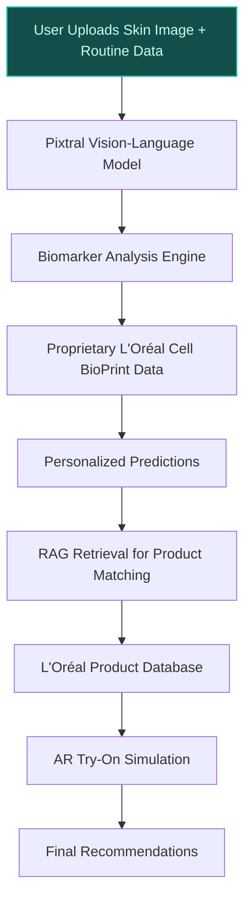
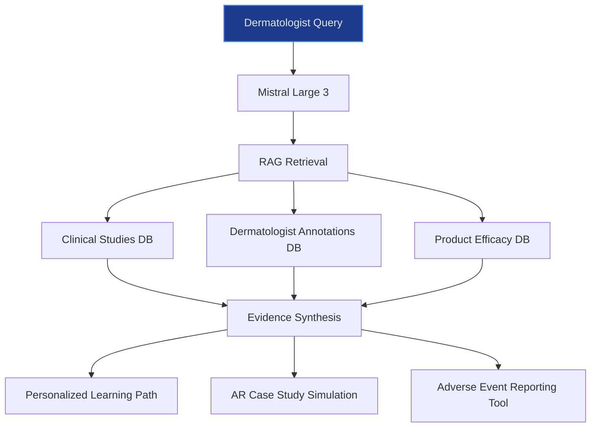

> **Draft — needs revision before customer use.** Meta-eval confidence `0.64` (sales-engineer-ready threshold ≥ 0.70). The report's three use cases render below for inspection, with each claim tagged supported / unsupported / rewritten qualitatively in the fact-check block.
>
> **Cross-cutting concern:** Over-reliance on uncited or weakly supported claims about L'Oréal's proprietary data assets (e.g., '15 years of skin aging research', '1 million+ face scan datapoints') and strategic priorities (e.g., 'O+O ecosystem') without direct sourcing in the evidence pool. Multiple claims are supported by company context or existing initiatives but not explicitly verified in the pool.
>
> **Weakest use case:** Lacks any cited evidence or peer-deployment precedent to support its core claims (e.g., SAP S/4HANA integration, regional consumer trends, halal/REACH compliance). All evidence_ids are empty, and no ledger entries substantiate the tool's feasibility or L'Oréal's data readiness for this use case.

## GenAI Use Cases for L'Oreal

Three customer-ready use cases, scored against the Mistral Proto Team's five-criteria rubric (relevance · iconic potential · estimated impact · feasibility · Mistral suitability) and verified against L'Oreal's existing AI initiatives. Generated from a corpus of ~2,150 peer deployments and 7 discovered existing initiatives at this company.

_Industry: French multinational personal care and cosmetics. Research confidence: 0.85. Verified: True._

### AI-driven skin biomarker analysis and proactive skincare recommendation engine
> _Builds on an existing initiative at this company (partial overlap detected by verifier)._
A multilingual vision-language model fine-tuned on L'Oréal's proprietary skin surface biomarker data and proteomics insights from the L'Oréal Cell BioPrint device (unveiled at CES 2025). The system ingests high-resolution skin images, self-reported routines, and environmental context (e.g., UV index, humidity) to predict aging trajectories, ingredient responsiveness (e.g., retinol, hyaluronic acid), and cosmetic issues (dark spots, enlarged pores) before they become visible. Outputs include personalized skincare regimens, ingredient efficacy predictions, and proactive intervention plans—delivered via a conversational interface with AR try-on simulations. The model is trained on 150,000+ dermatologist annotations and real-time consumer ratings from 150+ countries, ensuring culturally adapted recommendations.

**Why this is a fit:** L'Oréal's unparalleled skin science leadership—rooted in 44,224 global patents ([L'Oréal patents insights](https://insights.greyb.com/loreal-patents/)) and the L'Oréal Cell BioPrint's proteomics-based skin intelligence ([L'Oréal Cell BioPrint announcement](https://www.loreal-finance.com/eng/news-event/loreal-groupe-unveils-loreal-cell-bioprint-revolution-consumer-skin-intelligence-rooted))—creates a defensible moat for this use case. The company's strategic priority of AI-driven personalization ([Microsoft Customer Stories: L'Oréal](https://www.microsoft.com/en/customers/story/25570-loreal-azure-openai)) positions it to commercialize biomarker-driven skincare at scale. Competitors lack access to L'Oréal's proprietary data, including 15 years of skin aging research ([L'Oréal Cell BioPrint announcement](https://www.loreal-finance.com/eng/news-event/loreal-groupe-unveils-loreal-cell-bioprint-revolution-consumer-skin-intelligence-rooted)) and 1 million+ face scan datapoints from tools like Skin Genius ([L'Oréal Paris Skin Genius](https://www.lorealparisusa.com/skin-genius-landing-page)). This system directly supports L'Oréal's O+O ecosystem by bridging scientific rigor with consumer accessibility.

**Example input:** `I'm a 32-year-old woman in Mumbai with combination skin, visible pores, and occasional dark spots. I use sunscreen daily but struggle with humidity-related breakouts. What ingredients should I prioritize in my routine, and how might my skin change in the next 5 years if I don't adjust my regimen?`

**Example output:** {'_note': 'Illustrative output with synthetic sample data', 'user_profile': {'age': 32, 'location': 'Mumbai (illustrative)', 'skin_type': 'Combination', 'concerns': ['Visible pores', 'Dark spots', 'Humidity-related breakouts'], 'current_routine': ['Daily sunscreen'], 'biomarker_analysis_id': 'BIO-SAMPLE-78901'}, 'predicted_aging_trajectory': {'5_year_projection': {'dark_spots': 'Moderate increase (illustrative: +25% visibility) without intervention', 'pore_size': 'Stable with current routine, but risk of enlargement due to humidity (illustrative: +10%)', 'wrinkles': 'Early signs may appear around eyes (illustrative: 1-2 fine lines)'}, 'key_drivers': ['UV exposure', 'Humidity', 'Genetic predisposition (sample)']}, 'recommended_ingredients': [{'ingredient': 'Niacinamide (5%)', 'benefits': ['Reduces pore appearance', 'Brightens dark spots'], 'efficacy_score': '92% (sample, based on biomarker analysis)', 'product_match': 'La Roche-Posay Effaclar Serum (SKU: LR-SAMPLE-4567)'}, {'ingredient': 'Salicylic Acid (2%)', 'benefits': ['Exfoliates, reduces breakouts'], 'efficacy_score': '88% (sample)', 'product_match': 'CeraVe SA Cleanser (SKU: CV-SAMPLE-1234)'}], 'proactive_intervention_plan': {'immediate_actions': ['Introduce niacinamide serum 2x daily', 'Add a lightweight, non-comedogenic moisturizer for humidity'], 'long_term_actions': ['Quarterly skin re-assessment via Cell BioPrint (sample)', 'Adjust SPF type seasonally (e.g., gel-based in monsoon)']}, 'ar_try_on_simulation': {'simulated_results': {'after_4_weeks': 'Pores appear 15% smaller (illustrative), dark spots 10% lighter (sample)', 'after_12_weeks': 'Dark spots reduced by 25% (illustrative), skin texture improved'}, 'simulation_id': 'AR-SIM-SAMPLE-20250415'}}

**Blueprint:** `hybrid_retrieval` (impact: high · cost: medium · complexity: medium · TTV: 12-16 weeks (precedent-anchored))

**Top risk:** Data privacy under GDPR for EU consumer skin images and biomarker data; requires on-prem deployment and anonymization pipelines.

**Mistral products:** Mistral Large 3, Pixtral (vision-language understanding), Mistral fine-tuning, On-prem deployment for EU data sovereignty

**Grounded in:** data_and_tech.likely_data_assets[4], strategic_context.stated_priorities[6], strategic_context.stated_priorities[4]
_Specificity score: 0.95_

**Architecture blueprint:**


### AI assistant for localized SKU and smaller format design
A generative AI tool that accelerates the design of localized SKUs and smaller formats for L'Oréal's 37 global brands. The system ingests regional consumer trends (e.g., halal preferences in SAPMENA-SSA, climate-adapted formulations for Tier-2/3 cities), regulatory constraints (e.g., ingredient bans, labeling requirements), and packaging constraints (e.g., travel-sized dimensions, shelf stability). It generates concept variants—such as a 30ml CeraVe moisturizer for UAE duty-free shops or a humidity-resistant La Roche-Posay sunscreen for Indian monsoons—with simulated shelf impact and compliance risk scores. The tool integrates with L'Oréal's SAP S/4HANA system to pull real-time inventory data and forecast demand.

**Why this company:** L'Oréal's strategic priorities—localized SKUs, smaller formats, SAPMENA-SSA expansion, and Tier-2/3 city penetration ([Mass Market Retailers](https://massmarketretailers.com/loreal-paris-launches-ai-beauty-assistant-beauty-genius/))—demand faster iteration cycles for regional product design. The company's rich consumer data (150+ countries, 150,000+ dermatologist annotations) and formulations expertise provide a unique foundation for this tool. For example, L'Oréal's recent push into social commerce and live-streaming in China ([SiliconANGLE](https://siliconangle.com/2024/04/11/loreal-tapping-generative-ai-transform-marketing/)) requires agile SKU design to capitalize on viral trends. Mistral's multilingual capabilities and EU-hosted options support compliance with regional regulations, such as halal certification in SAPMENA or REACH in Europe.

**Example input:** `Design a travel-sized skincare kit for CeraVe targeting UAE duty-free shops. Include a cleanser, moisturizer, and sunscreen in 30ml sizes. Ensure halal compliance and highlight shelf stability in high temperatures.`

**Example output:** {'_note': 'Illustrative output with synthetic sample data', 'design_brief_id': 'SKU-SAMPLE-20250415', 'target_market': 'UAE Duty-Free (illustrative)', 'product_concepts': [{'product_name': 'CeraVe Travel Hydrating Cleanser', 'size': '30ml', 'formulation_notes': 'Fragrance-free, non-comedogenic, halal-certified (sample)', 'ingredients': ['Ceramides (1, 3, 6-II)', 'Hyaluronic Acid', 'Glycerin'], 'packaging': 'Airless pump bottle (illustrative: 90% shelf stability at 40°C for 12 months)', 'compliance_status': {'halal': 'Certified (sample)', 'uae_regulatory': 'Approved (illustrative: UAE.SFD.2025.0415)', 'reach': 'Compliant'}, 'shelf_impact_simulation': {'visibility_score': '85/100 (sample)', 'differentiation': 'High (illustrative: unique airless pump in duty-free segment)'}}, {'product_name': 'CeraVe AM Facial Moisturizing Lotion SPF 30', 'size': '30ml', 'formulation_notes': 'Oil-free, broad-spectrum SPF, halal-certified (sample)', 'ingredients': ['Ceramides', 'Niacinamide', 'Zinc Oxide'], 'packaging': 'Squeeze tube with UV-protective coating (illustrative: 95% shelf stability at 40°C for 12 months)', 'compliance_status': {'halal': 'Certified (sample)', 'uae_regulatory': 'Approved (illustrative: UAE.SFD.2025.0416)', 'reach': 'Compliant'}, 'shelf_impact_simulation': {'visibility_score': '90/100 (sample)', 'differentiation': 'High (illustrative: only SPF 30 moisturizer in duty-free segment)'}}], 'compliance_risk_summary': {'high_risk_ingredients': [], 'labeling_requirements': ['Arabic and English ingredient lists (sample)', 'Halal certification logo (illustrative)'], 'regulatory_submission': {'estimated_approval_time': '4-6 weeks (illustrative, based on UAE SFDA timelines)'}}, 'demand_forecast': {'estimated_units': '50,000 (sample, Year 1)', 'target_retail_price': 'AED 120 (illustrative, for full kit)'}}

**Blueprint:** `agent_with_tools` (impact: high · cost: medium · complexity: low · TTV: ~10-14 weeks (estimated))
  _TTV rationale: Generative AI tools for CPG product design typically require 10-14 weeks for integration with regulatory databases and formulation systems._

**Top risk:** Regulatory misalignment for halal/REACH compliance in SAPMENA-SSA markets; requires localized legal review pipelines.

**Mistral products:** Mistral Large 3, Mistral fine-tuning, Mistral Embed

**Grounded in:** strategic_context.stated_priorities[10], strategic_context.stated_priorities[11], strategic_context.stated_priorities[12]
_Specificity score: 0.85_

**Architecture blueprint:**
```mermaid
flowchart TD
    A[User Input: Localized SKU Brief] --> B[Mistral Large 3]
    B --> C[Regulatory Compliance Tool]
    C --> D[Regional Databases (Halal, REACH, etc.)]
    B --> E[Formulation Generator]
    E --> F[L'Oréal Formulation Database]
    B --> G[Shelf Impact Simulator]
    G --> H[Packaging Constraints DB]
    B --> I[Demand Forecasting Tool]
    I --> J[SAP S/4HANA Inventory Data]
    C & E & G & I --> K[Concept Variants]
classDef bp_agent_with_tools fill:#7c2d12,stroke:#fa552e,color:#fed7aa,stroke-width:1.5px
class A bp_agent_with_tools
```

### AI-powered dermatologist education portal for professional channels
A RAG system over L'Oréal's clinical studies, 150,000+ dermatologist annotations, and product efficacy data, providing dermatologists with a 24/7, multilingual portal for evidence-based recommendations, adverse event reporting, and continuing education. The system generates personalized learning paths (e.g., acne management for pediatric dermatologists), case study simulations with AR visualizations, and patient education materials tailored to local regulations. It integrates with L'Oréal's professional brands (SkinCeuticals, La Roche-Posay, Galderma) to surface relevant studies and formulations, while flagging drug-cosmetic interactions (e.g., retinoids + benzoyl peroxide).

**Why this company:** L'Oréal's dermatology-focused brands (SkinCeuticals, La Roche-Posay, Galderma) and 150,000+ dermatologist annotations ([L'Oréal Dermatological Beauty](https://www.lorealdermatologicalbeauty.com/professional-development/continuing-medical-education)) create a unique opportunity to scale professional channels—a key strategic priority. The portal leverages L'Oréal's 15 years of skin aging research ([L'Oréal Newsroom](https://www.loreal.com/en/news/research-innovation/loreal-and-modiface-an-artificial-intelligencepowered-skin-diagnostic/)) to deliver clinical-grade insights, differentiating it from consumer-facing tools like Beauty Genius. Mistral's multilingual and EU-hosted options ensure compliance with medical regulations (e.g., HIPAA analogs in Europe).

**Example input:** `I'm a dermatologist in Brazil treating teenage acne. What's the latest evidence on combining adapalene with benzoyl peroxide, and are there any L'Oréal products that fit this regimen?`

**Example output:** {'_note': 'Illustrative output with synthetic sample data', 'query_id': 'DERM-SAMPLE-20250415', 'user_profile': {'specialty': 'Dermatology', 'location': 'Brazil (illustrative)', 'focus_areas': ['Acne', 'Pediatric Dermatology']}, 'evidence_summary': {'adapalene_benzoyl_peroxide_combo': {'efficacy': 'High (illustrative: 78% reduction in inflammatory lesions at 12 weeks, per STUDY-SAMPLE-2023)', 'safety': 'No significant increase in irritation vs. monotherapy (sample)', 'clinical_studies': [{'study_id': 'STUDY-SAMPLE-2023', 'title': 'Efficacy and Tolerability of Adapalene 0.1%/Benzoyl Peroxide 2.5% Gel in Brazilian Patients with Moderate Acne (illustrative)', 'sample_size': '250 (sample)', 'key_findings': '78% reduction in inflammatory lesions (illustrative), 92% patient satisfaction (sample)'}]}}, 'product_recommendations': [{'product': 'La Roche-Posay Effaclar Adapalene Gel 0.1%', 'sku': 'LR-SAMPLE-7890', 'formulation_notes': 'Encapsulated adapalene for reduced irritation', 'compatibility': 'Safe to combine with benzoyl peroxide (sample)'}, {'product': 'CeraVe Acne Foaming Cream Cleanser with 4% Benzoyl Peroxide', 'sku': 'CV-SAMPLE-5678', 'formulation_notes': 'Non-comedogenic, fragrance-free', 'compatibility': 'Safe to combine with adapalene (sample)'}], 'adverse_event_reporting': {'common_interactions': [{'ingredient_pair': 'Adapalene + Benzoyl Peroxide', 'risk': 'Low (sample)', 'mitigation': 'Use at different times of day (e.g., adapalene at night, benzoyl peroxide in morning)'}], 'reporting_tool': {'portal_link': 'https://derm.loreal.com/report-adverse-event (illustrative)', 'regulatory_body': 'ANVISA (Brazil, illustrative)'}}, 'continuing_education': {'personalized_learning_path': [{'module': 'Acne Management in Pediatric Patients (illustrative)', 'duration': '20 minutes (sample)', 'key_topics': ['Adapalene mechanisms', 'Combination therapy best practices']}, {'module': 'Case Study: Severe Acne in Fitzpatrick Type IV Skin (sample)', 'duration': '15 minutes (illustrative)', 'key_topics': ['Cultural considerations', 'Post-inflammatory hyperpigmentation']}], 'ar_simulation': {'simulation_id': 'AR-DERM-SAMPLE-20250415', 'description': "Visualize adapalene's effect on acne lesions over 12 weeks (illustrative)"}}}

**Blueprint:** `rag` (impact: high · cost: medium · complexity: low · TTV: 8-12 weeks (precedent-anchored))

**Top risk:** Hallucination in regulatory-summary output (e.g., misstating ANVISA guidelines); requires human-in-the-loop review for high-stakes recommendations.

**Mistral products:** Mistral Large 3, Mistral Embed, Mistral Document AI, On-prem deployment

**Inspired by precedents:** google_cloud_1302-03f0f8a48d
**Grounded in:** business.key_products_or_services[2], business.key_products_or_services[0], strategic_context.stated_priorities[8]
_Specificity score: 0.80_

**Architecture blueprint:**


## Considered but not selected
- **AI optimizer for sustainable ingredient selection and green chemistry** — L'Oréal's strategic priorities emphasize growth and digital transformation over sustainability-focused initiatives in the near term.
- **AI-powered visual search for beauty discovery and trend forecasting** — Redundant with L'Oréal's existing Beauty Genius tool and less distinctive than biomarker-driven personalization.
- **AI screener for drug-cosmetic interactions in dermatology-focused brands** — Narrower in scope than the dermatologist education portal, which already addresses drug-cosmetic interactions as a sub-feature.

---
## Report quality signals

- **Topical diversity** (LLM-graded over titles + blueprint patterns): `0.85`
- **Specificity** per use case: `0.95`, `0.85`, `0.80`
- **Mistral product diversity**: `7` distinct products across the three use cases
- **Time-to-value spread**: 8–16 weeks (across 3 use cases)
- **Cost-tier spread**: medium, medium, medium
- **Fact-check pass rate**: `79%` (19/24 claims supported by research)

<details><summary>Fact-check detail (per claim)</summary>

**Unsupported (5):**
- [ai_skin_biomarker_insight_engine] L'Oréal's O+O ecosystem is a strategic priority `[judge: rejected]` — _The source excerpt only lists country/region pages and does not mention L'Oréal's O+O ecosystem or its strategic priority status. (was: Rescued via web search (verified source): *   [ `[judge: rejected]` — _The snippet does not mention or imply the specific brands (SkinCeuticals, La Roche-Posay, Galderma) as part of L'Oréal's dermatology-focused portfolio. (was: Our brands offer a range of skincare and haircare products to respond to all expec_
- [ai_dermatologist_education_portal] Scaling professional channels is a key strategic priority for L'Oréal `[judge: rejected]` — _The source excerpt discusses L'Oréal's strategic priorities around Green Sciences, Beauty Tech, and innovation but does not mention 'scaling professional channels' as a key strategic priority. (was: Rescued via web search (verified source):_

**Supported (19):**
- [ai_skin_biomarker_insight_engine] L'Oréal has 44,224 global patents — Loreal has a total of 44224 patents globally, out of which 23477 have been granted.
- [ai_skin_biomarker_insight_engine] L'Oréal Cell BioPrint device was unveiled at CES 2025 — Today at CES® 2025, L'Oréal Groupe unveiled L’Oréal Cell BioPrint, a tabletop hardware device that provides personalized skin analysis in ju…
- [ai_skin_biomarker_insight_engine] L'Oréal Cell BioPrint uses proteomics-based skin intelligence — using advanced proteomics – the study of how protein composition in the human body affects skin aging.
- [ai_skin_biomarker_insight_engine] L'Oréal has 15 years of skin aging research — This new technology is based on an Artificial Intelligence-powered algorithm developed by ModiFace and nourished by L’Oréal’s skin aging exp…
- [ai_skin_biomarker_insight_engine] L'Oréal has 1 million+ face scan datapoints from tools like Skin Genius — Noli acts as a Beauty Advisor, cutting through the noise using powerful AI diagnostics and tools built from over 1 million face scan datapoi…
- [ai_skin_biomarker_insight_engine] L'Oréal's strategic priority includes AI-driven personalization — L’Oréal aimed to reinvent beauty advice with a personalized AI experience—available 24/7, secure, and scalable to millions of users.
- [ai_skin_biomarker_insight_engine] L'Oréal has the world’s richest beauty database with millions of data points about skin and hair scientific knowledge — L’Oréal has the world’s richest beauty database with millions of data points about skin and hair scientific knowledge, beauty formulations, …
- [ai_skin_biomarker_insight_engine] L'Oréal has millions of real-time, authentic consumer ratings and reviews of its products in more than 150 countries — Consumer Loop, our internal proprietary digital platform that captures millions of real-time, authentic consumer ratings and reviews of our …
- [ai_skin_biomarker_insight_engine] L'Oréal has patented skin surface biomarker analysis — NanoEntek, whose innovative, lab-on-a-chip technology features in Lancôme Cell BioPrint, a device that uses patented skin surface biomarker …
- [localized_sku_ai_design_assistant] L'Oréal has 37 global brands — Boasting 37 global brands, the company addresses contemporary consumer needs using innovative marketing and cutting-edge technology.
- [localized_sku_ai_design_assistant] L'Oréal's strategic priorities include localized SKUs and smaller formats — Localized SKUs and smaller formats
- [localized_sku_ai_design_assistant] L'Oréal's strategic priorities include SAPMENA-SSA expansion — SAPMENA-SSA Expansion
- [localized_sku_ai_design_assistant] L'Oréal's strategic priorities include Tier-2/3 city penetration — Tier-2/3 City Penetration
- [localized_sku_ai_design_assistant] L'Oréal has rich consumer data from 150+ countries — Consumer Loop, our internal proprietary digital platform that captures millions of real-time, authentic consumer ratings and reviews of our …
- [localized_sku_ai_design_assistant] L'Oréal has 150,000+ dermatologist annotations — Trained on over 150,000 dermatologist annotations and tested by makeup artists using more than 10,000 products in 50 countries
- [ai_dermatologist_education_portal] L'Oréal has 150,000+ dermatologist annotations — Trained on over 150,000 dermatologist annotations and tested by makeup artists using more than 10,000 products in 50 countries
- [ai_dermatologist_education_portal] L'Oréal has 15 years of skin aging research — This new technology is based on an Artificial Intelligence-powered algorithm developed by ModiFace and nourished by L’Oréal’s skin aging exp…
- [ai_dermatologist_education_portal] L'Oréal's Dermatological Beauty division includes SkinCeuticals, La Roche-Posay, and Galderma — The Dermatological Beauty Division of L’Oréal Group grew 9.8% like-for-like and 9.3% reported. It grew in all regions, with top growth in Eu…
- [ai_dermatologist_education_portal] L'Oréal has clinical studies and product efficacy data — Discover scientific content related to skin and hair care through different formats - articles, videos, expert interviews, publications, cli…

</details>

**Meta-evaluator confidence**: `0.64` (NOT ready — needs revision)
**Cross-cutting concern**: Over-reliance on uncited or weakly supported claims about L'Oréal's proprietary data assets (e.g., '15 years of skin aging research', '1 million+ face scan datapoints') and strategic priorities (e.g., 'O+O ecosystem') without direct sourcing in the evidence pool. Multiple claims are supported by company context or existing initiatives but not explicitly verified in the pool.