# Pipeline blueprint (architecture)

Static view of the pipeline regardless of run timing — shows agents,
models, and gates. The chronological execution log follows below.

```mermaid
flowchart TD
    Start([User: company name]) --> R
    R["<b>1. Research</b><br/>parallel: Wikipedia · Tavily news ·<br/>existing initiatives · live verification<br/><i>mistral-medium</i> synthesis"]
    R --> G["<b>1b. Gap-fill</b><br/>identify missing fields →<br/><i>mistral-small</i> generates queries →<br/>Tavily search per field →<br/><i>mistral-small</i> per-field extraction"]
    G --> Conf{Confidence ≥ 0.5<br/>OR verified<br/>OR ≥ 1 existing initiative?}
    Conf -->|no| Refuse([Refusal])
    Conf -->|yes| Ret
    Ret["<b>2. Retrieve</b><br/><i>mistral-embed</i> on company query →<br/>cosine top-K + industry/depth filter +<br/>MMR diversification"]
    Ret --> Gen["<b>3. Generate 12 candidates</b><br/><i>mistral-medium</i> with web_search tool<br/>(Tavily + deep-read) — fact citations<br/>flow into the EvidenceLedger"]
    Gen --> Score["<b>4. Score</b><br/>self-consistency: 2 parallel passes<br/><i>mistral-small</i> @ T=0.2 and T=0.4 →<br/>aggregate weighted scores"]
    Score --> Verify["<b>5. Per-candidate verify</b><br/>top-3: Tavily search + deep-read +<br/><i>mistral-small</i> verdict (pass /<br/>partial / confirmed_existing)"]
    Verify --> Enrich["<b>6. Enrich</b><br/><i>mistral-large</i> drafts customer-facing<br/>prose for 3 use cases (or<br/><i>mistral-medium</i> on fast tier)"]
    Enrich --> NumScrub["<b>6a. Numeric scrub</b><br/>flag any number not in cited content"]
    NumScrub --> Polish["<b>6b. Polish</b><br/><i>mistral-small</i> per use case (parallel):<br/>convert markers→qualitative,<br/>(ev-XXX)→[title](url)"]
    Polish --> Attr["<b>6c. Attribution check</b><br/><i>mistral-small</i> per use case (parallel):<br/>fix corpus-ID ↔ company mismatches"]
    Attr --> Meta["<b>7. Meta-evaluation</b><br/><i>mistral-medium</i> reviews report against<br/>cited precedents + ledger entries:<br/>strict claim verification"]
    Meta --> RegenQ{confidence < 0.6<br/>AND not fast tier?}
    RegenQ -->|yes| Regen["<b>7b. Targeted regen</b><br/><i>mistral-large</i> re-enriches just the<br/>weakest use case with the next-best<br/>near-miss; re-runs meta-eval"]
    RegenQ -->|no| QS
    Regen --> QS
    QS["<b>Quality signals</b><br/>LLM-graded diversity + specificity,<br/>fact-check pass rate, TTV/cost spread"]
    QS --> Render([Markdown report + trace])

    classDef agent fill:#fef3c7,stroke:#f59e0b
    classDef gate fill:#dbeafe,stroke:#3b82f6
    classDef io fill:#dcfce7,stroke:#16a34a
    class R,G,Ret,Gen,Score,Verify,Enrich,NumScrub,Polish,Attr,Meta,Regen,QS agent
    class Conf,RegenQ gate
    class Start,Refuse,Render io
```

## Execution trace — L'Oreal

Started: `2026-05-09T18:56:29.001388+00:00`. Total wall time: `227.3s` across `46` recorded actions.

### Per-step time totals

| Step | Calls | Total time | Avg time |
|---|---:|---:|---:|
| `research` | 1 | 9.23s | 9233ms |
| `gap_fill` | 4 | 3.98s | 995ms |
| `retrieve` | 2 | 0.51s | 257ms |
| `generate` | 2 | 37.37s | 18683ms |
| `generate.web_search` | 2 | 4.66s | 2330ms |
| `score` | 2 | 38.51s | 19254ms |
| `verify` | 6 | 18.51s | 3086ms |
| `enrich` | 1 | 94.25s | 94250ms |
| `polish` | 1 | 3.49s | 3492ms |
| `meta_eval` | 1 | 15.88s | 15880ms |
| `web_verify` | 1 | 2.48s | 2485ms |
| `source_judge` | 21 | 18.59s | 885ms |
| `quality_signals` | 2 | 4.59s | 2297ms |

### Chronological event log

- `18:56:32.085` **[research]** `mistral-medium-2604.chat.complete` — 9233ms
   - inputs: synthesize CompanyContext for L'Oreal | depth=medium
   - outputs: industry='French multinational personal care and cosmetics' verified=True conf=0.75
- `18:56:41.320` **[gap_fill]** `mistral-small-2603.chat.complete` — 1032ms
   - inputs: generate gap queries | fields=['business_model', 'products', 'data_assets', 'priorities']
   - outputs: queries=4
- `18:56:49.160` **[gap_fill]** `mistral-small-2603.chat.complete` — 1270ms
   - inputs: layer-2 extract field=priorities
   - outputs: items=13
- `18:56:49.163` **[gap_fill]** `mistral-small-2603.chat.complete` — 858ms
   - inputs: layer-2 extract field=data_assets
   - outputs: items=5
- `18:56:49.167` **[gap_fill]** `mistral-small-2603.chat.complete` — 820ms
   - inputs: layer-2 extract field=products
   - outputs: items=12
- `18:56:50.431` **[retrieve]** `mistral-embed.embeddings.create` — 173ms
   - inputs: company_query | industries='French multinational personal care and cosmetics'
   - outputs: embedded 1024-dim query vector
- `18:56:50.603` **[retrieve]** `precedent_corpus.cosine_topk` — 341ms
   - inputs: k=8 min_depth=0.4 target="L'Oreal"
   - outputs: retrieved 8 | mmr=True | top_sim=0.769
- `18:56:52.702` **[generate]** `mistral-medium-2604.chat.complete` — 2015ms
   - inputs: iteration=0 tool_calls_used=0/2 tools=on
   - outputs: tool_calls=4 | content_chars=0
- `18:56:54.737` **[generate.web_search]** `tavily.search` — 2488ms
   - inputs: query="L'Oréal patents skin biomarker analysis 2024"
   - outputs: 2 raw results
- `18:57:02.054` **[generate.web_search]** `tavily.search` — 2173ms
   - inputs: query="L'Oréal Noli AI marketplace 2024 details"
   - outputs: 2 raw results
- `18:57:05.065` **[generate]** `mistral-medium-2604.chat.complete` — 35350ms
   - inputs: iteration=1 tool_calls_used=2/2 tools=off
   - outputs: tool_calls=0 | content_chars=22828
- `18:57:41.317` **[score]** `mistral-small-2603.chat.complete` — 19638ms
   - inputs: self-consistency pass T=0.2
   - outputs: scored 12 candidates
- `18:57:41.323` **[score]** `mistral-small-2603.chat.complete` — 18869ms
   - inputs: self-consistency pass T=0.4
   - outputs: scored 12 candidates
- `18:58:00.991` **[verify]** `tavily.search` — 2201ms
   - inputs: candidate=ai_skin_biomarker_insight_engine | query="L'Oreal AI-driven skin biomarker analysis and proactive skin"
   - outputs: 4 results
- `18:58:00.991` **[verify]** `tavily.search` — 2857ms
   - inputs: candidate=ai_drug_cosmetic_interaction_screener | query="L'Oreal AI screener for drug-cosmetic interactions in dermat"
   - outputs: 4 results
- `18:58:00.991` **[verify]** `tavily.search` — 2349ms
   - inputs: candidate=ai_dermatologist_education_portal | query="L'Oreal AI-powered dermatologist education portal for profes"
   - outputs: 4 results
- `18:58:03.575` **[verify]** `mistral-small-2603.chat.complete` — 4136ms
   - inputs: verdict for ai_dermatologist_education_portal
   - outputs: verdict='pass'
- `18:58:04.069` **[verify]** `mistral-small-2603.chat.complete` — 2518ms
   - inputs: verdict for ai_drug_cosmetic_interaction_screener
   - outputs: verdict='pass'
- `18:58:08.181` **[verify]** `mistral-small-2603.chat.complete` — 4454ms
   - inputs: verdict for ai_skin_biomarker_insight_engine
   - outputs: verdict='partial_overlap'
- `18:58:12.638` **[enrich]** `mistral-large-2512.chat.complete` — 94250ms
   - inputs: tier=standard top_3=['ai_skin_biomarker_insight_engine', 'localized_sku_ai_design_assistant', 'ai_dermatologist_education_portal']
   - outputs: enriched 3 use cases
- `18:59:46.921` **[polish]** `mistral-small-2603.chat.complete` — 3492ms
   - inputs: use_case=ai_skin_biomarker_insight_engine unanchored=True opaque_ev=False
   - outputs: polished 5 fields
- `18:59:50.416` **[meta_eval]** `mistral-medium-2604.chat.complete` — 15880ms
   - inputs: reviewing 3 use cases
   - outputs: review + claims
- `19:00:06.320` **[web_verify]** `tavily.search.rescue_unsupported_claims` — 2485ms
   - inputs: company="L'Oreal" unsupported=3 budget=12
   - outputs: rescued: verified=2 corroborated=0 of 3 attempted
- `19:00:08.807` **[source_judge]** `mistral-small-2603.judge_claim_sources` — 2488ms
   - inputs: pairs=20
   - outputs: judged 20 pairs
- `19:00:08.808` **[source_judge]** `mistral-small-2603.chat.complete` — 852ms
   - inputs: claim="L'Oréal has 44,224 global patents"
   - outputs: verdict=supported
- `19:00:08.814` **[source_judge]** `mistral-small-2603.chat.complete` — 868ms
   - inputs: claim="L'Oréal Cell BioPrint device was unveiled at CES 2025"
   - outputs: verdict=supported
- `19:00:08.818` **[source_judge]** `mistral-small-2603.chat.complete` — 843ms
   - inputs: claim="L'Oréal Cell BioPrint uses proteomics-based skin intelligenc"
   - outputs: verdict=supported
- `19:00:08.821` **[source_judge]** `mistral-small-2603.chat.complete` — 853ms
   - inputs: claim="L'Oréal has 15 years of skin aging research"
   - outputs: verdict=supported
- `19:00:08.827` **[source_judge]** `mistral-small-2603.chat.complete` — 871ms
   - inputs: claim="L'Oréal has 1 million+ face scan datapoints from tools like "
   - outputs: verdict=supported
- `19:00:08.829` **[source_judge]** `mistral-small-2603.chat.complete` — 832ms
   - inputs: claim="L'Oréal's strategic priority includes AI-driven personalizat"
   - outputs: verdict=supported
- `19:00:08.831` **[source_judge]** `mistral-small-2603.chat.complete` — 844ms
   - inputs: claim="L'Oréal has the world’s richest beauty database with million"
   - outputs: verdict=supported
- `19:00:08.833` **[source_judge]** `mistral-small-2603.chat.complete` — 932ms
   - inputs: claim="L'Oréal has millions of real-time, authentic consumer rating"
   - outputs: verdict=supported
- `19:00:09.662` **[source_judge]** `mistral-small-2603.chat.complete` — 622ms
   - inputs: claim="L'Oréal has patented skin surface biomarker analysis"
   - outputs: verdict=supported
- `19:00:09.666` **[source_judge]** `mistral-small-2603.chat.complete` — 732ms
   - inputs: claim="L'Oréal's O+O ecosystem is a strategic priority"
   - outputs: verdict=unsupported
- `19:00:09.670` **[source_judge]** `mistral-small-2603.chat.complete` — 625ms
   - inputs: claim="L'Oréal has 37 global brands"
   - outputs: verdict=supported
- `19:00:09.675` **[source_judge]** `mistral-small-2603.chat.complete` — 771ms
   - inputs: claim="L'Oréal has rich consumer data from 150+ countries"
   - outputs: verdict=supported
- `19:00:09.679` **[source_judge]** `mistral-small-2603.chat.complete` — 692ms
   - inputs: claim="L'Oréal has 150,000+ dermatologist annotations"
   - outputs: verdict=supported
- `19:00:09.683` **[source_judge]** `mistral-small-2603.chat.complete` — 1153ms
   - inputs: claim="L'Oréal's recent push into social commerce and live-streamin"
   - outputs: verdict=unsupported
- `19:00:09.698` **[source_judge]** `mistral-small-2603.chat.complete` — 754ms
   - inputs: claim="L'Oréal has dermatology-focused brands (SkinCeuticals, La Ro"
   - outputs: verdict=unsupported
- `19:00:09.765` **[source_judge]** `mistral-small-2603.chat.complete` — 1006ms
   - inputs: claim="L'Oréal has 150,000+ dermatologist annotations"
   - outputs: verdict=supported
- `19:00:10.284` **[source_judge]** `mistral-small-2603.chat.complete` — 620ms
   - inputs: claim="L'Oréal has 15 years of skin aging research"
   - outputs: verdict=supported
- `19:00:10.295` **[source_judge]** `mistral-small-2603.chat.complete` — 677ms
   - inputs: claim='Scaling professional channels is a key strategic priority fo'
   - outputs: verdict=unsupported
- `19:00:10.371` **[source_judge]** `mistral-small-2603.chat.complete` — 924ms
   - inputs: claim="L'Oréal's Dermatological Beauty division includes SkinCeutic"
   - outputs: verdict=supported
- `19:00:10.398` **[source_judge]** `mistral-small-2603.chat.complete` — 626ms
   - inputs: claim="L'Oréal has clinical studies and product efficacy data"
   - outputs: verdict=supported
- `19:00:11.716` **[quality_signals]** `mistral-small-2603.chat.complete` — 3161ms
   - inputs: specificity grade (3 use cases)
   - outputs: scored 3 use cases
- `19:00:14.877` **[quality_signals]** `mistral-small-2603.chat.complete` — 1434ms
   - inputs: diversity grade
   - outputs: diversity=0.85

## Mermaid sequence diagram (execution)

```mermaid
sequenceDiagram
    autonumber
    participant pipeline as pipeline
    participant mistral_medium_2604 as mistral-medium-2604
    participant mistral_small_2603 as mistral-small-2603
    participant mistral_embed as mistral-embed
    participant precedent_corpus as precedent_corpus
    participant tavily as tavily
    participant mistral_large_2512 as mistral-large-2512
    participant tavily_search as tavily.search
    pipeline->>mistral_medium_2604: research: chat.complete (9233ms)
    mistral_medium_2604-->>pipeline: industry='French multinational personal care and cosmetics' 
    pipeline->>mistral_small_2603: gap_fill: chat.complete (1032ms)
    mistral_small_2603-->>pipeline: queries=4
    pipeline->>mistral_small_2603: gap_fill: chat.complete (1270ms)
    mistral_small_2603-->>pipeline: items=13
    pipeline->>mistral_small_2603: gap_fill: chat.complete (858ms)
    mistral_small_2603-->>pipeline: items=5
    pipeline->>mistral_small_2603: gap_fill: chat.complete (820ms)
    mistral_small_2603-->>pipeline: items=12
    pipeline->>mistral_embed: retrieve: embeddings.create (173ms)
    mistral_embed-->>pipeline: embedded 1024-dim query vector
    pipeline->>precedent_corpus: retrieve: cosine_topk (341ms)
    precedent_corpus-->>pipeline: retrieved 8 | mmr=True | top_sim=0.769
    pipeline->>mistral_medium_2604: generate: chat.complete (2015ms)
    mistral_medium_2604-->>pipeline: tool_calls=4 | content_chars=0
    pipeline->>tavily: generate.web_search: search (2488ms)
    tavily-->>pipeline: 2 raw results
    pipeline->>tavily: generate.web_search: search (2173ms)
    tavily-->>pipeline: 2 raw results
    pipeline->>mistral_medium_2604: generate: chat.complete (35350ms)
    mistral_medium_2604-->>pipeline: tool_calls=0 | content_chars=22828
    pipeline->>mistral_small_2603: score: chat.complete (19638ms)
    mistral_small_2603-->>pipeline: scored 12 candidates
    pipeline->>mistral_small_2603: score: chat.complete (18869ms)
    mistral_small_2603-->>pipeline: scored 12 candidates
    pipeline->>tavily: verify: search (2201ms)
    tavily-->>pipeline: 4 results
    pipeline->>tavily: verify: search (2857ms)
    tavily-->>pipeline: 4 results
    pipeline->>tavily: verify: search (2349ms)
    tavily-->>pipeline: 4 results
    pipeline->>mistral_small_2603: verify: chat.complete (4136ms)
    mistral_small_2603-->>pipeline: verdict='pass'
    pipeline->>mistral_small_2603: verify: chat.complete (2518ms)
    mistral_small_2603-->>pipeline: verdict='pass'
    pipeline->>mistral_small_2603: verify: chat.complete (4454ms)
    mistral_small_2603-->>pipeline: verdict='partial_overlap'
    pipeline->>mistral_large_2512: enrich: chat.complete (94250ms)
    mistral_large_2512-->>pipeline: enriched 3 use cases
    pipeline->>mistral_small_2603: polish: chat.complete (3492ms)
    mistral_small_2603-->>pipeline: polished 5 fields
    pipeline->>mistral_medium_2604: meta_eval: chat.complete (15880ms)
    mistral_medium_2604-->>pipeline: review + claims
    pipeline->>tavily_search: web_verify: rescue_unsupported_claims (2485ms)
    tavily_search-->>pipeline: rescued: verified=2 corroborated=0 of 3 attempted
    pipeline->>mistral_small_2603: source_judge: judge_claim_sources (2488ms)
    mistral_small_2603-->>pipeline: judged 20 pairs
    pipeline->>mistral_small_2603: source_judge: chat.complete (852ms)
    mistral_small_2603-->>pipeline: verdict=supported
    pipeline->>mistral_small_2603: source_judge: chat.complete (868ms)
    mistral_small_2603-->>pipeline: verdict=supported
    pipeline->>mistral_small_2603: source_judge: chat.complete (843ms)
    mistral_small_2603-->>pipeline: verdict=supported
    pipeline->>mistral_small_2603: source_judge: chat.complete (853ms)
    mistral_small_2603-->>pipeline: verdict=supported
    pipeline->>mistral_small_2603: source_judge: chat.complete (871ms)
    mistral_small_2603-->>pipeline: verdict=supported
    pipeline->>mistral_small_2603: source_judge: chat.complete (832ms)
    mistral_small_2603-->>pipeline: verdict=supported
    pipeline->>mistral_small_2603: source_judge: chat.complete (844ms)
    mistral_small_2603-->>pipeline: verdict=supported
    pipeline->>mistral_small_2603: source_judge: chat.complete (932ms)
    mistral_small_2603-->>pipeline: verdict=supported
    pipeline->>mistral_small_2603: source_judge: chat.complete (622ms)
    mistral_small_2603-->>pipeline: verdict=supported
    pipeline->>mistral_small_2603: source_judge: chat.complete (732ms)
    mistral_small_2603-->>pipeline: verdict=unsupported
    pipeline->>mistral_small_2603: source_judge: chat.complete (625ms)
    mistral_small_2603-->>pipeline: verdict=supported
    pipeline->>mistral_small_2603: source_judge: chat.complete (771ms)
    mistral_small_2603-->>pipeline: verdict=supported
    pipeline->>mistral_small_2603: source_judge: chat.complete (692ms)
    mistral_small_2603-->>pipeline: verdict=supported
    pipeline->>mistral_small_2603: source_judge: chat.complete (1153ms)
    mistral_small_2603-->>pipeline: verdict=unsupported
    pipeline->>mistral_small_2603: source_judge: chat.complete (754ms)
    mistral_small_2603-->>pipeline: verdict=unsupported
    pipeline->>mistral_small_2603: source_judge: chat.complete (1006ms)
    mistral_small_2603-->>pipeline: verdict=supported
    pipeline->>mistral_small_2603: source_judge: chat.complete (620ms)
    mistral_small_2603-->>pipeline: verdict=supported
    pipeline->>mistral_small_2603: source_judge: chat.complete (677ms)
    mistral_small_2603-->>pipeline: verdict=unsupported
    pipeline->>mistral_small_2603: source_judge: chat.complete (924ms)
    mistral_small_2603-->>pipeline: verdict=supported
    pipeline->>mistral_small_2603: source_judge: chat.complete (626ms)
    mistral_small_2603-->>pipeline: verdict=supported
    pipeline->>mistral_small_2603: quality_signals: chat.complete (3161ms)
    mistral_small_2603-->>pipeline: scored 3 use cases
    pipeline->>mistral_small_2603: quality_signals: chat.complete (1434ms)
    mistral_small_2603-->>pipeline: diversity=0.85
```

