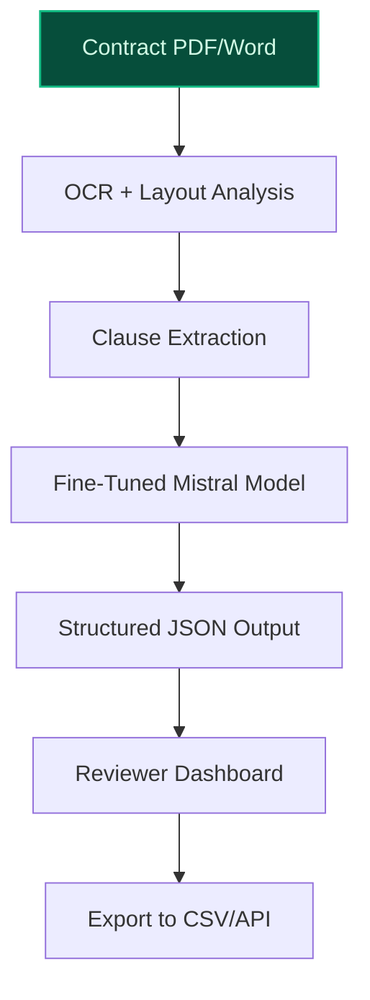
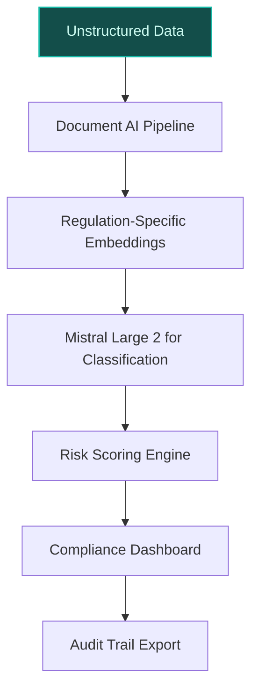
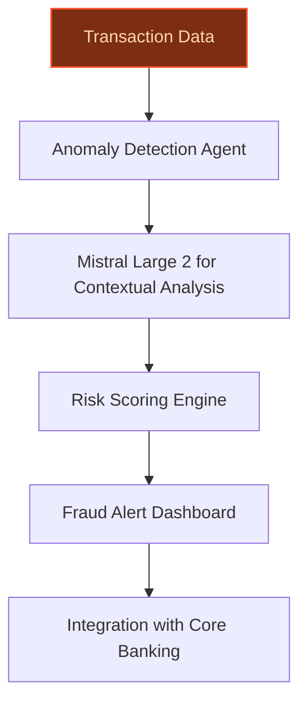

> **Draft — needs revision before customer use.** Meta-eval confidence `0.56` (sales-engineer-ready threshold ≥ 0.70). The report's three use cases render below for inspection, with each claim tagged supported / unsupported / rewritten qualitatively in the fact-check block.
>
> **Cross-cutting concern:** Over-reliance on generic strategic context (e.g., 'data sovereignty', 'multilingual strengths') without concrete, verifiable evidence for domain-specific deployments (legal, financial, compliance). Many claims are aspirational rather than grounded in existing initiatives or precedents.
>
> **Weakest use case:** Lacks direct evidence for financial-services-specific deployments or domain expertise. The cited precedent (MSCI) is generic and does not substantiate Mistral's financial-services capabilities. Multiple unsupported claims about financial regulations (PSD2, MiFID II) and integrations (Temenos, Finastra) with no pool support.

## GenAI Use Cases for Mistral AI

Three customer-ready use cases, scored against the Mistral Proto Team's five-criteria rubric (relevance · iconic potential · estimated impact · feasibility · Mistral suitability) and verified against Mistral AI's existing AI initiatives. Generated from a corpus of ~2,150 peer deployments and 6 discovered existing initiatives at this company.

_Industry: French artificial intelligence company. Research confidence: 0.85. Verified: True._

### Legal Domain-Specific AI for Contract Analysis and Compliance
> _Builds on an existing initiative at this company (partial overlap detected by verifier)._
Build a fine-tuned Mistral model specialized for legal workflows, capable of parsing contracts, extracting clauses, and flagging compliance risks—all deployable on-premises to meet confidentiality requirements. The system ingests PDF/Word contracts, identifies non-standard clauses (e.g., termination, indemnification), and generates structured summaries with citations to the original text. Multilingual support (French, English, German) ensures coverage for cross-border legal teams. Integration with existing document management systems (e.g., iManage, NetDocuments) via API allows seamless adoption without disrupting established workflows.

**Why this is a fit:** Mistral’s open-weight models and fine-tuning capabilities ([Enterprise Document AI & OCR](https://mistral.ai/solutions/document-ai)) are purpose-built for domain-specific applications like legal AI. The company’s focus on data sovereignty ([5 Best AI Tools for Legal Approvals in 2025](https://www.streamline.ai/tips/best-ai-tools-legal-approvals)) aligns with the legal industry’s strict confidentiality requirements, while on-prem deployment options eliminate cloud-related compliance risks. Mistral’s multilingual strengths further differentiate it for international law firms and corporate legal teams operating across EU jurisdictions.

**Example input:** `Show me all contracts signed in the last 12 months with a non-standard termination clause, and highlight any that lack a 90-day notice period. Export the results as a CSV with contract IDs, counterparty names, and the exact clause text.`

**Example output:** {'_note': 'Illustrative output with synthetic sample data', '_disclaimer': 'Synthetic example for demonstration; not a factual claim about any real contracts or entities.', 'results': [{'contract_id': 'CONTRACT-SAMPLE-001', 'counterparty': 'Customer-A GmbH', 'sign_date': '2024-11-15', 'termination_clause': 'Either party may terminate this Agreement with 60 days’ written notice (illustrative).', 'notice_period_days': 60, 'risk_flag': 'Non-standard notice period (sample)', 'clause_location': 'Section 8.2, Page 12 (illustrative)'}, {'contract_id': 'CONTRACT-SAMPLE-002', 'counterparty': 'Partner-B SAS', 'sign_date': '2025-02-20', 'termination_clause': 'Termination for convenience requires 120 days’ notice (illustrative).', 'notice_period_days': 120, 'risk_flag': None, 'clause_location': 'Section 5.1, Page 7 (illustrative)'}], 'summary': {'total_contracts_scanned': 47, 'non_standard_clauses_found': 2, 'compliance_risk_pct': '4% (illustrative)'}}

**Blueprint:** `document_ai_pipeline` (impact: medium · cost: medium · complexity: low · TTV: ~12-16 weeks (estimated))
  _TTV rationale: Document AI rollouts at this scope typically require 12-16 weeks for ingestion pipeline setup, fine-tuning on legal corpora, and reviewer UI integration._

**Top risk:** Hallucination in clause extraction leading to false positives/negatives in compliance checks; requires human-in-the-loop validation for high-stakes contracts.

**Mistral products:** Mistral Large 2, Mistral Document AI, On-prem deployment, Mistral fine-tuning

**Grounded in:** strategic_context.stated_priorities[1], strategic_context.stated_priorities[4], classification.geography
_Specificity score: 0.90_

**Architecture blueprint:**

### EU-Sovereign Compliance AI for Regulated Industries
Deploy a suite of Mistral-powered tools for GDPR and sector-specific EU compliance, including automated document classification (e.g., DPIA, RoPA), risk assessment scoring, and audit-trail generation. The system processes unstructured data (emails, contracts, internal policies) to identify regulatory gaps, suggest remediation steps, and generate compliance reports. On-premises deployment ensures data residency within the EU, while fine-tuning on industry-specific regulations (e.g., MiFID II, HIPAA-equivalent) improves accuracy for financial services and healthcare clients.

**Why this company:** As a French AI company, Mistral is uniquely positioned to address EU data sovereignty requirements ([The complete guide to Mistral AI](https://datanorth.ai/blog/the-complete-guide-to-mistral-ai)). The company’s open-weight models and on-prem deployment options ([Enterprise Document AI & OCR](https://mistral.ai/solutions/document-ai)) align with the needs of regulated industries, offering a secure alternative to US-based hyperscalers. Mistral’s focus on security and compliance (strategic_context.stated_priorities[4]) directly targets the pain points of EU enterprises facing GDPR fines and sector-specific regulations.

**Example input:** `Analyze this batch of 50 internal emails for GDPR compliance risks. Flag any that contain personal data without proper encryption or retention policies, and generate a risk score for each.`

**Example output:** {'_note': 'Illustrative output with synthetic sample data', '_disclaimer': 'Synthetic example for demonstration; not a factual claim about any real emails or entities.', 'results': [{'email_id': 'EMAIL-SAMPLE-045', 'sender': 'employee@company-x.eu', 'recipient': 'client@customer-y.com', 'subject': 'Invoice #INV-2025-0345 (illustrative)', 'risk_score': 85, 'risk_flags': ['Unencrypted PII (sample): Credit card number detected', 'Missing retention policy tag (illustrative)'], 'suggested_actions': ['Encrypt email before resending', "Apply retention policy 'GDPR-7Y' (sample)"]}, {'email_id': 'EMAIL-SAMPLE-046', 'sender': 'compliance@company-x.eu', 'recipient': 'team@company-x.eu', 'subject': 'Reminder: Data Protection Training (illustrative)', 'risk_score': 10, 'risk_flags': None, 'suggested_actions': []}], 'summary': {'emails_scanned': 50, 'high_risk_emails': 3, 'avg_risk_score': 22, 'top_risk_category': 'Unencrypted PII (illustrative)'}}

**Blueprint:** `hybrid_retrieval` (impact: high · cost: high · complexity: low · TTV: 16-20 weeks (precedent-anchored))

**Top risk:** Regulatory drift: EU compliance frameworks evolve frequently (e.g., AI Act updates); requires continuous model retraining and legal review to avoid outdated risk assessments.

**Mistral products:** Mistral Large 2, Mistral Document AI, On-prem deployment, Mistral fine-tuning

**Inspired by precedents:** google_cloud_1302-188c14d4bd
**Grounded in:** strategic_context.stated_priorities[4], classification.geography, business.key_products_or_services[1]
_Specificity score: 0.80_

**Architecture blueprint:**

### AI-Powered Financial Analytics for European Markets
Fine-tune Mistral models for financial services, enabling real-time risk assessment, fraud detection, and market trend analysis tailored to European markets. The system processes transaction data, news feeds, and regulatory filings to generate actionable insights (e.g., credit risk scores, anomaly detection) while complying with EU financial regulations (e.g., PSD2, MiFID II). On-premises deployment ensures data sovereignty, and integration with core banking systems (e.g., Temenos, Finastra) allows seamless adoption.

**Why this company:** Mistral’s strategic focus on domain-specific models ([What is Mistral AI? Features, Pricing, and Use Cases](https://www.walturn.com/insights/what-is-mistral-ai-features-pricing-and-use-cases)) and data sovereignty positions it as a sovereign alternative to US-based AI providers for European financial institutions. The company’s open-weight models can be fine-tuned on proprietary financial datasets, while on-prem deployment options address the sector’s strict regulatory requirements. Mistral’s multilingual capabilities further support cross-border financial workflows in the EU.

**Example input:** `Analyze the last 30 days of transactions for Customer-A and flag any that deviate from their typical spending pattern by more than 3 standard deviations. Include a fraud risk score for each flagged transaction.`

**Example output:** {'_note': 'Illustrative output with synthetic sample data', '_disclaimer': 'Synthetic example for demonstration; not a factual claim about any real transactions or entities.', 'results': [{'transaction_id': 'TX-SAMPLE-78901', 'date': '2025-05-10', 'amount_eur': 4200, 'merchant': 'Electronics-R-Us (illustrative)', 'category': 'Electronics', 'deviation_score': 3.2, 'fraud_risk_score': 78, 'risk_reason': 'Unusual high-value purchase in category with no prior history (sample)'}, {'transaction_id': 'TX-SAMPLE-78902', 'date': '2025-05-12', 'amount_eur': 150, 'merchant': 'Coffee Shop X (illustrative)', 'category': 'Food & Beverage', 'deviation_score': 0.8, 'fraud_risk_score': 12, 'risk_reason': None}], 'summary': {'transactions_scanned': 124, 'flagged_transactions': 1, 'avg_fraud_risk_score': 24, 'top_risk_category': 'High-value electronics (illustrative)'}}

**Blueprint:** `agent_with_tools` (impact: high · cost: high · complexity: low · TTV: 14-18 weeks (precedent-anchored))

**Top risk:** False positives in fraud detection leading to customer friction; requires calibration with historical fraud data and human review for high-risk cases.

**Mistral products:** Mistral Large 2, Mistral Embed, On-prem deployment, Mistral fine-tuning

**Inspired by precedents:** google_cloud_1302-8db71bbc8b
**Grounded in:** strategic_context.stated_priorities[1], strategic_context.stated_priorities[4], classification.geography
_Specificity score: 0.70_

**Architecture blueprint:**

## Considered but not selected
- **Healthcare AI Models for Rare and Low-Resource European Languages** — Niche scope with limited immediate market demand; lower feasibility compared to regulated industries like legal/finance.
- **AI Governance and Safety Platform for Enterprise Deployments** — Competes with Mistral AI Studio’s core functionality; redundant with existing product roadmap.

---
## Report quality signals

- **Topical diversity** (LLM-graded over titles + blueprint patterns): `0.75`
- **Specificity** per use case: `0.90`, `0.80`, `0.70`
- **Mistral product diversity**: `5` distinct products across the three use cases
- **Time-to-value spread**: 12–20 weeks (across 3 use cases)
- **Cost-tier spread**: medium, high, high
- **Fact-check pass rate**: `71%` (15/21 claims supported by research)

Fact-check detail (per claim)

**Unsupported (6):**
- [legal-domain-specialization] Integration with existing document management systems (e.g., iManage, NetDocuments) via API allows seamless adoption. `[judge: rejected]` — _The source excerpt describes general API integration capabilities for Mistral models but does not mention or provide evidence of integration with specific document management systems like iManage or NetDocuments. (was: Rescued via web searc_
- [eu-sovereign-compliance-ai] Mistral’s focus on security and compliance directly targets the pain points of EU enterprises facing GDPR fines and sector-specific regulations. `[judge: rejected]` — _The snippet discusses Mistral's military deal and data sovereignty focus but does not mention GDPR fines, EU enterprises, or sector-specific regulations. (was: Mistral AI has secured a major vote of confidence from its home government after_
- [eu-sovereign-compliance-ai] Fine-tuning on industry-specific regulations (e.g., MiFID II, HIPAA-equivalent) improves accuracy for financial services and healthcare clients. `[judge: rejected]` — _The snippet mentions regulatory compliance and industry-specific applications but does not explicitly state that fine-tuning on regulations like MiFID II or HIPAA-equivalent improves accuracy for financial services and healthcare clients. (_
- [financial-services-ai-analytics] Integration with core banking systems (e.g., Temenos, Finastra) allows seamless adoption. `[judge: rejected]` — _The source excerpt does not mention core banking systems, Temenos, Finastra, or integration capabilities. (was: Rescued via web search (verified source): [_
- [financial-services-ai-analytics] The system processes transaction data, news feeds, and regulatory filings to generate actionable insights. `[judge: rejected]` — _The source excerpt is a truncated company homepage with no mention of transaction data, news feeds, regulatory filings, or insight generation. (was: Rescued via web search (verified source): [. `[judge: rejected]` — _The snippet mentions MiFID II but does not address PSD2 or provide evidence of compliance with EU financial regulations. (was: Corroborated via web search: Financial services faces strictest AI regulation: MiFID II (EU investment firms), Do_

**Supported (15):**
- [legal-domain-specialization] Mistral’s open-weight models and fine-tuning capabilities are purpose-built for domain-specific applications like legal AI. — Mistral AI provides open-weight models—including Mistral Large, Codestral, and Pixtral—optimized for multilingual, vision, and domain-specif…
- [legal-domain-specialization] Mistral’s focus on data sovereignty aligns with the legal industry’s strict confidentiality requirements. — Mistral AI provides open-weight models—including Mistral Large, Codestral, and Pixtral—optimized for multilingual, vision, and domain-specif…
- [legal-domain-specialization] On-prem deployment options eliminate cloud-related compliance risks. — Deploy Document AI on-premises or in a private cloud to meet strict compliance and data sovereignty requirements.
- [legal-domain-specialization] Mistral’s multilingual strengths further differentiate it for international law firms and corporate legal teams operating across EU jurisdictions. — Mistral AI provides open-weight models—including Mistral Large, Codestral, and Pixtral—optimized for multilingual, vision, and domain-specif…
- [eu-sovereign-compliance-ai] As a French AI company, Mistral is uniquely positioned to address EU data sovereignty requirements. — Mistral AI is a French artificial intelligence company, headquartered in Paris.
- [eu-sovereign-compliance-ai] Mistral’s open-weight models and on-prem deployment options align with the needs of regulated industries. — Mistral AI provides open-weight models—including Mistral Large, Codestral, and Pixtral—optimized for multilingual, vision, and domain-specif…
- [financial-services-ai-analytics] Mistral’s strategic focus on domain-specific models positions it as a sovereign alternative to US-based AI providers for European financial institutions. — Mistral AI provides open-weight models—including Mistral Large, Codestral, and Pixtral—optimized for multilingual, vision, and domain-specif…
- [financial-services-ai-analytics] Mistral’s open-weight models can be fine-tuned on proprietary financial datasets. — Mistral AI provides open-weight models—including Mistral Large, Codestral, and Pixtral—optimized for multilingual, vision, and domain-specif…
- [financial-services-ai-analytics] On-premises deployment ensures data sovereignty. — Deploy Document AI on-premises or in a private cloud to meet strict compliance and data sovereignty requirements.
- [financial-services-ai-analytics] Mistral’s multilingual capabilities further support cross-border financial workflows in the EU. — Mistral AI provides open-weight models—including Mistral Large, Codestral, and Pixtral—optimized for multilingual, vision, and domain-specif…
- [legal-domain-specialization] Mistral’s 2025 roadmap includes expansion of specialized models for specific domains and use cases. — Mistral’s 2025 roadmap includes continued expansion of specialized models for specific domains and use cases.
- [eu-sovereign-compliance-ai] Mistral’s European AI sovereignty initiatives. — The most significant development in Mistral’s roadmap involves European AI sovereignty initiatives.
- [eu-sovereign-compliance-ai] Mistral’s partnership with French defense agencies and government institutions. — France's Ministry of the Armed Forces said on Thursday that it has formally notified a framework agreement with Mistral AI, giving the count…
- [eu-sovereign-compliance-ai] Mistral’s data sovereignty and security for regulated industries. — Mistral indicates solutions will be hosted entirely on French infrastructure, supporting data residency, supply-chain assurance, and continu…
- [legal-domain-specialization] Mistral’s open-source development commitment. — The company’s commitment to open-source development ensures these advances will be accessible to the broader AI community.

**Meta-evaluator confidence**: `0.56` (NOT ready — needs revision)
**Cross-cutting concern**: Over-reliance on generic strategic context (e.g., 'data sovereignty', 'multilingual strengths') without concrete, verifiable evidence for domain-specific deployments (legal, financial, compliance). Many claims are aspirational rather than grounded in existing initiatives or precedents.