# Pipeline blueprint (architecture)

Static view of the pipeline regardless of run timing — shows agents,
models, and gates. The chronological execution log follows below.

```mermaid
flowchart TD
    Start([User: company name]) --> R
    R["<b>1. Research</b><br/>parallel: Wikipedia · Tavily news ·<br/>existing initiatives · live verification<br/><i>mistral-medium</i> synthesis"]
    R --> G["<b>1b. Gap-fill</b><br/>identify missing fields →<br/><i>mistral-small</i> generates queries →<br/>Tavily search per field →<br/><i>mistral-small</i> per-field extraction"]
    G --> Conf{Confidence ≥ 0.5<br/>OR verified<br/>OR ≥ 1 existing initiative?}
    Conf -->|no| Refuse([Refusal])
    Conf -->|yes| Ret
    Ret["<b>2. Retrieve</b><br/><i>mistral-embed</i> on company query →<br/>cosine top-K + industry/depth filter +<br/>MMR diversification"]
    Ret --> Gen["<b>3. Generate 12 candidates</b><br/><i>mistral-medium</i> with web_search tool<br/>(Tavily + deep-read) — fact citations<br/>flow into the EvidenceLedger"]
    Gen --> Score["<b>4. Score</b><br/>self-consistency: 2 parallel passes<br/><i>mistral-small</i> @ T=0.2 and T=0.4 →<br/>aggregate weighted scores"]
    Score --> Verify["<b>5. Per-candidate verify</b><br/>top-3: Tavily search + deep-read +<br/><i>mistral-small</i> verdict (pass /<br/>partial / confirmed_existing)"]
    Verify --> Enrich["<b>6. Enrich</b><br/><i>mistral-large</i> drafts customer-facing<br/>prose for 3 use cases (or<br/><i>mistral-medium</i> on fast tier)"]
    Enrich --> NumScrub["<b>6a. Numeric scrub</b><br/>flag any number not in cited content"]
    NumScrub --> Polish["<b>6b. Polish</b><br/><i>mistral-small</i> per use case (parallel):<br/>convert markers→qualitative,<br/>(ev-XXX)→[title](url)"]
    Polish --> Attr["<b>6c. Attribution check</b><br/><i>mistral-small</i> per use case (parallel):<br/>fix corpus-ID ↔ company mismatches"]
    Attr --> Meta["<b>7. Meta-evaluation</b><br/><i>mistral-medium</i> reviews report against<br/>cited precedents + ledger entries:<br/>strict claim verification"]
    Meta --> RegenQ{confidence < 0.6<br/>AND not fast tier?}
    RegenQ -->|yes| Regen["<b>7b. Targeted regen</b><br/><i>mistral-large</i> re-enriches just the<br/>weakest use case with the next-best<br/>near-miss; re-runs meta-eval"]
    RegenQ -->|no| QS
    Regen --> QS
    QS["<b>Quality signals</b><br/>LLM-graded diversity + specificity,<br/>fact-check pass rate, TTV/cost spread"]
    QS --> Render([Markdown report + trace])

    classDef agent fill:#fef3c7,stroke:#f59e0b
    classDef gate fill:#dbeafe,stroke:#3b82f6
    classDef io fill:#dcfce7,stroke:#16a34a
    class R,G,Ret,Gen,Score,Verify,Enrich,NumScrub,Polish,Attr,Meta,Regen,QS agent
    class Conf,RegenQ gate
    class Start,Refuse,Render io
```

## Execution trace — Mistral AI

Started: `2026-05-09T19:00:17.091820+00:00`. Total wall time: `182.4s` across `46` recorded actions.

### Per-step time totals

| Step | Calls | Total time | Avg time |
|---|---:|---:|---:|
| `research` | 1 | 8.71s | 8713ms |
| `gap_fill` | 4 | 2.98s | 745ms |
| `retrieve` | 2 | 0.53s | 267ms |
| `generate` | 2 | 35.73s | 17867ms |
| `generate.web_search` | 2 | 4.74s | 2370ms |
| `score` | 2 | 38.52s | 19262ms |
| `verify` | 6 | 18.37s | 3061ms |
| `enrich` | 1 | 62.70s | 62696ms |
| `meta_eval` | 1 | 13.31s | 13313ms |
| `web_verify` | 1 | 3.88s | 3875ms |
| `source_judge` | 22 | 28.54s | 1297ms |
| `quality_signals` | 2 | 5.42s | 2709ms |

### Chronological event log

- `19:00:20.110` **[research]** `mistral-medium-2604.chat.complete` — 8713ms
   - inputs: synthesize CompanyContext for Mistral AI | depth=medium
   - outputs: industry='French artificial intelligence company' verified=True conf=0.75
- `19:00:28.825` **[gap_fill]** `mistral-small-2603.chat.complete` — 879ms
   - inputs: generate gap queries | fields=['business_model', 'products', 'data_assets', 'priorities']
   - outputs: queries=4
- `19:00:36.415` **[gap_fill]** `mistral-small-2603.chat.complete` — 755ms
   - inputs: layer-2 extract field=priorities
   - outputs: items=6
- `19:00:36.420` **[gap_fill]** `mistral-small-2603.chat.complete` — 525ms
   - inputs: layer-2 extract field=data_assets
   - outputs: items=0
- `19:00:36.422` **[gap_fill]** `mistral-small-2603.chat.complete` — 822ms
   - inputs: layer-2 extract field=products
   - outputs: items=6
- `19:00:37.246` **[retrieve]** `mistral-embed.embeddings.create` — 189ms
   - inputs: company_query | industries='French artificial intelligence company'
   - outputs: embedded 1024-dim query vector
- `19:00:37.435` **[retrieve]** `precedent_corpus.cosine_topk` — 344ms
   - inputs: k=8 min_depth=0.4 target='Mistral AI'
   - outputs: retrieved 8 | mmr=True | top_sim=0.786
- `19:00:38.653` **[generate]** `mistral-medium-2604.chat.complete` — 1727ms
   - inputs: iteration=0 tool_calls_used=0/2 tools=on
   - outputs: tool_calls=4 | content_chars=0
- `19:00:40.401` **[generate.web_search]** `tavily.search` — 2010ms
   - inputs: query='Mistral AI 2025 roadmap specialized models domains'
   - outputs: 2 raw results
- `19:00:42.969` **[generate.web_search]** `tavily.search` — 2729ms
   - inputs: query='Mistral AI partnerships French defense agencies government'
   - outputs: 2 raw results
- `19:00:46.663` **[generate]** `mistral-medium-2604.chat.complete` — 34007ms
   - inputs: iteration=1 tool_calls_used=2/2 tools=off
   - outputs: tool_calls=0 | content_chars=22994
- `19:01:21.057` **[score]** `mistral-small-2603.chat.complete` — 20516ms
   - inputs: self-consistency pass T=0.2
   - outputs: scored 12 candidates
- `19:01:21.062` **[score]** `mistral-small-2603.chat.complete` — 18009ms
   - inputs: self-consistency pass T=0.4
   - outputs: scored 12 candidates
- `19:01:41.607` **[verify]** `tavily.search` — 2053ms
   - inputs: candidate=defense-domain-fine-tuning | query='Mistral AI Defense-Specific Domain Fine-Tuning for French Mi'
   - outputs: 4 results
- `19:01:41.608` **[verify]** `tavily.search` — 1930ms
   - inputs: candidate=open-source-model-marketplace | query='Mistral AI Open-Source Model Marketplace for Domain-Specific'
   - outputs: 4 results
- `19:01:41.608` **[verify]** `tavily.search` — 2435ms
   - inputs: candidate=legal-domain-specialization | query='Mistral AI Legal Domain-Specific AI for Contract Analysis an'
   - outputs: 4 results
- `19:01:44.242` **[verify]** `mistral-small-2603.chat.complete` — 4341ms
   - inputs: verdict for open-source-model-marketplace
   - outputs: verdict='confirmed_existing'
- `19:01:44.321` **[verify]** `mistral-small-2603.chat.complete` — 3547ms
   - inputs: verdict for legal-domain-specialization
   - outputs: verdict='partial_overlap'
- `19:01:45.046` **[verify]** `mistral-small-2603.chat.complete` — 4059ms
   - inputs: verdict for defense-domain-fine-tuning
   - outputs: verdict='confirmed_existing'
- `19:01:49.109` **[enrich]** `mistral-large-2512.chat.complete` — 62696ms
   - inputs: tier=standard top_3=['legal-domain-specialization', 'eu-sovereign-compliance-ai', 'financial-services-ai-analytics']
   - outputs: enriched 3 use cases
- `19:02:51.828` **[meta_eval]** `mistral-medium-2604.chat.complete` — 13313ms
   - inputs: reviewing 3 use cases
   - outputs: review + claims
- `19:03:05.161` **[web_verify]** `tavily.search.rescue_unsupported_claims` — 3875ms
   - inputs: company='Mistral AI' unsupported=5 budget=12
   - outputs: rescued: verified=4 corroborated=1 of 5 attempted
- `19:03:09.039` **[source_judge]** `mistral-small-2603.judge_claim_sources` — 4290ms
   - inputs: pairs=21
   - outputs: judged 21 pairs
- `19:03:09.039` **[source_judge]** `mistral-small-2603.chat.complete` — 1001ms
   - inputs: claim='Mistral’s open-weight models and fine-tuning capabilities ar'
   - outputs: verdict=supported
- `19:03:09.048` **[source_judge]** `mistral-small-2603.chat.complete` — 950ms
   - inputs: claim='Mistral’s focus on data sovereignty aligns with the legal in'
   - outputs: verdict=supported
- `19:03:09.052` **[source_judge]** `mistral-small-2603.chat.complete` — 1147ms
   - inputs: claim='On-prem deployment options eliminate cloud-related complianc'
   - outputs: verdict=supported
- `19:03:09.056` **[source_judge]** `mistral-small-2603.chat.complete` — 1001ms
   - inputs: claim='Mistral’s multilingual strengths further differentiate it fo'
   - outputs: verdict=supported
- `19:03:09.060` **[source_judge]** `mistral-small-2603.chat.complete` — 4269ms
   - inputs: claim='Integration with existing document management systems (e.g.,'
   - outputs: verdict=unsupported
- `19:03:09.064` **[source_judge]** `mistral-small-2603.chat.complete` — 933ms
   - inputs: claim='As a French AI company, Mistral is uniquely positioned to ad'
   - outputs: verdict=supported
- `19:03:09.068` **[source_judge]** `mistral-small-2603.chat.complete` — 930ms
   - inputs: claim='Mistral’s open-weight models and on-prem deployment options '
   - outputs: verdict=supported
- `19:03:09.071` **[source_judge]** `mistral-small-2603.chat.complete` — 940ms
   - inputs: claim='Mistral’s focus on security and compliance directly targets '
   - outputs: verdict=unsupported
- `19:03:09.998` **[source_judge]** `mistral-small-2603.chat.complete` — 1172ms
   - inputs: claim='Fine-tuning on industry-specific regulations (e.g., MiFID II'
   - outputs: verdict=unsupported
- `19:03:10.004` **[source_judge]** `mistral-small-2603.chat.complete` — 1152ms
   - inputs: claim='Mistral’s strategic focus on domain-specific models position'
   - outputs: verdict=supported
- `19:03:10.007` **[source_judge]** `mistral-small-2603.chat.complete` — 1104ms
   - inputs: claim='Mistral’s open-weight models can be fine-tuned on proprietar'
   - outputs: verdict=supported
- `19:03:10.011` **[source_judge]** `mistral-small-2603.chat.complete` — 1279ms
   - inputs: claim='On-premises deployment ensures data sovereignty.'
   - outputs: verdict=supported
- `19:03:10.041` **[source_judge]** `mistral-small-2603.chat.complete` — 1078ms
   - inputs: claim='Integration with core banking systems (e.g., Temenos, Finast'
   - outputs: verdict=unsupported
- `19:03:10.057` **[source_judge]** `mistral-small-2603.chat.complete` — 1126ms
   - inputs: claim='The system processes transaction data, news feeds, and regul'
   - outputs: verdict=unsupported
- `19:03:10.199` **[source_judge]** `mistral-small-2603.chat.complete` — 926ms
   - inputs: claim='Complying with EU financial regulations (e.g., PSD2, MiFID I'
   - outputs: verdict=unsupported
- `19:03:11.111` **[source_judge]** `mistral-small-2603.chat.complete` — 1189ms
   - inputs: claim='Mistral’s multilingual capabilities further support cross-bo'
   - outputs: verdict=supported
- `19:03:11.119` **[source_judge]** `mistral-small-2603.chat.complete` — 676ms
   - inputs: claim='Mistral’s 2025 roadmap includes expansion of specialized mod'
   - outputs: verdict=supported
- `19:03:11.125` **[source_judge]** `mistral-small-2603.chat.complete` — 701ms
   - inputs: claim='Mistral’s European AI sovereignty initiatives.'
   - outputs: verdict=supported
- `19:03:11.156` **[source_judge]** `mistral-small-2603.chat.complete` — 765ms
   - inputs: claim='Mistral’s partnership with French defense agencies and gover'
   - outputs: verdict=supported
- `19:03:11.170` **[source_judge]** `mistral-small-2603.chat.complete` — 1232ms
   - inputs: claim='Mistral’s data sovereignty and security for regulated indust'
   - outputs: verdict=supported
- `19:03:11.183` **[source_judge]** `mistral-small-2603.chat.complete` — 683ms
   - inputs: claim='Mistral’s open-source development commitment.'
   - outputs: verdict=supported
- `19:03:14.069` **[quality_signals]** `mistral-small-2603.chat.complete` — 3903ms
   - inputs: specificity grade (3 use cases)
   - outputs: scored 3 use cases
- `19:03:17.972` **[quality_signals]** `mistral-small-2603.chat.complete` — 1515ms
   - inputs: diversity grade
   - outputs: diversity=0.75

## Mermaid sequence diagram (execution)

```mermaid
sequenceDiagram
    autonumber
    participant pipeline as pipeline
    participant mistral_medium_2604 as mistral-medium-2604
    participant mistral_small_2603 as mistral-small-2603
    participant mistral_embed as mistral-embed
    participant precedent_corpus as precedent_corpus
    participant tavily as tavily
    participant mistral_large_2512 as mistral-large-2512
    participant tavily_search as tavily.search
    pipeline->>mistral_medium_2604: research: chat.complete (8713ms)
    mistral_medium_2604-->>pipeline: industry='French artificial intelligence company' verified=T
    pipeline->>mistral_small_2603: gap_fill: chat.complete (879ms)
    mistral_small_2603-->>pipeline: queries=4
    pipeline->>mistral_small_2603: gap_fill: chat.complete (755ms)
    mistral_small_2603-->>pipeline: items=6
    pipeline->>mistral_small_2603: gap_fill: chat.complete (525ms)
    mistral_small_2603-->>pipeline: items=0
    pipeline->>mistral_small_2603: gap_fill: chat.complete (822ms)
    mistral_small_2603-->>pipeline: items=6
    pipeline->>mistral_embed: retrieve: embeddings.create (189ms)
    mistral_embed-->>pipeline: embedded 1024-dim query vector
    pipeline->>precedent_corpus: retrieve: cosine_topk (344ms)
    precedent_corpus-->>pipeline: retrieved 8 | mmr=True | top_sim=0.786
    pipeline->>mistral_medium_2604: generate: chat.complete (1727ms)
    mistral_medium_2604-->>pipeline: tool_calls=4 | content_chars=0
    pipeline->>tavily: generate.web_search: search (2010ms)
    tavily-->>pipeline: 2 raw results
    pipeline->>tavily: generate.web_search: search (2729ms)
    tavily-->>pipeline: 2 raw results
    pipeline->>mistral_medium_2604: generate: chat.complete (34007ms)
    mistral_medium_2604-->>pipeline: tool_calls=0 | content_chars=22994
    pipeline->>mistral_small_2603: score: chat.complete (20516ms)
    mistral_small_2603-->>pipeline: scored 12 candidates
    pipeline->>mistral_small_2603: score: chat.complete (18009ms)
    mistral_small_2603-->>pipeline: scored 12 candidates
    pipeline->>tavily: verify: search (2053ms)
    tavily-->>pipeline: 4 results
    pipeline->>tavily: verify: search (1930ms)
    tavily-->>pipeline: 4 results
    pipeline->>tavily: verify: search (2435ms)
    tavily-->>pipeline: 4 results
    pipeline->>mistral_small_2603: verify: chat.complete (4341ms)
    mistral_small_2603-->>pipeline: verdict='confirmed_existing'
    pipeline->>mistral_small_2603: verify: chat.complete (3547ms)
    mistral_small_2603-->>pipeline: verdict='partial_overlap'
    pipeline->>mistral_small_2603: verify: chat.complete (4059ms)
    mistral_small_2603-->>pipeline: verdict='confirmed_existing'
    pipeline->>mistral_large_2512: enrich: chat.complete (62696ms)
    mistral_large_2512-->>pipeline: enriched 3 use cases
    pipeline->>mistral_medium_2604: meta_eval: chat.complete (13313ms)
    mistral_medium_2604-->>pipeline: review + claims
    pipeline->>tavily_search: web_verify: rescue_unsupported_claims (3875ms)
    tavily_search-->>pipeline: rescued: verified=4 corroborated=1 of 5 attempted
    pipeline->>mistral_small_2603: source_judge: judge_claim_sources (4290ms)
    mistral_small_2603-->>pipeline: judged 21 pairs
    pipeline->>mistral_small_2603: source_judge: chat.complete (1001ms)
    mistral_small_2603-->>pipeline: verdict=supported
    pipeline->>mistral_small_2603: source_judge: chat.complete (950ms)
    mistral_small_2603-->>pipeline: verdict=supported
    pipeline->>mistral_small_2603: source_judge: chat.complete (1147ms)
    mistral_small_2603-->>pipeline: verdict=supported
    pipeline->>mistral_small_2603: source_judge: chat.complete (1001ms)
    mistral_small_2603-->>pipeline: verdict=supported
    pipeline->>mistral_small_2603: source_judge: chat.complete (4269ms)
    mistral_small_2603-->>pipeline: verdict=unsupported
    pipeline->>mistral_small_2603: source_judge: chat.complete (933ms)
    mistral_small_2603-->>pipeline: verdict=supported
    pipeline->>mistral_small_2603: source_judge: chat.complete (930ms)
    mistral_small_2603-->>pipeline: verdict=supported
    pipeline->>mistral_small_2603: source_judge: chat.complete (940ms)
    mistral_small_2603-->>pipeline: verdict=unsupported
    pipeline->>mistral_small_2603: source_judge: chat.complete (1172ms)
    mistral_small_2603-->>pipeline: verdict=unsupported
    pipeline->>mistral_small_2603: source_judge: chat.complete (1152ms)
    mistral_small_2603-->>pipeline: verdict=supported
    pipeline->>mistral_small_2603: source_judge: chat.complete (1104ms)
    mistral_small_2603-->>pipeline: verdict=supported
    pipeline->>mistral_small_2603: source_judge: chat.complete (1279ms)
    mistral_small_2603-->>pipeline: verdict=supported
    pipeline->>mistral_small_2603: source_judge: chat.complete (1078ms)
    mistral_small_2603-->>pipeline: verdict=unsupported
    pipeline->>mistral_small_2603: source_judge: chat.complete (1126ms)
    mistral_small_2603-->>pipeline: verdict=unsupported
    pipeline->>mistral_small_2603: source_judge: chat.complete (926ms)
    mistral_small_2603-->>pipeline: verdict=unsupported
    pipeline->>mistral_small_2603: source_judge: chat.complete (1189ms)
    mistral_small_2603-->>pipeline: verdict=supported
    pipeline->>mistral_small_2603: source_judge: chat.complete (676ms)
    mistral_small_2603-->>pipeline: verdict=supported
    pipeline->>mistral_small_2603: source_judge: chat.complete (701ms)
    mistral_small_2603-->>pipeline: verdict=supported
    pipeline->>mistral_small_2603: source_judge: chat.complete (765ms)
    mistral_small_2603-->>pipeline: verdict=supported
    pipeline->>mistral_small_2603: source_judge: chat.complete (1232ms)
    mistral_small_2603-->>pipeline: verdict=supported
    pipeline->>mistral_small_2603: source_judge: chat.complete (683ms)
    mistral_small_2603-->>pipeline: verdict=supported
    pipeline->>mistral_small_2603: quality_signals: chat.complete (3903ms)
    mistral_small_2603-->>pipeline: scored 3 use cases
    pipeline->>mistral_small_2603: quality_signals: chat.complete (1515ms)
    mistral_small_2603-->>pipeline: diversity=0.75
```

