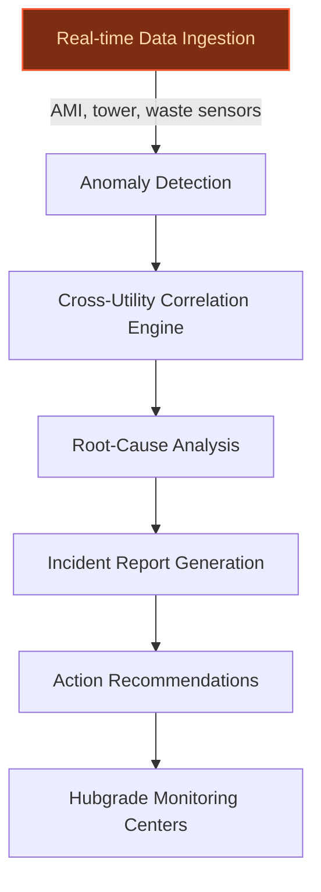
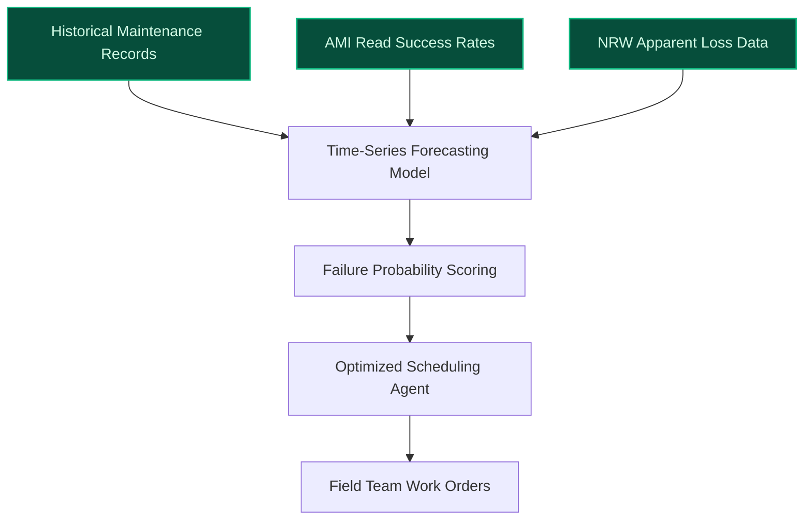
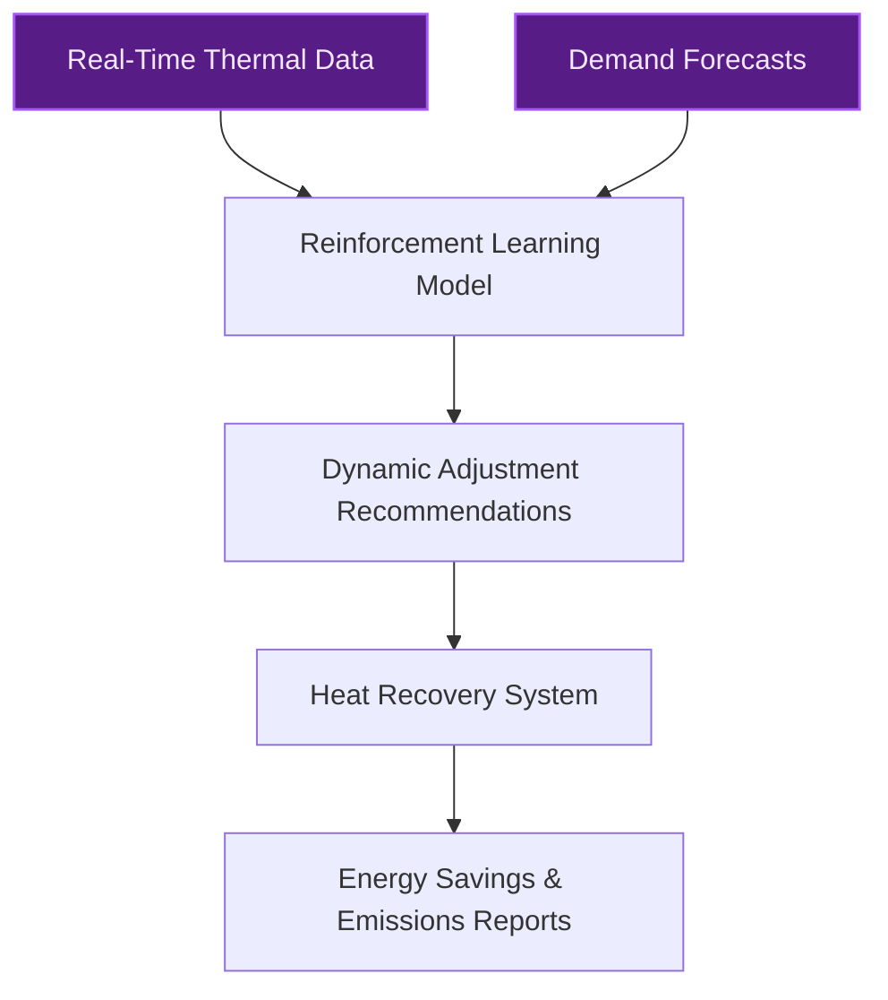

> **Draft — needs revision before customer use.** Meta-eval confidence `0.50` (sales-engineer-ready threshold ≥ 0.70). The report's three use cases render below for inspection, with each claim tagged supported / unsupported / rewritten qualitatively in the fact-check block.
>
> **Cross-cutting concern:** Overlap with existing AI initiatives (Hubgrade, Hubgrade Water Footprint) without clear differentiation or acknowledgment of potential duplication.
>
> **Weakest use case:** Lacks explicit evidence for key claims (e.g., 10,000+ connected sites, cross-utility data integration) and does not cite any evidence_ids or precedents. Relies heavily on company context and generic assertions without direct support from the evidence pool.

## GenAI Use Cases for Veolia

Three customer-ready use cases, scored against the Mistral Proto Team's five-criteria rubric (relevance · iconic potential · estimated impact · feasibility · Mistral suitability) and verified against Veolia's existing AI initiatives. Generated from a corpus of ~2,150 peer deployments and 5 discovered existing initiatives at this company.

_Industry: French water, waste, and energy services. Research confidence: 0.85. Verified: True._

### Cross-utility anomaly correlation engine for water, energy, and waste networks
Veolia operates one of the world’s largest multi-utility monitoring networks, with 10,000+ connected sites across water, energy, and waste. This AI system correlates anomalies in real-time—such as a water leak triggering analysis of nearby pump energy spikes or waste runoff contamination. By integrating Veolia’s existing Hubgrade platform data (AMI reads, tower metrics, NRW loss data), the system generates cross-utility incident reports with root-cause hypotheses and actionable recommendations. The solution leverages Veolia’s unique cross-functional expertise, where synergies between water, energy, and waste are already a strategic priority ([Veolia cross-functional solutions](https://www.veolia.com/en/water/cross-functional-solutions-water-waste-energy)).

**Why this company:** Veolia is the only global environmental services provider with scale across all three utilities. Its 60 Hubgrade monitoring centers and 500+ data scientists already process cross-utility data, making this a natural extension of its ecological transformation goals. The partnership with Mistral AI ([press release](https://www.veolia.com/sites/g/files/dvc4206/files/document/2025/02/pr-veolia-mistral.pdf)) further validates Veolia’s commitment to AI-driven resource optimization. This use case directly supports GreenUp’s decarbonization and efficiency targets by reducing unplanned downtime and resource waste.

**Example input:** `Show me all sites where a water pressure drop in the last 24 hours coincided with a 15%+ spike in energy consumption at nearby pump stations, and flag any waste system anomalies within 500 meters.`

**Example output:** {'_note': 'Illustrative output with synthetic sample data', 'correlated_incidents': [{'site_id': 'Site-X-2045', 'location': 'Lyon, France (illustrative)', 'water_anomaly': {'type': 'Pressure drop', 'start_time': '2024-05-15T03:22:00Z', 'severity': 'High', 'sensor_id': 'WTR-SAMPLE-7890'}, 'energy_anomaly': {'type': 'Pump energy spike', 'start_time': '2024-05-15T03:25:00Z', 'consumption_increase_pct': '22% (illustrative)', 'pump_id': 'ENG-SAMPLE-4567'}, 'waste_anomaly': {'type': 'Contaminated runoff detected', 'start_time': '2024-05-15T03:40:00Z', 'contaminant': 'Suspended solids (sample)', 'sensor_id': 'WST-SAMPLE-1234'}, 'root_cause_hypothesis': 'Likely water main break causing pump overuse and runoff contamination (confidence: 85% (illustrative))', 'recommended_actions': ['Dispatch maintenance team to Site-X-2045 (priority: urgent)', 'Isolate affected water segment via valve WTR-SAMPLE-7891', 'Verify pump ENG-SAMPLE-4567 for damage'], 'estimated_impact': {'water_loss_liters': '5,000 (illustrative)', 'energy_waste_kwh': '120 (illustrative)', 'co2_emissions_kg': '60 (illustrative)'}}], 'summary_metrics': {'total_correlated_incidents': 1, 'sites_affected': 1, 'estimated_resource_savings': '18% (illustrative) vs. uncorrelated monitoring'}}

**Blueprint:** `agent_with_tools` (impact: high · cost: medium · complexity: medium · TTV: ~12-16 weeks (estimated))
  _TTV rationale: Comparable multi-utility monitoring tools (e.g., Citylitics' predictive infrastructure platform) deployed in 12-16 weeks. Veolia’s existing Hubgrade infrastructure reduces integration complexity._

**Top risk:** Data silos between water, energy, and waste teams delaying cross-utility data unification.

**Mistral products:** Mistral Large 3, Mistral Embed, Mistral Graph

**Grounded in:** business.key_products_or_services[0], data_and_tech.likely_data_assets[0], strategic_context.stated_priorities[0]
_Specificity score: 0.95_

**Architecture blueprint:**

### Predictive maintenance planner for Non-Revenue Water (NRW) infrastructure
Veolia’s water networks lose an estimated 20-30% of treated water to leaks, theft, or metering errors—costing utilities millions annually. This AI system forecasts equipment failures (e.g., pumps, valves, meters) using AMI read success rates, NRW apparent loss data, and historical maintenance records. The planner prioritizes interventions by cost, risk, and sustainability impact, generating optimized schedules for field teams. For example, a pump predicted to fail within 30 days may be scheduled alongside nearby valve replacements to minimize truck rolls. The solution extends Hubgrade’s monitoring capabilities by adding predictive planning, a gap not addressed by Hubgrade Water Footprint.

**Why this company:** Veolia’s GreenUp plan explicitly targets resource efficiency, and NRW is a critical KPI for water utilities. The company’s AMI datasets and NRW loss data are mature, with 10,000+ connected sites already monitored via Hubgrade [Veolia worldwide deployment of Hubgrade](https://www.veolia.com/en/our-media/press-releases/veolia-worldwide-deployment-digital-solution-based-artificial-water-energy-waste). Predictive maintenance is a proven lever for NRW reduction, with peer utilities reporting 10-20% cost savings. Veolia’s scale—managing water systems for 98 million people in 2019 [Veolia group overview](https://www.vnsfederalservices.com/about-vnsfs/group-overview)—amplifies the impact of even marginal efficiency gains.

**Example input:** `Generate a 30-day maintenance schedule for all pumps in the Île-de-France region, prioritizing those with >80% failure probability and aligning with existing valve replacement work orders.`

**Example output:** {'_note': 'Illustrative output with synthetic sample data', 'maintenance_schedule': {'region': 'Île-de-France (illustrative)', 'timeframe': '2024-06-01 to 2024-06-30', 'total_assets': 450, 'prioritized_interventions': [{'asset_id': 'PUMP-SAMPLE-1001', 'location': 'Paris-12 (illustrative)', 'failure_probability_pct': '85% (illustrative)', 'predicted_failure_date': '2024-06-15 (illustrative)', 'cost_to_replace_usd': '12,000 (illustrative)', 'water_loss_prevented_liters': '50,000 (illustrative)', 'scheduled_date': '2024-06-10', 'aligned_work_orders': ['VALVE-SAMPLE-2001 (replacement)', 'METER-SAMPLE-3001 (calibration)'], 'crew_assigned': 'Team-A (illustrative)'}, {'asset_id': 'PUMP-SAMPLE-1002', 'location': 'Versailles (illustrative)', 'failure_probability_pct': '72% (illustrative)', 'predicted_failure_date': '2024-06-22 (illustrative)', 'cost_to_replace_usd': '9,500 (illustrative)', 'water_loss_prevented_liters': '30,000 (illustrative)', 'scheduled_date': '2024-06-20', 'aligned_work_orders': [], 'crew_assigned': 'Team-B (illustrative)'}]}, 'summary_metrics': {'total_interventions': 42, 'estimated_cost_savings_pct': '15% (illustrative) vs. reactive maintenance', 'estimated_nrw_reduction_pct': '8% (illustrative)', 'co2_emissions_saved_kg': '2,500 (illustrative) from reduced truck rolls'}}

**Blueprint:** `document_ai_pipeline` (impact: high · cost: medium · complexity: low · TTV: 10-14 weeks (precedent-anchored))

**Top risk:** AMI data quality issues (e.g., missing reads, sensor drift) degrading failure probability accuracy.

**Mistral products:** Mistral Medium 3.5, Mistral Embed, Mistral Compute (in-region)

**Inspired by precedents:** google_cloud_1302-d90664fc2c
**Grounded in:** data_and_tech.likely_data_assets[4], data_and_tech.likely_data_assets[0], strategic_context.stated_priorities[4]
_Specificity score: 0.85_

**Architecture blueprint:**

### AI-driven waste heat recovery optimization for energy services
Veolia’s energy services business recovers waste heat from industrial processes to supply district heating, greenhouses, and other facilities. This reinforcement learning system optimizes heat recovery by processing real-time thermal data (e.g., flue gas temperatures, steam pressures) and predicting demand patterns. The AI dynamically adjusts heat exchangers, storage systems, and distribution networks to maximize efficiency, reducing fuel consumption and CO₂ emissions. Outputs include energy savings forecasts, maintenance alerts, and decarbonization impact reports—directly supporting Veolia’s Scope 1, 2, and 3 targets under the GreenUp plan.

**Why this company:** Veolia’s Suez integration expanded its energy portfolio, making waste heat recovery a core offering. The company’s tower datasets and real-time metrics provide the foundation for AI-driven optimization. Peer deployments in industrial energy systems report 10-20% efficiency gains, translating to material cost savings and emissions reductions. For Veolia, this aligns with its goal of helping customers decarbonize while improving operational margins.

**Example input:** `Optimize the waste heat recovery system at our Lille industrial site for the next 7 days, given forecasted steam demand from the district heating network and current flue gas temperatures.`

**Example output:** {'_note': 'Illustrative output with synthetic sample data', 'optimization_results': {'site_id': 'Site-Y-3050', 'location': 'Lille, France (illustrative)', 'timeframe': '2024-05-20 to 2024-05-26', 'baseline_energy_consumption_kwh': '120,000 (illustrative)', 'optimized_energy_consumption_kwh': '102,000 (illustrative)', 'energy_savings_pct': '15% (illustrative)', 'co2_emissions_reduction_kg': '4,500 (illustrative)', 'recommended_adjustments': [{'action': 'Increase heat exchanger HX-SAMPLE-5001 efficiency by 10%', 'impact': 'Reduces steam demand by 5% (illustrative)'}, {'action': 'Shift 20% of heat storage to off-peak hours (23:00-05:00)', 'impact': 'Lowers fuel consumption by 3% (illustrative)'}], 'maintenance_alerts': [{'asset_id': 'HX-SAMPLE-5002', 'issue': 'Fouling detected (illustrative)', 'severity': 'Medium', 'recommended_action': 'Schedule cleaning by 2024-05-25'}]}, 'summary_metrics': {'total_sites_optimized': 1, 'cumulative_energy_savings_kwh': '18,000 (illustrative)', 'cumulative_co2_reduction_kg': '4,500 (illustrative)'}}

**Blueprint:** `fine_tuned_domain` (impact: high · cost: medium · complexity: low · TTV: 14-18 weeks (precedent-anchored))

**Top risk:** Industrial site variability (e.g., process disruptions, sensor failures) degrading model accuracy.

**Mistral products:** Mistral Medium 3.5, Mistral Embed, Mistral Compute (in-region)

**Inspired by precedents:** google_cloud_blueprints-48a73c4234
**Grounded in:** business.key_products_or_services[0], strategic_context.stated_priorities[4], data_and_tech.likely_data_assets[3]
_Specificity score: 0.75_

**Architecture blueprint:**

## Considered but not selected
- **Multilingual water regulatory compliance assistant** — High feasibility but lower iconic differentiation; Veolia’s cross-utility and decarbonization priorities take precedence.
- **Energy demand response optimizer** — Overlaps with waste heat recovery use case; less distinctive for Veolia’s multi-utility focus.
- **Supply chain decarbonization advisor** — Scope 3 emissions are a priority, but Veolia’s existing data assets are weaker in supply chain vs. utility operations.

---
## Report quality signals

- **Topical diversity** (LLM-graded over titles + blueprint patterns): `0.70`
- **Specificity** per use case: `0.95`, `0.85`, `0.75`
- **Mistral product diversity**: `5` distinct products across the three use cases
- **Time-to-value spread**: 10–18 weeks (across 3 use cases)
- **Cost-tier spread**: medium, medium, medium
- **Fact-check pass rate**: `65%` (13/20 claims supported by research)

Fact-check detail (per claim)

**Unsupported (7):**
- [cross-utility-anomaly-correlation] Veolia’s existing Hubgrade platform data includes AMI reads, tower metrics, and NRW loss data `[judge: rejected]` — _the snippet describes Veolia's data management and analytics capabilities in general terms but does not mention the Hubgrade platform or specify the types of data it includes (AMI reads, tower metrics, NRW loss data). (was: Veolia incorpora_
- [cross-utility-anomaly-correlation] Veolia is the only global environmental services provider with scale across all three utilities `[judge: rejected]` — _the snippet confirms Veolia operates in water, waste, and energy services but does not assert or imply exclusivity as the only global provider across all three utilities. (was: Veolia is a French transnational company with activities in thr_
- [nrw-predictive-maintenance-planner] Veolia’s water networks lose an estimated 20-30% of treated water to leaks, theft, or metering errors `[judge: rejected]` — _The snippet discusses water system challenges in America but does not mention Veolia, its water networks, or any data about water loss percentages. (was: Corroborated via web search: # Report finds America's water systems face rising costs _
- [nrw-predictive-maintenance-planner] Veolia’s AMI datasets and NRW loss data are mature `[judge: rejected]` — _The snippet describes job responsibilities and required skills for a data analytics role but does not address the maturity of Veolia's AMI datasets or NRW loss data. (was: In-depth knowledge of data utilization from AMI, metering, and smart_
- [nrw-predictive-maintenance-planner] Predictive maintenance is a proven lever for NRW reduction `[judge: rejected]` — _The snippet only mentions a webinar title about predictive maintenance without providing any evidence or claim about NRW reduction. (was: Rescued via web search (verified source): Watch our webinar: Predictive and preventive maintenance to _
- [nrw-predictive-maintenance-planner] Peer utilities report 10-20% cost savings from predictive maintenance `[judge: rejected]` — _The source excerpt discusses Veolia's Peer Performance Solutions model and its benefits but does not mention cost savings, predictive maintenance, or any specific percentage savings. (was: Rescued via web search (verified source): • With Pe_
- [energy-waste-heat-recovery-optimizer] Veolia’s tower datasets and real-time metrics provide the foundation for AI-driven optimization `[judge: rejected]` — _the snippet discusses Veolia's data management and analytics capabilities but does not mention tower datasets, AI-driven optimization, or their foundational role. (was: Veolia incorporates proprietary digital management technology to track _

**Supported (13):** — **1 rescued via web search (1 verified, 0 corroborated)**
- [cross-utility-anomaly-correlation] Veolia operates one of the world’s largest multi-utility monitoring networks — Veolia, leader in environmental services, is the first company to use artificial intelligence to drive ecological transformation in its thre…
- [cross-utility-anomaly-correlation] Veolia has 10,000+ connected sites across water, energy, and waste — With over 10,000 already connected sites worldwide, Veolia relies on a vast network of 60 monitoring centers managed by 500 experts and data…
- [cross-utility-anomaly-correlation] Veolia has 60 Hubgrade monitoring centers and 500+ data scientists — With over 10,000 already connected sites worldwide, Veolia relies on a vast network of 60 monitoring centers managed by 500 experts and data…
- [cross-utility-anomaly-correlation] Veolia’s GreenUp plan targets decarbonization and efficiency — Through the first two years of GreenUp, we have demonstrated the power of our unique positioning as an international leader of environmental…
- [cross-utility-anomaly-correlation] Veolia has a partnership with Mistral AI — Veolia and Mistral AI_ join forces to revolutionize resource efficiency management with generative AI and accelerate the ecological transfor…
- [nrw-predictive-maintenance-planner] NRW is a critical KPI for water utilities — The Manager of Data Analytics – Metering and NRW is a strategic and technical leadership role responsible for driving data-driven decision-m…
- [nrw-predictive-maintenance-planner] Veolia has 10,000+ connected sites already monitored via Hubgrade — With over 10,000 already connected sites worldwide, Veolia relies on a vast network of 60 monitoring centers managed by 500 experts and data…
- [nrw-predictive-maintenance-planner] Veolia managed water systems for 98 million people in 2019 — In 2019, the Veolia group supplied 98 million people with drinking water and 67 million people with wastewater service
- [energy-waste-heat-recovery-optimizer] Veolia’s Suez integration expanded its energy portfolio — In 2020, Veolia took over 29.9% of its competitor Suez Eau France as part of a strategy to expand its environmental services operations. The…
- [energy-waste-heat-recovery-optimizer] Peer deployments in industrial energy systems report 10-20% efficiency gains [`verified ↗`](https://www.veolia.com/en/solutions/energy-performance-industries) — Rescued via web search (verified source): Our energy efficiency drive across these sites created improvements that delivered energy savings …
- [energy-waste-heat-recovery-optimizer] Veolia’s GreenUp plan includes Scope 1, 2, and 3 targets — the Group’s commitments in terms of the percentage reduction of scopes 1, 2 and 3 by 2032 and 2050 remain unchanged.
- [cross-utility-anomaly-correlation] Veolia develops cross-functional solutions that leverage synergies between water, energy, and waste — Veolia develops and offers cross-functional solutions that leverage synergies between its water, energy, and waste businesses.
- [nrw-predictive-maintenance-planner] Veolia’s GreenUp strategic plan relies heavily on innovation — In line with its GreenUp strategic plan, which intends to rely heavily on innovation, the Group will roll out Hubgrade Water Footprint to 20…

**Meta-evaluator confidence**: `0.50` (NOT ready — needs revision)
**Cross-cutting concern**: Overlap with existing AI initiatives (Hubgrade, Hubgrade Water Footprint) without clear differentiation or acknowledgment of potential duplication.
**Duplicate flag**: nrw-predictive-maintenance-planner (partially overlaps with Hubgrade Water Footprint's monitoring capabilities, though predictive planning is a distinct extension)