# Pipeline blueprint (architecture)

Static view of the pipeline regardless of run timing — shows agents,
models, and gates. The chronological execution log follows below.

```mermaid
flowchart TD
    Start([User: company name]) --> R
    R["<b>1. Research</b><br/>parallel: Wikipedia · Tavily news ·<br/>existing initiatives · live verification<br/><i>mistral-medium</i> synthesis"]
    R --> G["<b>1b. Gap-fill</b><br/>identify missing fields →<br/><i>mistral-small</i> generates queries →<br/>Tavily search per field →<br/><i>mistral-small</i> per-field extraction"]
    G --> Conf{Confidence ≥ 0.5<br/>OR verified<br/>OR ≥ 1 existing initiative?}
    Conf -->|no| Refuse([Refusal])
    Conf -->|yes| Ret
    Ret["<b>2. Retrieve</b><br/><i>mistral-embed</i> on company query →<br/>cosine top-K + industry/depth filter +<br/>MMR diversification"]
    Ret --> Gen["<b>3. Generate 12 candidates</b><br/><i>mistral-medium</i> with web_search tool<br/>(Tavily + deep-read) — fact citations<br/>flow into the EvidenceLedger"]
    Gen --> Score["<b>4. Score</b><br/>self-consistency: 2 parallel passes<br/><i>mistral-small</i> @ T=0.2 and T=0.4 →<br/>aggregate weighted scores"]
    Score --> Verify["<b>5. Per-candidate verify</b><br/>top-3: Tavily search + deep-read +<br/><i>mistral-small</i> verdict (pass /<br/>partial / confirmed_existing)"]
    Verify --> Enrich["<b>6. Enrich</b><br/><i>mistral-large</i> drafts customer-facing<br/>prose for 3 use cases (or<br/><i>mistral-medium</i> on fast tier)"]
    Enrich --> NumScrub["<b>6a. Numeric scrub</b><br/>flag any number not in cited content"]
    NumScrub --> Polish["<b>6b. Polish</b><br/><i>mistral-small</i> per use case (parallel):<br/>convert markers→qualitative,<br/>(ev-XXX)→[title](url)"]
    Polish --> Attr["<b>6c. Attribution check</b><br/><i>mistral-small</i> per use case (parallel):<br/>fix corpus-ID ↔ company mismatches"]
    Attr --> Meta["<b>7. Meta-evaluation</b><br/><i>mistral-medium</i> reviews report against<br/>cited precedents + ledger entries:<br/>strict claim verification"]
    Meta --> RegenQ{confidence < 0.6<br/>AND not fast tier?}
    RegenQ -->|yes| Regen["<b>7b. Targeted regen</b><br/><i>mistral-large</i> re-enriches just the<br/>weakest use case with the next-best<br/>near-miss; re-runs meta-eval"]
    RegenQ -->|no| QS
    Regen --> QS
    QS["<b>Quality signals</b><br/>LLM-graded diversity + specificity,<br/>fact-check pass rate, TTV/cost spread"]
    QS --> Render([Markdown report + trace])

    classDef agent fill:#fef3c7,stroke:#f59e0b
    classDef gate fill:#dbeafe,stroke:#3b82f6
    classDef io fill:#dcfce7,stroke:#16a34a
    class R,G,Ret,Gen,Score,Verify,Enrich,NumScrub,Polish,Attr,Meta,Regen,QS agent
    class Conf,RegenQ gate
    class Start,Refuse,Render io
```

## Execution trace — Veolia

Started: `2026-05-09T18:49:55.605444+00:00`. Total wall time: `176.8s` across `47` recorded actions.

### Per-step time totals

| Step | Calls | Total time | Avg time |
|---|---:|---:|---:|
| `research` | 1 | 6.92s | 6915ms |
| `gap_fill` | 4 | 3.26s | 815ms |
| `retrieve` | 2 | 0.52s | 261ms |
| `generate` | 2 | 31.53s | 15764ms |
| `generate.web_search` | 2 | 8.61s | 4303ms |
| `score` | 2 | 36.04s | 18019ms |
| `verify` | 6 | 27.01s | 4502ms |
| `enrich` | 1 | 56.05s | 56055ms |
| `polish` | 2 | 10.89s | 5445ms |
| `meta_eval` | 1 | 12.41s | 12408ms |
| `web_verify` | 1 | 2.36s | 2362ms |
| `source_judge` | 21 | 18.47s | 880ms |
| `quality_signals` | 2 | 3.59s | 1793ms |

### Chronological event log

- `18:49:59.500` **[research]** `mistral-medium-2604.chat.complete` — 6915ms
   - inputs: synthesize CompanyContext for Veolia | depth=medium
   - outputs: industry='French water, waste, and energy services' verified=True conf=0.75
- `18:50:06.417` **[gap_fill]** `mistral-small-2603.chat.complete` — 950ms
   - inputs: generate gap queries | fields=['business_model', 'products', 'data_assets', 'priorities']
   - outputs: queries=4
- `18:50:12.174` **[gap_fill]** `mistral-small-2603.chat.complete` — 813ms
   - inputs: layer-2 extract field=priorities
   - outputs: items=6
- `18:50:12.179` **[gap_fill]** `mistral-small-2603.chat.complete` — 809ms
   - inputs: layer-2 extract field=data_assets
   - outputs: items=6
- `18:50:12.183` **[gap_fill]** `mistral-small-2603.chat.complete` — 686ms
   - inputs: layer-2 extract field=products
   - outputs: items=4
- `18:50:12.990` **[retrieve]** `mistral-embed.embeddings.create` — 182ms
   - inputs: company_query | industries='French water, waste, and energy services'
   - outputs: embedded 1024-dim query vector
- `18:50:13.172` **[retrieve]** `precedent_corpus.cosine_topk` — 340ms
   - inputs: k=8 min_depth=0.4 target='Veolia'
   - outputs: retrieved 8 | mmr=True | top_sim=0.787
- `18:50:14.773` **[generate]** `mistral-medium-2604.chat.complete` — 1979ms
   - inputs: iteration=0 tool_calls_used=0/2 tools=on
   - outputs: tool_calls=4 | content_chars=0
- `18:50:16.770` **[generate.web_search]** `tavily.search` — 4593ms
   - inputs: query='Veolia smart meter count 2025 official'
   - outputs: 2 raw results
- `18:50:21.802` **[generate.web_search]** `tavily.search` — 4012ms
   - inputs: query='Veolia Suez merger water network scale 2025'
   - outputs: 2 raw results
- `18:50:26.449` **[generate]** `mistral-medium-2604.chat.complete` — 29548ms
   - inputs: iteration=1 tool_calls_used=2/2 tools=off
   - outputs: tool_calls=0 | content_chars=21563
- `18:50:56.341` **[score]** `mistral-small-2603.chat.complete` — 18383ms
   - inputs: self-consistency pass T=0.2
   - outputs: scored 12 candidates
- `18:50:56.347` **[score]** `mistral-small-2603.chat.complete` — 17655ms
   - inputs: self-consistency pass T=0.4
   - outputs: scored 12 candidates
- `18:51:14.760` **[verify]** `tavily.search` — 2353ms
   - inputs: candidate=multilingual-water-reg-compliance-assistant | query='Veolia Multilingual regulatory compliance assistant for wate'
   - outputs: 4 results
- `18:51:14.761` **[verify]** `tavily.search` — 2351ms
   - inputs: candidate=cross-utility-anomaly-correlation | query='Veolia Cross-utility anomaly correlation engine for water, e'
   - outputs: 4 results
- `18:51:14.761` **[verify]** `tavily.search` — 2173ms
   - inputs: candidate=water-quality-predictive-modeling | query='Veolia Predictive water quality modeling for municipal and i'
   - outputs: 4 results
- `18:51:17.370` **[verify]** `mistral-small-2603.chat.complete` — 5601ms
   - inputs: verdict for multilingual-water-reg-compliance-assistant
   - outputs: verdict='confirmed_existing'
- `18:51:18.042` **[verify]** `mistral-small-2603.chat.complete` — 9526ms
   - inputs: verdict for water-quality-predictive-modeling
   - outputs: verdict='pass'
- `18:51:18.223` **[verify]** `mistral-small-2603.chat.complete` — 5007ms
   - inputs: verdict for cross-utility-anomaly-correlation
   - outputs: verdict='pass'
- `18:51:27.573` **[enrich]** `mistral-large-2512.chat.complete` — 56055ms
   - inputs: tier=standard top_3=['cross-utility-anomaly-correlation', 'nrw-predictive-maintenance-planner', 'energy-waste-heat-recovery-optimizer']
   - outputs: enriched 3 use cases
- `18:52:23.657` **[polish]** `mistral-small-2603.chat.complete` — 3163ms
   - inputs: use_case=nrw-predictive-maintenance-planner unanchored=True opaque_ev=False
   - outputs: polished 5 fields
- `18:52:23.662` **[polish]** `mistral-small-2603.chat.complete` — 7728ms
   - inputs: use_case=energy-waste-heat-recovery-optimizer unanchored=True opaque_ev=False
   - outputs: polished 5 fields
- `18:52:31.393` **[meta_eval]** `mistral-medium-2604.chat.complete` — 12408ms
   - inputs: reviewing 3 use cases
   - outputs: review + claims
- `18:52:43.825` **[web_verify]** `tavily.search.rescue_unsupported_claims` — 2362ms
   - inputs: company='Veolia' unsupported=4 budget=12
   - outputs: rescued: verified=3 corroborated=1 of 4 attempted
- `18:52:46.189` **[source_judge]** `mistral-small-2603.judge_claim_sources` — 2420ms
   - inputs: pairs=20
   - outputs: judged 20 pairs
- `18:52:46.190` **[source_judge]** `mistral-small-2603.chat.complete` — 732ms
   - inputs: claim='Veolia operates one of the world’s largest multi-utility mon'
   - outputs: verdict=supported
- `18:52:46.197` **[source_judge]** `mistral-small-2603.chat.complete` — 685ms
   - inputs: claim='Veolia has 10,000+ connected sites across water, energy, and'
   - outputs: verdict=supported
- `18:52:46.201` **[source_judge]** `mistral-small-2603.chat.complete` — 829ms
   - inputs: claim='Veolia’s existing Hubgrade platform data includes AMI reads,'
   - outputs: verdict=unsupported
- `18:52:46.204` **[source_judge]** `mistral-small-2603.chat.complete` — 1735ms
   - inputs: claim='Veolia has 60 Hubgrade monitoring centers and 500+ data scie'
   - outputs: verdict=supported
- `18:52:46.209` **[source_judge]** `mistral-small-2603.chat.complete` — 817ms
   - inputs: claim='Veolia is the only global environmental services provider wi'
   - outputs: verdict=unsupported
- `18:52:46.212` **[source_judge]** `mistral-small-2603.chat.complete` — 1172ms
   - inputs: claim='Veolia’s GreenUp plan targets decarbonization and efficiency'
   - outputs: verdict=supported
- `18:52:46.215` **[source_judge]** `mistral-small-2603.chat.complete` — 582ms
   - inputs: claim='Veolia has a partnership with Mistral AI'
   - outputs: verdict=supported
- `18:52:46.218` **[source_judge]** `mistral-small-2603.chat.complete` — 799ms
   - inputs: claim='Veolia’s water networks lose an estimated 20-30% of treated '
   - outputs: verdict=unsupported
- `18:52:46.797` **[source_judge]** `mistral-small-2603.chat.complete` — 714ms
   - inputs: claim='NRW is a critical KPI for water utilities'
   - outputs: verdict=supported
- `18:52:46.882` **[source_judge]** `mistral-small-2603.chat.complete` — 896ms
   - inputs: claim='Veolia’s AMI datasets and NRW loss data are mature'
   - outputs: verdict=unsupported
- `18:52:46.922` **[source_judge]** `mistral-small-2603.chat.complete` — 684ms
   - inputs: claim='Veolia has 10,000+ connected sites already monitored via Hub'
   - outputs: verdict=supported
- `18:52:47.016` **[source_judge]** `mistral-small-2603.chat.complete` — 915ms
   - inputs: claim='Predictive maintenance is a proven lever for NRW reduction'
   - outputs: verdict=unsupported
- `18:52:47.027` **[source_judge]** `mistral-small-2603.chat.complete` — 932ms
   - inputs: claim='Peer utilities report 10-20% cost savings from predictive ma'
   - outputs: verdict=unsupported
- `18:52:47.030` **[source_judge]** `mistral-small-2603.chat.complete` — 791ms
   - inputs: claim='Veolia managed water systems for 98 million people in 2019'
   - outputs: verdict=supported
- `18:52:47.385` **[source_judge]** `mistral-small-2603.chat.complete` — 679ms
   - inputs: claim='Veolia’s Suez integration expanded its energy portfolio'
   - outputs: verdict=supported
- `18:52:47.511` **[source_judge]** `mistral-small-2603.chat.complete` — 653ms
   - inputs: claim='Veolia’s tower datasets and real-time metrics provide the fo'
   - outputs: verdict=unsupported
- `18:52:47.606` **[source_judge]** `mistral-small-2603.chat.complete` — 556ms
   - inputs: claim='Peer deployments in industrial energy systems report 10-20% '
   - outputs: verdict=supported
- `18:52:47.779` **[source_judge]** `mistral-small-2603.chat.complete` — 612ms
   - inputs: claim='Veolia’s GreenUp plan includes Scope 1, 2, and 3 targets'
   - outputs: verdict=supported
- `18:52:47.822` **[source_judge]** `mistral-small-2603.chat.complete` — 592ms
   - inputs: claim='Veolia develops cross-functional solutions that leverage syn'
   - outputs: verdict=supported
- `18:52:47.932` **[source_judge]** `mistral-small-2603.chat.complete` — 677ms
   - inputs: claim='Veolia’s GreenUp strategic plan relies heavily on innovation'
   - outputs: verdict=supported
- `18:52:48.852` **[quality_signals]** `mistral-small-2603.chat.complete` — 2302ms
   - inputs: specificity grade (3 use cases)
   - outputs: scored 3 use cases
- `18:52:51.154` **[quality_signals]** `mistral-small-2603.chat.complete` — 1285ms
   - inputs: diversity grade
   - outputs: diversity=0.7

## Mermaid sequence diagram (execution)

```mermaid
sequenceDiagram
    autonumber
    participant pipeline as pipeline
    participant mistral_medium_2604 as mistral-medium-2604
    participant mistral_small_2603 as mistral-small-2603
    participant mistral_embed as mistral-embed
    participant precedent_corpus as precedent_corpus
    participant tavily as tavily
    participant mistral_large_2512 as mistral-large-2512
    participant tavily_search as tavily.search
    pipeline->>mistral_medium_2604: research: chat.complete (6915ms)
    mistral_medium_2604-->>pipeline: industry='French water, waste, and energy services' verified
    pipeline->>mistral_small_2603: gap_fill: chat.complete (950ms)
    mistral_small_2603-->>pipeline: queries=4
    pipeline->>mistral_small_2603: gap_fill: chat.complete (813ms)
    mistral_small_2603-->>pipeline: items=6
    pipeline->>mistral_small_2603: gap_fill: chat.complete (809ms)
    mistral_small_2603-->>pipeline: items=6
    pipeline->>mistral_small_2603: gap_fill: chat.complete (686ms)
    mistral_small_2603-->>pipeline: items=4
    pipeline->>mistral_embed: retrieve: embeddings.create (182ms)
    mistral_embed-->>pipeline: embedded 1024-dim query vector
    pipeline->>precedent_corpus: retrieve: cosine_topk (340ms)
    precedent_corpus-->>pipeline: retrieved 8 | mmr=True | top_sim=0.787
    pipeline->>mistral_medium_2604: generate: chat.complete (1979ms)
    mistral_medium_2604-->>pipeline: tool_calls=4 | content_chars=0
    pipeline->>tavily: generate.web_search: search (4593ms)
    tavily-->>pipeline: 2 raw results
    pipeline->>tavily: generate.web_search: search (4012ms)
    tavily-->>pipeline: 2 raw results
    pipeline->>mistral_medium_2604: generate: chat.complete (29548ms)
    mistral_medium_2604-->>pipeline: tool_calls=0 | content_chars=21563
    pipeline->>mistral_small_2603: score: chat.complete (18383ms)
    mistral_small_2603-->>pipeline: scored 12 candidates
    pipeline->>mistral_small_2603: score: chat.complete (17655ms)
    mistral_small_2603-->>pipeline: scored 12 candidates
    pipeline->>tavily: verify: search (2353ms)
    tavily-->>pipeline: 4 results
    pipeline->>tavily: verify: search (2351ms)
    tavily-->>pipeline: 4 results
    pipeline->>tavily: verify: search (2173ms)
    tavily-->>pipeline: 4 results
    pipeline->>mistral_small_2603: verify: chat.complete (5601ms)
    mistral_small_2603-->>pipeline: verdict='confirmed_existing'
    pipeline->>mistral_small_2603: verify: chat.complete (9526ms)
    mistral_small_2603-->>pipeline: verdict='pass'
    pipeline->>mistral_small_2603: verify: chat.complete (5007ms)
    mistral_small_2603-->>pipeline: verdict='pass'
    pipeline->>mistral_large_2512: enrich: chat.complete (56055ms)
    mistral_large_2512-->>pipeline: enriched 3 use cases
    pipeline->>mistral_small_2603: polish: chat.complete (3163ms)
    mistral_small_2603-->>pipeline: polished 5 fields
    pipeline->>mistral_small_2603: polish: chat.complete (7728ms)
    mistral_small_2603-->>pipeline: polished 5 fields
    pipeline->>mistral_medium_2604: meta_eval: chat.complete (12408ms)
    mistral_medium_2604-->>pipeline: review + claims
    pipeline->>tavily_search: web_verify: rescue_unsupported_claims (2362ms)
    tavily_search-->>pipeline: rescued: verified=3 corroborated=1 of 4 attempted
    pipeline->>mistral_small_2603: source_judge: judge_claim_sources (2420ms)
    mistral_small_2603-->>pipeline: judged 20 pairs
    pipeline->>mistral_small_2603: source_judge: chat.complete (732ms)
    mistral_small_2603-->>pipeline: verdict=supported
    pipeline->>mistral_small_2603: source_judge: chat.complete (685ms)
    mistral_small_2603-->>pipeline: verdict=supported
    pipeline->>mistral_small_2603: source_judge: chat.complete (829ms)
    mistral_small_2603-->>pipeline: verdict=unsupported
    pipeline->>mistral_small_2603: source_judge: chat.complete (1735ms)
    mistral_small_2603-->>pipeline: verdict=supported
    pipeline->>mistral_small_2603: source_judge: chat.complete (817ms)
    mistral_small_2603-->>pipeline: verdict=unsupported
    pipeline->>mistral_small_2603: source_judge: chat.complete (1172ms)
    mistral_small_2603-->>pipeline: verdict=supported
    pipeline->>mistral_small_2603: source_judge: chat.complete (582ms)
    mistral_small_2603-->>pipeline: verdict=supported
    pipeline->>mistral_small_2603: source_judge: chat.complete (799ms)
    mistral_small_2603-->>pipeline: verdict=unsupported
    pipeline->>mistral_small_2603: source_judge: chat.complete (714ms)
    mistral_small_2603-->>pipeline: verdict=supported
    pipeline->>mistral_small_2603: source_judge: chat.complete (896ms)
    mistral_small_2603-->>pipeline: verdict=unsupported
    pipeline->>mistral_small_2603: source_judge: chat.complete (684ms)
    mistral_small_2603-->>pipeline: verdict=supported
    pipeline->>mistral_small_2603: source_judge: chat.complete (915ms)
    mistral_small_2603-->>pipeline: verdict=unsupported
    pipeline->>mistral_small_2603: source_judge: chat.complete (932ms)
    mistral_small_2603-->>pipeline: verdict=unsupported
    pipeline->>mistral_small_2603: source_judge: chat.complete (791ms)
    mistral_small_2603-->>pipeline: verdict=supported
    pipeline->>mistral_small_2603: source_judge: chat.complete (679ms)
    mistral_small_2603-->>pipeline: verdict=supported
    pipeline->>mistral_small_2603: source_judge: chat.complete (653ms)
    mistral_small_2603-->>pipeline: verdict=unsupported
    pipeline->>mistral_small_2603: source_judge: chat.complete (556ms)
    mistral_small_2603-->>pipeline: verdict=supported
    pipeline->>mistral_small_2603: source_judge: chat.complete (612ms)
    mistral_small_2603-->>pipeline: verdict=supported
    pipeline->>mistral_small_2603: source_judge: chat.complete (592ms)
    mistral_small_2603-->>pipeline: verdict=supported
    pipeline->>mistral_small_2603: source_judge: chat.complete (677ms)
    mistral_small_2603-->>pipeline: verdict=supported
    pipeline->>mistral_small_2603: quality_signals: chat.complete (2302ms)
    mistral_small_2603-->>pipeline: scored 3 use cases
    pipeline->>mistral_small_2603: quality_signals: chat.complete (1285ms)
    mistral_small_2603-->>pipeline: diversity=0.7
```

